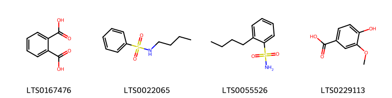
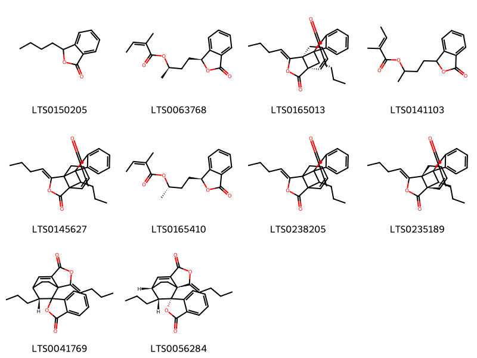
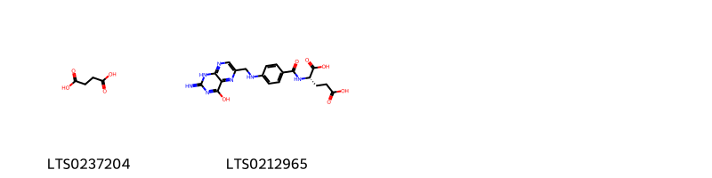
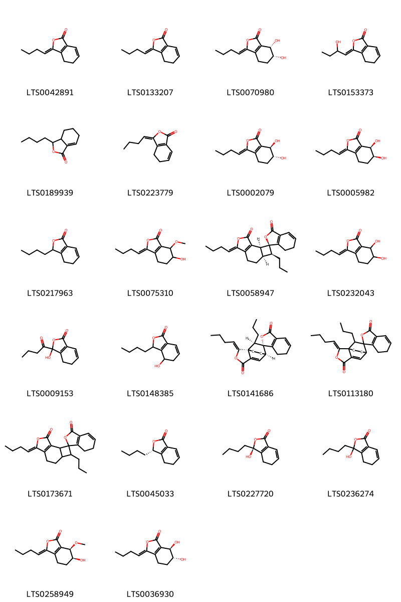
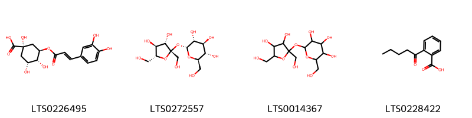
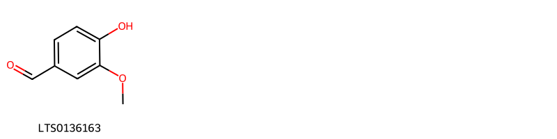
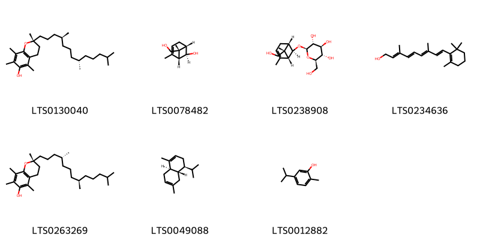
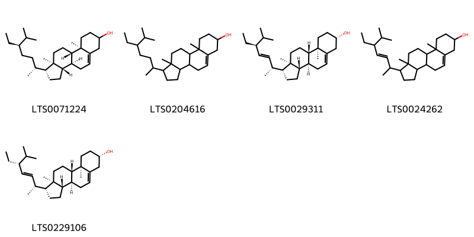

!!! abstract "Tóm tắt"

    Đương quy có tên khoa học là Angelica sinensis (Oliv.) Diels. Thuộc họ Hoa tán (Apiaceae).  Trên thế giới, cây được phân bố ở Trung Quốc, nội Mông Cổ. Tại Việt Nam, cây được trồng ở Sapa và các vùng đồng bằng ven Hà Nội.  Trong đông y, người ta sử dụng đương quy để chữa thiếu máu, cơ thể suy nhược, kinh nguyệt không đều, đau ở rốn, đẻ xong máu chảy mãi không ngừng. Đương quy được chứng minh có tác dụng dược lý trên tử cung và các cơ trơn; trên hiện tượng thiếu vitamin E; trên huyết áp và hô hấp; trên cơ tim và có tác dụng kháng sinh. Một số thành phần hóa học đã được phát hiện và xác định cấu trúc như: Các hợp chất thuộc nhóm Coumarins; các dẫn chất Phthalide ((z)-ligustilide; các hợp chất Phenolic (Ferulic acid); một số acid amin; một số vitamin (vitamin A, E),…

## Thông tin về thực vật

Dược liệu **Đương Quy (Rễ)** từ bộ phận **nan** từ loài *Angelica sinensis*.

**Mô tả thực vật:** Đương quy là một loại cây nhỏ, sống lâu năm, cao chừng 40-80cm, thân màu tím có rãnh dọc. 
Lá mọc so le, 2-3 lần xẻ lông chim, cuống dài 3-12cm, 3 đôi lá chét; đôi lá chét phía dưới có cuống dài, đôi lá chét phía trên đỉnh không có cuống; lá chét lại xẻ 1-2 lần nữa, mép có răng cưa, phía dưới cuống phát triển dài gần 1/2 cuống, ôm lấy thân. 
Hoa rất nhỏ màu xanh trắng họp thành cụm hoa hình tán kép gồm 12-40 hoa. 
Quả bế có rìa màu tím nhạt. Ra hoa vào tháng 7-8

*Tài liệu tham khảo:* "Những cây thuốc và vị thuốc Việt Nam" - Đỗ Tất Lợi 
Trong dược điển Việt nam, một loài được sử dụng làm dược liệu là *Angelica sinensis*.

!!! info "Phân loại thực vật của *Angelica sinensis*"
    - **Kingdom:** Plantae
    - **Phylum:** Tracheophyta
    - **Order:** Apiales
    - **Family:** Apiaceae
    - **Genus:** Angelica
    - **Species:** *Angelica sinensis*

**Phân bố trên thế giới:** United States of America, China, Norway, Japan, Viet Nam

**Phân bố tại Việt nam:** Không có ghi nhận ở Việt Nam

## Thông tin về dược liệu 

### Định danh

!!! info "Thông tin về tên gọi"

    - Dược liệu tiếng Việt: nan
    - Dược liệu tiếng Trung: nan (nan)
    - Dược liệu tiếng Anh: nan
    - Dược liệu latin thông dụng: nan
    - Dược liệu latin kiểu DĐVN: *radix angelicae sinensis*
    - Dược liệu latin kiểu DĐVN: *nan*
    - Dược liệu latin kiểu thông tư: *nan*
    - Bộ phận dùng: nan (nan)

### Mô tả dược liệu 

- **Theo dược điển Việt nam V:** nan

- **Mô tả dược liệu theo thông tư chế biến dược liệu theo phương pháp cổ truyền:** nan

### Chế biến 

- **Chế biến theo dược điển việt nam V**: nan

- **Chế biến theo thông tư:** nan

--- 

## Thành phần hóa học

- Theo tài liệu của GS. Đỗ Tất Lợi:  (1)
Coumarins: Imperatorin; Glaucalactone
Steroids: Stigmast-5-en-3-ol; Phytosterol; Poriferasterol
Các hợp chất phenolic: Ferulic acid; Vanillin; Carvacrol
Các dẫn chất phtalid: (z)-ligustilide; Butylidenephthalide; Butylphthalide; Senkyunolide; Phthalic acid; Sedanolide; Levistolide a; Riligustilide; 
Acid hữu cơ khác: Palmitic acid; Chlorogenic acid; Angelic acid; malic acid; Succinic acid; Myristic acid; Vanillic acid
Polyacetylen: Falcarindiol
Carbohydrates: Sucrose; Granulated sugar
Alkaloids: N-[2-(5-methoxy-1h-indol-3-yl)ethyl]ethanimidic acid; 
N-butyl-benzenesulfonamide; Leucon; 
Các vitamin: Vitamin A, E
Các hợp chất khác: Brefeldin a; Myristyl alcohol;….

(2)
Dược điển Việt Nam: acid ferulic
Dược điển Hongkong: Z-ligustilide; ferulic acid
    

**Thành phần hóa học từ loài **Angelica sinensis**

Theo cơ sở dữ liệu lotus, loài *Angelica sinensis* đã phân lập và xác định được **110** hoạt chất thuộc về các nhóm Isobenzofurans, Fatty Acyls, Phenols, Isocoumarans, Carboxylic acids and derivatives, Tetrapyrroles and derivatives, Steroids and steroid derivatives, Macrolides and analogues, Pyridines and derivatives, Diazines, Benzodioxoles, Imidazopyrimidines, Dihydrofurans, Benzene and substituted derivatives, Pyrenes, Coumarins and derivatives, Prenol lipids, Organooxygen compounds, Cinnamic acids and derivatives, Indoles and derivatives, Benzofurans, Hydroxy acids and derivatives trong bảng dưới đây. Danh sách các hoạt chất như sau 3-butyl-3-hydroxy-4,5-dihydro-2-benzofuran-1-one [(LTS0236274)](https://lotus.naturalproducts.net/compound/lotus_id/LTS0236274), (3z)-3-butylidene-5-hydroxy-2-benzofuran-1-one [(LTS0055084)](https://lotus.naturalproducts.net/compound/lotus_id/LTS0055084), 3-butanoyl-3-hydroxy-4,5-dihydro-2-benzofuran-1-one [(LTS0009153)](https://lotus.naturalproducts.net/compound/lotus_id/LTS0009153), (6r,7s)-3-butylidene-6,7-dihydroxy-4,5,6,7-tetrahydro-2-benzofuran-1-one [(LTS0070980)](https://lotus.naturalproducts.net/compound/lotus_id/LTS0070980), ferulic acid [(LTS0077328)](https://lotus.naturalproducts.net/compound/lotus_id/LTS0077328), myristyl alcohol [(LTS0226953)](https://lotus.naturalproducts.net/compound/lotus_id/LTS0226953), (1r,6r)-1-[(2r,3r)-3-heptyloxiran-2-yl]oct-7-en-2,4-diyne-1,6-diol [(LTS0256140)](https://lotus.naturalproducts.net/compound/lotus_id/LTS0256140), (6r,7r)-3-butylidene-6,7-dihydroxy-4,5,6,7-tetrahydro-2-benzofuran-1-one [(LTS0002079)](https://lotus.naturalproducts.net/compound/lotus_id/LTS0002079), (-)-malic acid [(LTS0128885)](https://lotus.naturalproducts.net/compound/lotus_id/LTS0128885), z-ligustilide [(LTS0223779)](https://lotus.naturalproducts.net/compound/lotus_id/LTS0223779), levistolide a [(LTS0267994)](https://lotus.naturalproducts.net/compound/lotus_id/LTS0267994), (8s,9z)-8-hydroxy-1-methoxyheptadec-9-en-4,6-diyn-3-one [(LTS0254006)](https://lotus.naturalproducts.net/compound/lotus_id/LTS0254006), (3s,8s)-heptadeca-1,9-dien-4,6-diyne-3,8-diol [(LTS0144952)](https://lotus.naturalproducts.net/compound/lotus_id/LTS0144952), phthalic acid [(LTS0167476)](https://lotus.naturalproducts.net/compound/lotus_id/LTS0167476), chlorogenic acid [(LTS0226495)](https://lotus.naturalproducts.net/compound/lotus_id/LTS0226495), butylidenephthalide [(LTS0147414)](https://lotus.naturalproducts.net/compound/lotus_id/LTS0147414), isosafrole [(LTS0096972)](https://lotus.naturalproducts.net/compound/lotus_id/LTS0096972), coniferyl alcohol; ferulic acid [(LTS0116969)](https://lotus.naturalproducts.net/compound/lotus_id/LTS0116969), (2r,3s)-2-hydroxy-3-(4-hydroxy-3-methoxyphenyl)-3-methoxypropyl (2e)-3-(4-hydroxy-3-methoxyphenyl)prop-2-enoate [(LTS0241093)](https://lotus.naturalproducts.net/compound/lotus_id/LTS0241093), (1r,1's,6'r,9'z,11'r)-9'-butylidene-11'-propyl-8'-oxaspiro[2-benzofuran-1,10'-tricyclo[4.3.2.0¹,⁶]undecan]-4'-ene-3,7'-dione [(LTS0165013)](https://lotus.naturalproducts.net/compound/lotus_id/LTS0165013), sassafras [(LTS0136093)](https://lotus.naturalproducts.net/compound/lotus_id/LTS0136093), 8-hydroxy-1-methoxyheptadec-9-en-4,6-diyn-3-one [(LTS0046394)](https://lotus.naturalproducts.net/compound/lotus_id/LTS0046394), vitamin e [(LTS0263269)](https://lotus.naturalproducts.net/compound/lotus_id/LTS0263269), (2r)-2,5,7,8-tetramethyl-2-[(4s,8s)-4,8,12-trimethyltridecyl]-3,4-dihydro-1-benzopyran-6-ol [(LTS0130040)](https://lotus.naturalproducts.net/compound/lotus_id/LTS0130040), butylidenephthalide [(LTS0259092)](https://lotus.naturalproducts.net/compound/lotus_id/LTS0259092), oplopandiol [(LTS0196269)](https://lotus.naturalproducts.net/compound/lotus_id/LTS0196269), butylphthalide [(LTS0150205)](https://lotus.naturalproducts.net/compound/lotus_id/LTS0150205), carvacrol [(LTS0012882)](https://lotus.naturalproducts.net/compound/lotus_id/LTS0012882), riligustilide [(LTS0058947)](https://lotus.naturalproducts.net/compound/lotus_id/LTS0058947), 2-(4-hydroxyphenyl)ethyl (2e)-3-(4-hydroxy-3-methoxyphenyl)prop-2-enoate [(LTS0158735)](https://lotus.naturalproducts.net/compound/lotus_id/LTS0158735), 2-(4-hydroxyphenyl)ethyl 3-(4-hydroxy-3-methoxyphenyl)prop-2-enoate [(LTS0196798)](https://lotus.naturalproducts.net/compound/lotus_id/LTS0196798), (z)-ligustilide [(LTS0042891)](https://lotus.naturalproducts.net/compound/lotus_id/LTS0042891), (9z,11s,16r)-11,16-dihydroxyoctadeca-9,17-dien-12,14-diyn-1-yl acetate [(LTS0173109)](https://lotus.naturalproducts.net/compound/lotus_id/LTS0173109), (3z,6s,7r)-3-butylidene-6-hydroxy-7-methoxy-4,5,6,7-tetrahydro-2-benzofuran-1-one [(LTS0258949)](https://lotus.naturalproducts.net/compound/lotus_id/LTS0258949), 3-butylidene-7-hydroxy-2-benzofuran-1-one [(LTS0050884)](https://lotus.naturalproducts.net/compound/lotus_id/LTS0050884), z-butylidenephthalide [(LTS0020784)](https://lotus.naturalproducts.net/compound/lotus_id/LTS0020784), 3-butylidene-4,5-dihydro-2-benzofuran-1-one [(LTS0133207)](https://lotus.naturalproducts.net/compound/lotus_id/LTS0133207), (3z,6s,7r)-3-butylidene-6,7-dihydroxy-4,5,6,7-tetrahydro-2-benzofuran-1-one [(LTS0005982)](https://lotus.naturalproducts.net/compound/lotus_id/LTS0005982), heptadec-9-en-4,6-diyne-3,8-diol [(LTS0024165)](https://lotus.naturalproducts.net/compound/lotus_id/LTS0024165), 3-butyl-4-hydroxy-4,5-dihydro-3h-2-benzofuran-1-one [(LTS0148385)](https://lotus.naturalproducts.net/compound/lotus_id/LTS0148385), n-butyl-benzenesulfonamide [(LTS0022065)](https://lotus.naturalproducts.net/compound/lotus_id/LTS0022065), benzopyrene [(LTS0143131)](https://lotus.naturalproducts.net/compound/lotus_id/LTS0143131), (2r,3s,4s,5r,6r)-2-(hydroxymethyl)-6-{[(1r,5s,6r,7r)-7-(hydroxymethyl)-2,7-dimethylbicyclo[3.1.1]hept-2-en-6-yl]oxy}oxane-3,4,5-triol [(LTS0238908)](https://lotus.naturalproducts.net/compound/lotus_id/LTS0238908), 1-dodecanol [(LTS0116183)](https://lotus.naturalproducts.net/compound/lotus_id/LTS0116183), angelic acid [(LTS0220842)](https://lotus.naturalproducts.net/compound/lotus_id/LTS0220842), β-cadinene [(LTS0049088)](https://lotus.naturalproducts.net/compound/lotus_id/LTS0049088), (3z)-3-(2-hydroxybutylidene)-4,5-dihydro-2-benzofuran-1-one [(LTS0153373)](https://lotus.naturalproducts.net/compound/lotus_id/LTS0153373), (3z)-3-(2-hydroxybutylidene)-2-benzofuran-1-one [(LTS0173938)](https://lotus.naturalproducts.net/compound/lotus_id/LTS0173938), heptadeca-1,9-dien-4,6-diyne-3,8-diol [(LTS0241354)](https://lotus.naturalproducts.net/compound/lotus_id/LTS0241354), (3s,8s,9e)-heptadec-9-en-4,6-diyne-3,8-diol [(LTS0111178)](https://lotus.naturalproducts.net/compound/lotus_id/LTS0111178), 2-hydroxy-3-(4-hydroxy-3-methoxyphenyl)-3-methoxypropyl 3-(4-hydroxy-3-methoxyphenyl)prop-2-enoate [(LTS0207331)](https://lotus.naturalproducts.net/compound/lotus_id/LTS0207331), (1r,5s,6r,7r)-7-(hydroxymethyl)-2,7-dimethylbicyclo[3.1.1]hept-2-en-6-ol [(LTS0078482)](https://lotus.naturalproducts.net/compound/lotus_id/LTS0078482), 4-(3-oxo-1h-2-benzofuran-1-yl)butan-2-yl 2-methylbut-2-enoate [(LTS0141103)](https://lotus.naturalproducts.net/compound/lotus_id/LTS0141103), senkyunolide a [(LTS0045033)](https://lotus.naturalproducts.net/compound/lotus_id/LTS0045033), (9'z)-9'-butylidene-4'-propyl-6,7-dihydro-10'-oxaspiro[2-benzofuran-1,3'-tricyclo[6.3.0.0²,⁵]undecan]-1'(8')-ene-3,11'-dione [(LTS0173671)](https://lotus.naturalproducts.net/compound/lotus_id/LTS0173671), 3-butyl-4,5-dihydro-3h-2-benzofuran-1-one [(LTS0217963)](https://lotus.naturalproducts.net/compound/lotus_id/LTS0217963), stigmast-5-en-3-ol, (3β)- [(LTS0204616)](https://lotus.naturalproducts.net/compound/lotus_id/LTS0204616), sucrose [(LTS0272557)](https://lotus.naturalproducts.net/compound/lotus_id/LTS0272557), 3-(4-hydroxy-3-methoxyphenyl)prop-2-en-1-yl 3-(4-hydroxy-3-methoxyphenyl)prop-2-enoate [(LTS0246654)](https://lotus.naturalproducts.net/compound/lotus_id/LTS0246654), glaucalactone [(LTS0144469)](https://lotus.naturalproducts.net/compound/lotus_id/LTS0144469), succinic acid [(LTS0237204)](https://lotus.naturalproducts.net/compound/lotus_id/LTS0237204), 2,3-dihydroxy-1-(7-methoxy-2-oxochromen-6-yl)-3-methylbutyl (2z)-2-methylbut-2-enoate [(LTS0081939)](https://lotus.naturalproducts.net/compound/lotus_id/LTS0081939), (3r,8s,9z)-heptadec-9-en-4,6-diyne-3,8-diol [(LTS0202278)](https://lotus.naturalproducts.net/compound/lotus_id/LTS0202278), palmitic acid [(LTS0079439)](https://lotus.naturalproducts.net/compound/lotus_id/LTS0079439), senkyunolide b [(LTS0230911)](https://lotus.naturalproducts.net/compound/lotus_id/LTS0230911), (2r)-4-[(1s)-3-oxo-1h-2-benzofuran-1-yl]butan-2-yl (2z)-2-methylbut-2-enoate [(LTS0063768)](https://lotus.naturalproducts.net/compound/lotus_id/LTS0063768), (3z,6r,7r)-3-butylidene-6,7-dihydroxy-4,5,6,7-tetrahydro-2-benzofuran-1-one [(LTS0036930)](https://lotus.naturalproducts.net/compound/lotus_id/LTS0036930), poriferasterol [(LTS0229106)](https://lotus.naturalproducts.net/compound/lotus_id/LTS0229106), leucon [(LTS0114351)](https://lotus.naturalproducts.net/compound/lotus_id/LTS0114351), (11ar,14ar)-1,13-dihydroxy-6-methyl-1h,6h,7h,8h,9h,11ah,12h,13h,14h,14ah-cyclopenta[f]oxacyclotridecan-4-one [(LTS0216144)](https://lotus.naturalproducts.net/compound/lotus_id/LTS0216144), vanillin [(LTS0136163)](https://lotus.naturalproducts.net/compound/lotus_id/LTS0136163), (9z)-11,16-dihydroxyoctadeca-9,17-dien-12,14-diyn-1-yl acetate [(LTS0100434)](https://lotus.naturalproducts.net/compound/lotus_id/LTS0100434), coniferyl ferulate [(LTS0268137)](https://lotus.naturalproducts.net/compound/lotus_id/LTS0268137), stigmast-5-en-3-ol [(LTS0071224)](https://lotus.naturalproducts.net/compound/lotus_id/LTS0071224), (1r,1'r,6's,9'z,11's)-9'-butylidene-11'-propyl-8'-oxaspiro[2-benzofuran-1,10'-tricyclo[4.3.2.0¹,⁶]undecan]-4'-ene-3,7'-dione [(LTS0235189)](https://lotus.naturalproducts.net/compound/lotus_id/LTS0235189), n-[2-(5-methoxy-1h-indol-3-yl)ethyl]ethanimidic acid [(LTS0219322)](https://lotus.naturalproducts.net/compound/lotus_id/LTS0219322), 1-(3-heptyloxiran-2-yl)oct-7-en-2,4-diyne-1,6-diol [(LTS0183788)](https://lotus.naturalproducts.net/compound/lotus_id/LTS0183788), sedanolide [(LTS0189939)](https://lotus.naturalproducts.net/compound/lotus_id/LTS0189939), 1-[(2s,3r,4s,5r)-3-hydroxy-4-{[hydroxy([(2r)-1-({1-hydroxy-3-[(1r,2r,3r,4r,8s,13s,14s,18s,19s)-8,13,18-tris(2-carboximidatoethyl)-3,14,19-tris(c-hydroxycarbonimidoylmethyl)-1,4,6,9,9,14,16,19-octamethyl-20,21,22,23-tetraazapentacyclo[15.2.1.1²,⁵.1⁷,¹⁰.1¹²,¹⁵]tricosa-5(23),6,10(22),11,15(21),16-hexaen-4-yl]propylidene}amino)propan-2-yl]oxy)phosphoryl]oxy}-5-(hydroxymethyl)oxolan-2-yl]-5,6-dimethyl-3h-1λ⁵,3-benzodiazol-1-ylium; cyano radical [(LTS0264990)](https://lotus.naturalproducts.net/compound/lotus_id/LTS0264990), ferulic acid [(LTS0273002)](https://lotus.naturalproducts.net/compound/lotus_id/LTS0273002), 2-hydroxy-3-(4-hydroxy-3-methoxyphenyl)-3-methoxypropyl (2z)-3-(4-hydroxy-3-methoxyphenyl)prop-2-enoate [(LTS0206553)](https://lotus.naturalproducts.net/compound/lotus_id/LTS0206553), (3s,8s)-heptadec-9-en-4,6-diyne-3,8-diol [(LTS0149691)](https://lotus.naturalproducts.net/compound/lotus_id/LTS0149691), niacin [(LTS0216673)](https://lotus.naturalproducts.net/compound/lotus_id/LTS0216673), (2s)-4-[(1s)-3-oxo-1h-2-benzofuran-1-yl]butan-2-yl (2z)-2-methylbut-2-enoate [(LTS0165410)](https://lotus.naturalproducts.net/compound/lotus_id/LTS0165410), vanillic acid [(LTS0229113)](https://lotus.naturalproducts.net/compound/lotus_id/LTS0229113), 3-butylidene-6,7-dihydroxy-4,5,6,7-tetrahydro-2-benzofuran-1-one [(LTS0232043)](https://lotus.naturalproducts.net/compound/lotus_id/LTS0232043), 2-hydroxy-3-(octadeca-9,12,15-trienoyloxy)propyl octadeca-9,12,15-trienoate [(LTS0163659)](https://lotus.naturalproducts.net/compound/lotus_id/LTS0163659), vitamin a [(LTS0234636)](https://lotus.naturalproducts.net/compound/lotus_id/LTS0234636), (9'z)-9'-butylidene-11'-propyl-8'-oxaspiro[2-benzofuran-1,10'-tricyclo[4.3.2.0¹,⁶]undecan]-4'-ene-3,7'-dione [(LTS0145627)](https://lotus.naturalproducts.net/compound/lotus_id/LTS0145627), imperatorin [(LTS0113114)](https://lotus.naturalproducts.net/compound/lotus_id/LTS0113114), phytosterol [(LTS0029311)](https://lotus.naturalproducts.net/compound/lotus_id/LTS0029311), (3s)-3-butyl-3-hydroxy-4,5-dihydro-2-benzofuran-1-one [(LTS0227720)](https://lotus.naturalproducts.net/compound/lotus_id/LTS0227720), (3s,8r)-heptadeca-1,9-dien-4,6-diyne-3,8-diol [(LTS0083933)](https://lotus.naturalproducts.net/compound/lotus_id/LTS0083933), (1r,1's,2'z,7'r,9'r)-2'-butylidene-9'-propyl-6,7-dihydro-3'-oxaspiro[2-benzofuran-1,8'-tricyclo[5.2.2.0¹,⁵]undecan]-5'-ene-3,4'-dione [(LTS0141686)](https://lotus.naturalproducts.net/compound/lotus_id/LTS0141686), falcarindiol [(LTS0127360)](https://lotus.naturalproducts.net/compound/lotus_id/LTS0127360), myristic acid [(LTS0102566)](https://lotus.naturalproducts.net/compound/lotus_id/LTS0102566), brefeldin a [(LTS0040667)](https://lotus.naturalproducts.net/compound/lotus_id/LTS0040667), 9'-butylidene-11'-propyl-8'-oxaspiro[2-benzofuran-1,10'-tricyclo[4.3.2.0¹,⁶]undecan]-4'-ene-3,7'-dione [(LTS0238205)](https://lotus.naturalproducts.net/compound/lotus_id/LTS0238205), 3-butylidene-6-hydroxy-7-methoxy-4,5,6,7-tetrahydro-2-benzofuran-1-one [(LTS0075310)](https://lotus.naturalproducts.net/compound/lotus_id/LTS0075310), acid, folic [(LTS0212965)](https://lotus.naturalproducts.net/compound/lotus_id/LTS0212965), 2'-butylidene-9'-propyl-6,7-dihydro-3'-oxaspiro[2-benzofuran-1,8'-tricyclo[5.2.2.0¹,⁵]undecan]-5'-ene-3,4'-dione [(LTS0113180)](https://lotus.naturalproducts.net/compound/lotus_id/LTS0113180), pirod [(LTS0008205)](https://lotus.naturalproducts.net/compound/lotus_id/LTS0008205), 1,3-dilinolenoylglycerol [(LTS0136567)](https://lotus.naturalproducts.net/compound/lotus_id/LTS0136567), 2-pentanoylbenzoic acid [(LTS0228422)](https://lotus.naturalproducts.net/compound/lotus_id/LTS0228422), granulated sugar [(LTS0014367)](https://lotus.naturalproducts.net/compound/lotus_id/LTS0014367), stigmasterol [(LTS0024262)](https://lotus.naturalproducts.net/compound/lotus_id/LTS0024262), 2-butylbenzenesulfonamide [(LTS0055526)](https://lotus.naturalproducts.net/compound/lotus_id/LTS0055526), (1s,1'r,2'z,7's,8'r)-2'-butylidene-8'-propyl-3'-oxaspiro[2-benzofuran-1,9'-tricyclo[5.2.2.0¹,⁵]undecan]-5'-ene-3,4'-dione [(LTS0056284)](https://lotus.naturalproducts.net/compound/lotus_id/LTS0056284), (2'z,8'r)-2'-butylidene-8'-propyl-3'-oxaspiro[2-benzofuran-1,9'-tricyclo[5.2.2.0¹,⁵]undecan]-5'-ene-3,4'-dione [(LTS0041769)](https://lotus.naturalproducts.net/compound/lotus_id/LTS0041769), 11,16-dihydroxyoctadeca-9,17-dien-12,14-diyn-1-yl acetate [(LTS0235938)](https://lotus.naturalproducts.net/compound/lotus_id/LTS0235938). 
        
| chemicalTaxonomyClassyfireClass     |   smiles_count |
|:------------------------------------|---------------:|
| Benzene and substituted derivatives |             83 |
| Benzodioxoles                       |             40 |
| Benzofurans                         |            503 |
| Carboxylic acids and derivatives    |             78 |
| Cinnamic acids and derivatives      |            404 |
| Coumarins and derivatives           |            118 |
| Diazines                            |             12 |
| Dihydrofurans                       |             73 |
| Fatty Acyls                         |            779 |
| Hydroxy acids and derivatives       |             21 |
| Imidazopyrimidines                  |             18 |
| Indoles and derivatives             |             29 |
| Isobenzofurans                      |            774 |
| Isocoumarans                        |            176 |
| Macrolides and analogues            |            100 |
| Organooxygen compounds              |            205 |
| Phenols                             |             16 |
| Prenol lipids                       |            346 |
| Pyrenes                             |             32 |
| Pyridines and derivatives           |             14 |
| Steroids and steroid derivatives    |            362 |
| Tetrapyrroles and derivatives       |            258 |

            
### Nhóm Benzene and substituted derivatives
<figure markdown="span">
    { width=100% }
<figcaption>Hình ảnh cấu trúc hóa học của hoạt chất thuộc nhóm *Benzene and substituted derivatives*. Tên thường gọi của các hoạt chất tương ứng là phthalic acid [(LTS0167476)](https://lotus.naturalproducts.net/compound/lotus_id/LTS0167476), n-butyl-benzenesulfonamide [(LTS0022065)](https://lotus.naturalproducts.net/compound/lotus_id/LTS0022065), 2-butylbenzenesulfonamide [(LTS0055526)](https://lotus.naturalproducts.net/compound/lotus_id/LTS0055526), vanillic acid [(LTS0229113)](https://lotus.naturalproducts.net/compound/lotus_id/LTS0229113).</figcaption>
</figure>

            
            
### Nhóm Benzene and substituted derivatives
<figure markdown="span">
    { width=100% }
<figcaption>Hình ảnh cấu trúc hóa học của hoạt chất thuộc nhóm *Benzene and substituted derivatives*. Tên thường gọi của các hoạt chất tương ứng là phthalic acid [(LTS0167476)](https://lotus.naturalproducts.net/compound/lotus_id/LTS0167476), n-butyl-benzenesulfonamide [(LTS0022065)](https://lotus.naturalproducts.net/compound/lotus_id/LTS0022065), 2-butylbenzenesulfonamide [(LTS0055526)](https://lotus.naturalproducts.net/compound/lotus_id/LTS0055526), vanillic acid [(LTS0229113)](https://lotus.naturalproducts.net/compound/lotus_id/LTS0229113).</figcaption>
</figure>

### Nhóm Benzodioxoles
<figure markdown="span">
    { width=100% }
<figcaption>Hình ảnh cấu trúc hóa học của hoạt chất thuộc nhóm *Benzodioxoles*. Tên thường gọi của các hoạt chất tương ứng là isosafrole [(LTS0096972)](https://lotus.naturalproducts.net/compound/lotus_id/LTS0096972), sassafras [(LTS0136093)](https://lotus.naturalproducts.net/compound/lotus_id/LTS0136093).</figcaption>
</figure>

            
            
### Nhóm Benzene and substituted derivatives
<figure markdown="span">
    { width=100% }
<figcaption>Hình ảnh cấu trúc hóa học của hoạt chất thuộc nhóm *Benzene and substituted derivatives*. Tên thường gọi của các hoạt chất tương ứng là phthalic acid [(LTS0167476)](https://lotus.naturalproducts.net/compound/lotus_id/LTS0167476), n-butyl-benzenesulfonamide [(LTS0022065)](https://lotus.naturalproducts.net/compound/lotus_id/LTS0022065), 2-butylbenzenesulfonamide [(LTS0055526)](https://lotus.naturalproducts.net/compound/lotus_id/LTS0055526), vanillic acid [(LTS0229113)](https://lotus.naturalproducts.net/compound/lotus_id/LTS0229113).</figcaption>
</figure>

### Nhóm Benzodioxoles
<figure markdown="span">
    { width=100% }
<figcaption>Hình ảnh cấu trúc hóa học của hoạt chất thuộc nhóm *Benzodioxoles*. Tên thường gọi của các hoạt chất tương ứng là isosafrole [(LTS0096972)](https://lotus.naturalproducts.net/compound/lotus_id/LTS0096972), sassafras [(LTS0136093)](https://lotus.naturalproducts.net/compound/lotus_id/LTS0136093).</figcaption>
</figure>

### Nhóm Benzofurans
<figure markdown="span">
    { width=100% }
<figcaption>Hình ảnh cấu trúc hóa học của hoạt chất thuộc nhóm *Benzofurans*. Tên thường gọi của các hoạt chất tương ứng là butylphthalide [(LTS0150205)](https://lotus.naturalproducts.net/compound/lotus_id/LTS0150205), (2r)-4-[(1s)-3-oxo-1h-2-benzofuran-1-yl]butan-2-yl (2z)-2-methylbut-2-enoate [(LTS0063768)](https://lotus.naturalproducts.net/compound/lotus_id/LTS0063768), (1r,1's,6'r,9'z,11'r)-9'-butylidene-11'-propyl-8'-oxaspiro[2-benzofuran-1,10'-tricyclo[4.3.2.0¹,⁶]undecan]-4'-ene-3,7'-dione [(LTS0165013)](https://lotus.naturalproducts.net/compound/lotus_id/LTS0165013), 4-(3-oxo-1h-2-benzofuran-1-yl)butan-2-yl 2-methylbut-2-enoate [(LTS0141103)](https://lotus.naturalproducts.net/compound/lotus_id/LTS0141103), (9'z)-9'-butylidene-11'-propyl-8'-oxaspiro[2-benzofuran-1,10'-tricyclo[4.3.2.0¹,⁶]undecan]-4'-ene-3,7'-dione [(LTS0145627)](https://lotus.naturalproducts.net/compound/lotus_id/LTS0145627), (2s)-4-[(1s)-3-oxo-1h-2-benzofuran-1-yl]butan-2-yl (2z)-2-methylbut-2-enoate [(LTS0165410)](https://lotus.naturalproducts.net/compound/lotus_id/LTS0165410), 9'-butylidene-11'-propyl-8'-oxaspiro[2-benzofuran-1,10'-tricyclo[4.3.2.0¹,⁶]undecan]-4'-ene-3,7'-dione [(LTS0238205)](https://lotus.naturalproducts.net/compound/lotus_id/LTS0238205), (1r,1'r,6's,9'z,11's)-9'-butylidene-11'-propyl-8'-oxaspiro[2-benzofuran-1,10'-tricyclo[4.3.2.0¹,⁶]undecan]-4'-ene-3,7'-dione [(LTS0235189)](https://lotus.naturalproducts.net/compound/lotus_id/LTS0235189), (2'z,8'r)-2'-butylidene-8'-propyl-3'-oxaspiro[2-benzofuran-1,9'-tricyclo[5.2.2.0¹,⁵]undecan]-5'-ene-3,4'-dione [(LTS0041769)](https://lotus.naturalproducts.net/compound/lotus_id/LTS0041769), (1s,1'r,2'z,7's,8'r)-2'-butylidene-8'-propyl-3'-oxaspiro[2-benzofuran-1,9'-tricyclo[5.2.2.0¹,⁵]undecan]-5'-ene-3,4'-dione [(LTS0056284)](https://lotus.naturalproducts.net/compound/lotus_id/LTS0056284).</figcaption>
</figure>

            
            
### Nhóm Benzene and substituted derivatives
<figure markdown="span">
    { width=100% }
<figcaption>Hình ảnh cấu trúc hóa học của hoạt chất thuộc nhóm *Benzene and substituted derivatives*. Tên thường gọi của các hoạt chất tương ứng là phthalic acid [(LTS0167476)](https://lotus.naturalproducts.net/compound/lotus_id/LTS0167476), n-butyl-benzenesulfonamide [(LTS0022065)](https://lotus.naturalproducts.net/compound/lotus_id/LTS0022065), 2-butylbenzenesulfonamide [(LTS0055526)](https://lotus.naturalproducts.net/compound/lotus_id/LTS0055526), vanillic acid [(LTS0229113)](https://lotus.naturalproducts.net/compound/lotus_id/LTS0229113).</figcaption>
</figure>

### Nhóm Benzodioxoles
<figure markdown="span">
    { width=100% }
<figcaption>Hình ảnh cấu trúc hóa học của hoạt chất thuộc nhóm *Benzodioxoles*. Tên thường gọi của các hoạt chất tương ứng là isosafrole [(LTS0096972)](https://lotus.naturalproducts.net/compound/lotus_id/LTS0096972), sassafras [(LTS0136093)](https://lotus.naturalproducts.net/compound/lotus_id/LTS0136093).</figcaption>
</figure>

### Nhóm Benzofurans
<figure markdown="span">
    { width=100% }
<figcaption>Hình ảnh cấu trúc hóa học của hoạt chất thuộc nhóm *Benzofurans*. Tên thường gọi của các hoạt chất tương ứng là butylphthalide [(LTS0150205)](https://lotus.naturalproducts.net/compound/lotus_id/LTS0150205), (2r)-4-[(1s)-3-oxo-1h-2-benzofuran-1-yl]butan-2-yl (2z)-2-methylbut-2-enoate [(LTS0063768)](https://lotus.naturalproducts.net/compound/lotus_id/LTS0063768), (1r,1's,6'r,9'z,11'r)-9'-butylidene-11'-propyl-8'-oxaspiro[2-benzofuran-1,10'-tricyclo[4.3.2.0¹,⁶]undecan]-4'-ene-3,7'-dione [(LTS0165013)](https://lotus.naturalproducts.net/compound/lotus_id/LTS0165013), 4-(3-oxo-1h-2-benzofuran-1-yl)butan-2-yl 2-methylbut-2-enoate [(LTS0141103)](https://lotus.naturalproducts.net/compound/lotus_id/LTS0141103), (9'z)-9'-butylidene-11'-propyl-8'-oxaspiro[2-benzofuran-1,10'-tricyclo[4.3.2.0¹,⁶]undecan]-4'-ene-3,7'-dione [(LTS0145627)](https://lotus.naturalproducts.net/compound/lotus_id/LTS0145627), (2s)-4-[(1s)-3-oxo-1h-2-benzofuran-1-yl]butan-2-yl (2z)-2-methylbut-2-enoate [(LTS0165410)](https://lotus.naturalproducts.net/compound/lotus_id/LTS0165410), 9'-butylidene-11'-propyl-8'-oxaspiro[2-benzofuran-1,10'-tricyclo[4.3.2.0¹,⁶]undecan]-4'-ene-3,7'-dione [(LTS0238205)](https://lotus.naturalproducts.net/compound/lotus_id/LTS0238205), (1r,1'r,6's,9'z,11's)-9'-butylidene-11'-propyl-8'-oxaspiro[2-benzofuran-1,10'-tricyclo[4.3.2.0¹,⁶]undecan]-4'-ene-3,7'-dione [(LTS0235189)](https://lotus.naturalproducts.net/compound/lotus_id/LTS0235189), (2'z,8'r)-2'-butylidene-8'-propyl-3'-oxaspiro[2-benzofuran-1,9'-tricyclo[5.2.2.0¹,⁵]undecan]-5'-ene-3,4'-dione [(LTS0041769)](https://lotus.naturalproducts.net/compound/lotus_id/LTS0041769), (1s,1'r,2'z,7's,8'r)-2'-butylidene-8'-propyl-3'-oxaspiro[2-benzofuran-1,9'-tricyclo[5.2.2.0¹,⁵]undecan]-5'-ene-3,4'-dione [(LTS0056284)](https://lotus.naturalproducts.net/compound/lotus_id/LTS0056284).</figcaption>
</figure>

### Nhóm Carboxylic acids and derivatives
<figure markdown="span">
    { width=100% }
<figcaption>Hình ảnh cấu trúc hóa học của hoạt chất thuộc nhóm *Carboxylic acids and derivatives*. Tên thường gọi của các hoạt chất tương ứng là succinic acid [(LTS0237204)](https://lotus.naturalproducts.net/compound/lotus_id/LTS0237204), acid, folic [(LTS0212965)](https://lotus.naturalproducts.net/compound/lotus_id/LTS0212965).</figcaption>
</figure>

            
            
### Nhóm Benzene and substituted derivatives
<figure markdown="span">
    { width=100% }
<figcaption>Hình ảnh cấu trúc hóa học của hoạt chất thuộc nhóm *Benzene and substituted derivatives*. Tên thường gọi của các hoạt chất tương ứng là phthalic acid [(LTS0167476)](https://lotus.naturalproducts.net/compound/lotus_id/LTS0167476), n-butyl-benzenesulfonamide [(LTS0022065)](https://lotus.naturalproducts.net/compound/lotus_id/LTS0022065), 2-butylbenzenesulfonamide [(LTS0055526)](https://lotus.naturalproducts.net/compound/lotus_id/LTS0055526), vanillic acid [(LTS0229113)](https://lotus.naturalproducts.net/compound/lotus_id/LTS0229113).</figcaption>
</figure>

### Nhóm Benzodioxoles
<figure markdown="span">
    { width=100% }
<figcaption>Hình ảnh cấu trúc hóa học của hoạt chất thuộc nhóm *Benzodioxoles*. Tên thường gọi của các hoạt chất tương ứng là isosafrole [(LTS0096972)](https://lotus.naturalproducts.net/compound/lotus_id/LTS0096972), sassafras [(LTS0136093)](https://lotus.naturalproducts.net/compound/lotus_id/LTS0136093).</figcaption>
</figure>

### Nhóm Benzofurans
<figure markdown="span">
    { width=100% }
<figcaption>Hình ảnh cấu trúc hóa học của hoạt chất thuộc nhóm *Benzofurans*. Tên thường gọi của các hoạt chất tương ứng là butylphthalide [(LTS0150205)](https://lotus.naturalproducts.net/compound/lotus_id/LTS0150205), (2r)-4-[(1s)-3-oxo-1h-2-benzofuran-1-yl]butan-2-yl (2z)-2-methylbut-2-enoate [(LTS0063768)](https://lotus.naturalproducts.net/compound/lotus_id/LTS0063768), (1r,1's,6'r,9'z,11'r)-9'-butylidene-11'-propyl-8'-oxaspiro[2-benzofuran-1,10'-tricyclo[4.3.2.0¹,⁶]undecan]-4'-ene-3,7'-dione [(LTS0165013)](https://lotus.naturalproducts.net/compound/lotus_id/LTS0165013), 4-(3-oxo-1h-2-benzofuran-1-yl)butan-2-yl 2-methylbut-2-enoate [(LTS0141103)](https://lotus.naturalproducts.net/compound/lotus_id/LTS0141103), (9'z)-9'-butylidene-11'-propyl-8'-oxaspiro[2-benzofuran-1,10'-tricyclo[4.3.2.0¹,⁶]undecan]-4'-ene-3,7'-dione [(LTS0145627)](https://lotus.naturalproducts.net/compound/lotus_id/LTS0145627), (2s)-4-[(1s)-3-oxo-1h-2-benzofuran-1-yl]butan-2-yl (2z)-2-methylbut-2-enoate [(LTS0165410)](https://lotus.naturalproducts.net/compound/lotus_id/LTS0165410), 9'-butylidene-11'-propyl-8'-oxaspiro[2-benzofuran-1,10'-tricyclo[4.3.2.0¹,⁶]undecan]-4'-ene-3,7'-dione [(LTS0238205)](https://lotus.naturalproducts.net/compound/lotus_id/LTS0238205), (1r,1'r,6's,9'z,11's)-9'-butylidene-11'-propyl-8'-oxaspiro[2-benzofuran-1,10'-tricyclo[4.3.2.0¹,⁶]undecan]-4'-ene-3,7'-dione [(LTS0235189)](https://lotus.naturalproducts.net/compound/lotus_id/LTS0235189), (2'z,8'r)-2'-butylidene-8'-propyl-3'-oxaspiro[2-benzofuran-1,9'-tricyclo[5.2.2.0¹,⁵]undecan]-5'-ene-3,4'-dione [(LTS0041769)](https://lotus.naturalproducts.net/compound/lotus_id/LTS0041769), (1s,1'r,2'z,7's,8'r)-2'-butylidene-8'-propyl-3'-oxaspiro[2-benzofuran-1,9'-tricyclo[5.2.2.0¹,⁵]undecan]-5'-ene-3,4'-dione [(LTS0056284)](https://lotus.naturalproducts.net/compound/lotus_id/LTS0056284).</figcaption>
</figure>

### Nhóm Carboxylic acids and derivatives
<figure markdown="span">
    { width=100% }
<figcaption>Hình ảnh cấu trúc hóa học của hoạt chất thuộc nhóm *Carboxylic acids and derivatives*. Tên thường gọi của các hoạt chất tương ứng là succinic acid [(LTS0237204)](https://lotus.naturalproducts.net/compound/lotus_id/LTS0237204), acid, folic [(LTS0212965)](https://lotus.naturalproducts.net/compound/lotus_id/LTS0212965).</figcaption>
</figure>

### Nhóm Cinnamic acids and derivatives
<figure markdown="span">
    { width=100% }
<figcaption>Hình ảnh cấu trúc hóa học của hoạt chất thuộc nhóm *Cinnamic acids and derivatives*. Tên thường gọi của các hoạt chất tương ứng là ferulic acid [(LTS0077328)](https://lotus.naturalproducts.net/compound/lotus_id/LTS0077328), ferulic acid [(LTS0273002)](https://lotus.naturalproducts.net/compound/lotus_id/LTS0273002), 2-hydroxy-3-(4-hydroxy-3-methoxyphenyl)-3-methoxypropyl (2z)-3-(4-hydroxy-3-methoxyphenyl)prop-2-enoate [(LTS0206553)](https://lotus.naturalproducts.net/compound/lotus_id/LTS0206553), 2-(4-hydroxyphenyl)ethyl (2e)-3-(4-hydroxy-3-methoxyphenyl)prop-2-enoate [(LTS0158735)](https://lotus.naturalproducts.net/compound/lotus_id/LTS0158735), (2r,3s)-2-hydroxy-3-(4-hydroxy-3-methoxyphenyl)-3-methoxypropyl (2e)-3-(4-hydroxy-3-methoxyphenyl)prop-2-enoate [(LTS0241093)](https://lotus.naturalproducts.net/compound/lotus_id/LTS0241093), coniferyl alcohol; ferulic acid [(LTS0116969)](https://lotus.naturalproducts.net/compound/lotus_id/LTS0116969), 3-(4-hydroxy-3-methoxyphenyl)prop-2-en-1-yl 3-(4-hydroxy-3-methoxyphenyl)prop-2-enoate [(LTS0246654)](https://lotus.naturalproducts.net/compound/lotus_id/LTS0246654), 2-(4-hydroxyphenyl)ethyl 3-(4-hydroxy-3-methoxyphenyl)prop-2-enoate [(LTS0196798)](https://lotus.naturalproducts.net/compound/lotus_id/LTS0196798), 2-hydroxy-3-(4-hydroxy-3-methoxyphenyl)-3-methoxypropyl 3-(4-hydroxy-3-methoxyphenyl)prop-2-enoate [(LTS0207331)](https://lotus.naturalproducts.net/compound/lotus_id/LTS0207331), coniferyl ferulate [(LTS0268137)](https://lotus.naturalproducts.net/compound/lotus_id/LTS0268137).</figcaption>
</figure>

            
            
### Nhóm Benzene and substituted derivatives
<figure markdown="span">
    { width=100% }
<figcaption>Hình ảnh cấu trúc hóa học của hoạt chất thuộc nhóm *Benzene and substituted derivatives*. Tên thường gọi của các hoạt chất tương ứng là phthalic acid [(LTS0167476)](https://lotus.naturalproducts.net/compound/lotus_id/LTS0167476), n-butyl-benzenesulfonamide [(LTS0022065)](https://lotus.naturalproducts.net/compound/lotus_id/LTS0022065), 2-butylbenzenesulfonamide [(LTS0055526)](https://lotus.naturalproducts.net/compound/lotus_id/LTS0055526), vanillic acid [(LTS0229113)](https://lotus.naturalproducts.net/compound/lotus_id/LTS0229113).</figcaption>
</figure>

### Nhóm Benzodioxoles
<figure markdown="span">
    { width=100% }
<figcaption>Hình ảnh cấu trúc hóa học của hoạt chất thuộc nhóm *Benzodioxoles*. Tên thường gọi của các hoạt chất tương ứng là isosafrole [(LTS0096972)](https://lotus.naturalproducts.net/compound/lotus_id/LTS0096972), sassafras [(LTS0136093)](https://lotus.naturalproducts.net/compound/lotus_id/LTS0136093).</figcaption>
</figure>

### Nhóm Benzofurans
<figure markdown="span">
    { width=100% }
<figcaption>Hình ảnh cấu trúc hóa học của hoạt chất thuộc nhóm *Benzofurans*. Tên thường gọi của các hoạt chất tương ứng là butylphthalide [(LTS0150205)](https://lotus.naturalproducts.net/compound/lotus_id/LTS0150205), (2r)-4-[(1s)-3-oxo-1h-2-benzofuran-1-yl]butan-2-yl (2z)-2-methylbut-2-enoate [(LTS0063768)](https://lotus.naturalproducts.net/compound/lotus_id/LTS0063768), (1r,1's,6'r,9'z,11'r)-9'-butylidene-11'-propyl-8'-oxaspiro[2-benzofuran-1,10'-tricyclo[4.3.2.0¹,⁶]undecan]-4'-ene-3,7'-dione [(LTS0165013)](https://lotus.naturalproducts.net/compound/lotus_id/LTS0165013), 4-(3-oxo-1h-2-benzofuran-1-yl)butan-2-yl 2-methylbut-2-enoate [(LTS0141103)](https://lotus.naturalproducts.net/compound/lotus_id/LTS0141103), (9'z)-9'-butylidene-11'-propyl-8'-oxaspiro[2-benzofuran-1,10'-tricyclo[4.3.2.0¹,⁶]undecan]-4'-ene-3,7'-dione [(LTS0145627)](https://lotus.naturalproducts.net/compound/lotus_id/LTS0145627), (2s)-4-[(1s)-3-oxo-1h-2-benzofuran-1-yl]butan-2-yl (2z)-2-methylbut-2-enoate [(LTS0165410)](https://lotus.naturalproducts.net/compound/lotus_id/LTS0165410), 9'-butylidene-11'-propyl-8'-oxaspiro[2-benzofuran-1,10'-tricyclo[4.3.2.0¹,⁶]undecan]-4'-ene-3,7'-dione [(LTS0238205)](https://lotus.naturalproducts.net/compound/lotus_id/LTS0238205), (1r,1'r,6's,9'z,11's)-9'-butylidene-11'-propyl-8'-oxaspiro[2-benzofuran-1,10'-tricyclo[4.3.2.0¹,⁶]undecan]-4'-ene-3,7'-dione [(LTS0235189)](https://lotus.naturalproducts.net/compound/lotus_id/LTS0235189), (2'z,8'r)-2'-butylidene-8'-propyl-3'-oxaspiro[2-benzofuran-1,9'-tricyclo[5.2.2.0¹,⁵]undecan]-5'-ene-3,4'-dione [(LTS0041769)](https://lotus.naturalproducts.net/compound/lotus_id/LTS0041769), (1s,1'r,2'z,7's,8'r)-2'-butylidene-8'-propyl-3'-oxaspiro[2-benzofuran-1,9'-tricyclo[5.2.2.0¹,⁵]undecan]-5'-ene-3,4'-dione [(LTS0056284)](https://lotus.naturalproducts.net/compound/lotus_id/LTS0056284).</figcaption>
</figure>

### Nhóm Carboxylic acids and derivatives
<figure markdown="span">
    { width=100% }
<figcaption>Hình ảnh cấu trúc hóa học của hoạt chất thuộc nhóm *Carboxylic acids and derivatives*. Tên thường gọi của các hoạt chất tương ứng là succinic acid [(LTS0237204)](https://lotus.naturalproducts.net/compound/lotus_id/LTS0237204), acid, folic [(LTS0212965)](https://lotus.naturalproducts.net/compound/lotus_id/LTS0212965).</figcaption>
</figure>

### Nhóm Cinnamic acids and derivatives
<figure markdown="span">
    { width=100% }
<figcaption>Hình ảnh cấu trúc hóa học của hoạt chất thuộc nhóm *Cinnamic acids and derivatives*. Tên thường gọi của các hoạt chất tương ứng là ferulic acid [(LTS0077328)](https://lotus.naturalproducts.net/compound/lotus_id/LTS0077328), ferulic acid [(LTS0273002)](https://lotus.naturalproducts.net/compound/lotus_id/LTS0273002), 2-hydroxy-3-(4-hydroxy-3-methoxyphenyl)-3-methoxypropyl (2z)-3-(4-hydroxy-3-methoxyphenyl)prop-2-enoate [(LTS0206553)](https://lotus.naturalproducts.net/compound/lotus_id/LTS0206553), 2-(4-hydroxyphenyl)ethyl (2e)-3-(4-hydroxy-3-methoxyphenyl)prop-2-enoate [(LTS0158735)](https://lotus.naturalproducts.net/compound/lotus_id/LTS0158735), (2r,3s)-2-hydroxy-3-(4-hydroxy-3-methoxyphenyl)-3-methoxypropyl (2e)-3-(4-hydroxy-3-methoxyphenyl)prop-2-enoate [(LTS0241093)](https://lotus.naturalproducts.net/compound/lotus_id/LTS0241093), coniferyl alcohol; ferulic acid [(LTS0116969)](https://lotus.naturalproducts.net/compound/lotus_id/LTS0116969), 3-(4-hydroxy-3-methoxyphenyl)prop-2-en-1-yl 3-(4-hydroxy-3-methoxyphenyl)prop-2-enoate [(LTS0246654)](https://lotus.naturalproducts.net/compound/lotus_id/LTS0246654), 2-(4-hydroxyphenyl)ethyl 3-(4-hydroxy-3-methoxyphenyl)prop-2-enoate [(LTS0196798)](https://lotus.naturalproducts.net/compound/lotus_id/LTS0196798), 2-hydroxy-3-(4-hydroxy-3-methoxyphenyl)-3-methoxypropyl 3-(4-hydroxy-3-methoxyphenyl)prop-2-enoate [(LTS0207331)](https://lotus.naturalproducts.net/compound/lotus_id/LTS0207331), coniferyl ferulate [(LTS0268137)](https://lotus.naturalproducts.net/compound/lotus_id/LTS0268137).</figcaption>
</figure>

### Nhóm Coumarins and derivatives
<figure markdown="span">
    { width=100% }
<figcaption>Hình ảnh cấu trúc hóa học của hoạt chất thuộc nhóm *Coumarins and derivatives*. Tên thường gọi của các hoạt chất tương ứng là imperatorin [(LTS0113114)](https://lotus.naturalproducts.net/compound/lotus_id/LTS0113114), glaucalactone [(LTS0144469)](https://lotus.naturalproducts.net/compound/lotus_id/LTS0144469), 2,3-dihydroxy-1-(7-methoxy-2-oxochromen-6-yl)-3-methylbutyl (2z)-2-methylbut-2-enoate [(LTS0081939)](https://lotus.naturalproducts.net/compound/lotus_id/LTS0081939).</figcaption>
</figure>

            
            
### Nhóm Benzene and substituted derivatives
<figure markdown="span">
    { width=100% }
<figcaption>Hình ảnh cấu trúc hóa học của hoạt chất thuộc nhóm *Benzene and substituted derivatives*. Tên thường gọi của các hoạt chất tương ứng là phthalic acid [(LTS0167476)](https://lotus.naturalproducts.net/compound/lotus_id/LTS0167476), n-butyl-benzenesulfonamide [(LTS0022065)](https://lotus.naturalproducts.net/compound/lotus_id/LTS0022065), 2-butylbenzenesulfonamide [(LTS0055526)](https://lotus.naturalproducts.net/compound/lotus_id/LTS0055526), vanillic acid [(LTS0229113)](https://lotus.naturalproducts.net/compound/lotus_id/LTS0229113).</figcaption>
</figure>

### Nhóm Benzodioxoles
<figure markdown="span">
    { width=100% }
<figcaption>Hình ảnh cấu trúc hóa học của hoạt chất thuộc nhóm *Benzodioxoles*. Tên thường gọi của các hoạt chất tương ứng là isosafrole [(LTS0096972)](https://lotus.naturalproducts.net/compound/lotus_id/LTS0096972), sassafras [(LTS0136093)](https://lotus.naturalproducts.net/compound/lotus_id/LTS0136093).</figcaption>
</figure>

### Nhóm Benzofurans
<figure markdown="span">
    { width=100% }
<figcaption>Hình ảnh cấu trúc hóa học của hoạt chất thuộc nhóm *Benzofurans*. Tên thường gọi của các hoạt chất tương ứng là butylphthalide [(LTS0150205)](https://lotus.naturalproducts.net/compound/lotus_id/LTS0150205), (2r)-4-[(1s)-3-oxo-1h-2-benzofuran-1-yl]butan-2-yl (2z)-2-methylbut-2-enoate [(LTS0063768)](https://lotus.naturalproducts.net/compound/lotus_id/LTS0063768), (1r,1's,6'r,9'z,11'r)-9'-butylidene-11'-propyl-8'-oxaspiro[2-benzofuran-1,10'-tricyclo[4.3.2.0¹,⁶]undecan]-4'-ene-3,7'-dione [(LTS0165013)](https://lotus.naturalproducts.net/compound/lotus_id/LTS0165013), 4-(3-oxo-1h-2-benzofuran-1-yl)butan-2-yl 2-methylbut-2-enoate [(LTS0141103)](https://lotus.naturalproducts.net/compound/lotus_id/LTS0141103), (9'z)-9'-butylidene-11'-propyl-8'-oxaspiro[2-benzofuran-1,10'-tricyclo[4.3.2.0¹,⁶]undecan]-4'-ene-3,7'-dione [(LTS0145627)](https://lotus.naturalproducts.net/compound/lotus_id/LTS0145627), (2s)-4-[(1s)-3-oxo-1h-2-benzofuran-1-yl]butan-2-yl (2z)-2-methylbut-2-enoate [(LTS0165410)](https://lotus.naturalproducts.net/compound/lotus_id/LTS0165410), 9'-butylidene-11'-propyl-8'-oxaspiro[2-benzofuran-1,10'-tricyclo[4.3.2.0¹,⁶]undecan]-4'-ene-3,7'-dione [(LTS0238205)](https://lotus.naturalproducts.net/compound/lotus_id/LTS0238205), (1r,1'r,6's,9'z,11's)-9'-butylidene-11'-propyl-8'-oxaspiro[2-benzofuran-1,10'-tricyclo[4.3.2.0¹,⁶]undecan]-4'-ene-3,7'-dione [(LTS0235189)](https://lotus.naturalproducts.net/compound/lotus_id/LTS0235189), (2'z,8'r)-2'-butylidene-8'-propyl-3'-oxaspiro[2-benzofuran-1,9'-tricyclo[5.2.2.0¹,⁵]undecan]-5'-ene-3,4'-dione [(LTS0041769)](https://lotus.naturalproducts.net/compound/lotus_id/LTS0041769), (1s,1'r,2'z,7's,8'r)-2'-butylidene-8'-propyl-3'-oxaspiro[2-benzofuran-1,9'-tricyclo[5.2.2.0¹,⁵]undecan]-5'-ene-3,4'-dione [(LTS0056284)](https://lotus.naturalproducts.net/compound/lotus_id/LTS0056284).</figcaption>
</figure>

### Nhóm Carboxylic acids and derivatives
<figure markdown="span">
    { width=100% }
<figcaption>Hình ảnh cấu trúc hóa học của hoạt chất thuộc nhóm *Carboxylic acids and derivatives*. Tên thường gọi của các hoạt chất tương ứng là succinic acid [(LTS0237204)](https://lotus.naturalproducts.net/compound/lotus_id/LTS0237204), acid, folic [(LTS0212965)](https://lotus.naturalproducts.net/compound/lotus_id/LTS0212965).</figcaption>
</figure>

### Nhóm Cinnamic acids and derivatives
<figure markdown="span">
    { width=100% }
<figcaption>Hình ảnh cấu trúc hóa học của hoạt chất thuộc nhóm *Cinnamic acids and derivatives*. Tên thường gọi của các hoạt chất tương ứng là ferulic acid [(LTS0077328)](https://lotus.naturalproducts.net/compound/lotus_id/LTS0077328), ferulic acid [(LTS0273002)](https://lotus.naturalproducts.net/compound/lotus_id/LTS0273002), 2-hydroxy-3-(4-hydroxy-3-methoxyphenyl)-3-methoxypropyl (2z)-3-(4-hydroxy-3-methoxyphenyl)prop-2-enoate [(LTS0206553)](https://lotus.naturalproducts.net/compound/lotus_id/LTS0206553), 2-(4-hydroxyphenyl)ethyl (2e)-3-(4-hydroxy-3-methoxyphenyl)prop-2-enoate [(LTS0158735)](https://lotus.naturalproducts.net/compound/lotus_id/LTS0158735), (2r,3s)-2-hydroxy-3-(4-hydroxy-3-methoxyphenyl)-3-methoxypropyl (2e)-3-(4-hydroxy-3-methoxyphenyl)prop-2-enoate [(LTS0241093)](https://lotus.naturalproducts.net/compound/lotus_id/LTS0241093), coniferyl alcohol; ferulic acid [(LTS0116969)](https://lotus.naturalproducts.net/compound/lotus_id/LTS0116969), 3-(4-hydroxy-3-methoxyphenyl)prop-2-en-1-yl 3-(4-hydroxy-3-methoxyphenyl)prop-2-enoate [(LTS0246654)](https://lotus.naturalproducts.net/compound/lotus_id/LTS0246654), 2-(4-hydroxyphenyl)ethyl 3-(4-hydroxy-3-methoxyphenyl)prop-2-enoate [(LTS0196798)](https://lotus.naturalproducts.net/compound/lotus_id/LTS0196798), 2-hydroxy-3-(4-hydroxy-3-methoxyphenyl)-3-methoxypropyl 3-(4-hydroxy-3-methoxyphenyl)prop-2-enoate [(LTS0207331)](https://lotus.naturalproducts.net/compound/lotus_id/LTS0207331), coniferyl ferulate [(LTS0268137)](https://lotus.naturalproducts.net/compound/lotus_id/LTS0268137).</figcaption>
</figure>

### Nhóm Coumarins and derivatives
<figure markdown="span">
    { width=100% }
<figcaption>Hình ảnh cấu trúc hóa học của hoạt chất thuộc nhóm *Coumarins and derivatives*. Tên thường gọi của các hoạt chất tương ứng là imperatorin [(LTS0113114)](https://lotus.naturalproducts.net/compound/lotus_id/LTS0113114), glaucalactone [(LTS0144469)](https://lotus.naturalproducts.net/compound/lotus_id/LTS0144469), 2,3-dihydroxy-1-(7-methoxy-2-oxochromen-6-yl)-3-methylbutyl (2z)-2-methylbut-2-enoate [(LTS0081939)](https://lotus.naturalproducts.net/compound/lotus_id/LTS0081939).</figcaption>
</figure>

### Nhóm Diazines
<figure markdown="span">
    { width=100% }
<figcaption>Hình ảnh cấu trúc hóa học của hoạt chất thuộc nhóm *Diazines*. Tên thường gọi của các hoạt chất tương ứng là pirod [(LTS0008205)](https://lotus.naturalproducts.net/compound/lotus_id/LTS0008205).</figcaption>
</figure>

            
            
### Nhóm Benzene and substituted derivatives
<figure markdown="span">
    { width=100% }
<figcaption>Hình ảnh cấu trúc hóa học của hoạt chất thuộc nhóm *Benzene and substituted derivatives*. Tên thường gọi của các hoạt chất tương ứng là phthalic acid [(LTS0167476)](https://lotus.naturalproducts.net/compound/lotus_id/LTS0167476), n-butyl-benzenesulfonamide [(LTS0022065)](https://lotus.naturalproducts.net/compound/lotus_id/LTS0022065), 2-butylbenzenesulfonamide [(LTS0055526)](https://lotus.naturalproducts.net/compound/lotus_id/LTS0055526), vanillic acid [(LTS0229113)](https://lotus.naturalproducts.net/compound/lotus_id/LTS0229113).</figcaption>
</figure>

### Nhóm Benzodioxoles
<figure markdown="span">
    { width=100% }
<figcaption>Hình ảnh cấu trúc hóa học của hoạt chất thuộc nhóm *Benzodioxoles*. Tên thường gọi của các hoạt chất tương ứng là isosafrole [(LTS0096972)](https://lotus.naturalproducts.net/compound/lotus_id/LTS0096972), sassafras [(LTS0136093)](https://lotus.naturalproducts.net/compound/lotus_id/LTS0136093).</figcaption>
</figure>

### Nhóm Benzofurans
<figure markdown="span">
    { width=100% }
<figcaption>Hình ảnh cấu trúc hóa học của hoạt chất thuộc nhóm *Benzofurans*. Tên thường gọi của các hoạt chất tương ứng là butylphthalide [(LTS0150205)](https://lotus.naturalproducts.net/compound/lotus_id/LTS0150205), (2r)-4-[(1s)-3-oxo-1h-2-benzofuran-1-yl]butan-2-yl (2z)-2-methylbut-2-enoate [(LTS0063768)](https://lotus.naturalproducts.net/compound/lotus_id/LTS0063768), (1r,1's,6'r,9'z,11'r)-9'-butylidene-11'-propyl-8'-oxaspiro[2-benzofuran-1,10'-tricyclo[4.3.2.0¹,⁶]undecan]-4'-ene-3,7'-dione [(LTS0165013)](https://lotus.naturalproducts.net/compound/lotus_id/LTS0165013), 4-(3-oxo-1h-2-benzofuran-1-yl)butan-2-yl 2-methylbut-2-enoate [(LTS0141103)](https://lotus.naturalproducts.net/compound/lotus_id/LTS0141103), (9'z)-9'-butylidene-11'-propyl-8'-oxaspiro[2-benzofuran-1,10'-tricyclo[4.3.2.0¹,⁶]undecan]-4'-ene-3,7'-dione [(LTS0145627)](https://lotus.naturalproducts.net/compound/lotus_id/LTS0145627), (2s)-4-[(1s)-3-oxo-1h-2-benzofuran-1-yl]butan-2-yl (2z)-2-methylbut-2-enoate [(LTS0165410)](https://lotus.naturalproducts.net/compound/lotus_id/LTS0165410), 9'-butylidene-11'-propyl-8'-oxaspiro[2-benzofuran-1,10'-tricyclo[4.3.2.0¹,⁶]undecan]-4'-ene-3,7'-dione [(LTS0238205)](https://lotus.naturalproducts.net/compound/lotus_id/LTS0238205), (1r,1'r,6's,9'z,11's)-9'-butylidene-11'-propyl-8'-oxaspiro[2-benzofuran-1,10'-tricyclo[4.3.2.0¹,⁶]undecan]-4'-ene-3,7'-dione [(LTS0235189)](https://lotus.naturalproducts.net/compound/lotus_id/LTS0235189), (2'z,8'r)-2'-butylidene-8'-propyl-3'-oxaspiro[2-benzofuran-1,9'-tricyclo[5.2.2.0¹,⁵]undecan]-5'-ene-3,4'-dione [(LTS0041769)](https://lotus.naturalproducts.net/compound/lotus_id/LTS0041769), (1s,1'r,2'z,7's,8'r)-2'-butylidene-8'-propyl-3'-oxaspiro[2-benzofuran-1,9'-tricyclo[5.2.2.0¹,⁵]undecan]-5'-ene-3,4'-dione [(LTS0056284)](https://lotus.naturalproducts.net/compound/lotus_id/LTS0056284).</figcaption>
</figure>

### Nhóm Carboxylic acids and derivatives
<figure markdown="span">
    { width=100% }
<figcaption>Hình ảnh cấu trúc hóa học của hoạt chất thuộc nhóm *Carboxylic acids and derivatives*. Tên thường gọi của các hoạt chất tương ứng là succinic acid [(LTS0237204)](https://lotus.naturalproducts.net/compound/lotus_id/LTS0237204), acid, folic [(LTS0212965)](https://lotus.naturalproducts.net/compound/lotus_id/LTS0212965).</figcaption>
</figure>

### Nhóm Cinnamic acids and derivatives
<figure markdown="span">
    { width=100% }
<figcaption>Hình ảnh cấu trúc hóa học của hoạt chất thuộc nhóm *Cinnamic acids and derivatives*. Tên thường gọi của các hoạt chất tương ứng là ferulic acid [(LTS0077328)](https://lotus.naturalproducts.net/compound/lotus_id/LTS0077328), ferulic acid [(LTS0273002)](https://lotus.naturalproducts.net/compound/lotus_id/LTS0273002), 2-hydroxy-3-(4-hydroxy-3-methoxyphenyl)-3-methoxypropyl (2z)-3-(4-hydroxy-3-methoxyphenyl)prop-2-enoate [(LTS0206553)](https://lotus.naturalproducts.net/compound/lotus_id/LTS0206553), 2-(4-hydroxyphenyl)ethyl (2e)-3-(4-hydroxy-3-methoxyphenyl)prop-2-enoate [(LTS0158735)](https://lotus.naturalproducts.net/compound/lotus_id/LTS0158735), (2r,3s)-2-hydroxy-3-(4-hydroxy-3-methoxyphenyl)-3-methoxypropyl (2e)-3-(4-hydroxy-3-methoxyphenyl)prop-2-enoate [(LTS0241093)](https://lotus.naturalproducts.net/compound/lotus_id/LTS0241093), coniferyl alcohol; ferulic acid [(LTS0116969)](https://lotus.naturalproducts.net/compound/lotus_id/LTS0116969), 3-(4-hydroxy-3-methoxyphenyl)prop-2-en-1-yl 3-(4-hydroxy-3-methoxyphenyl)prop-2-enoate [(LTS0246654)](https://lotus.naturalproducts.net/compound/lotus_id/LTS0246654), 2-(4-hydroxyphenyl)ethyl 3-(4-hydroxy-3-methoxyphenyl)prop-2-enoate [(LTS0196798)](https://lotus.naturalproducts.net/compound/lotus_id/LTS0196798), 2-hydroxy-3-(4-hydroxy-3-methoxyphenyl)-3-methoxypropyl 3-(4-hydroxy-3-methoxyphenyl)prop-2-enoate [(LTS0207331)](https://lotus.naturalproducts.net/compound/lotus_id/LTS0207331), coniferyl ferulate [(LTS0268137)](https://lotus.naturalproducts.net/compound/lotus_id/LTS0268137).</figcaption>
</figure>

### Nhóm Coumarins and derivatives
<figure markdown="span">
    { width=100% }
<figcaption>Hình ảnh cấu trúc hóa học của hoạt chất thuộc nhóm *Coumarins and derivatives*. Tên thường gọi của các hoạt chất tương ứng là imperatorin [(LTS0113114)](https://lotus.naturalproducts.net/compound/lotus_id/LTS0113114), glaucalactone [(LTS0144469)](https://lotus.naturalproducts.net/compound/lotus_id/LTS0144469), 2,3-dihydroxy-1-(7-methoxy-2-oxochromen-6-yl)-3-methylbutyl (2z)-2-methylbut-2-enoate [(LTS0081939)](https://lotus.naturalproducts.net/compound/lotus_id/LTS0081939).</figcaption>
</figure>

### Nhóm Diazines
<figure markdown="span">
    { width=100% }
<figcaption>Hình ảnh cấu trúc hóa học của hoạt chất thuộc nhóm *Diazines*. Tên thường gọi của các hoạt chất tương ứng là pirod [(LTS0008205)](https://lotus.naturalproducts.net/compound/lotus_id/LTS0008205).</figcaption>
</figure>

### Nhóm Dihydrofurans
<figure markdown="span">
    { width=100% }
<figcaption>Hình ảnh cấu trúc hóa học của hoạt chất thuộc nhóm *Dihydrofurans*. Tên thường gọi của các hoạt chất tương ứng là levistolide a [(LTS0267994)](https://lotus.naturalproducts.net/compound/lotus_id/LTS0267994).</figcaption>
</figure>

            
            
### Nhóm Benzene and substituted derivatives
<figure markdown="span">
    { width=100% }
<figcaption>Hình ảnh cấu trúc hóa học của hoạt chất thuộc nhóm *Benzene and substituted derivatives*. Tên thường gọi của các hoạt chất tương ứng là phthalic acid [(LTS0167476)](https://lotus.naturalproducts.net/compound/lotus_id/LTS0167476), n-butyl-benzenesulfonamide [(LTS0022065)](https://lotus.naturalproducts.net/compound/lotus_id/LTS0022065), 2-butylbenzenesulfonamide [(LTS0055526)](https://lotus.naturalproducts.net/compound/lotus_id/LTS0055526), vanillic acid [(LTS0229113)](https://lotus.naturalproducts.net/compound/lotus_id/LTS0229113).</figcaption>
</figure>

### Nhóm Benzodioxoles
<figure markdown="span">
    { width=100% }
<figcaption>Hình ảnh cấu trúc hóa học của hoạt chất thuộc nhóm *Benzodioxoles*. Tên thường gọi của các hoạt chất tương ứng là isosafrole [(LTS0096972)](https://lotus.naturalproducts.net/compound/lotus_id/LTS0096972), sassafras [(LTS0136093)](https://lotus.naturalproducts.net/compound/lotus_id/LTS0136093).</figcaption>
</figure>

### Nhóm Benzofurans
<figure markdown="span">
    { width=100% }
<figcaption>Hình ảnh cấu trúc hóa học của hoạt chất thuộc nhóm *Benzofurans*. Tên thường gọi của các hoạt chất tương ứng là butylphthalide [(LTS0150205)](https://lotus.naturalproducts.net/compound/lotus_id/LTS0150205), (2r)-4-[(1s)-3-oxo-1h-2-benzofuran-1-yl]butan-2-yl (2z)-2-methylbut-2-enoate [(LTS0063768)](https://lotus.naturalproducts.net/compound/lotus_id/LTS0063768), (1r,1's,6'r,9'z,11'r)-9'-butylidene-11'-propyl-8'-oxaspiro[2-benzofuran-1,10'-tricyclo[4.3.2.0¹,⁶]undecan]-4'-ene-3,7'-dione [(LTS0165013)](https://lotus.naturalproducts.net/compound/lotus_id/LTS0165013), 4-(3-oxo-1h-2-benzofuran-1-yl)butan-2-yl 2-methylbut-2-enoate [(LTS0141103)](https://lotus.naturalproducts.net/compound/lotus_id/LTS0141103), (9'z)-9'-butylidene-11'-propyl-8'-oxaspiro[2-benzofuran-1,10'-tricyclo[4.3.2.0¹,⁶]undecan]-4'-ene-3,7'-dione [(LTS0145627)](https://lotus.naturalproducts.net/compound/lotus_id/LTS0145627), (2s)-4-[(1s)-3-oxo-1h-2-benzofuran-1-yl]butan-2-yl (2z)-2-methylbut-2-enoate [(LTS0165410)](https://lotus.naturalproducts.net/compound/lotus_id/LTS0165410), 9'-butylidene-11'-propyl-8'-oxaspiro[2-benzofuran-1,10'-tricyclo[4.3.2.0¹,⁶]undecan]-4'-ene-3,7'-dione [(LTS0238205)](https://lotus.naturalproducts.net/compound/lotus_id/LTS0238205), (1r,1'r,6's,9'z,11's)-9'-butylidene-11'-propyl-8'-oxaspiro[2-benzofuran-1,10'-tricyclo[4.3.2.0¹,⁶]undecan]-4'-ene-3,7'-dione [(LTS0235189)](https://lotus.naturalproducts.net/compound/lotus_id/LTS0235189), (2'z,8'r)-2'-butylidene-8'-propyl-3'-oxaspiro[2-benzofuran-1,9'-tricyclo[5.2.2.0¹,⁵]undecan]-5'-ene-3,4'-dione [(LTS0041769)](https://lotus.naturalproducts.net/compound/lotus_id/LTS0041769), (1s,1'r,2'z,7's,8'r)-2'-butylidene-8'-propyl-3'-oxaspiro[2-benzofuran-1,9'-tricyclo[5.2.2.0¹,⁵]undecan]-5'-ene-3,4'-dione [(LTS0056284)](https://lotus.naturalproducts.net/compound/lotus_id/LTS0056284).</figcaption>
</figure>

### Nhóm Carboxylic acids and derivatives
<figure markdown="span">
    { width=100% }
<figcaption>Hình ảnh cấu trúc hóa học của hoạt chất thuộc nhóm *Carboxylic acids and derivatives*. Tên thường gọi của các hoạt chất tương ứng là succinic acid [(LTS0237204)](https://lotus.naturalproducts.net/compound/lotus_id/LTS0237204), acid, folic [(LTS0212965)](https://lotus.naturalproducts.net/compound/lotus_id/LTS0212965).</figcaption>
</figure>

### Nhóm Cinnamic acids and derivatives
<figure markdown="span">
    { width=100% }
<figcaption>Hình ảnh cấu trúc hóa học của hoạt chất thuộc nhóm *Cinnamic acids and derivatives*. Tên thường gọi của các hoạt chất tương ứng là ferulic acid [(LTS0077328)](https://lotus.naturalproducts.net/compound/lotus_id/LTS0077328), ferulic acid [(LTS0273002)](https://lotus.naturalproducts.net/compound/lotus_id/LTS0273002), 2-hydroxy-3-(4-hydroxy-3-methoxyphenyl)-3-methoxypropyl (2z)-3-(4-hydroxy-3-methoxyphenyl)prop-2-enoate [(LTS0206553)](https://lotus.naturalproducts.net/compound/lotus_id/LTS0206553), 2-(4-hydroxyphenyl)ethyl (2e)-3-(4-hydroxy-3-methoxyphenyl)prop-2-enoate [(LTS0158735)](https://lotus.naturalproducts.net/compound/lotus_id/LTS0158735), (2r,3s)-2-hydroxy-3-(4-hydroxy-3-methoxyphenyl)-3-methoxypropyl (2e)-3-(4-hydroxy-3-methoxyphenyl)prop-2-enoate [(LTS0241093)](https://lotus.naturalproducts.net/compound/lotus_id/LTS0241093), coniferyl alcohol; ferulic acid [(LTS0116969)](https://lotus.naturalproducts.net/compound/lotus_id/LTS0116969), 3-(4-hydroxy-3-methoxyphenyl)prop-2-en-1-yl 3-(4-hydroxy-3-methoxyphenyl)prop-2-enoate [(LTS0246654)](https://lotus.naturalproducts.net/compound/lotus_id/LTS0246654), 2-(4-hydroxyphenyl)ethyl 3-(4-hydroxy-3-methoxyphenyl)prop-2-enoate [(LTS0196798)](https://lotus.naturalproducts.net/compound/lotus_id/LTS0196798), 2-hydroxy-3-(4-hydroxy-3-methoxyphenyl)-3-methoxypropyl 3-(4-hydroxy-3-methoxyphenyl)prop-2-enoate [(LTS0207331)](https://lotus.naturalproducts.net/compound/lotus_id/LTS0207331), coniferyl ferulate [(LTS0268137)](https://lotus.naturalproducts.net/compound/lotus_id/LTS0268137).</figcaption>
</figure>

### Nhóm Coumarins and derivatives
<figure markdown="span">
    { width=100% }
<figcaption>Hình ảnh cấu trúc hóa học của hoạt chất thuộc nhóm *Coumarins and derivatives*. Tên thường gọi của các hoạt chất tương ứng là imperatorin [(LTS0113114)](https://lotus.naturalproducts.net/compound/lotus_id/LTS0113114), glaucalactone [(LTS0144469)](https://lotus.naturalproducts.net/compound/lotus_id/LTS0144469), 2,3-dihydroxy-1-(7-methoxy-2-oxochromen-6-yl)-3-methylbutyl (2z)-2-methylbut-2-enoate [(LTS0081939)](https://lotus.naturalproducts.net/compound/lotus_id/LTS0081939).</figcaption>
</figure>

### Nhóm Diazines
<figure markdown="span">
    { width=100% }
<figcaption>Hình ảnh cấu trúc hóa học của hoạt chất thuộc nhóm *Diazines*. Tên thường gọi của các hoạt chất tương ứng là pirod [(LTS0008205)](https://lotus.naturalproducts.net/compound/lotus_id/LTS0008205).</figcaption>
</figure>

### Nhóm Dihydrofurans
<figure markdown="span">
    { width=100% }
<figcaption>Hình ảnh cấu trúc hóa học của hoạt chất thuộc nhóm *Dihydrofurans*. Tên thường gọi của các hoạt chất tương ứng là levistolide a [(LTS0267994)](https://lotus.naturalproducts.net/compound/lotus_id/LTS0267994).</figcaption>
</figure>

### Nhóm Fatty Acyls
<figure markdown="span">
    { width=100% }
<figcaption>Hình ảnh cấu trúc hóa học của hoạt chất thuộc nhóm *Fatty Acyls*. Tên thường gọi của các hoạt chất tương ứng là falcarindiol [(LTS0127360)](https://lotus.naturalproducts.net/compound/lotus_id/LTS0127360), (3s,8r)-heptadeca-1,9-dien-4,6-diyne-3,8-diol [(LTS0083933)](https://lotus.naturalproducts.net/compound/lotus_id/LTS0083933), heptadeca-1,9-dien-4,6-diyne-3,8-diol [(LTS0241354)](https://lotus.naturalproducts.net/compound/lotus_id/LTS0241354), palmitic acid [(LTS0079439)](https://lotus.naturalproducts.net/compound/lotus_id/LTS0079439), (9z,11s,16r)-11,16-dihydroxyoctadeca-9,17-dien-12,14-diyn-1-yl acetate [(LTS0173109)](https://lotus.naturalproducts.net/compound/lotus_id/LTS0173109), 11,16-dihydroxyoctadeca-9,17-dien-12,14-diyn-1-yl acetate [(LTS0235938)](https://lotus.naturalproducts.net/compound/lotus_id/LTS0235938), myristyl alcohol [(LTS0226953)](https://lotus.naturalproducts.net/compound/lotus_id/LTS0226953), angelic acid [(LTS0220842)](https://lotus.naturalproducts.net/compound/lotus_id/LTS0220842), 1,3-dilinolenoylglycerol [(LTS0136567)](https://lotus.naturalproducts.net/compound/lotus_id/LTS0136567), 8-hydroxy-1-methoxyheptadec-9-en-4,6-diyn-3-one [(LTS0046394)](https://lotus.naturalproducts.net/compound/lotus_id/LTS0046394), 1-(3-heptyloxiran-2-yl)oct-7-en-2,4-diyne-1,6-diol [(LTS0183788)](https://lotus.naturalproducts.net/compound/lotus_id/LTS0183788), (3r,8s,9z)-heptadec-9-en-4,6-diyne-3,8-diol [(LTS0202278)](https://lotus.naturalproducts.net/compound/lotus_id/LTS0202278), (3s,8s)-heptadeca-1,9-dien-4,6-diyne-3,8-diol [(LTS0144952)](https://lotus.naturalproducts.net/compound/lotus_id/LTS0144952), (3s,8s)-heptadec-9-en-4,6-diyne-3,8-diol [(LTS0149691)](https://lotus.naturalproducts.net/compound/lotus_id/LTS0149691), 2-hydroxy-3-(octadeca-9,12,15-trienoyloxy)propyl octadeca-9,12,15-trienoate [(LTS0163659)](https://lotus.naturalproducts.net/compound/lotus_id/LTS0163659), myristic acid [(LTS0102566)](https://lotus.naturalproducts.net/compound/lotus_id/LTS0102566), oplopandiol [(LTS0196269)](https://lotus.naturalproducts.net/compound/lotus_id/LTS0196269), (8s,9z)-8-hydroxy-1-methoxyheptadec-9-en-4,6-diyn-3-one [(LTS0254006)](https://lotus.naturalproducts.net/compound/lotus_id/LTS0254006), heptadec-9-en-4,6-diyne-3,8-diol [(LTS0024165)](https://lotus.naturalproducts.net/compound/lotus_id/LTS0024165), (9z)-11,16-dihydroxyoctadeca-9,17-dien-12,14-diyn-1-yl acetate [(LTS0100434)](https://lotus.naturalproducts.net/compound/lotus_id/LTS0100434), (3s,8s,9e)-heptadec-9-en-4,6-diyne-3,8-diol [(LTS0111178)](https://lotus.naturalproducts.net/compound/lotus_id/LTS0111178), 1-dodecanol [(LTS0116183)](https://lotus.naturalproducts.net/compound/lotus_id/LTS0116183), (1r,6r)-1-[(2r,3r)-3-heptyloxiran-2-yl]oct-7-en-2,4-diyne-1,6-diol [(LTS0256140)](https://lotus.naturalproducts.net/compound/lotus_id/LTS0256140).</figcaption>
</figure>

            
            
### Nhóm Benzene and substituted derivatives
<figure markdown="span">
    { width=100% }
<figcaption>Hình ảnh cấu trúc hóa học của hoạt chất thuộc nhóm *Benzene and substituted derivatives*. Tên thường gọi của các hoạt chất tương ứng là phthalic acid [(LTS0167476)](https://lotus.naturalproducts.net/compound/lotus_id/LTS0167476), n-butyl-benzenesulfonamide [(LTS0022065)](https://lotus.naturalproducts.net/compound/lotus_id/LTS0022065), 2-butylbenzenesulfonamide [(LTS0055526)](https://lotus.naturalproducts.net/compound/lotus_id/LTS0055526), vanillic acid [(LTS0229113)](https://lotus.naturalproducts.net/compound/lotus_id/LTS0229113).</figcaption>
</figure>

### Nhóm Benzodioxoles
<figure markdown="span">
    { width=100% }
<figcaption>Hình ảnh cấu trúc hóa học của hoạt chất thuộc nhóm *Benzodioxoles*. Tên thường gọi của các hoạt chất tương ứng là isosafrole [(LTS0096972)](https://lotus.naturalproducts.net/compound/lotus_id/LTS0096972), sassafras [(LTS0136093)](https://lotus.naturalproducts.net/compound/lotus_id/LTS0136093).</figcaption>
</figure>

### Nhóm Benzofurans
<figure markdown="span">
    { width=100% }
<figcaption>Hình ảnh cấu trúc hóa học của hoạt chất thuộc nhóm *Benzofurans*. Tên thường gọi của các hoạt chất tương ứng là butylphthalide [(LTS0150205)](https://lotus.naturalproducts.net/compound/lotus_id/LTS0150205), (2r)-4-[(1s)-3-oxo-1h-2-benzofuran-1-yl]butan-2-yl (2z)-2-methylbut-2-enoate [(LTS0063768)](https://lotus.naturalproducts.net/compound/lotus_id/LTS0063768), (1r,1's,6'r,9'z,11'r)-9'-butylidene-11'-propyl-8'-oxaspiro[2-benzofuran-1,10'-tricyclo[4.3.2.0¹,⁶]undecan]-4'-ene-3,7'-dione [(LTS0165013)](https://lotus.naturalproducts.net/compound/lotus_id/LTS0165013), 4-(3-oxo-1h-2-benzofuran-1-yl)butan-2-yl 2-methylbut-2-enoate [(LTS0141103)](https://lotus.naturalproducts.net/compound/lotus_id/LTS0141103), (9'z)-9'-butylidene-11'-propyl-8'-oxaspiro[2-benzofuran-1,10'-tricyclo[4.3.2.0¹,⁶]undecan]-4'-ene-3,7'-dione [(LTS0145627)](https://lotus.naturalproducts.net/compound/lotus_id/LTS0145627), (2s)-4-[(1s)-3-oxo-1h-2-benzofuran-1-yl]butan-2-yl (2z)-2-methylbut-2-enoate [(LTS0165410)](https://lotus.naturalproducts.net/compound/lotus_id/LTS0165410), 9'-butylidene-11'-propyl-8'-oxaspiro[2-benzofuran-1,10'-tricyclo[4.3.2.0¹,⁶]undecan]-4'-ene-3,7'-dione [(LTS0238205)](https://lotus.naturalproducts.net/compound/lotus_id/LTS0238205), (1r,1'r,6's,9'z,11's)-9'-butylidene-11'-propyl-8'-oxaspiro[2-benzofuran-1,10'-tricyclo[4.3.2.0¹,⁶]undecan]-4'-ene-3,7'-dione [(LTS0235189)](https://lotus.naturalproducts.net/compound/lotus_id/LTS0235189), (2'z,8'r)-2'-butylidene-8'-propyl-3'-oxaspiro[2-benzofuran-1,9'-tricyclo[5.2.2.0¹,⁵]undecan]-5'-ene-3,4'-dione [(LTS0041769)](https://lotus.naturalproducts.net/compound/lotus_id/LTS0041769), (1s,1'r,2'z,7's,8'r)-2'-butylidene-8'-propyl-3'-oxaspiro[2-benzofuran-1,9'-tricyclo[5.2.2.0¹,⁵]undecan]-5'-ene-3,4'-dione [(LTS0056284)](https://lotus.naturalproducts.net/compound/lotus_id/LTS0056284).</figcaption>
</figure>

### Nhóm Carboxylic acids and derivatives
<figure markdown="span">
    { width=100% }
<figcaption>Hình ảnh cấu trúc hóa học của hoạt chất thuộc nhóm *Carboxylic acids and derivatives*. Tên thường gọi của các hoạt chất tương ứng là succinic acid [(LTS0237204)](https://lotus.naturalproducts.net/compound/lotus_id/LTS0237204), acid, folic [(LTS0212965)](https://lotus.naturalproducts.net/compound/lotus_id/LTS0212965).</figcaption>
</figure>

### Nhóm Cinnamic acids and derivatives
<figure markdown="span">
    { width=100% }
<figcaption>Hình ảnh cấu trúc hóa học của hoạt chất thuộc nhóm *Cinnamic acids and derivatives*. Tên thường gọi của các hoạt chất tương ứng là ferulic acid [(LTS0077328)](https://lotus.naturalproducts.net/compound/lotus_id/LTS0077328), ferulic acid [(LTS0273002)](https://lotus.naturalproducts.net/compound/lotus_id/LTS0273002), 2-hydroxy-3-(4-hydroxy-3-methoxyphenyl)-3-methoxypropyl (2z)-3-(4-hydroxy-3-methoxyphenyl)prop-2-enoate [(LTS0206553)](https://lotus.naturalproducts.net/compound/lotus_id/LTS0206553), 2-(4-hydroxyphenyl)ethyl (2e)-3-(4-hydroxy-3-methoxyphenyl)prop-2-enoate [(LTS0158735)](https://lotus.naturalproducts.net/compound/lotus_id/LTS0158735), (2r,3s)-2-hydroxy-3-(4-hydroxy-3-methoxyphenyl)-3-methoxypropyl (2e)-3-(4-hydroxy-3-methoxyphenyl)prop-2-enoate [(LTS0241093)](https://lotus.naturalproducts.net/compound/lotus_id/LTS0241093), coniferyl alcohol; ferulic acid [(LTS0116969)](https://lotus.naturalproducts.net/compound/lotus_id/LTS0116969), 3-(4-hydroxy-3-methoxyphenyl)prop-2-en-1-yl 3-(4-hydroxy-3-methoxyphenyl)prop-2-enoate [(LTS0246654)](https://lotus.naturalproducts.net/compound/lotus_id/LTS0246654), 2-(4-hydroxyphenyl)ethyl 3-(4-hydroxy-3-methoxyphenyl)prop-2-enoate [(LTS0196798)](https://lotus.naturalproducts.net/compound/lotus_id/LTS0196798), 2-hydroxy-3-(4-hydroxy-3-methoxyphenyl)-3-methoxypropyl 3-(4-hydroxy-3-methoxyphenyl)prop-2-enoate [(LTS0207331)](https://lotus.naturalproducts.net/compound/lotus_id/LTS0207331), coniferyl ferulate [(LTS0268137)](https://lotus.naturalproducts.net/compound/lotus_id/LTS0268137).</figcaption>
</figure>

### Nhóm Coumarins and derivatives
<figure markdown="span">
    { width=100% }
<figcaption>Hình ảnh cấu trúc hóa học của hoạt chất thuộc nhóm *Coumarins and derivatives*. Tên thường gọi của các hoạt chất tương ứng là imperatorin [(LTS0113114)](https://lotus.naturalproducts.net/compound/lotus_id/LTS0113114), glaucalactone [(LTS0144469)](https://lotus.naturalproducts.net/compound/lotus_id/LTS0144469), 2,3-dihydroxy-1-(7-methoxy-2-oxochromen-6-yl)-3-methylbutyl (2z)-2-methylbut-2-enoate [(LTS0081939)](https://lotus.naturalproducts.net/compound/lotus_id/LTS0081939).</figcaption>
</figure>

### Nhóm Diazines
<figure markdown="span">
    { width=100% }
<figcaption>Hình ảnh cấu trúc hóa học của hoạt chất thuộc nhóm *Diazines*. Tên thường gọi của các hoạt chất tương ứng là pirod [(LTS0008205)](https://lotus.naturalproducts.net/compound/lotus_id/LTS0008205).</figcaption>
</figure>

### Nhóm Dihydrofurans
<figure markdown="span">
    { width=100% }
<figcaption>Hình ảnh cấu trúc hóa học của hoạt chất thuộc nhóm *Dihydrofurans*. Tên thường gọi của các hoạt chất tương ứng là levistolide a [(LTS0267994)](https://lotus.naturalproducts.net/compound/lotus_id/LTS0267994).</figcaption>
</figure>

### Nhóm Fatty Acyls
<figure markdown="span">
    { width=100% }
<figcaption>Hình ảnh cấu trúc hóa học của hoạt chất thuộc nhóm *Fatty Acyls*. Tên thường gọi của các hoạt chất tương ứng là falcarindiol [(LTS0127360)](https://lotus.naturalproducts.net/compound/lotus_id/LTS0127360), (3s,8r)-heptadeca-1,9-dien-4,6-diyne-3,8-diol [(LTS0083933)](https://lotus.naturalproducts.net/compound/lotus_id/LTS0083933), heptadeca-1,9-dien-4,6-diyne-3,8-diol [(LTS0241354)](https://lotus.naturalproducts.net/compound/lotus_id/LTS0241354), palmitic acid [(LTS0079439)](https://lotus.naturalproducts.net/compound/lotus_id/LTS0079439), (9z,11s,16r)-11,16-dihydroxyoctadeca-9,17-dien-12,14-diyn-1-yl acetate [(LTS0173109)](https://lotus.naturalproducts.net/compound/lotus_id/LTS0173109), 11,16-dihydroxyoctadeca-9,17-dien-12,14-diyn-1-yl acetate [(LTS0235938)](https://lotus.naturalproducts.net/compound/lotus_id/LTS0235938), myristyl alcohol [(LTS0226953)](https://lotus.naturalproducts.net/compound/lotus_id/LTS0226953), angelic acid [(LTS0220842)](https://lotus.naturalproducts.net/compound/lotus_id/LTS0220842), 1,3-dilinolenoylglycerol [(LTS0136567)](https://lotus.naturalproducts.net/compound/lotus_id/LTS0136567), 8-hydroxy-1-methoxyheptadec-9-en-4,6-diyn-3-one [(LTS0046394)](https://lotus.naturalproducts.net/compound/lotus_id/LTS0046394), 1-(3-heptyloxiran-2-yl)oct-7-en-2,4-diyne-1,6-diol [(LTS0183788)](https://lotus.naturalproducts.net/compound/lotus_id/LTS0183788), (3r,8s,9z)-heptadec-9-en-4,6-diyne-3,8-diol [(LTS0202278)](https://lotus.naturalproducts.net/compound/lotus_id/LTS0202278), (3s,8s)-heptadeca-1,9-dien-4,6-diyne-3,8-diol [(LTS0144952)](https://lotus.naturalproducts.net/compound/lotus_id/LTS0144952), (3s,8s)-heptadec-9-en-4,6-diyne-3,8-diol [(LTS0149691)](https://lotus.naturalproducts.net/compound/lotus_id/LTS0149691), 2-hydroxy-3-(octadeca-9,12,15-trienoyloxy)propyl octadeca-9,12,15-trienoate [(LTS0163659)](https://lotus.naturalproducts.net/compound/lotus_id/LTS0163659), myristic acid [(LTS0102566)](https://lotus.naturalproducts.net/compound/lotus_id/LTS0102566), oplopandiol [(LTS0196269)](https://lotus.naturalproducts.net/compound/lotus_id/LTS0196269), (8s,9z)-8-hydroxy-1-methoxyheptadec-9-en-4,6-diyn-3-one [(LTS0254006)](https://lotus.naturalproducts.net/compound/lotus_id/LTS0254006), heptadec-9-en-4,6-diyne-3,8-diol [(LTS0024165)](https://lotus.naturalproducts.net/compound/lotus_id/LTS0024165), (9z)-11,16-dihydroxyoctadeca-9,17-dien-12,14-diyn-1-yl acetate [(LTS0100434)](https://lotus.naturalproducts.net/compound/lotus_id/LTS0100434), (3s,8s,9e)-heptadec-9-en-4,6-diyne-3,8-diol [(LTS0111178)](https://lotus.naturalproducts.net/compound/lotus_id/LTS0111178), 1-dodecanol [(LTS0116183)](https://lotus.naturalproducts.net/compound/lotus_id/LTS0116183), (1r,6r)-1-[(2r,3r)-3-heptyloxiran-2-yl]oct-7-en-2,4-diyne-1,6-diol [(LTS0256140)](https://lotus.naturalproducts.net/compound/lotus_id/LTS0256140).</figcaption>
</figure>

### Nhóm Hydroxy acids and derivatives
<figure markdown="span">
    { width=100% }
<figcaption>Hình ảnh cấu trúc hóa học của hoạt chất thuộc nhóm *Hydroxy acids and derivatives*. Tên thường gọi của các hoạt chất tương ứng là (-)-malic acid [(LTS0128885)](https://lotus.naturalproducts.net/compound/lotus_id/LTS0128885).</figcaption>
</figure>

            
            
### Nhóm Benzene and substituted derivatives
<figure markdown="span">
    { width=100% }
<figcaption>Hình ảnh cấu trúc hóa học của hoạt chất thuộc nhóm *Benzene and substituted derivatives*. Tên thường gọi của các hoạt chất tương ứng là phthalic acid [(LTS0167476)](https://lotus.naturalproducts.net/compound/lotus_id/LTS0167476), n-butyl-benzenesulfonamide [(LTS0022065)](https://lotus.naturalproducts.net/compound/lotus_id/LTS0022065), 2-butylbenzenesulfonamide [(LTS0055526)](https://lotus.naturalproducts.net/compound/lotus_id/LTS0055526), vanillic acid [(LTS0229113)](https://lotus.naturalproducts.net/compound/lotus_id/LTS0229113).</figcaption>
</figure>

### Nhóm Benzodioxoles
<figure markdown="span">
    { width=100% }
<figcaption>Hình ảnh cấu trúc hóa học của hoạt chất thuộc nhóm *Benzodioxoles*. Tên thường gọi của các hoạt chất tương ứng là isosafrole [(LTS0096972)](https://lotus.naturalproducts.net/compound/lotus_id/LTS0096972), sassafras [(LTS0136093)](https://lotus.naturalproducts.net/compound/lotus_id/LTS0136093).</figcaption>
</figure>

### Nhóm Benzofurans
<figure markdown="span">
    { width=100% }
<figcaption>Hình ảnh cấu trúc hóa học của hoạt chất thuộc nhóm *Benzofurans*. Tên thường gọi của các hoạt chất tương ứng là butylphthalide [(LTS0150205)](https://lotus.naturalproducts.net/compound/lotus_id/LTS0150205), (2r)-4-[(1s)-3-oxo-1h-2-benzofuran-1-yl]butan-2-yl (2z)-2-methylbut-2-enoate [(LTS0063768)](https://lotus.naturalproducts.net/compound/lotus_id/LTS0063768), (1r,1's,6'r,9'z,11'r)-9'-butylidene-11'-propyl-8'-oxaspiro[2-benzofuran-1,10'-tricyclo[4.3.2.0¹,⁶]undecan]-4'-ene-3,7'-dione [(LTS0165013)](https://lotus.naturalproducts.net/compound/lotus_id/LTS0165013), 4-(3-oxo-1h-2-benzofuran-1-yl)butan-2-yl 2-methylbut-2-enoate [(LTS0141103)](https://lotus.naturalproducts.net/compound/lotus_id/LTS0141103), (9'z)-9'-butylidene-11'-propyl-8'-oxaspiro[2-benzofuran-1,10'-tricyclo[4.3.2.0¹,⁶]undecan]-4'-ene-3,7'-dione [(LTS0145627)](https://lotus.naturalproducts.net/compound/lotus_id/LTS0145627), (2s)-4-[(1s)-3-oxo-1h-2-benzofuran-1-yl]butan-2-yl (2z)-2-methylbut-2-enoate [(LTS0165410)](https://lotus.naturalproducts.net/compound/lotus_id/LTS0165410), 9'-butylidene-11'-propyl-8'-oxaspiro[2-benzofuran-1,10'-tricyclo[4.3.2.0¹,⁶]undecan]-4'-ene-3,7'-dione [(LTS0238205)](https://lotus.naturalproducts.net/compound/lotus_id/LTS0238205), (1r,1'r,6's,9'z,11's)-9'-butylidene-11'-propyl-8'-oxaspiro[2-benzofuran-1,10'-tricyclo[4.3.2.0¹,⁶]undecan]-4'-ene-3,7'-dione [(LTS0235189)](https://lotus.naturalproducts.net/compound/lotus_id/LTS0235189), (2'z,8'r)-2'-butylidene-8'-propyl-3'-oxaspiro[2-benzofuran-1,9'-tricyclo[5.2.2.0¹,⁵]undecan]-5'-ene-3,4'-dione [(LTS0041769)](https://lotus.naturalproducts.net/compound/lotus_id/LTS0041769), (1s,1'r,2'z,7's,8'r)-2'-butylidene-8'-propyl-3'-oxaspiro[2-benzofuran-1,9'-tricyclo[5.2.2.0¹,⁵]undecan]-5'-ene-3,4'-dione [(LTS0056284)](https://lotus.naturalproducts.net/compound/lotus_id/LTS0056284).</figcaption>
</figure>

### Nhóm Carboxylic acids and derivatives
<figure markdown="span">
    { width=100% }
<figcaption>Hình ảnh cấu trúc hóa học của hoạt chất thuộc nhóm *Carboxylic acids and derivatives*. Tên thường gọi của các hoạt chất tương ứng là succinic acid [(LTS0237204)](https://lotus.naturalproducts.net/compound/lotus_id/LTS0237204), acid, folic [(LTS0212965)](https://lotus.naturalproducts.net/compound/lotus_id/LTS0212965).</figcaption>
</figure>

### Nhóm Cinnamic acids and derivatives
<figure markdown="span">
    { width=100% }
<figcaption>Hình ảnh cấu trúc hóa học của hoạt chất thuộc nhóm *Cinnamic acids and derivatives*. Tên thường gọi của các hoạt chất tương ứng là ferulic acid [(LTS0077328)](https://lotus.naturalproducts.net/compound/lotus_id/LTS0077328), ferulic acid [(LTS0273002)](https://lotus.naturalproducts.net/compound/lotus_id/LTS0273002), 2-hydroxy-3-(4-hydroxy-3-methoxyphenyl)-3-methoxypropyl (2z)-3-(4-hydroxy-3-methoxyphenyl)prop-2-enoate [(LTS0206553)](https://lotus.naturalproducts.net/compound/lotus_id/LTS0206553), 2-(4-hydroxyphenyl)ethyl (2e)-3-(4-hydroxy-3-methoxyphenyl)prop-2-enoate [(LTS0158735)](https://lotus.naturalproducts.net/compound/lotus_id/LTS0158735), (2r,3s)-2-hydroxy-3-(4-hydroxy-3-methoxyphenyl)-3-methoxypropyl (2e)-3-(4-hydroxy-3-methoxyphenyl)prop-2-enoate [(LTS0241093)](https://lotus.naturalproducts.net/compound/lotus_id/LTS0241093), coniferyl alcohol; ferulic acid [(LTS0116969)](https://lotus.naturalproducts.net/compound/lotus_id/LTS0116969), 3-(4-hydroxy-3-methoxyphenyl)prop-2-en-1-yl 3-(4-hydroxy-3-methoxyphenyl)prop-2-enoate [(LTS0246654)](https://lotus.naturalproducts.net/compound/lotus_id/LTS0246654), 2-(4-hydroxyphenyl)ethyl 3-(4-hydroxy-3-methoxyphenyl)prop-2-enoate [(LTS0196798)](https://lotus.naturalproducts.net/compound/lotus_id/LTS0196798), 2-hydroxy-3-(4-hydroxy-3-methoxyphenyl)-3-methoxypropyl 3-(4-hydroxy-3-methoxyphenyl)prop-2-enoate [(LTS0207331)](https://lotus.naturalproducts.net/compound/lotus_id/LTS0207331), coniferyl ferulate [(LTS0268137)](https://lotus.naturalproducts.net/compound/lotus_id/LTS0268137).</figcaption>
</figure>

### Nhóm Coumarins and derivatives
<figure markdown="span">
    { width=100% }
<figcaption>Hình ảnh cấu trúc hóa học của hoạt chất thuộc nhóm *Coumarins and derivatives*. Tên thường gọi của các hoạt chất tương ứng là imperatorin [(LTS0113114)](https://lotus.naturalproducts.net/compound/lotus_id/LTS0113114), glaucalactone [(LTS0144469)](https://lotus.naturalproducts.net/compound/lotus_id/LTS0144469), 2,3-dihydroxy-1-(7-methoxy-2-oxochromen-6-yl)-3-methylbutyl (2z)-2-methylbut-2-enoate [(LTS0081939)](https://lotus.naturalproducts.net/compound/lotus_id/LTS0081939).</figcaption>
</figure>

### Nhóm Diazines
<figure markdown="span">
    { width=100% }
<figcaption>Hình ảnh cấu trúc hóa học của hoạt chất thuộc nhóm *Diazines*. Tên thường gọi của các hoạt chất tương ứng là pirod [(LTS0008205)](https://lotus.naturalproducts.net/compound/lotus_id/LTS0008205).</figcaption>
</figure>

### Nhóm Dihydrofurans
<figure markdown="span">
    { width=100% }
<figcaption>Hình ảnh cấu trúc hóa học của hoạt chất thuộc nhóm *Dihydrofurans*. Tên thường gọi của các hoạt chất tương ứng là levistolide a [(LTS0267994)](https://lotus.naturalproducts.net/compound/lotus_id/LTS0267994).</figcaption>
</figure>

### Nhóm Fatty Acyls
<figure markdown="span">
    { width=100% }
<figcaption>Hình ảnh cấu trúc hóa học của hoạt chất thuộc nhóm *Fatty Acyls*. Tên thường gọi của các hoạt chất tương ứng là falcarindiol [(LTS0127360)](https://lotus.naturalproducts.net/compound/lotus_id/LTS0127360), (3s,8r)-heptadeca-1,9-dien-4,6-diyne-3,8-diol [(LTS0083933)](https://lotus.naturalproducts.net/compound/lotus_id/LTS0083933), heptadeca-1,9-dien-4,6-diyne-3,8-diol [(LTS0241354)](https://lotus.naturalproducts.net/compound/lotus_id/LTS0241354), palmitic acid [(LTS0079439)](https://lotus.naturalproducts.net/compound/lotus_id/LTS0079439), (9z,11s,16r)-11,16-dihydroxyoctadeca-9,17-dien-12,14-diyn-1-yl acetate [(LTS0173109)](https://lotus.naturalproducts.net/compound/lotus_id/LTS0173109), 11,16-dihydroxyoctadeca-9,17-dien-12,14-diyn-1-yl acetate [(LTS0235938)](https://lotus.naturalproducts.net/compound/lotus_id/LTS0235938), myristyl alcohol [(LTS0226953)](https://lotus.naturalproducts.net/compound/lotus_id/LTS0226953), angelic acid [(LTS0220842)](https://lotus.naturalproducts.net/compound/lotus_id/LTS0220842), 1,3-dilinolenoylglycerol [(LTS0136567)](https://lotus.naturalproducts.net/compound/lotus_id/LTS0136567), 8-hydroxy-1-methoxyheptadec-9-en-4,6-diyn-3-one [(LTS0046394)](https://lotus.naturalproducts.net/compound/lotus_id/LTS0046394), 1-(3-heptyloxiran-2-yl)oct-7-en-2,4-diyne-1,6-diol [(LTS0183788)](https://lotus.naturalproducts.net/compound/lotus_id/LTS0183788), (3r,8s,9z)-heptadec-9-en-4,6-diyne-3,8-diol [(LTS0202278)](https://lotus.naturalproducts.net/compound/lotus_id/LTS0202278), (3s,8s)-heptadeca-1,9-dien-4,6-diyne-3,8-diol [(LTS0144952)](https://lotus.naturalproducts.net/compound/lotus_id/LTS0144952), (3s,8s)-heptadec-9-en-4,6-diyne-3,8-diol [(LTS0149691)](https://lotus.naturalproducts.net/compound/lotus_id/LTS0149691), 2-hydroxy-3-(octadeca-9,12,15-trienoyloxy)propyl octadeca-9,12,15-trienoate [(LTS0163659)](https://lotus.naturalproducts.net/compound/lotus_id/LTS0163659), myristic acid [(LTS0102566)](https://lotus.naturalproducts.net/compound/lotus_id/LTS0102566), oplopandiol [(LTS0196269)](https://lotus.naturalproducts.net/compound/lotus_id/LTS0196269), (8s,9z)-8-hydroxy-1-methoxyheptadec-9-en-4,6-diyn-3-one [(LTS0254006)](https://lotus.naturalproducts.net/compound/lotus_id/LTS0254006), heptadec-9-en-4,6-diyne-3,8-diol [(LTS0024165)](https://lotus.naturalproducts.net/compound/lotus_id/LTS0024165), (9z)-11,16-dihydroxyoctadeca-9,17-dien-12,14-diyn-1-yl acetate [(LTS0100434)](https://lotus.naturalproducts.net/compound/lotus_id/LTS0100434), (3s,8s,9e)-heptadec-9-en-4,6-diyne-3,8-diol [(LTS0111178)](https://lotus.naturalproducts.net/compound/lotus_id/LTS0111178), 1-dodecanol [(LTS0116183)](https://lotus.naturalproducts.net/compound/lotus_id/LTS0116183), (1r,6r)-1-[(2r,3r)-3-heptyloxiran-2-yl]oct-7-en-2,4-diyne-1,6-diol [(LTS0256140)](https://lotus.naturalproducts.net/compound/lotus_id/LTS0256140).</figcaption>
</figure>

### Nhóm Hydroxy acids and derivatives
<figure markdown="span">
    { width=100% }
<figcaption>Hình ảnh cấu trúc hóa học của hoạt chất thuộc nhóm *Hydroxy acids and derivatives*. Tên thường gọi của các hoạt chất tương ứng là (-)-malic acid [(LTS0128885)](https://lotus.naturalproducts.net/compound/lotus_id/LTS0128885).</figcaption>
</figure>

### Nhóm Imidazopyrimidines
<figure markdown="span">
    { width=100% }
<figcaption>Hình ảnh cấu trúc hóa học của hoạt chất thuộc nhóm *Imidazopyrimidines*. Tên thường gọi của các hoạt chất tương ứng là leucon [(LTS0114351)](https://lotus.naturalproducts.net/compound/lotus_id/LTS0114351).</figcaption>
</figure>

            
            
### Nhóm Benzene and substituted derivatives
<figure markdown="span">
    { width=100% }
<figcaption>Hình ảnh cấu trúc hóa học của hoạt chất thuộc nhóm *Benzene and substituted derivatives*. Tên thường gọi của các hoạt chất tương ứng là phthalic acid [(LTS0167476)](https://lotus.naturalproducts.net/compound/lotus_id/LTS0167476), n-butyl-benzenesulfonamide [(LTS0022065)](https://lotus.naturalproducts.net/compound/lotus_id/LTS0022065), 2-butylbenzenesulfonamide [(LTS0055526)](https://lotus.naturalproducts.net/compound/lotus_id/LTS0055526), vanillic acid [(LTS0229113)](https://lotus.naturalproducts.net/compound/lotus_id/LTS0229113).</figcaption>
</figure>

### Nhóm Benzodioxoles
<figure markdown="span">
    { width=100% }
<figcaption>Hình ảnh cấu trúc hóa học của hoạt chất thuộc nhóm *Benzodioxoles*. Tên thường gọi của các hoạt chất tương ứng là isosafrole [(LTS0096972)](https://lotus.naturalproducts.net/compound/lotus_id/LTS0096972), sassafras [(LTS0136093)](https://lotus.naturalproducts.net/compound/lotus_id/LTS0136093).</figcaption>
</figure>

### Nhóm Benzofurans
<figure markdown="span">
    { width=100% }
<figcaption>Hình ảnh cấu trúc hóa học của hoạt chất thuộc nhóm *Benzofurans*. Tên thường gọi của các hoạt chất tương ứng là butylphthalide [(LTS0150205)](https://lotus.naturalproducts.net/compound/lotus_id/LTS0150205), (2r)-4-[(1s)-3-oxo-1h-2-benzofuran-1-yl]butan-2-yl (2z)-2-methylbut-2-enoate [(LTS0063768)](https://lotus.naturalproducts.net/compound/lotus_id/LTS0063768), (1r,1's,6'r,9'z,11'r)-9'-butylidene-11'-propyl-8'-oxaspiro[2-benzofuran-1,10'-tricyclo[4.3.2.0¹,⁶]undecan]-4'-ene-3,7'-dione [(LTS0165013)](https://lotus.naturalproducts.net/compound/lotus_id/LTS0165013), 4-(3-oxo-1h-2-benzofuran-1-yl)butan-2-yl 2-methylbut-2-enoate [(LTS0141103)](https://lotus.naturalproducts.net/compound/lotus_id/LTS0141103), (9'z)-9'-butylidene-11'-propyl-8'-oxaspiro[2-benzofuran-1,10'-tricyclo[4.3.2.0¹,⁶]undecan]-4'-ene-3,7'-dione [(LTS0145627)](https://lotus.naturalproducts.net/compound/lotus_id/LTS0145627), (2s)-4-[(1s)-3-oxo-1h-2-benzofuran-1-yl]butan-2-yl (2z)-2-methylbut-2-enoate [(LTS0165410)](https://lotus.naturalproducts.net/compound/lotus_id/LTS0165410), 9'-butylidene-11'-propyl-8'-oxaspiro[2-benzofuran-1,10'-tricyclo[4.3.2.0¹,⁶]undecan]-4'-ene-3,7'-dione [(LTS0238205)](https://lotus.naturalproducts.net/compound/lotus_id/LTS0238205), (1r,1'r,6's,9'z,11's)-9'-butylidene-11'-propyl-8'-oxaspiro[2-benzofuran-1,10'-tricyclo[4.3.2.0¹,⁶]undecan]-4'-ene-3,7'-dione [(LTS0235189)](https://lotus.naturalproducts.net/compound/lotus_id/LTS0235189), (2'z,8'r)-2'-butylidene-8'-propyl-3'-oxaspiro[2-benzofuran-1,9'-tricyclo[5.2.2.0¹,⁵]undecan]-5'-ene-3,4'-dione [(LTS0041769)](https://lotus.naturalproducts.net/compound/lotus_id/LTS0041769), (1s,1'r,2'z,7's,8'r)-2'-butylidene-8'-propyl-3'-oxaspiro[2-benzofuran-1,9'-tricyclo[5.2.2.0¹,⁵]undecan]-5'-ene-3,4'-dione [(LTS0056284)](https://lotus.naturalproducts.net/compound/lotus_id/LTS0056284).</figcaption>
</figure>

### Nhóm Carboxylic acids and derivatives
<figure markdown="span">
    { width=100% }
<figcaption>Hình ảnh cấu trúc hóa học của hoạt chất thuộc nhóm *Carboxylic acids and derivatives*. Tên thường gọi của các hoạt chất tương ứng là succinic acid [(LTS0237204)](https://lotus.naturalproducts.net/compound/lotus_id/LTS0237204), acid, folic [(LTS0212965)](https://lotus.naturalproducts.net/compound/lotus_id/LTS0212965).</figcaption>
</figure>

### Nhóm Cinnamic acids and derivatives
<figure markdown="span">
    { width=100% }
<figcaption>Hình ảnh cấu trúc hóa học của hoạt chất thuộc nhóm *Cinnamic acids and derivatives*. Tên thường gọi của các hoạt chất tương ứng là ferulic acid [(LTS0077328)](https://lotus.naturalproducts.net/compound/lotus_id/LTS0077328), ferulic acid [(LTS0273002)](https://lotus.naturalproducts.net/compound/lotus_id/LTS0273002), 2-hydroxy-3-(4-hydroxy-3-methoxyphenyl)-3-methoxypropyl (2z)-3-(4-hydroxy-3-methoxyphenyl)prop-2-enoate [(LTS0206553)](https://lotus.naturalproducts.net/compound/lotus_id/LTS0206553), 2-(4-hydroxyphenyl)ethyl (2e)-3-(4-hydroxy-3-methoxyphenyl)prop-2-enoate [(LTS0158735)](https://lotus.naturalproducts.net/compound/lotus_id/LTS0158735), (2r,3s)-2-hydroxy-3-(4-hydroxy-3-methoxyphenyl)-3-methoxypropyl (2e)-3-(4-hydroxy-3-methoxyphenyl)prop-2-enoate [(LTS0241093)](https://lotus.naturalproducts.net/compound/lotus_id/LTS0241093), coniferyl alcohol; ferulic acid [(LTS0116969)](https://lotus.naturalproducts.net/compound/lotus_id/LTS0116969), 3-(4-hydroxy-3-methoxyphenyl)prop-2-en-1-yl 3-(4-hydroxy-3-methoxyphenyl)prop-2-enoate [(LTS0246654)](https://lotus.naturalproducts.net/compound/lotus_id/LTS0246654), 2-(4-hydroxyphenyl)ethyl 3-(4-hydroxy-3-methoxyphenyl)prop-2-enoate [(LTS0196798)](https://lotus.naturalproducts.net/compound/lotus_id/LTS0196798), 2-hydroxy-3-(4-hydroxy-3-methoxyphenyl)-3-methoxypropyl 3-(4-hydroxy-3-methoxyphenyl)prop-2-enoate [(LTS0207331)](https://lotus.naturalproducts.net/compound/lotus_id/LTS0207331), coniferyl ferulate [(LTS0268137)](https://lotus.naturalproducts.net/compound/lotus_id/LTS0268137).</figcaption>
</figure>

### Nhóm Coumarins and derivatives
<figure markdown="span">
    { width=100% }
<figcaption>Hình ảnh cấu trúc hóa học của hoạt chất thuộc nhóm *Coumarins and derivatives*. Tên thường gọi của các hoạt chất tương ứng là imperatorin [(LTS0113114)](https://lotus.naturalproducts.net/compound/lotus_id/LTS0113114), glaucalactone [(LTS0144469)](https://lotus.naturalproducts.net/compound/lotus_id/LTS0144469), 2,3-dihydroxy-1-(7-methoxy-2-oxochromen-6-yl)-3-methylbutyl (2z)-2-methylbut-2-enoate [(LTS0081939)](https://lotus.naturalproducts.net/compound/lotus_id/LTS0081939).</figcaption>
</figure>

### Nhóm Diazines
<figure markdown="span">
    { width=100% }
<figcaption>Hình ảnh cấu trúc hóa học của hoạt chất thuộc nhóm *Diazines*. Tên thường gọi của các hoạt chất tương ứng là pirod [(LTS0008205)](https://lotus.naturalproducts.net/compound/lotus_id/LTS0008205).</figcaption>
</figure>

### Nhóm Dihydrofurans
<figure markdown="span">
    { width=100% }
<figcaption>Hình ảnh cấu trúc hóa học của hoạt chất thuộc nhóm *Dihydrofurans*. Tên thường gọi của các hoạt chất tương ứng là levistolide a [(LTS0267994)](https://lotus.naturalproducts.net/compound/lotus_id/LTS0267994).</figcaption>
</figure>

### Nhóm Fatty Acyls
<figure markdown="span">
    { width=100% }
<figcaption>Hình ảnh cấu trúc hóa học của hoạt chất thuộc nhóm *Fatty Acyls*. Tên thường gọi của các hoạt chất tương ứng là falcarindiol [(LTS0127360)](https://lotus.naturalproducts.net/compound/lotus_id/LTS0127360), (3s,8r)-heptadeca-1,9-dien-4,6-diyne-3,8-diol [(LTS0083933)](https://lotus.naturalproducts.net/compound/lotus_id/LTS0083933), heptadeca-1,9-dien-4,6-diyne-3,8-diol [(LTS0241354)](https://lotus.naturalproducts.net/compound/lotus_id/LTS0241354), palmitic acid [(LTS0079439)](https://lotus.naturalproducts.net/compound/lotus_id/LTS0079439), (9z,11s,16r)-11,16-dihydroxyoctadeca-9,17-dien-12,14-diyn-1-yl acetate [(LTS0173109)](https://lotus.naturalproducts.net/compound/lotus_id/LTS0173109), 11,16-dihydroxyoctadeca-9,17-dien-12,14-diyn-1-yl acetate [(LTS0235938)](https://lotus.naturalproducts.net/compound/lotus_id/LTS0235938), myristyl alcohol [(LTS0226953)](https://lotus.naturalproducts.net/compound/lotus_id/LTS0226953), angelic acid [(LTS0220842)](https://lotus.naturalproducts.net/compound/lotus_id/LTS0220842), 1,3-dilinolenoylglycerol [(LTS0136567)](https://lotus.naturalproducts.net/compound/lotus_id/LTS0136567), 8-hydroxy-1-methoxyheptadec-9-en-4,6-diyn-3-one [(LTS0046394)](https://lotus.naturalproducts.net/compound/lotus_id/LTS0046394), 1-(3-heptyloxiran-2-yl)oct-7-en-2,4-diyne-1,6-diol [(LTS0183788)](https://lotus.naturalproducts.net/compound/lotus_id/LTS0183788), (3r,8s,9z)-heptadec-9-en-4,6-diyne-3,8-diol [(LTS0202278)](https://lotus.naturalproducts.net/compound/lotus_id/LTS0202278), (3s,8s)-heptadeca-1,9-dien-4,6-diyne-3,8-diol [(LTS0144952)](https://lotus.naturalproducts.net/compound/lotus_id/LTS0144952), (3s,8s)-heptadec-9-en-4,6-diyne-3,8-diol [(LTS0149691)](https://lotus.naturalproducts.net/compound/lotus_id/LTS0149691), 2-hydroxy-3-(octadeca-9,12,15-trienoyloxy)propyl octadeca-9,12,15-trienoate [(LTS0163659)](https://lotus.naturalproducts.net/compound/lotus_id/LTS0163659), myristic acid [(LTS0102566)](https://lotus.naturalproducts.net/compound/lotus_id/LTS0102566), oplopandiol [(LTS0196269)](https://lotus.naturalproducts.net/compound/lotus_id/LTS0196269), (8s,9z)-8-hydroxy-1-methoxyheptadec-9-en-4,6-diyn-3-one [(LTS0254006)](https://lotus.naturalproducts.net/compound/lotus_id/LTS0254006), heptadec-9-en-4,6-diyne-3,8-diol [(LTS0024165)](https://lotus.naturalproducts.net/compound/lotus_id/LTS0024165), (9z)-11,16-dihydroxyoctadeca-9,17-dien-12,14-diyn-1-yl acetate [(LTS0100434)](https://lotus.naturalproducts.net/compound/lotus_id/LTS0100434), (3s,8s,9e)-heptadec-9-en-4,6-diyne-3,8-diol [(LTS0111178)](https://lotus.naturalproducts.net/compound/lotus_id/LTS0111178), 1-dodecanol [(LTS0116183)](https://lotus.naturalproducts.net/compound/lotus_id/LTS0116183), (1r,6r)-1-[(2r,3r)-3-heptyloxiran-2-yl]oct-7-en-2,4-diyne-1,6-diol [(LTS0256140)](https://lotus.naturalproducts.net/compound/lotus_id/LTS0256140).</figcaption>
</figure>

### Nhóm Hydroxy acids and derivatives
<figure markdown="span">
    { width=100% }
<figcaption>Hình ảnh cấu trúc hóa học của hoạt chất thuộc nhóm *Hydroxy acids and derivatives*. Tên thường gọi của các hoạt chất tương ứng là (-)-malic acid [(LTS0128885)](https://lotus.naturalproducts.net/compound/lotus_id/LTS0128885).</figcaption>
</figure>

### Nhóm Imidazopyrimidines
<figure markdown="span">
    { width=100% }
<figcaption>Hình ảnh cấu trúc hóa học của hoạt chất thuộc nhóm *Imidazopyrimidines*. Tên thường gọi của các hoạt chất tương ứng là leucon [(LTS0114351)](https://lotus.naturalproducts.net/compound/lotus_id/LTS0114351).</figcaption>
</figure>

### Nhóm Indoles and derivatives
<figure markdown="span">
    { width=100% }
<figcaption>Hình ảnh cấu trúc hóa học của hoạt chất thuộc nhóm *Indoles and derivatives*. Tên thường gọi của các hoạt chất tương ứng là n-[2-(5-methoxy-1h-indol-3-yl)ethyl]ethanimidic acid [(LTS0219322)](https://lotus.naturalproducts.net/compound/lotus_id/LTS0219322).</figcaption>
</figure>

            
            
### Nhóm Benzene and substituted derivatives
<figure markdown="span">
    { width=100% }
<figcaption>Hình ảnh cấu trúc hóa học của hoạt chất thuộc nhóm *Benzene and substituted derivatives*. Tên thường gọi của các hoạt chất tương ứng là phthalic acid [(LTS0167476)](https://lotus.naturalproducts.net/compound/lotus_id/LTS0167476), n-butyl-benzenesulfonamide [(LTS0022065)](https://lotus.naturalproducts.net/compound/lotus_id/LTS0022065), 2-butylbenzenesulfonamide [(LTS0055526)](https://lotus.naturalproducts.net/compound/lotus_id/LTS0055526), vanillic acid [(LTS0229113)](https://lotus.naturalproducts.net/compound/lotus_id/LTS0229113).</figcaption>
</figure>

### Nhóm Benzodioxoles
<figure markdown="span">
    { width=100% }
<figcaption>Hình ảnh cấu trúc hóa học của hoạt chất thuộc nhóm *Benzodioxoles*. Tên thường gọi của các hoạt chất tương ứng là isosafrole [(LTS0096972)](https://lotus.naturalproducts.net/compound/lotus_id/LTS0096972), sassafras [(LTS0136093)](https://lotus.naturalproducts.net/compound/lotus_id/LTS0136093).</figcaption>
</figure>

### Nhóm Benzofurans
<figure markdown="span">
    { width=100% }
<figcaption>Hình ảnh cấu trúc hóa học của hoạt chất thuộc nhóm *Benzofurans*. Tên thường gọi của các hoạt chất tương ứng là butylphthalide [(LTS0150205)](https://lotus.naturalproducts.net/compound/lotus_id/LTS0150205), (2r)-4-[(1s)-3-oxo-1h-2-benzofuran-1-yl]butan-2-yl (2z)-2-methylbut-2-enoate [(LTS0063768)](https://lotus.naturalproducts.net/compound/lotus_id/LTS0063768), (1r,1's,6'r,9'z,11'r)-9'-butylidene-11'-propyl-8'-oxaspiro[2-benzofuran-1,10'-tricyclo[4.3.2.0¹,⁶]undecan]-4'-ene-3,7'-dione [(LTS0165013)](https://lotus.naturalproducts.net/compound/lotus_id/LTS0165013), 4-(3-oxo-1h-2-benzofuran-1-yl)butan-2-yl 2-methylbut-2-enoate [(LTS0141103)](https://lotus.naturalproducts.net/compound/lotus_id/LTS0141103), (9'z)-9'-butylidene-11'-propyl-8'-oxaspiro[2-benzofuran-1,10'-tricyclo[4.3.2.0¹,⁶]undecan]-4'-ene-3,7'-dione [(LTS0145627)](https://lotus.naturalproducts.net/compound/lotus_id/LTS0145627), (2s)-4-[(1s)-3-oxo-1h-2-benzofuran-1-yl]butan-2-yl (2z)-2-methylbut-2-enoate [(LTS0165410)](https://lotus.naturalproducts.net/compound/lotus_id/LTS0165410), 9'-butylidene-11'-propyl-8'-oxaspiro[2-benzofuran-1,10'-tricyclo[4.3.2.0¹,⁶]undecan]-4'-ene-3,7'-dione [(LTS0238205)](https://lotus.naturalproducts.net/compound/lotus_id/LTS0238205), (1r,1'r,6's,9'z,11's)-9'-butylidene-11'-propyl-8'-oxaspiro[2-benzofuran-1,10'-tricyclo[4.3.2.0¹,⁶]undecan]-4'-ene-3,7'-dione [(LTS0235189)](https://lotus.naturalproducts.net/compound/lotus_id/LTS0235189), (2'z,8'r)-2'-butylidene-8'-propyl-3'-oxaspiro[2-benzofuran-1,9'-tricyclo[5.2.2.0¹,⁵]undecan]-5'-ene-3,4'-dione [(LTS0041769)](https://lotus.naturalproducts.net/compound/lotus_id/LTS0041769), (1s,1'r,2'z,7's,8'r)-2'-butylidene-8'-propyl-3'-oxaspiro[2-benzofuran-1,9'-tricyclo[5.2.2.0¹,⁵]undecan]-5'-ene-3,4'-dione [(LTS0056284)](https://lotus.naturalproducts.net/compound/lotus_id/LTS0056284).</figcaption>
</figure>

### Nhóm Carboxylic acids and derivatives
<figure markdown="span">
    { width=100% }
<figcaption>Hình ảnh cấu trúc hóa học của hoạt chất thuộc nhóm *Carboxylic acids and derivatives*. Tên thường gọi của các hoạt chất tương ứng là succinic acid [(LTS0237204)](https://lotus.naturalproducts.net/compound/lotus_id/LTS0237204), acid, folic [(LTS0212965)](https://lotus.naturalproducts.net/compound/lotus_id/LTS0212965).</figcaption>
</figure>

### Nhóm Cinnamic acids and derivatives
<figure markdown="span">
    { width=100% }
<figcaption>Hình ảnh cấu trúc hóa học của hoạt chất thuộc nhóm *Cinnamic acids and derivatives*. Tên thường gọi của các hoạt chất tương ứng là ferulic acid [(LTS0077328)](https://lotus.naturalproducts.net/compound/lotus_id/LTS0077328), ferulic acid [(LTS0273002)](https://lotus.naturalproducts.net/compound/lotus_id/LTS0273002), 2-hydroxy-3-(4-hydroxy-3-methoxyphenyl)-3-methoxypropyl (2z)-3-(4-hydroxy-3-methoxyphenyl)prop-2-enoate [(LTS0206553)](https://lotus.naturalproducts.net/compound/lotus_id/LTS0206553), 2-(4-hydroxyphenyl)ethyl (2e)-3-(4-hydroxy-3-methoxyphenyl)prop-2-enoate [(LTS0158735)](https://lotus.naturalproducts.net/compound/lotus_id/LTS0158735), (2r,3s)-2-hydroxy-3-(4-hydroxy-3-methoxyphenyl)-3-methoxypropyl (2e)-3-(4-hydroxy-3-methoxyphenyl)prop-2-enoate [(LTS0241093)](https://lotus.naturalproducts.net/compound/lotus_id/LTS0241093), coniferyl alcohol; ferulic acid [(LTS0116969)](https://lotus.naturalproducts.net/compound/lotus_id/LTS0116969), 3-(4-hydroxy-3-methoxyphenyl)prop-2-en-1-yl 3-(4-hydroxy-3-methoxyphenyl)prop-2-enoate [(LTS0246654)](https://lotus.naturalproducts.net/compound/lotus_id/LTS0246654), 2-(4-hydroxyphenyl)ethyl 3-(4-hydroxy-3-methoxyphenyl)prop-2-enoate [(LTS0196798)](https://lotus.naturalproducts.net/compound/lotus_id/LTS0196798), 2-hydroxy-3-(4-hydroxy-3-methoxyphenyl)-3-methoxypropyl 3-(4-hydroxy-3-methoxyphenyl)prop-2-enoate [(LTS0207331)](https://lotus.naturalproducts.net/compound/lotus_id/LTS0207331), coniferyl ferulate [(LTS0268137)](https://lotus.naturalproducts.net/compound/lotus_id/LTS0268137).</figcaption>
</figure>

### Nhóm Coumarins and derivatives
<figure markdown="span">
    { width=100% }
<figcaption>Hình ảnh cấu trúc hóa học của hoạt chất thuộc nhóm *Coumarins and derivatives*. Tên thường gọi của các hoạt chất tương ứng là imperatorin [(LTS0113114)](https://lotus.naturalproducts.net/compound/lotus_id/LTS0113114), glaucalactone [(LTS0144469)](https://lotus.naturalproducts.net/compound/lotus_id/LTS0144469), 2,3-dihydroxy-1-(7-methoxy-2-oxochromen-6-yl)-3-methylbutyl (2z)-2-methylbut-2-enoate [(LTS0081939)](https://lotus.naturalproducts.net/compound/lotus_id/LTS0081939).</figcaption>
</figure>

### Nhóm Diazines
<figure markdown="span">
    { width=100% }
<figcaption>Hình ảnh cấu trúc hóa học của hoạt chất thuộc nhóm *Diazines*. Tên thường gọi của các hoạt chất tương ứng là pirod [(LTS0008205)](https://lotus.naturalproducts.net/compound/lotus_id/LTS0008205).</figcaption>
</figure>

### Nhóm Dihydrofurans
<figure markdown="span">
    { width=100% }
<figcaption>Hình ảnh cấu trúc hóa học của hoạt chất thuộc nhóm *Dihydrofurans*. Tên thường gọi của các hoạt chất tương ứng là levistolide a [(LTS0267994)](https://lotus.naturalproducts.net/compound/lotus_id/LTS0267994).</figcaption>
</figure>

### Nhóm Fatty Acyls
<figure markdown="span">
    { width=100% }
<figcaption>Hình ảnh cấu trúc hóa học của hoạt chất thuộc nhóm *Fatty Acyls*. Tên thường gọi của các hoạt chất tương ứng là falcarindiol [(LTS0127360)](https://lotus.naturalproducts.net/compound/lotus_id/LTS0127360), (3s,8r)-heptadeca-1,9-dien-4,6-diyne-3,8-diol [(LTS0083933)](https://lotus.naturalproducts.net/compound/lotus_id/LTS0083933), heptadeca-1,9-dien-4,6-diyne-3,8-diol [(LTS0241354)](https://lotus.naturalproducts.net/compound/lotus_id/LTS0241354), palmitic acid [(LTS0079439)](https://lotus.naturalproducts.net/compound/lotus_id/LTS0079439), (9z,11s,16r)-11,16-dihydroxyoctadeca-9,17-dien-12,14-diyn-1-yl acetate [(LTS0173109)](https://lotus.naturalproducts.net/compound/lotus_id/LTS0173109), 11,16-dihydroxyoctadeca-9,17-dien-12,14-diyn-1-yl acetate [(LTS0235938)](https://lotus.naturalproducts.net/compound/lotus_id/LTS0235938), myristyl alcohol [(LTS0226953)](https://lotus.naturalproducts.net/compound/lotus_id/LTS0226953), angelic acid [(LTS0220842)](https://lotus.naturalproducts.net/compound/lotus_id/LTS0220842), 1,3-dilinolenoylglycerol [(LTS0136567)](https://lotus.naturalproducts.net/compound/lotus_id/LTS0136567), 8-hydroxy-1-methoxyheptadec-9-en-4,6-diyn-3-one [(LTS0046394)](https://lotus.naturalproducts.net/compound/lotus_id/LTS0046394), 1-(3-heptyloxiran-2-yl)oct-7-en-2,4-diyne-1,6-diol [(LTS0183788)](https://lotus.naturalproducts.net/compound/lotus_id/LTS0183788), (3r,8s,9z)-heptadec-9-en-4,6-diyne-3,8-diol [(LTS0202278)](https://lotus.naturalproducts.net/compound/lotus_id/LTS0202278), (3s,8s)-heptadeca-1,9-dien-4,6-diyne-3,8-diol [(LTS0144952)](https://lotus.naturalproducts.net/compound/lotus_id/LTS0144952), (3s,8s)-heptadec-9-en-4,6-diyne-3,8-diol [(LTS0149691)](https://lotus.naturalproducts.net/compound/lotus_id/LTS0149691), 2-hydroxy-3-(octadeca-9,12,15-trienoyloxy)propyl octadeca-9,12,15-trienoate [(LTS0163659)](https://lotus.naturalproducts.net/compound/lotus_id/LTS0163659), myristic acid [(LTS0102566)](https://lotus.naturalproducts.net/compound/lotus_id/LTS0102566), oplopandiol [(LTS0196269)](https://lotus.naturalproducts.net/compound/lotus_id/LTS0196269), (8s,9z)-8-hydroxy-1-methoxyheptadec-9-en-4,6-diyn-3-one [(LTS0254006)](https://lotus.naturalproducts.net/compound/lotus_id/LTS0254006), heptadec-9-en-4,6-diyne-3,8-diol [(LTS0024165)](https://lotus.naturalproducts.net/compound/lotus_id/LTS0024165), (9z)-11,16-dihydroxyoctadeca-9,17-dien-12,14-diyn-1-yl acetate [(LTS0100434)](https://lotus.naturalproducts.net/compound/lotus_id/LTS0100434), (3s,8s,9e)-heptadec-9-en-4,6-diyne-3,8-diol [(LTS0111178)](https://lotus.naturalproducts.net/compound/lotus_id/LTS0111178), 1-dodecanol [(LTS0116183)](https://lotus.naturalproducts.net/compound/lotus_id/LTS0116183), (1r,6r)-1-[(2r,3r)-3-heptyloxiran-2-yl]oct-7-en-2,4-diyne-1,6-diol [(LTS0256140)](https://lotus.naturalproducts.net/compound/lotus_id/LTS0256140).</figcaption>
</figure>

### Nhóm Hydroxy acids and derivatives
<figure markdown="span">
    { width=100% }
<figcaption>Hình ảnh cấu trúc hóa học của hoạt chất thuộc nhóm *Hydroxy acids and derivatives*. Tên thường gọi của các hoạt chất tương ứng là (-)-malic acid [(LTS0128885)](https://lotus.naturalproducts.net/compound/lotus_id/LTS0128885).</figcaption>
</figure>

### Nhóm Imidazopyrimidines
<figure markdown="span">
    { width=100% }
<figcaption>Hình ảnh cấu trúc hóa học của hoạt chất thuộc nhóm *Imidazopyrimidines*. Tên thường gọi của các hoạt chất tương ứng là leucon [(LTS0114351)](https://lotus.naturalproducts.net/compound/lotus_id/LTS0114351).</figcaption>
</figure>

### Nhóm Indoles and derivatives
<figure markdown="span">
    { width=100% }
<figcaption>Hình ảnh cấu trúc hóa học của hoạt chất thuộc nhóm *Indoles and derivatives*. Tên thường gọi của các hoạt chất tương ứng là n-[2-(5-methoxy-1h-indol-3-yl)ethyl]ethanimidic acid [(LTS0219322)](https://lotus.naturalproducts.net/compound/lotus_id/LTS0219322).</figcaption>
</figure>

### Nhóm Isobenzofurans
<figure markdown="span">
    { width=100% }
<figcaption>Hình ảnh cấu trúc hóa học của hoạt chất thuộc nhóm *Isobenzofurans*. Tên thường gọi của các hoạt chất tương ứng là (z)-ligustilide [(LTS0042891)](https://lotus.naturalproducts.net/compound/lotus_id/LTS0042891), 3-butylidene-4,5-dihydro-2-benzofuran-1-one [(LTS0133207)](https://lotus.naturalproducts.net/compound/lotus_id/LTS0133207), (6r,7s)-3-butylidene-6,7-dihydroxy-4,5,6,7-tetrahydro-2-benzofuran-1-one [(LTS0070980)](https://lotus.naturalproducts.net/compound/lotus_id/LTS0070980), (3z)-3-(2-hydroxybutylidene)-4,5-dihydro-2-benzofuran-1-one [(LTS0153373)](https://lotus.naturalproducts.net/compound/lotus_id/LTS0153373), sedanolide [(LTS0189939)](https://lotus.naturalproducts.net/compound/lotus_id/LTS0189939), z-ligustilide [(LTS0223779)](https://lotus.naturalproducts.net/compound/lotus_id/LTS0223779), (6r,7r)-3-butylidene-6,7-dihydroxy-4,5,6,7-tetrahydro-2-benzofuran-1-one [(LTS0002079)](https://lotus.naturalproducts.net/compound/lotus_id/LTS0002079), (3z,6s,7r)-3-butylidene-6,7-dihydroxy-4,5,6,7-tetrahydro-2-benzofuran-1-one [(LTS0005982)](https://lotus.naturalproducts.net/compound/lotus_id/LTS0005982), 3-butyl-4,5-dihydro-3h-2-benzofuran-1-one [(LTS0217963)](https://lotus.naturalproducts.net/compound/lotus_id/LTS0217963), 3-butylidene-6-hydroxy-7-methoxy-4,5,6,7-tetrahydro-2-benzofuran-1-one [(LTS0075310)](https://lotus.naturalproducts.net/compound/lotus_id/LTS0075310), riligustilide [(LTS0058947)](https://lotus.naturalproducts.net/compound/lotus_id/LTS0058947), 3-butylidene-6,7-dihydroxy-4,5,6,7-tetrahydro-2-benzofuran-1-one [(LTS0232043)](https://lotus.naturalproducts.net/compound/lotus_id/LTS0232043), 3-butanoyl-3-hydroxy-4,5-dihydro-2-benzofuran-1-one [(LTS0009153)](https://lotus.naturalproducts.net/compound/lotus_id/LTS0009153), 3-butyl-4-hydroxy-4,5-dihydro-3h-2-benzofuran-1-one [(LTS0148385)](https://lotus.naturalproducts.net/compound/lotus_id/LTS0148385), (1r,1's,2'z,7'r,9'r)-2'-butylidene-9'-propyl-6,7-dihydro-3'-oxaspiro[2-benzofuran-1,8'-tricyclo[5.2.2.0¹,⁵]undecan]-5'-ene-3,4'-dione [(LTS0141686)](https://lotus.naturalproducts.net/compound/lotus_id/LTS0141686), 2'-butylidene-9'-propyl-6,7-dihydro-3'-oxaspiro[2-benzofuran-1,8'-tricyclo[5.2.2.0¹,⁵]undecan]-5'-ene-3,4'-dione [(LTS0113180)](https://lotus.naturalproducts.net/compound/lotus_id/LTS0113180), (9'z)-9'-butylidene-4'-propyl-6,7-dihydro-10'-oxaspiro[2-benzofuran-1,3'-tricyclo[6.3.0.0²,⁵]undecan]-1'(8')-ene-3,11'-dione [(LTS0173671)](https://lotus.naturalproducts.net/compound/lotus_id/LTS0173671), senkyunolide a [(LTS0045033)](https://lotus.naturalproducts.net/compound/lotus_id/LTS0045033), (3s)-3-butyl-3-hydroxy-4,5-dihydro-2-benzofuran-1-one [(LTS0227720)](https://lotus.naturalproducts.net/compound/lotus_id/LTS0227720), 3-butyl-3-hydroxy-4,5-dihydro-2-benzofuran-1-one [(LTS0236274)](https://lotus.naturalproducts.net/compound/lotus_id/LTS0236274), (3z,6s,7r)-3-butylidene-6-hydroxy-7-methoxy-4,5,6,7-tetrahydro-2-benzofuran-1-one [(LTS0258949)](https://lotus.naturalproducts.net/compound/lotus_id/LTS0258949), (3z,6r,7r)-3-butylidene-6,7-dihydroxy-4,5,6,7-tetrahydro-2-benzofuran-1-one [(LTS0036930)](https://lotus.naturalproducts.net/compound/lotus_id/LTS0036930).</figcaption>
</figure>

            
            
### Nhóm Benzene and substituted derivatives
<figure markdown="span">
    { width=100% }
<figcaption>Hình ảnh cấu trúc hóa học của hoạt chất thuộc nhóm *Benzene and substituted derivatives*. Tên thường gọi của các hoạt chất tương ứng là phthalic acid [(LTS0167476)](https://lotus.naturalproducts.net/compound/lotus_id/LTS0167476), n-butyl-benzenesulfonamide [(LTS0022065)](https://lotus.naturalproducts.net/compound/lotus_id/LTS0022065), 2-butylbenzenesulfonamide [(LTS0055526)](https://lotus.naturalproducts.net/compound/lotus_id/LTS0055526), vanillic acid [(LTS0229113)](https://lotus.naturalproducts.net/compound/lotus_id/LTS0229113).</figcaption>
</figure>

### Nhóm Benzodioxoles
<figure markdown="span">
    { width=100% }
<figcaption>Hình ảnh cấu trúc hóa học của hoạt chất thuộc nhóm *Benzodioxoles*. Tên thường gọi của các hoạt chất tương ứng là isosafrole [(LTS0096972)](https://lotus.naturalproducts.net/compound/lotus_id/LTS0096972), sassafras [(LTS0136093)](https://lotus.naturalproducts.net/compound/lotus_id/LTS0136093).</figcaption>
</figure>

### Nhóm Benzofurans
<figure markdown="span">
    { width=100% }
<figcaption>Hình ảnh cấu trúc hóa học của hoạt chất thuộc nhóm *Benzofurans*. Tên thường gọi của các hoạt chất tương ứng là butylphthalide [(LTS0150205)](https://lotus.naturalproducts.net/compound/lotus_id/LTS0150205), (2r)-4-[(1s)-3-oxo-1h-2-benzofuran-1-yl]butan-2-yl (2z)-2-methylbut-2-enoate [(LTS0063768)](https://lotus.naturalproducts.net/compound/lotus_id/LTS0063768), (1r,1's,6'r,9'z,11'r)-9'-butylidene-11'-propyl-8'-oxaspiro[2-benzofuran-1,10'-tricyclo[4.3.2.0¹,⁶]undecan]-4'-ene-3,7'-dione [(LTS0165013)](https://lotus.naturalproducts.net/compound/lotus_id/LTS0165013), 4-(3-oxo-1h-2-benzofuran-1-yl)butan-2-yl 2-methylbut-2-enoate [(LTS0141103)](https://lotus.naturalproducts.net/compound/lotus_id/LTS0141103), (9'z)-9'-butylidene-11'-propyl-8'-oxaspiro[2-benzofuran-1,10'-tricyclo[4.3.2.0¹,⁶]undecan]-4'-ene-3,7'-dione [(LTS0145627)](https://lotus.naturalproducts.net/compound/lotus_id/LTS0145627), (2s)-4-[(1s)-3-oxo-1h-2-benzofuran-1-yl]butan-2-yl (2z)-2-methylbut-2-enoate [(LTS0165410)](https://lotus.naturalproducts.net/compound/lotus_id/LTS0165410), 9'-butylidene-11'-propyl-8'-oxaspiro[2-benzofuran-1,10'-tricyclo[4.3.2.0¹,⁶]undecan]-4'-ene-3,7'-dione [(LTS0238205)](https://lotus.naturalproducts.net/compound/lotus_id/LTS0238205), (1r,1'r,6's,9'z,11's)-9'-butylidene-11'-propyl-8'-oxaspiro[2-benzofuran-1,10'-tricyclo[4.3.2.0¹,⁶]undecan]-4'-ene-3,7'-dione [(LTS0235189)](https://lotus.naturalproducts.net/compound/lotus_id/LTS0235189), (2'z,8'r)-2'-butylidene-8'-propyl-3'-oxaspiro[2-benzofuran-1,9'-tricyclo[5.2.2.0¹,⁵]undecan]-5'-ene-3,4'-dione [(LTS0041769)](https://lotus.naturalproducts.net/compound/lotus_id/LTS0041769), (1s,1'r,2'z,7's,8'r)-2'-butylidene-8'-propyl-3'-oxaspiro[2-benzofuran-1,9'-tricyclo[5.2.2.0¹,⁵]undecan]-5'-ene-3,4'-dione [(LTS0056284)](https://lotus.naturalproducts.net/compound/lotus_id/LTS0056284).</figcaption>
</figure>

### Nhóm Carboxylic acids and derivatives
<figure markdown="span">
    { width=100% }
<figcaption>Hình ảnh cấu trúc hóa học của hoạt chất thuộc nhóm *Carboxylic acids and derivatives*. Tên thường gọi của các hoạt chất tương ứng là succinic acid [(LTS0237204)](https://lotus.naturalproducts.net/compound/lotus_id/LTS0237204), acid, folic [(LTS0212965)](https://lotus.naturalproducts.net/compound/lotus_id/LTS0212965).</figcaption>
</figure>

### Nhóm Cinnamic acids and derivatives
<figure markdown="span">
    { width=100% }
<figcaption>Hình ảnh cấu trúc hóa học của hoạt chất thuộc nhóm *Cinnamic acids and derivatives*. Tên thường gọi của các hoạt chất tương ứng là ferulic acid [(LTS0077328)](https://lotus.naturalproducts.net/compound/lotus_id/LTS0077328), ferulic acid [(LTS0273002)](https://lotus.naturalproducts.net/compound/lotus_id/LTS0273002), 2-hydroxy-3-(4-hydroxy-3-methoxyphenyl)-3-methoxypropyl (2z)-3-(4-hydroxy-3-methoxyphenyl)prop-2-enoate [(LTS0206553)](https://lotus.naturalproducts.net/compound/lotus_id/LTS0206553), 2-(4-hydroxyphenyl)ethyl (2e)-3-(4-hydroxy-3-methoxyphenyl)prop-2-enoate [(LTS0158735)](https://lotus.naturalproducts.net/compound/lotus_id/LTS0158735), (2r,3s)-2-hydroxy-3-(4-hydroxy-3-methoxyphenyl)-3-methoxypropyl (2e)-3-(4-hydroxy-3-methoxyphenyl)prop-2-enoate [(LTS0241093)](https://lotus.naturalproducts.net/compound/lotus_id/LTS0241093), coniferyl alcohol; ferulic acid [(LTS0116969)](https://lotus.naturalproducts.net/compound/lotus_id/LTS0116969), 3-(4-hydroxy-3-methoxyphenyl)prop-2-en-1-yl 3-(4-hydroxy-3-methoxyphenyl)prop-2-enoate [(LTS0246654)](https://lotus.naturalproducts.net/compound/lotus_id/LTS0246654), 2-(4-hydroxyphenyl)ethyl 3-(4-hydroxy-3-methoxyphenyl)prop-2-enoate [(LTS0196798)](https://lotus.naturalproducts.net/compound/lotus_id/LTS0196798), 2-hydroxy-3-(4-hydroxy-3-methoxyphenyl)-3-methoxypropyl 3-(4-hydroxy-3-methoxyphenyl)prop-2-enoate [(LTS0207331)](https://lotus.naturalproducts.net/compound/lotus_id/LTS0207331), coniferyl ferulate [(LTS0268137)](https://lotus.naturalproducts.net/compound/lotus_id/LTS0268137).</figcaption>
</figure>

### Nhóm Coumarins and derivatives
<figure markdown="span">
    { width=100% }
<figcaption>Hình ảnh cấu trúc hóa học của hoạt chất thuộc nhóm *Coumarins and derivatives*. Tên thường gọi của các hoạt chất tương ứng là imperatorin [(LTS0113114)](https://lotus.naturalproducts.net/compound/lotus_id/LTS0113114), glaucalactone [(LTS0144469)](https://lotus.naturalproducts.net/compound/lotus_id/LTS0144469), 2,3-dihydroxy-1-(7-methoxy-2-oxochromen-6-yl)-3-methylbutyl (2z)-2-methylbut-2-enoate [(LTS0081939)](https://lotus.naturalproducts.net/compound/lotus_id/LTS0081939).</figcaption>
</figure>

### Nhóm Diazines
<figure markdown="span">
    { width=100% }
<figcaption>Hình ảnh cấu trúc hóa học của hoạt chất thuộc nhóm *Diazines*. Tên thường gọi của các hoạt chất tương ứng là pirod [(LTS0008205)](https://lotus.naturalproducts.net/compound/lotus_id/LTS0008205).</figcaption>
</figure>

### Nhóm Dihydrofurans
<figure markdown="span">
    { width=100% }
<figcaption>Hình ảnh cấu trúc hóa học của hoạt chất thuộc nhóm *Dihydrofurans*. Tên thường gọi của các hoạt chất tương ứng là levistolide a [(LTS0267994)](https://lotus.naturalproducts.net/compound/lotus_id/LTS0267994).</figcaption>
</figure>

### Nhóm Fatty Acyls
<figure markdown="span">
    { width=100% }
<figcaption>Hình ảnh cấu trúc hóa học của hoạt chất thuộc nhóm *Fatty Acyls*. Tên thường gọi của các hoạt chất tương ứng là falcarindiol [(LTS0127360)](https://lotus.naturalproducts.net/compound/lotus_id/LTS0127360), (3s,8r)-heptadeca-1,9-dien-4,6-diyne-3,8-diol [(LTS0083933)](https://lotus.naturalproducts.net/compound/lotus_id/LTS0083933), heptadeca-1,9-dien-4,6-diyne-3,8-diol [(LTS0241354)](https://lotus.naturalproducts.net/compound/lotus_id/LTS0241354), palmitic acid [(LTS0079439)](https://lotus.naturalproducts.net/compound/lotus_id/LTS0079439), (9z,11s,16r)-11,16-dihydroxyoctadeca-9,17-dien-12,14-diyn-1-yl acetate [(LTS0173109)](https://lotus.naturalproducts.net/compound/lotus_id/LTS0173109), 11,16-dihydroxyoctadeca-9,17-dien-12,14-diyn-1-yl acetate [(LTS0235938)](https://lotus.naturalproducts.net/compound/lotus_id/LTS0235938), myristyl alcohol [(LTS0226953)](https://lotus.naturalproducts.net/compound/lotus_id/LTS0226953), angelic acid [(LTS0220842)](https://lotus.naturalproducts.net/compound/lotus_id/LTS0220842), 1,3-dilinolenoylglycerol [(LTS0136567)](https://lotus.naturalproducts.net/compound/lotus_id/LTS0136567), 8-hydroxy-1-methoxyheptadec-9-en-4,6-diyn-3-one [(LTS0046394)](https://lotus.naturalproducts.net/compound/lotus_id/LTS0046394), 1-(3-heptyloxiran-2-yl)oct-7-en-2,4-diyne-1,6-diol [(LTS0183788)](https://lotus.naturalproducts.net/compound/lotus_id/LTS0183788), (3r,8s,9z)-heptadec-9-en-4,6-diyne-3,8-diol [(LTS0202278)](https://lotus.naturalproducts.net/compound/lotus_id/LTS0202278), (3s,8s)-heptadeca-1,9-dien-4,6-diyne-3,8-diol [(LTS0144952)](https://lotus.naturalproducts.net/compound/lotus_id/LTS0144952), (3s,8s)-heptadec-9-en-4,6-diyne-3,8-diol [(LTS0149691)](https://lotus.naturalproducts.net/compound/lotus_id/LTS0149691), 2-hydroxy-3-(octadeca-9,12,15-trienoyloxy)propyl octadeca-9,12,15-trienoate [(LTS0163659)](https://lotus.naturalproducts.net/compound/lotus_id/LTS0163659), myristic acid [(LTS0102566)](https://lotus.naturalproducts.net/compound/lotus_id/LTS0102566), oplopandiol [(LTS0196269)](https://lotus.naturalproducts.net/compound/lotus_id/LTS0196269), (8s,9z)-8-hydroxy-1-methoxyheptadec-9-en-4,6-diyn-3-one [(LTS0254006)](https://lotus.naturalproducts.net/compound/lotus_id/LTS0254006), heptadec-9-en-4,6-diyne-3,8-diol [(LTS0024165)](https://lotus.naturalproducts.net/compound/lotus_id/LTS0024165), (9z)-11,16-dihydroxyoctadeca-9,17-dien-12,14-diyn-1-yl acetate [(LTS0100434)](https://lotus.naturalproducts.net/compound/lotus_id/LTS0100434), (3s,8s,9e)-heptadec-9-en-4,6-diyne-3,8-diol [(LTS0111178)](https://lotus.naturalproducts.net/compound/lotus_id/LTS0111178), 1-dodecanol [(LTS0116183)](https://lotus.naturalproducts.net/compound/lotus_id/LTS0116183), (1r,6r)-1-[(2r,3r)-3-heptyloxiran-2-yl]oct-7-en-2,4-diyne-1,6-diol [(LTS0256140)](https://lotus.naturalproducts.net/compound/lotus_id/LTS0256140).</figcaption>
</figure>

### Nhóm Hydroxy acids and derivatives
<figure markdown="span">
    { width=100% }
<figcaption>Hình ảnh cấu trúc hóa học của hoạt chất thuộc nhóm *Hydroxy acids and derivatives*. Tên thường gọi của các hoạt chất tương ứng là (-)-malic acid [(LTS0128885)](https://lotus.naturalproducts.net/compound/lotus_id/LTS0128885).</figcaption>
</figure>

### Nhóm Imidazopyrimidines
<figure markdown="span">
    { width=100% }
<figcaption>Hình ảnh cấu trúc hóa học của hoạt chất thuộc nhóm *Imidazopyrimidines*. Tên thường gọi của các hoạt chất tương ứng là leucon [(LTS0114351)](https://lotus.naturalproducts.net/compound/lotus_id/LTS0114351).</figcaption>
</figure>

### Nhóm Indoles and derivatives
<figure markdown="span">
    { width=100% }
<figcaption>Hình ảnh cấu trúc hóa học của hoạt chất thuộc nhóm *Indoles and derivatives*. Tên thường gọi của các hoạt chất tương ứng là n-[2-(5-methoxy-1h-indol-3-yl)ethyl]ethanimidic acid [(LTS0219322)](https://lotus.naturalproducts.net/compound/lotus_id/LTS0219322).</figcaption>
</figure>

### Nhóm Isobenzofurans
<figure markdown="span">
    { width=100% }
<figcaption>Hình ảnh cấu trúc hóa học của hoạt chất thuộc nhóm *Isobenzofurans*. Tên thường gọi của các hoạt chất tương ứng là (z)-ligustilide [(LTS0042891)](https://lotus.naturalproducts.net/compound/lotus_id/LTS0042891), 3-butylidene-4,5-dihydro-2-benzofuran-1-one [(LTS0133207)](https://lotus.naturalproducts.net/compound/lotus_id/LTS0133207), (6r,7s)-3-butylidene-6,7-dihydroxy-4,5,6,7-tetrahydro-2-benzofuran-1-one [(LTS0070980)](https://lotus.naturalproducts.net/compound/lotus_id/LTS0070980), (3z)-3-(2-hydroxybutylidene)-4,5-dihydro-2-benzofuran-1-one [(LTS0153373)](https://lotus.naturalproducts.net/compound/lotus_id/LTS0153373), sedanolide [(LTS0189939)](https://lotus.naturalproducts.net/compound/lotus_id/LTS0189939), z-ligustilide [(LTS0223779)](https://lotus.naturalproducts.net/compound/lotus_id/LTS0223779), (6r,7r)-3-butylidene-6,7-dihydroxy-4,5,6,7-tetrahydro-2-benzofuran-1-one [(LTS0002079)](https://lotus.naturalproducts.net/compound/lotus_id/LTS0002079), (3z,6s,7r)-3-butylidene-6,7-dihydroxy-4,5,6,7-tetrahydro-2-benzofuran-1-one [(LTS0005982)](https://lotus.naturalproducts.net/compound/lotus_id/LTS0005982), 3-butyl-4,5-dihydro-3h-2-benzofuran-1-one [(LTS0217963)](https://lotus.naturalproducts.net/compound/lotus_id/LTS0217963), 3-butylidene-6-hydroxy-7-methoxy-4,5,6,7-tetrahydro-2-benzofuran-1-one [(LTS0075310)](https://lotus.naturalproducts.net/compound/lotus_id/LTS0075310), riligustilide [(LTS0058947)](https://lotus.naturalproducts.net/compound/lotus_id/LTS0058947), 3-butylidene-6,7-dihydroxy-4,5,6,7-tetrahydro-2-benzofuran-1-one [(LTS0232043)](https://lotus.naturalproducts.net/compound/lotus_id/LTS0232043), 3-butanoyl-3-hydroxy-4,5-dihydro-2-benzofuran-1-one [(LTS0009153)](https://lotus.naturalproducts.net/compound/lotus_id/LTS0009153), 3-butyl-4-hydroxy-4,5-dihydro-3h-2-benzofuran-1-one [(LTS0148385)](https://lotus.naturalproducts.net/compound/lotus_id/LTS0148385), (1r,1's,2'z,7'r,9'r)-2'-butylidene-9'-propyl-6,7-dihydro-3'-oxaspiro[2-benzofuran-1,8'-tricyclo[5.2.2.0¹,⁵]undecan]-5'-ene-3,4'-dione [(LTS0141686)](https://lotus.naturalproducts.net/compound/lotus_id/LTS0141686), 2'-butylidene-9'-propyl-6,7-dihydro-3'-oxaspiro[2-benzofuran-1,8'-tricyclo[5.2.2.0¹,⁵]undecan]-5'-ene-3,4'-dione [(LTS0113180)](https://lotus.naturalproducts.net/compound/lotus_id/LTS0113180), (9'z)-9'-butylidene-4'-propyl-6,7-dihydro-10'-oxaspiro[2-benzofuran-1,3'-tricyclo[6.3.0.0²,⁵]undecan]-1'(8')-ene-3,11'-dione [(LTS0173671)](https://lotus.naturalproducts.net/compound/lotus_id/LTS0173671), senkyunolide a [(LTS0045033)](https://lotus.naturalproducts.net/compound/lotus_id/LTS0045033), (3s)-3-butyl-3-hydroxy-4,5-dihydro-2-benzofuran-1-one [(LTS0227720)](https://lotus.naturalproducts.net/compound/lotus_id/LTS0227720), 3-butyl-3-hydroxy-4,5-dihydro-2-benzofuran-1-one [(LTS0236274)](https://lotus.naturalproducts.net/compound/lotus_id/LTS0236274), (3z,6s,7r)-3-butylidene-6-hydroxy-7-methoxy-4,5,6,7-tetrahydro-2-benzofuran-1-one [(LTS0258949)](https://lotus.naturalproducts.net/compound/lotus_id/LTS0258949), (3z,6r,7r)-3-butylidene-6,7-dihydroxy-4,5,6,7-tetrahydro-2-benzofuran-1-one [(LTS0036930)](https://lotus.naturalproducts.net/compound/lotus_id/LTS0036930).</figcaption>
</figure>

### Nhóm Isocoumarans
<figure markdown="span">
    { width=100% }
<figcaption>Hình ảnh cấu trúc hóa học của hoạt chất thuộc nhóm *Isocoumarans*. Tên thường gọi của các hoạt chất tương ứng là butylidenephthalide [(LTS0147414)](https://lotus.naturalproducts.net/compound/lotus_id/LTS0147414), butylidenephthalide [(LTS0259092)](https://lotus.naturalproducts.net/compound/lotus_id/LTS0259092), z-butylidenephthalide [(LTS0020784)](https://lotus.naturalproducts.net/compound/lotus_id/LTS0020784), (3z)-3-(2-hydroxybutylidene)-2-benzofuran-1-one [(LTS0173938)](https://lotus.naturalproducts.net/compound/lotus_id/LTS0173938), (3z)-3-butylidene-5-hydroxy-2-benzofuran-1-one [(LTS0055084)](https://lotus.naturalproducts.net/compound/lotus_id/LTS0055084), senkyunolide b [(LTS0230911)](https://lotus.naturalproducts.net/compound/lotus_id/LTS0230911), 3-butylidene-7-hydroxy-2-benzofuran-1-one [(LTS0050884)](https://lotus.naturalproducts.net/compound/lotus_id/LTS0050884).</figcaption>
</figure>

            
            
### Nhóm Benzene and substituted derivatives
<figure markdown="span">
    { width=100% }
<figcaption>Hình ảnh cấu trúc hóa học của hoạt chất thuộc nhóm *Benzene and substituted derivatives*. Tên thường gọi của các hoạt chất tương ứng là phthalic acid [(LTS0167476)](https://lotus.naturalproducts.net/compound/lotus_id/LTS0167476), n-butyl-benzenesulfonamide [(LTS0022065)](https://lotus.naturalproducts.net/compound/lotus_id/LTS0022065), 2-butylbenzenesulfonamide [(LTS0055526)](https://lotus.naturalproducts.net/compound/lotus_id/LTS0055526), vanillic acid [(LTS0229113)](https://lotus.naturalproducts.net/compound/lotus_id/LTS0229113).</figcaption>
</figure>

### Nhóm Benzodioxoles
<figure markdown="span">
    { width=100% }
<figcaption>Hình ảnh cấu trúc hóa học của hoạt chất thuộc nhóm *Benzodioxoles*. Tên thường gọi của các hoạt chất tương ứng là isosafrole [(LTS0096972)](https://lotus.naturalproducts.net/compound/lotus_id/LTS0096972), sassafras [(LTS0136093)](https://lotus.naturalproducts.net/compound/lotus_id/LTS0136093).</figcaption>
</figure>

### Nhóm Benzofurans
<figure markdown="span">
    { width=100% }
<figcaption>Hình ảnh cấu trúc hóa học của hoạt chất thuộc nhóm *Benzofurans*. Tên thường gọi của các hoạt chất tương ứng là butylphthalide [(LTS0150205)](https://lotus.naturalproducts.net/compound/lotus_id/LTS0150205), (2r)-4-[(1s)-3-oxo-1h-2-benzofuran-1-yl]butan-2-yl (2z)-2-methylbut-2-enoate [(LTS0063768)](https://lotus.naturalproducts.net/compound/lotus_id/LTS0063768), (1r,1's,6'r,9'z,11'r)-9'-butylidene-11'-propyl-8'-oxaspiro[2-benzofuran-1,10'-tricyclo[4.3.2.0¹,⁶]undecan]-4'-ene-3,7'-dione [(LTS0165013)](https://lotus.naturalproducts.net/compound/lotus_id/LTS0165013), 4-(3-oxo-1h-2-benzofuran-1-yl)butan-2-yl 2-methylbut-2-enoate [(LTS0141103)](https://lotus.naturalproducts.net/compound/lotus_id/LTS0141103), (9'z)-9'-butylidene-11'-propyl-8'-oxaspiro[2-benzofuran-1,10'-tricyclo[4.3.2.0¹,⁶]undecan]-4'-ene-3,7'-dione [(LTS0145627)](https://lotus.naturalproducts.net/compound/lotus_id/LTS0145627), (2s)-4-[(1s)-3-oxo-1h-2-benzofuran-1-yl]butan-2-yl (2z)-2-methylbut-2-enoate [(LTS0165410)](https://lotus.naturalproducts.net/compound/lotus_id/LTS0165410), 9'-butylidene-11'-propyl-8'-oxaspiro[2-benzofuran-1,10'-tricyclo[4.3.2.0¹,⁶]undecan]-4'-ene-3,7'-dione [(LTS0238205)](https://lotus.naturalproducts.net/compound/lotus_id/LTS0238205), (1r,1'r,6's,9'z,11's)-9'-butylidene-11'-propyl-8'-oxaspiro[2-benzofuran-1,10'-tricyclo[4.3.2.0¹,⁶]undecan]-4'-ene-3,7'-dione [(LTS0235189)](https://lotus.naturalproducts.net/compound/lotus_id/LTS0235189), (2'z,8'r)-2'-butylidene-8'-propyl-3'-oxaspiro[2-benzofuran-1,9'-tricyclo[5.2.2.0¹,⁵]undecan]-5'-ene-3,4'-dione [(LTS0041769)](https://lotus.naturalproducts.net/compound/lotus_id/LTS0041769), (1s,1'r,2'z,7's,8'r)-2'-butylidene-8'-propyl-3'-oxaspiro[2-benzofuran-1,9'-tricyclo[5.2.2.0¹,⁵]undecan]-5'-ene-3,4'-dione [(LTS0056284)](https://lotus.naturalproducts.net/compound/lotus_id/LTS0056284).</figcaption>
</figure>

### Nhóm Carboxylic acids and derivatives
<figure markdown="span">
    { width=100% }
<figcaption>Hình ảnh cấu trúc hóa học của hoạt chất thuộc nhóm *Carboxylic acids and derivatives*. Tên thường gọi của các hoạt chất tương ứng là succinic acid [(LTS0237204)](https://lotus.naturalproducts.net/compound/lotus_id/LTS0237204), acid, folic [(LTS0212965)](https://lotus.naturalproducts.net/compound/lotus_id/LTS0212965).</figcaption>
</figure>

### Nhóm Cinnamic acids and derivatives
<figure markdown="span">
    { width=100% }
<figcaption>Hình ảnh cấu trúc hóa học của hoạt chất thuộc nhóm *Cinnamic acids and derivatives*. Tên thường gọi của các hoạt chất tương ứng là ferulic acid [(LTS0077328)](https://lotus.naturalproducts.net/compound/lotus_id/LTS0077328), ferulic acid [(LTS0273002)](https://lotus.naturalproducts.net/compound/lotus_id/LTS0273002), 2-hydroxy-3-(4-hydroxy-3-methoxyphenyl)-3-methoxypropyl (2z)-3-(4-hydroxy-3-methoxyphenyl)prop-2-enoate [(LTS0206553)](https://lotus.naturalproducts.net/compound/lotus_id/LTS0206553), 2-(4-hydroxyphenyl)ethyl (2e)-3-(4-hydroxy-3-methoxyphenyl)prop-2-enoate [(LTS0158735)](https://lotus.naturalproducts.net/compound/lotus_id/LTS0158735), (2r,3s)-2-hydroxy-3-(4-hydroxy-3-methoxyphenyl)-3-methoxypropyl (2e)-3-(4-hydroxy-3-methoxyphenyl)prop-2-enoate [(LTS0241093)](https://lotus.naturalproducts.net/compound/lotus_id/LTS0241093), coniferyl alcohol; ferulic acid [(LTS0116969)](https://lotus.naturalproducts.net/compound/lotus_id/LTS0116969), 3-(4-hydroxy-3-methoxyphenyl)prop-2-en-1-yl 3-(4-hydroxy-3-methoxyphenyl)prop-2-enoate [(LTS0246654)](https://lotus.naturalproducts.net/compound/lotus_id/LTS0246654), 2-(4-hydroxyphenyl)ethyl 3-(4-hydroxy-3-methoxyphenyl)prop-2-enoate [(LTS0196798)](https://lotus.naturalproducts.net/compound/lotus_id/LTS0196798), 2-hydroxy-3-(4-hydroxy-3-methoxyphenyl)-3-methoxypropyl 3-(4-hydroxy-3-methoxyphenyl)prop-2-enoate [(LTS0207331)](https://lotus.naturalproducts.net/compound/lotus_id/LTS0207331), coniferyl ferulate [(LTS0268137)](https://lotus.naturalproducts.net/compound/lotus_id/LTS0268137).</figcaption>
</figure>

### Nhóm Coumarins and derivatives
<figure markdown="span">
    { width=100% }
<figcaption>Hình ảnh cấu trúc hóa học của hoạt chất thuộc nhóm *Coumarins and derivatives*. Tên thường gọi của các hoạt chất tương ứng là imperatorin [(LTS0113114)](https://lotus.naturalproducts.net/compound/lotus_id/LTS0113114), glaucalactone [(LTS0144469)](https://lotus.naturalproducts.net/compound/lotus_id/LTS0144469), 2,3-dihydroxy-1-(7-methoxy-2-oxochromen-6-yl)-3-methylbutyl (2z)-2-methylbut-2-enoate [(LTS0081939)](https://lotus.naturalproducts.net/compound/lotus_id/LTS0081939).</figcaption>
</figure>

### Nhóm Diazines
<figure markdown="span">
    { width=100% }
<figcaption>Hình ảnh cấu trúc hóa học của hoạt chất thuộc nhóm *Diazines*. Tên thường gọi của các hoạt chất tương ứng là pirod [(LTS0008205)](https://lotus.naturalproducts.net/compound/lotus_id/LTS0008205).</figcaption>
</figure>

### Nhóm Dihydrofurans
<figure markdown="span">
    { width=100% }
<figcaption>Hình ảnh cấu trúc hóa học của hoạt chất thuộc nhóm *Dihydrofurans*. Tên thường gọi của các hoạt chất tương ứng là levistolide a [(LTS0267994)](https://lotus.naturalproducts.net/compound/lotus_id/LTS0267994).</figcaption>
</figure>

### Nhóm Fatty Acyls
<figure markdown="span">
    { width=100% }
<figcaption>Hình ảnh cấu trúc hóa học của hoạt chất thuộc nhóm *Fatty Acyls*. Tên thường gọi của các hoạt chất tương ứng là falcarindiol [(LTS0127360)](https://lotus.naturalproducts.net/compound/lotus_id/LTS0127360), (3s,8r)-heptadeca-1,9-dien-4,6-diyne-3,8-diol [(LTS0083933)](https://lotus.naturalproducts.net/compound/lotus_id/LTS0083933), heptadeca-1,9-dien-4,6-diyne-3,8-diol [(LTS0241354)](https://lotus.naturalproducts.net/compound/lotus_id/LTS0241354), palmitic acid [(LTS0079439)](https://lotus.naturalproducts.net/compound/lotus_id/LTS0079439), (9z,11s,16r)-11,16-dihydroxyoctadeca-9,17-dien-12,14-diyn-1-yl acetate [(LTS0173109)](https://lotus.naturalproducts.net/compound/lotus_id/LTS0173109), 11,16-dihydroxyoctadeca-9,17-dien-12,14-diyn-1-yl acetate [(LTS0235938)](https://lotus.naturalproducts.net/compound/lotus_id/LTS0235938), myristyl alcohol [(LTS0226953)](https://lotus.naturalproducts.net/compound/lotus_id/LTS0226953), angelic acid [(LTS0220842)](https://lotus.naturalproducts.net/compound/lotus_id/LTS0220842), 1,3-dilinolenoylglycerol [(LTS0136567)](https://lotus.naturalproducts.net/compound/lotus_id/LTS0136567), 8-hydroxy-1-methoxyheptadec-9-en-4,6-diyn-3-one [(LTS0046394)](https://lotus.naturalproducts.net/compound/lotus_id/LTS0046394), 1-(3-heptyloxiran-2-yl)oct-7-en-2,4-diyne-1,6-diol [(LTS0183788)](https://lotus.naturalproducts.net/compound/lotus_id/LTS0183788), (3r,8s,9z)-heptadec-9-en-4,6-diyne-3,8-diol [(LTS0202278)](https://lotus.naturalproducts.net/compound/lotus_id/LTS0202278), (3s,8s)-heptadeca-1,9-dien-4,6-diyne-3,8-diol [(LTS0144952)](https://lotus.naturalproducts.net/compound/lotus_id/LTS0144952), (3s,8s)-heptadec-9-en-4,6-diyne-3,8-diol [(LTS0149691)](https://lotus.naturalproducts.net/compound/lotus_id/LTS0149691), 2-hydroxy-3-(octadeca-9,12,15-trienoyloxy)propyl octadeca-9,12,15-trienoate [(LTS0163659)](https://lotus.naturalproducts.net/compound/lotus_id/LTS0163659), myristic acid [(LTS0102566)](https://lotus.naturalproducts.net/compound/lotus_id/LTS0102566), oplopandiol [(LTS0196269)](https://lotus.naturalproducts.net/compound/lotus_id/LTS0196269), (8s,9z)-8-hydroxy-1-methoxyheptadec-9-en-4,6-diyn-3-one [(LTS0254006)](https://lotus.naturalproducts.net/compound/lotus_id/LTS0254006), heptadec-9-en-4,6-diyne-3,8-diol [(LTS0024165)](https://lotus.naturalproducts.net/compound/lotus_id/LTS0024165), (9z)-11,16-dihydroxyoctadeca-9,17-dien-12,14-diyn-1-yl acetate [(LTS0100434)](https://lotus.naturalproducts.net/compound/lotus_id/LTS0100434), (3s,8s,9e)-heptadec-9-en-4,6-diyne-3,8-diol [(LTS0111178)](https://lotus.naturalproducts.net/compound/lotus_id/LTS0111178), 1-dodecanol [(LTS0116183)](https://lotus.naturalproducts.net/compound/lotus_id/LTS0116183), (1r,6r)-1-[(2r,3r)-3-heptyloxiran-2-yl]oct-7-en-2,4-diyne-1,6-diol [(LTS0256140)](https://lotus.naturalproducts.net/compound/lotus_id/LTS0256140).</figcaption>
</figure>

### Nhóm Hydroxy acids and derivatives
<figure markdown="span">
    { width=100% }
<figcaption>Hình ảnh cấu trúc hóa học của hoạt chất thuộc nhóm *Hydroxy acids and derivatives*. Tên thường gọi của các hoạt chất tương ứng là (-)-malic acid [(LTS0128885)](https://lotus.naturalproducts.net/compound/lotus_id/LTS0128885).</figcaption>
</figure>

### Nhóm Imidazopyrimidines
<figure markdown="span">
    { width=100% }
<figcaption>Hình ảnh cấu trúc hóa học của hoạt chất thuộc nhóm *Imidazopyrimidines*. Tên thường gọi của các hoạt chất tương ứng là leucon [(LTS0114351)](https://lotus.naturalproducts.net/compound/lotus_id/LTS0114351).</figcaption>
</figure>

### Nhóm Indoles and derivatives
<figure markdown="span">
    { width=100% }
<figcaption>Hình ảnh cấu trúc hóa học của hoạt chất thuộc nhóm *Indoles and derivatives*. Tên thường gọi của các hoạt chất tương ứng là n-[2-(5-methoxy-1h-indol-3-yl)ethyl]ethanimidic acid [(LTS0219322)](https://lotus.naturalproducts.net/compound/lotus_id/LTS0219322).</figcaption>
</figure>

### Nhóm Isobenzofurans
<figure markdown="span">
    { width=100% }
<figcaption>Hình ảnh cấu trúc hóa học của hoạt chất thuộc nhóm *Isobenzofurans*. Tên thường gọi của các hoạt chất tương ứng là (z)-ligustilide [(LTS0042891)](https://lotus.naturalproducts.net/compound/lotus_id/LTS0042891), 3-butylidene-4,5-dihydro-2-benzofuran-1-one [(LTS0133207)](https://lotus.naturalproducts.net/compound/lotus_id/LTS0133207), (6r,7s)-3-butylidene-6,7-dihydroxy-4,5,6,7-tetrahydro-2-benzofuran-1-one [(LTS0070980)](https://lotus.naturalproducts.net/compound/lotus_id/LTS0070980), (3z)-3-(2-hydroxybutylidene)-4,5-dihydro-2-benzofuran-1-one [(LTS0153373)](https://lotus.naturalproducts.net/compound/lotus_id/LTS0153373), sedanolide [(LTS0189939)](https://lotus.naturalproducts.net/compound/lotus_id/LTS0189939), z-ligustilide [(LTS0223779)](https://lotus.naturalproducts.net/compound/lotus_id/LTS0223779), (6r,7r)-3-butylidene-6,7-dihydroxy-4,5,6,7-tetrahydro-2-benzofuran-1-one [(LTS0002079)](https://lotus.naturalproducts.net/compound/lotus_id/LTS0002079), (3z,6s,7r)-3-butylidene-6,7-dihydroxy-4,5,6,7-tetrahydro-2-benzofuran-1-one [(LTS0005982)](https://lotus.naturalproducts.net/compound/lotus_id/LTS0005982), 3-butyl-4,5-dihydro-3h-2-benzofuran-1-one [(LTS0217963)](https://lotus.naturalproducts.net/compound/lotus_id/LTS0217963), 3-butylidene-6-hydroxy-7-methoxy-4,5,6,7-tetrahydro-2-benzofuran-1-one [(LTS0075310)](https://lotus.naturalproducts.net/compound/lotus_id/LTS0075310), riligustilide [(LTS0058947)](https://lotus.naturalproducts.net/compound/lotus_id/LTS0058947), 3-butylidene-6,7-dihydroxy-4,5,6,7-tetrahydro-2-benzofuran-1-one [(LTS0232043)](https://lotus.naturalproducts.net/compound/lotus_id/LTS0232043), 3-butanoyl-3-hydroxy-4,5-dihydro-2-benzofuran-1-one [(LTS0009153)](https://lotus.naturalproducts.net/compound/lotus_id/LTS0009153), 3-butyl-4-hydroxy-4,5-dihydro-3h-2-benzofuran-1-one [(LTS0148385)](https://lotus.naturalproducts.net/compound/lotus_id/LTS0148385), (1r,1's,2'z,7'r,9'r)-2'-butylidene-9'-propyl-6,7-dihydro-3'-oxaspiro[2-benzofuran-1,8'-tricyclo[5.2.2.0¹,⁵]undecan]-5'-ene-3,4'-dione [(LTS0141686)](https://lotus.naturalproducts.net/compound/lotus_id/LTS0141686), 2'-butylidene-9'-propyl-6,7-dihydro-3'-oxaspiro[2-benzofuran-1,8'-tricyclo[5.2.2.0¹,⁵]undecan]-5'-ene-3,4'-dione [(LTS0113180)](https://lotus.naturalproducts.net/compound/lotus_id/LTS0113180), (9'z)-9'-butylidene-4'-propyl-6,7-dihydro-10'-oxaspiro[2-benzofuran-1,3'-tricyclo[6.3.0.0²,⁵]undecan]-1'(8')-ene-3,11'-dione [(LTS0173671)](https://lotus.naturalproducts.net/compound/lotus_id/LTS0173671), senkyunolide a [(LTS0045033)](https://lotus.naturalproducts.net/compound/lotus_id/LTS0045033), (3s)-3-butyl-3-hydroxy-4,5-dihydro-2-benzofuran-1-one [(LTS0227720)](https://lotus.naturalproducts.net/compound/lotus_id/LTS0227720), 3-butyl-3-hydroxy-4,5-dihydro-2-benzofuran-1-one [(LTS0236274)](https://lotus.naturalproducts.net/compound/lotus_id/LTS0236274), (3z,6s,7r)-3-butylidene-6-hydroxy-7-methoxy-4,5,6,7-tetrahydro-2-benzofuran-1-one [(LTS0258949)](https://lotus.naturalproducts.net/compound/lotus_id/LTS0258949), (3z,6r,7r)-3-butylidene-6,7-dihydroxy-4,5,6,7-tetrahydro-2-benzofuran-1-one [(LTS0036930)](https://lotus.naturalproducts.net/compound/lotus_id/LTS0036930).</figcaption>
</figure>

### Nhóm Isocoumarans
<figure markdown="span">
    { width=100% }
<figcaption>Hình ảnh cấu trúc hóa học của hoạt chất thuộc nhóm *Isocoumarans*. Tên thường gọi của các hoạt chất tương ứng là butylidenephthalide [(LTS0147414)](https://lotus.naturalproducts.net/compound/lotus_id/LTS0147414), butylidenephthalide [(LTS0259092)](https://lotus.naturalproducts.net/compound/lotus_id/LTS0259092), z-butylidenephthalide [(LTS0020784)](https://lotus.naturalproducts.net/compound/lotus_id/LTS0020784), (3z)-3-(2-hydroxybutylidene)-2-benzofuran-1-one [(LTS0173938)](https://lotus.naturalproducts.net/compound/lotus_id/LTS0173938), (3z)-3-butylidene-5-hydroxy-2-benzofuran-1-one [(LTS0055084)](https://lotus.naturalproducts.net/compound/lotus_id/LTS0055084), senkyunolide b [(LTS0230911)](https://lotus.naturalproducts.net/compound/lotus_id/LTS0230911), 3-butylidene-7-hydroxy-2-benzofuran-1-one [(LTS0050884)](https://lotus.naturalproducts.net/compound/lotus_id/LTS0050884).</figcaption>
</figure>

### Nhóm Macrolides and analogues
<figure markdown="span">
    { width=100% }
<figcaption>Hình ảnh cấu trúc hóa học của hoạt chất thuộc nhóm *Macrolides and analogues*. Tên thường gọi của các hoạt chất tương ứng là (11ar,14ar)-1,13-dihydroxy-6-methyl-1h,6h,7h,8h,9h,11ah,12h,13h,14h,14ah-cyclopenta[f]oxacyclotridecan-4-one [(LTS0216144)](https://lotus.naturalproducts.net/compound/lotus_id/LTS0216144), brefeldin a [(LTS0040667)](https://lotus.naturalproducts.net/compound/lotus_id/LTS0040667).</figcaption>
</figure>

            
            
### Nhóm Benzene and substituted derivatives
<figure markdown="span">
    { width=100% }
<figcaption>Hình ảnh cấu trúc hóa học của hoạt chất thuộc nhóm *Benzene and substituted derivatives*. Tên thường gọi của các hoạt chất tương ứng là phthalic acid [(LTS0167476)](https://lotus.naturalproducts.net/compound/lotus_id/LTS0167476), n-butyl-benzenesulfonamide [(LTS0022065)](https://lotus.naturalproducts.net/compound/lotus_id/LTS0022065), 2-butylbenzenesulfonamide [(LTS0055526)](https://lotus.naturalproducts.net/compound/lotus_id/LTS0055526), vanillic acid [(LTS0229113)](https://lotus.naturalproducts.net/compound/lotus_id/LTS0229113).</figcaption>
</figure>

### Nhóm Benzodioxoles
<figure markdown="span">
    { width=100% }
<figcaption>Hình ảnh cấu trúc hóa học của hoạt chất thuộc nhóm *Benzodioxoles*. Tên thường gọi của các hoạt chất tương ứng là isosafrole [(LTS0096972)](https://lotus.naturalproducts.net/compound/lotus_id/LTS0096972), sassafras [(LTS0136093)](https://lotus.naturalproducts.net/compound/lotus_id/LTS0136093).</figcaption>
</figure>

### Nhóm Benzofurans
<figure markdown="span">
    { width=100% }
<figcaption>Hình ảnh cấu trúc hóa học của hoạt chất thuộc nhóm *Benzofurans*. Tên thường gọi của các hoạt chất tương ứng là butylphthalide [(LTS0150205)](https://lotus.naturalproducts.net/compound/lotus_id/LTS0150205), (2r)-4-[(1s)-3-oxo-1h-2-benzofuran-1-yl]butan-2-yl (2z)-2-methylbut-2-enoate [(LTS0063768)](https://lotus.naturalproducts.net/compound/lotus_id/LTS0063768), (1r,1's,6'r,9'z,11'r)-9'-butylidene-11'-propyl-8'-oxaspiro[2-benzofuran-1,10'-tricyclo[4.3.2.0¹,⁶]undecan]-4'-ene-3,7'-dione [(LTS0165013)](https://lotus.naturalproducts.net/compound/lotus_id/LTS0165013), 4-(3-oxo-1h-2-benzofuran-1-yl)butan-2-yl 2-methylbut-2-enoate [(LTS0141103)](https://lotus.naturalproducts.net/compound/lotus_id/LTS0141103), (9'z)-9'-butylidene-11'-propyl-8'-oxaspiro[2-benzofuran-1,10'-tricyclo[4.3.2.0¹,⁶]undecan]-4'-ene-3,7'-dione [(LTS0145627)](https://lotus.naturalproducts.net/compound/lotus_id/LTS0145627), (2s)-4-[(1s)-3-oxo-1h-2-benzofuran-1-yl]butan-2-yl (2z)-2-methylbut-2-enoate [(LTS0165410)](https://lotus.naturalproducts.net/compound/lotus_id/LTS0165410), 9'-butylidene-11'-propyl-8'-oxaspiro[2-benzofuran-1,10'-tricyclo[4.3.2.0¹,⁶]undecan]-4'-ene-3,7'-dione [(LTS0238205)](https://lotus.naturalproducts.net/compound/lotus_id/LTS0238205), (1r,1'r,6's,9'z,11's)-9'-butylidene-11'-propyl-8'-oxaspiro[2-benzofuran-1,10'-tricyclo[4.3.2.0¹,⁶]undecan]-4'-ene-3,7'-dione [(LTS0235189)](https://lotus.naturalproducts.net/compound/lotus_id/LTS0235189), (2'z,8'r)-2'-butylidene-8'-propyl-3'-oxaspiro[2-benzofuran-1,9'-tricyclo[5.2.2.0¹,⁵]undecan]-5'-ene-3,4'-dione [(LTS0041769)](https://lotus.naturalproducts.net/compound/lotus_id/LTS0041769), (1s,1'r,2'z,7's,8'r)-2'-butylidene-8'-propyl-3'-oxaspiro[2-benzofuran-1,9'-tricyclo[5.2.2.0¹,⁵]undecan]-5'-ene-3,4'-dione [(LTS0056284)](https://lotus.naturalproducts.net/compound/lotus_id/LTS0056284).</figcaption>
</figure>

### Nhóm Carboxylic acids and derivatives
<figure markdown="span">
    { width=100% }
<figcaption>Hình ảnh cấu trúc hóa học của hoạt chất thuộc nhóm *Carboxylic acids and derivatives*. Tên thường gọi của các hoạt chất tương ứng là succinic acid [(LTS0237204)](https://lotus.naturalproducts.net/compound/lotus_id/LTS0237204), acid, folic [(LTS0212965)](https://lotus.naturalproducts.net/compound/lotus_id/LTS0212965).</figcaption>
</figure>

### Nhóm Cinnamic acids and derivatives
<figure markdown="span">
    { width=100% }
<figcaption>Hình ảnh cấu trúc hóa học của hoạt chất thuộc nhóm *Cinnamic acids and derivatives*. Tên thường gọi của các hoạt chất tương ứng là ferulic acid [(LTS0077328)](https://lotus.naturalproducts.net/compound/lotus_id/LTS0077328), ferulic acid [(LTS0273002)](https://lotus.naturalproducts.net/compound/lotus_id/LTS0273002), 2-hydroxy-3-(4-hydroxy-3-methoxyphenyl)-3-methoxypropyl (2z)-3-(4-hydroxy-3-methoxyphenyl)prop-2-enoate [(LTS0206553)](https://lotus.naturalproducts.net/compound/lotus_id/LTS0206553), 2-(4-hydroxyphenyl)ethyl (2e)-3-(4-hydroxy-3-methoxyphenyl)prop-2-enoate [(LTS0158735)](https://lotus.naturalproducts.net/compound/lotus_id/LTS0158735), (2r,3s)-2-hydroxy-3-(4-hydroxy-3-methoxyphenyl)-3-methoxypropyl (2e)-3-(4-hydroxy-3-methoxyphenyl)prop-2-enoate [(LTS0241093)](https://lotus.naturalproducts.net/compound/lotus_id/LTS0241093), coniferyl alcohol; ferulic acid [(LTS0116969)](https://lotus.naturalproducts.net/compound/lotus_id/LTS0116969), 3-(4-hydroxy-3-methoxyphenyl)prop-2-en-1-yl 3-(4-hydroxy-3-methoxyphenyl)prop-2-enoate [(LTS0246654)](https://lotus.naturalproducts.net/compound/lotus_id/LTS0246654), 2-(4-hydroxyphenyl)ethyl 3-(4-hydroxy-3-methoxyphenyl)prop-2-enoate [(LTS0196798)](https://lotus.naturalproducts.net/compound/lotus_id/LTS0196798), 2-hydroxy-3-(4-hydroxy-3-methoxyphenyl)-3-methoxypropyl 3-(4-hydroxy-3-methoxyphenyl)prop-2-enoate [(LTS0207331)](https://lotus.naturalproducts.net/compound/lotus_id/LTS0207331), coniferyl ferulate [(LTS0268137)](https://lotus.naturalproducts.net/compound/lotus_id/LTS0268137).</figcaption>
</figure>

### Nhóm Coumarins and derivatives
<figure markdown="span">
    { width=100% }
<figcaption>Hình ảnh cấu trúc hóa học của hoạt chất thuộc nhóm *Coumarins and derivatives*. Tên thường gọi của các hoạt chất tương ứng là imperatorin [(LTS0113114)](https://lotus.naturalproducts.net/compound/lotus_id/LTS0113114), glaucalactone [(LTS0144469)](https://lotus.naturalproducts.net/compound/lotus_id/LTS0144469), 2,3-dihydroxy-1-(7-methoxy-2-oxochromen-6-yl)-3-methylbutyl (2z)-2-methylbut-2-enoate [(LTS0081939)](https://lotus.naturalproducts.net/compound/lotus_id/LTS0081939).</figcaption>
</figure>

### Nhóm Diazines
<figure markdown="span">
    { width=100% }
<figcaption>Hình ảnh cấu trúc hóa học của hoạt chất thuộc nhóm *Diazines*. Tên thường gọi của các hoạt chất tương ứng là pirod [(LTS0008205)](https://lotus.naturalproducts.net/compound/lotus_id/LTS0008205).</figcaption>
</figure>

### Nhóm Dihydrofurans
<figure markdown="span">
    { width=100% }
<figcaption>Hình ảnh cấu trúc hóa học của hoạt chất thuộc nhóm *Dihydrofurans*. Tên thường gọi của các hoạt chất tương ứng là levistolide a [(LTS0267994)](https://lotus.naturalproducts.net/compound/lotus_id/LTS0267994).</figcaption>
</figure>

### Nhóm Fatty Acyls
<figure markdown="span">
    { width=100% }
<figcaption>Hình ảnh cấu trúc hóa học của hoạt chất thuộc nhóm *Fatty Acyls*. Tên thường gọi của các hoạt chất tương ứng là falcarindiol [(LTS0127360)](https://lotus.naturalproducts.net/compound/lotus_id/LTS0127360), (3s,8r)-heptadeca-1,9-dien-4,6-diyne-3,8-diol [(LTS0083933)](https://lotus.naturalproducts.net/compound/lotus_id/LTS0083933), heptadeca-1,9-dien-4,6-diyne-3,8-diol [(LTS0241354)](https://lotus.naturalproducts.net/compound/lotus_id/LTS0241354), palmitic acid [(LTS0079439)](https://lotus.naturalproducts.net/compound/lotus_id/LTS0079439), (9z,11s,16r)-11,16-dihydroxyoctadeca-9,17-dien-12,14-diyn-1-yl acetate [(LTS0173109)](https://lotus.naturalproducts.net/compound/lotus_id/LTS0173109), 11,16-dihydroxyoctadeca-9,17-dien-12,14-diyn-1-yl acetate [(LTS0235938)](https://lotus.naturalproducts.net/compound/lotus_id/LTS0235938), myristyl alcohol [(LTS0226953)](https://lotus.naturalproducts.net/compound/lotus_id/LTS0226953), angelic acid [(LTS0220842)](https://lotus.naturalproducts.net/compound/lotus_id/LTS0220842), 1,3-dilinolenoylglycerol [(LTS0136567)](https://lotus.naturalproducts.net/compound/lotus_id/LTS0136567), 8-hydroxy-1-methoxyheptadec-9-en-4,6-diyn-3-one [(LTS0046394)](https://lotus.naturalproducts.net/compound/lotus_id/LTS0046394), 1-(3-heptyloxiran-2-yl)oct-7-en-2,4-diyne-1,6-diol [(LTS0183788)](https://lotus.naturalproducts.net/compound/lotus_id/LTS0183788), (3r,8s,9z)-heptadec-9-en-4,6-diyne-3,8-diol [(LTS0202278)](https://lotus.naturalproducts.net/compound/lotus_id/LTS0202278), (3s,8s)-heptadeca-1,9-dien-4,6-diyne-3,8-diol [(LTS0144952)](https://lotus.naturalproducts.net/compound/lotus_id/LTS0144952), (3s,8s)-heptadec-9-en-4,6-diyne-3,8-diol [(LTS0149691)](https://lotus.naturalproducts.net/compound/lotus_id/LTS0149691), 2-hydroxy-3-(octadeca-9,12,15-trienoyloxy)propyl octadeca-9,12,15-trienoate [(LTS0163659)](https://lotus.naturalproducts.net/compound/lotus_id/LTS0163659), myristic acid [(LTS0102566)](https://lotus.naturalproducts.net/compound/lotus_id/LTS0102566), oplopandiol [(LTS0196269)](https://lotus.naturalproducts.net/compound/lotus_id/LTS0196269), (8s,9z)-8-hydroxy-1-methoxyheptadec-9-en-4,6-diyn-3-one [(LTS0254006)](https://lotus.naturalproducts.net/compound/lotus_id/LTS0254006), heptadec-9-en-4,6-diyne-3,8-diol [(LTS0024165)](https://lotus.naturalproducts.net/compound/lotus_id/LTS0024165), (9z)-11,16-dihydroxyoctadeca-9,17-dien-12,14-diyn-1-yl acetate [(LTS0100434)](https://lotus.naturalproducts.net/compound/lotus_id/LTS0100434), (3s,8s,9e)-heptadec-9-en-4,6-diyne-3,8-diol [(LTS0111178)](https://lotus.naturalproducts.net/compound/lotus_id/LTS0111178), 1-dodecanol [(LTS0116183)](https://lotus.naturalproducts.net/compound/lotus_id/LTS0116183), (1r,6r)-1-[(2r,3r)-3-heptyloxiran-2-yl]oct-7-en-2,4-diyne-1,6-diol [(LTS0256140)](https://lotus.naturalproducts.net/compound/lotus_id/LTS0256140).</figcaption>
</figure>

### Nhóm Hydroxy acids and derivatives
<figure markdown="span">
    { width=100% }
<figcaption>Hình ảnh cấu trúc hóa học của hoạt chất thuộc nhóm *Hydroxy acids and derivatives*. Tên thường gọi của các hoạt chất tương ứng là (-)-malic acid [(LTS0128885)](https://lotus.naturalproducts.net/compound/lotus_id/LTS0128885).</figcaption>
</figure>

### Nhóm Imidazopyrimidines
<figure markdown="span">
    { width=100% }
<figcaption>Hình ảnh cấu trúc hóa học của hoạt chất thuộc nhóm *Imidazopyrimidines*. Tên thường gọi của các hoạt chất tương ứng là leucon [(LTS0114351)](https://lotus.naturalproducts.net/compound/lotus_id/LTS0114351).</figcaption>
</figure>

### Nhóm Indoles and derivatives
<figure markdown="span">
    { width=100% }
<figcaption>Hình ảnh cấu trúc hóa học của hoạt chất thuộc nhóm *Indoles and derivatives*. Tên thường gọi của các hoạt chất tương ứng là n-[2-(5-methoxy-1h-indol-3-yl)ethyl]ethanimidic acid [(LTS0219322)](https://lotus.naturalproducts.net/compound/lotus_id/LTS0219322).</figcaption>
</figure>

### Nhóm Isobenzofurans
<figure markdown="span">
    { width=100% }
<figcaption>Hình ảnh cấu trúc hóa học của hoạt chất thuộc nhóm *Isobenzofurans*. Tên thường gọi của các hoạt chất tương ứng là (z)-ligustilide [(LTS0042891)](https://lotus.naturalproducts.net/compound/lotus_id/LTS0042891), 3-butylidene-4,5-dihydro-2-benzofuran-1-one [(LTS0133207)](https://lotus.naturalproducts.net/compound/lotus_id/LTS0133207), (6r,7s)-3-butylidene-6,7-dihydroxy-4,5,6,7-tetrahydro-2-benzofuran-1-one [(LTS0070980)](https://lotus.naturalproducts.net/compound/lotus_id/LTS0070980), (3z)-3-(2-hydroxybutylidene)-4,5-dihydro-2-benzofuran-1-one [(LTS0153373)](https://lotus.naturalproducts.net/compound/lotus_id/LTS0153373), sedanolide [(LTS0189939)](https://lotus.naturalproducts.net/compound/lotus_id/LTS0189939), z-ligustilide [(LTS0223779)](https://lotus.naturalproducts.net/compound/lotus_id/LTS0223779), (6r,7r)-3-butylidene-6,7-dihydroxy-4,5,6,7-tetrahydro-2-benzofuran-1-one [(LTS0002079)](https://lotus.naturalproducts.net/compound/lotus_id/LTS0002079), (3z,6s,7r)-3-butylidene-6,7-dihydroxy-4,5,6,7-tetrahydro-2-benzofuran-1-one [(LTS0005982)](https://lotus.naturalproducts.net/compound/lotus_id/LTS0005982), 3-butyl-4,5-dihydro-3h-2-benzofuran-1-one [(LTS0217963)](https://lotus.naturalproducts.net/compound/lotus_id/LTS0217963), 3-butylidene-6-hydroxy-7-methoxy-4,5,6,7-tetrahydro-2-benzofuran-1-one [(LTS0075310)](https://lotus.naturalproducts.net/compound/lotus_id/LTS0075310), riligustilide [(LTS0058947)](https://lotus.naturalproducts.net/compound/lotus_id/LTS0058947), 3-butylidene-6,7-dihydroxy-4,5,6,7-tetrahydro-2-benzofuran-1-one [(LTS0232043)](https://lotus.naturalproducts.net/compound/lotus_id/LTS0232043), 3-butanoyl-3-hydroxy-4,5-dihydro-2-benzofuran-1-one [(LTS0009153)](https://lotus.naturalproducts.net/compound/lotus_id/LTS0009153), 3-butyl-4-hydroxy-4,5-dihydro-3h-2-benzofuran-1-one [(LTS0148385)](https://lotus.naturalproducts.net/compound/lotus_id/LTS0148385), (1r,1's,2'z,7'r,9'r)-2'-butylidene-9'-propyl-6,7-dihydro-3'-oxaspiro[2-benzofuran-1,8'-tricyclo[5.2.2.0¹,⁵]undecan]-5'-ene-3,4'-dione [(LTS0141686)](https://lotus.naturalproducts.net/compound/lotus_id/LTS0141686), 2'-butylidene-9'-propyl-6,7-dihydro-3'-oxaspiro[2-benzofuran-1,8'-tricyclo[5.2.2.0¹,⁵]undecan]-5'-ene-3,4'-dione [(LTS0113180)](https://lotus.naturalproducts.net/compound/lotus_id/LTS0113180), (9'z)-9'-butylidene-4'-propyl-6,7-dihydro-10'-oxaspiro[2-benzofuran-1,3'-tricyclo[6.3.0.0²,⁵]undecan]-1'(8')-ene-3,11'-dione [(LTS0173671)](https://lotus.naturalproducts.net/compound/lotus_id/LTS0173671), senkyunolide a [(LTS0045033)](https://lotus.naturalproducts.net/compound/lotus_id/LTS0045033), (3s)-3-butyl-3-hydroxy-4,5-dihydro-2-benzofuran-1-one [(LTS0227720)](https://lotus.naturalproducts.net/compound/lotus_id/LTS0227720), 3-butyl-3-hydroxy-4,5-dihydro-2-benzofuran-1-one [(LTS0236274)](https://lotus.naturalproducts.net/compound/lotus_id/LTS0236274), (3z,6s,7r)-3-butylidene-6-hydroxy-7-methoxy-4,5,6,7-tetrahydro-2-benzofuran-1-one [(LTS0258949)](https://lotus.naturalproducts.net/compound/lotus_id/LTS0258949), (3z,6r,7r)-3-butylidene-6,7-dihydroxy-4,5,6,7-tetrahydro-2-benzofuran-1-one [(LTS0036930)](https://lotus.naturalproducts.net/compound/lotus_id/LTS0036930).</figcaption>
</figure>

### Nhóm Isocoumarans
<figure markdown="span">
    { width=100% }
<figcaption>Hình ảnh cấu trúc hóa học của hoạt chất thuộc nhóm *Isocoumarans*. Tên thường gọi của các hoạt chất tương ứng là butylidenephthalide [(LTS0147414)](https://lotus.naturalproducts.net/compound/lotus_id/LTS0147414), butylidenephthalide [(LTS0259092)](https://lotus.naturalproducts.net/compound/lotus_id/LTS0259092), z-butylidenephthalide [(LTS0020784)](https://lotus.naturalproducts.net/compound/lotus_id/LTS0020784), (3z)-3-(2-hydroxybutylidene)-2-benzofuran-1-one [(LTS0173938)](https://lotus.naturalproducts.net/compound/lotus_id/LTS0173938), (3z)-3-butylidene-5-hydroxy-2-benzofuran-1-one [(LTS0055084)](https://lotus.naturalproducts.net/compound/lotus_id/LTS0055084), senkyunolide b [(LTS0230911)](https://lotus.naturalproducts.net/compound/lotus_id/LTS0230911), 3-butylidene-7-hydroxy-2-benzofuran-1-one [(LTS0050884)](https://lotus.naturalproducts.net/compound/lotus_id/LTS0050884).</figcaption>
</figure>

### Nhóm Macrolides and analogues
<figure markdown="span">
    { width=100% }
<figcaption>Hình ảnh cấu trúc hóa học của hoạt chất thuộc nhóm *Macrolides and analogues*. Tên thường gọi của các hoạt chất tương ứng là (11ar,14ar)-1,13-dihydroxy-6-methyl-1h,6h,7h,8h,9h,11ah,12h,13h,14h,14ah-cyclopenta[f]oxacyclotridecan-4-one [(LTS0216144)](https://lotus.naturalproducts.net/compound/lotus_id/LTS0216144), brefeldin a [(LTS0040667)](https://lotus.naturalproducts.net/compound/lotus_id/LTS0040667).</figcaption>
</figure>

### Nhóm Organooxygen compounds
<figure markdown="span">
    { width=100% }
<figcaption>Hình ảnh cấu trúc hóa học của hoạt chất thuộc nhóm *Organooxygen compounds*. Tên thường gọi của các hoạt chất tương ứng là chlorogenic acid [(LTS0226495)](https://lotus.naturalproducts.net/compound/lotus_id/LTS0226495), sucrose [(LTS0272557)](https://lotus.naturalproducts.net/compound/lotus_id/LTS0272557), granulated sugar [(LTS0014367)](https://lotus.naturalproducts.net/compound/lotus_id/LTS0014367), 2-pentanoylbenzoic acid [(LTS0228422)](https://lotus.naturalproducts.net/compound/lotus_id/LTS0228422).</figcaption>
</figure>

            
            
### Nhóm Benzene and substituted derivatives
<figure markdown="span">
    { width=100% }
<figcaption>Hình ảnh cấu trúc hóa học của hoạt chất thuộc nhóm *Benzene and substituted derivatives*. Tên thường gọi của các hoạt chất tương ứng là phthalic acid [(LTS0167476)](https://lotus.naturalproducts.net/compound/lotus_id/LTS0167476), n-butyl-benzenesulfonamide [(LTS0022065)](https://lotus.naturalproducts.net/compound/lotus_id/LTS0022065), 2-butylbenzenesulfonamide [(LTS0055526)](https://lotus.naturalproducts.net/compound/lotus_id/LTS0055526), vanillic acid [(LTS0229113)](https://lotus.naturalproducts.net/compound/lotus_id/LTS0229113).</figcaption>
</figure>

### Nhóm Benzodioxoles
<figure markdown="span">
    { width=100% }
<figcaption>Hình ảnh cấu trúc hóa học của hoạt chất thuộc nhóm *Benzodioxoles*. Tên thường gọi của các hoạt chất tương ứng là isosafrole [(LTS0096972)](https://lotus.naturalproducts.net/compound/lotus_id/LTS0096972), sassafras [(LTS0136093)](https://lotus.naturalproducts.net/compound/lotus_id/LTS0136093).</figcaption>
</figure>

### Nhóm Benzofurans
<figure markdown="span">
    { width=100% }
<figcaption>Hình ảnh cấu trúc hóa học của hoạt chất thuộc nhóm *Benzofurans*. Tên thường gọi của các hoạt chất tương ứng là butylphthalide [(LTS0150205)](https://lotus.naturalproducts.net/compound/lotus_id/LTS0150205), (2r)-4-[(1s)-3-oxo-1h-2-benzofuran-1-yl]butan-2-yl (2z)-2-methylbut-2-enoate [(LTS0063768)](https://lotus.naturalproducts.net/compound/lotus_id/LTS0063768), (1r,1's,6'r,9'z,11'r)-9'-butylidene-11'-propyl-8'-oxaspiro[2-benzofuran-1,10'-tricyclo[4.3.2.0¹,⁶]undecan]-4'-ene-3,7'-dione [(LTS0165013)](https://lotus.naturalproducts.net/compound/lotus_id/LTS0165013), 4-(3-oxo-1h-2-benzofuran-1-yl)butan-2-yl 2-methylbut-2-enoate [(LTS0141103)](https://lotus.naturalproducts.net/compound/lotus_id/LTS0141103), (9'z)-9'-butylidene-11'-propyl-8'-oxaspiro[2-benzofuran-1,10'-tricyclo[4.3.2.0¹,⁶]undecan]-4'-ene-3,7'-dione [(LTS0145627)](https://lotus.naturalproducts.net/compound/lotus_id/LTS0145627), (2s)-4-[(1s)-3-oxo-1h-2-benzofuran-1-yl]butan-2-yl (2z)-2-methylbut-2-enoate [(LTS0165410)](https://lotus.naturalproducts.net/compound/lotus_id/LTS0165410), 9'-butylidene-11'-propyl-8'-oxaspiro[2-benzofuran-1,10'-tricyclo[4.3.2.0¹,⁶]undecan]-4'-ene-3,7'-dione [(LTS0238205)](https://lotus.naturalproducts.net/compound/lotus_id/LTS0238205), (1r,1'r,6's,9'z,11's)-9'-butylidene-11'-propyl-8'-oxaspiro[2-benzofuran-1,10'-tricyclo[4.3.2.0¹,⁶]undecan]-4'-ene-3,7'-dione [(LTS0235189)](https://lotus.naturalproducts.net/compound/lotus_id/LTS0235189), (2'z,8'r)-2'-butylidene-8'-propyl-3'-oxaspiro[2-benzofuran-1,9'-tricyclo[5.2.2.0¹,⁵]undecan]-5'-ene-3,4'-dione [(LTS0041769)](https://lotus.naturalproducts.net/compound/lotus_id/LTS0041769), (1s,1'r,2'z,7's,8'r)-2'-butylidene-8'-propyl-3'-oxaspiro[2-benzofuran-1,9'-tricyclo[5.2.2.0¹,⁵]undecan]-5'-ene-3,4'-dione [(LTS0056284)](https://lotus.naturalproducts.net/compound/lotus_id/LTS0056284).</figcaption>
</figure>

### Nhóm Carboxylic acids and derivatives
<figure markdown="span">
    { width=100% }
<figcaption>Hình ảnh cấu trúc hóa học của hoạt chất thuộc nhóm *Carboxylic acids and derivatives*. Tên thường gọi của các hoạt chất tương ứng là succinic acid [(LTS0237204)](https://lotus.naturalproducts.net/compound/lotus_id/LTS0237204), acid, folic [(LTS0212965)](https://lotus.naturalproducts.net/compound/lotus_id/LTS0212965).</figcaption>
</figure>

### Nhóm Cinnamic acids and derivatives
<figure markdown="span">
    { width=100% }
<figcaption>Hình ảnh cấu trúc hóa học của hoạt chất thuộc nhóm *Cinnamic acids and derivatives*. Tên thường gọi của các hoạt chất tương ứng là ferulic acid [(LTS0077328)](https://lotus.naturalproducts.net/compound/lotus_id/LTS0077328), ferulic acid [(LTS0273002)](https://lotus.naturalproducts.net/compound/lotus_id/LTS0273002), 2-hydroxy-3-(4-hydroxy-3-methoxyphenyl)-3-methoxypropyl (2z)-3-(4-hydroxy-3-methoxyphenyl)prop-2-enoate [(LTS0206553)](https://lotus.naturalproducts.net/compound/lotus_id/LTS0206553), 2-(4-hydroxyphenyl)ethyl (2e)-3-(4-hydroxy-3-methoxyphenyl)prop-2-enoate [(LTS0158735)](https://lotus.naturalproducts.net/compound/lotus_id/LTS0158735), (2r,3s)-2-hydroxy-3-(4-hydroxy-3-methoxyphenyl)-3-methoxypropyl (2e)-3-(4-hydroxy-3-methoxyphenyl)prop-2-enoate [(LTS0241093)](https://lotus.naturalproducts.net/compound/lotus_id/LTS0241093), coniferyl alcohol; ferulic acid [(LTS0116969)](https://lotus.naturalproducts.net/compound/lotus_id/LTS0116969), 3-(4-hydroxy-3-methoxyphenyl)prop-2-en-1-yl 3-(4-hydroxy-3-methoxyphenyl)prop-2-enoate [(LTS0246654)](https://lotus.naturalproducts.net/compound/lotus_id/LTS0246654), 2-(4-hydroxyphenyl)ethyl 3-(4-hydroxy-3-methoxyphenyl)prop-2-enoate [(LTS0196798)](https://lotus.naturalproducts.net/compound/lotus_id/LTS0196798), 2-hydroxy-3-(4-hydroxy-3-methoxyphenyl)-3-methoxypropyl 3-(4-hydroxy-3-methoxyphenyl)prop-2-enoate [(LTS0207331)](https://lotus.naturalproducts.net/compound/lotus_id/LTS0207331), coniferyl ferulate [(LTS0268137)](https://lotus.naturalproducts.net/compound/lotus_id/LTS0268137).</figcaption>
</figure>

### Nhóm Coumarins and derivatives
<figure markdown="span">
    { width=100% }
<figcaption>Hình ảnh cấu trúc hóa học của hoạt chất thuộc nhóm *Coumarins and derivatives*. Tên thường gọi của các hoạt chất tương ứng là imperatorin [(LTS0113114)](https://lotus.naturalproducts.net/compound/lotus_id/LTS0113114), glaucalactone [(LTS0144469)](https://lotus.naturalproducts.net/compound/lotus_id/LTS0144469), 2,3-dihydroxy-1-(7-methoxy-2-oxochromen-6-yl)-3-methylbutyl (2z)-2-methylbut-2-enoate [(LTS0081939)](https://lotus.naturalproducts.net/compound/lotus_id/LTS0081939).</figcaption>
</figure>

### Nhóm Diazines
<figure markdown="span">
    { width=100% }
<figcaption>Hình ảnh cấu trúc hóa học của hoạt chất thuộc nhóm *Diazines*. Tên thường gọi của các hoạt chất tương ứng là pirod [(LTS0008205)](https://lotus.naturalproducts.net/compound/lotus_id/LTS0008205).</figcaption>
</figure>

### Nhóm Dihydrofurans
<figure markdown="span">
    { width=100% }
<figcaption>Hình ảnh cấu trúc hóa học của hoạt chất thuộc nhóm *Dihydrofurans*. Tên thường gọi của các hoạt chất tương ứng là levistolide a [(LTS0267994)](https://lotus.naturalproducts.net/compound/lotus_id/LTS0267994).</figcaption>
</figure>

### Nhóm Fatty Acyls
<figure markdown="span">
    { width=100% }
<figcaption>Hình ảnh cấu trúc hóa học của hoạt chất thuộc nhóm *Fatty Acyls*. Tên thường gọi của các hoạt chất tương ứng là falcarindiol [(LTS0127360)](https://lotus.naturalproducts.net/compound/lotus_id/LTS0127360), (3s,8r)-heptadeca-1,9-dien-4,6-diyne-3,8-diol [(LTS0083933)](https://lotus.naturalproducts.net/compound/lotus_id/LTS0083933), heptadeca-1,9-dien-4,6-diyne-3,8-diol [(LTS0241354)](https://lotus.naturalproducts.net/compound/lotus_id/LTS0241354), palmitic acid [(LTS0079439)](https://lotus.naturalproducts.net/compound/lotus_id/LTS0079439), (9z,11s,16r)-11,16-dihydroxyoctadeca-9,17-dien-12,14-diyn-1-yl acetate [(LTS0173109)](https://lotus.naturalproducts.net/compound/lotus_id/LTS0173109), 11,16-dihydroxyoctadeca-9,17-dien-12,14-diyn-1-yl acetate [(LTS0235938)](https://lotus.naturalproducts.net/compound/lotus_id/LTS0235938), myristyl alcohol [(LTS0226953)](https://lotus.naturalproducts.net/compound/lotus_id/LTS0226953), angelic acid [(LTS0220842)](https://lotus.naturalproducts.net/compound/lotus_id/LTS0220842), 1,3-dilinolenoylglycerol [(LTS0136567)](https://lotus.naturalproducts.net/compound/lotus_id/LTS0136567), 8-hydroxy-1-methoxyheptadec-9-en-4,6-diyn-3-one [(LTS0046394)](https://lotus.naturalproducts.net/compound/lotus_id/LTS0046394), 1-(3-heptyloxiran-2-yl)oct-7-en-2,4-diyne-1,6-diol [(LTS0183788)](https://lotus.naturalproducts.net/compound/lotus_id/LTS0183788), (3r,8s,9z)-heptadec-9-en-4,6-diyne-3,8-diol [(LTS0202278)](https://lotus.naturalproducts.net/compound/lotus_id/LTS0202278), (3s,8s)-heptadeca-1,9-dien-4,6-diyne-3,8-diol [(LTS0144952)](https://lotus.naturalproducts.net/compound/lotus_id/LTS0144952), (3s,8s)-heptadec-9-en-4,6-diyne-3,8-diol [(LTS0149691)](https://lotus.naturalproducts.net/compound/lotus_id/LTS0149691), 2-hydroxy-3-(octadeca-9,12,15-trienoyloxy)propyl octadeca-9,12,15-trienoate [(LTS0163659)](https://lotus.naturalproducts.net/compound/lotus_id/LTS0163659), myristic acid [(LTS0102566)](https://lotus.naturalproducts.net/compound/lotus_id/LTS0102566), oplopandiol [(LTS0196269)](https://lotus.naturalproducts.net/compound/lotus_id/LTS0196269), (8s,9z)-8-hydroxy-1-methoxyheptadec-9-en-4,6-diyn-3-one [(LTS0254006)](https://lotus.naturalproducts.net/compound/lotus_id/LTS0254006), heptadec-9-en-4,6-diyne-3,8-diol [(LTS0024165)](https://lotus.naturalproducts.net/compound/lotus_id/LTS0024165), (9z)-11,16-dihydroxyoctadeca-9,17-dien-12,14-diyn-1-yl acetate [(LTS0100434)](https://lotus.naturalproducts.net/compound/lotus_id/LTS0100434), (3s,8s,9e)-heptadec-9-en-4,6-diyne-3,8-diol [(LTS0111178)](https://lotus.naturalproducts.net/compound/lotus_id/LTS0111178), 1-dodecanol [(LTS0116183)](https://lotus.naturalproducts.net/compound/lotus_id/LTS0116183), (1r,6r)-1-[(2r,3r)-3-heptyloxiran-2-yl]oct-7-en-2,4-diyne-1,6-diol [(LTS0256140)](https://lotus.naturalproducts.net/compound/lotus_id/LTS0256140).</figcaption>
</figure>

### Nhóm Hydroxy acids and derivatives
<figure markdown="span">
    { width=100% }
<figcaption>Hình ảnh cấu trúc hóa học của hoạt chất thuộc nhóm *Hydroxy acids and derivatives*. Tên thường gọi của các hoạt chất tương ứng là (-)-malic acid [(LTS0128885)](https://lotus.naturalproducts.net/compound/lotus_id/LTS0128885).</figcaption>
</figure>

### Nhóm Imidazopyrimidines
<figure markdown="span">
    { width=100% }
<figcaption>Hình ảnh cấu trúc hóa học của hoạt chất thuộc nhóm *Imidazopyrimidines*. Tên thường gọi của các hoạt chất tương ứng là leucon [(LTS0114351)](https://lotus.naturalproducts.net/compound/lotus_id/LTS0114351).</figcaption>
</figure>

### Nhóm Indoles and derivatives
<figure markdown="span">
    { width=100% }
<figcaption>Hình ảnh cấu trúc hóa học của hoạt chất thuộc nhóm *Indoles and derivatives*. Tên thường gọi của các hoạt chất tương ứng là n-[2-(5-methoxy-1h-indol-3-yl)ethyl]ethanimidic acid [(LTS0219322)](https://lotus.naturalproducts.net/compound/lotus_id/LTS0219322).</figcaption>
</figure>

### Nhóm Isobenzofurans
<figure markdown="span">
    { width=100% }
<figcaption>Hình ảnh cấu trúc hóa học của hoạt chất thuộc nhóm *Isobenzofurans*. Tên thường gọi của các hoạt chất tương ứng là (z)-ligustilide [(LTS0042891)](https://lotus.naturalproducts.net/compound/lotus_id/LTS0042891), 3-butylidene-4,5-dihydro-2-benzofuran-1-one [(LTS0133207)](https://lotus.naturalproducts.net/compound/lotus_id/LTS0133207), (6r,7s)-3-butylidene-6,7-dihydroxy-4,5,6,7-tetrahydro-2-benzofuran-1-one [(LTS0070980)](https://lotus.naturalproducts.net/compound/lotus_id/LTS0070980), (3z)-3-(2-hydroxybutylidene)-4,5-dihydro-2-benzofuran-1-one [(LTS0153373)](https://lotus.naturalproducts.net/compound/lotus_id/LTS0153373), sedanolide [(LTS0189939)](https://lotus.naturalproducts.net/compound/lotus_id/LTS0189939), z-ligustilide [(LTS0223779)](https://lotus.naturalproducts.net/compound/lotus_id/LTS0223779), (6r,7r)-3-butylidene-6,7-dihydroxy-4,5,6,7-tetrahydro-2-benzofuran-1-one [(LTS0002079)](https://lotus.naturalproducts.net/compound/lotus_id/LTS0002079), (3z,6s,7r)-3-butylidene-6,7-dihydroxy-4,5,6,7-tetrahydro-2-benzofuran-1-one [(LTS0005982)](https://lotus.naturalproducts.net/compound/lotus_id/LTS0005982), 3-butyl-4,5-dihydro-3h-2-benzofuran-1-one [(LTS0217963)](https://lotus.naturalproducts.net/compound/lotus_id/LTS0217963), 3-butylidene-6-hydroxy-7-methoxy-4,5,6,7-tetrahydro-2-benzofuran-1-one [(LTS0075310)](https://lotus.naturalproducts.net/compound/lotus_id/LTS0075310), riligustilide [(LTS0058947)](https://lotus.naturalproducts.net/compound/lotus_id/LTS0058947), 3-butylidene-6,7-dihydroxy-4,5,6,7-tetrahydro-2-benzofuran-1-one [(LTS0232043)](https://lotus.naturalproducts.net/compound/lotus_id/LTS0232043), 3-butanoyl-3-hydroxy-4,5-dihydro-2-benzofuran-1-one [(LTS0009153)](https://lotus.naturalproducts.net/compound/lotus_id/LTS0009153), 3-butyl-4-hydroxy-4,5-dihydro-3h-2-benzofuran-1-one [(LTS0148385)](https://lotus.naturalproducts.net/compound/lotus_id/LTS0148385), (1r,1's,2'z,7'r,9'r)-2'-butylidene-9'-propyl-6,7-dihydro-3'-oxaspiro[2-benzofuran-1,8'-tricyclo[5.2.2.0¹,⁵]undecan]-5'-ene-3,4'-dione [(LTS0141686)](https://lotus.naturalproducts.net/compound/lotus_id/LTS0141686), 2'-butylidene-9'-propyl-6,7-dihydro-3'-oxaspiro[2-benzofuran-1,8'-tricyclo[5.2.2.0¹,⁵]undecan]-5'-ene-3,4'-dione [(LTS0113180)](https://lotus.naturalproducts.net/compound/lotus_id/LTS0113180), (9'z)-9'-butylidene-4'-propyl-6,7-dihydro-10'-oxaspiro[2-benzofuran-1,3'-tricyclo[6.3.0.0²,⁵]undecan]-1'(8')-ene-3,11'-dione [(LTS0173671)](https://lotus.naturalproducts.net/compound/lotus_id/LTS0173671), senkyunolide a [(LTS0045033)](https://lotus.naturalproducts.net/compound/lotus_id/LTS0045033), (3s)-3-butyl-3-hydroxy-4,5-dihydro-2-benzofuran-1-one [(LTS0227720)](https://lotus.naturalproducts.net/compound/lotus_id/LTS0227720), 3-butyl-3-hydroxy-4,5-dihydro-2-benzofuran-1-one [(LTS0236274)](https://lotus.naturalproducts.net/compound/lotus_id/LTS0236274), (3z,6s,7r)-3-butylidene-6-hydroxy-7-methoxy-4,5,6,7-tetrahydro-2-benzofuran-1-one [(LTS0258949)](https://lotus.naturalproducts.net/compound/lotus_id/LTS0258949), (3z,6r,7r)-3-butylidene-6,7-dihydroxy-4,5,6,7-tetrahydro-2-benzofuran-1-one [(LTS0036930)](https://lotus.naturalproducts.net/compound/lotus_id/LTS0036930).</figcaption>
</figure>

### Nhóm Isocoumarans
<figure markdown="span">
    { width=100% }
<figcaption>Hình ảnh cấu trúc hóa học của hoạt chất thuộc nhóm *Isocoumarans*. Tên thường gọi của các hoạt chất tương ứng là butylidenephthalide [(LTS0147414)](https://lotus.naturalproducts.net/compound/lotus_id/LTS0147414), butylidenephthalide [(LTS0259092)](https://lotus.naturalproducts.net/compound/lotus_id/LTS0259092), z-butylidenephthalide [(LTS0020784)](https://lotus.naturalproducts.net/compound/lotus_id/LTS0020784), (3z)-3-(2-hydroxybutylidene)-2-benzofuran-1-one [(LTS0173938)](https://lotus.naturalproducts.net/compound/lotus_id/LTS0173938), (3z)-3-butylidene-5-hydroxy-2-benzofuran-1-one [(LTS0055084)](https://lotus.naturalproducts.net/compound/lotus_id/LTS0055084), senkyunolide b [(LTS0230911)](https://lotus.naturalproducts.net/compound/lotus_id/LTS0230911), 3-butylidene-7-hydroxy-2-benzofuran-1-one [(LTS0050884)](https://lotus.naturalproducts.net/compound/lotus_id/LTS0050884).</figcaption>
</figure>

### Nhóm Macrolides and analogues
<figure markdown="span">
    { width=100% }
<figcaption>Hình ảnh cấu trúc hóa học của hoạt chất thuộc nhóm *Macrolides and analogues*. Tên thường gọi của các hoạt chất tương ứng là (11ar,14ar)-1,13-dihydroxy-6-methyl-1h,6h,7h,8h,9h,11ah,12h,13h,14h,14ah-cyclopenta[f]oxacyclotridecan-4-one [(LTS0216144)](https://lotus.naturalproducts.net/compound/lotus_id/LTS0216144), brefeldin a [(LTS0040667)](https://lotus.naturalproducts.net/compound/lotus_id/LTS0040667).</figcaption>
</figure>

### Nhóm Organooxygen compounds
<figure markdown="span">
    { width=100% }
<figcaption>Hình ảnh cấu trúc hóa học của hoạt chất thuộc nhóm *Organooxygen compounds*. Tên thường gọi của các hoạt chất tương ứng là chlorogenic acid [(LTS0226495)](https://lotus.naturalproducts.net/compound/lotus_id/LTS0226495), sucrose [(LTS0272557)](https://lotus.naturalproducts.net/compound/lotus_id/LTS0272557), granulated sugar [(LTS0014367)](https://lotus.naturalproducts.net/compound/lotus_id/LTS0014367), 2-pentanoylbenzoic acid [(LTS0228422)](https://lotus.naturalproducts.net/compound/lotus_id/LTS0228422).</figcaption>
</figure>

### Nhóm Phenols
<figure markdown="span">
    { width=100% }
<figcaption>Hình ảnh cấu trúc hóa học của hoạt chất thuộc nhóm *Phenols*. Tên thường gọi của các hoạt chất tương ứng là vanillin [(LTS0136163)](https://lotus.naturalproducts.net/compound/lotus_id/LTS0136163).</figcaption>
</figure>

            
            
### Nhóm Benzene and substituted derivatives
<figure markdown="span">
    { width=100% }
<figcaption>Hình ảnh cấu trúc hóa học của hoạt chất thuộc nhóm *Benzene and substituted derivatives*. Tên thường gọi của các hoạt chất tương ứng là phthalic acid [(LTS0167476)](https://lotus.naturalproducts.net/compound/lotus_id/LTS0167476), n-butyl-benzenesulfonamide [(LTS0022065)](https://lotus.naturalproducts.net/compound/lotus_id/LTS0022065), 2-butylbenzenesulfonamide [(LTS0055526)](https://lotus.naturalproducts.net/compound/lotus_id/LTS0055526), vanillic acid [(LTS0229113)](https://lotus.naturalproducts.net/compound/lotus_id/LTS0229113).</figcaption>
</figure>

### Nhóm Benzodioxoles
<figure markdown="span">
    { width=100% }
<figcaption>Hình ảnh cấu trúc hóa học của hoạt chất thuộc nhóm *Benzodioxoles*. Tên thường gọi của các hoạt chất tương ứng là isosafrole [(LTS0096972)](https://lotus.naturalproducts.net/compound/lotus_id/LTS0096972), sassafras [(LTS0136093)](https://lotus.naturalproducts.net/compound/lotus_id/LTS0136093).</figcaption>
</figure>

### Nhóm Benzofurans
<figure markdown="span">
    { width=100% }
<figcaption>Hình ảnh cấu trúc hóa học của hoạt chất thuộc nhóm *Benzofurans*. Tên thường gọi của các hoạt chất tương ứng là butylphthalide [(LTS0150205)](https://lotus.naturalproducts.net/compound/lotus_id/LTS0150205), (2r)-4-[(1s)-3-oxo-1h-2-benzofuran-1-yl]butan-2-yl (2z)-2-methylbut-2-enoate [(LTS0063768)](https://lotus.naturalproducts.net/compound/lotus_id/LTS0063768), (1r,1's,6'r,9'z,11'r)-9'-butylidene-11'-propyl-8'-oxaspiro[2-benzofuran-1,10'-tricyclo[4.3.2.0¹,⁶]undecan]-4'-ene-3,7'-dione [(LTS0165013)](https://lotus.naturalproducts.net/compound/lotus_id/LTS0165013), 4-(3-oxo-1h-2-benzofuran-1-yl)butan-2-yl 2-methylbut-2-enoate [(LTS0141103)](https://lotus.naturalproducts.net/compound/lotus_id/LTS0141103), (9'z)-9'-butylidene-11'-propyl-8'-oxaspiro[2-benzofuran-1,10'-tricyclo[4.3.2.0¹,⁶]undecan]-4'-ene-3,7'-dione [(LTS0145627)](https://lotus.naturalproducts.net/compound/lotus_id/LTS0145627), (2s)-4-[(1s)-3-oxo-1h-2-benzofuran-1-yl]butan-2-yl (2z)-2-methylbut-2-enoate [(LTS0165410)](https://lotus.naturalproducts.net/compound/lotus_id/LTS0165410), 9'-butylidene-11'-propyl-8'-oxaspiro[2-benzofuran-1,10'-tricyclo[4.3.2.0¹,⁶]undecan]-4'-ene-3,7'-dione [(LTS0238205)](https://lotus.naturalproducts.net/compound/lotus_id/LTS0238205), (1r,1'r,6's,9'z,11's)-9'-butylidene-11'-propyl-8'-oxaspiro[2-benzofuran-1,10'-tricyclo[4.3.2.0¹,⁶]undecan]-4'-ene-3,7'-dione [(LTS0235189)](https://lotus.naturalproducts.net/compound/lotus_id/LTS0235189), (2'z,8'r)-2'-butylidene-8'-propyl-3'-oxaspiro[2-benzofuran-1,9'-tricyclo[5.2.2.0¹,⁵]undecan]-5'-ene-3,4'-dione [(LTS0041769)](https://lotus.naturalproducts.net/compound/lotus_id/LTS0041769), (1s,1'r,2'z,7's,8'r)-2'-butylidene-8'-propyl-3'-oxaspiro[2-benzofuran-1,9'-tricyclo[5.2.2.0¹,⁵]undecan]-5'-ene-3,4'-dione [(LTS0056284)](https://lotus.naturalproducts.net/compound/lotus_id/LTS0056284).</figcaption>
</figure>

### Nhóm Carboxylic acids and derivatives
<figure markdown="span">
    { width=100% }
<figcaption>Hình ảnh cấu trúc hóa học của hoạt chất thuộc nhóm *Carboxylic acids and derivatives*. Tên thường gọi của các hoạt chất tương ứng là succinic acid [(LTS0237204)](https://lotus.naturalproducts.net/compound/lotus_id/LTS0237204), acid, folic [(LTS0212965)](https://lotus.naturalproducts.net/compound/lotus_id/LTS0212965).</figcaption>
</figure>

### Nhóm Cinnamic acids and derivatives
<figure markdown="span">
    { width=100% }
<figcaption>Hình ảnh cấu trúc hóa học của hoạt chất thuộc nhóm *Cinnamic acids and derivatives*. Tên thường gọi của các hoạt chất tương ứng là ferulic acid [(LTS0077328)](https://lotus.naturalproducts.net/compound/lotus_id/LTS0077328), ferulic acid [(LTS0273002)](https://lotus.naturalproducts.net/compound/lotus_id/LTS0273002), 2-hydroxy-3-(4-hydroxy-3-methoxyphenyl)-3-methoxypropyl (2z)-3-(4-hydroxy-3-methoxyphenyl)prop-2-enoate [(LTS0206553)](https://lotus.naturalproducts.net/compound/lotus_id/LTS0206553), 2-(4-hydroxyphenyl)ethyl (2e)-3-(4-hydroxy-3-methoxyphenyl)prop-2-enoate [(LTS0158735)](https://lotus.naturalproducts.net/compound/lotus_id/LTS0158735), (2r,3s)-2-hydroxy-3-(4-hydroxy-3-methoxyphenyl)-3-methoxypropyl (2e)-3-(4-hydroxy-3-methoxyphenyl)prop-2-enoate [(LTS0241093)](https://lotus.naturalproducts.net/compound/lotus_id/LTS0241093), coniferyl alcohol; ferulic acid [(LTS0116969)](https://lotus.naturalproducts.net/compound/lotus_id/LTS0116969), 3-(4-hydroxy-3-methoxyphenyl)prop-2-en-1-yl 3-(4-hydroxy-3-methoxyphenyl)prop-2-enoate [(LTS0246654)](https://lotus.naturalproducts.net/compound/lotus_id/LTS0246654), 2-(4-hydroxyphenyl)ethyl 3-(4-hydroxy-3-methoxyphenyl)prop-2-enoate [(LTS0196798)](https://lotus.naturalproducts.net/compound/lotus_id/LTS0196798), 2-hydroxy-3-(4-hydroxy-3-methoxyphenyl)-3-methoxypropyl 3-(4-hydroxy-3-methoxyphenyl)prop-2-enoate [(LTS0207331)](https://lotus.naturalproducts.net/compound/lotus_id/LTS0207331), coniferyl ferulate [(LTS0268137)](https://lotus.naturalproducts.net/compound/lotus_id/LTS0268137).</figcaption>
</figure>

### Nhóm Coumarins and derivatives
<figure markdown="span">
    { width=100% }
<figcaption>Hình ảnh cấu trúc hóa học của hoạt chất thuộc nhóm *Coumarins and derivatives*. Tên thường gọi của các hoạt chất tương ứng là imperatorin [(LTS0113114)](https://lotus.naturalproducts.net/compound/lotus_id/LTS0113114), glaucalactone [(LTS0144469)](https://lotus.naturalproducts.net/compound/lotus_id/LTS0144469), 2,3-dihydroxy-1-(7-methoxy-2-oxochromen-6-yl)-3-methylbutyl (2z)-2-methylbut-2-enoate [(LTS0081939)](https://lotus.naturalproducts.net/compound/lotus_id/LTS0081939).</figcaption>
</figure>

### Nhóm Diazines
<figure markdown="span">
    { width=100% }
<figcaption>Hình ảnh cấu trúc hóa học của hoạt chất thuộc nhóm *Diazines*. Tên thường gọi của các hoạt chất tương ứng là pirod [(LTS0008205)](https://lotus.naturalproducts.net/compound/lotus_id/LTS0008205).</figcaption>
</figure>

### Nhóm Dihydrofurans
<figure markdown="span">
    { width=100% }
<figcaption>Hình ảnh cấu trúc hóa học của hoạt chất thuộc nhóm *Dihydrofurans*. Tên thường gọi của các hoạt chất tương ứng là levistolide a [(LTS0267994)](https://lotus.naturalproducts.net/compound/lotus_id/LTS0267994).</figcaption>
</figure>

### Nhóm Fatty Acyls
<figure markdown="span">
    { width=100% }
<figcaption>Hình ảnh cấu trúc hóa học của hoạt chất thuộc nhóm *Fatty Acyls*. Tên thường gọi của các hoạt chất tương ứng là falcarindiol [(LTS0127360)](https://lotus.naturalproducts.net/compound/lotus_id/LTS0127360), (3s,8r)-heptadeca-1,9-dien-4,6-diyne-3,8-diol [(LTS0083933)](https://lotus.naturalproducts.net/compound/lotus_id/LTS0083933), heptadeca-1,9-dien-4,6-diyne-3,8-diol [(LTS0241354)](https://lotus.naturalproducts.net/compound/lotus_id/LTS0241354), palmitic acid [(LTS0079439)](https://lotus.naturalproducts.net/compound/lotus_id/LTS0079439), (9z,11s,16r)-11,16-dihydroxyoctadeca-9,17-dien-12,14-diyn-1-yl acetate [(LTS0173109)](https://lotus.naturalproducts.net/compound/lotus_id/LTS0173109), 11,16-dihydroxyoctadeca-9,17-dien-12,14-diyn-1-yl acetate [(LTS0235938)](https://lotus.naturalproducts.net/compound/lotus_id/LTS0235938), myristyl alcohol [(LTS0226953)](https://lotus.naturalproducts.net/compound/lotus_id/LTS0226953), angelic acid [(LTS0220842)](https://lotus.naturalproducts.net/compound/lotus_id/LTS0220842), 1,3-dilinolenoylglycerol [(LTS0136567)](https://lotus.naturalproducts.net/compound/lotus_id/LTS0136567), 8-hydroxy-1-methoxyheptadec-9-en-4,6-diyn-3-one [(LTS0046394)](https://lotus.naturalproducts.net/compound/lotus_id/LTS0046394), 1-(3-heptyloxiran-2-yl)oct-7-en-2,4-diyne-1,6-diol [(LTS0183788)](https://lotus.naturalproducts.net/compound/lotus_id/LTS0183788), (3r,8s,9z)-heptadec-9-en-4,6-diyne-3,8-diol [(LTS0202278)](https://lotus.naturalproducts.net/compound/lotus_id/LTS0202278), (3s,8s)-heptadeca-1,9-dien-4,6-diyne-3,8-diol [(LTS0144952)](https://lotus.naturalproducts.net/compound/lotus_id/LTS0144952), (3s,8s)-heptadec-9-en-4,6-diyne-3,8-diol [(LTS0149691)](https://lotus.naturalproducts.net/compound/lotus_id/LTS0149691), 2-hydroxy-3-(octadeca-9,12,15-trienoyloxy)propyl octadeca-9,12,15-trienoate [(LTS0163659)](https://lotus.naturalproducts.net/compound/lotus_id/LTS0163659), myristic acid [(LTS0102566)](https://lotus.naturalproducts.net/compound/lotus_id/LTS0102566), oplopandiol [(LTS0196269)](https://lotus.naturalproducts.net/compound/lotus_id/LTS0196269), (8s,9z)-8-hydroxy-1-methoxyheptadec-9-en-4,6-diyn-3-one [(LTS0254006)](https://lotus.naturalproducts.net/compound/lotus_id/LTS0254006), heptadec-9-en-4,6-diyne-3,8-diol [(LTS0024165)](https://lotus.naturalproducts.net/compound/lotus_id/LTS0024165), (9z)-11,16-dihydroxyoctadeca-9,17-dien-12,14-diyn-1-yl acetate [(LTS0100434)](https://lotus.naturalproducts.net/compound/lotus_id/LTS0100434), (3s,8s,9e)-heptadec-9-en-4,6-diyne-3,8-diol [(LTS0111178)](https://lotus.naturalproducts.net/compound/lotus_id/LTS0111178), 1-dodecanol [(LTS0116183)](https://lotus.naturalproducts.net/compound/lotus_id/LTS0116183), (1r,6r)-1-[(2r,3r)-3-heptyloxiran-2-yl]oct-7-en-2,4-diyne-1,6-diol [(LTS0256140)](https://lotus.naturalproducts.net/compound/lotus_id/LTS0256140).</figcaption>
</figure>

### Nhóm Hydroxy acids and derivatives
<figure markdown="span">
    { width=100% }
<figcaption>Hình ảnh cấu trúc hóa học của hoạt chất thuộc nhóm *Hydroxy acids and derivatives*. Tên thường gọi của các hoạt chất tương ứng là (-)-malic acid [(LTS0128885)](https://lotus.naturalproducts.net/compound/lotus_id/LTS0128885).</figcaption>
</figure>

### Nhóm Imidazopyrimidines
<figure markdown="span">
    { width=100% }
<figcaption>Hình ảnh cấu trúc hóa học của hoạt chất thuộc nhóm *Imidazopyrimidines*. Tên thường gọi của các hoạt chất tương ứng là leucon [(LTS0114351)](https://lotus.naturalproducts.net/compound/lotus_id/LTS0114351).</figcaption>
</figure>

### Nhóm Indoles and derivatives
<figure markdown="span">
    { width=100% }
<figcaption>Hình ảnh cấu trúc hóa học của hoạt chất thuộc nhóm *Indoles and derivatives*. Tên thường gọi của các hoạt chất tương ứng là n-[2-(5-methoxy-1h-indol-3-yl)ethyl]ethanimidic acid [(LTS0219322)](https://lotus.naturalproducts.net/compound/lotus_id/LTS0219322).</figcaption>
</figure>

### Nhóm Isobenzofurans
<figure markdown="span">
    { width=100% }
<figcaption>Hình ảnh cấu trúc hóa học của hoạt chất thuộc nhóm *Isobenzofurans*. Tên thường gọi của các hoạt chất tương ứng là (z)-ligustilide [(LTS0042891)](https://lotus.naturalproducts.net/compound/lotus_id/LTS0042891), 3-butylidene-4,5-dihydro-2-benzofuran-1-one [(LTS0133207)](https://lotus.naturalproducts.net/compound/lotus_id/LTS0133207), (6r,7s)-3-butylidene-6,7-dihydroxy-4,5,6,7-tetrahydro-2-benzofuran-1-one [(LTS0070980)](https://lotus.naturalproducts.net/compound/lotus_id/LTS0070980), (3z)-3-(2-hydroxybutylidene)-4,5-dihydro-2-benzofuran-1-one [(LTS0153373)](https://lotus.naturalproducts.net/compound/lotus_id/LTS0153373), sedanolide [(LTS0189939)](https://lotus.naturalproducts.net/compound/lotus_id/LTS0189939), z-ligustilide [(LTS0223779)](https://lotus.naturalproducts.net/compound/lotus_id/LTS0223779), (6r,7r)-3-butylidene-6,7-dihydroxy-4,5,6,7-tetrahydro-2-benzofuran-1-one [(LTS0002079)](https://lotus.naturalproducts.net/compound/lotus_id/LTS0002079), (3z,6s,7r)-3-butylidene-6,7-dihydroxy-4,5,6,7-tetrahydro-2-benzofuran-1-one [(LTS0005982)](https://lotus.naturalproducts.net/compound/lotus_id/LTS0005982), 3-butyl-4,5-dihydro-3h-2-benzofuran-1-one [(LTS0217963)](https://lotus.naturalproducts.net/compound/lotus_id/LTS0217963), 3-butylidene-6-hydroxy-7-methoxy-4,5,6,7-tetrahydro-2-benzofuran-1-one [(LTS0075310)](https://lotus.naturalproducts.net/compound/lotus_id/LTS0075310), riligustilide [(LTS0058947)](https://lotus.naturalproducts.net/compound/lotus_id/LTS0058947), 3-butylidene-6,7-dihydroxy-4,5,6,7-tetrahydro-2-benzofuran-1-one [(LTS0232043)](https://lotus.naturalproducts.net/compound/lotus_id/LTS0232043), 3-butanoyl-3-hydroxy-4,5-dihydro-2-benzofuran-1-one [(LTS0009153)](https://lotus.naturalproducts.net/compound/lotus_id/LTS0009153), 3-butyl-4-hydroxy-4,5-dihydro-3h-2-benzofuran-1-one [(LTS0148385)](https://lotus.naturalproducts.net/compound/lotus_id/LTS0148385), (1r,1's,2'z,7'r,9'r)-2'-butylidene-9'-propyl-6,7-dihydro-3'-oxaspiro[2-benzofuran-1,8'-tricyclo[5.2.2.0¹,⁵]undecan]-5'-ene-3,4'-dione [(LTS0141686)](https://lotus.naturalproducts.net/compound/lotus_id/LTS0141686), 2'-butylidene-9'-propyl-6,7-dihydro-3'-oxaspiro[2-benzofuran-1,8'-tricyclo[5.2.2.0¹,⁵]undecan]-5'-ene-3,4'-dione [(LTS0113180)](https://lotus.naturalproducts.net/compound/lotus_id/LTS0113180), (9'z)-9'-butylidene-4'-propyl-6,7-dihydro-10'-oxaspiro[2-benzofuran-1,3'-tricyclo[6.3.0.0²,⁵]undecan]-1'(8')-ene-3,11'-dione [(LTS0173671)](https://lotus.naturalproducts.net/compound/lotus_id/LTS0173671), senkyunolide a [(LTS0045033)](https://lotus.naturalproducts.net/compound/lotus_id/LTS0045033), (3s)-3-butyl-3-hydroxy-4,5-dihydro-2-benzofuran-1-one [(LTS0227720)](https://lotus.naturalproducts.net/compound/lotus_id/LTS0227720), 3-butyl-3-hydroxy-4,5-dihydro-2-benzofuran-1-one [(LTS0236274)](https://lotus.naturalproducts.net/compound/lotus_id/LTS0236274), (3z,6s,7r)-3-butylidene-6-hydroxy-7-methoxy-4,5,6,7-tetrahydro-2-benzofuran-1-one [(LTS0258949)](https://lotus.naturalproducts.net/compound/lotus_id/LTS0258949), (3z,6r,7r)-3-butylidene-6,7-dihydroxy-4,5,6,7-tetrahydro-2-benzofuran-1-one [(LTS0036930)](https://lotus.naturalproducts.net/compound/lotus_id/LTS0036930).</figcaption>
</figure>

### Nhóm Isocoumarans
<figure markdown="span">
    { width=100% }
<figcaption>Hình ảnh cấu trúc hóa học của hoạt chất thuộc nhóm *Isocoumarans*. Tên thường gọi của các hoạt chất tương ứng là butylidenephthalide [(LTS0147414)](https://lotus.naturalproducts.net/compound/lotus_id/LTS0147414), butylidenephthalide [(LTS0259092)](https://lotus.naturalproducts.net/compound/lotus_id/LTS0259092), z-butylidenephthalide [(LTS0020784)](https://lotus.naturalproducts.net/compound/lotus_id/LTS0020784), (3z)-3-(2-hydroxybutylidene)-2-benzofuran-1-one [(LTS0173938)](https://lotus.naturalproducts.net/compound/lotus_id/LTS0173938), (3z)-3-butylidene-5-hydroxy-2-benzofuran-1-one [(LTS0055084)](https://lotus.naturalproducts.net/compound/lotus_id/LTS0055084), senkyunolide b [(LTS0230911)](https://lotus.naturalproducts.net/compound/lotus_id/LTS0230911), 3-butylidene-7-hydroxy-2-benzofuran-1-one [(LTS0050884)](https://lotus.naturalproducts.net/compound/lotus_id/LTS0050884).</figcaption>
</figure>

### Nhóm Macrolides and analogues
<figure markdown="span">
    { width=100% }
<figcaption>Hình ảnh cấu trúc hóa học của hoạt chất thuộc nhóm *Macrolides and analogues*. Tên thường gọi của các hoạt chất tương ứng là (11ar,14ar)-1,13-dihydroxy-6-methyl-1h,6h,7h,8h,9h,11ah,12h,13h,14h,14ah-cyclopenta[f]oxacyclotridecan-4-one [(LTS0216144)](https://lotus.naturalproducts.net/compound/lotus_id/LTS0216144), brefeldin a [(LTS0040667)](https://lotus.naturalproducts.net/compound/lotus_id/LTS0040667).</figcaption>
</figure>

### Nhóm Organooxygen compounds
<figure markdown="span">
    { width=100% }
<figcaption>Hình ảnh cấu trúc hóa học của hoạt chất thuộc nhóm *Organooxygen compounds*. Tên thường gọi của các hoạt chất tương ứng là chlorogenic acid [(LTS0226495)](https://lotus.naturalproducts.net/compound/lotus_id/LTS0226495), sucrose [(LTS0272557)](https://lotus.naturalproducts.net/compound/lotus_id/LTS0272557), granulated sugar [(LTS0014367)](https://lotus.naturalproducts.net/compound/lotus_id/LTS0014367), 2-pentanoylbenzoic acid [(LTS0228422)](https://lotus.naturalproducts.net/compound/lotus_id/LTS0228422).</figcaption>
</figure>

### Nhóm Phenols
<figure markdown="span">
    { width=100% }
<figcaption>Hình ảnh cấu trúc hóa học của hoạt chất thuộc nhóm *Phenols*. Tên thường gọi của các hoạt chất tương ứng là vanillin [(LTS0136163)](https://lotus.naturalproducts.net/compound/lotus_id/LTS0136163).</figcaption>
</figure>

### Nhóm Prenol lipids
<figure markdown="span">
    { width=100% }
<figcaption>Hình ảnh cấu trúc hóa học của hoạt chất thuộc nhóm *Prenol lipids*. Tên thường gọi của các hoạt chất tương ứng là (2r)-2,5,7,8-tetramethyl-2-[(4s,8s)-4,8,12-trimethyltridecyl]-3,4-dihydro-1-benzopyran-6-ol [(LTS0130040)](https://lotus.naturalproducts.net/compound/lotus_id/LTS0130040), (1r,5s,6r,7r)-7-(hydroxymethyl)-2,7-dimethylbicyclo[3.1.1]hept-2-en-6-ol [(LTS0078482)](https://lotus.naturalproducts.net/compound/lotus_id/LTS0078482), (2r,3s,4s,5r,6r)-2-(hydroxymethyl)-6-{[(1r,5s,6r,7r)-7-(hydroxymethyl)-2,7-dimethylbicyclo[3.1.1]hept-2-en-6-yl]oxy}oxane-3,4,5-triol [(LTS0238908)](https://lotus.naturalproducts.net/compound/lotus_id/LTS0238908), vitamin a [(LTS0234636)](https://lotus.naturalproducts.net/compound/lotus_id/LTS0234636), vitamin e [(LTS0263269)](https://lotus.naturalproducts.net/compound/lotus_id/LTS0263269), β-cadinene [(LTS0049088)](https://lotus.naturalproducts.net/compound/lotus_id/LTS0049088), carvacrol [(LTS0012882)](https://lotus.naturalproducts.net/compound/lotus_id/LTS0012882).</figcaption>
</figure>

            
            
### Nhóm Benzene and substituted derivatives
<figure markdown="span">
    { width=100% }
<figcaption>Hình ảnh cấu trúc hóa học của hoạt chất thuộc nhóm *Benzene and substituted derivatives*. Tên thường gọi của các hoạt chất tương ứng là phthalic acid [(LTS0167476)](https://lotus.naturalproducts.net/compound/lotus_id/LTS0167476), n-butyl-benzenesulfonamide [(LTS0022065)](https://lotus.naturalproducts.net/compound/lotus_id/LTS0022065), 2-butylbenzenesulfonamide [(LTS0055526)](https://lotus.naturalproducts.net/compound/lotus_id/LTS0055526), vanillic acid [(LTS0229113)](https://lotus.naturalproducts.net/compound/lotus_id/LTS0229113).</figcaption>
</figure>

### Nhóm Benzodioxoles
<figure markdown="span">
    { width=100% }
<figcaption>Hình ảnh cấu trúc hóa học của hoạt chất thuộc nhóm *Benzodioxoles*. Tên thường gọi của các hoạt chất tương ứng là isosafrole [(LTS0096972)](https://lotus.naturalproducts.net/compound/lotus_id/LTS0096972), sassafras [(LTS0136093)](https://lotus.naturalproducts.net/compound/lotus_id/LTS0136093).</figcaption>
</figure>

### Nhóm Benzofurans
<figure markdown="span">
    { width=100% }
<figcaption>Hình ảnh cấu trúc hóa học của hoạt chất thuộc nhóm *Benzofurans*. Tên thường gọi của các hoạt chất tương ứng là butylphthalide [(LTS0150205)](https://lotus.naturalproducts.net/compound/lotus_id/LTS0150205), (2r)-4-[(1s)-3-oxo-1h-2-benzofuran-1-yl]butan-2-yl (2z)-2-methylbut-2-enoate [(LTS0063768)](https://lotus.naturalproducts.net/compound/lotus_id/LTS0063768), (1r,1's,6'r,9'z,11'r)-9'-butylidene-11'-propyl-8'-oxaspiro[2-benzofuran-1,10'-tricyclo[4.3.2.0¹,⁶]undecan]-4'-ene-3,7'-dione [(LTS0165013)](https://lotus.naturalproducts.net/compound/lotus_id/LTS0165013), 4-(3-oxo-1h-2-benzofuran-1-yl)butan-2-yl 2-methylbut-2-enoate [(LTS0141103)](https://lotus.naturalproducts.net/compound/lotus_id/LTS0141103), (9'z)-9'-butylidene-11'-propyl-8'-oxaspiro[2-benzofuran-1,10'-tricyclo[4.3.2.0¹,⁶]undecan]-4'-ene-3,7'-dione [(LTS0145627)](https://lotus.naturalproducts.net/compound/lotus_id/LTS0145627), (2s)-4-[(1s)-3-oxo-1h-2-benzofuran-1-yl]butan-2-yl (2z)-2-methylbut-2-enoate [(LTS0165410)](https://lotus.naturalproducts.net/compound/lotus_id/LTS0165410), 9'-butylidene-11'-propyl-8'-oxaspiro[2-benzofuran-1,10'-tricyclo[4.3.2.0¹,⁶]undecan]-4'-ene-3,7'-dione [(LTS0238205)](https://lotus.naturalproducts.net/compound/lotus_id/LTS0238205), (1r,1'r,6's,9'z,11's)-9'-butylidene-11'-propyl-8'-oxaspiro[2-benzofuran-1,10'-tricyclo[4.3.2.0¹,⁶]undecan]-4'-ene-3,7'-dione [(LTS0235189)](https://lotus.naturalproducts.net/compound/lotus_id/LTS0235189), (2'z,8'r)-2'-butylidene-8'-propyl-3'-oxaspiro[2-benzofuran-1,9'-tricyclo[5.2.2.0¹,⁵]undecan]-5'-ene-3,4'-dione [(LTS0041769)](https://lotus.naturalproducts.net/compound/lotus_id/LTS0041769), (1s,1'r,2'z,7's,8'r)-2'-butylidene-8'-propyl-3'-oxaspiro[2-benzofuran-1,9'-tricyclo[5.2.2.0¹,⁵]undecan]-5'-ene-3,4'-dione [(LTS0056284)](https://lotus.naturalproducts.net/compound/lotus_id/LTS0056284).</figcaption>
</figure>

### Nhóm Carboxylic acids and derivatives
<figure markdown="span">
    { width=100% }
<figcaption>Hình ảnh cấu trúc hóa học của hoạt chất thuộc nhóm *Carboxylic acids and derivatives*. Tên thường gọi của các hoạt chất tương ứng là succinic acid [(LTS0237204)](https://lotus.naturalproducts.net/compound/lotus_id/LTS0237204), acid, folic [(LTS0212965)](https://lotus.naturalproducts.net/compound/lotus_id/LTS0212965).</figcaption>
</figure>

### Nhóm Cinnamic acids and derivatives
<figure markdown="span">
    { width=100% }
<figcaption>Hình ảnh cấu trúc hóa học của hoạt chất thuộc nhóm *Cinnamic acids and derivatives*. Tên thường gọi của các hoạt chất tương ứng là ferulic acid [(LTS0077328)](https://lotus.naturalproducts.net/compound/lotus_id/LTS0077328), ferulic acid [(LTS0273002)](https://lotus.naturalproducts.net/compound/lotus_id/LTS0273002), 2-hydroxy-3-(4-hydroxy-3-methoxyphenyl)-3-methoxypropyl (2z)-3-(4-hydroxy-3-methoxyphenyl)prop-2-enoate [(LTS0206553)](https://lotus.naturalproducts.net/compound/lotus_id/LTS0206553), 2-(4-hydroxyphenyl)ethyl (2e)-3-(4-hydroxy-3-methoxyphenyl)prop-2-enoate [(LTS0158735)](https://lotus.naturalproducts.net/compound/lotus_id/LTS0158735), (2r,3s)-2-hydroxy-3-(4-hydroxy-3-methoxyphenyl)-3-methoxypropyl (2e)-3-(4-hydroxy-3-methoxyphenyl)prop-2-enoate [(LTS0241093)](https://lotus.naturalproducts.net/compound/lotus_id/LTS0241093), coniferyl alcohol; ferulic acid [(LTS0116969)](https://lotus.naturalproducts.net/compound/lotus_id/LTS0116969), 3-(4-hydroxy-3-methoxyphenyl)prop-2-en-1-yl 3-(4-hydroxy-3-methoxyphenyl)prop-2-enoate [(LTS0246654)](https://lotus.naturalproducts.net/compound/lotus_id/LTS0246654), 2-(4-hydroxyphenyl)ethyl 3-(4-hydroxy-3-methoxyphenyl)prop-2-enoate [(LTS0196798)](https://lotus.naturalproducts.net/compound/lotus_id/LTS0196798), 2-hydroxy-3-(4-hydroxy-3-methoxyphenyl)-3-methoxypropyl 3-(4-hydroxy-3-methoxyphenyl)prop-2-enoate [(LTS0207331)](https://lotus.naturalproducts.net/compound/lotus_id/LTS0207331), coniferyl ferulate [(LTS0268137)](https://lotus.naturalproducts.net/compound/lotus_id/LTS0268137).</figcaption>
</figure>

### Nhóm Coumarins and derivatives
<figure markdown="span">
    { width=100% }
<figcaption>Hình ảnh cấu trúc hóa học của hoạt chất thuộc nhóm *Coumarins and derivatives*. Tên thường gọi của các hoạt chất tương ứng là imperatorin [(LTS0113114)](https://lotus.naturalproducts.net/compound/lotus_id/LTS0113114), glaucalactone [(LTS0144469)](https://lotus.naturalproducts.net/compound/lotus_id/LTS0144469), 2,3-dihydroxy-1-(7-methoxy-2-oxochromen-6-yl)-3-methylbutyl (2z)-2-methylbut-2-enoate [(LTS0081939)](https://lotus.naturalproducts.net/compound/lotus_id/LTS0081939).</figcaption>
</figure>

### Nhóm Diazines
<figure markdown="span">
    { width=100% }
<figcaption>Hình ảnh cấu trúc hóa học của hoạt chất thuộc nhóm *Diazines*. Tên thường gọi của các hoạt chất tương ứng là pirod [(LTS0008205)](https://lotus.naturalproducts.net/compound/lotus_id/LTS0008205).</figcaption>
</figure>

### Nhóm Dihydrofurans
<figure markdown="span">
    { width=100% }
<figcaption>Hình ảnh cấu trúc hóa học của hoạt chất thuộc nhóm *Dihydrofurans*. Tên thường gọi của các hoạt chất tương ứng là levistolide a [(LTS0267994)](https://lotus.naturalproducts.net/compound/lotus_id/LTS0267994).</figcaption>
</figure>

### Nhóm Fatty Acyls
<figure markdown="span">
    { width=100% }
<figcaption>Hình ảnh cấu trúc hóa học của hoạt chất thuộc nhóm *Fatty Acyls*. Tên thường gọi của các hoạt chất tương ứng là falcarindiol [(LTS0127360)](https://lotus.naturalproducts.net/compound/lotus_id/LTS0127360), (3s,8r)-heptadeca-1,9-dien-4,6-diyne-3,8-diol [(LTS0083933)](https://lotus.naturalproducts.net/compound/lotus_id/LTS0083933), heptadeca-1,9-dien-4,6-diyne-3,8-diol [(LTS0241354)](https://lotus.naturalproducts.net/compound/lotus_id/LTS0241354), palmitic acid [(LTS0079439)](https://lotus.naturalproducts.net/compound/lotus_id/LTS0079439), (9z,11s,16r)-11,16-dihydroxyoctadeca-9,17-dien-12,14-diyn-1-yl acetate [(LTS0173109)](https://lotus.naturalproducts.net/compound/lotus_id/LTS0173109), 11,16-dihydroxyoctadeca-9,17-dien-12,14-diyn-1-yl acetate [(LTS0235938)](https://lotus.naturalproducts.net/compound/lotus_id/LTS0235938), myristyl alcohol [(LTS0226953)](https://lotus.naturalproducts.net/compound/lotus_id/LTS0226953), angelic acid [(LTS0220842)](https://lotus.naturalproducts.net/compound/lotus_id/LTS0220842), 1,3-dilinolenoylglycerol [(LTS0136567)](https://lotus.naturalproducts.net/compound/lotus_id/LTS0136567), 8-hydroxy-1-methoxyheptadec-9-en-4,6-diyn-3-one [(LTS0046394)](https://lotus.naturalproducts.net/compound/lotus_id/LTS0046394), 1-(3-heptyloxiran-2-yl)oct-7-en-2,4-diyne-1,6-diol [(LTS0183788)](https://lotus.naturalproducts.net/compound/lotus_id/LTS0183788), (3r,8s,9z)-heptadec-9-en-4,6-diyne-3,8-diol [(LTS0202278)](https://lotus.naturalproducts.net/compound/lotus_id/LTS0202278), (3s,8s)-heptadeca-1,9-dien-4,6-diyne-3,8-diol [(LTS0144952)](https://lotus.naturalproducts.net/compound/lotus_id/LTS0144952), (3s,8s)-heptadec-9-en-4,6-diyne-3,8-diol [(LTS0149691)](https://lotus.naturalproducts.net/compound/lotus_id/LTS0149691), 2-hydroxy-3-(octadeca-9,12,15-trienoyloxy)propyl octadeca-9,12,15-trienoate [(LTS0163659)](https://lotus.naturalproducts.net/compound/lotus_id/LTS0163659), myristic acid [(LTS0102566)](https://lotus.naturalproducts.net/compound/lotus_id/LTS0102566), oplopandiol [(LTS0196269)](https://lotus.naturalproducts.net/compound/lotus_id/LTS0196269), (8s,9z)-8-hydroxy-1-methoxyheptadec-9-en-4,6-diyn-3-one [(LTS0254006)](https://lotus.naturalproducts.net/compound/lotus_id/LTS0254006), heptadec-9-en-4,6-diyne-3,8-diol [(LTS0024165)](https://lotus.naturalproducts.net/compound/lotus_id/LTS0024165), (9z)-11,16-dihydroxyoctadeca-9,17-dien-12,14-diyn-1-yl acetate [(LTS0100434)](https://lotus.naturalproducts.net/compound/lotus_id/LTS0100434), (3s,8s,9e)-heptadec-9-en-4,6-diyne-3,8-diol [(LTS0111178)](https://lotus.naturalproducts.net/compound/lotus_id/LTS0111178), 1-dodecanol [(LTS0116183)](https://lotus.naturalproducts.net/compound/lotus_id/LTS0116183), (1r,6r)-1-[(2r,3r)-3-heptyloxiran-2-yl]oct-7-en-2,4-diyne-1,6-diol [(LTS0256140)](https://lotus.naturalproducts.net/compound/lotus_id/LTS0256140).</figcaption>
</figure>

### Nhóm Hydroxy acids and derivatives
<figure markdown="span">
    { width=100% }
<figcaption>Hình ảnh cấu trúc hóa học của hoạt chất thuộc nhóm *Hydroxy acids and derivatives*. Tên thường gọi của các hoạt chất tương ứng là (-)-malic acid [(LTS0128885)](https://lotus.naturalproducts.net/compound/lotus_id/LTS0128885).</figcaption>
</figure>

### Nhóm Imidazopyrimidines
<figure markdown="span">
    { width=100% }
<figcaption>Hình ảnh cấu trúc hóa học của hoạt chất thuộc nhóm *Imidazopyrimidines*. Tên thường gọi của các hoạt chất tương ứng là leucon [(LTS0114351)](https://lotus.naturalproducts.net/compound/lotus_id/LTS0114351).</figcaption>
</figure>

### Nhóm Indoles and derivatives
<figure markdown="span">
    { width=100% }
<figcaption>Hình ảnh cấu trúc hóa học của hoạt chất thuộc nhóm *Indoles and derivatives*. Tên thường gọi của các hoạt chất tương ứng là n-[2-(5-methoxy-1h-indol-3-yl)ethyl]ethanimidic acid [(LTS0219322)](https://lotus.naturalproducts.net/compound/lotus_id/LTS0219322).</figcaption>
</figure>

### Nhóm Isobenzofurans
<figure markdown="span">
    { width=100% }
<figcaption>Hình ảnh cấu trúc hóa học của hoạt chất thuộc nhóm *Isobenzofurans*. Tên thường gọi của các hoạt chất tương ứng là (z)-ligustilide [(LTS0042891)](https://lotus.naturalproducts.net/compound/lotus_id/LTS0042891), 3-butylidene-4,5-dihydro-2-benzofuran-1-one [(LTS0133207)](https://lotus.naturalproducts.net/compound/lotus_id/LTS0133207), (6r,7s)-3-butylidene-6,7-dihydroxy-4,5,6,7-tetrahydro-2-benzofuran-1-one [(LTS0070980)](https://lotus.naturalproducts.net/compound/lotus_id/LTS0070980), (3z)-3-(2-hydroxybutylidene)-4,5-dihydro-2-benzofuran-1-one [(LTS0153373)](https://lotus.naturalproducts.net/compound/lotus_id/LTS0153373), sedanolide [(LTS0189939)](https://lotus.naturalproducts.net/compound/lotus_id/LTS0189939), z-ligustilide [(LTS0223779)](https://lotus.naturalproducts.net/compound/lotus_id/LTS0223779), (6r,7r)-3-butylidene-6,7-dihydroxy-4,5,6,7-tetrahydro-2-benzofuran-1-one [(LTS0002079)](https://lotus.naturalproducts.net/compound/lotus_id/LTS0002079), (3z,6s,7r)-3-butylidene-6,7-dihydroxy-4,5,6,7-tetrahydro-2-benzofuran-1-one [(LTS0005982)](https://lotus.naturalproducts.net/compound/lotus_id/LTS0005982), 3-butyl-4,5-dihydro-3h-2-benzofuran-1-one [(LTS0217963)](https://lotus.naturalproducts.net/compound/lotus_id/LTS0217963), 3-butylidene-6-hydroxy-7-methoxy-4,5,6,7-tetrahydro-2-benzofuran-1-one [(LTS0075310)](https://lotus.naturalproducts.net/compound/lotus_id/LTS0075310), riligustilide [(LTS0058947)](https://lotus.naturalproducts.net/compound/lotus_id/LTS0058947), 3-butylidene-6,7-dihydroxy-4,5,6,7-tetrahydro-2-benzofuran-1-one [(LTS0232043)](https://lotus.naturalproducts.net/compound/lotus_id/LTS0232043), 3-butanoyl-3-hydroxy-4,5-dihydro-2-benzofuran-1-one [(LTS0009153)](https://lotus.naturalproducts.net/compound/lotus_id/LTS0009153), 3-butyl-4-hydroxy-4,5-dihydro-3h-2-benzofuran-1-one [(LTS0148385)](https://lotus.naturalproducts.net/compound/lotus_id/LTS0148385), (1r,1's,2'z,7'r,9'r)-2'-butylidene-9'-propyl-6,7-dihydro-3'-oxaspiro[2-benzofuran-1,8'-tricyclo[5.2.2.0¹,⁵]undecan]-5'-ene-3,4'-dione [(LTS0141686)](https://lotus.naturalproducts.net/compound/lotus_id/LTS0141686), 2'-butylidene-9'-propyl-6,7-dihydro-3'-oxaspiro[2-benzofuran-1,8'-tricyclo[5.2.2.0¹,⁵]undecan]-5'-ene-3,4'-dione [(LTS0113180)](https://lotus.naturalproducts.net/compound/lotus_id/LTS0113180), (9'z)-9'-butylidene-4'-propyl-6,7-dihydro-10'-oxaspiro[2-benzofuran-1,3'-tricyclo[6.3.0.0²,⁵]undecan]-1'(8')-ene-3,11'-dione [(LTS0173671)](https://lotus.naturalproducts.net/compound/lotus_id/LTS0173671), senkyunolide a [(LTS0045033)](https://lotus.naturalproducts.net/compound/lotus_id/LTS0045033), (3s)-3-butyl-3-hydroxy-4,5-dihydro-2-benzofuran-1-one [(LTS0227720)](https://lotus.naturalproducts.net/compound/lotus_id/LTS0227720), 3-butyl-3-hydroxy-4,5-dihydro-2-benzofuran-1-one [(LTS0236274)](https://lotus.naturalproducts.net/compound/lotus_id/LTS0236274), (3z,6s,7r)-3-butylidene-6-hydroxy-7-methoxy-4,5,6,7-tetrahydro-2-benzofuran-1-one [(LTS0258949)](https://lotus.naturalproducts.net/compound/lotus_id/LTS0258949), (3z,6r,7r)-3-butylidene-6,7-dihydroxy-4,5,6,7-tetrahydro-2-benzofuran-1-one [(LTS0036930)](https://lotus.naturalproducts.net/compound/lotus_id/LTS0036930).</figcaption>
</figure>

### Nhóm Isocoumarans
<figure markdown="span">
    { width=100% }
<figcaption>Hình ảnh cấu trúc hóa học của hoạt chất thuộc nhóm *Isocoumarans*. Tên thường gọi của các hoạt chất tương ứng là butylidenephthalide [(LTS0147414)](https://lotus.naturalproducts.net/compound/lotus_id/LTS0147414), butylidenephthalide [(LTS0259092)](https://lotus.naturalproducts.net/compound/lotus_id/LTS0259092), z-butylidenephthalide [(LTS0020784)](https://lotus.naturalproducts.net/compound/lotus_id/LTS0020784), (3z)-3-(2-hydroxybutylidene)-2-benzofuran-1-one [(LTS0173938)](https://lotus.naturalproducts.net/compound/lotus_id/LTS0173938), (3z)-3-butylidene-5-hydroxy-2-benzofuran-1-one [(LTS0055084)](https://lotus.naturalproducts.net/compound/lotus_id/LTS0055084), senkyunolide b [(LTS0230911)](https://lotus.naturalproducts.net/compound/lotus_id/LTS0230911), 3-butylidene-7-hydroxy-2-benzofuran-1-one [(LTS0050884)](https://lotus.naturalproducts.net/compound/lotus_id/LTS0050884).</figcaption>
</figure>

### Nhóm Macrolides and analogues
<figure markdown="span">
    { width=100% }
<figcaption>Hình ảnh cấu trúc hóa học của hoạt chất thuộc nhóm *Macrolides and analogues*. Tên thường gọi của các hoạt chất tương ứng là (11ar,14ar)-1,13-dihydroxy-6-methyl-1h,6h,7h,8h,9h,11ah,12h,13h,14h,14ah-cyclopenta[f]oxacyclotridecan-4-one [(LTS0216144)](https://lotus.naturalproducts.net/compound/lotus_id/LTS0216144), brefeldin a [(LTS0040667)](https://lotus.naturalproducts.net/compound/lotus_id/LTS0040667).</figcaption>
</figure>

### Nhóm Organooxygen compounds
<figure markdown="span">
    { width=100% }
<figcaption>Hình ảnh cấu trúc hóa học của hoạt chất thuộc nhóm *Organooxygen compounds*. Tên thường gọi của các hoạt chất tương ứng là chlorogenic acid [(LTS0226495)](https://lotus.naturalproducts.net/compound/lotus_id/LTS0226495), sucrose [(LTS0272557)](https://lotus.naturalproducts.net/compound/lotus_id/LTS0272557), granulated sugar [(LTS0014367)](https://lotus.naturalproducts.net/compound/lotus_id/LTS0014367), 2-pentanoylbenzoic acid [(LTS0228422)](https://lotus.naturalproducts.net/compound/lotus_id/LTS0228422).</figcaption>
</figure>

### Nhóm Phenols
<figure markdown="span">
    { width=100% }
<figcaption>Hình ảnh cấu trúc hóa học của hoạt chất thuộc nhóm *Phenols*. Tên thường gọi của các hoạt chất tương ứng là vanillin [(LTS0136163)](https://lotus.naturalproducts.net/compound/lotus_id/LTS0136163).</figcaption>
</figure>

### Nhóm Prenol lipids
<figure markdown="span">
    { width=100% }
<figcaption>Hình ảnh cấu trúc hóa học của hoạt chất thuộc nhóm *Prenol lipids*. Tên thường gọi của các hoạt chất tương ứng là (2r)-2,5,7,8-tetramethyl-2-[(4s,8s)-4,8,12-trimethyltridecyl]-3,4-dihydro-1-benzopyran-6-ol [(LTS0130040)](https://lotus.naturalproducts.net/compound/lotus_id/LTS0130040), (1r,5s,6r,7r)-7-(hydroxymethyl)-2,7-dimethylbicyclo[3.1.1]hept-2-en-6-ol [(LTS0078482)](https://lotus.naturalproducts.net/compound/lotus_id/LTS0078482), (2r,3s,4s,5r,6r)-2-(hydroxymethyl)-6-{[(1r,5s,6r,7r)-7-(hydroxymethyl)-2,7-dimethylbicyclo[3.1.1]hept-2-en-6-yl]oxy}oxane-3,4,5-triol [(LTS0238908)](https://lotus.naturalproducts.net/compound/lotus_id/LTS0238908), vitamin a [(LTS0234636)](https://lotus.naturalproducts.net/compound/lotus_id/LTS0234636), vitamin e [(LTS0263269)](https://lotus.naturalproducts.net/compound/lotus_id/LTS0263269), β-cadinene [(LTS0049088)](https://lotus.naturalproducts.net/compound/lotus_id/LTS0049088), carvacrol [(LTS0012882)](https://lotus.naturalproducts.net/compound/lotus_id/LTS0012882).</figcaption>
</figure>

### Nhóm Pyrenes
<figure markdown="span">
    { width=100% }
<figcaption>Hình ảnh cấu trúc hóa học của hoạt chất thuộc nhóm *Pyrenes*. Tên thường gọi của các hoạt chất tương ứng là benzopyrene [(LTS0143131)](https://lotus.naturalproducts.net/compound/lotus_id/LTS0143131).</figcaption>
</figure>

            
            
### Nhóm Benzene and substituted derivatives
<figure markdown="span">
    { width=100% }
<figcaption>Hình ảnh cấu trúc hóa học của hoạt chất thuộc nhóm *Benzene and substituted derivatives*. Tên thường gọi của các hoạt chất tương ứng là phthalic acid [(LTS0167476)](https://lotus.naturalproducts.net/compound/lotus_id/LTS0167476), n-butyl-benzenesulfonamide [(LTS0022065)](https://lotus.naturalproducts.net/compound/lotus_id/LTS0022065), 2-butylbenzenesulfonamide [(LTS0055526)](https://lotus.naturalproducts.net/compound/lotus_id/LTS0055526), vanillic acid [(LTS0229113)](https://lotus.naturalproducts.net/compound/lotus_id/LTS0229113).</figcaption>
</figure>

### Nhóm Benzodioxoles
<figure markdown="span">
    { width=100% }
<figcaption>Hình ảnh cấu trúc hóa học của hoạt chất thuộc nhóm *Benzodioxoles*. Tên thường gọi của các hoạt chất tương ứng là isosafrole [(LTS0096972)](https://lotus.naturalproducts.net/compound/lotus_id/LTS0096972), sassafras [(LTS0136093)](https://lotus.naturalproducts.net/compound/lotus_id/LTS0136093).</figcaption>
</figure>

### Nhóm Benzofurans
<figure markdown="span">
    { width=100% }
<figcaption>Hình ảnh cấu trúc hóa học của hoạt chất thuộc nhóm *Benzofurans*. Tên thường gọi của các hoạt chất tương ứng là butylphthalide [(LTS0150205)](https://lotus.naturalproducts.net/compound/lotus_id/LTS0150205), (2r)-4-[(1s)-3-oxo-1h-2-benzofuran-1-yl]butan-2-yl (2z)-2-methylbut-2-enoate [(LTS0063768)](https://lotus.naturalproducts.net/compound/lotus_id/LTS0063768), (1r,1's,6'r,9'z,11'r)-9'-butylidene-11'-propyl-8'-oxaspiro[2-benzofuran-1,10'-tricyclo[4.3.2.0¹,⁶]undecan]-4'-ene-3,7'-dione [(LTS0165013)](https://lotus.naturalproducts.net/compound/lotus_id/LTS0165013), 4-(3-oxo-1h-2-benzofuran-1-yl)butan-2-yl 2-methylbut-2-enoate [(LTS0141103)](https://lotus.naturalproducts.net/compound/lotus_id/LTS0141103), (9'z)-9'-butylidene-11'-propyl-8'-oxaspiro[2-benzofuran-1,10'-tricyclo[4.3.2.0¹,⁶]undecan]-4'-ene-3,7'-dione [(LTS0145627)](https://lotus.naturalproducts.net/compound/lotus_id/LTS0145627), (2s)-4-[(1s)-3-oxo-1h-2-benzofuran-1-yl]butan-2-yl (2z)-2-methylbut-2-enoate [(LTS0165410)](https://lotus.naturalproducts.net/compound/lotus_id/LTS0165410), 9'-butylidene-11'-propyl-8'-oxaspiro[2-benzofuran-1,10'-tricyclo[4.3.2.0¹,⁶]undecan]-4'-ene-3,7'-dione [(LTS0238205)](https://lotus.naturalproducts.net/compound/lotus_id/LTS0238205), (1r,1'r,6's,9'z,11's)-9'-butylidene-11'-propyl-8'-oxaspiro[2-benzofuran-1,10'-tricyclo[4.3.2.0¹,⁶]undecan]-4'-ene-3,7'-dione [(LTS0235189)](https://lotus.naturalproducts.net/compound/lotus_id/LTS0235189), (2'z,8'r)-2'-butylidene-8'-propyl-3'-oxaspiro[2-benzofuran-1,9'-tricyclo[5.2.2.0¹,⁵]undecan]-5'-ene-3,4'-dione [(LTS0041769)](https://lotus.naturalproducts.net/compound/lotus_id/LTS0041769), (1s,1'r,2'z,7's,8'r)-2'-butylidene-8'-propyl-3'-oxaspiro[2-benzofuran-1,9'-tricyclo[5.2.2.0¹,⁵]undecan]-5'-ene-3,4'-dione [(LTS0056284)](https://lotus.naturalproducts.net/compound/lotus_id/LTS0056284).</figcaption>
</figure>

### Nhóm Carboxylic acids and derivatives
<figure markdown="span">
    { width=100% }
<figcaption>Hình ảnh cấu trúc hóa học của hoạt chất thuộc nhóm *Carboxylic acids and derivatives*. Tên thường gọi của các hoạt chất tương ứng là succinic acid [(LTS0237204)](https://lotus.naturalproducts.net/compound/lotus_id/LTS0237204), acid, folic [(LTS0212965)](https://lotus.naturalproducts.net/compound/lotus_id/LTS0212965).</figcaption>
</figure>

### Nhóm Cinnamic acids and derivatives
<figure markdown="span">
    { width=100% }
<figcaption>Hình ảnh cấu trúc hóa học của hoạt chất thuộc nhóm *Cinnamic acids and derivatives*. Tên thường gọi của các hoạt chất tương ứng là ferulic acid [(LTS0077328)](https://lotus.naturalproducts.net/compound/lotus_id/LTS0077328), ferulic acid [(LTS0273002)](https://lotus.naturalproducts.net/compound/lotus_id/LTS0273002), 2-hydroxy-3-(4-hydroxy-3-methoxyphenyl)-3-methoxypropyl (2z)-3-(4-hydroxy-3-methoxyphenyl)prop-2-enoate [(LTS0206553)](https://lotus.naturalproducts.net/compound/lotus_id/LTS0206553), 2-(4-hydroxyphenyl)ethyl (2e)-3-(4-hydroxy-3-methoxyphenyl)prop-2-enoate [(LTS0158735)](https://lotus.naturalproducts.net/compound/lotus_id/LTS0158735), (2r,3s)-2-hydroxy-3-(4-hydroxy-3-methoxyphenyl)-3-methoxypropyl (2e)-3-(4-hydroxy-3-methoxyphenyl)prop-2-enoate [(LTS0241093)](https://lotus.naturalproducts.net/compound/lotus_id/LTS0241093), coniferyl alcohol; ferulic acid [(LTS0116969)](https://lotus.naturalproducts.net/compound/lotus_id/LTS0116969), 3-(4-hydroxy-3-methoxyphenyl)prop-2-en-1-yl 3-(4-hydroxy-3-methoxyphenyl)prop-2-enoate [(LTS0246654)](https://lotus.naturalproducts.net/compound/lotus_id/LTS0246654), 2-(4-hydroxyphenyl)ethyl 3-(4-hydroxy-3-methoxyphenyl)prop-2-enoate [(LTS0196798)](https://lotus.naturalproducts.net/compound/lotus_id/LTS0196798), 2-hydroxy-3-(4-hydroxy-3-methoxyphenyl)-3-methoxypropyl 3-(4-hydroxy-3-methoxyphenyl)prop-2-enoate [(LTS0207331)](https://lotus.naturalproducts.net/compound/lotus_id/LTS0207331), coniferyl ferulate [(LTS0268137)](https://lotus.naturalproducts.net/compound/lotus_id/LTS0268137).</figcaption>
</figure>

### Nhóm Coumarins and derivatives
<figure markdown="span">
    { width=100% }
<figcaption>Hình ảnh cấu trúc hóa học của hoạt chất thuộc nhóm *Coumarins and derivatives*. Tên thường gọi của các hoạt chất tương ứng là imperatorin [(LTS0113114)](https://lotus.naturalproducts.net/compound/lotus_id/LTS0113114), glaucalactone [(LTS0144469)](https://lotus.naturalproducts.net/compound/lotus_id/LTS0144469), 2,3-dihydroxy-1-(7-methoxy-2-oxochromen-6-yl)-3-methylbutyl (2z)-2-methylbut-2-enoate [(LTS0081939)](https://lotus.naturalproducts.net/compound/lotus_id/LTS0081939).</figcaption>
</figure>

### Nhóm Diazines
<figure markdown="span">
    { width=100% }
<figcaption>Hình ảnh cấu trúc hóa học của hoạt chất thuộc nhóm *Diazines*. Tên thường gọi của các hoạt chất tương ứng là pirod [(LTS0008205)](https://lotus.naturalproducts.net/compound/lotus_id/LTS0008205).</figcaption>
</figure>

### Nhóm Dihydrofurans
<figure markdown="span">
    { width=100% }
<figcaption>Hình ảnh cấu trúc hóa học của hoạt chất thuộc nhóm *Dihydrofurans*. Tên thường gọi của các hoạt chất tương ứng là levistolide a [(LTS0267994)](https://lotus.naturalproducts.net/compound/lotus_id/LTS0267994).</figcaption>
</figure>

### Nhóm Fatty Acyls
<figure markdown="span">
    { width=100% }
<figcaption>Hình ảnh cấu trúc hóa học của hoạt chất thuộc nhóm *Fatty Acyls*. Tên thường gọi của các hoạt chất tương ứng là falcarindiol [(LTS0127360)](https://lotus.naturalproducts.net/compound/lotus_id/LTS0127360), (3s,8r)-heptadeca-1,9-dien-4,6-diyne-3,8-diol [(LTS0083933)](https://lotus.naturalproducts.net/compound/lotus_id/LTS0083933), heptadeca-1,9-dien-4,6-diyne-3,8-diol [(LTS0241354)](https://lotus.naturalproducts.net/compound/lotus_id/LTS0241354), palmitic acid [(LTS0079439)](https://lotus.naturalproducts.net/compound/lotus_id/LTS0079439), (9z,11s,16r)-11,16-dihydroxyoctadeca-9,17-dien-12,14-diyn-1-yl acetate [(LTS0173109)](https://lotus.naturalproducts.net/compound/lotus_id/LTS0173109), 11,16-dihydroxyoctadeca-9,17-dien-12,14-diyn-1-yl acetate [(LTS0235938)](https://lotus.naturalproducts.net/compound/lotus_id/LTS0235938), myristyl alcohol [(LTS0226953)](https://lotus.naturalproducts.net/compound/lotus_id/LTS0226953), angelic acid [(LTS0220842)](https://lotus.naturalproducts.net/compound/lotus_id/LTS0220842), 1,3-dilinolenoylglycerol [(LTS0136567)](https://lotus.naturalproducts.net/compound/lotus_id/LTS0136567), 8-hydroxy-1-methoxyheptadec-9-en-4,6-diyn-3-one [(LTS0046394)](https://lotus.naturalproducts.net/compound/lotus_id/LTS0046394), 1-(3-heptyloxiran-2-yl)oct-7-en-2,4-diyne-1,6-diol [(LTS0183788)](https://lotus.naturalproducts.net/compound/lotus_id/LTS0183788), (3r,8s,9z)-heptadec-9-en-4,6-diyne-3,8-diol [(LTS0202278)](https://lotus.naturalproducts.net/compound/lotus_id/LTS0202278), (3s,8s)-heptadeca-1,9-dien-4,6-diyne-3,8-diol [(LTS0144952)](https://lotus.naturalproducts.net/compound/lotus_id/LTS0144952), (3s,8s)-heptadec-9-en-4,6-diyne-3,8-diol [(LTS0149691)](https://lotus.naturalproducts.net/compound/lotus_id/LTS0149691), 2-hydroxy-3-(octadeca-9,12,15-trienoyloxy)propyl octadeca-9,12,15-trienoate [(LTS0163659)](https://lotus.naturalproducts.net/compound/lotus_id/LTS0163659), myristic acid [(LTS0102566)](https://lotus.naturalproducts.net/compound/lotus_id/LTS0102566), oplopandiol [(LTS0196269)](https://lotus.naturalproducts.net/compound/lotus_id/LTS0196269), (8s,9z)-8-hydroxy-1-methoxyheptadec-9-en-4,6-diyn-3-one [(LTS0254006)](https://lotus.naturalproducts.net/compound/lotus_id/LTS0254006), heptadec-9-en-4,6-diyne-3,8-diol [(LTS0024165)](https://lotus.naturalproducts.net/compound/lotus_id/LTS0024165), (9z)-11,16-dihydroxyoctadeca-9,17-dien-12,14-diyn-1-yl acetate [(LTS0100434)](https://lotus.naturalproducts.net/compound/lotus_id/LTS0100434), (3s,8s,9e)-heptadec-9-en-4,6-diyne-3,8-diol [(LTS0111178)](https://lotus.naturalproducts.net/compound/lotus_id/LTS0111178), 1-dodecanol [(LTS0116183)](https://lotus.naturalproducts.net/compound/lotus_id/LTS0116183), (1r,6r)-1-[(2r,3r)-3-heptyloxiran-2-yl]oct-7-en-2,4-diyne-1,6-diol [(LTS0256140)](https://lotus.naturalproducts.net/compound/lotus_id/LTS0256140).</figcaption>
</figure>

### Nhóm Hydroxy acids and derivatives
<figure markdown="span">
    { width=100% }
<figcaption>Hình ảnh cấu trúc hóa học của hoạt chất thuộc nhóm *Hydroxy acids and derivatives*. Tên thường gọi của các hoạt chất tương ứng là (-)-malic acid [(LTS0128885)](https://lotus.naturalproducts.net/compound/lotus_id/LTS0128885).</figcaption>
</figure>

### Nhóm Imidazopyrimidines
<figure markdown="span">
    { width=100% }
<figcaption>Hình ảnh cấu trúc hóa học của hoạt chất thuộc nhóm *Imidazopyrimidines*. Tên thường gọi của các hoạt chất tương ứng là leucon [(LTS0114351)](https://lotus.naturalproducts.net/compound/lotus_id/LTS0114351).</figcaption>
</figure>

### Nhóm Indoles and derivatives
<figure markdown="span">
    { width=100% }
<figcaption>Hình ảnh cấu trúc hóa học của hoạt chất thuộc nhóm *Indoles and derivatives*. Tên thường gọi của các hoạt chất tương ứng là n-[2-(5-methoxy-1h-indol-3-yl)ethyl]ethanimidic acid [(LTS0219322)](https://lotus.naturalproducts.net/compound/lotus_id/LTS0219322).</figcaption>
</figure>

### Nhóm Isobenzofurans
<figure markdown="span">
    { width=100% }
<figcaption>Hình ảnh cấu trúc hóa học của hoạt chất thuộc nhóm *Isobenzofurans*. Tên thường gọi của các hoạt chất tương ứng là (z)-ligustilide [(LTS0042891)](https://lotus.naturalproducts.net/compound/lotus_id/LTS0042891), 3-butylidene-4,5-dihydro-2-benzofuran-1-one [(LTS0133207)](https://lotus.naturalproducts.net/compound/lotus_id/LTS0133207), (6r,7s)-3-butylidene-6,7-dihydroxy-4,5,6,7-tetrahydro-2-benzofuran-1-one [(LTS0070980)](https://lotus.naturalproducts.net/compound/lotus_id/LTS0070980), (3z)-3-(2-hydroxybutylidene)-4,5-dihydro-2-benzofuran-1-one [(LTS0153373)](https://lotus.naturalproducts.net/compound/lotus_id/LTS0153373), sedanolide [(LTS0189939)](https://lotus.naturalproducts.net/compound/lotus_id/LTS0189939), z-ligustilide [(LTS0223779)](https://lotus.naturalproducts.net/compound/lotus_id/LTS0223779), (6r,7r)-3-butylidene-6,7-dihydroxy-4,5,6,7-tetrahydro-2-benzofuran-1-one [(LTS0002079)](https://lotus.naturalproducts.net/compound/lotus_id/LTS0002079), (3z,6s,7r)-3-butylidene-6,7-dihydroxy-4,5,6,7-tetrahydro-2-benzofuran-1-one [(LTS0005982)](https://lotus.naturalproducts.net/compound/lotus_id/LTS0005982), 3-butyl-4,5-dihydro-3h-2-benzofuran-1-one [(LTS0217963)](https://lotus.naturalproducts.net/compound/lotus_id/LTS0217963), 3-butylidene-6-hydroxy-7-methoxy-4,5,6,7-tetrahydro-2-benzofuran-1-one [(LTS0075310)](https://lotus.naturalproducts.net/compound/lotus_id/LTS0075310), riligustilide [(LTS0058947)](https://lotus.naturalproducts.net/compound/lotus_id/LTS0058947), 3-butylidene-6,7-dihydroxy-4,5,6,7-tetrahydro-2-benzofuran-1-one [(LTS0232043)](https://lotus.naturalproducts.net/compound/lotus_id/LTS0232043), 3-butanoyl-3-hydroxy-4,5-dihydro-2-benzofuran-1-one [(LTS0009153)](https://lotus.naturalproducts.net/compound/lotus_id/LTS0009153), 3-butyl-4-hydroxy-4,5-dihydro-3h-2-benzofuran-1-one [(LTS0148385)](https://lotus.naturalproducts.net/compound/lotus_id/LTS0148385), (1r,1's,2'z,7'r,9'r)-2'-butylidene-9'-propyl-6,7-dihydro-3'-oxaspiro[2-benzofuran-1,8'-tricyclo[5.2.2.0¹,⁵]undecan]-5'-ene-3,4'-dione [(LTS0141686)](https://lotus.naturalproducts.net/compound/lotus_id/LTS0141686), 2'-butylidene-9'-propyl-6,7-dihydro-3'-oxaspiro[2-benzofuran-1,8'-tricyclo[5.2.2.0¹,⁵]undecan]-5'-ene-3,4'-dione [(LTS0113180)](https://lotus.naturalproducts.net/compound/lotus_id/LTS0113180), (9'z)-9'-butylidene-4'-propyl-6,7-dihydro-10'-oxaspiro[2-benzofuran-1,3'-tricyclo[6.3.0.0²,⁵]undecan]-1'(8')-ene-3,11'-dione [(LTS0173671)](https://lotus.naturalproducts.net/compound/lotus_id/LTS0173671), senkyunolide a [(LTS0045033)](https://lotus.naturalproducts.net/compound/lotus_id/LTS0045033), (3s)-3-butyl-3-hydroxy-4,5-dihydro-2-benzofuran-1-one [(LTS0227720)](https://lotus.naturalproducts.net/compound/lotus_id/LTS0227720), 3-butyl-3-hydroxy-4,5-dihydro-2-benzofuran-1-one [(LTS0236274)](https://lotus.naturalproducts.net/compound/lotus_id/LTS0236274), (3z,6s,7r)-3-butylidene-6-hydroxy-7-methoxy-4,5,6,7-tetrahydro-2-benzofuran-1-one [(LTS0258949)](https://lotus.naturalproducts.net/compound/lotus_id/LTS0258949), (3z,6r,7r)-3-butylidene-6,7-dihydroxy-4,5,6,7-tetrahydro-2-benzofuran-1-one [(LTS0036930)](https://lotus.naturalproducts.net/compound/lotus_id/LTS0036930).</figcaption>
</figure>

### Nhóm Isocoumarans
<figure markdown="span">
    { width=100% }
<figcaption>Hình ảnh cấu trúc hóa học của hoạt chất thuộc nhóm *Isocoumarans*. Tên thường gọi của các hoạt chất tương ứng là butylidenephthalide [(LTS0147414)](https://lotus.naturalproducts.net/compound/lotus_id/LTS0147414), butylidenephthalide [(LTS0259092)](https://lotus.naturalproducts.net/compound/lotus_id/LTS0259092), z-butylidenephthalide [(LTS0020784)](https://lotus.naturalproducts.net/compound/lotus_id/LTS0020784), (3z)-3-(2-hydroxybutylidene)-2-benzofuran-1-one [(LTS0173938)](https://lotus.naturalproducts.net/compound/lotus_id/LTS0173938), (3z)-3-butylidene-5-hydroxy-2-benzofuran-1-one [(LTS0055084)](https://lotus.naturalproducts.net/compound/lotus_id/LTS0055084), senkyunolide b [(LTS0230911)](https://lotus.naturalproducts.net/compound/lotus_id/LTS0230911), 3-butylidene-7-hydroxy-2-benzofuran-1-one [(LTS0050884)](https://lotus.naturalproducts.net/compound/lotus_id/LTS0050884).</figcaption>
</figure>

### Nhóm Macrolides and analogues
<figure markdown="span">
    { width=100% }
<figcaption>Hình ảnh cấu trúc hóa học của hoạt chất thuộc nhóm *Macrolides and analogues*. Tên thường gọi của các hoạt chất tương ứng là (11ar,14ar)-1,13-dihydroxy-6-methyl-1h,6h,7h,8h,9h,11ah,12h,13h,14h,14ah-cyclopenta[f]oxacyclotridecan-4-one [(LTS0216144)](https://lotus.naturalproducts.net/compound/lotus_id/LTS0216144), brefeldin a [(LTS0040667)](https://lotus.naturalproducts.net/compound/lotus_id/LTS0040667).</figcaption>
</figure>

### Nhóm Organooxygen compounds
<figure markdown="span">
    { width=100% }
<figcaption>Hình ảnh cấu trúc hóa học của hoạt chất thuộc nhóm *Organooxygen compounds*. Tên thường gọi của các hoạt chất tương ứng là chlorogenic acid [(LTS0226495)](https://lotus.naturalproducts.net/compound/lotus_id/LTS0226495), sucrose [(LTS0272557)](https://lotus.naturalproducts.net/compound/lotus_id/LTS0272557), granulated sugar [(LTS0014367)](https://lotus.naturalproducts.net/compound/lotus_id/LTS0014367), 2-pentanoylbenzoic acid [(LTS0228422)](https://lotus.naturalproducts.net/compound/lotus_id/LTS0228422).</figcaption>
</figure>

### Nhóm Phenols
<figure markdown="span">
    { width=100% }
<figcaption>Hình ảnh cấu trúc hóa học của hoạt chất thuộc nhóm *Phenols*. Tên thường gọi của các hoạt chất tương ứng là vanillin [(LTS0136163)](https://lotus.naturalproducts.net/compound/lotus_id/LTS0136163).</figcaption>
</figure>

### Nhóm Prenol lipids
<figure markdown="span">
    { width=100% }
<figcaption>Hình ảnh cấu trúc hóa học của hoạt chất thuộc nhóm *Prenol lipids*. Tên thường gọi của các hoạt chất tương ứng là (2r)-2,5,7,8-tetramethyl-2-[(4s,8s)-4,8,12-trimethyltridecyl]-3,4-dihydro-1-benzopyran-6-ol [(LTS0130040)](https://lotus.naturalproducts.net/compound/lotus_id/LTS0130040), (1r,5s,6r,7r)-7-(hydroxymethyl)-2,7-dimethylbicyclo[3.1.1]hept-2-en-6-ol [(LTS0078482)](https://lotus.naturalproducts.net/compound/lotus_id/LTS0078482), (2r,3s,4s,5r,6r)-2-(hydroxymethyl)-6-{[(1r,5s,6r,7r)-7-(hydroxymethyl)-2,7-dimethylbicyclo[3.1.1]hept-2-en-6-yl]oxy}oxane-3,4,5-triol [(LTS0238908)](https://lotus.naturalproducts.net/compound/lotus_id/LTS0238908), vitamin a [(LTS0234636)](https://lotus.naturalproducts.net/compound/lotus_id/LTS0234636), vitamin e [(LTS0263269)](https://lotus.naturalproducts.net/compound/lotus_id/LTS0263269), β-cadinene [(LTS0049088)](https://lotus.naturalproducts.net/compound/lotus_id/LTS0049088), carvacrol [(LTS0012882)](https://lotus.naturalproducts.net/compound/lotus_id/LTS0012882).</figcaption>
</figure>

### Nhóm Pyrenes
<figure markdown="span">
    { width=100% }
<figcaption>Hình ảnh cấu trúc hóa học của hoạt chất thuộc nhóm *Pyrenes*. Tên thường gọi của các hoạt chất tương ứng là benzopyrene [(LTS0143131)](https://lotus.naturalproducts.net/compound/lotus_id/LTS0143131).</figcaption>
</figure>

### Nhóm Pyridines and derivatives
<figure markdown="span">
    { width=100% }
<figcaption>Hình ảnh cấu trúc hóa học của hoạt chất thuộc nhóm *Pyridines and derivatives*. Tên thường gọi của các hoạt chất tương ứng là niacin [(LTS0216673)](https://lotus.naturalproducts.net/compound/lotus_id/LTS0216673).</figcaption>
</figure>

            
            
### Nhóm Benzene and substituted derivatives
<figure markdown="span">
    { width=100% }
<figcaption>Hình ảnh cấu trúc hóa học của hoạt chất thuộc nhóm *Benzene and substituted derivatives*. Tên thường gọi của các hoạt chất tương ứng là phthalic acid [(LTS0167476)](https://lotus.naturalproducts.net/compound/lotus_id/LTS0167476), n-butyl-benzenesulfonamide [(LTS0022065)](https://lotus.naturalproducts.net/compound/lotus_id/LTS0022065), 2-butylbenzenesulfonamide [(LTS0055526)](https://lotus.naturalproducts.net/compound/lotus_id/LTS0055526), vanillic acid [(LTS0229113)](https://lotus.naturalproducts.net/compound/lotus_id/LTS0229113).</figcaption>
</figure>

### Nhóm Benzodioxoles
<figure markdown="span">
    { width=100% }
<figcaption>Hình ảnh cấu trúc hóa học của hoạt chất thuộc nhóm *Benzodioxoles*. Tên thường gọi của các hoạt chất tương ứng là isosafrole [(LTS0096972)](https://lotus.naturalproducts.net/compound/lotus_id/LTS0096972), sassafras [(LTS0136093)](https://lotus.naturalproducts.net/compound/lotus_id/LTS0136093).</figcaption>
</figure>

### Nhóm Benzofurans
<figure markdown="span">
    { width=100% }
<figcaption>Hình ảnh cấu trúc hóa học của hoạt chất thuộc nhóm *Benzofurans*. Tên thường gọi của các hoạt chất tương ứng là butylphthalide [(LTS0150205)](https://lotus.naturalproducts.net/compound/lotus_id/LTS0150205), (2r)-4-[(1s)-3-oxo-1h-2-benzofuran-1-yl]butan-2-yl (2z)-2-methylbut-2-enoate [(LTS0063768)](https://lotus.naturalproducts.net/compound/lotus_id/LTS0063768), (1r,1's,6'r,9'z,11'r)-9'-butylidene-11'-propyl-8'-oxaspiro[2-benzofuran-1,10'-tricyclo[4.3.2.0¹,⁶]undecan]-4'-ene-3,7'-dione [(LTS0165013)](https://lotus.naturalproducts.net/compound/lotus_id/LTS0165013), 4-(3-oxo-1h-2-benzofuran-1-yl)butan-2-yl 2-methylbut-2-enoate [(LTS0141103)](https://lotus.naturalproducts.net/compound/lotus_id/LTS0141103), (9'z)-9'-butylidene-11'-propyl-8'-oxaspiro[2-benzofuran-1,10'-tricyclo[4.3.2.0¹,⁶]undecan]-4'-ene-3,7'-dione [(LTS0145627)](https://lotus.naturalproducts.net/compound/lotus_id/LTS0145627), (2s)-4-[(1s)-3-oxo-1h-2-benzofuran-1-yl]butan-2-yl (2z)-2-methylbut-2-enoate [(LTS0165410)](https://lotus.naturalproducts.net/compound/lotus_id/LTS0165410), 9'-butylidene-11'-propyl-8'-oxaspiro[2-benzofuran-1,10'-tricyclo[4.3.2.0¹,⁶]undecan]-4'-ene-3,7'-dione [(LTS0238205)](https://lotus.naturalproducts.net/compound/lotus_id/LTS0238205), (1r,1'r,6's,9'z,11's)-9'-butylidene-11'-propyl-8'-oxaspiro[2-benzofuran-1,10'-tricyclo[4.3.2.0¹,⁶]undecan]-4'-ene-3,7'-dione [(LTS0235189)](https://lotus.naturalproducts.net/compound/lotus_id/LTS0235189), (2'z,8'r)-2'-butylidene-8'-propyl-3'-oxaspiro[2-benzofuran-1,9'-tricyclo[5.2.2.0¹,⁵]undecan]-5'-ene-3,4'-dione [(LTS0041769)](https://lotus.naturalproducts.net/compound/lotus_id/LTS0041769), (1s,1'r,2'z,7's,8'r)-2'-butylidene-8'-propyl-3'-oxaspiro[2-benzofuran-1,9'-tricyclo[5.2.2.0¹,⁵]undecan]-5'-ene-3,4'-dione [(LTS0056284)](https://lotus.naturalproducts.net/compound/lotus_id/LTS0056284).</figcaption>
</figure>

### Nhóm Carboxylic acids and derivatives
<figure markdown="span">
    { width=100% }
<figcaption>Hình ảnh cấu trúc hóa học của hoạt chất thuộc nhóm *Carboxylic acids and derivatives*. Tên thường gọi của các hoạt chất tương ứng là succinic acid [(LTS0237204)](https://lotus.naturalproducts.net/compound/lotus_id/LTS0237204), acid, folic [(LTS0212965)](https://lotus.naturalproducts.net/compound/lotus_id/LTS0212965).</figcaption>
</figure>

### Nhóm Cinnamic acids and derivatives
<figure markdown="span">
    { width=100% }
<figcaption>Hình ảnh cấu trúc hóa học của hoạt chất thuộc nhóm *Cinnamic acids and derivatives*. Tên thường gọi của các hoạt chất tương ứng là ferulic acid [(LTS0077328)](https://lotus.naturalproducts.net/compound/lotus_id/LTS0077328), ferulic acid [(LTS0273002)](https://lotus.naturalproducts.net/compound/lotus_id/LTS0273002), 2-hydroxy-3-(4-hydroxy-3-methoxyphenyl)-3-methoxypropyl (2z)-3-(4-hydroxy-3-methoxyphenyl)prop-2-enoate [(LTS0206553)](https://lotus.naturalproducts.net/compound/lotus_id/LTS0206553), 2-(4-hydroxyphenyl)ethyl (2e)-3-(4-hydroxy-3-methoxyphenyl)prop-2-enoate [(LTS0158735)](https://lotus.naturalproducts.net/compound/lotus_id/LTS0158735), (2r,3s)-2-hydroxy-3-(4-hydroxy-3-methoxyphenyl)-3-methoxypropyl (2e)-3-(4-hydroxy-3-methoxyphenyl)prop-2-enoate [(LTS0241093)](https://lotus.naturalproducts.net/compound/lotus_id/LTS0241093), coniferyl alcohol; ferulic acid [(LTS0116969)](https://lotus.naturalproducts.net/compound/lotus_id/LTS0116969), 3-(4-hydroxy-3-methoxyphenyl)prop-2-en-1-yl 3-(4-hydroxy-3-methoxyphenyl)prop-2-enoate [(LTS0246654)](https://lotus.naturalproducts.net/compound/lotus_id/LTS0246654), 2-(4-hydroxyphenyl)ethyl 3-(4-hydroxy-3-methoxyphenyl)prop-2-enoate [(LTS0196798)](https://lotus.naturalproducts.net/compound/lotus_id/LTS0196798), 2-hydroxy-3-(4-hydroxy-3-methoxyphenyl)-3-methoxypropyl 3-(4-hydroxy-3-methoxyphenyl)prop-2-enoate [(LTS0207331)](https://lotus.naturalproducts.net/compound/lotus_id/LTS0207331), coniferyl ferulate [(LTS0268137)](https://lotus.naturalproducts.net/compound/lotus_id/LTS0268137).</figcaption>
</figure>

### Nhóm Coumarins and derivatives
<figure markdown="span">
    { width=100% }
<figcaption>Hình ảnh cấu trúc hóa học của hoạt chất thuộc nhóm *Coumarins and derivatives*. Tên thường gọi của các hoạt chất tương ứng là imperatorin [(LTS0113114)](https://lotus.naturalproducts.net/compound/lotus_id/LTS0113114), glaucalactone [(LTS0144469)](https://lotus.naturalproducts.net/compound/lotus_id/LTS0144469), 2,3-dihydroxy-1-(7-methoxy-2-oxochromen-6-yl)-3-methylbutyl (2z)-2-methylbut-2-enoate [(LTS0081939)](https://lotus.naturalproducts.net/compound/lotus_id/LTS0081939).</figcaption>
</figure>

### Nhóm Diazines
<figure markdown="span">
    { width=100% }
<figcaption>Hình ảnh cấu trúc hóa học của hoạt chất thuộc nhóm *Diazines*. Tên thường gọi của các hoạt chất tương ứng là pirod [(LTS0008205)](https://lotus.naturalproducts.net/compound/lotus_id/LTS0008205).</figcaption>
</figure>

### Nhóm Dihydrofurans
<figure markdown="span">
    { width=100% }
<figcaption>Hình ảnh cấu trúc hóa học của hoạt chất thuộc nhóm *Dihydrofurans*. Tên thường gọi của các hoạt chất tương ứng là levistolide a [(LTS0267994)](https://lotus.naturalproducts.net/compound/lotus_id/LTS0267994).</figcaption>
</figure>

### Nhóm Fatty Acyls
<figure markdown="span">
    { width=100% }
<figcaption>Hình ảnh cấu trúc hóa học của hoạt chất thuộc nhóm *Fatty Acyls*. Tên thường gọi của các hoạt chất tương ứng là falcarindiol [(LTS0127360)](https://lotus.naturalproducts.net/compound/lotus_id/LTS0127360), (3s,8r)-heptadeca-1,9-dien-4,6-diyne-3,8-diol [(LTS0083933)](https://lotus.naturalproducts.net/compound/lotus_id/LTS0083933), heptadeca-1,9-dien-4,6-diyne-3,8-diol [(LTS0241354)](https://lotus.naturalproducts.net/compound/lotus_id/LTS0241354), palmitic acid [(LTS0079439)](https://lotus.naturalproducts.net/compound/lotus_id/LTS0079439), (9z,11s,16r)-11,16-dihydroxyoctadeca-9,17-dien-12,14-diyn-1-yl acetate [(LTS0173109)](https://lotus.naturalproducts.net/compound/lotus_id/LTS0173109), 11,16-dihydroxyoctadeca-9,17-dien-12,14-diyn-1-yl acetate [(LTS0235938)](https://lotus.naturalproducts.net/compound/lotus_id/LTS0235938), myristyl alcohol [(LTS0226953)](https://lotus.naturalproducts.net/compound/lotus_id/LTS0226953), angelic acid [(LTS0220842)](https://lotus.naturalproducts.net/compound/lotus_id/LTS0220842), 1,3-dilinolenoylglycerol [(LTS0136567)](https://lotus.naturalproducts.net/compound/lotus_id/LTS0136567), 8-hydroxy-1-methoxyheptadec-9-en-4,6-diyn-3-one [(LTS0046394)](https://lotus.naturalproducts.net/compound/lotus_id/LTS0046394), 1-(3-heptyloxiran-2-yl)oct-7-en-2,4-diyne-1,6-diol [(LTS0183788)](https://lotus.naturalproducts.net/compound/lotus_id/LTS0183788), (3r,8s,9z)-heptadec-9-en-4,6-diyne-3,8-diol [(LTS0202278)](https://lotus.naturalproducts.net/compound/lotus_id/LTS0202278), (3s,8s)-heptadeca-1,9-dien-4,6-diyne-3,8-diol [(LTS0144952)](https://lotus.naturalproducts.net/compound/lotus_id/LTS0144952), (3s,8s)-heptadec-9-en-4,6-diyne-3,8-diol [(LTS0149691)](https://lotus.naturalproducts.net/compound/lotus_id/LTS0149691), 2-hydroxy-3-(octadeca-9,12,15-trienoyloxy)propyl octadeca-9,12,15-trienoate [(LTS0163659)](https://lotus.naturalproducts.net/compound/lotus_id/LTS0163659), myristic acid [(LTS0102566)](https://lotus.naturalproducts.net/compound/lotus_id/LTS0102566), oplopandiol [(LTS0196269)](https://lotus.naturalproducts.net/compound/lotus_id/LTS0196269), (8s,9z)-8-hydroxy-1-methoxyheptadec-9-en-4,6-diyn-3-one [(LTS0254006)](https://lotus.naturalproducts.net/compound/lotus_id/LTS0254006), heptadec-9-en-4,6-diyne-3,8-diol [(LTS0024165)](https://lotus.naturalproducts.net/compound/lotus_id/LTS0024165), (9z)-11,16-dihydroxyoctadeca-9,17-dien-12,14-diyn-1-yl acetate [(LTS0100434)](https://lotus.naturalproducts.net/compound/lotus_id/LTS0100434), (3s,8s,9e)-heptadec-9-en-4,6-diyne-3,8-diol [(LTS0111178)](https://lotus.naturalproducts.net/compound/lotus_id/LTS0111178), 1-dodecanol [(LTS0116183)](https://lotus.naturalproducts.net/compound/lotus_id/LTS0116183), (1r,6r)-1-[(2r,3r)-3-heptyloxiran-2-yl]oct-7-en-2,4-diyne-1,6-diol [(LTS0256140)](https://lotus.naturalproducts.net/compound/lotus_id/LTS0256140).</figcaption>
</figure>

### Nhóm Hydroxy acids and derivatives
<figure markdown="span">
    { width=100% }
<figcaption>Hình ảnh cấu trúc hóa học của hoạt chất thuộc nhóm *Hydroxy acids and derivatives*. Tên thường gọi của các hoạt chất tương ứng là (-)-malic acid [(LTS0128885)](https://lotus.naturalproducts.net/compound/lotus_id/LTS0128885).</figcaption>
</figure>

### Nhóm Imidazopyrimidines
<figure markdown="span">
    { width=100% }
<figcaption>Hình ảnh cấu trúc hóa học của hoạt chất thuộc nhóm *Imidazopyrimidines*. Tên thường gọi của các hoạt chất tương ứng là leucon [(LTS0114351)](https://lotus.naturalproducts.net/compound/lotus_id/LTS0114351).</figcaption>
</figure>

### Nhóm Indoles and derivatives
<figure markdown="span">
    { width=100% }
<figcaption>Hình ảnh cấu trúc hóa học của hoạt chất thuộc nhóm *Indoles and derivatives*. Tên thường gọi của các hoạt chất tương ứng là n-[2-(5-methoxy-1h-indol-3-yl)ethyl]ethanimidic acid [(LTS0219322)](https://lotus.naturalproducts.net/compound/lotus_id/LTS0219322).</figcaption>
</figure>

### Nhóm Isobenzofurans
<figure markdown="span">
    { width=100% }
<figcaption>Hình ảnh cấu trúc hóa học của hoạt chất thuộc nhóm *Isobenzofurans*. Tên thường gọi của các hoạt chất tương ứng là (z)-ligustilide [(LTS0042891)](https://lotus.naturalproducts.net/compound/lotus_id/LTS0042891), 3-butylidene-4,5-dihydro-2-benzofuran-1-one [(LTS0133207)](https://lotus.naturalproducts.net/compound/lotus_id/LTS0133207), (6r,7s)-3-butylidene-6,7-dihydroxy-4,5,6,7-tetrahydro-2-benzofuran-1-one [(LTS0070980)](https://lotus.naturalproducts.net/compound/lotus_id/LTS0070980), (3z)-3-(2-hydroxybutylidene)-4,5-dihydro-2-benzofuran-1-one [(LTS0153373)](https://lotus.naturalproducts.net/compound/lotus_id/LTS0153373), sedanolide [(LTS0189939)](https://lotus.naturalproducts.net/compound/lotus_id/LTS0189939), z-ligustilide [(LTS0223779)](https://lotus.naturalproducts.net/compound/lotus_id/LTS0223779), (6r,7r)-3-butylidene-6,7-dihydroxy-4,5,6,7-tetrahydro-2-benzofuran-1-one [(LTS0002079)](https://lotus.naturalproducts.net/compound/lotus_id/LTS0002079), (3z,6s,7r)-3-butylidene-6,7-dihydroxy-4,5,6,7-tetrahydro-2-benzofuran-1-one [(LTS0005982)](https://lotus.naturalproducts.net/compound/lotus_id/LTS0005982), 3-butyl-4,5-dihydro-3h-2-benzofuran-1-one [(LTS0217963)](https://lotus.naturalproducts.net/compound/lotus_id/LTS0217963), 3-butylidene-6-hydroxy-7-methoxy-4,5,6,7-tetrahydro-2-benzofuran-1-one [(LTS0075310)](https://lotus.naturalproducts.net/compound/lotus_id/LTS0075310), riligustilide [(LTS0058947)](https://lotus.naturalproducts.net/compound/lotus_id/LTS0058947), 3-butylidene-6,7-dihydroxy-4,5,6,7-tetrahydro-2-benzofuran-1-one [(LTS0232043)](https://lotus.naturalproducts.net/compound/lotus_id/LTS0232043), 3-butanoyl-3-hydroxy-4,5-dihydro-2-benzofuran-1-one [(LTS0009153)](https://lotus.naturalproducts.net/compound/lotus_id/LTS0009153), 3-butyl-4-hydroxy-4,5-dihydro-3h-2-benzofuran-1-one [(LTS0148385)](https://lotus.naturalproducts.net/compound/lotus_id/LTS0148385), (1r,1's,2'z,7'r,9'r)-2'-butylidene-9'-propyl-6,7-dihydro-3'-oxaspiro[2-benzofuran-1,8'-tricyclo[5.2.2.0¹,⁵]undecan]-5'-ene-3,4'-dione [(LTS0141686)](https://lotus.naturalproducts.net/compound/lotus_id/LTS0141686), 2'-butylidene-9'-propyl-6,7-dihydro-3'-oxaspiro[2-benzofuran-1,8'-tricyclo[5.2.2.0¹,⁵]undecan]-5'-ene-3,4'-dione [(LTS0113180)](https://lotus.naturalproducts.net/compound/lotus_id/LTS0113180), (9'z)-9'-butylidene-4'-propyl-6,7-dihydro-10'-oxaspiro[2-benzofuran-1,3'-tricyclo[6.3.0.0²,⁵]undecan]-1'(8')-ene-3,11'-dione [(LTS0173671)](https://lotus.naturalproducts.net/compound/lotus_id/LTS0173671), senkyunolide a [(LTS0045033)](https://lotus.naturalproducts.net/compound/lotus_id/LTS0045033), (3s)-3-butyl-3-hydroxy-4,5-dihydro-2-benzofuran-1-one [(LTS0227720)](https://lotus.naturalproducts.net/compound/lotus_id/LTS0227720), 3-butyl-3-hydroxy-4,5-dihydro-2-benzofuran-1-one [(LTS0236274)](https://lotus.naturalproducts.net/compound/lotus_id/LTS0236274), (3z,6s,7r)-3-butylidene-6-hydroxy-7-methoxy-4,5,6,7-tetrahydro-2-benzofuran-1-one [(LTS0258949)](https://lotus.naturalproducts.net/compound/lotus_id/LTS0258949), (3z,6r,7r)-3-butylidene-6,7-dihydroxy-4,5,6,7-tetrahydro-2-benzofuran-1-one [(LTS0036930)](https://lotus.naturalproducts.net/compound/lotus_id/LTS0036930).</figcaption>
</figure>

### Nhóm Isocoumarans
<figure markdown="span">
    { width=100% }
<figcaption>Hình ảnh cấu trúc hóa học của hoạt chất thuộc nhóm *Isocoumarans*. Tên thường gọi của các hoạt chất tương ứng là butylidenephthalide [(LTS0147414)](https://lotus.naturalproducts.net/compound/lotus_id/LTS0147414), butylidenephthalide [(LTS0259092)](https://lotus.naturalproducts.net/compound/lotus_id/LTS0259092), z-butylidenephthalide [(LTS0020784)](https://lotus.naturalproducts.net/compound/lotus_id/LTS0020784), (3z)-3-(2-hydroxybutylidene)-2-benzofuran-1-one [(LTS0173938)](https://lotus.naturalproducts.net/compound/lotus_id/LTS0173938), (3z)-3-butylidene-5-hydroxy-2-benzofuran-1-one [(LTS0055084)](https://lotus.naturalproducts.net/compound/lotus_id/LTS0055084), senkyunolide b [(LTS0230911)](https://lotus.naturalproducts.net/compound/lotus_id/LTS0230911), 3-butylidene-7-hydroxy-2-benzofuran-1-one [(LTS0050884)](https://lotus.naturalproducts.net/compound/lotus_id/LTS0050884).</figcaption>
</figure>

### Nhóm Macrolides and analogues
<figure markdown="span">
    { width=100% }
<figcaption>Hình ảnh cấu trúc hóa học của hoạt chất thuộc nhóm *Macrolides and analogues*. Tên thường gọi của các hoạt chất tương ứng là (11ar,14ar)-1,13-dihydroxy-6-methyl-1h,6h,7h,8h,9h,11ah,12h,13h,14h,14ah-cyclopenta[f]oxacyclotridecan-4-one [(LTS0216144)](https://lotus.naturalproducts.net/compound/lotus_id/LTS0216144), brefeldin a [(LTS0040667)](https://lotus.naturalproducts.net/compound/lotus_id/LTS0040667).</figcaption>
</figure>

### Nhóm Organooxygen compounds
<figure markdown="span">
    { width=100% }
<figcaption>Hình ảnh cấu trúc hóa học của hoạt chất thuộc nhóm *Organooxygen compounds*. Tên thường gọi của các hoạt chất tương ứng là chlorogenic acid [(LTS0226495)](https://lotus.naturalproducts.net/compound/lotus_id/LTS0226495), sucrose [(LTS0272557)](https://lotus.naturalproducts.net/compound/lotus_id/LTS0272557), granulated sugar [(LTS0014367)](https://lotus.naturalproducts.net/compound/lotus_id/LTS0014367), 2-pentanoylbenzoic acid [(LTS0228422)](https://lotus.naturalproducts.net/compound/lotus_id/LTS0228422).</figcaption>
</figure>

### Nhóm Phenols
<figure markdown="span">
    { width=100% }
<figcaption>Hình ảnh cấu trúc hóa học của hoạt chất thuộc nhóm *Phenols*. Tên thường gọi của các hoạt chất tương ứng là vanillin [(LTS0136163)](https://lotus.naturalproducts.net/compound/lotus_id/LTS0136163).</figcaption>
</figure>

### Nhóm Prenol lipids
<figure markdown="span">
    { width=100% }
<figcaption>Hình ảnh cấu trúc hóa học của hoạt chất thuộc nhóm *Prenol lipids*. Tên thường gọi của các hoạt chất tương ứng là (2r)-2,5,7,8-tetramethyl-2-[(4s,8s)-4,8,12-trimethyltridecyl]-3,4-dihydro-1-benzopyran-6-ol [(LTS0130040)](https://lotus.naturalproducts.net/compound/lotus_id/LTS0130040), (1r,5s,6r,7r)-7-(hydroxymethyl)-2,7-dimethylbicyclo[3.1.1]hept-2-en-6-ol [(LTS0078482)](https://lotus.naturalproducts.net/compound/lotus_id/LTS0078482), (2r,3s,4s,5r,6r)-2-(hydroxymethyl)-6-{[(1r,5s,6r,7r)-7-(hydroxymethyl)-2,7-dimethylbicyclo[3.1.1]hept-2-en-6-yl]oxy}oxane-3,4,5-triol [(LTS0238908)](https://lotus.naturalproducts.net/compound/lotus_id/LTS0238908), vitamin a [(LTS0234636)](https://lotus.naturalproducts.net/compound/lotus_id/LTS0234636), vitamin e [(LTS0263269)](https://lotus.naturalproducts.net/compound/lotus_id/LTS0263269), β-cadinene [(LTS0049088)](https://lotus.naturalproducts.net/compound/lotus_id/LTS0049088), carvacrol [(LTS0012882)](https://lotus.naturalproducts.net/compound/lotus_id/LTS0012882).</figcaption>
</figure>

### Nhóm Pyrenes
<figure markdown="span">
    { width=100% }
<figcaption>Hình ảnh cấu trúc hóa học của hoạt chất thuộc nhóm *Pyrenes*. Tên thường gọi của các hoạt chất tương ứng là benzopyrene [(LTS0143131)](https://lotus.naturalproducts.net/compound/lotus_id/LTS0143131).</figcaption>
</figure>

### Nhóm Pyridines and derivatives
<figure markdown="span">
    { width=100% }
<figcaption>Hình ảnh cấu trúc hóa học của hoạt chất thuộc nhóm *Pyridines and derivatives*. Tên thường gọi của các hoạt chất tương ứng là niacin [(LTS0216673)](https://lotus.naturalproducts.net/compound/lotus_id/LTS0216673).</figcaption>
</figure>

### Nhóm Steroids and steroid derivatives
<figure markdown="span">
    { width=100% }
<figcaption>Hình ảnh cấu trúc hóa học của hoạt chất thuộc nhóm *Steroids and steroid derivatives*. Tên thường gọi của các hoạt chất tương ứng là stigmast-5-en-3-ol [(LTS0071224)](https://lotus.naturalproducts.net/compound/lotus_id/LTS0071224), stigmast-5-en-3-ol, (3β)- [(LTS0204616)](https://lotus.naturalproducts.net/compound/lotus_id/LTS0204616), phytosterol [(LTS0029311)](https://lotus.naturalproducts.net/compound/lotus_id/LTS0029311), stigmasterol [(LTS0024262)](https://lotus.naturalproducts.net/compound/lotus_id/LTS0024262), poriferasterol [(LTS0229106)](https://lotus.naturalproducts.net/compound/lotus_id/LTS0229106).</figcaption>
</figure>

            
            
### Nhóm Benzene and substituted derivatives
<figure markdown="span">
    { width=100% }
<figcaption>Hình ảnh cấu trúc hóa học của hoạt chất thuộc nhóm *Benzene and substituted derivatives*. Tên thường gọi của các hoạt chất tương ứng là phthalic acid [(LTS0167476)](https://lotus.naturalproducts.net/compound/lotus_id/LTS0167476), n-butyl-benzenesulfonamide [(LTS0022065)](https://lotus.naturalproducts.net/compound/lotus_id/LTS0022065), 2-butylbenzenesulfonamide [(LTS0055526)](https://lotus.naturalproducts.net/compound/lotus_id/LTS0055526), vanillic acid [(LTS0229113)](https://lotus.naturalproducts.net/compound/lotus_id/LTS0229113).</figcaption>
</figure>

### Nhóm Benzodioxoles
<figure markdown="span">
    { width=100% }
<figcaption>Hình ảnh cấu trúc hóa học của hoạt chất thuộc nhóm *Benzodioxoles*. Tên thường gọi của các hoạt chất tương ứng là isosafrole [(LTS0096972)](https://lotus.naturalproducts.net/compound/lotus_id/LTS0096972), sassafras [(LTS0136093)](https://lotus.naturalproducts.net/compound/lotus_id/LTS0136093).</figcaption>
</figure>

### Nhóm Benzofurans
<figure markdown="span">
    { width=100% }
<figcaption>Hình ảnh cấu trúc hóa học của hoạt chất thuộc nhóm *Benzofurans*. Tên thường gọi của các hoạt chất tương ứng là butylphthalide [(LTS0150205)](https://lotus.naturalproducts.net/compound/lotus_id/LTS0150205), (2r)-4-[(1s)-3-oxo-1h-2-benzofuran-1-yl]butan-2-yl (2z)-2-methylbut-2-enoate [(LTS0063768)](https://lotus.naturalproducts.net/compound/lotus_id/LTS0063768), (1r,1's,6'r,9'z,11'r)-9'-butylidene-11'-propyl-8'-oxaspiro[2-benzofuran-1,10'-tricyclo[4.3.2.0¹,⁶]undecan]-4'-ene-3,7'-dione [(LTS0165013)](https://lotus.naturalproducts.net/compound/lotus_id/LTS0165013), 4-(3-oxo-1h-2-benzofuran-1-yl)butan-2-yl 2-methylbut-2-enoate [(LTS0141103)](https://lotus.naturalproducts.net/compound/lotus_id/LTS0141103), (9'z)-9'-butylidene-11'-propyl-8'-oxaspiro[2-benzofuran-1,10'-tricyclo[4.3.2.0¹,⁶]undecan]-4'-ene-3,7'-dione [(LTS0145627)](https://lotus.naturalproducts.net/compound/lotus_id/LTS0145627), (2s)-4-[(1s)-3-oxo-1h-2-benzofuran-1-yl]butan-2-yl (2z)-2-methylbut-2-enoate [(LTS0165410)](https://lotus.naturalproducts.net/compound/lotus_id/LTS0165410), 9'-butylidene-11'-propyl-8'-oxaspiro[2-benzofuran-1,10'-tricyclo[4.3.2.0¹,⁶]undecan]-4'-ene-3,7'-dione [(LTS0238205)](https://lotus.naturalproducts.net/compound/lotus_id/LTS0238205), (1r,1'r,6's,9'z,11's)-9'-butylidene-11'-propyl-8'-oxaspiro[2-benzofuran-1,10'-tricyclo[4.3.2.0¹,⁶]undecan]-4'-ene-3,7'-dione [(LTS0235189)](https://lotus.naturalproducts.net/compound/lotus_id/LTS0235189), (2'z,8'r)-2'-butylidene-8'-propyl-3'-oxaspiro[2-benzofuran-1,9'-tricyclo[5.2.2.0¹,⁵]undecan]-5'-ene-3,4'-dione [(LTS0041769)](https://lotus.naturalproducts.net/compound/lotus_id/LTS0041769), (1s,1'r,2'z,7's,8'r)-2'-butylidene-8'-propyl-3'-oxaspiro[2-benzofuran-1,9'-tricyclo[5.2.2.0¹,⁵]undecan]-5'-ene-3,4'-dione [(LTS0056284)](https://lotus.naturalproducts.net/compound/lotus_id/LTS0056284).</figcaption>
</figure>

### Nhóm Carboxylic acids and derivatives
<figure markdown="span">
    { width=100% }
<figcaption>Hình ảnh cấu trúc hóa học của hoạt chất thuộc nhóm *Carboxylic acids and derivatives*. Tên thường gọi của các hoạt chất tương ứng là succinic acid [(LTS0237204)](https://lotus.naturalproducts.net/compound/lotus_id/LTS0237204), acid, folic [(LTS0212965)](https://lotus.naturalproducts.net/compound/lotus_id/LTS0212965).</figcaption>
</figure>

### Nhóm Cinnamic acids and derivatives
<figure markdown="span">
    { width=100% }
<figcaption>Hình ảnh cấu trúc hóa học của hoạt chất thuộc nhóm *Cinnamic acids and derivatives*. Tên thường gọi của các hoạt chất tương ứng là ferulic acid [(LTS0077328)](https://lotus.naturalproducts.net/compound/lotus_id/LTS0077328), ferulic acid [(LTS0273002)](https://lotus.naturalproducts.net/compound/lotus_id/LTS0273002), 2-hydroxy-3-(4-hydroxy-3-methoxyphenyl)-3-methoxypropyl (2z)-3-(4-hydroxy-3-methoxyphenyl)prop-2-enoate [(LTS0206553)](https://lotus.naturalproducts.net/compound/lotus_id/LTS0206553), 2-(4-hydroxyphenyl)ethyl (2e)-3-(4-hydroxy-3-methoxyphenyl)prop-2-enoate [(LTS0158735)](https://lotus.naturalproducts.net/compound/lotus_id/LTS0158735), (2r,3s)-2-hydroxy-3-(4-hydroxy-3-methoxyphenyl)-3-methoxypropyl (2e)-3-(4-hydroxy-3-methoxyphenyl)prop-2-enoate [(LTS0241093)](https://lotus.naturalproducts.net/compound/lotus_id/LTS0241093), coniferyl alcohol; ferulic acid [(LTS0116969)](https://lotus.naturalproducts.net/compound/lotus_id/LTS0116969), 3-(4-hydroxy-3-methoxyphenyl)prop-2-en-1-yl 3-(4-hydroxy-3-methoxyphenyl)prop-2-enoate [(LTS0246654)](https://lotus.naturalproducts.net/compound/lotus_id/LTS0246654), 2-(4-hydroxyphenyl)ethyl 3-(4-hydroxy-3-methoxyphenyl)prop-2-enoate [(LTS0196798)](https://lotus.naturalproducts.net/compound/lotus_id/LTS0196798), 2-hydroxy-3-(4-hydroxy-3-methoxyphenyl)-3-methoxypropyl 3-(4-hydroxy-3-methoxyphenyl)prop-2-enoate [(LTS0207331)](https://lotus.naturalproducts.net/compound/lotus_id/LTS0207331), coniferyl ferulate [(LTS0268137)](https://lotus.naturalproducts.net/compound/lotus_id/LTS0268137).</figcaption>
</figure>

### Nhóm Coumarins and derivatives
<figure markdown="span">
    { width=100% }
<figcaption>Hình ảnh cấu trúc hóa học của hoạt chất thuộc nhóm *Coumarins and derivatives*. Tên thường gọi của các hoạt chất tương ứng là imperatorin [(LTS0113114)](https://lotus.naturalproducts.net/compound/lotus_id/LTS0113114), glaucalactone [(LTS0144469)](https://lotus.naturalproducts.net/compound/lotus_id/LTS0144469), 2,3-dihydroxy-1-(7-methoxy-2-oxochromen-6-yl)-3-methylbutyl (2z)-2-methylbut-2-enoate [(LTS0081939)](https://lotus.naturalproducts.net/compound/lotus_id/LTS0081939).</figcaption>
</figure>

### Nhóm Diazines
<figure markdown="span">
    { width=100% }
<figcaption>Hình ảnh cấu trúc hóa học của hoạt chất thuộc nhóm *Diazines*. Tên thường gọi của các hoạt chất tương ứng là pirod [(LTS0008205)](https://lotus.naturalproducts.net/compound/lotus_id/LTS0008205).</figcaption>
</figure>

### Nhóm Dihydrofurans
<figure markdown="span">
    { width=100% }
<figcaption>Hình ảnh cấu trúc hóa học của hoạt chất thuộc nhóm *Dihydrofurans*. Tên thường gọi của các hoạt chất tương ứng là levistolide a [(LTS0267994)](https://lotus.naturalproducts.net/compound/lotus_id/LTS0267994).</figcaption>
</figure>

### Nhóm Fatty Acyls
<figure markdown="span">
    { width=100% }
<figcaption>Hình ảnh cấu trúc hóa học của hoạt chất thuộc nhóm *Fatty Acyls*. Tên thường gọi của các hoạt chất tương ứng là falcarindiol [(LTS0127360)](https://lotus.naturalproducts.net/compound/lotus_id/LTS0127360), (3s,8r)-heptadeca-1,9-dien-4,6-diyne-3,8-diol [(LTS0083933)](https://lotus.naturalproducts.net/compound/lotus_id/LTS0083933), heptadeca-1,9-dien-4,6-diyne-3,8-diol [(LTS0241354)](https://lotus.naturalproducts.net/compound/lotus_id/LTS0241354), palmitic acid [(LTS0079439)](https://lotus.naturalproducts.net/compound/lotus_id/LTS0079439), (9z,11s,16r)-11,16-dihydroxyoctadeca-9,17-dien-12,14-diyn-1-yl acetate [(LTS0173109)](https://lotus.naturalproducts.net/compound/lotus_id/LTS0173109), 11,16-dihydroxyoctadeca-9,17-dien-12,14-diyn-1-yl acetate [(LTS0235938)](https://lotus.naturalproducts.net/compound/lotus_id/LTS0235938), myristyl alcohol [(LTS0226953)](https://lotus.naturalproducts.net/compound/lotus_id/LTS0226953), angelic acid [(LTS0220842)](https://lotus.naturalproducts.net/compound/lotus_id/LTS0220842), 1,3-dilinolenoylglycerol [(LTS0136567)](https://lotus.naturalproducts.net/compound/lotus_id/LTS0136567), 8-hydroxy-1-methoxyheptadec-9-en-4,6-diyn-3-one [(LTS0046394)](https://lotus.naturalproducts.net/compound/lotus_id/LTS0046394), 1-(3-heptyloxiran-2-yl)oct-7-en-2,4-diyne-1,6-diol [(LTS0183788)](https://lotus.naturalproducts.net/compound/lotus_id/LTS0183788), (3r,8s,9z)-heptadec-9-en-4,6-diyne-3,8-diol [(LTS0202278)](https://lotus.naturalproducts.net/compound/lotus_id/LTS0202278), (3s,8s)-heptadeca-1,9-dien-4,6-diyne-3,8-diol [(LTS0144952)](https://lotus.naturalproducts.net/compound/lotus_id/LTS0144952), (3s,8s)-heptadec-9-en-4,6-diyne-3,8-diol [(LTS0149691)](https://lotus.naturalproducts.net/compound/lotus_id/LTS0149691), 2-hydroxy-3-(octadeca-9,12,15-trienoyloxy)propyl octadeca-9,12,15-trienoate [(LTS0163659)](https://lotus.naturalproducts.net/compound/lotus_id/LTS0163659), myristic acid [(LTS0102566)](https://lotus.naturalproducts.net/compound/lotus_id/LTS0102566), oplopandiol [(LTS0196269)](https://lotus.naturalproducts.net/compound/lotus_id/LTS0196269), (8s,9z)-8-hydroxy-1-methoxyheptadec-9-en-4,6-diyn-3-one [(LTS0254006)](https://lotus.naturalproducts.net/compound/lotus_id/LTS0254006), heptadec-9-en-4,6-diyne-3,8-diol [(LTS0024165)](https://lotus.naturalproducts.net/compound/lotus_id/LTS0024165), (9z)-11,16-dihydroxyoctadeca-9,17-dien-12,14-diyn-1-yl acetate [(LTS0100434)](https://lotus.naturalproducts.net/compound/lotus_id/LTS0100434), (3s,8s,9e)-heptadec-9-en-4,6-diyne-3,8-diol [(LTS0111178)](https://lotus.naturalproducts.net/compound/lotus_id/LTS0111178), 1-dodecanol [(LTS0116183)](https://lotus.naturalproducts.net/compound/lotus_id/LTS0116183), (1r,6r)-1-[(2r,3r)-3-heptyloxiran-2-yl]oct-7-en-2,4-diyne-1,6-diol [(LTS0256140)](https://lotus.naturalproducts.net/compound/lotus_id/LTS0256140).</figcaption>
</figure>

### Nhóm Hydroxy acids and derivatives
<figure markdown="span">
    { width=100% }
<figcaption>Hình ảnh cấu trúc hóa học của hoạt chất thuộc nhóm *Hydroxy acids and derivatives*. Tên thường gọi của các hoạt chất tương ứng là (-)-malic acid [(LTS0128885)](https://lotus.naturalproducts.net/compound/lotus_id/LTS0128885).</figcaption>
</figure>

### Nhóm Imidazopyrimidines
<figure markdown="span">
    { width=100% }
<figcaption>Hình ảnh cấu trúc hóa học của hoạt chất thuộc nhóm *Imidazopyrimidines*. Tên thường gọi của các hoạt chất tương ứng là leucon [(LTS0114351)](https://lotus.naturalproducts.net/compound/lotus_id/LTS0114351).</figcaption>
</figure>

### Nhóm Indoles and derivatives
<figure markdown="span">
    { width=100% }
<figcaption>Hình ảnh cấu trúc hóa học của hoạt chất thuộc nhóm *Indoles and derivatives*. Tên thường gọi của các hoạt chất tương ứng là n-[2-(5-methoxy-1h-indol-3-yl)ethyl]ethanimidic acid [(LTS0219322)](https://lotus.naturalproducts.net/compound/lotus_id/LTS0219322).</figcaption>
</figure>

### Nhóm Isobenzofurans
<figure markdown="span">
    { width=100% }
<figcaption>Hình ảnh cấu trúc hóa học của hoạt chất thuộc nhóm *Isobenzofurans*. Tên thường gọi của các hoạt chất tương ứng là (z)-ligustilide [(LTS0042891)](https://lotus.naturalproducts.net/compound/lotus_id/LTS0042891), 3-butylidene-4,5-dihydro-2-benzofuran-1-one [(LTS0133207)](https://lotus.naturalproducts.net/compound/lotus_id/LTS0133207), (6r,7s)-3-butylidene-6,7-dihydroxy-4,5,6,7-tetrahydro-2-benzofuran-1-one [(LTS0070980)](https://lotus.naturalproducts.net/compound/lotus_id/LTS0070980), (3z)-3-(2-hydroxybutylidene)-4,5-dihydro-2-benzofuran-1-one [(LTS0153373)](https://lotus.naturalproducts.net/compound/lotus_id/LTS0153373), sedanolide [(LTS0189939)](https://lotus.naturalproducts.net/compound/lotus_id/LTS0189939), z-ligustilide [(LTS0223779)](https://lotus.naturalproducts.net/compound/lotus_id/LTS0223779), (6r,7r)-3-butylidene-6,7-dihydroxy-4,5,6,7-tetrahydro-2-benzofuran-1-one [(LTS0002079)](https://lotus.naturalproducts.net/compound/lotus_id/LTS0002079), (3z,6s,7r)-3-butylidene-6,7-dihydroxy-4,5,6,7-tetrahydro-2-benzofuran-1-one [(LTS0005982)](https://lotus.naturalproducts.net/compound/lotus_id/LTS0005982), 3-butyl-4,5-dihydro-3h-2-benzofuran-1-one [(LTS0217963)](https://lotus.naturalproducts.net/compound/lotus_id/LTS0217963), 3-butylidene-6-hydroxy-7-methoxy-4,5,6,7-tetrahydro-2-benzofuran-1-one [(LTS0075310)](https://lotus.naturalproducts.net/compound/lotus_id/LTS0075310), riligustilide [(LTS0058947)](https://lotus.naturalproducts.net/compound/lotus_id/LTS0058947), 3-butylidene-6,7-dihydroxy-4,5,6,7-tetrahydro-2-benzofuran-1-one [(LTS0232043)](https://lotus.naturalproducts.net/compound/lotus_id/LTS0232043), 3-butanoyl-3-hydroxy-4,5-dihydro-2-benzofuran-1-one [(LTS0009153)](https://lotus.naturalproducts.net/compound/lotus_id/LTS0009153), 3-butyl-4-hydroxy-4,5-dihydro-3h-2-benzofuran-1-one [(LTS0148385)](https://lotus.naturalproducts.net/compound/lotus_id/LTS0148385), (1r,1's,2'z,7'r,9'r)-2'-butylidene-9'-propyl-6,7-dihydro-3'-oxaspiro[2-benzofuran-1,8'-tricyclo[5.2.2.0¹,⁵]undecan]-5'-ene-3,4'-dione [(LTS0141686)](https://lotus.naturalproducts.net/compound/lotus_id/LTS0141686), 2'-butylidene-9'-propyl-6,7-dihydro-3'-oxaspiro[2-benzofuran-1,8'-tricyclo[5.2.2.0¹,⁵]undecan]-5'-ene-3,4'-dione [(LTS0113180)](https://lotus.naturalproducts.net/compound/lotus_id/LTS0113180), (9'z)-9'-butylidene-4'-propyl-6,7-dihydro-10'-oxaspiro[2-benzofuran-1,3'-tricyclo[6.3.0.0²,⁵]undecan]-1'(8')-ene-3,11'-dione [(LTS0173671)](https://lotus.naturalproducts.net/compound/lotus_id/LTS0173671), senkyunolide a [(LTS0045033)](https://lotus.naturalproducts.net/compound/lotus_id/LTS0045033), (3s)-3-butyl-3-hydroxy-4,5-dihydro-2-benzofuran-1-one [(LTS0227720)](https://lotus.naturalproducts.net/compound/lotus_id/LTS0227720), 3-butyl-3-hydroxy-4,5-dihydro-2-benzofuran-1-one [(LTS0236274)](https://lotus.naturalproducts.net/compound/lotus_id/LTS0236274), (3z,6s,7r)-3-butylidene-6-hydroxy-7-methoxy-4,5,6,7-tetrahydro-2-benzofuran-1-one [(LTS0258949)](https://lotus.naturalproducts.net/compound/lotus_id/LTS0258949), (3z,6r,7r)-3-butylidene-6,7-dihydroxy-4,5,6,7-tetrahydro-2-benzofuran-1-one [(LTS0036930)](https://lotus.naturalproducts.net/compound/lotus_id/LTS0036930).</figcaption>
</figure>

### Nhóm Isocoumarans
<figure markdown="span">
    { width=100% }
<figcaption>Hình ảnh cấu trúc hóa học của hoạt chất thuộc nhóm *Isocoumarans*. Tên thường gọi của các hoạt chất tương ứng là butylidenephthalide [(LTS0147414)](https://lotus.naturalproducts.net/compound/lotus_id/LTS0147414), butylidenephthalide [(LTS0259092)](https://lotus.naturalproducts.net/compound/lotus_id/LTS0259092), z-butylidenephthalide [(LTS0020784)](https://lotus.naturalproducts.net/compound/lotus_id/LTS0020784), (3z)-3-(2-hydroxybutylidene)-2-benzofuran-1-one [(LTS0173938)](https://lotus.naturalproducts.net/compound/lotus_id/LTS0173938), (3z)-3-butylidene-5-hydroxy-2-benzofuran-1-one [(LTS0055084)](https://lotus.naturalproducts.net/compound/lotus_id/LTS0055084), senkyunolide b [(LTS0230911)](https://lotus.naturalproducts.net/compound/lotus_id/LTS0230911), 3-butylidene-7-hydroxy-2-benzofuran-1-one [(LTS0050884)](https://lotus.naturalproducts.net/compound/lotus_id/LTS0050884).</figcaption>
</figure>

### Nhóm Macrolides and analogues
<figure markdown="span">
    { width=100% }
<figcaption>Hình ảnh cấu trúc hóa học của hoạt chất thuộc nhóm *Macrolides and analogues*. Tên thường gọi của các hoạt chất tương ứng là (11ar,14ar)-1,13-dihydroxy-6-methyl-1h,6h,7h,8h,9h,11ah,12h,13h,14h,14ah-cyclopenta[f]oxacyclotridecan-4-one [(LTS0216144)](https://lotus.naturalproducts.net/compound/lotus_id/LTS0216144), brefeldin a [(LTS0040667)](https://lotus.naturalproducts.net/compound/lotus_id/LTS0040667).</figcaption>
</figure>

### Nhóm Organooxygen compounds
<figure markdown="span">
    { width=100% }
<figcaption>Hình ảnh cấu trúc hóa học của hoạt chất thuộc nhóm *Organooxygen compounds*. Tên thường gọi của các hoạt chất tương ứng là chlorogenic acid [(LTS0226495)](https://lotus.naturalproducts.net/compound/lotus_id/LTS0226495), sucrose [(LTS0272557)](https://lotus.naturalproducts.net/compound/lotus_id/LTS0272557), granulated sugar [(LTS0014367)](https://lotus.naturalproducts.net/compound/lotus_id/LTS0014367), 2-pentanoylbenzoic acid [(LTS0228422)](https://lotus.naturalproducts.net/compound/lotus_id/LTS0228422).</figcaption>
</figure>

### Nhóm Phenols
<figure markdown="span">
    { width=100% }
<figcaption>Hình ảnh cấu trúc hóa học của hoạt chất thuộc nhóm *Phenols*. Tên thường gọi của các hoạt chất tương ứng là vanillin [(LTS0136163)](https://lotus.naturalproducts.net/compound/lotus_id/LTS0136163).</figcaption>
</figure>

### Nhóm Prenol lipids
<figure markdown="span">
    { width=100% }
<figcaption>Hình ảnh cấu trúc hóa học của hoạt chất thuộc nhóm *Prenol lipids*. Tên thường gọi của các hoạt chất tương ứng là (2r)-2,5,7,8-tetramethyl-2-[(4s,8s)-4,8,12-trimethyltridecyl]-3,4-dihydro-1-benzopyran-6-ol [(LTS0130040)](https://lotus.naturalproducts.net/compound/lotus_id/LTS0130040), (1r,5s,6r,7r)-7-(hydroxymethyl)-2,7-dimethylbicyclo[3.1.1]hept-2-en-6-ol [(LTS0078482)](https://lotus.naturalproducts.net/compound/lotus_id/LTS0078482), (2r,3s,4s,5r,6r)-2-(hydroxymethyl)-6-{[(1r,5s,6r,7r)-7-(hydroxymethyl)-2,7-dimethylbicyclo[3.1.1]hept-2-en-6-yl]oxy}oxane-3,4,5-triol [(LTS0238908)](https://lotus.naturalproducts.net/compound/lotus_id/LTS0238908), vitamin a [(LTS0234636)](https://lotus.naturalproducts.net/compound/lotus_id/LTS0234636), vitamin e [(LTS0263269)](https://lotus.naturalproducts.net/compound/lotus_id/LTS0263269), β-cadinene [(LTS0049088)](https://lotus.naturalproducts.net/compound/lotus_id/LTS0049088), carvacrol [(LTS0012882)](https://lotus.naturalproducts.net/compound/lotus_id/LTS0012882).</figcaption>
</figure>

### Nhóm Pyrenes
<figure markdown="span">
    { width=100% }
<figcaption>Hình ảnh cấu trúc hóa học của hoạt chất thuộc nhóm *Pyrenes*. Tên thường gọi của các hoạt chất tương ứng là benzopyrene [(LTS0143131)](https://lotus.naturalproducts.net/compound/lotus_id/LTS0143131).</figcaption>
</figure>

### Nhóm Pyridines and derivatives
<figure markdown="span">
    { width=100% }
<figcaption>Hình ảnh cấu trúc hóa học của hoạt chất thuộc nhóm *Pyridines and derivatives*. Tên thường gọi của các hoạt chất tương ứng là niacin [(LTS0216673)](https://lotus.naturalproducts.net/compound/lotus_id/LTS0216673).</figcaption>
</figure>

### Nhóm Steroids and steroid derivatives
<figure markdown="span">
    { width=100% }
<figcaption>Hình ảnh cấu trúc hóa học của hoạt chất thuộc nhóm *Steroids and steroid derivatives*. Tên thường gọi của các hoạt chất tương ứng là stigmast-5-en-3-ol [(LTS0071224)](https://lotus.naturalproducts.net/compound/lotus_id/LTS0071224), stigmast-5-en-3-ol, (3β)- [(LTS0204616)](https://lotus.naturalproducts.net/compound/lotus_id/LTS0204616), phytosterol [(LTS0029311)](https://lotus.naturalproducts.net/compound/lotus_id/LTS0029311), stigmasterol [(LTS0024262)](https://lotus.naturalproducts.net/compound/lotus_id/LTS0024262), poriferasterol [(LTS0229106)](https://lotus.naturalproducts.net/compound/lotus_id/LTS0229106).</figcaption>
</figure>

### Nhóm Tetrapyrroles and derivatives
<figure markdown="span">
    { width=100% }
<figcaption>Hình ảnh cấu trúc hóa học của hoạt chất thuộc nhóm *Tetrapyrroles and derivatives*. Tên thường gọi của các hoạt chất tương ứng là 1-[(2s,3r,4s,5r)-3-hydroxy-4-{[hydroxy([(2r)-1-({1-hydroxy-3-[(1r,2r,3r,4r,8s,13s,14s,18s,19s)-8,13,18-tris(2-carboximidatoethyl)-3,14,19-tris(c-hydroxycarbonimidoylmethyl)-1,4,6,9,9,14,16,19-octamethyl-20,21,22,23-tetraazapentacyclo[15.2.1.1²,⁵.1⁷,¹⁰.1¹²,¹⁵]tricosa-5(23),6,10(22),11,15(21),16-hexaen-4-yl]propylidene}amino)propan-2-yl]oxy)phosphoryl]oxy}-5-(hydroxymethyl)oxolan-2-yl]-5,6-dimethyl-3h-1λ⁵,3-benzodiazol-1-ylium; cyano radical [(LTS0264990)](https://lotus.naturalproducts.net/compound/lotus_id/LTS0264990).</figcaption>
</figure>

            

---

## Tác dụng dược lý

Theo tài liệu "Những cây thuốc và vị thuốc Việt Nam" - Đỗ Tất Lợi:- Tác dụng trên tử cung và các cơ trơn.
+ Ức chế sự co của tử cung, làm giãn nghỉ sự căng của tử cung, trực tiếp làm cho hành kinh không đau.
+ Cải thiện sự dinh dưỡng tại chỗ, làm cho tử cung chóng bình thường, gián tiếp chữa chứng thống kinh (thấy kinh đau đớn).
+ Làm cho ruột trơn và có thể chữa táo bón
+ Làm giảm sung huyết vùng xương chậu do đó tham gia làm giảm đau trong lúc kinh nguyệt.
- Tác dụng trên hiện tượng thiếu vitamin E.
- Tác dụng trên trung khu thần kinh: tinh dầu của đương quy có tác dụng trấn tĩnh hoạt động của đại não
- Tác dụng trên huyết áp và hô hấp.
+ Liều nhỏ: Huyết áp hơi hạ thấp, hô hấp hơi bị kích thích hoặc bị ảnh hưởng rất ít.
+ Liều trung bình: Huyết áp hạ thấp nhiều hơn, hô hấp khó khăn.
+ Liều lớn: Huyết áp hạ rất mạnh, hô hấp khó khăn rõ rệt, cuối cùng hô hấp ngừng lại, hấp ngừng lại, gây chết.
- Tác dụng trên cơ tim.
- Tác dụng kháng sinh: nước sắc đương quy có tác dụng kháng sinh đối với trực trùng lỵ và tụ cầu trùng.

Theo tài liệu quốc tế: nan

---

## Dược điển Việt Nam V

### Soi bột:

nan

<!-- Hình ảnh soi bột sẽ được tự động chèn vào đây sau -->

### Vi phẫu:

nan

<!-- Hình ảnh vi phẫu sẽ được tự động chèn vào đây sau -->

### Định tính

nan

### Định lượng

nan

### Thông tin khác 

- ** Độ ẩm: ** nan
- ** Bảo quản:** nan

## Dược điển Hồng kong

<!-- PDF sẽ được tự động chèn vào đây sau -->

---

## Y dược học cổ truyền

- **Tên vị thuốc:** nan
- **Tính vị quy kinh:** Cam tân ôn. Vào các kinh can, tâm, tỳ.
- **Công năng chủ trị:** Bổ huyết, hoạt huyết, điều kinh, giảm đau, nhuận tràng.
Chủ trị: Huyết hư, chóng mặt. Kinh nguyệt không đềụ, bế kinh, đau bụng kinh, táo bón do huyết hư. Phong thấp tê đau, sưng đau do sang chấn.
Đương quy chích rượu: Dùng điều trị bế kinh, đau bụng kinh, phong thấp tê đau, sưng đau do sang chấn.
Toàn Quy: Hòa huyết (vừa bổ huyết vừa hoạt huyết).
Quy vĩ: Hoạt huyết hóa ứ.
Quy thân: Dương huyết bổ huyết.
Quy đầu: Chỉ huyết.
- **Chú ý:** nan
- **Kiêng kỵ:** nan

## Bình luận

