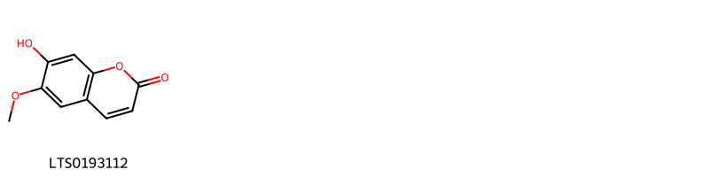
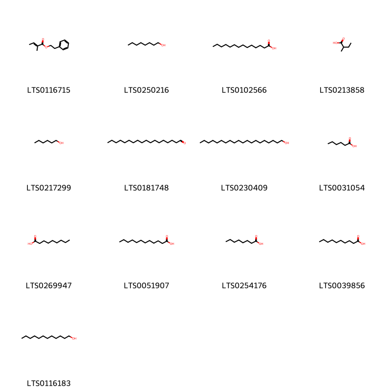
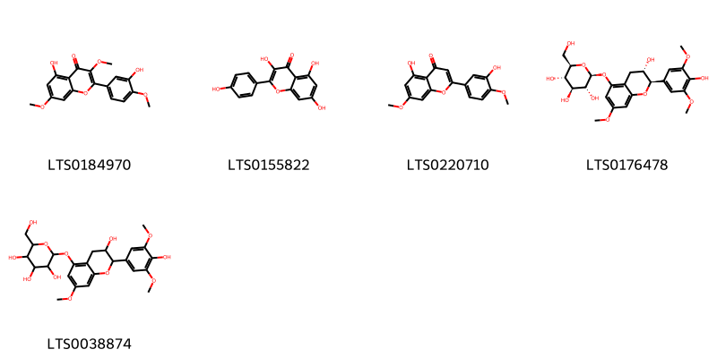
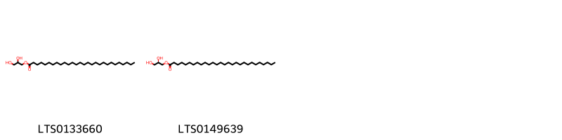
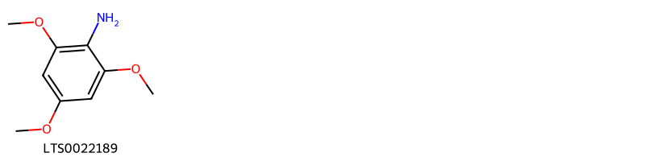
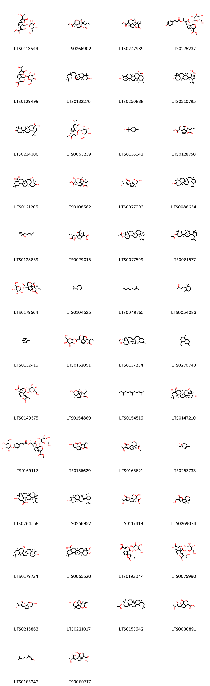
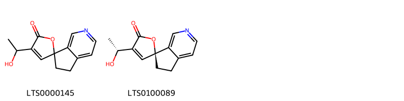
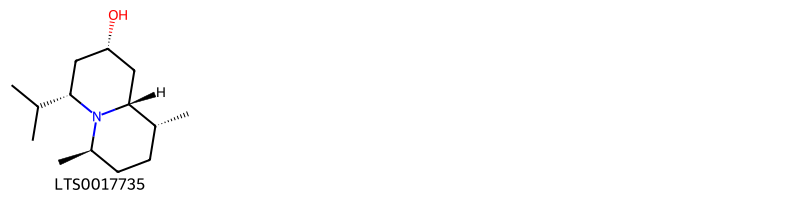
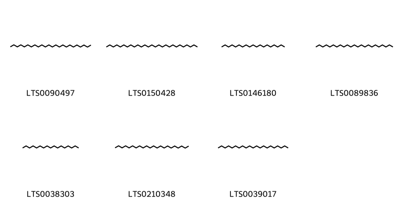

!!! abstract "Tóm tắt"

    Cây Đại (Plumeria rubra L.) là một loại dược liệu có bộ phận dùng là hoa (Flos Plumeriae rubrae), thuộc họ Trúc đào (Apocynaceae). Trên thế giới, cây được phân bố ở một số nước phía Nam châu Á và Mỹ La – tinh. Ở Việt Nam, cây rất hay được trồng làm cảnh quanh chùa đền và các công viên. Theo dân gian, hoa đại dùng làm thuốc chữa họ, có thể dùng làm thuốc uống chữa bệnh huyết hữu (hemophilia). Trong hoa đại, người ta tìm thấy nhóm alcaloid, iridoid, một ít tinh dầu mùi thơm mát.Tác dụng dược lý của hoa đại là hạ huyết áp.

## Thông tin về thực vật

Dược liệu **Đại (Hoa)** từ bộ phận **** từ loài *Plumeria rubra*.

**Mô tả thực vật:** Cây đại là một cây nhỡ, cao 3-7m, cành mềm, to. Lá mọc so le sít nhau, thường tập trung ở đầu cành; lá dày, nguyên, dài 15-35cm, rộng 5-10cm hai đầu đều hẹp nhọn, mặt nhẵn bóng, gần giữa nổi rõ. Hoa màu trắng, rất thơm, mặt trong ở phía dưới màu vàng dài 4-5cm. Quả đại đài hình trụ, dài 12cm.
Mùa hoa ở miền Bắc tháng 4-8

*Tài liệu tham khảo:* "Những cây thuốc và vị thuốc Việt Nam" - Đỗ Tất Lợi 
Trong dược điển Việt nam, một loài được sử dụng làm dược liệu là *Plumeria rubra*.

!!! info "Phân loại thực vật của *Plumeria rubra*"
    - **Kingdom:** Plantae
    - **Phylum:** Tracheophyta
    - **Order:** Gentianales
    - **Family:** Apocynaceae
    - **Genus:** Plumeria
    - **Species:** *Plumeria rubra*

**Phân bố trên thế giới:** nan, Benin, Cayman Islands, Cook Islands, Chile, Bahamas, Cuba, Antigua and Barbuda, Guadeloupe, French Guiana, Mexico, Hong Kong, South Africa, Barbados, Belize, Grenada, Indonesia, Virgin Islands (U.S.), Sint Maarten (Dutch part), Nigeria, Honduras, Guatemala, India, Brazil, Costa Rica, Guam, Philippines, Dominican Republic, Nicaragua, Fiji, Ecuador, Maldives, Puerto Rico, El Salvador, Guyana

**Phân bố tại Việt nam:** Không có ghi nhận ở Việt Nam

## Thông tin về dược liệu 

### Định danh

!!! info "Thông tin về tên gọi"

    - Dược liệu tiếng Việt: đại
    - Dược liệu tiếng Trung:  ()
    - Dược liệu tiếng Anh: 
    - Dược liệu latin thông dụng: Flos Plumeriae rubrae
    - Dược liệu latin kiểu DĐVN: *flos plumeriae rubrae*
    - Dược liệu latin kiểu DĐVN: **
    - Dược liệu latin kiểu thông tư: **
    - Bộ phận dùng:  (Flos)

### Mô tả dược liệu 

- **Theo dược điển Việt nam V:** Hoa dài 4 cm đến 5 cm, 5 cánh mỏng màu trắng ờ phía ngoài và vàng chanh ờ dưới, phía trong. Khi khô chuyển thành màu nâu đất, rất nhẹ, quăn queo, đôi khi cánh hoa xoắn lại. Mùi thơm nhẹ.

- **Mô tả dược liệu theo thông tư chế biến dược liệu theo phương pháp cổ truyền:** 

### Chế biến 

- **Chế biến theo dược điển việt nam V**: Thu hoạch vào tháng 5 đến tháng 8, hái hoa nở, đem phơi hoặc sấy ờ 40 °c đến 50 °c đến khô.

- **Chế biến theo thông tư:** 

--- 

## Thành phần hóa học

- Theo tài liệu của GS. Đỗ Tất Lợi:  (1). Nhóm alcaloid, iridoid, một ít tinh dầu mùi thơm mát.
(2). Alcaloid toàn phần
    

**Thành phần hóa học từ loài **Plumeria rubra**

Theo cơ sở dữ liệu lotus, loài *Plumeria rubra* đã phân lập và xác định được **138** hoạt chất thuộc về các nhóm Pyrans, Steroids and steroid derivatives, Organooxygen compounds, Lignan glycosides, Flavonoids, Fatty Acyls, Cinnamic acids and derivatives, Prenol lipids, Phenol ethers, Carboxylic acids and derivatives, Benzene and substituted derivatives, Pyridines and derivatives, Glycerolipids, Coumarins and derivatives, Saturated hydrocarbons, Quinolizines trong bảng dưới đây. Danh sách các hoạt chất như sau 6b-(hydroxymethyl)-4,4,6a,8a,11,11,14b-heptamethyl-1,2,3,4a,5,6,7,8,9,10,12,12a,14,14a-tetradecahydropicen-3-ol [(LTS0132276)](https://lotus.naturalproducts.net/compound/lotus_id/LTS0132276), hexanol [(LTS0217299)](https://lotus.naturalproducts.net/compound/lotus_id/LTS0217299), 4-isopropyl-1,6-dimethyl-2,3,4,4a,7,8-hexahydronaphthalene [(LTS0270743)](https://lotus.naturalproducts.net/compound/lotus_id/LTS0270743), 4-terpineol [(LTS0253733)](https://lotus.naturalproducts.net/compound/lotus_id/LTS0253733), 4'-(1-hydroxyethyl)-5,6-dihydrospiro[cyclopenta[c]pyridine-7,2'-furan]-5'-one [(LTS0000145)](https://lotus.naturalproducts.net/compound/lotus_id/LTS0000145), prenol [(LTS0257971)](https://lotus.naturalproducts.net/compound/lotus_id/LTS0257971), kaempherol [(LTS0155822)](https://lotus.naturalproducts.net/compound/lotus_id/LTS0155822), heptadecane [(LTS0038303)](https://lotus.naturalproducts.net/compound/lotus_id/LTS0038303), α pinene [(LTS0132416)](https://lotus.naturalproducts.net/compound/lotus_id/LTS0132416), fulvoplumierin [(LTS0040180)](https://lotus.naturalproducts.net/compound/lotus_id/LTS0040180), methyl 4'-(1-hydroxyethyl)-5'-oxo-1-{[3,4,5-trihydroxy-6-(hydroxymethyl)oxan-2-yl]oxy}-4a,7a-dihydro-1h-spiro[cyclopenta[c]pyran-7,2'-furan]-4-carboxylate [(LTS0129499)](https://lotus.naturalproducts.net/compound/lotus_id/LTS0129499), methyl 4'-ethyl-5'-oxo-1-{[3,4,5-trihydroxy-6-(hydroxymethyl)oxan-2-yl]oxy}-4a,7a-dihydro-1h-spiro[cyclopenta[c]pyran-7,2'-furan]-4-carboxylate [(LTS0192044)](https://lotus.naturalproducts.net/compound/lotus_id/LTS0192044), tricosane [(LTS0089836)](https://lotus.naturalproducts.net/compound/lotus_id/LTS0089836), capric acid [(LTS0039856)](https://lotus.naturalproducts.net/compound/lotus_id/LTS0039856), para-coumaric acid [(LTS0266252)](https://lotus.naturalproducts.net/compound/lotus_id/LTS0266252), phenethyl benzoate [(LTS0226862)](https://lotus.naturalproducts.net/compound/lotus_id/LTS0226862), 2-phenyl-ethanol [(LTS0206341)](https://lotus.naturalproducts.net/compound/lotus_id/LTS0206341), plumieride [(LTS0113544)](https://lotus.naturalproducts.net/compound/lotus_id/LTS0113544), (1r,4r,6r,8r,10r,11e,14r)-11-ethylidene-6-hydroxy-7,9,13-trioxatetracyclo[6.5.1.0¹,¹⁰.0⁴,¹⁴]tetradec-2-en-12-one [(LTS0242921)](https://lotus.naturalproducts.net/compound/lotus_id/LTS0242921), 2,5-dimethoxy-4-benzoquinone [(LTS0193891)](https://lotus.naturalproducts.net/compound/lotus_id/LTS0193891), 2,4,6-trimethoxyaniline [(LTS0022189)](https://lotus.naturalproducts.net/compound/lotus_id/LTS0022189), 9-hydroxy-5a,5b,8,8,11a-pentamethyl-1-(prop-1-en-2-yl)-hexadecahydrocyclopenta[a]chrysene-3a-carboxylic acid [(LTS0214300)](https://lotus.naturalproducts.net/compound/lotus_id/LTS0214300), benzyl salicylate [(LTS0232017)](https://lotus.naturalproducts.net/compound/lotus_id/LTS0232017), ethyl acetate [(LTS0196824)](https://lotus.naturalproducts.net/compound/lotus_id/LTS0196824), methyl (1r,4as,7r,7as)-4'-[(1s)-1-hydroxyethyl]-5'-oxo-1-{[(2s,3r,4s,5s,6r)-3,4,5-trihydroxy-6-(hydroxymethyl)oxan-2-yl]oxy}-4a,7a-dihydro-1h-spiro[cyclopenta[c]pyran-7,2'-furan]-4-carboxylate [(LTS0063239)](https://lotus.naturalproducts.net/compound/lotus_id/LTS0063239), benzyl alcohol [(LTS0125638)](https://lotus.naturalproducts.net/compound/lotus_id/LTS0125638), (1s,4as,7r,7as)-4'-[(1s)-1-hydroxyethyl]-5'-oxo-1-{[(2s,3r,4s,5s,6r)-3,4,5-trihydroxy-6-(hydroxymethyl)oxan-2-yl]oxy}-4a,7a-dihydro-1h-spiro[cyclopenta[c]pyran-7,2'-furan]-4-carboxylic acid [(LTS0075990)](https://lotus.naturalproducts.net/compound/lotus_id/LTS0075990), lauric acid [(LTS0051907)](https://lotus.naturalproducts.net/compound/lotus_id/LTS0051907), phenylacetonitrile [(LTS0082558)](https://lotus.naturalproducts.net/compound/lotus_id/LTS0082558), amyl alcohol [(LTS0193146)](https://lotus.naturalproducts.net/compound/lotus_id/LTS0193146), acetoin [(LTS0220819)](https://lotus.naturalproducts.net/compound/lotus_id/LTS0220819), methyl (1r,4r,5r,6r,8r,10r,11e,14r)-11-ethylidene-6-hydroxy-12-oxo-7,9,13-trioxatetracyclo[6.5.1.0¹,¹⁰.0⁴,¹⁴]tetradec-2-ene-5-carboxylate [(LTS0108562)](https://lotus.naturalproducts.net/compound/lotus_id/LTS0108562), octanol [(LTS0250216)](https://lotus.naturalproducts.net/compound/lotus_id/LTS0250216), (2r)-2-[(1r,3s,4s,7s,11s)-4-hydroxy-8-(methoxycarbonyl)-2,10-dioxatricyclo[5.3.1.0⁴,¹¹]undeca-5,8-dien-3-yl]butanoic acid [(LTS0079015)](https://lotus.naturalproducts.net/compound/lotus_id/LTS0079015), 10,11-dihydroxy-9-(hydroxymethyl)-2,2,6a,6b,9,12a-hexamethyl-1,3,4,5,6,7,8,8a,10,11,12,12b,13,14b-tetradecahydropicene-4a-carboxylic acid [(LTS0258848)](https://lotus.naturalproducts.net/compound/lotus_id/LTS0258848), scopoletin [(LTS0193112)](https://lotus.naturalproducts.net/compound/lotus_id/LTS0193112), betulinic acid [(LTS0210795)](https://lotus.naturalproducts.net/compound/lotus_id/LTS0210795), terpineol [(LTS0136148)](https://lotus.naturalproducts.net/compound/lotus_id/LTS0136148), methyl 11-ethylidene-12-oxo-7,9,13-trioxatetracyclo[6.5.1.0¹,¹⁰.0⁴,¹⁴]tetradeca-2,5-diene-5-carboxylate [(LTS0128758)](https://lotus.naturalproducts.net/compound/lotus_id/LTS0128758), geraniol [(LTS0258838)](https://lotus.naturalproducts.net/compound/lotus_id/LTS0258838), liriodendrin [(LTS0016790)](https://lotus.naturalproducts.net/compound/lotus_id/LTS0016790), benzaldehyde [(LTS0094193)](https://lotus.naturalproducts.net/compound/lotus_id/LTS0094193), methyl 11-ethylidene-6-hydroxy-12-oxo-7,9,13-trioxatetracyclo[6.5.1.0¹,¹⁰.0⁴,¹⁴]tetradec-2-ene-5-carboxylate [(LTS0113099)](https://lotus.naturalproducts.net/compound/lotus_id/LTS0113099), trans-β-ocimene [(LTS0049765)](https://lotus.naturalproducts.net/compound/lotus_id/LTS0049765), plumericin [(LTS0247989)](https://lotus.naturalproducts.net/compound/lotus_id/LTS0247989), phenethyl formate [(LTS0068441)](https://lotus.naturalproducts.net/compound/lotus_id/LTS0068441), octadecanal [(LTS0181748)](https://lotus.naturalproducts.net/compound/lotus_id/LTS0181748), hexanal [(LTS0238624)](https://lotus.naturalproducts.net/compound/lotus_id/LTS0238624), nonadecane [(LTS0146180)](https://lotus.naturalproducts.net/compound/lotus_id/LTS0146180), 1-dodecanol [(LTS0116183)](https://lotus.naturalproducts.net/compound/lotus_id/LTS0116183), isoplumericin [(LTS0266902)](https://lotus.naturalproducts.net/compound/lotus_id/LTS0266902), methylphenyl carbinol [(LTS0193761)](https://lotus.naturalproducts.net/compound/lotus_id/LTS0193761), phenethyl tiglate [(LTS0116715)](https://lotus.naturalproducts.net/compound/lotus_id/LTS0116715), (1r,3s,4s,7s,11s)-3-[(1r)-1-carboxypropyl]-4-hydroxy-2,10-dioxatricyclo[5.3.1.0⁴,¹¹]undeca-5,8-diene-8-carboxylic acid [(LTS0035218)](https://lotus.naturalproducts.net/compound/lotus_id/LTS0035218), ayanin [(LTS0184970)](https://lotus.naturalproducts.net/compound/lotus_id/LTS0184970), (11z)-11-ethylidene-6-hydroxy-7,9,13-trioxatetracyclo[6.5.1.0¹,¹⁰.0⁴,¹⁴]tetradec-2-en-12-one [(LTS0156629)](https://lotus.naturalproducts.net/compound/lotus_id/LTS0156629), methyl (1r,4s,4as,7r,7as)-1-hydroxy-4'-[(1s)-1-hydroxyethyl]-5'-oxo-3,4,4a,7a-tetrahydro-1h-spiro[cyclopenta[c]pyran-7,2'-furan]-4-carboxylate [(LTS0165621)](https://lotus.naturalproducts.net/compound/lotus_id/LTS0165621), p-cymen-8-ol [(LTS0223641)](https://lotus.naturalproducts.net/compound/lotus_id/LTS0223641), methyl (1s,4as,7r,7as)-4'-[(1s)-1-{[(2e)-3-(4-hydroxyphenyl)prop-2-enoyl]oxy}ethyl]-5'-oxo-1-{[(2s,3r,4s,5s,6r)-3,4,5-trihydroxy-6-(hydroxymethyl)oxan-2-yl]oxy}-4a,7a-dihydro-1h-spiro[cyclopenta[c]pyran-7,2'-furan]-4-carboxylate [(LTS0224769)](https://lotus.naturalproducts.net/compound/lotus_id/LTS0224769), 2-methylbutanoic acid [(LTS0213858)](https://lotus.naturalproducts.net/compound/lotus_id/LTS0213858), phenylacetaldehyde [(LTS0245512)](https://lotus.naturalproducts.net/compound/lotus_id/LTS0245512), 3-hydroxy-4'-(1-hydroxyethyl)-3,4,4a,7a-tetrahydro-1h-spiro[cyclopenta[c]pyran-7,2'-furan]-5'-one [(LTS0215863)](https://lotus.naturalproducts.net/compound/lotus_id/LTS0215863), nonanoic acid [(LTS0269947)](https://lotus.naturalproducts.net/compound/lotus_id/LTS0269947), 4,4,6a,6b,8a,11,11,14b-octamethyl-1,2,3,4a,5,6,7,8,9,10,12,12a,14,14a-tetradecahydropicen-3-yl acetate [(LTS0153642)](https://lotus.naturalproducts.net/compound/lotus_id/LTS0153642), α-citral [(LTS0246122)](https://lotus.naturalproducts.net/compound/lotus_id/LTS0246122), hydroxyacetophenone [(LTS0214036)](https://lotus.naturalproducts.net/compound/lotus_id/LTS0214036), methyl (1r,4ar,7s,7ar)-5'-oxo-1-{[(2r,3s,4r,5r,6s)-3,4,5-trihydroxy-6-(hydroxymethyl)oxan-2-yl]oxy}-4'-[(1r)-1-{[(2e)-3-(4-{[(2r,3s,4r,5r,6s)-3,4,5-trihydroxy-6-(hydroxymethyl)oxan-2-yl]oxy}phenyl)prop-2-enoyl]oxy}ethyl]-4a,7a-dihydro-1h-spiro[cyclopenta[c]pyran-7,2'-furan]-4-carboxylate [(LTS0169112)](https://lotus.naturalproducts.net/compound/lotus_id/LTS0169112), phenethyl acetate [(LTS0136181)](https://lotus.naturalproducts.net/compound/lotus_id/LTS0136181), isoamyl salicylate [(LTS0100550)](https://lotus.naturalproducts.net/compound/lotus_id/LTS0100550), lupeol acetate [(LTS0077599)](https://lotus.naturalproducts.net/compound/lotus_id/LTS0077599), β-ocimene [(LTS0242381)](https://lotus.naturalproducts.net/compound/lotus_id/LTS0242381), mepal [(LTS0207046)](https://lotus.naturalproducts.net/compound/lotus_id/LTS0207046), heptanal [(LTS0031416)](https://lotus.naturalproducts.net/compound/lotus_id/LTS0031416), arjunolic acid [(LTS0055520)](https://lotus.naturalproducts.net/compound/lotus_id/LTS0055520), tetracosane [(LTS0090497)](https://lotus.naturalproducts.net/compound/lotus_id/LTS0090497), nonanal [(LTS0244398)](https://lotus.naturalproducts.net/compound/lotus_id/LTS0244398), (1r,4r,6s,8r,10s,11e,14s)-11-ethylidene-6-hydroxy-7,9,13-trioxatetracyclo[6.5.1.0¹,¹⁰.0⁴,¹⁴]tetradec-2-en-12-one [(LTS0154869)](https://lotus.naturalproducts.net/compound/lotus_id/LTS0154869), sitogluside [(LTS0201798)](https://lotus.naturalproducts.net/compound/lotus_id/LTS0201798), lupeol [(LTS0088634)](https://lotus.naturalproducts.net/compound/lotus_id/LTS0088634), (2s,3r,4s,5s,6r)-2-{[(2r,3s)-3-hydroxy-2-(4-hydroxy-3,5-dimethoxyphenyl)-7-methoxy-3,4-dihydro-2h-1-benzopyran-5-yl]oxy}-6-(hydroxymethyl)oxane-3,4,5-triol [(LTS0176478)](https://lotus.naturalproducts.net/compound/lotus_id/LTS0176478), pilloin [(LTS0220710)](https://lotus.naturalproducts.net/compound/lotus_id/LTS0220710), terpinolene [(LTS0104525)](https://lotus.naturalproducts.net/compound/lotus_id/LTS0104525), (3s,4ar,7s,7as)-3-hydroxy-4'-[(1s)-1-hydroxyethyl]-3,4,4a,7a-tetrahydro-1h-spiro[cyclopenta[c]pyran-7,2'-furan]-5'-one [(LTS0269074)](https://lotus.naturalproducts.net/compound/lotus_id/LTS0269074), β-ionol [(LTS0054083)](https://lotus.naturalproducts.net/compound/lotus_id/LTS0054083), 2-{4-[4-(3,5-dimethoxy-4-{[3,4,5-trihydroxy-6-(hydroxymethyl)oxan-2-yl]oxy}phenyl)-hexahydrofuro[3,4-c]furan-1-yl]-2,6-dimethoxyphenoxy}-6-(hydroxymethyl)oxane-3,4,5-triol [(LTS0011685)](https://lotus.naturalproducts.net/compound/lotus_id/LTS0011685), delta-cadinene [(LTS0019321)](https://lotus.naturalproducts.net/compound/lotus_id/LTS0019321), (2r)-2,3-dihydroxypropyl octacosanoate [(LTS0149639)](https://lotus.naturalproducts.net/compound/lotus_id/LTS0149639), methyl benzoate [(LTS0225398)](https://lotus.naturalproducts.net/compound/lotus_id/LTS0225398), allamandin [(LTS0026202)](https://lotus.naturalproducts.net/compound/lotus_id/LTS0026202), arachidyl alcohol [(LTS0230409)](https://lotus.naturalproducts.net/compound/lotus_id/LTS0230409), methyl (1s,4as,7r,7as)-4'-(1-{[(2e)-3-(4-hydroxyphenyl)prop-2-enoyl]oxy}ethyl)-5'-oxo-1-{[(2s,3r,4s,5s,6r)-3,4,5-trihydroxy-6-(hydroxymethyl)oxan-2-yl]oxy}-4a,7a-dihydro-1h-spiro[cyclopenta[c]pyran-7,2'-furan]-4-carboxylate [(LTS0275237)](https://lotus.naturalproducts.net/compound/lotus_id/LTS0275237), (2s,3r,4s,5s,6r)-3,4,5-trihydroxy-6-(hydroxymethyl)oxan-2-yl (1s,4s,8r,10s,11s,14s)-11-ethyl-12-oxo-7,9,13-trioxatetracyclo[6.5.1.0¹,¹⁰.0⁴,¹⁴]tetradeca-2,5-diene-5-carboxylate [(LTS0179564)](https://lotus.naturalproducts.net/compound/lotus_id/LTS0179564), 15-(5-hydroxy-6-methylhept-6-en-2-yl)-7,7,12,16-tetramethylpentacyclo[9.7.0.0¹,³.0³,⁸.0¹²,¹⁶]octadecan-6-ol [(LTS0049555)](https://lotus.naturalproducts.net/compound/lotus_id/LTS0049555), (6e)-2,6-dimethyl-10-methylidenedodeca-2,6-diene [(LTS0154516)](https://lotus.naturalproducts.net/compound/lotus_id/LTS0154516), ω-phenylacetic acid [(LTS0091846)](https://lotus.naturalproducts.net/compound/lotus_id/LTS0091846), heptacosane [(LTS0150428)](https://lotus.naturalproducts.net/compound/lotus_id/LTS0150428), methyl 7-(but-2-en-1-ylidene)-1-oxocyclopenta[c]pyran-4-carboxylate [(LTS0255627)](https://lotus.naturalproducts.net/compound/lotus_id/LTS0255627), 2-{4-[(3as,6ar)-4-(3,5-dimethoxy-4-{[3,4,5-trihydroxy-6-(hydroxymethyl)oxan-2-yl]oxy}phenyl)-hexahydrofuro[3,4-c]furan-1-yl]-2,6-dimethoxyphenoxy}-6-(hydroxymethyl)oxane-3,4,5-triol [(LTS0192414)](https://lotus.naturalproducts.net/compound/lotus_id/LTS0192414), 2-{[1-(5-ethyl-6-methylheptan-2-yl)-9a,11a-dimethyl-1h,2h,3h,3ah,3bh,4h,6h,7h,8h,9h,9bh,10h,11h-cyclopenta[a]phenanthren-7-yl]oxy}-6-(hydroxymethyl)oxane-3,4,5-triol [(LTS0158828)](https://lotus.naturalproducts.net/compound/lotus_id/LTS0158828), caprylic acid [(LTS0254176)](https://lotus.naturalproducts.net/compound/lotus_id/LTS0254176), docosane [(LTS0210348)](https://lotus.naturalproducts.net/compound/lotus_id/LTS0210348), heneicosane [(LTS0039017)](https://lotus.naturalproducts.net/compound/lotus_id/LTS0039017), (1s,4s,6s,8s,10s,14s)-11-ethylidene-6-hydroxy-7,9,13-trioxatetracyclo[6.5.1.0¹,¹⁰.0⁴,¹⁴]tetradec-2-en-12-one [(LTS0221017)](https://lotus.naturalproducts.net/compound/lotus_id/LTS0221017), 3,4,5-trihydroxy-6-(hydroxymethyl)oxan-2-yl 11-ethyl-12-oxo-7,9,13-trioxatetracyclo[6.5.1.0¹,¹⁰.0⁴,¹⁴]tetradeca-2,5-diene-5-carboxylate [(LTS0152051)](https://lotus.naturalproducts.net/compound/lotus_id/LTS0152051), 2,3-dihydroxypropyl octacosanoate [(LTS0133660)](https://lotus.naturalproducts.net/compound/lotus_id/LTS0133660), myristic acid [(LTS0102566)](https://lotus.naturalproducts.net/compound/lotus_id/LTS0102566), neral [(LTS0165243)](https://lotus.naturalproducts.net/compound/lotus_id/LTS0165243), methyl (3r,4r,4as,7r,7ar)-3-hydroxy-4'-[(1s)-1-hydroxyethyl]-5'-oxo-3,4,4a,7a-tetrahydro-1h-spiro[cyclopenta[c]pyran-7,2'-furan]-4-carboxylate [(LTS0117419)](https://lotus.naturalproducts.net/compound/lotus_id/LTS0117419), (4as,6as,6br,8s,8ar,10r,12ar,12br,14bs)-8,10-dihydroxy-2,2,6a,6b,9,9,12a-heptamethyl-1,3,4,5,6,7,8,8a,10,11,12,12b,13,14b-tetradecahydropicene-4a-carboxylic acid [(LTS0147210)](https://lotus.naturalproducts.net/compound/lotus_id/LTS0147210), 8,10-dihydroxy-2,2,6a,6b,9,9,12a-heptamethyl-1,3,4,5,6,7,8,8a,10,11,12,12b,13,14b-tetradecahydropicene-4a-carboxylic acid [(LTS0121205)](https://lotus.naturalproducts.net/compound/lotus_id/LTS0121205), 3a,5a,5b,8,8,11a-hexamethyl-1-(prop-1-en-2-yl)-hexadecahydrocyclopenta[a]chrysen-9-yl acetate [(LTS0081577)](https://lotus.naturalproducts.net/compound/lotus_id/LTS0081577), (3r,4ar,6ar,6br,8ar,12ar,14ar,14br)-6b-(hydroxymethyl)-4,4,6a,8a,11,11,14b-heptamethyl-1,2,3,4a,5,6,7,8,9,10,12,12a,14,14a-tetradecahydropicen-3-ol [(LTS0179734)](https://lotus.naturalproducts.net/compound/lotus_id/LTS0179734), methyl (1s,4s,4as,7r,7as)-1-hydroxy-4'-[(1s)-1-hydroxyethyl]-5'-oxo-3,4,4a,7a-tetrahydro-1h-spiro[cyclopenta[c]pyran-7,2'-furan]-4-carboxylate [(LTS0060717)](https://lotus.naturalproducts.net/compound/lotus_id/LTS0060717), phenethyl salicylate [(LTS0258886)](https://lotus.naturalproducts.net/compound/lotus_id/LTS0258886), methyl salicylate [(LTS0128373)](https://lotus.naturalproducts.net/compound/lotus_id/LTS0128373), hexanoic acid [(LTS0031054)](https://lotus.naturalproducts.net/compound/lotus_id/LTS0031054), 2-methyl-1-butanol [(LTS0029080)](https://lotus.naturalproducts.net/compound/lotus_id/LTS0029080), lupeol [(LTS0256952)](https://lotus.naturalproducts.net/compound/lotus_id/LTS0256952), methyl cinnamate [(LTS0083574)](https://lotus.naturalproducts.net/compound/lotus_id/LTS0083574), ursolic acid [(LTS0250838)](https://lotus.naturalproducts.net/compound/lotus_id/LTS0250838), (1s,3r,6s,8r,11s,12s,15r,16r)-15-[(2r,5r)-5-hydroxy-6-methylhept-6-en-2-yl]-7,7,12,16-tetramethylpentacyclo[9.7.0.0¹,³.0³,⁸.0¹²,¹⁶]octadecan-6-ol [(LTS0109908)](https://lotus.naturalproducts.net/compound/lotus_id/LTS0109908), benzoic acid [(LTS0145871)](https://lotus.naturalproducts.net/compound/lotus_id/LTS0145871), (3r,4ar,7s,7as)-3-hydroxy-4'-[(1s)-1-hydroxyethyl]-3,4,4a,7a-tetrahydro-1h-spiro[cyclopenta[c]pyran-7,2'-furan]-5'-one [(LTS0077093)](https://lotus.naturalproducts.net/compound/lotus_id/LTS0077093), (1r,3ar,5ar,5br,7ar,9s,11ar,11br,13ar,13br)-9-hydroxy-3a,5a,5b,8,8,11a-hexamethyl-1-(prop-1-en-2-yl)-hexadecahydrocyclopenta[a]chrysene-11-carboxylic acid [(LTS0264558)](https://lotus.naturalproducts.net/compound/lotus_id/LTS0264558), methyl 1-hydroxy-4'-(1-hydroxyethyl)-5'-oxo-3,4,4a,7a-tetrahydro-1h-spiro[cyclopenta[c]pyran-7,2'-furan]-4-carboxylate [(LTS0030891)](https://lotus.naturalproducts.net/compound/lotus_id/LTS0030891), hydroxycinnamic acid [(LTS0233023)](https://lotus.naturalproducts.net/compound/lotus_id/LTS0233023), methyl (1r,4as,7s,7as)-4'-[(1s)-1-hydroxyethyl]-5'-oxo-1-{[(2s,3r,4s,5s,6r)-3,4,5-trihydroxy-6-(hydroxymethyl)oxan-2-yl]oxy}-4a,7a-dihydro-1h-spiro[cyclopenta[c]pyran-7,2'-furan]-4-carboxylate [(LTS0117887)](https://lotus.naturalproducts.net/compound/lotus_id/LTS0117887), benzyl benzoate [(LTS0097515)](https://lotus.naturalproducts.net/compound/lotus_id/LTS0097515), methyl (1r,4as,7r,7as)-4'-ethyl-5'-oxo-1-{[(2s,3r,4s,5s,6r)-3,4,5-trihydroxy-6-(hydroxymethyl)oxan-2-yl]oxy}-4a,7a-dihydro-1h-spiro[cyclopenta[c]pyran-7,2'-furan]-4-carboxylate [(LTS0149575)](https://lotus.naturalproducts.net/compound/lotus_id/LTS0149575), (1s,4s,6s,8s,10s,11e,14s)-11-ethylidene-6-hydroxy-7,9,13-trioxatetracyclo[6.5.1.0¹,¹⁰.0⁴,¹⁴]tetradec-2-en-12-one [(LTS0225807)](https://lotus.naturalproducts.net/compound/lotus_id/LTS0225807), (7s)-4'-[(1r)-1-hydroxyethyl]-5,6-dihydrospiro[cyclopenta[c]pyridine-7,2'-furan]-5'-one [(LTS0100089)](https://lotus.naturalproducts.net/compound/lotus_id/LTS0100089), β-amyrin acetate [(LTS0137234)](https://lotus.naturalproducts.net/compound/lotus_id/LTS0137234), 2-{[3-hydroxy-2-(4-hydroxy-3,5-dimethoxyphenyl)-7-methoxy-3,4-dihydro-2h-1-benzopyran-5-yl]oxy}-6-(hydroxymethyl)oxane-3,4,5-triol [(LTS0038874)](https://lotus.naturalproducts.net/compound/lotus_id/LTS0038874), γ-terpineol [(LTS0175059)](https://lotus.naturalproducts.net/compound/lotus_id/LTS0175059), (2s,4s,6r,9r,9ar)-4-isopropyl-6,9-dimethyl-octahydro-1h-quinolizin-2-ol [(LTS0017735)](https://lotus.naturalproducts.net/compound/lotus_id/LTS0017735), 2,6-dimethoxy-1,4-benzoquinone [(LTS0097421)](https://lotus.naturalproducts.net/compound/lotus_id/LTS0097421), methyl cinnamate [(LTS0222336)](https://lotus.naturalproducts.net/compound/lotus_id/LTS0222336), linalool, (+-)- [(LTS0128839)](https://lotus.naturalproducts.net/compound/lotus_id/LTS0128839). 
        
| chemicalTaxonomyClassyfireClass     |   smiles_count |
|:------------------------------------|---------------:|
| Benzene and substituted derivatives |            297 |
| Carboxylic acids and derivatives    |              9 |
| Cinnamic acids and derivatives      |             80 |
| Coumarins and derivatives           |             21 |
| Fatty Acyls                         |            196 |
| Flavonoids                          |            284 |
| Glycerolipids                       |             84 |
| Lignan glycosides                   |            336 |
| Organooxygen compounds              |            141 |
| Phenol ethers                       |             21 |
| Prenol lipids                       |           4088 |
| Pyrans                              |             69 |
| Pyridines and derivatives           |             66 |
| Quinolizines                        |             51 |
| Saturated hydrocarbons              |            153 |
| Steroids and steroid derivatives    |            352 |

            
### Nhóm Benzene and substituted derivatives
<figure markdown="span">
    { width=100% }
<figcaption>Hình ảnh cấu trúc hóa học của hoạt chất thuộc nhóm *Benzene and substituted derivatives*. Tên thường gọi của các hoạt chất tương ứng là benzyl benzoate [(LTS0097515)](https://lotus.naturalproducts.net/compound/lotus_id/LTS0097515), benzyl salicylate [(LTS0232017)](https://lotus.naturalproducts.net/compound/lotus_id/LTS0232017), phenylacetonitrile [(LTS0082558)](https://lotus.naturalproducts.net/compound/lotus_id/LTS0082558), phenethyl formate [(LTS0068441)](https://lotus.naturalproducts.net/compound/lotus_id/LTS0068441), 2-phenyl-ethanol [(LTS0206341)](https://lotus.naturalproducts.net/compound/lotus_id/LTS0206341), methylphenyl carbinol [(LTS0193761)](https://lotus.naturalproducts.net/compound/lotus_id/LTS0193761), benzoic acid [(LTS0145871)](https://lotus.naturalproducts.net/compound/lotus_id/LTS0145871), benzaldehyde [(LTS0094193)](https://lotus.naturalproducts.net/compound/lotus_id/LTS0094193), phenethyl acetate [(LTS0136181)](https://lotus.naturalproducts.net/compound/lotus_id/LTS0136181), methyl benzoate [(LTS0225398)](https://lotus.naturalproducts.net/compound/lotus_id/LTS0225398), phenethyl salicylate [(LTS0258886)](https://lotus.naturalproducts.net/compound/lotus_id/LTS0258886), phenylacetaldehyde [(LTS0245512)](https://lotus.naturalproducts.net/compound/lotus_id/LTS0245512), methyl salicylate [(LTS0128373)](https://lotus.naturalproducts.net/compound/lotus_id/LTS0128373), ω-phenylacetic acid [(LTS0091846)](https://lotus.naturalproducts.net/compound/lotus_id/LTS0091846), p-cymen-8-ol [(LTS0223641)](https://lotus.naturalproducts.net/compound/lotus_id/LTS0223641), phenethyl benzoate [(LTS0226862)](https://lotus.naturalproducts.net/compound/lotus_id/LTS0226862), isoamyl salicylate [(LTS0100550)](https://lotus.naturalproducts.net/compound/lotus_id/LTS0100550), benzyl alcohol [(LTS0125638)](https://lotus.naturalproducts.net/compound/lotus_id/LTS0125638).</figcaption>
</figure>

            
            
### Nhóm Benzene and substituted derivatives
<figure markdown="span">
    { width=100% }
<figcaption>Hình ảnh cấu trúc hóa học của hoạt chất thuộc nhóm *Benzene and substituted derivatives*. Tên thường gọi của các hoạt chất tương ứng là benzyl benzoate [(LTS0097515)](https://lotus.naturalproducts.net/compound/lotus_id/LTS0097515), benzyl salicylate [(LTS0232017)](https://lotus.naturalproducts.net/compound/lotus_id/LTS0232017), phenylacetonitrile [(LTS0082558)](https://lotus.naturalproducts.net/compound/lotus_id/LTS0082558), phenethyl formate [(LTS0068441)](https://lotus.naturalproducts.net/compound/lotus_id/LTS0068441), 2-phenyl-ethanol [(LTS0206341)](https://lotus.naturalproducts.net/compound/lotus_id/LTS0206341), methylphenyl carbinol [(LTS0193761)](https://lotus.naturalproducts.net/compound/lotus_id/LTS0193761), benzoic acid [(LTS0145871)](https://lotus.naturalproducts.net/compound/lotus_id/LTS0145871), benzaldehyde [(LTS0094193)](https://lotus.naturalproducts.net/compound/lotus_id/LTS0094193), phenethyl acetate [(LTS0136181)](https://lotus.naturalproducts.net/compound/lotus_id/LTS0136181), methyl benzoate [(LTS0225398)](https://lotus.naturalproducts.net/compound/lotus_id/LTS0225398), phenethyl salicylate [(LTS0258886)](https://lotus.naturalproducts.net/compound/lotus_id/LTS0258886), phenylacetaldehyde [(LTS0245512)](https://lotus.naturalproducts.net/compound/lotus_id/LTS0245512), methyl salicylate [(LTS0128373)](https://lotus.naturalproducts.net/compound/lotus_id/LTS0128373), ω-phenylacetic acid [(LTS0091846)](https://lotus.naturalproducts.net/compound/lotus_id/LTS0091846), p-cymen-8-ol [(LTS0223641)](https://lotus.naturalproducts.net/compound/lotus_id/LTS0223641), phenethyl benzoate [(LTS0226862)](https://lotus.naturalproducts.net/compound/lotus_id/LTS0226862), isoamyl salicylate [(LTS0100550)](https://lotus.naturalproducts.net/compound/lotus_id/LTS0100550), benzyl alcohol [(LTS0125638)](https://lotus.naturalproducts.net/compound/lotus_id/LTS0125638).</figcaption>
</figure>

### Nhóm Carboxylic acids and derivatives
<figure markdown="span">
    { width=100% }
<figcaption>Hình ảnh cấu trúc hóa học của hoạt chất thuộc nhóm *Carboxylic acids and derivatives*. Tên thường gọi của các hoạt chất tương ứng là ethyl acetate [(LTS0196824)](https://lotus.naturalproducts.net/compound/lotus_id/LTS0196824).</figcaption>
</figure>

            
            
### Nhóm Benzene and substituted derivatives
<figure markdown="span">
    { width=100% }
<figcaption>Hình ảnh cấu trúc hóa học của hoạt chất thuộc nhóm *Benzene and substituted derivatives*. Tên thường gọi của các hoạt chất tương ứng là benzyl benzoate [(LTS0097515)](https://lotus.naturalproducts.net/compound/lotus_id/LTS0097515), benzyl salicylate [(LTS0232017)](https://lotus.naturalproducts.net/compound/lotus_id/LTS0232017), phenylacetonitrile [(LTS0082558)](https://lotus.naturalproducts.net/compound/lotus_id/LTS0082558), phenethyl formate [(LTS0068441)](https://lotus.naturalproducts.net/compound/lotus_id/LTS0068441), 2-phenyl-ethanol [(LTS0206341)](https://lotus.naturalproducts.net/compound/lotus_id/LTS0206341), methylphenyl carbinol [(LTS0193761)](https://lotus.naturalproducts.net/compound/lotus_id/LTS0193761), benzoic acid [(LTS0145871)](https://lotus.naturalproducts.net/compound/lotus_id/LTS0145871), benzaldehyde [(LTS0094193)](https://lotus.naturalproducts.net/compound/lotus_id/LTS0094193), phenethyl acetate [(LTS0136181)](https://lotus.naturalproducts.net/compound/lotus_id/LTS0136181), methyl benzoate [(LTS0225398)](https://lotus.naturalproducts.net/compound/lotus_id/LTS0225398), phenethyl salicylate [(LTS0258886)](https://lotus.naturalproducts.net/compound/lotus_id/LTS0258886), phenylacetaldehyde [(LTS0245512)](https://lotus.naturalproducts.net/compound/lotus_id/LTS0245512), methyl salicylate [(LTS0128373)](https://lotus.naturalproducts.net/compound/lotus_id/LTS0128373), ω-phenylacetic acid [(LTS0091846)](https://lotus.naturalproducts.net/compound/lotus_id/LTS0091846), p-cymen-8-ol [(LTS0223641)](https://lotus.naturalproducts.net/compound/lotus_id/LTS0223641), phenethyl benzoate [(LTS0226862)](https://lotus.naturalproducts.net/compound/lotus_id/LTS0226862), isoamyl salicylate [(LTS0100550)](https://lotus.naturalproducts.net/compound/lotus_id/LTS0100550), benzyl alcohol [(LTS0125638)](https://lotus.naturalproducts.net/compound/lotus_id/LTS0125638).</figcaption>
</figure>

### Nhóm Carboxylic acids and derivatives
<figure markdown="span">
    { width=100% }
<figcaption>Hình ảnh cấu trúc hóa học của hoạt chất thuộc nhóm *Carboxylic acids and derivatives*. Tên thường gọi của các hoạt chất tương ứng là ethyl acetate [(LTS0196824)](https://lotus.naturalproducts.net/compound/lotus_id/LTS0196824).</figcaption>
</figure>

### Nhóm Cinnamic acids and derivatives
<figure markdown="span">
    { width=100% }
<figcaption>Hình ảnh cấu trúc hóa học của hoạt chất thuộc nhóm *Cinnamic acids and derivatives*. Tên thường gọi của các hoạt chất tương ứng là para-coumaric acid [(LTS0266252)](https://lotus.naturalproducts.net/compound/lotus_id/LTS0266252), methyl cinnamate [(LTS0083574)](https://lotus.naturalproducts.net/compound/lotus_id/LTS0083574), methyl cinnamate [(LTS0222336)](https://lotus.naturalproducts.net/compound/lotus_id/LTS0222336), hydroxycinnamic acid [(LTS0233023)](https://lotus.naturalproducts.net/compound/lotus_id/LTS0233023).</figcaption>
</figure>

            
            
### Nhóm Benzene and substituted derivatives
<figure markdown="span">
    { width=100% }
<figcaption>Hình ảnh cấu trúc hóa học của hoạt chất thuộc nhóm *Benzene and substituted derivatives*. Tên thường gọi của các hoạt chất tương ứng là benzyl benzoate [(LTS0097515)](https://lotus.naturalproducts.net/compound/lotus_id/LTS0097515), benzyl salicylate [(LTS0232017)](https://lotus.naturalproducts.net/compound/lotus_id/LTS0232017), phenylacetonitrile [(LTS0082558)](https://lotus.naturalproducts.net/compound/lotus_id/LTS0082558), phenethyl formate [(LTS0068441)](https://lotus.naturalproducts.net/compound/lotus_id/LTS0068441), 2-phenyl-ethanol [(LTS0206341)](https://lotus.naturalproducts.net/compound/lotus_id/LTS0206341), methylphenyl carbinol [(LTS0193761)](https://lotus.naturalproducts.net/compound/lotus_id/LTS0193761), benzoic acid [(LTS0145871)](https://lotus.naturalproducts.net/compound/lotus_id/LTS0145871), benzaldehyde [(LTS0094193)](https://lotus.naturalproducts.net/compound/lotus_id/LTS0094193), phenethyl acetate [(LTS0136181)](https://lotus.naturalproducts.net/compound/lotus_id/LTS0136181), methyl benzoate [(LTS0225398)](https://lotus.naturalproducts.net/compound/lotus_id/LTS0225398), phenethyl salicylate [(LTS0258886)](https://lotus.naturalproducts.net/compound/lotus_id/LTS0258886), phenylacetaldehyde [(LTS0245512)](https://lotus.naturalproducts.net/compound/lotus_id/LTS0245512), methyl salicylate [(LTS0128373)](https://lotus.naturalproducts.net/compound/lotus_id/LTS0128373), ω-phenylacetic acid [(LTS0091846)](https://lotus.naturalproducts.net/compound/lotus_id/LTS0091846), p-cymen-8-ol [(LTS0223641)](https://lotus.naturalproducts.net/compound/lotus_id/LTS0223641), phenethyl benzoate [(LTS0226862)](https://lotus.naturalproducts.net/compound/lotus_id/LTS0226862), isoamyl salicylate [(LTS0100550)](https://lotus.naturalproducts.net/compound/lotus_id/LTS0100550), benzyl alcohol [(LTS0125638)](https://lotus.naturalproducts.net/compound/lotus_id/LTS0125638).</figcaption>
</figure>

### Nhóm Carboxylic acids and derivatives
<figure markdown="span">
    { width=100% }
<figcaption>Hình ảnh cấu trúc hóa học của hoạt chất thuộc nhóm *Carboxylic acids and derivatives*. Tên thường gọi của các hoạt chất tương ứng là ethyl acetate [(LTS0196824)](https://lotus.naturalproducts.net/compound/lotus_id/LTS0196824).</figcaption>
</figure>

### Nhóm Cinnamic acids and derivatives
<figure markdown="span">
    { width=100% }
<figcaption>Hình ảnh cấu trúc hóa học của hoạt chất thuộc nhóm *Cinnamic acids and derivatives*. Tên thường gọi của các hoạt chất tương ứng là para-coumaric acid [(LTS0266252)](https://lotus.naturalproducts.net/compound/lotus_id/LTS0266252), methyl cinnamate [(LTS0083574)](https://lotus.naturalproducts.net/compound/lotus_id/LTS0083574), methyl cinnamate [(LTS0222336)](https://lotus.naturalproducts.net/compound/lotus_id/LTS0222336), hydroxycinnamic acid [(LTS0233023)](https://lotus.naturalproducts.net/compound/lotus_id/LTS0233023).</figcaption>
</figure>

### Nhóm Coumarins and derivatives
<figure markdown="span">
    { width=100% }
<figcaption>Hình ảnh cấu trúc hóa học của hoạt chất thuộc nhóm *Coumarins and derivatives*. Tên thường gọi của các hoạt chất tương ứng là scopoletin [(LTS0193112)](https://lotus.naturalproducts.net/compound/lotus_id/LTS0193112).</figcaption>
</figure>

            
            
### Nhóm Benzene and substituted derivatives
<figure markdown="span">
    { width=100% }
<figcaption>Hình ảnh cấu trúc hóa học của hoạt chất thuộc nhóm *Benzene and substituted derivatives*. Tên thường gọi của các hoạt chất tương ứng là benzyl benzoate [(LTS0097515)](https://lotus.naturalproducts.net/compound/lotus_id/LTS0097515), benzyl salicylate [(LTS0232017)](https://lotus.naturalproducts.net/compound/lotus_id/LTS0232017), phenylacetonitrile [(LTS0082558)](https://lotus.naturalproducts.net/compound/lotus_id/LTS0082558), phenethyl formate [(LTS0068441)](https://lotus.naturalproducts.net/compound/lotus_id/LTS0068441), 2-phenyl-ethanol [(LTS0206341)](https://lotus.naturalproducts.net/compound/lotus_id/LTS0206341), methylphenyl carbinol [(LTS0193761)](https://lotus.naturalproducts.net/compound/lotus_id/LTS0193761), benzoic acid [(LTS0145871)](https://lotus.naturalproducts.net/compound/lotus_id/LTS0145871), benzaldehyde [(LTS0094193)](https://lotus.naturalproducts.net/compound/lotus_id/LTS0094193), phenethyl acetate [(LTS0136181)](https://lotus.naturalproducts.net/compound/lotus_id/LTS0136181), methyl benzoate [(LTS0225398)](https://lotus.naturalproducts.net/compound/lotus_id/LTS0225398), phenethyl salicylate [(LTS0258886)](https://lotus.naturalproducts.net/compound/lotus_id/LTS0258886), phenylacetaldehyde [(LTS0245512)](https://lotus.naturalproducts.net/compound/lotus_id/LTS0245512), methyl salicylate [(LTS0128373)](https://lotus.naturalproducts.net/compound/lotus_id/LTS0128373), ω-phenylacetic acid [(LTS0091846)](https://lotus.naturalproducts.net/compound/lotus_id/LTS0091846), p-cymen-8-ol [(LTS0223641)](https://lotus.naturalproducts.net/compound/lotus_id/LTS0223641), phenethyl benzoate [(LTS0226862)](https://lotus.naturalproducts.net/compound/lotus_id/LTS0226862), isoamyl salicylate [(LTS0100550)](https://lotus.naturalproducts.net/compound/lotus_id/LTS0100550), benzyl alcohol [(LTS0125638)](https://lotus.naturalproducts.net/compound/lotus_id/LTS0125638).</figcaption>
</figure>

### Nhóm Carboxylic acids and derivatives
<figure markdown="span">
    { width=100% }
<figcaption>Hình ảnh cấu trúc hóa học của hoạt chất thuộc nhóm *Carboxylic acids and derivatives*. Tên thường gọi của các hoạt chất tương ứng là ethyl acetate [(LTS0196824)](https://lotus.naturalproducts.net/compound/lotus_id/LTS0196824).</figcaption>
</figure>

### Nhóm Cinnamic acids and derivatives
<figure markdown="span">
    { width=100% }
<figcaption>Hình ảnh cấu trúc hóa học của hoạt chất thuộc nhóm *Cinnamic acids and derivatives*. Tên thường gọi của các hoạt chất tương ứng là para-coumaric acid [(LTS0266252)](https://lotus.naturalproducts.net/compound/lotus_id/LTS0266252), methyl cinnamate [(LTS0083574)](https://lotus.naturalproducts.net/compound/lotus_id/LTS0083574), methyl cinnamate [(LTS0222336)](https://lotus.naturalproducts.net/compound/lotus_id/LTS0222336), hydroxycinnamic acid [(LTS0233023)](https://lotus.naturalproducts.net/compound/lotus_id/LTS0233023).</figcaption>
</figure>

### Nhóm Coumarins and derivatives
<figure markdown="span">
    { width=100% }
<figcaption>Hình ảnh cấu trúc hóa học của hoạt chất thuộc nhóm *Coumarins and derivatives*. Tên thường gọi của các hoạt chất tương ứng là scopoletin [(LTS0193112)](https://lotus.naturalproducts.net/compound/lotus_id/LTS0193112).</figcaption>
</figure>

### Nhóm Fatty Acyls
<figure markdown="span">
    { width=100% }
<figcaption>Hình ảnh cấu trúc hóa học của hoạt chất thuộc nhóm *Fatty Acyls*. Tên thường gọi của các hoạt chất tương ứng là phenethyl tiglate [(LTS0116715)](https://lotus.naturalproducts.net/compound/lotus_id/LTS0116715), octanol [(LTS0250216)](https://lotus.naturalproducts.net/compound/lotus_id/LTS0250216), myristic acid [(LTS0102566)](https://lotus.naturalproducts.net/compound/lotus_id/LTS0102566), 2-methylbutanoic acid [(LTS0213858)](https://lotus.naturalproducts.net/compound/lotus_id/LTS0213858), hexanol [(LTS0217299)](https://lotus.naturalproducts.net/compound/lotus_id/LTS0217299), octadecanal [(LTS0181748)](https://lotus.naturalproducts.net/compound/lotus_id/LTS0181748), arachidyl alcohol [(LTS0230409)](https://lotus.naturalproducts.net/compound/lotus_id/LTS0230409), hexanoic acid [(LTS0031054)](https://lotus.naturalproducts.net/compound/lotus_id/LTS0031054), nonanoic acid [(LTS0269947)](https://lotus.naturalproducts.net/compound/lotus_id/LTS0269947), lauric acid [(LTS0051907)](https://lotus.naturalproducts.net/compound/lotus_id/LTS0051907), caprylic acid [(LTS0254176)](https://lotus.naturalproducts.net/compound/lotus_id/LTS0254176), capric acid [(LTS0039856)](https://lotus.naturalproducts.net/compound/lotus_id/LTS0039856), 1-dodecanol [(LTS0116183)](https://lotus.naturalproducts.net/compound/lotus_id/LTS0116183).</figcaption>
</figure>

            
            
### Nhóm Benzene and substituted derivatives
<figure markdown="span">
    { width=100% }
<figcaption>Hình ảnh cấu trúc hóa học của hoạt chất thuộc nhóm *Benzene and substituted derivatives*. Tên thường gọi của các hoạt chất tương ứng là benzyl benzoate [(LTS0097515)](https://lotus.naturalproducts.net/compound/lotus_id/LTS0097515), benzyl salicylate [(LTS0232017)](https://lotus.naturalproducts.net/compound/lotus_id/LTS0232017), phenylacetonitrile [(LTS0082558)](https://lotus.naturalproducts.net/compound/lotus_id/LTS0082558), phenethyl formate [(LTS0068441)](https://lotus.naturalproducts.net/compound/lotus_id/LTS0068441), 2-phenyl-ethanol [(LTS0206341)](https://lotus.naturalproducts.net/compound/lotus_id/LTS0206341), methylphenyl carbinol [(LTS0193761)](https://lotus.naturalproducts.net/compound/lotus_id/LTS0193761), benzoic acid [(LTS0145871)](https://lotus.naturalproducts.net/compound/lotus_id/LTS0145871), benzaldehyde [(LTS0094193)](https://lotus.naturalproducts.net/compound/lotus_id/LTS0094193), phenethyl acetate [(LTS0136181)](https://lotus.naturalproducts.net/compound/lotus_id/LTS0136181), methyl benzoate [(LTS0225398)](https://lotus.naturalproducts.net/compound/lotus_id/LTS0225398), phenethyl salicylate [(LTS0258886)](https://lotus.naturalproducts.net/compound/lotus_id/LTS0258886), phenylacetaldehyde [(LTS0245512)](https://lotus.naturalproducts.net/compound/lotus_id/LTS0245512), methyl salicylate [(LTS0128373)](https://lotus.naturalproducts.net/compound/lotus_id/LTS0128373), ω-phenylacetic acid [(LTS0091846)](https://lotus.naturalproducts.net/compound/lotus_id/LTS0091846), p-cymen-8-ol [(LTS0223641)](https://lotus.naturalproducts.net/compound/lotus_id/LTS0223641), phenethyl benzoate [(LTS0226862)](https://lotus.naturalproducts.net/compound/lotus_id/LTS0226862), isoamyl salicylate [(LTS0100550)](https://lotus.naturalproducts.net/compound/lotus_id/LTS0100550), benzyl alcohol [(LTS0125638)](https://lotus.naturalproducts.net/compound/lotus_id/LTS0125638).</figcaption>
</figure>

### Nhóm Carboxylic acids and derivatives
<figure markdown="span">
    { width=100% }
<figcaption>Hình ảnh cấu trúc hóa học của hoạt chất thuộc nhóm *Carboxylic acids and derivatives*. Tên thường gọi của các hoạt chất tương ứng là ethyl acetate [(LTS0196824)](https://lotus.naturalproducts.net/compound/lotus_id/LTS0196824).</figcaption>
</figure>

### Nhóm Cinnamic acids and derivatives
<figure markdown="span">
    { width=100% }
<figcaption>Hình ảnh cấu trúc hóa học của hoạt chất thuộc nhóm *Cinnamic acids and derivatives*. Tên thường gọi của các hoạt chất tương ứng là para-coumaric acid [(LTS0266252)](https://lotus.naturalproducts.net/compound/lotus_id/LTS0266252), methyl cinnamate [(LTS0083574)](https://lotus.naturalproducts.net/compound/lotus_id/LTS0083574), methyl cinnamate [(LTS0222336)](https://lotus.naturalproducts.net/compound/lotus_id/LTS0222336), hydroxycinnamic acid [(LTS0233023)](https://lotus.naturalproducts.net/compound/lotus_id/LTS0233023).</figcaption>
</figure>

### Nhóm Coumarins and derivatives
<figure markdown="span">
    { width=100% }
<figcaption>Hình ảnh cấu trúc hóa học của hoạt chất thuộc nhóm *Coumarins and derivatives*. Tên thường gọi của các hoạt chất tương ứng là scopoletin [(LTS0193112)](https://lotus.naturalproducts.net/compound/lotus_id/LTS0193112).</figcaption>
</figure>

### Nhóm Fatty Acyls
<figure markdown="span">
    { width=100% }
<figcaption>Hình ảnh cấu trúc hóa học của hoạt chất thuộc nhóm *Fatty Acyls*. Tên thường gọi của các hoạt chất tương ứng là phenethyl tiglate [(LTS0116715)](https://lotus.naturalproducts.net/compound/lotus_id/LTS0116715), octanol [(LTS0250216)](https://lotus.naturalproducts.net/compound/lotus_id/LTS0250216), myristic acid [(LTS0102566)](https://lotus.naturalproducts.net/compound/lotus_id/LTS0102566), 2-methylbutanoic acid [(LTS0213858)](https://lotus.naturalproducts.net/compound/lotus_id/LTS0213858), hexanol [(LTS0217299)](https://lotus.naturalproducts.net/compound/lotus_id/LTS0217299), octadecanal [(LTS0181748)](https://lotus.naturalproducts.net/compound/lotus_id/LTS0181748), arachidyl alcohol [(LTS0230409)](https://lotus.naturalproducts.net/compound/lotus_id/LTS0230409), hexanoic acid [(LTS0031054)](https://lotus.naturalproducts.net/compound/lotus_id/LTS0031054), nonanoic acid [(LTS0269947)](https://lotus.naturalproducts.net/compound/lotus_id/LTS0269947), lauric acid [(LTS0051907)](https://lotus.naturalproducts.net/compound/lotus_id/LTS0051907), caprylic acid [(LTS0254176)](https://lotus.naturalproducts.net/compound/lotus_id/LTS0254176), capric acid [(LTS0039856)](https://lotus.naturalproducts.net/compound/lotus_id/LTS0039856), 1-dodecanol [(LTS0116183)](https://lotus.naturalproducts.net/compound/lotus_id/LTS0116183).</figcaption>
</figure>

### Nhóm Flavonoids
<figure markdown="span">
    { width=100% }
<figcaption>Hình ảnh cấu trúc hóa học của hoạt chất thuộc nhóm *Flavonoids*. Tên thường gọi của các hoạt chất tương ứng là ayanin [(LTS0184970)](https://lotus.naturalproducts.net/compound/lotus_id/LTS0184970), kaempherol [(LTS0155822)](https://lotus.naturalproducts.net/compound/lotus_id/LTS0155822), pilloin [(LTS0220710)](https://lotus.naturalproducts.net/compound/lotus_id/LTS0220710), (2s,3r,4s,5s,6r)-2-{[(2r,3s)-3-hydroxy-2-(4-hydroxy-3,5-dimethoxyphenyl)-7-methoxy-3,4-dihydro-2h-1-benzopyran-5-yl]oxy}-6-(hydroxymethyl)oxane-3,4,5-triol [(LTS0176478)](https://lotus.naturalproducts.net/compound/lotus_id/LTS0176478), 2-{[3-hydroxy-2-(4-hydroxy-3,5-dimethoxyphenyl)-7-methoxy-3,4-dihydro-2h-1-benzopyran-5-yl]oxy}-6-(hydroxymethyl)oxane-3,4,5-triol [(LTS0038874)](https://lotus.naturalproducts.net/compound/lotus_id/LTS0038874).</figcaption>
</figure>

            
            
### Nhóm Benzene and substituted derivatives
<figure markdown="span">
    { width=100% }
<figcaption>Hình ảnh cấu trúc hóa học của hoạt chất thuộc nhóm *Benzene and substituted derivatives*. Tên thường gọi của các hoạt chất tương ứng là benzyl benzoate [(LTS0097515)](https://lotus.naturalproducts.net/compound/lotus_id/LTS0097515), benzyl salicylate [(LTS0232017)](https://lotus.naturalproducts.net/compound/lotus_id/LTS0232017), phenylacetonitrile [(LTS0082558)](https://lotus.naturalproducts.net/compound/lotus_id/LTS0082558), phenethyl formate [(LTS0068441)](https://lotus.naturalproducts.net/compound/lotus_id/LTS0068441), 2-phenyl-ethanol [(LTS0206341)](https://lotus.naturalproducts.net/compound/lotus_id/LTS0206341), methylphenyl carbinol [(LTS0193761)](https://lotus.naturalproducts.net/compound/lotus_id/LTS0193761), benzoic acid [(LTS0145871)](https://lotus.naturalproducts.net/compound/lotus_id/LTS0145871), benzaldehyde [(LTS0094193)](https://lotus.naturalproducts.net/compound/lotus_id/LTS0094193), phenethyl acetate [(LTS0136181)](https://lotus.naturalproducts.net/compound/lotus_id/LTS0136181), methyl benzoate [(LTS0225398)](https://lotus.naturalproducts.net/compound/lotus_id/LTS0225398), phenethyl salicylate [(LTS0258886)](https://lotus.naturalproducts.net/compound/lotus_id/LTS0258886), phenylacetaldehyde [(LTS0245512)](https://lotus.naturalproducts.net/compound/lotus_id/LTS0245512), methyl salicylate [(LTS0128373)](https://lotus.naturalproducts.net/compound/lotus_id/LTS0128373), ω-phenylacetic acid [(LTS0091846)](https://lotus.naturalproducts.net/compound/lotus_id/LTS0091846), p-cymen-8-ol [(LTS0223641)](https://lotus.naturalproducts.net/compound/lotus_id/LTS0223641), phenethyl benzoate [(LTS0226862)](https://lotus.naturalproducts.net/compound/lotus_id/LTS0226862), isoamyl salicylate [(LTS0100550)](https://lotus.naturalproducts.net/compound/lotus_id/LTS0100550), benzyl alcohol [(LTS0125638)](https://lotus.naturalproducts.net/compound/lotus_id/LTS0125638).</figcaption>
</figure>

### Nhóm Carboxylic acids and derivatives
<figure markdown="span">
    { width=100% }
<figcaption>Hình ảnh cấu trúc hóa học của hoạt chất thuộc nhóm *Carboxylic acids and derivatives*. Tên thường gọi của các hoạt chất tương ứng là ethyl acetate [(LTS0196824)](https://lotus.naturalproducts.net/compound/lotus_id/LTS0196824).</figcaption>
</figure>

### Nhóm Cinnamic acids and derivatives
<figure markdown="span">
    { width=100% }
<figcaption>Hình ảnh cấu trúc hóa học của hoạt chất thuộc nhóm *Cinnamic acids and derivatives*. Tên thường gọi của các hoạt chất tương ứng là para-coumaric acid [(LTS0266252)](https://lotus.naturalproducts.net/compound/lotus_id/LTS0266252), methyl cinnamate [(LTS0083574)](https://lotus.naturalproducts.net/compound/lotus_id/LTS0083574), methyl cinnamate [(LTS0222336)](https://lotus.naturalproducts.net/compound/lotus_id/LTS0222336), hydroxycinnamic acid [(LTS0233023)](https://lotus.naturalproducts.net/compound/lotus_id/LTS0233023).</figcaption>
</figure>

### Nhóm Coumarins and derivatives
<figure markdown="span">
    { width=100% }
<figcaption>Hình ảnh cấu trúc hóa học của hoạt chất thuộc nhóm *Coumarins and derivatives*. Tên thường gọi của các hoạt chất tương ứng là scopoletin [(LTS0193112)](https://lotus.naturalproducts.net/compound/lotus_id/LTS0193112).</figcaption>
</figure>

### Nhóm Fatty Acyls
<figure markdown="span">
    { width=100% }
<figcaption>Hình ảnh cấu trúc hóa học của hoạt chất thuộc nhóm *Fatty Acyls*. Tên thường gọi của các hoạt chất tương ứng là phenethyl tiglate [(LTS0116715)](https://lotus.naturalproducts.net/compound/lotus_id/LTS0116715), octanol [(LTS0250216)](https://lotus.naturalproducts.net/compound/lotus_id/LTS0250216), myristic acid [(LTS0102566)](https://lotus.naturalproducts.net/compound/lotus_id/LTS0102566), 2-methylbutanoic acid [(LTS0213858)](https://lotus.naturalproducts.net/compound/lotus_id/LTS0213858), hexanol [(LTS0217299)](https://lotus.naturalproducts.net/compound/lotus_id/LTS0217299), octadecanal [(LTS0181748)](https://lotus.naturalproducts.net/compound/lotus_id/LTS0181748), arachidyl alcohol [(LTS0230409)](https://lotus.naturalproducts.net/compound/lotus_id/LTS0230409), hexanoic acid [(LTS0031054)](https://lotus.naturalproducts.net/compound/lotus_id/LTS0031054), nonanoic acid [(LTS0269947)](https://lotus.naturalproducts.net/compound/lotus_id/LTS0269947), lauric acid [(LTS0051907)](https://lotus.naturalproducts.net/compound/lotus_id/LTS0051907), caprylic acid [(LTS0254176)](https://lotus.naturalproducts.net/compound/lotus_id/LTS0254176), capric acid [(LTS0039856)](https://lotus.naturalproducts.net/compound/lotus_id/LTS0039856), 1-dodecanol [(LTS0116183)](https://lotus.naturalproducts.net/compound/lotus_id/LTS0116183).</figcaption>
</figure>

### Nhóm Flavonoids
<figure markdown="span">
    { width=100% }
<figcaption>Hình ảnh cấu trúc hóa học của hoạt chất thuộc nhóm *Flavonoids*. Tên thường gọi của các hoạt chất tương ứng là ayanin [(LTS0184970)](https://lotus.naturalproducts.net/compound/lotus_id/LTS0184970), kaempherol [(LTS0155822)](https://lotus.naturalproducts.net/compound/lotus_id/LTS0155822), pilloin [(LTS0220710)](https://lotus.naturalproducts.net/compound/lotus_id/LTS0220710), (2s,3r,4s,5s,6r)-2-{[(2r,3s)-3-hydroxy-2-(4-hydroxy-3,5-dimethoxyphenyl)-7-methoxy-3,4-dihydro-2h-1-benzopyran-5-yl]oxy}-6-(hydroxymethyl)oxane-3,4,5-triol [(LTS0176478)](https://lotus.naturalproducts.net/compound/lotus_id/LTS0176478), 2-{[3-hydroxy-2-(4-hydroxy-3,5-dimethoxyphenyl)-7-methoxy-3,4-dihydro-2h-1-benzopyran-5-yl]oxy}-6-(hydroxymethyl)oxane-3,4,5-triol [(LTS0038874)](https://lotus.naturalproducts.net/compound/lotus_id/LTS0038874).</figcaption>
</figure>

### Nhóm Glycerolipids
<figure markdown="span">
    { width=100% }
<figcaption>Hình ảnh cấu trúc hóa học của hoạt chất thuộc nhóm *Glycerolipids*. Tên thường gọi của các hoạt chất tương ứng là 2,3-dihydroxypropyl octacosanoate [(LTS0133660)](https://lotus.naturalproducts.net/compound/lotus_id/LTS0133660), (2r)-2,3-dihydroxypropyl octacosanoate [(LTS0149639)](https://lotus.naturalproducts.net/compound/lotus_id/LTS0149639).</figcaption>
</figure>

            
            
### Nhóm Benzene and substituted derivatives
<figure markdown="span">
    { width=100% }
<figcaption>Hình ảnh cấu trúc hóa học của hoạt chất thuộc nhóm *Benzene and substituted derivatives*. Tên thường gọi của các hoạt chất tương ứng là benzyl benzoate [(LTS0097515)](https://lotus.naturalproducts.net/compound/lotus_id/LTS0097515), benzyl salicylate [(LTS0232017)](https://lotus.naturalproducts.net/compound/lotus_id/LTS0232017), phenylacetonitrile [(LTS0082558)](https://lotus.naturalproducts.net/compound/lotus_id/LTS0082558), phenethyl formate [(LTS0068441)](https://lotus.naturalproducts.net/compound/lotus_id/LTS0068441), 2-phenyl-ethanol [(LTS0206341)](https://lotus.naturalproducts.net/compound/lotus_id/LTS0206341), methylphenyl carbinol [(LTS0193761)](https://lotus.naturalproducts.net/compound/lotus_id/LTS0193761), benzoic acid [(LTS0145871)](https://lotus.naturalproducts.net/compound/lotus_id/LTS0145871), benzaldehyde [(LTS0094193)](https://lotus.naturalproducts.net/compound/lotus_id/LTS0094193), phenethyl acetate [(LTS0136181)](https://lotus.naturalproducts.net/compound/lotus_id/LTS0136181), methyl benzoate [(LTS0225398)](https://lotus.naturalproducts.net/compound/lotus_id/LTS0225398), phenethyl salicylate [(LTS0258886)](https://lotus.naturalproducts.net/compound/lotus_id/LTS0258886), phenylacetaldehyde [(LTS0245512)](https://lotus.naturalproducts.net/compound/lotus_id/LTS0245512), methyl salicylate [(LTS0128373)](https://lotus.naturalproducts.net/compound/lotus_id/LTS0128373), ω-phenylacetic acid [(LTS0091846)](https://lotus.naturalproducts.net/compound/lotus_id/LTS0091846), p-cymen-8-ol [(LTS0223641)](https://lotus.naturalproducts.net/compound/lotus_id/LTS0223641), phenethyl benzoate [(LTS0226862)](https://lotus.naturalproducts.net/compound/lotus_id/LTS0226862), isoamyl salicylate [(LTS0100550)](https://lotus.naturalproducts.net/compound/lotus_id/LTS0100550), benzyl alcohol [(LTS0125638)](https://lotus.naturalproducts.net/compound/lotus_id/LTS0125638).</figcaption>
</figure>

### Nhóm Carboxylic acids and derivatives
<figure markdown="span">
    { width=100% }
<figcaption>Hình ảnh cấu trúc hóa học của hoạt chất thuộc nhóm *Carboxylic acids and derivatives*. Tên thường gọi của các hoạt chất tương ứng là ethyl acetate [(LTS0196824)](https://lotus.naturalproducts.net/compound/lotus_id/LTS0196824).</figcaption>
</figure>

### Nhóm Cinnamic acids and derivatives
<figure markdown="span">
    { width=100% }
<figcaption>Hình ảnh cấu trúc hóa học của hoạt chất thuộc nhóm *Cinnamic acids and derivatives*. Tên thường gọi của các hoạt chất tương ứng là para-coumaric acid [(LTS0266252)](https://lotus.naturalproducts.net/compound/lotus_id/LTS0266252), methyl cinnamate [(LTS0083574)](https://lotus.naturalproducts.net/compound/lotus_id/LTS0083574), methyl cinnamate [(LTS0222336)](https://lotus.naturalproducts.net/compound/lotus_id/LTS0222336), hydroxycinnamic acid [(LTS0233023)](https://lotus.naturalproducts.net/compound/lotus_id/LTS0233023).</figcaption>
</figure>

### Nhóm Coumarins and derivatives
<figure markdown="span">
    { width=100% }
<figcaption>Hình ảnh cấu trúc hóa học của hoạt chất thuộc nhóm *Coumarins and derivatives*. Tên thường gọi của các hoạt chất tương ứng là scopoletin [(LTS0193112)](https://lotus.naturalproducts.net/compound/lotus_id/LTS0193112).</figcaption>
</figure>

### Nhóm Fatty Acyls
<figure markdown="span">
    { width=100% }
<figcaption>Hình ảnh cấu trúc hóa học của hoạt chất thuộc nhóm *Fatty Acyls*. Tên thường gọi của các hoạt chất tương ứng là phenethyl tiglate [(LTS0116715)](https://lotus.naturalproducts.net/compound/lotus_id/LTS0116715), octanol [(LTS0250216)](https://lotus.naturalproducts.net/compound/lotus_id/LTS0250216), myristic acid [(LTS0102566)](https://lotus.naturalproducts.net/compound/lotus_id/LTS0102566), 2-methylbutanoic acid [(LTS0213858)](https://lotus.naturalproducts.net/compound/lotus_id/LTS0213858), hexanol [(LTS0217299)](https://lotus.naturalproducts.net/compound/lotus_id/LTS0217299), octadecanal [(LTS0181748)](https://lotus.naturalproducts.net/compound/lotus_id/LTS0181748), arachidyl alcohol [(LTS0230409)](https://lotus.naturalproducts.net/compound/lotus_id/LTS0230409), hexanoic acid [(LTS0031054)](https://lotus.naturalproducts.net/compound/lotus_id/LTS0031054), nonanoic acid [(LTS0269947)](https://lotus.naturalproducts.net/compound/lotus_id/LTS0269947), lauric acid [(LTS0051907)](https://lotus.naturalproducts.net/compound/lotus_id/LTS0051907), caprylic acid [(LTS0254176)](https://lotus.naturalproducts.net/compound/lotus_id/LTS0254176), capric acid [(LTS0039856)](https://lotus.naturalproducts.net/compound/lotus_id/LTS0039856), 1-dodecanol [(LTS0116183)](https://lotus.naturalproducts.net/compound/lotus_id/LTS0116183).</figcaption>
</figure>

### Nhóm Flavonoids
<figure markdown="span">
    { width=100% }
<figcaption>Hình ảnh cấu trúc hóa học của hoạt chất thuộc nhóm *Flavonoids*. Tên thường gọi của các hoạt chất tương ứng là ayanin [(LTS0184970)](https://lotus.naturalproducts.net/compound/lotus_id/LTS0184970), kaempherol [(LTS0155822)](https://lotus.naturalproducts.net/compound/lotus_id/LTS0155822), pilloin [(LTS0220710)](https://lotus.naturalproducts.net/compound/lotus_id/LTS0220710), (2s,3r,4s,5s,6r)-2-{[(2r,3s)-3-hydroxy-2-(4-hydroxy-3,5-dimethoxyphenyl)-7-methoxy-3,4-dihydro-2h-1-benzopyran-5-yl]oxy}-6-(hydroxymethyl)oxane-3,4,5-triol [(LTS0176478)](https://lotus.naturalproducts.net/compound/lotus_id/LTS0176478), 2-{[3-hydroxy-2-(4-hydroxy-3,5-dimethoxyphenyl)-7-methoxy-3,4-dihydro-2h-1-benzopyran-5-yl]oxy}-6-(hydroxymethyl)oxane-3,4,5-triol [(LTS0038874)](https://lotus.naturalproducts.net/compound/lotus_id/LTS0038874).</figcaption>
</figure>

### Nhóm Glycerolipids
<figure markdown="span">
    { width=100% }
<figcaption>Hình ảnh cấu trúc hóa học của hoạt chất thuộc nhóm *Glycerolipids*. Tên thường gọi của các hoạt chất tương ứng là 2,3-dihydroxypropyl octacosanoate [(LTS0133660)](https://lotus.naturalproducts.net/compound/lotus_id/LTS0133660), (2r)-2,3-dihydroxypropyl octacosanoate [(LTS0149639)](https://lotus.naturalproducts.net/compound/lotus_id/LTS0149639).</figcaption>
</figure>

### Nhóm Lignan glycosides
<figure markdown="span">
    { width=100% }
<figcaption>Hình ảnh cấu trúc hóa học của hoạt chất thuộc nhóm *Lignan glycosides*. Tên thường gọi của các hoạt chất tương ứng là 2-{4-[(3as,6ar)-4-(3,5-dimethoxy-4-{[3,4,5-trihydroxy-6-(hydroxymethyl)oxan-2-yl]oxy}phenyl)-hexahydrofuro[3,4-c]furan-1-yl]-2,6-dimethoxyphenoxy}-6-(hydroxymethyl)oxane-3,4,5-triol [(LTS0192414)](https://lotus.naturalproducts.net/compound/lotus_id/LTS0192414), 2-{4-[4-(3,5-dimethoxy-4-{[3,4,5-trihydroxy-6-(hydroxymethyl)oxan-2-yl]oxy}phenyl)-hexahydrofuro[3,4-c]furan-1-yl]-2,6-dimethoxyphenoxy}-6-(hydroxymethyl)oxane-3,4,5-triol [(LTS0011685)](https://lotus.naturalproducts.net/compound/lotus_id/LTS0011685), liriodendrin [(LTS0016790)](https://lotus.naturalproducts.net/compound/lotus_id/LTS0016790).</figcaption>
</figure>

            
            
### Nhóm Benzene and substituted derivatives
<figure markdown="span">
    { width=100% }
<figcaption>Hình ảnh cấu trúc hóa học của hoạt chất thuộc nhóm *Benzene and substituted derivatives*. Tên thường gọi của các hoạt chất tương ứng là benzyl benzoate [(LTS0097515)](https://lotus.naturalproducts.net/compound/lotus_id/LTS0097515), benzyl salicylate [(LTS0232017)](https://lotus.naturalproducts.net/compound/lotus_id/LTS0232017), phenylacetonitrile [(LTS0082558)](https://lotus.naturalproducts.net/compound/lotus_id/LTS0082558), phenethyl formate [(LTS0068441)](https://lotus.naturalproducts.net/compound/lotus_id/LTS0068441), 2-phenyl-ethanol [(LTS0206341)](https://lotus.naturalproducts.net/compound/lotus_id/LTS0206341), methylphenyl carbinol [(LTS0193761)](https://lotus.naturalproducts.net/compound/lotus_id/LTS0193761), benzoic acid [(LTS0145871)](https://lotus.naturalproducts.net/compound/lotus_id/LTS0145871), benzaldehyde [(LTS0094193)](https://lotus.naturalproducts.net/compound/lotus_id/LTS0094193), phenethyl acetate [(LTS0136181)](https://lotus.naturalproducts.net/compound/lotus_id/LTS0136181), methyl benzoate [(LTS0225398)](https://lotus.naturalproducts.net/compound/lotus_id/LTS0225398), phenethyl salicylate [(LTS0258886)](https://lotus.naturalproducts.net/compound/lotus_id/LTS0258886), phenylacetaldehyde [(LTS0245512)](https://lotus.naturalproducts.net/compound/lotus_id/LTS0245512), methyl salicylate [(LTS0128373)](https://lotus.naturalproducts.net/compound/lotus_id/LTS0128373), ω-phenylacetic acid [(LTS0091846)](https://lotus.naturalproducts.net/compound/lotus_id/LTS0091846), p-cymen-8-ol [(LTS0223641)](https://lotus.naturalproducts.net/compound/lotus_id/LTS0223641), phenethyl benzoate [(LTS0226862)](https://lotus.naturalproducts.net/compound/lotus_id/LTS0226862), isoamyl salicylate [(LTS0100550)](https://lotus.naturalproducts.net/compound/lotus_id/LTS0100550), benzyl alcohol [(LTS0125638)](https://lotus.naturalproducts.net/compound/lotus_id/LTS0125638).</figcaption>
</figure>

### Nhóm Carboxylic acids and derivatives
<figure markdown="span">
    { width=100% }
<figcaption>Hình ảnh cấu trúc hóa học của hoạt chất thuộc nhóm *Carboxylic acids and derivatives*. Tên thường gọi của các hoạt chất tương ứng là ethyl acetate [(LTS0196824)](https://lotus.naturalproducts.net/compound/lotus_id/LTS0196824).</figcaption>
</figure>

### Nhóm Cinnamic acids and derivatives
<figure markdown="span">
    { width=100% }
<figcaption>Hình ảnh cấu trúc hóa học của hoạt chất thuộc nhóm *Cinnamic acids and derivatives*. Tên thường gọi của các hoạt chất tương ứng là para-coumaric acid [(LTS0266252)](https://lotus.naturalproducts.net/compound/lotus_id/LTS0266252), methyl cinnamate [(LTS0083574)](https://lotus.naturalproducts.net/compound/lotus_id/LTS0083574), methyl cinnamate [(LTS0222336)](https://lotus.naturalproducts.net/compound/lotus_id/LTS0222336), hydroxycinnamic acid [(LTS0233023)](https://lotus.naturalproducts.net/compound/lotus_id/LTS0233023).</figcaption>
</figure>

### Nhóm Coumarins and derivatives
<figure markdown="span">
    { width=100% }
<figcaption>Hình ảnh cấu trúc hóa học của hoạt chất thuộc nhóm *Coumarins and derivatives*. Tên thường gọi của các hoạt chất tương ứng là scopoletin [(LTS0193112)](https://lotus.naturalproducts.net/compound/lotus_id/LTS0193112).</figcaption>
</figure>

### Nhóm Fatty Acyls
<figure markdown="span">
    { width=100% }
<figcaption>Hình ảnh cấu trúc hóa học của hoạt chất thuộc nhóm *Fatty Acyls*. Tên thường gọi của các hoạt chất tương ứng là phenethyl tiglate [(LTS0116715)](https://lotus.naturalproducts.net/compound/lotus_id/LTS0116715), octanol [(LTS0250216)](https://lotus.naturalproducts.net/compound/lotus_id/LTS0250216), myristic acid [(LTS0102566)](https://lotus.naturalproducts.net/compound/lotus_id/LTS0102566), 2-methylbutanoic acid [(LTS0213858)](https://lotus.naturalproducts.net/compound/lotus_id/LTS0213858), hexanol [(LTS0217299)](https://lotus.naturalproducts.net/compound/lotus_id/LTS0217299), octadecanal [(LTS0181748)](https://lotus.naturalproducts.net/compound/lotus_id/LTS0181748), arachidyl alcohol [(LTS0230409)](https://lotus.naturalproducts.net/compound/lotus_id/LTS0230409), hexanoic acid [(LTS0031054)](https://lotus.naturalproducts.net/compound/lotus_id/LTS0031054), nonanoic acid [(LTS0269947)](https://lotus.naturalproducts.net/compound/lotus_id/LTS0269947), lauric acid [(LTS0051907)](https://lotus.naturalproducts.net/compound/lotus_id/LTS0051907), caprylic acid [(LTS0254176)](https://lotus.naturalproducts.net/compound/lotus_id/LTS0254176), capric acid [(LTS0039856)](https://lotus.naturalproducts.net/compound/lotus_id/LTS0039856), 1-dodecanol [(LTS0116183)](https://lotus.naturalproducts.net/compound/lotus_id/LTS0116183).</figcaption>
</figure>

### Nhóm Flavonoids
<figure markdown="span">
    { width=100% }
<figcaption>Hình ảnh cấu trúc hóa học của hoạt chất thuộc nhóm *Flavonoids*. Tên thường gọi của các hoạt chất tương ứng là ayanin [(LTS0184970)](https://lotus.naturalproducts.net/compound/lotus_id/LTS0184970), kaempherol [(LTS0155822)](https://lotus.naturalproducts.net/compound/lotus_id/LTS0155822), pilloin [(LTS0220710)](https://lotus.naturalproducts.net/compound/lotus_id/LTS0220710), (2s,3r,4s,5s,6r)-2-{[(2r,3s)-3-hydroxy-2-(4-hydroxy-3,5-dimethoxyphenyl)-7-methoxy-3,4-dihydro-2h-1-benzopyran-5-yl]oxy}-6-(hydroxymethyl)oxane-3,4,5-triol [(LTS0176478)](https://lotus.naturalproducts.net/compound/lotus_id/LTS0176478), 2-{[3-hydroxy-2-(4-hydroxy-3,5-dimethoxyphenyl)-7-methoxy-3,4-dihydro-2h-1-benzopyran-5-yl]oxy}-6-(hydroxymethyl)oxane-3,4,5-triol [(LTS0038874)](https://lotus.naturalproducts.net/compound/lotus_id/LTS0038874).</figcaption>
</figure>

### Nhóm Glycerolipids
<figure markdown="span">
    { width=100% }
<figcaption>Hình ảnh cấu trúc hóa học của hoạt chất thuộc nhóm *Glycerolipids*. Tên thường gọi của các hoạt chất tương ứng là 2,3-dihydroxypropyl octacosanoate [(LTS0133660)](https://lotus.naturalproducts.net/compound/lotus_id/LTS0133660), (2r)-2,3-dihydroxypropyl octacosanoate [(LTS0149639)](https://lotus.naturalproducts.net/compound/lotus_id/LTS0149639).</figcaption>
</figure>

### Nhóm Lignan glycosides
<figure markdown="span">
    { width=100% }
<figcaption>Hình ảnh cấu trúc hóa học của hoạt chất thuộc nhóm *Lignan glycosides*. Tên thường gọi của các hoạt chất tương ứng là 2-{4-[(3as,6ar)-4-(3,5-dimethoxy-4-{[3,4,5-trihydroxy-6-(hydroxymethyl)oxan-2-yl]oxy}phenyl)-hexahydrofuro[3,4-c]furan-1-yl]-2,6-dimethoxyphenoxy}-6-(hydroxymethyl)oxane-3,4,5-triol [(LTS0192414)](https://lotus.naturalproducts.net/compound/lotus_id/LTS0192414), 2-{4-[4-(3,5-dimethoxy-4-{[3,4,5-trihydroxy-6-(hydroxymethyl)oxan-2-yl]oxy}phenyl)-hexahydrofuro[3,4-c]furan-1-yl]-2,6-dimethoxyphenoxy}-6-(hydroxymethyl)oxane-3,4,5-triol [(LTS0011685)](https://lotus.naturalproducts.net/compound/lotus_id/LTS0011685), liriodendrin [(LTS0016790)](https://lotus.naturalproducts.net/compound/lotus_id/LTS0016790).</figcaption>
</figure>

### Nhóm Organooxygen compounds
<figure markdown="span">
    { width=100% }
<figcaption>Hình ảnh cấu trúc hóa học của hoạt chất thuộc nhóm *Organooxygen compounds*. Tên thường gọi của các hoạt chất tương ứng là amyl alcohol [(LTS0193146)](https://lotus.naturalproducts.net/compound/lotus_id/LTS0193146), hydroxyacetophenone [(LTS0214036)](https://lotus.naturalproducts.net/compound/lotus_id/LTS0214036), mepal [(LTS0207046)](https://lotus.naturalproducts.net/compound/lotus_id/LTS0207046), nonanal [(LTS0244398)](https://lotus.naturalproducts.net/compound/lotus_id/LTS0244398), 2,5-dimethoxy-4-benzoquinone [(LTS0193891)](https://lotus.naturalproducts.net/compound/lotus_id/LTS0193891), 2,6-dimethoxy-1,4-benzoquinone [(LTS0097421)](https://lotus.naturalproducts.net/compound/lotus_id/LTS0097421), acetoin [(LTS0220819)](https://lotus.naturalproducts.net/compound/lotus_id/LTS0220819), hexanal [(LTS0238624)](https://lotus.naturalproducts.net/compound/lotus_id/LTS0238624), 2-methyl-1-butanol [(LTS0029080)](https://lotus.naturalproducts.net/compound/lotus_id/LTS0029080), heptanal [(LTS0031416)](https://lotus.naturalproducts.net/compound/lotus_id/LTS0031416), prenol [(LTS0257971)](https://lotus.naturalproducts.net/compound/lotus_id/LTS0257971).</figcaption>
</figure>

            
            
### Nhóm Benzene and substituted derivatives
<figure markdown="span">
    { width=100% }
<figcaption>Hình ảnh cấu trúc hóa học của hoạt chất thuộc nhóm *Benzene and substituted derivatives*. Tên thường gọi của các hoạt chất tương ứng là benzyl benzoate [(LTS0097515)](https://lotus.naturalproducts.net/compound/lotus_id/LTS0097515), benzyl salicylate [(LTS0232017)](https://lotus.naturalproducts.net/compound/lotus_id/LTS0232017), phenylacetonitrile [(LTS0082558)](https://lotus.naturalproducts.net/compound/lotus_id/LTS0082558), phenethyl formate [(LTS0068441)](https://lotus.naturalproducts.net/compound/lotus_id/LTS0068441), 2-phenyl-ethanol [(LTS0206341)](https://lotus.naturalproducts.net/compound/lotus_id/LTS0206341), methylphenyl carbinol [(LTS0193761)](https://lotus.naturalproducts.net/compound/lotus_id/LTS0193761), benzoic acid [(LTS0145871)](https://lotus.naturalproducts.net/compound/lotus_id/LTS0145871), benzaldehyde [(LTS0094193)](https://lotus.naturalproducts.net/compound/lotus_id/LTS0094193), phenethyl acetate [(LTS0136181)](https://lotus.naturalproducts.net/compound/lotus_id/LTS0136181), methyl benzoate [(LTS0225398)](https://lotus.naturalproducts.net/compound/lotus_id/LTS0225398), phenethyl salicylate [(LTS0258886)](https://lotus.naturalproducts.net/compound/lotus_id/LTS0258886), phenylacetaldehyde [(LTS0245512)](https://lotus.naturalproducts.net/compound/lotus_id/LTS0245512), methyl salicylate [(LTS0128373)](https://lotus.naturalproducts.net/compound/lotus_id/LTS0128373), ω-phenylacetic acid [(LTS0091846)](https://lotus.naturalproducts.net/compound/lotus_id/LTS0091846), p-cymen-8-ol [(LTS0223641)](https://lotus.naturalproducts.net/compound/lotus_id/LTS0223641), phenethyl benzoate [(LTS0226862)](https://lotus.naturalproducts.net/compound/lotus_id/LTS0226862), isoamyl salicylate [(LTS0100550)](https://lotus.naturalproducts.net/compound/lotus_id/LTS0100550), benzyl alcohol [(LTS0125638)](https://lotus.naturalproducts.net/compound/lotus_id/LTS0125638).</figcaption>
</figure>

### Nhóm Carboxylic acids and derivatives
<figure markdown="span">
    { width=100% }
<figcaption>Hình ảnh cấu trúc hóa học của hoạt chất thuộc nhóm *Carboxylic acids and derivatives*. Tên thường gọi của các hoạt chất tương ứng là ethyl acetate [(LTS0196824)](https://lotus.naturalproducts.net/compound/lotus_id/LTS0196824).</figcaption>
</figure>

### Nhóm Cinnamic acids and derivatives
<figure markdown="span">
    { width=100% }
<figcaption>Hình ảnh cấu trúc hóa học của hoạt chất thuộc nhóm *Cinnamic acids and derivatives*. Tên thường gọi của các hoạt chất tương ứng là para-coumaric acid [(LTS0266252)](https://lotus.naturalproducts.net/compound/lotus_id/LTS0266252), methyl cinnamate [(LTS0083574)](https://lotus.naturalproducts.net/compound/lotus_id/LTS0083574), methyl cinnamate [(LTS0222336)](https://lotus.naturalproducts.net/compound/lotus_id/LTS0222336), hydroxycinnamic acid [(LTS0233023)](https://lotus.naturalproducts.net/compound/lotus_id/LTS0233023).</figcaption>
</figure>

### Nhóm Coumarins and derivatives
<figure markdown="span">
    { width=100% }
<figcaption>Hình ảnh cấu trúc hóa học của hoạt chất thuộc nhóm *Coumarins and derivatives*. Tên thường gọi của các hoạt chất tương ứng là scopoletin [(LTS0193112)](https://lotus.naturalproducts.net/compound/lotus_id/LTS0193112).</figcaption>
</figure>

### Nhóm Fatty Acyls
<figure markdown="span">
    { width=100% }
<figcaption>Hình ảnh cấu trúc hóa học của hoạt chất thuộc nhóm *Fatty Acyls*. Tên thường gọi của các hoạt chất tương ứng là phenethyl tiglate [(LTS0116715)](https://lotus.naturalproducts.net/compound/lotus_id/LTS0116715), octanol [(LTS0250216)](https://lotus.naturalproducts.net/compound/lotus_id/LTS0250216), myristic acid [(LTS0102566)](https://lotus.naturalproducts.net/compound/lotus_id/LTS0102566), 2-methylbutanoic acid [(LTS0213858)](https://lotus.naturalproducts.net/compound/lotus_id/LTS0213858), hexanol [(LTS0217299)](https://lotus.naturalproducts.net/compound/lotus_id/LTS0217299), octadecanal [(LTS0181748)](https://lotus.naturalproducts.net/compound/lotus_id/LTS0181748), arachidyl alcohol [(LTS0230409)](https://lotus.naturalproducts.net/compound/lotus_id/LTS0230409), hexanoic acid [(LTS0031054)](https://lotus.naturalproducts.net/compound/lotus_id/LTS0031054), nonanoic acid [(LTS0269947)](https://lotus.naturalproducts.net/compound/lotus_id/LTS0269947), lauric acid [(LTS0051907)](https://lotus.naturalproducts.net/compound/lotus_id/LTS0051907), caprylic acid [(LTS0254176)](https://lotus.naturalproducts.net/compound/lotus_id/LTS0254176), capric acid [(LTS0039856)](https://lotus.naturalproducts.net/compound/lotus_id/LTS0039856), 1-dodecanol [(LTS0116183)](https://lotus.naturalproducts.net/compound/lotus_id/LTS0116183).</figcaption>
</figure>

### Nhóm Flavonoids
<figure markdown="span">
    { width=100% }
<figcaption>Hình ảnh cấu trúc hóa học của hoạt chất thuộc nhóm *Flavonoids*. Tên thường gọi của các hoạt chất tương ứng là ayanin [(LTS0184970)](https://lotus.naturalproducts.net/compound/lotus_id/LTS0184970), kaempherol [(LTS0155822)](https://lotus.naturalproducts.net/compound/lotus_id/LTS0155822), pilloin [(LTS0220710)](https://lotus.naturalproducts.net/compound/lotus_id/LTS0220710), (2s,3r,4s,5s,6r)-2-{[(2r,3s)-3-hydroxy-2-(4-hydroxy-3,5-dimethoxyphenyl)-7-methoxy-3,4-dihydro-2h-1-benzopyran-5-yl]oxy}-6-(hydroxymethyl)oxane-3,4,5-triol [(LTS0176478)](https://lotus.naturalproducts.net/compound/lotus_id/LTS0176478), 2-{[3-hydroxy-2-(4-hydroxy-3,5-dimethoxyphenyl)-7-methoxy-3,4-dihydro-2h-1-benzopyran-5-yl]oxy}-6-(hydroxymethyl)oxane-3,4,5-triol [(LTS0038874)](https://lotus.naturalproducts.net/compound/lotus_id/LTS0038874).</figcaption>
</figure>

### Nhóm Glycerolipids
<figure markdown="span">
    { width=100% }
<figcaption>Hình ảnh cấu trúc hóa học của hoạt chất thuộc nhóm *Glycerolipids*. Tên thường gọi của các hoạt chất tương ứng là 2,3-dihydroxypropyl octacosanoate [(LTS0133660)](https://lotus.naturalproducts.net/compound/lotus_id/LTS0133660), (2r)-2,3-dihydroxypropyl octacosanoate [(LTS0149639)](https://lotus.naturalproducts.net/compound/lotus_id/LTS0149639).</figcaption>
</figure>

### Nhóm Lignan glycosides
<figure markdown="span">
    { width=100% }
<figcaption>Hình ảnh cấu trúc hóa học của hoạt chất thuộc nhóm *Lignan glycosides*. Tên thường gọi của các hoạt chất tương ứng là 2-{4-[(3as,6ar)-4-(3,5-dimethoxy-4-{[3,4,5-trihydroxy-6-(hydroxymethyl)oxan-2-yl]oxy}phenyl)-hexahydrofuro[3,4-c]furan-1-yl]-2,6-dimethoxyphenoxy}-6-(hydroxymethyl)oxane-3,4,5-triol [(LTS0192414)](https://lotus.naturalproducts.net/compound/lotus_id/LTS0192414), 2-{4-[4-(3,5-dimethoxy-4-{[3,4,5-trihydroxy-6-(hydroxymethyl)oxan-2-yl]oxy}phenyl)-hexahydrofuro[3,4-c]furan-1-yl]-2,6-dimethoxyphenoxy}-6-(hydroxymethyl)oxane-3,4,5-triol [(LTS0011685)](https://lotus.naturalproducts.net/compound/lotus_id/LTS0011685), liriodendrin [(LTS0016790)](https://lotus.naturalproducts.net/compound/lotus_id/LTS0016790).</figcaption>
</figure>

### Nhóm Organooxygen compounds
<figure markdown="span">
    { width=100% }
<figcaption>Hình ảnh cấu trúc hóa học của hoạt chất thuộc nhóm *Organooxygen compounds*. Tên thường gọi của các hoạt chất tương ứng là amyl alcohol [(LTS0193146)](https://lotus.naturalproducts.net/compound/lotus_id/LTS0193146), hydroxyacetophenone [(LTS0214036)](https://lotus.naturalproducts.net/compound/lotus_id/LTS0214036), mepal [(LTS0207046)](https://lotus.naturalproducts.net/compound/lotus_id/LTS0207046), nonanal [(LTS0244398)](https://lotus.naturalproducts.net/compound/lotus_id/LTS0244398), 2,5-dimethoxy-4-benzoquinone [(LTS0193891)](https://lotus.naturalproducts.net/compound/lotus_id/LTS0193891), 2,6-dimethoxy-1,4-benzoquinone [(LTS0097421)](https://lotus.naturalproducts.net/compound/lotus_id/LTS0097421), acetoin [(LTS0220819)](https://lotus.naturalproducts.net/compound/lotus_id/LTS0220819), hexanal [(LTS0238624)](https://lotus.naturalproducts.net/compound/lotus_id/LTS0238624), 2-methyl-1-butanol [(LTS0029080)](https://lotus.naturalproducts.net/compound/lotus_id/LTS0029080), heptanal [(LTS0031416)](https://lotus.naturalproducts.net/compound/lotus_id/LTS0031416), prenol [(LTS0257971)](https://lotus.naturalproducts.net/compound/lotus_id/LTS0257971).</figcaption>
</figure>

### Nhóm Phenol ethers
<figure markdown="span">
    { width=100% }
<figcaption>Hình ảnh cấu trúc hóa học của hoạt chất thuộc nhóm *Phenol ethers*. Tên thường gọi của các hoạt chất tương ứng là 2,4,6-trimethoxyaniline [(LTS0022189)](https://lotus.naturalproducts.net/compound/lotus_id/LTS0022189).</figcaption>
</figure>

            
            
### Nhóm Benzene and substituted derivatives
<figure markdown="span">
    { width=100% }
<figcaption>Hình ảnh cấu trúc hóa học của hoạt chất thuộc nhóm *Benzene and substituted derivatives*. Tên thường gọi của các hoạt chất tương ứng là benzyl benzoate [(LTS0097515)](https://lotus.naturalproducts.net/compound/lotus_id/LTS0097515), benzyl salicylate [(LTS0232017)](https://lotus.naturalproducts.net/compound/lotus_id/LTS0232017), phenylacetonitrile [(LTS0082558)](https://lotus.naturalproducts.net/compound/lotus_id/LTS0082558), phenethyl formate [(LTS0068441)](https://lotus.naturalproducts.net/compound/lotus_id/LTS0068441), 2-phenyl-ethanol [(LTS0206341)](https://lotus.naturalproducts.net/compound/lotus_id/LTS0206341), methylphenyl carbinol [(LTS0193761)](https://lotus.naturalproducts.net/compound/lotus_id/LTS0193761), benzoic acid [(LTS0145871)](https://lotus.naturalproducts.net/compound/lotus_id/LTS0145871), benzaldehyde [(LTS0094193)](https://lotus.naturalproducts.net/compound/lotus_id/LTS0094193), phenethyl acetate [(LTS0136181)](https://lotus.naturalproducts.net/compound/lotus_id/LTS0136181), methyl benzoate [(LTS0225398)](https://lotus.naturalproducts.net/compound/lotus_id/LTS0225398), phenethyl salicylate [(LTS0258886)](https://lotus.naturalproducts.net/compound/lotus_id/LTS0258886), phenylacetaldehyde [(LTS0245512)](https://lotus.naturalproducts.net/compound/lotus_id/LTS0245512), methyl salicylate [(LTS0128373)](https://lotus.naturalproducts.net/compound/lotus_id/LTS0128373), ω-phenylacetic acid [(LTS0091846)](https://lotus.naturalproducts.net/compound/lotus_id/LTS0091846), p-cymen-8-ol [(LTS0223641)](https://lotus.naturalproducts.net/compound/lotus_id/LTS0223641), phenethyl benzoate [(LTS0226862)](https://lotus.naturalproducts.net/compound/lotus_id/LTS0226862), isoamyl salicylate [(LTS0100550)](https://lotus.naturalproducts.net/compound/lotus_id/LTS0100550), benzyl alcohol [(LTS0125638)](https://lotus.naturalproducts.net/compound/lotus_id/LTS0125638).</figcaption>
</figure>

### Nhóm Carboxylic acids and derivatives
<figure markdown="span">
    { width=100% }
<figcaption>Hình ảnh cấu trúc hóa học của hoạt chất thuộc nhóm *Carboxylic acids and derivatives*. Tên thường gọi của các hoạt chất tương ứng là ethyl acetate [(LTS0196824)](https://lotus.naturalproducts.net/compound/lotus_id/LTS0196824).</figcaption>
</figure>

### Nhóm Cinnamic acids and derivatives
<figure markdown="span">
    { width=100% }
<figcaption>Hình ảnh cấu trúc hóa học của hoạt chất thuộc nhóm *Cinnamic acids and derivatives*. Tên thường gọi của các hoạt chất tương ứng là para-coumaric acid [(LTS0266252)](https://lotus.naturalproducts.net/compound/lotus_id/LTS0266252), methyl cinnamate [(LTS0083574)](https://lotus.naturalproducts.net/compound/lotus_id/LTS0083574), methyl cinnamate [(LTS0222336)](https://lotus.naturalproducts.net/compound/lotus_id/LTS0222336), hydroxycinnamic acid [(LTS0233023)](https://lotus.naturalproducts.net/compound/lotus_id/LTS0233023).</figcaption>
</figure>

### Nhóm Coumarins and derivatives
<figure markdown="span">
    { width=100% }
<figcaption>Hình ảnh cấu trúc hóa học của hoạt chất thuộc nhóm *Coumarins and derivatives*. Tên thường gọi của các hoạt chất tương ứng là scopoletin [(LTS0193112)](https://lotus.naturalproducts.net/compound/lotus_id/LTS0193112).</figcaption>
</figure>

### Nhóm Fatty Acyls
<figure markdown="span">
    { width=100% }
<figcaption>Hình ảnh cấu trúc hóa học của hoạt chất thuộc nhóm *Fatty Acyls*. Tên thường gọi của các hoạt chất tương ứng là phenethyl tiglate [(LTS0116715)](https://lotus.naturalproducts.net/compound/lotus_id/LTS0116715), octanol [(LTS0250216)](https://lotus.naturalproducts.net/compound/lotus_id/LTS0250216), myristic acid [(LTS0102566)](https://lotus.naturalproducts.net/compound/lotus_id/LTS0102566), 2-methylbutanoic acid [(LTS0213858)](https://lotus.naturalproducts.net/compound/lotus_id/LTS0213858), hexanol [(LTS0217299)](https://lotus.naturalproducts.net/compound/lotus_id/LTS0217299), octadecanal [(LTS0181748)](https://lotus.naturalproducts.net/compound/lotus_id/LTS0181748), arachidyl alcohol [(LTS0230409)](https://lotus.naturalproducts.net/compound/lotus_id/LTS0230409), hexanoic acid [(LTS0031054)](https://lotus.naturalproducts.net/compound/lotus_id/LTS0031054), nonanoic acid [(LTS0269947)](https://lotus.naturalproducts.net/compound/lotus_id/LTS0269947), lauric acid [(LTS0051907)](https://lotus.naturalproducts.net/compound/lotus_id/LTS0051907), caprylic acid [(LTS0254176)](https://lotus.naturalproducts.net/compound/lotus_id/LTS0254176), capric acid [(LTS0039856)](https://lotus.naturalproducts.net/compound/lotus_id/LTS0039856), 1-dodecanol [(LTS0116183)](https://lotus.naturalproducts.net/compound/lotus_id/LTS0116183).</figcaption>
</figure>

### Nhóm Flavonoids
<figure markdown="span">
    { width=100% }
<figcaption>Hình ảnh cấu trúc hóa học của hoạt chất thuộc nhóm *Flavonoids*. Tên thường gọi của các hoạt chất tương ứng là ayanin [(LTS0184970)](https://lotus.naturalproducts.net/compound/lotus_id/LTS0184970), kaempherol [(LTS0155822)](https://lotus.naturalproducts.net/compound/lotus_id/LTS0155822), pilloin [(LTS0220710)](https://lotus.naturalproducts.net/compound/lotus_id/LTS0220710), (2s,3r,4s,5s,6r)-2-{[(2r,3s)-3-hydroxy-2-(4-hydroxy-3,5-dimethoxyphenyl)-7-methoxy-3,4-dihydro-2h-1-benzopyran-5-yl]oxy}-6-(hydroxymethyl)oxane-3,4,5-triol [(LTS0176478)](https://lotus.naturalproducts.net/compound/lotus_id/LTS0176478), 2-{[3-hydroxy-2-(4-hydroxy-3,5-dimethoxyphenyl)-7-methoxy-3,4-dihydro-2h-1-benzopyran-5-yl]oxy}-6-(hydroxymethyl)oxane-3,4,5-triol [(LTS0038874)](https://lotus.naturalproducts.net/compound/lotus_id/LTS0038874).</figcaption>
</figure>

### Nhóm Glycerolipids
<figure markdown="span">
    { width=100% }
<figcaption>Hình ảnh cấu trúc hóa học của hoạt chất thuộc nhóm *Glycerolipids*. Tên thường gọi của các hoạt chất tương ứng là 2,3-dihydroxypropyl octacosanoate [(LTS0133660)](https://lotus.naturalproducts.net/compound/lotus_id/LTS0133660), (2r)-2,3-dihydroxypropyl octacosanoate [(LTS0149639)](https://lotus.naturalproducts.net/compound/lotus_id/LTS0149639).</figcaption>
</figure>

### Nhóm Lignan glycosides
<figure markdown="span">
    { width=100% }
<figcaption>Hình ảnh cấu trúc hóa học của hoạt chất thuộc nhóm *Lignan glycosides*. Tên thường gọi của các hoạt chất tương ứng là 2-{4-[(3as,6ar)-4-(3,5-dimethoxy-4-{[3,4,5-trihydroxy-6-(hydroxymethyl)oxan-2-yl]oxy}phenyl)-hexahydrofuro[3,4-c]furan-1-yl]-2,6-dimethoxyphenoxy}-6-(hydroxymethyl)oxane-3,4,5-triol [(LTS0192414)](https://lotus.naturalproducts.net/compound/lotus_id/LTS0192414), 2-{4-[4-(3,5-dimethoxy-4-{[3,4,5-trihydroxy-6-(hydroxymethyl)oxan-2-yl]oxy}phenyl)-hexahydrofuro[3,4-c]furan-1-yl]-2,6-dimethoxyphenoxy}-6-(hydroxymethyl)oxane-3,4,5-triol [(LTS0011685)](https://lotus.naturalproducts.net/compound/lotus_id/LTS0011685), liriodendrin [(LTS0016790)](https://lotus.naturalproducts.net/compound/lotus_id/LTS0016790).</figcaption>
</figure>

### Nhóm Organooxygen compounds
<figure markdown="span">
    { width=100% }
<figcaption>Hình ảnh cấu trúc hóa học của hoạt chất thuộc nhóm *Organooxygen compounds*. Tên thường gọi của các hoạt chất tương ứng là amyl alcohol [(LTS0193146)](https://lotus.naturalproducts.net/compound/lotus_id/LTS0193146), hydroxyacetophenone [(LTS0214036)](https://lotus.naturalproducts.net/compound/lotus_id/LTS0214036), mepal [(LTS0207046)](https://lotus.naturalproducts.net/compound/lotus_id/LTS0207046), nonanal [(LTS0244398)](https://lotus.naturalproducts.net/compound/lotus_id/LTS0244398), 2,5-dimethoxy-4-benzoquinone [(LTS0193891)](https://lotus.naturalproducts.net/compound/lotus_id/LTS0193891), 2,6-dimethoxy-1,4-benzoquinone [(LTS0097421)](https://lotus.naturalproducts.net/compound/lotus_id/LTS0097421), acetoin [(LTS0220819)](https://lotus.naturalproducts.net/compound/lotus_id/LTS0220819), hexanal [(LTS0238624)](https://lotus.naturalproducts.net/compound/lotus_id/LTS0238624), 2-methyl-1-butanol [(LTS0029080)](https://lotus.naturalproducts.net/compound/lotus_id/LTS0029080), heptanal [(LTS0031416)](https://lotus.naturalproducts.net/compound/lotus_id/LTS0031416), prenol [(LTS0257971)](https://lotus.naturalproducts.net/compound/lotus_id/LTS0257971).</figcaption>
</figure>

### Nhóm Phenol ethers
<figure markdown="span">
    { width=100% }
<figcaption>Hình ảnh cấu trúc hóa học của hoạt chất thuộc nhóm *Phenol ethers*. Tên thường gọi của các hoạt chất tương ứng là 2,4,6-trimethoxyaniline [(LTS0022189)](https://lotus.naturalproducts.net/compound/lotus_id/LTS0022189).</figcaption>
</figure>

### Nhóm Prenol lipids
<figure markdown="span">
    { width=100% }
<figcaption>Hình ảnh cấu trúc hóa học của hoạt chất thuộc nhóm *Prenol lipids*. Tên thường gọi của các hoạt chất tương ứng là plumieride [(LTS0113544)](https://lotus.naturalproducts.net/compound/lotus_id/LTS0113544), isoplumericin [(LTS0266902)](https://lotus.naturalproducts.net/compound/lotus_id/LTS0266902), plumericin [(LTS0247989)](https://lotus.naturalproducts.net/compound/lotus_id/LTS0247989), methyl (1s,4as,7r,7as)-4'-(1-{[(2e)-3-(4-hydroxyphenyl)prop-2-enoyl]oxy}ethyl)-5'-oxo-1-{[(2s,3r,4s,5s,6r)-3,4,5-trihydroxy-6-(hydroxymethyl)oxan-2-yl]oxy}-4a,7a-dihydro-1h-spiro[cyclopenta[c]pyran-7,2'-furan]-4-carboxylate [(LTS0275237)](https://lotus.naturalproducts.net/compound/lotus_id/LTS0275237), methyl 4'-(1-hydroxyethyl)-5'-oxo-1-{[3,4,5-trihydroxy-6-(hydroxymethyl)oxan-2-yl]oxy}-4a,7a-dihydro-1h-spiro[cyclopenta[c]pyran-7,2'-furan]-4-carboxylate [(LTS0129499)](https://lotus.naturalproducts.net/compound/lotus_id/LTS0129499), 6b-(hydroxymethyl)-4,4,6a,8a,11,11,14b-heptamethyl-1,2,3,4a,5,6,7,8,9,10,12,12a,14,14a-tetradecahydropicen-3-ol [(LTS0132276)](https://lotus.naturalproducts.net/compound/lotus_id/LTS0132276), ursolic acid [(LTS0250838)](https://lotus.naturalproducts.net/compound/lotus_id/LTS0250838), betulinic acid [(LTS0210795)](https://lotus.naturalproducts.net/compound/lotus_id/LTS0210795), 9-hydroxy-5a,5b,8,8,11a-pentamethyl-1-(prop-1-en-2-yl)-hexadecahydrocyclopenta[a]chrysene-3a-carboxylic acid [(LTS0214300)](https://lotus.naturalproducts.net/compound/lotus_id/LTS0214300), methyl (1r,4as,7r,7as)-4'-[(1s)-1-hydroxyethyl]-5'-oxo-1-{[(2s,3r,4s,5s,6r)-3,4,5-trihydroxy-6-(hydroxymethyl)oxan-2-yl]oxy}-4a,7a-dihydro-1h-spiro[cyclopenta[c]pyran-7,2'-furan]-4-carboxylate [(LTS0063239)](https://lotus.naturalproducts.net/compound/lotus_id/LTS0063239), terpineol [(LTS0136148)](https://lotus.naturalproducts.net/compound/lotus_id/LTS0136148), methyl 11-ethylidene-12-oxo-7,9,13-trioxatetracyclo[6.5.1.0¹,¹⁰.0⁴,¹⁴]tetradeca-2,5-diene-5-carboxylate [(LTS0128758)](https://lotus.naturalproducts.net/compound/lotus_id/LTS0128758), 8,10-dihydroxy-2,2,6a,6b,9,9,12a-heptamethyl-1,3,4,5,6,7,8,8a,10,11,12,12b,13,14b-tetradecahydropicene-4a-carboxylic acid [(LTS0121205)](https://lotus.naturalproducts.net/compound/lotus_id/LTS0121205), methyl (1r,4r,5r,6r,8r,10r,11e,14r)-11-ethylidene-6-hydroxy-12-oxo-7,9,13-trioxatetracyclo[6.5.1.0¹,¹⁰.0⁴,¹⁴]tetradec-2-ene-5-carboxylate [(LTS0108562)](https://lotus.naturalproducts.net/compound/lotus_id/LTS0108562), (3r,4ar,7s,7as)-3-hydroxy-4'-[(1s)-1-hydroxyethyl]-3,4,4a,7a-tetrahydro-1h-spiro[cyclopenta[c]pyran-7,2'-furan]-5'-one [(LTS0077093)](https://lotus.naturalproducts.net/compound/lotus_id/LTS0077093), lupeol [(LTS0088634)](https://lotus.naturalproducts.net/compound/lotus_id/LTS0088634), linalool, (+-)- [(LTS0128839)](https://lotus.naturalproducts.net/compound/lotus_id/LTS0128839), (2r)-2-[(1r,3s,4s,7s,11s)-4-hydroxy-8-(methoxycarbonyl)-2,10-dioxatricyclo[5.3.1.0⁴,¹¹]undeca-5,8-dien-3-yl]butanoic acid [(LTS0079015)](https://lotus.naturalproducts.net/compound/lotus_id/LTS0079015), lupeol acetate [(LTS0077599)](https://lotus.naturalproducts.net/compound/lotus_id/LTS0077599), 3a,5a,5b,8,8,11a-hexamethyl-1-(prop-1-en-2-yl)-hexadecahydrocyclopenta[a]chrysen-9-yl acetate [(LTS0081577)](https://lotus.naturalproducts.net/compound/lotus_id/LTS0081577), (2s,3r,4s,5s,6r)-3,4,5-trihydroxy-6-(hydroxymethyl)oxan-2-yl (1s,4s,8r,10s,11s,14s)-11-ethyl-12-oxo-7,9,13-trioxatetracyclo[6.5.1.0¹,¹⁰.0⁴,¹⁴]tetradeca-2,5-diene-5-carboxylate [(LTS0179564)](https://lotus.naturalproducts.net/compound/lotus_id/LTS0179564), terpinolene [(LTS0104525)](https://lotus.naturalproducts.net/compound/lotus_id/LTS0104525), trans-β-ocimene [(LTS0049765)](https://lotus.naturalproducts.net/compound/lotus_id/LTS0049765), β-ionol [(LTS0054083)](https://lotus.naturalproducts.net/compound/lotus_id/LTS0054083), α pinene [(LTS0132416)](https://lotus.naturalproducts.net/compound/lotus_id/LTS0132416), 3,4,5-trihydroxy-6-(hydroxymethyl)oxan-2-yl 11-ethyl-12-oxo-7,9,13-trioxatetracyclo[6.5.1.0¹,¹⁰.0⁴,¹⁴]tetradeca-2,5-diene-5-carboxylate [(LTS0152051)](https://lotus.naturalproducts.net/compound/lotus_id/LTS0152051), β-amyrin acetate [(LTS0137234)](https://lotus.naturalproducts.net/compound/lotus_id/LTS0137234), 4-isopropyl-1,6-dimethyl-2,3,4,4a,7,8-hexahydronaphthalene [(LTS0270743)](https://lotus.naturalproducts.net/compound/lotus_id/LTS0270743), methyl (1r,4as,7r,7as)-4'-ethyl-5'-oxo-1-{[(2s,3r,4s,5s,6r)-3,4,5-trihydroxy-6-(hydroxymethyl)oxan-2-yl]oxy}-4a,7a-dihydro-1h-spiro[cyclopenta[c]pyran-7,2'-furan]-4-carboxylate [(LTS0149575)](https://lotus.naturalproducts.net/compound/lotus_id/LTS0149575), (1r,4r,6s,8r,10s,11e,14s)-11-ethylidene-6-hydroxy-7,9,13-trioxatetracyclo[6.5.1.0¹,¹⁰.0⁴,¹⁴]tetradec-2-en-12-one [(LTS0154869)](https://lotus.naturalproducts.net/compound/lotus_id/LTS0154869), (6e)-2,6-dimethyl-10-methylidenedodeca-2,6-diene [(LTS0154516)](https://lotus.naturalproducts.net/compound/lotus_id/LTS0154516), (4as,6as,6br,8s,8ar,10r,12ar,12br,14bs)-8,10-dihydroxy-2,2,6a,6b,9,9,12a-heptamethyl-1,3,4,5,6,7,8,8a,10,11,12,12b,13,14b-tetradecahydropicene-4a-carboxylic acid [(LTS0147210)](https://lotus.naturalproducts.net/compound/lotus_id/LTS0147210), methyl (1r,4ar,7s,7ar)-5'-oxo-1-{[(2r,3s,4r,5r,6s)-3,4,5-trihydroxy-6-(hydroxymethyl)oxan-2-yl]oxy}-4'-[(1r)-1-{[(2e)-3-(4-{[(2r,3s,4r,5r,6s)-3,4,5-trihydroxy-6-(hydroxymethyl)oxan-2-yl]oxy}phenyl)prop-2-enoyl]oxy}ethyl]-4a,7a-dihydro-1h-spiro[cyclopenta[c]pyran-7,2'-furan]-4-carboxylate [(LTS0169112)](https://lotus.naturalproducts.net/compound/lotus_id/LTS0169112), (11z)-11-ethylidene-6-hydroxy-7,9,13-trioxatetracyclo[6.5.1.0¹,¹⁰.0⁴,¹⁴]tetradec-2-en-12-one [(LTS0156629)](https://lotus.naturalproducts.net/compound/lotus_id/LTS0156629), methyl (1r,4s,4as,7r,7as)-1-hydroxy-4'-[(1s)-1-hydroxyethyl]-5'-oxo-3,4,4a,7a-tetrahydro-1h-spiro[cyclopenta[c]pyran-7,2'-furan]-4-carboxylate [(LTS0165621)](https://lotus.naturalproducts.net/compound/lotus_id/LTS0165621), 4-terpineol [(LTS0253733)](https://lotus.naturalproducts.net/compound/lotus_id/LTS0253733), (1r,3ar,5ar,5br,7ar,9s,11ar,11br,13ar,13br)-9-hydroxy-3a,5a,5b,8,8,11a-hexamethyl-1-(prop-1-en-2-yl)-hexadecahydrocyclopenta[a]chrysene-11-carboxylic acid [(LTS0264558)](https://lotus.naturalproducts.net/compound/lotus_id/LTS0264558), lupeol [(LTS0256952)](https://lotus.naturalproducts.net/compound/lotus_id/LTS0256952), methyl (3r,4r,4as,7r,7ar)-3-hydroxy-4'-[(1s)-1-hydroxyethyl]-5'-oxo-3,4,4a,7a-tetrahydro-1h-spiro[cyclopenta[c]pyran-7,2'-furan]-4-carboxylate [(LTS0117419)](https://lotus.naturalproducts.net/compound/lotus_id/LTS0117419), (3s,4ar,7s,7as)-3-hydroxy-4'-[(1s)-1-hydroxyethyl]-3,4,4a,7a-tetrahydro-1h-spiro[cyclopenta[c]pyran-7,2'-furan]-5'-one [(LTS0269074)](https://lotus.naturalproducts.net/compound/lotus_id/LTS0269074), (3r,4ar,6ar,6br,8ar,12ar,14ar,14br)-6b-(hydroxymethyl)-4,4,6a,8a,11,11,14b-heptamethyl-1,2,3,4a,5,6,7,8,9,10,12,12a,14,14a-tetradecahydropicen-3-ol [(LTS0179734)](https://lotus.naturalproducts.net/compound/lotus_id/LTS0179734), arjunolic acid [(LTS0055520)](https://lotus.naturalproducts.net/compound/lotus_id/LTS0055520), methyl 4'-ethyl-5'-oxo-1-{[3,4,5-trihydroxy-6-(hydroxymethyl)oxan-2-yl]oxy}-4a,7a-dihydro-1h-spiro[cyclopenta[c]pyran-7,2'-furan]-4-carboxylate [(LTS0192044)](https://lotus.naturalproducts.net/compound/lotus_id/LTS0192044), (1s,4as,7r,7as)-4'-[(1s)-1-hydroxyethyl]-5'-oxo-1-{[(2s,3r,4s,5s,6r)-3,4,5-trihydroxy-6-(hydroxymethyl)oxan-2-yl]oxy}-4a,7a-dihydro-1h-spiro[cyclopenta[c]pyran-7,2'-furan]-4-carboxylic acid [(LTS0075990)](https://lotus.naturalproducts.net/compound/lotus_id/LTS0075990), 3-hydroxy-4'-(1-hydroxyethyl)-3,4,4a,7a-tetrahydro-1h-spiro[cyclopenta[c]pyran-7,2'-furan]-5'-one [(LTS0215863)](https://lotus.naturalproducts.net/compound/lotus_id/LTS0215863), (1s,4s,6s,8s,10s,14s)-11-ethylidene-6-hydroxy-7,9,13-trioxatetracyclo[6.5.1.0¹,¹⁰.0⁴,¹⁴]tetradec-2-en-12-one [(LTS0221017)](https://lotus.naturalproducts.net/compound/lotus_id/LTS0221017), 4,4,6a,6b,8a,11,11,14b-octamethyl-1,2,3,4a,5,6,7,8,9,10,12,12a,14,14a-tetradecahydropicen-3-yl acetate [(LTS0153642)](https://lotus.naturalproducts.net/compound/lotus_id/LTS0153642), methyl 1-hydroxy-4'-(1-hydroxyethyl)-5'-oxo-3,4,4a,7a-tetrahydro-1h-spiro[cyclopenta[c]pyran-7,2'-furan]-4-carboxylate [(LTS0030891)](https://lotus.naturalproducts.net/compound/lotus_id/LTS0030891), neral [(LTS0165243)](https://lotus.naturalproducts.net/compound/lotus_id/LTS0165243), methyl (1s,4s,4as,7r,7as)-1-hydroxy-4'-[(1s)-1-hydroxyethyl]-5'-oxo-3,4,4a,7a-tetrahydro-1h-spiro[cyclopenta[c]pyran-7,2'-furan]-4-carboxylate [(LTS0060717)](https://lotus.naturalproducts.net/compound/lotus_id/LTS0060717), γ-terpineol [(LTS0175059)](https://lotus.naturalproducts.net/compound/lotus_id/LTS0175059), (1r,4r,6r,8r,10r,11e,14r)-11-ethylidene-6-hydroxy-7,9,13-trioxatetracyclo[6.5.1.0¹,¹⁰.0⁴,¹⁴]tetradec-2-en-12-one [(LTS0242921)](https://lotus.naturalproducts.net/compound/lotus_id/LTS0242921), geraniol [(LTS0258838)](https://lotus.naturalproducts.net/compound/lotus_id/LTS0258838), 10,11-dihydroxy-9-(hydroxymethyl)-2,2,6a,6b,9,12a-hexamethyl-1,3,4,5,6,7,8,8a,10,11,12,12b,13,14b-tetradecahydropicene-4a-carboxylic acid [(LTS0258848)](https://lotus.naturalproducts.net/compound/lotus_id/LTS0258848), (1r,3s,4s,7s,11s)-3-[(1r)-1-carboxypropyl]-4-hydroxy-2,10-dioxatricyclo[5.3.1.0⁴,¹¹]undeca-5,8-diene-8-carboxylic acid [(LTS0035218)](https://lotus.naturalproducts.net/compound/lotus_id/LTS0035218), β-ocimene [(LTS0242381)](https://lotus.naturalproducts.net/compound/lotus_id/LTS0242381), methyl 11-ethylidene-6-hydroxy-12-oxo-7,9,13-trioxatetracyclo[6.5.1.0¹,¹⁰.0⁴,¹⁴]tetradec-2-ene-5-carboxylate [(LTS0113099)](https://lotus.naturalproducts.net/compound/lotus_id/LTS0113099), allamandin [(LTS0026202)](https://lotus.naturalproducts.net/compound/lotus_id/LTS0026202), delta-cadinene [(LTS0019321)](https://lotus.naturalproducts.net/compound/lotus_id/LTS0019321), methyl (1s,4as,7r,7as)-4'-[(1s)-1-{[(2e)-3-(4-hydroxyphenyl)prop-2-enoyl]oxy}ethyl]-5'-oxo-1-{[(2s,3r,4s,5s,6r)-3,4,5-trihydroxy-6-(hydroxymethyl)oxan-2-yl]oxy}-4a,7a-dihydro-1h-spiro[cyclopenta[c]pyran-7,2'-furan]-4-carboxylate [(LTS0224769)](https://lotus.naturalproducts.net/compound/lotus_id/LTS0224769), α-citral [(LTS0246122)](https://lotus.naturalproducts.net/compound/lotus_id/LTS0246122), (1s,4s,6s,8s,10s,11e,14s)-11-ethylidene-6-hydroxy-7,9,13-trioxatetracyclo[6.5.1.0¹,¹⁰.0⁴,¹⁴]tetradec-2-en-12-one [(LTS0225807)](https://lotus.naturalproducts.net/compound/lotus_id/LTS0225807), methyl (1r,4as,7s,7as)-4'-[(1s)-1-hydroxyethyl]-5'-oxo-1-{[(2s,3r,4s,5s,6r)-3,4,5-trihydroxy-6-(hydroxymethyl)oxan-2-yl]oxy}-4a,7a-dihydro-1h-spiro[cyclopenta[c]pyran-7,2'-furan]-4-carboxylate [(LTS0117887)](https://lotus.naturalproducts.net/compound/lotus_id/LTS0117887).</figcaption>
</figure>

            
            
### Nhóm Benzene and substituted derivatives
<figure markdown="span">
    { width=100% }
<figcaption>Hình ảnh cấu trúc hóa học của hoạt chất thuộc nhóm *Benzene and substituted derivatives*. Tên thường gọi của các hoạt chất tương ứng là benzyl benzoate [(LTS0097515)](https://lotus.naturalproducts.net/compound/lotus_id/LTS0097515), benzyl salicylate [(LTS0232017)](https://lotus.naturalproducts.net/compound/lotus_id/LTS0232017), phenylacetonitrile [(LTS0082558)](https://lotus.naturalproducts.net/compound/lotus_id/LTS0082558), phenethyl formate [(LTS0068441)](https://lotus.naturalproducts.net/compound/lotus_id/LTS0068441), 2-phenyl-ethanol [(LTS0206341)](https://lotus.naturalproducts.net/compound/lotus_id/LTS0206341), methylphenyl carbinol [(LTS0193761)](https://lotus.naturalproducts.net/compound/lotus_id/LTS0193761), benzoic acid [(LTS0145871)](https://lotus.naturalproducts.net/compound/lotus_id/LTS0145871), benzaldehyde [(LTS0094193)](https://lotus.naturalproducts.net/compound/lotus_id/LTS0094193), phenethyl acetate [(LTS0136181)](https://lotus.naturalproducts.net/compound/lotus_id/LTS0136181), methyl benzoate [(LTS0225398)](https://lotus.naturalproducts.net/compound/lotus_id/LTS0225398), phenethyl salicylate [(LTS0258886)](https://lotus.naturalproducts.net/compound/lotus_id/LTS0258886), phenylacetaldehyde [(LTS0245512)](https://lotus.naturalproducts.net/compound/lotus_id/LTS0245512), methyl salicylate [(LTS0128373)](https://lotus.naturalproducts.net/compound/lotus_id/LTS0128373), ω-phenylacetic acid [(LTS0091846)](https://lotus.naturalproducts.net/compound/lotus_id/LTS0091846), p-cymen-8-ol [(LTS0223641)](https://lotus.naturalproducts.net/compound/lotus_id/LTS0223641), phenethyl benzoate [(LTS0226862)](https://lotus.naturalproducts.net/compound/lotus_id/LTS0226862), isoamyl salicylate [(LTS0100550)](https://lotus.naturalproducts.net/compound/lotus_id/LTS0100550), benzyl alcohol [(LTS0125638)](https://lotus.naturalproducts.net/compound/lotus_id/LTS0125638).</figcaption>
</figure>

### Nhóm Carboxylic acids and derivatives
<figure markdown="span">
    { width=100% }
<figcaption>Hình ảnh cấu trúc hóa học của hoạt chất thuộc nhóm *Carboxylic acids and derivatives*. Tên thường gọi của các hoạt chất tương ứng là ethyl acetate [(LTS0196824)](https://lotus.naturalproducts.net/compound/lotus_id/LTS0196824).</figcaption>
</figure>

### Nhóm Cinnamic acids and derivatives
<figure markdown="span">
    { width=100% }
<figcaption>Hình ảnh cấu trúc hóa học của hoạt chất thuộc nhóm *Cinnamic acids and derivatives*. Tên thường gọi của các hoạt chất tương ứng là para-coumaric acid [(LTS0266252)](https://lotus.naturalproducts.net/compound/lotus_id/LTS0266252), methyl cinnamate [(LTS0083574)](https://lotus.naturalproducts.net/compound/lotus_id/LTS0083574), methyl cinnamate [(LTS0222336)](https://lotus.naturalproducts.net/compound/lotus_id/LTS0222336), hydroxycinnamic acid [(LTS0233023)](https://lotus.naturalproducts.net/compound/lotus_id/LTS0233023).</figcaption>
</figure>

### Nhóm Coumarins and derivatives
<figure markdown="span">
    { width=100% }
<figcaption>Hình ảnh cấu trúc hóa học của hoạt chất thuộc nhóm *Coumarins and derivatives*. Tên thường gọi của các hoạt chất tương ứng là scopoletin [(LTS0193112)](https://lotus.naturalproducts.net/compound/lotus_id/LTS0193112).</figcaption>
</figure>

### Nhóm Fatty Acyls
<figure markdown="span">
    { width=100% }
<figcaption>Hình ảnh cấu trúc hóa học của hoạt chất thuộc nhóm *Fatty Acyls*. Tên thường gọi của các hoạt chất tương ứng là phenethyl tiglate [(LTS0116715)](https://lotus.naturalproducts.net/compound/lotus_id/LTS0116715), octanol [(LTS0250216)](https://lotus.naturalproducts.net/compound/lotus_id/LTS0250216), myristic acid [(LTS0102566)](https://lotus.naturalproducts.net/compound/lotus_id/LTS0102566), 2-methylbutanoic acid [(LTS0213858)](https://lotus.naturalproducts.net/compound/lotus_id/LTS0213858), hexanol [(LTS0217299)](https://lotus.naturalproducts.net/compound/lotus_id/LTS0217299), octadecanal [(LTS0181748)](https://lotus.naturalproducts.net/compound/lotus_id/LTS0181748), arachidyl alcohol [(LTS0230409)](https://lotus.naturalproducts.net/compound/lotus_id/LTS0230409), hexanoic acid [(LTS0031054)](https://lotus.naturalproducts.net/compound/lotus_id/LTS0031054), nonanoic acid [(LTS0269947)](https://lotus.naturalproducts.net/compound/lotus_id/LTS0269947), lauric acid [(LTS0051907)](https://lotus.naturalproducts.net/compound/lotus_id/LTS0051907), caprylic acid [(LTS0254176)](https://lotus.naturalproducts.net/compound/lotus_id/LTS0254176), capric acid [(LTS0039856)](https://lotus.naturalproducts.net/compound/lotus_id/LTS0039856), 1-dodecanol [(LTS0116183)](https://lotus.naturalproducts.net/compound/lotus_id/LTS0116183).</figcaption>
</figure>

### Nhóm Flavonoids
<figure markdown="span">
    { width=100% }
<figcaption>Hình ảnh cấu trúc hóa học của hoạt chất thuộc nhóm *Flavonoids*. Tên thường gọi của các hoạt chất tương ứng là ayanin [(LTS0184970)](https://lotus.naturalproducts.net/compound/lotus_id/LTS0184970), kaempherol [(LTS0155822)](https://lotus.naturalproducts.net/compound/lotus_id/LTS0155822), pilloin [(LTS0220710)](https://lotus.naturalproducts.net/compound/lotus_id/LTS0220710), (2s,3r,4s,5s,6r)-2-{[(2r,3s)-3-hydroxy-2-(4-hydroxy-3,5-dimethoxyphenyl)-7-methoxy-3,4-dihydro-2h-1-benzopyran-5-yl]oxy}-6-(hydroxymethyl)oxane-3,4,5-triol [(LTS0176478)](https://lotus.naturalproducts.net/compound/lotus_id/LTS0176478), 2-{[3-hydroxy-2-(4-hydroxy-3,5-dimethoxyphenyl)-7-methoxy-3,4-dihydro-2h-1-benzopyran-5-yl]oxy}-6-(hydroxymethyl)oxane-3,4,5-triol [(LTS0038874)](https://lotus.naturalproducts.net/compound/lotus_id/LTS0038874).</figcaption>
</figure>

### Nhóm Glycerolipids
<figure markdown="span">
    { width=100% }
<figcaption>Hình ảnh cấu trúc hóa học của hoạt chất thuộc nhóm *Glycerolipids*. Tên thường gọi của các hoạt chất tương ứng là 2,3-dihydroxypropyl octacosanoate [(LTS0133660)](https://lotus.naturalproducts.net/compound/lotus_id/LTS0133660), (2r)-2,3-dihydroxypropyl octacosanoate [(LTS0149639)](https://lotus.naturalproducts.net/compound/lotus_id/LTS0149639).</figcaption>
</figure>

### Nhóm Lignan glycosides
<figure markdown="span">
    { width=100% }
<figcaption>Hình ảnh cấu trúc hóa học của hoạt chất thuộc nhóm *Lignan glycosides*. Tên thường gọi của các hoạt chất tương ứng là 2-{4-[(3as,6ar)-4-(3,5-dimethoxy-4-{[3,4,5-trihydroxy-6-(hydroxymethyl)oxan-2-yl]oxy}phenyl)-hexahydrofuro[3,4-c]furan-1-yl]-2,6-dimethoxyphenoxy}-6-(hydroxymethyl)oxane-3,4,5-triol [(LTS0192414)](https://lotus.naturalproducts.net/compound/lotus_id/LTS0192414), 2-{4-[4-(3,5-dimethoxy-4-{[3,4,5-trihydroxy-6-(hydroxymethyl)oxan-2-yl]oxy}phenyl)-hexahydrofuro[3,4-c]furan-1-yl]-2,6-dimethoxyphenoxy}-6-(hydroxymethyl)oxane-3,4,5-triol [(LTS0011685)](https://lotus.naturalproducts.net/compound/lotus_id/LTS0011685), liriodendrin [(LTS0016790)](https://lotus.naturalproducts.net/compound/lotus_id/LTS0016790).</figcaption>
</figure>

### Nhóm Organooxygen compounds
<figure markdown="span">
    { width=100% }
<figcaption>Hình ảnh cấu trúc hóa học của hoạt chất thuộc nhóm *Organooxygen compounds*. Tên thường gọi của các hoạt chất tương ứng là amyl alcohol [(LTS0193146)](https://lotus.naturalproducts.net/compound/lotus_id/LTS0193146), hydroxyacetophenone [(LTS0214036)](https://lotus.naturalproducts.net/compound/lotus_id/LTS0214036), mepal [(LTS0207046)](https://lotus.naturalproducts.net/compound/lotus_id/LTS0207046), nonanal [(LTS0244398)](https://lotus.naturalproducts.net/compound/lotus_id/LTS0244398), 2,5-dimethoxy-4-benzoquinone [(LTS0193891)](https://lotus.naturalproducts.net/compound/lotus_id/LTS0193891), 2,6-dimethoxy-1,4-benzoquinone [(LTS0097421)](https://lotus.naturalproducts.net/compound/lotus_id/LTS0097421), acetoin [(LTS0220819)](https://lotus.naturalproducts.net/compound/lotus_id/LTS0220819), hexanal [(LTS0238624)](https://lotus.naturalproducts.net/compound/lotus_id/LTS0238624), 2-methyl-1-butanol [(LTS0029080)](https://lotus.naturalproducts.net/compound/lotus_id/LTS0029080), heptanal [(LTS0031416)](https://lotus.naturalproducts.net/compound/lotus_id/LTS0031416), prenol [(LTS0257971)](https://lotus.naturalproducts.net/compound/lotus_id/LTS0257971).</figcaption>
</figure>

### Nhóm Phenol ethers
<figure markdown="span">
    { width=100% }
<figcaption>Hình ảnh cấu trúc hóa học của hoạt chất thuộc nhóm *Phenol ethers*. Tên thường gọi của các hoạt chất tương ứng là 2,4,6-trimethoxyaniline [(LTS0022189)](https://lotus.naturalproducts.net/compound/lotus_id/LTS0022189).</figcaption>
</figure>

### Nhóm Prenol lipids
<figure markdown="span">
    { width=100% }
<figcaption>Hình ảnh cấu trúc hóa học của hoạt chất thuộc nhóm *Prenol lipids*. Tên thường gọi của các hoạt chất tương ứng là plumieride [(LTS0113544)](https://lotus.naturalproducts.net/compound/lotus_id/LTS0113544), isoplumericin [(LTS0266902)](https://lotus.naturalproducts.net/compound/lotus_id/LTS0266902), plumericin [(LTS0247989)](https://lotus.naturalproducts.net/compound/lotus_id/LTS0247989), methyl (1s,4as,7r,7as)-4'-(1-{[(2e)-3-(4-hydroxyphenyl)prop-2-enoyl]oxy}ethyl)-5'-oxo-1-{[(2s,3r,4s,5s,6r)-3,4,5-trihydroxy-6-(hydroxymethyl)oxan-2-yl]oxy}-4a,7a-dihydro-1h-spiro[cyclopenta[c]pyran-7,2'-furan]-4-carboxylate [(LTS0275237)](https://lotus.naturalproducts.net/compound/lotus_id/LTS0275237), methyl 4'-(1-hydroxyethyl)-5'-oxo-1-{[3,4,5-trihydroxy-6-(hydroxymethyl)oxan-2-yl]oxy}-4a,7a-dihydro-1h-spiro[cyclopenta[c]pyran-7,2'-furan]-4-carboxylate [(LTS0129499)](https://lotus.naturalproducts.net/compound/lotus_id/LTS0129499), 6b-(hydroxymethyl)-4,4,6a,8a,11,11,14b-heptamethyl-1,2,3,4a,5,6,7,8,9,10,12,12a,14,14a-tetradecahydropicen-3-ol [(LTS0132276)](https://lotus.naturalproducts.net/compound/lotus_id/LTS0132276), ursolic acid [(LTS0250838)](https://lotus.naturalproducts.net/compound/lotus_id/LTS0250838), betulinic acid [(LTS0210795)](https://lotus.naturalproducts.net/compound/lotus_id/LTS0210795), 9-hydroxy-5a,5b,8,8,11a-pentamethyl-1-(prop-1-en-2-yl)-hexadecahydrocyclopenta[a]chrysene-3a-carboxylic acid [(LTS0214300)](https://lotus.naturalproducts.net/compound/lotus_id/LTS0214300), methyl (1r,4as,7r,7as)-4'-[(1s)-1-hydroxyethyl]-5'-oxo-1-{[(2s,3r,4s,5s,6r)-3,4,5-trihydroxy-6-(hydroxymethyl)oxan-2-yl]oxy}-4a,7a-dihydro-1h-spiro[cyclopenta[c]pyran-7,2'-furan]-4-carboxylate [(LTS0063239)](https://lotus.naturalproducts.net/compound/lotus_id/LTS0063239), terpineol [(LTS0136148)](https://lotus.naturalproducts.net/compound/lotus_id/LTS0136148), methyl 11-ethylidene-12-oxo-7,9,13-trioxatetracyclo[6.5.1.0¹,¹⁰.0⁴,¹⁴]tetradeca-2,5-diene-5-carboxylate [(LTS0128758)](https://lotus.naturalproducts.net/compound/lotus_id/LTS0128758), 8,10-dihydroxy-2,2,6a,6b,9,9,12a-heptamethyl-1,3,4,5,6,7,8,8a,10,11,12,12b,13,14b-tetradecahydropicene-4a-carboxylic acid [(LTS0121205)](https://lotus.naturalproducts.net/compound/lotus_id/LTS0121205), methyl (1r,4r,5r,6r,8r,10r,11e,14r)-11-ethylidene-6-hydroxy-12-oxo-7,9,13-trioxatetracyclo[6.5.1.0¹,¹⁰.0⁴,¹⁴]tetradec-2-ene-5-carboxylate [(LTS0108562)](https://lotus.naturalproducts.net/compound/lotus_id/LTS0108562), (3r,4ar,7s,7as)-3-hydroxy-4'-[(1s)-1-hydroxyethyl]-3,4,4a,7a-tetrahydro-1h-spiro[cyclopenta[c]pyran-7,2'-furan]-5'-one [(LTS0077093)](https://lotus.naturalproducts.net/compound/lotus_id/LTS0077093), lupeol [(LTS0088634)](https://lotus.naturalproducts.net/compound/lotus_id/LTS0088634), linalool, (+-)- [(LTS0128839)](https://lotus.naturalproducts.net/compound/lotus_id/LTS0128839), (2r)-2-[(1r,3s,4s,7s,11s)-4-hydroxy-8-(methoxycarbonyl)-2,10-dioxatricyclo[5.3.1.0⁴,¹¹]undeca-5,8-dien-3-yl]butanoic acid [(LTS0079015)](https://lotus.naturalproducts.net/compound/lotus_id/LTS0079015), lupeol acetate [(LTS0077599)](https://lotus.naturalproducts.net/compound/lotus_id/LTS0077599), 3a,5a,5b,8,8,11a-hexamethyl-1-(prop-1-en-2-yl)-hexadecahydrocyclopenta[a]chrysen-9-yl acetate [(LTS0081577)](https://lotus.naturalproducts.net/compound/lotus_id/LTS0081577), (2s,3r,4s,5s,6r)-3,4,5-trihydroxy-6-(hydroxymethyl)oxan-2-yl (1s,4s,8r,10s,11s,14s)-11-ethyl-12-oxo-7,9,13-trioxatetracyclo[6.5.1.0¹,¹⁰.0⁴,¹⁴]tetradeca-2,5-diene-5-carboxylate [(LTS0179564)](https://lotus.naturalproducts.net/compound/lotus_id/LTS0179564), terpinolene [(LTS0104525)](https://lotus.naturalproducts.net/compound/lotus_id/LTS0104525), trans-β-ocimene [(LTS0049765)](https://lotus.naturalproducts.net/compound/lotus_id/LTS0049765), β-ionol [(LTS0054083)](https://lotus.naturalproducts.net/compound/lotus_id/LTS0054083), α pinene [(LTS0132416)](https://lotus.naturalproducts.net/compound/lotus_id/LTS0132416), 3,4,5-trihydroxy-6-(hydroxymethyl)oxan-2-yl 11-ethyl-12-oxo-7,9,13-trioxatetracyclo[6.5.1.0¹,¹⁰.0⁴,¹⁴]tetradeca-2,5-diene-5-carboxylate [(LTS0152051)](https://lotus.naturalproducts.net/compound/lotus_id/LTS0152051), β-amyrin acetate [(LTS0137234)](https://lotus.naturalproducts.net/compound/lotus_id/LTS0137234), 4-isopropyl-1,6-dimethyl-2,3,4,4a,7,8-hexahydronaphthalene [(LTS0270743)](https://lotus.naturalproducts.net/compound/lotus_id/LTS0270743), methyl (1r,4as,7r,7as)-4'-ethyl-5'-oxo-1-{[(2s,3r,4s,5s,6r)-3,4,5-trihydroxy-6-(hydroxymethyl)oxan-2-yl]oxy}-4a,7a-dihydro-1h-spiro[cyclopenta[c]pyran-7,2'-furan]-4-carboxylate [(LTS0149575)](https://lotus.naturalproducts.net/compound/lotus_id/LTS0149575), (1r,4r,6s,8r,10s,11e,14s)-11-ethylidene-6-hydroxy-7,9,13-trioxatetracyclo[6.5.1.0¹,¹⁰.0⁴,¹⁴]tetradec-2-en-12-one [(LTS0154869)](https://lotus.naturalproducts.net/compound/lotus_id/LTS0154869), (6e)-2,6-dimethyl-10-methylidenedodeca-2,6-diene [(LTS0154516)](https://lotus.naturalproducts.net/compound/lotus_id/LTS0154516), (4as,6as,6br,8s,8ar,10r,12ar,12br,14bs)-8,10-dihydroxy-2,2,6a,6b,9,9,12a-heptamethyl-1,3,4,5,6,7,8,8a,10,11,12,12b,13,14b-tetradecahydropicene-4a-carboxylic acid [(LTS0147210)](https://lotus.naturalproducts.net/compound/lotus_id/LTS0147210), methyl (1r,4ar,7s,7ar)-5'-oxo-1-{[(2r,3s,4r,5r,6s)-3,4,5-trihydroxy-6-(hydroxymethyl)oxan-2-yl]oxy}-4'-[(1r)-1-{[(2e)-3-(4-{[(2r,3s,4r,5r,6s)-3,4,5-trihydroxy-6-(hydroxymethyl)oxan-2-yl]oxy}phenyl)prop-2-enoyl]oxy}ethyl]-4a,7a-dihydro-1h-spiro[cyclopenta[c]pyran-7,2'-furan]-4-carboxylate [(LTS0169112)](https://lotus.naturalproducts.net/compound/lotus_id/LTS0169112), (11z)-11-ethylidene-6-hydroxy-7,9,13-trioxatetracyclo[6.5.1.0¹,¹⁰.0⁴,¹⁴]tetradec-2-en-12-one [(LTS0156629)](https://lotus.naturalproducts.net/compound/lotus_id/LTS0156629), methyl (1r,4s,4as,7r,7as)-1-hydroxy-4'-[(1s)-1-hydroxyethyl]-5'-oxo-3,4,4a,7a-tetrahydro-1h-spiro[cyclopenta[c]pyran-7,2'-furan]-4-carboxylate [(LTS0165621)](https://lotus.naturalproducts.net/compound/lotus_id/LTS0165621), 4-terpineol [(LTS0253733)](https://lotus.naturalproducts.net/compound/lotus_id/LTS0253733), (1r,3ar,5ar,5br,7ar,9s,11ar,11br,13ar,13br)-9-hydroxy-3a,5a,5b,8,8,11a-hexamethyl-1-(prop-1-en-2-yl)-hexadecahydrocyclopenta[a]chrysene-11-carboxylic acid [(LTS0264558)](https://lotus.naturalproducts.net/compound/lotus_id/LTS0264558), lupeol [(LTS0256952)](https://lotus.naturalproducts.net/compound/lotus_id/LTS0256952), methyl (3r,4r,4as,7r,7ar)-3-hydroxy-4'-[(1s)-1-hydroxyethyl]-5'-oxo-3,4,4a,7a-tetrahydro-1h-spiro[cyclopenta[c]pyran-7,2'-furan]-4-carboxylate [(LTS0117419)](https://lotus.naturalproducts.net/compound/lotus_id/LTS0117419), (3s,4ar,7s,7as)-3-hydroxy-4'-[(1s)-1-hydroxyethyl]-3,4,4a,7a-tetrahydro-1h-spiro[cyclopenta[c]pyran-7,2'-furan]-5'-one [(LTS0269074)](https://lotus.naturalproducts.net/compound/lotus_id/LTS0269074), (3r,4ar,6ar,6br,8ar,12ar,14ar,14br)-6b-(hydroxymethyl)-4,4,6a,8a,11,11,14b-heptamethyl-1,2,3,4a,5,6,7,8,9,10,12,12a,14,14a-tetradecahydropicen-3-ol [(LTS0179734)](https://lotus.naturalproducts.net/compound/lotus_id/LTS0179734), arjunolic acid [(LTS0055520)](https://lotus.naturalproducts.net/compound/lotus_id/LTS0055520), methyl 4'-ethyl-5'-oxo-1-{[3,4,5-trihydroxy-6-(hydroxymethyl)oxan-2-yl]oxy}-4a,7a-dihydro-1h-spiro[cyclopenta[c]pyran-7,2'-furan]-4-carboxylate [(LTS0192044)](https://lotus.naturalproducts.net/compound/lotus_id/LTS0192044), (1s,4as,7r,7as)-4'-[(1s)-1-hydroxyethyl]-5'-oxo-1-{[(2s,3r,4s,5s,6r)-3,4,5-trihydroxy-6-(hydroxymethyl)oxan-2-yl]oxy}-4a,7a-dihydro-1h-spiro[cyclopenta[c]pyran-7,2'-furan]-4-carboxylic acid [(LTS0075990)](https://lotus.naturalproducts.net/compound/lotus_id/LTS0075990), 3-hydroxy-4'-(1-hydroxyethyl)-3,4,4a,7a-tetrahydro-1h-spiro[cyclopenta[c]pyran-7,2'-furan]-5'-one [(LTS0215863)](https://lotus.naturalproducts.net/compound/lotus_id/LTS0215863), (1s,4s,6s,8s,10s,14s)-11-ethylidene-6-hydroxy-7,9,13-trioxatetracyclo[6.5.1.0¹,¹⁰.0⁴,¹⁴]tetradec-2-en-12-one [(LTS0221017)](https://lotus.naturalproducts.net/compound/lotus_id/LTS0221017), 4,4,6a,6b,8a,11,11,14b-octamethyl-1,2,3,4a,5,6,7,8,9,10,12,12a,14,14a-tetradecahydropicen-3-yl acetate [(LTS0153642)](https://lotus.naturalproducts.net/compound/lotus_id/LTS0153642), methyl 1-hydroxy-4'-(1-hydroxyethyl)-5'-oxo-3,4,4a,7a-tetrahydro-1h-spiro[cyclopenta[c]pyran-7,2'-furan]-4-carboxylate [(LTS0030891)](https://lotus.naturalproducts.net/compound/lotus_id/LTS0030891), neral [(LTS0165243)](https://lotus.naturalproducts.net/compound/lotus_id/LTS0165243), methyl (1s,4s,4as,7r,7as)-1-hydroxy-4'-[(1s)-1-hydroxyethyl]-5'-oxo-3,4,4a,7a-tetrahydro-1h-spiro[cyclopenta[c]pyran-7,2'-furan]-4-carboxylate [(LTS0060717)](https://lotus.naturalproducts.net/compound/lotus_id/LTS0060717), γ-terpineol [(LTS0175059)](https://lotus.naturalproducts.net/compound/lotus_id/LTS0175059), (1r,4r,6r,8r,10r,11e,14r)-11-ethylidene-6-hydroxy-7,9,13-trioxatetracyclo[6.5.1.0¹,¹⁰.0⁴,¹⁴]tetradec-2-en-12-one [(LTS0242921)](https://lotus.naturalproducts.net/compound/lotus_id/LTS0242921), geraniol [(LTS0258838)](https://lotus.naturalproducts.net/compound/lotus_id/LTS0258838), 10,11-dihydroxy-9-(hydroxymethyl)-2,2,6a,6b,9,12a-hexamethyl-1,3,4,5,6,7,8,8a,10,11,12,12b,13,14b-tetradecahydropicene-4a-carboxylic acid [(LTS0258848)](https://lotus.naturalproducts.net/compound/lotus_id/LTS0258848), (1r,3s,4s,7s,11s)-3-[(1r)-1-carboxypropyl]-4-hydroxy-2,10-dioxatricyclo[5.3.1.0⁴,¹¹]undeca-5,8-diene-8-carboxylic acid [(LTS0035218)](https://lotus.naturalproducts.net/compound/lotus_id/LTS0035218), β-ocimene [(LTS0242381)](https://lotus.naturalproducts.net/compound/lotus_id/LTS0242381), methyl 11-ethylidene-6-hydroxy-12-oxo-7,9,13-trioxatetracyclo[6.5.1.0¹,¹⁰.0⁴,¹⁴]tetradec-2-ene-5-carboxylate [(LTS0113099)](https://lotus.naturalproducts.net/compound/lotus_id/LTS0113099), allamandin [(LTS0026202)](https://lotus.naturalproducts.net/compound/lotus_id/LTS0026202), delta-cadinene [(LTS0019321)](https://lotus.naturalproducts.net/compound/lotus_id/LTS0019321), methyl (1s,4as,7r,7as)-4'-[(1s)-1-{[(2e)-3-(4-hydroxyphenyl)prop-2-enoyl]oxy}ethyl]-5'-oxo-1-{[(2s,3r,4s,5s,6r)-3,4,5-trihydroxy-6-(hydroxymethyl)oxan-2-yl]oxy}-4a,7a-dihydro-1h-spiro[cyclopenta[c]pyran-7,2'-furan]-4-carboxylate [(LTS0224769)](https://lotus.naturalproducts.net/compound/lotus_id/LTS0224769), α-citral [(LTS0246122)](https://lotus.naturalproducts.net/compound/lotus_id/LTS0246122), (1s,4s,6s,8s,10s,11e,14s)-11-ethylidene-6-hydroxy-7,9,13-trioxatetracyclo[6.5.1.0¹,¹⁰.0⁴,¹⁴]tetradec-2-en-12-one [(LTS0225807)](https://lotus.naturalproducts.net/compound/lotus_id/LTS0225807), methyl (1r,4as,7s,7as)-4'-[(1s)-1-hydroxyethyl]-5'-oxo-1-{[(2s,3r,4s,5s,6r)-3,4,5-trihydroxy-6-(hydroxymethyl)oxan-2-yl]oxy}-4a,7a-dihydro-1h-spiro[cyclopenta[c]pyran-7,2'-furan]-4-carboxylate [(LTS0117887)](https://lotus.naturalproducts.net/compound/lotus_id/LTS0117887).</figcaption>
</figure>

### Nhóm Pyrans
<figure markdown="span">
    { width=100% }
<figcaption>Hình ảnh cấu trúc hóa học của hoạt chất thuộc nhóm *Pyrans*. Tên thường gọi của các hoạt chất tương ứng là fulvoplumierin [(LTS0040180)](https://lotus.naturalproducts.net/compound/lotus_id/LTS0040180), methyl 7-(but-2-en-1-ylidene)-1-oxocyclopenta[c]pyran-4-carboxylate [(LTS0255627)](https://lotus.naturalproducts.net/compound/lotus_id/LTS0255627).</figcaption>
</figure>

            
            
### Nhóm Benzene and substituted derivatives
<figure markdown="span">
    { width=100% }
<figcaption>Hình ảnh cấu trúc hóa học của hoạt chất thuộc nhóm *Benzene and substituted derivatives*. Tên thường gọi của các hoạt chất tương ứng là benzyl benzoate [(LTS0097515)](https://lotus.naturalproducts.net/compound/lotus_id/LTS0097515), benzyl salicylate [(LTS0232017)](https://lotus.naturalproducts.net/compound/lotus_id/LTS0232017), phenylacetonitrile [(LTS0082558)](https://lotus.naturalproducts.net/compound/lotus_id/LTS0082558), phenethyl formate [(LTS0068441)](https://lotus.naturalproducts.net/compound/lotus_id/LTS0068441), 2-phenyl-ethanol [(LTS0206341)](https://lotus.naturalproducts.net/compound/lotus_id/LTS0206341), methylphenyl carbinol [(LTS0193761)](https://lotus.naturalproducts.net/compound/lotus_id/LTS0193761), benzoic acid [(LTS0145871)](https://lotus.naturalproducts.net/compound/lotus_id/LTS0145871), benzaldehyde [(LTS0094193)](https://lotus.naturalproducts.net/compound/lotus_id/LTS0094193), phenethyl acetate [(LTS0136181)](https://lotus.naturalproducts.net/compound/lotus_id/LTS0136181), methyl benzoate [(LTS0225398)](https://lotus.naturalproducts.net/compound/lotus_id/LTS0225398), phenethyl salicylate [(LTS0258886)](https://lotus.naturalproducts.net/compound/lotus_id/LTS0258886), phenylacetaldehyde [(LTS0245512)](https://lotus.naturalproducts.net/compound/lotus_id/LTS0245512), methyl salicylate [(LTS0128373)](https://lotus.naturalproducts.net/compound/lotus_id/LTS0128373), ω-phenylacetic acid [(LTS0091846)](https://lotus.naturalproducts.net/compound/lotus_id/LTS0091846), p-cymen-8-ol [(LTS0223641)](https://lotus.naturalproducts.net/compound/lotus_id/LTS0223641), phenethyl benzoate [(LTS0226862)](https://lotus.naturalproducts.net/compound/lotus_id/LTS0226862), isoamyl salicylate [(LTS0100550)](https://lotus.naturalproducts.net/compound/lotus_id/LTS0100550), benzyl alcohol [(LTS0125638)](https://lotus.naturalproducts.net/compound/lotus_id/LTS0125638).</figcaption>
</figure>

### Nhóm Carboxylic acids and derivatives
<figure markdown="span">
    { width=100% }
<figcaption>Hình ảnh cấu trúc hóa học của hoạt chất thuộc nhóm *Carboxylic acids and derivatives*. Tên thường gọi của các hoạt chất tương ứng là ethyl acetate [(LTS0196824)](https://lotus.naturalproducts.net/compound/lotus_id/LTS0196824).</figcaption>
</figure>

### Nhóm Cinnamic acids and derivatives
<figure markdown="span">
    { width=100% }
<figcaption>Hình ảnh cấu trúc hóa học của hoạt chất thuộc nhóm *Cinnamic acids and derivatives*. Tên thường gọi của các hoạt chất tương ứng là para-coumaric acid [(LTS0266252)](https://lotus.naturalproducts.net/compound/lotus_id/LTS0266252), methyl cinnamate [(LTS0083574)](https://lotus.naturalproducts.net/compound/lotus_id/LTS0083574), methyl cinnamate [(LTS0222336)](https://lotus.naturalproducts.net/compound/lotus_id/LTS0222336), hydroxycinnamic acid [(LTS0233023)](https://lotus.naturalproducts.net/compound/lotus_id/LTS0233023).</figcaption>
</figure>

### Nhóm Coumarins and derivatives
<figure markdown="span">
    { width=100% }
<figcaption>Hình ảnh cấu trúc hóa học của hoạt chất thuộc nhóm *Coumarins and derivatives*. Tên thường gọi của các hoạt chất tương ứng là scopoletin [(LTS0193112)](https://lotus.naturalproducts.net/compound/lotus_id/LTS0193112).</figcaption>
</figure>

### Nhóm Fatty Acyls
<figure markdown="span">
    { width=100% }
<figcaption>Hình ảnh cấu trúc hóa học của hoạt chất thuộc nhóm *Fatty Acyls*. Tên thường gọi của các hoạt chất tương ứng là phenethyl tiglate [(LTS0116715)](https://lotus.naturalproducts.net/compound/lotus_id/LTS0116715), octanol [(LTS0250216)](https://lotus.naturalproducts.net/compound/lotus_id/LTS0250216), myristic acid [(LTS0102566)](https://lotus.naturalproducts.net/compound/lotus_id/LTS0102566), 2-methylbutanoic acid [(LTS0213858)](https://lotus.naturalproducts.net/compound/lotus_id/LTS0213858), hexanol [(LTS0217299)](https://lotus.naturalproducts.net/compound/lotus_id/LTS0217299), octadecanal [(LTS0181748)](https://lotus.naturalproducts.net/compound/lotus_id/LTS0181748), arachidyl alcohol [(LTS0230409)](https://lotus.naturalproducts.net/compound/lotus_id/LTS0230409), hexanoic acid [(LTS0031054)](https://lotus.naturalproducts.net/compound/lotus_id/LTS0031054), nonanoic acid [(LTS0269947)](https://lotus.naturalproducts.net/compound/lotus_id/LTS0269947), lauric acid [(LTS0051907)](https://lotus.naturalproducts.net/compound/lotus_id/LTS0051907), caprylic acid [(LTS0254176)](https://lotus.naturalproducts.net/compound/lotus_id/LTS0254176), capric acid [(LTS0039856)](https://lotus.naturalproducts.net/compound/lotus_id/LTS0039856), 1-dodecanol [(LTS0116183)](https://lotus.naturalproducts.net/compound/lotus_id/LTS0116183).</figcaption>
</figure>

### Nhóm Flavonoids
<figure markdown="span">
    { width=100% }
<figcaption>Hình ảnh cấu trúc hóa học của hoạt chất thuộc nhóm *Flavonoids*. Tên thường gọi của các hoạt chất tương ứng là ayanin [(LTS0184970)](https://lotus.naturalproducts.net/compound/lotus_id/LTS0184970), kaempherol [(LTS0155822)](https://lotus.naturalproducts.net/compound/lotus_id/LTS0155822), pilloin [(LTS0220710)](https://lotus.naturalproducts.net/compound/lotus_id/LTS0220710), (2s,3r,4s,5s,6r)-2-{[(2r,3s)-3-hydroxy-2-(4-hydroxy-3,5-dimethoxyphenyl)-7-methoxy-3,4-dihydro-2h-1-benzopyran-5-yl]oxy}-6-(hydroxymethyl)oxane-3,4,5-triol [(LTS0176478)](https://lotus.naturalproducts.net/compound/lotus_id/LTS0176478), 2-{[3-hydroxy-2-(4-hydroxy-3,5-dimethoxyphenyl)-7-methoxy-3,4-dihydro-2h-1-benzopyran-5-yl]oxy}-6-(hydroxymethyl)oxane-3,4,5-triol [(LTS0038874)](https://lotus.naturalproducts.net/compound/lotus_id/LTS0038874).</figcaption>
</figure>

### Nhóm Glycerolipids
<figure markdown="span">
    { width=100% }
<figcaption>Hình ảnh cấu trúc hóa học của hoạt chất thuộc nhóm *Glycerolipids*. Tên thường gọi của các hoạt chất tương ứng là 2,3-dihydroxypropyl octacosanoate [(LTS0133660)](https://lotus.naturalproducts.net/compound/lotus_id/LTS0133660), (2r)-2,3-dihydroxypropyl octacosanoate [(LTS0149639)](https://lotus.naturalproducts.net/compound/lotus_id/LTS0149639).</figcaption>
</figure>

### Nhóm Lignan glycosides
<figure markdown="span">
    { width=100% }
<figcaption>Hình ảnh cấu trúc hóa học của hoạt chất thuộc nhóm *Lignan glycosides*. Tên thường gọi của các hoạt chất tương ứng là 2-{4-[(3as,6ar)-4-(3,5-dimethoxy-4-{[3,4,5-trihydroxy-6-(hydroxymethyl)oxan-2-yl]oxy}phenyl)-hexahydrofuro[3,4-c]furan-1-yl]-2,6-dimethoxyphenoxy}-6-(hydroxymethyl)oxane-3,4,5-triol [(LTS0192414)](https://lotus.naturalproducts.net/compound/lotus_id/LTS0192414), 2-{4-[4-(3,5-dimethoxy-4-{[3,4,5-trihydroxy-6-(hydroxymethyl)oxan-2-yl]oxy}phenyl)-hexahydrofuro[3,4-c]furan-1-yl]-2,6-dimethoxyphenoxy}-6-(hydroxymethyl)oxane-3,4,5-triol [(LTS0011685)](https://lotus.naturalproducts.net/compound/lotus_id/LTS0011685), liriodendrin [(LTS0016790)](https://lotus.naturalproducts.net/compound/lotus_id/LTS0016790).</figcaption>
</figure>

### Nhóm Organooxygen compounds
<figure markdown="span">
    { width=100% }
<figcaption>Hình ảnh cấu trúc hóa học của hoạt chất thuộc nhóm *Organooxygen compounds*. Tên thường gọi của các hoạt chất tương ứng là amyl alcohol [(LTS0193146)](https://lotus.naturalproducts.net/compound/lotus_id/LTS0193146), hydroxyacetophenone [(LTS0214036)](https://lotus.naturalproducts.net/compound/lotus_id/LTS0214036), mepal [(LTS0207046)](https://lotus.naturalproducts.net/compound/lotus_id/LTS0207046), nonanal [(LTS0244398)](https://lotus.naturalproducts.net/compound/lotus_id/LTS0244398), 2,5-dimethoxy-4-benzoquinone [(LTS0193891)](https://lotus.naturalproducts.net/compound/lotus_id/LTS0193891), 2,6-dimethoxy-1,4-benzoquinone [(LTS0097421)](https://lotus.naturalproducts.net/compound/lotus_id/LTS0097421), acetoin [(LTS0220819)](https://lotus.naturalproducts.net/compound/lotus_id/LTS0220819), hexanal [(LTS0238624)](https://lotus.naturalproducts.net/compound/lotus_id/LTS0238624), 2-methyl-1-butanol [(LTS0029080)](https://lotus.naturalproducts.net/compound/lotus_id/LTS0029080), heptanal [(LTS0031416)](https://lotus.naturalproducts.net/compound/lotus_id/LTS0031416), prenol [(LTS0257971)](https://lotus.naturalproducts.net/compound/lotus_id/LTS0257971).</figcaption>
</figure>

### Nhóm Phenol ethers
<figure markdown="span">
    { width=100% }
<figcaption>Hình ảnh cấu trúc hóa học của hoạt chất thuộc nhóm *Phenol ethers*. Tên thường gọi của các hoạt chất tương ứng là 2,4,6-trimethoxyaniline [(LTS0022189)](https://lotus.naturalproducts.net/compound/lotus_id/LTS0022189).</figcaption>
</figure>

### Nhóm Prenol lipids
<figure markdown="span">
    { width=100% }
<figcaption>Hình ảnh cấu trúc hóa học của hoạt chất thuộc nhóm *Prenol lipids*. Tên thường gọi của các hoạt chất tương ứng là plumieride [(LTS0113544)](https://lotus.naturalproducts.net/compound/lotus_id/LTS0113544), isoplumericin [(LTS0266902)](https://lotus.naturalproducts.net/compound/lotus_id/LTS0266902), plumericin [(LTS0247989)](https://lotus.naturalproducts.net/compound/lotus_id/LTS0247989), methyl (1s,4as,7r,7as)-4'-(1-{[(2e)-3-(4-hydroxyphenyl)prop-2-enoyl]oxy}ethyl)-5'-oxo-1-{[(2s,3r,4s,5s,6r)-3,4,5-trihydroxy-6-(hydroxymethyl)oxan-2-yl]oxy}-4a,7a-dihydro-1h-spiro[cyclopenta[c]pyran-7,2'-furan]-4-carboxylate [(LTS0275237)](https://lotus.naturalproducts.net/compound/lotus_id/LTS0275237), methyl 4'-(1-hydroxyethyl)-5'-oxo-1-{[3,4,5-trihydroxy-6-(hydroxymethyl)oxan-2-yl]oxy}-4a,7a-dihydro-1h-spiro[cyclopenta[c]pyran-7,2'-furan]-4-carboxylate [(LTS0129499)](https://lotus.naturalproducts.net/compound/lotus_id/LTS0129499), 6b-(hydroxymethyl)-4,4,6a,8a,11,11,14b-heptamethyl-1,2,3,4a,5,6,7,8,9,10,12,12a,14,14a-tetradecahydropicen-3-ol [(LTS0132276)](https://lotus.naturalproducts.net/compound/lotus_id/LTS0132276), ursolic acid [(LTS0250838)](https://lotus.naturalproducts.net/compound/lotus_id/LTS0250838), betulinic acid [(LTS0210795)](https://lotus.naturalproducts.net/compound/lotus_id/LTS0210795), 9-hydroxy-5a,5b,8,8,11a-pentamethyl-1-(prop-1-en-2-yl)-hexadecahydrocyclopenta[a]chrysene-3a-carboxylic acid [(LTS0214300)](https://lotus.naturalproducts.net/compound/lotus_id/LTS0214300), methyl (1r,4as,7r,7as)-4'-[(1s)-1-hydroxyethyl]-5'-oxo-1-{[(2s,3r,4s,5s,6r)-3,4,5-trihydroxy-6-(hydroxymethyl)oxan-2-yl]oxy}-4a,7a-dihydro-1h-spiro[cyclopenta[c]pyran-7,2'-furan]-4-carboxylate [(LTS0063239)](https://lotus.naturalproducts.net/compound/lotus_id/LTS0063239), terpineol [(LTS0136148)](https://lotus.naturalproducts.net/compound/lotus_id/LTS0136148), methyl 11-ethylidene-12-oxo-7,9,13-trioxatetracyclo[6.5.1.0¹,¹⁰.0⁴,¹⁴]tetradeca-2,5-diene-5-carboxylate [(LTS0128758)](https://lotus.naturalproducts.net/compound/lotus_id/LTS0128758), 8,10-dihydroxy-2,2,6a,6b,9,9,12a-heptamethyl-1,3,4,5,6,7,8,8a,10,11,12,12b,13,14b-tetradecahydropicene-4a-carboxylic acid [(LTS0121205)](https://lotus.naturalproducts.net/compound/lotus_id/LTS0121205), methyl (1r,4r,5r,6r,8r,10r,11e,14r)-11-ethylidene-6-hydroxy-12-oxo-7,9,13-trioxatetracyclo[6.5.1.0¹,¹⁰.0⁴,¹⁴]tetradec-2-ene-5-carboxylate [(LTS0108562)](https://lotus.naturalproducts.net/compound/lotus_id/LTS0108562), (3r,4ar,7s,7as)-3-hydroxy-4'-[(1s)-1-hydroxyethyl]-3,4,4a,7a-tetrahydro-1h-spiro[cyclopenta[c]pyran-7,2'-furan]-5'-one [(LTS0077093)](https://lotus.naturalproducts.net/compound/lotus_id/LTS0077093), lupeol [(LTS0088634)](https://lotus.naturalproducts.net/compound/lotus_id/LTS0088634), linalool, (+-)- [(LTS0128839)](https://lotus.naturalproducts.net/compound/lotus_id/LTS0128839), (2r)-2-[(1r,3s,4s,7s,11s)-4-hydroxy-8-(methoxycarbonyl)-2,10-dioxatricyclo[5.3.1.0⁴,¹¹]undeca-5,8-dien-3-yl]butanoic acid [(LTS0079015)](https://lotus.naturalproducts.net/compound/lotus_id/LTS0079015), lupeol acetate [(LTS0077599)](https://lotus.naturalproducts.net/compound/lotus_id/LTS0077599), 3a,5a,5b,8,8,11a-hexamethyl-1-(prop-1-en-2-yl)-hexadecahydrocyclopenta[a]chrysen-9-yl acetate [(LTS0081577)](https://lotus.naturalproducts.net/compound/lotus_id/LTS0081577), (2s,3r,4s,5s,6r)-3,4,5-trihydroxy-6-(hydroxymethyl)oxan-2-yl (1s,4s,8r,10s,11s,14s)-11-ethyl-12-oxo-7,9,13-trioxatetracyclo[6.5.1.0¹,¹⁰.0⁴,¹⁴]tetradeca-2,5-diene-5-carboxylate [(LTS0179564)](https://lotus.naturalproducts.net/compound/lotus_id/LTS0179564), terpinolene [(LTS0104525)](https://lotus.naturalproducts.net/compound/lotus_id/LTS0104525), trans-β-ocimene [(LTS0049765)](https://lotus.naturalproducts.net/compound/lotus_id/LTS0049765), β-ionol [(LTS0054083)](https://lotus.naturalproducts.net/compound/lotus_id/LTS0054083), α pinene [(LTS0132416)](https://lotus.naturalproducts.net/compound/lotus_id/LTS0132416), 3,4,5-trihydroxy-6-(hydroxymethyl)oxan-2-yl 11-ethyl-12-oxo-7,9,13-trioxatetracyclo[6.5.1.0¹,¹⁰.0⁴,¹⁴]tetradeca-2,5-diene-5-carboxylate [(LTS0152051)](https://lotus.naturalproducts.net/compound/lotus_id/LTS0152051), β-amyrin acetate [(LTS0137234)](https://lotus.naturalproducts.net/compound/lotus_id/LTS0137234), 4-isopropyl-1,6-dimethyl-2,3,4,4a,7,8-hexahydronaphthalene [(LTS0270743)](https://lotus.naturalproducts.net/compound/lotus_id/LTS0270743), methyl (1r,4as,7r,7as)-4'-ethyl-5'-oxo-1-{[(2s,3r,4s,5s,6r)-3,4,5-trihydroxy-6-(hydroxymethyl)oxan-2-yl]oxy}-4a,7a-dihydro-1h-spiro[cyclopenta[c]pyran-7,2'-furan]-4-carboxylate [(LTS0149575)](https://lotus.naturalproducts.net/compound/lotus_id/LTS0149575), (1r,4r,6s,8r,10s,11e,14s)-11-ethylidene-6-hydroxy-7,9,13-trioxatetracyclo[6.5.1.0¹,¹⁰.0⁴,¹⁴]tetradec-2-en-12-one [(LTS0154869)](https://lotus.naturalproducts.net/compound/lotus_id/LTS0154869), (6e)-2,6-dimethyl-10-methylidenedodeca-2,6-diene [(LTS0154516)](https://lotus.naturalproducts.net/compound/lotus_id/LTS0154516), (4as,6as,6br,8s,8ar,10r,12ar,12br,14bs)-8,10-dihydroxy-2,2,6a,6b,9,9,12a-heptamethyl-1,3,4,5,6,7,8,8a,10,11,12,12b,13,14b-tetradecahydropicene-4a-carboxylic acid [(LTS0147210)](https://lotus.naturalproducts.net/compound/lotus_id/LTS0147210), methyl (1r,4ar,7s,7ar)-5'-oxo-1-{[(2r,3s,4r,5r,6s)-3,4,5-trihydroxy-6-(hydroxymethyl)oxan-2-yl]oxy}-4'-[(1r)-1-{[(2e)-3-(4-{[(2r,3s,4r,5r,6s)-3,4,5-trihydroxy-6-(hydroxymethyl)oxan-2-yl]oxy}phenyl)prop-2-enoyl]oxy}ethyl]-4a,7a-dihydro-1h-spiro[cyclopenta[c]pyran-7,2'-furan]-4-carboxylate [(LTS0169112)](https://lotus.naturalproducts.net/compound/lotus_id/LTS0169112), (11z)-11-ethylidene-6-hydroxy-7,9,13-trioxatetracyclo[6.5.1.0¹,¹⁰.0⁴,¹⁴]tetradec-2-en-12-one [(LTS0156629)](https://lotus.naturalproducts.net/compound/lotus_id/LTS0156629), methyl (1r,4s,4as,7r,7as)-1-hydroxy-4'-[(1s)-1-hydroxyethyl]-5'-oxo-3,4,4a,7a-tetrahydro-1h-spiro[cyclopenta[c]pyran-7,2'-furan]-4-carboxylate [(LTS0165621)](https://lotus.naturalproducts.net/compound/lotus_id/LTS0165621), 4-terpineol [(LTS0253733)](https://lotus.naturalproducts.net/compound/lotus_id/LTS0253733), (1r,3ar,5ar,5br,7ar,9s,11ar,11br,13ar,13br)-9-hydroxy-3a,5a,5b,8,8,11a-hexamethyl-1-(prop-1-en-2-yl)-hexadecahydrocyclopenta[a]chrysene-11-carboxylic acid [(LTS0264558)](https://lotus.naturalproducts.net/compound/lotus_id/LTS0264558), lupeol [(LTS0256952)](https://lotus.naturalproducts.net/compound/lotus_id/LTS0256952), methyl (3r,4r,4as,7r,7ar)-3-hydroxy-4'-[(1s)-1-hydroxyethyl]-5'-oxo-3,4,4a,7a-tetrahydro-1h-spiro[cyclopenta[c]pyran-7,2'-furan]-4-carboxylate [(LTS0117419)](https://lotus.naturalproducts.net/compound/lotus_id/LTS0117419), (3s,4ar,7s,7as)-3-hydroxy-4'-[(1s)-1-hydroxyethyl]-3,4,4a,7a-tetrahydro-1h-spiro[cyclopenta[c]pyran-7,2'-furan]-5'-one [(LTS0269074)](https://lotus.naturalproducts.net/compound/lotus_id/LTS0269074), (3r,4ar,6ar,6br,8ar,12ar,14ar,14br)-6b-(hydroxymethyl)-4,4,6a,8a,11,11,14b-heptamethyl-1,2,3,4a,5,6,7,8,9,10,12,12a,14,14a-tetradecahydropicen-3-ol [(LTS0179734)](https://lotus.naturalproducts.net/compound/lotus_id/LTS0179734), arjunolic acid [(LTS0055520)](https://lotus.naturalproducts.net/compound/lotus_id/LTS0055520), methyl 4'-ethyl-5'-oxo-1-{[3,4,5-trihydroxy-6-(hydroxymethyl)oxan-2-yl]oxy}-4a,7a-dihydro-1h-spiro[cyclopenta[c]pyran-7,2'-furan]-4-carboxylate [(LTS0192044)](https://lotus.naturalproducts.net/compound/lotus_id/LTS0192044), (1s,4as,7r,7as)-4'-[(1s)-1-hydroxyethyl]-5'-oxo-1-{[(2s,3r,4s,5s,6r)-3,4,5-trihydroxy-6-(hydroxymethyl)oxan-2-yl]oxy}-4a,7a-dihydro-1h-spiro[cyclopenta[c]pyran-7,2'-furan]-4-carboxylic acid [(LTS0075990)](https://lotus.naturalproducts.net/compound/lotus_id/LTS0075990), 3-hydroxy-4'-(1-hydroxyethyl)-3,4,4a,7a-tetrahydro-1h-spiro[cyclopenta[c]pyran-7,2'-furan]-5'-one [(LTS0215863)](https://lotus.naturalproducts.net/compound/lotus_id/LTS0215863), (1s,4s,6s,8s,10s,14s)-11-ethylidene-6-hydroxy-7,9,13-trioxatetracyclo[6.5.1.0¹,¹⁰.0⁴,¹⁴]tetradec-2-en-12-one [(LTS0221017)](https://lotus.naturalproducts.net/compound/lotus_id/LTS0221017), 4,4,6a,6b,8a,11,11,14b-octamethyl-1,2,3,4a,5,6,7,8,9,10,12,12a,14,14a-tetradecahydropicen-3-yl acetate [(LTS0153642)](https://lotus.naturalproducts.net/compound/lotus_id/LTS0153642), methyl 1-hydroxy-4'-(1-hydroxyethyl)-5'-oxo-3,4,4a,7a-tetrahydro-1h-spiro[cyclopenta[c]pyran-7,2'-furan]-4-carboxylate [(LTS0030891)](https://lotus.naturalproducts.net/compound/lotus_id/LTS0030891), neral [(LTS0165243)](https://lotus.naturalproducts.net/compound/lotus_id/LTS0165243), methyl (1s,4s,4as,7r,7as)-1-hydroxy-4'-[(1s)-1-hydroxyethyl]-5'-oxo-3,4,4a,7a-tetrahydro-1h-spiro[cyclopenta[c]pyran-7,2'-furan]-4-carboxylate [(LTS0060717)](https://lotus.naturalproducts.net/compound/lotus_id/LTS0060717), γ-terpineol [(LTS0175059)](https://lotus.naturalproducts.net/compound/lotus_id/LTS0175059), (1r,4r,6r,8r,10r,11e,14r)-11-ethylidene-6-hydroxy-7,9,13-trioxatetracyclo[6.5.1.0¹,¹⁰.0⁴,¹⁴]tetradec-2-en-12-one [(LTS0242921)](https://lotus.naturalproducts.net/compound/lotus_id/LTS0242921), geraniol [(LTS0258838)](https://lotus.naturalproducts.net/compound/lotus_id/LTS0258838), 10,11-dihydroxy-9-(hydroxymethyl)-2,2,6a,6b,9,12a-hexamethyl-1,3,4,5,6,7,8,8a,10,11,12,12b,13,14b-tetradecahydropicene-4a-carboxylic acid [(LTS0258848)](https://lotus.naturalproducts.net/compound/lotus_id/LTS0258848), (1r,3s,4s,7s,11s)-3-[(1r)-1-carboxypropyl]-4-hydroxy-2,10-dioxatricyclo[5.3.1.0⁴,¹¹]undeca-5,8-diene-8-carboxylic acid [(LTS0035218)](https://lotus.naturalproducts.net/compound/lotus_id/LTS0035218), β-ocimene [(LTS0242381)](https://lotus.naturalproducts.net/compound/lotus_id/LTS0242381), methyl 11-ethylidene-6-hydroxy-12-oxo-7,9,13-trioxatetracyclo[6.5.1.0¹,¹⁰.0⁴,¹⁴]tetradec-2-ene-5-carboxylate [(LTS0113099)](https://lotus.naturalproducts.net/compound/lotus_id/LTS0113099), allamandin [(LTS0026202)](https://lotus.naturalproducts.net/compound/lotus_id/LTS0026202), delta-cadinene [(LTS0019321)](https://lotus.naturalproducts.net/compound/lotus_id/LTS0019321), methyl (1s,4as,7r,7as)-4'-[(1s)-1-{[(2e)-3-(4-hydroxyphenyl)prop-2-enoyl]oxy}ethyl]-5'-oxo-1-{[(2s,3r,4s,5s,6r)-3,4,5-trihydroxy-6-(hydroxymethyl)oxan-2-yl]oxy}-4a,7a-dihydro-1h-spiro[cyclopenta[c]pyran-7,2'-furan]-4-carboxylate [(LTS0224769)](https://lotus.naturalproducts.net/compound/lotus_id/LTS0224769), α-citral [(LTS0246122)](https://lotus.naturalproducts.net/compound/lotus_id/LTS0246122), (1s,4s,6s,8s,10s,11e,14s)-11-ethylidene-6-hydroxy-7,9,13-trioxatetracyclo[6.5.1.0¹,¹⁰.0⁴,¹⁴]tetradec-2-en-12-one [(LTS0225807)](https://lotus.naturalproducts.net/compound/lotus_id/LTS0225807), methyl (1r,4as,7s,7as)-4'-[(1s)-1-hydroxyethyl]-5'-oxo-1-{[(2s,3r,4s,5s,6r)-3,4,5-trihydroxy-6-(hydroxymethyl)oxan-2-yl]oxy}-4a,7a-dihydro-1h-spiro[cyclopenta[c]pyran-7,2'-furan]-4-carboxylate [(LTS0117887)](https://lotus.naturalproducts.net/compound/lotus_id/LTS0117887).</figcaption>
</figure>

### Nhóm Pyrans
<figure markdown="span">
    { width=100% }
<figcaption>Hình ảnh cấu trúc hóa học của hoạt chất thuộc nhóm *Pyrans*. Tên thường gọi của các hoạt chất tương ứng là fulvoplumierin [(LTS0040180)](https://lotus.naturalproducts.net/compound/lotus_id/LTS0040180), methyl 7-(but-2-en-1-ylidene)-1-oxocyclopenta[c]pyran-4-carboxylate [(LTS0255627)](https://lotus.naturalproducts.net/compound/lotus_id/LTS0255627).</figcaption>
</figure>

### Nhóm Pyridines and derivatives
<figure markdown="span">
    { width=100% }
<figcaption>Hình ảnh cấu trúc hóa học của hoạt chất thuộc nhóm *Pyridines and derivatives*. Tên thường gọi của các hoạt chất tương ứng là 4'-(1-hydroxyethyl)-5,6-dihydrospiro[cyclopenta[c]pyridine-7,2'-furan]-5'-one [(LTS0000145)](https://lotus.naturalproducts.net/compound/lotus_id/LTS0000145), (7s)-4'-[(1r)-1-hydroxyethyl]-5,6-dihydrospiro[cyclopenta[c]pyridine-7,2'-furan]-5'-one [(LTS0100089)](https://lotus.naturalproducts.net/compound/lotus_id/LTS0100089).</figcaption>
</figure>

            
            
### Nhóm Benzene and substituted derivatives
<figure markdown="span">
    { width=100% }
<figcaption>Hình ảnh cấu trúc hóa học của hoạt chất thuộc nhóm *Benzene and substituted derivatives*. Tên thường gọi của các hoạt chất tương ứng là benzyl benzoate [(LTS0097515)](https://lotus.naturalproducts.net/compound/lotus_id/LTS0097515), benzyl salicylate [(LTS0232017)](https://lotus.naturalproducts.net/compound/lotus_id/LTS0232017), phenylacetonitrile [(LTS0082558)](https://lotus.naturalproducts.net/compound/lotus_id/LTS0082558), phenethyl formate [(LTS0068441)](https://lotus.naturalproducts.net/compound/lotus_id/LTS0068441), 2-phenyl-ethanol [(LTS0206341)](https://lotus.naturalproducts.net/compound/lotus_id/LTS0206341), methylphenyl carbinol [(LTS0193761)](https://lotus.naturalproducts.net/compound/lotus_id/LTS0193761), benzoic acid [(LTS0145871)](https://lotus.naturalproducts.net/compound/lotus_id/LTS0145871), benzaldehyde [(LTS0094193)](https://lotus.naturalproducts.net/compound/lotus_id/LTS0094193), phenethyl acetate [(LTS0136181)](https://lotus.naturalproducts.net/compound/lotus_id/LTS0136181), methyl benzoate [(LTS0225398)](https://lotus.naturalproducts.net/compound/lotus_id/LTS0225398), phenethyl salicylate [(LTS0258886)](https://lotus.naturalproducts.net/compound/lotus_id/LTS0258886), phenylacetaldehyde [(LTS0245512)](https://lotus.naturalproducts.net/compound/lotus_id/LTS0245512), methyl salicylate [(LTS0128373)](https://lotus.naturalproducts.net/compound/lotus_id/LTS0128373), ω-phenylacetic acid [(LTS0091846)](https://lotus.naturalproducts.net/compound/lotus_id/LTS0091846), p-cymen-8-ol [(LTS0223641)](https://lotus.naturalproducts.net/compound/lotus_id/LTS0223641), phenethyl benzoate [(LTS0226862)](https://lotus.naturalproducts.net/compound/lotus_id/LTS0226862), isoamyl salicylate [(LTS0100550)](https://lotus.naturalproducts.net/compound/lotus_id/LTS0100550), benzyl alcohol [(LTS0125638)](https://lotus.naturalproducts.net/compound/lotus_id/LTS0125638).</figcaption>
</figure>

### Nhóm Carboxylic acids and derivatives
<figure markdown="span">
    { width=100% }
<figcaption>Hình ảnh cấu trúc hóa học của hoạt chất thuộc nhóm *Carboxylic acids and derivatives*. Tên thường gọi của các hoạt chất tương ứng là ethyl acetate [(LTS0196824)](https://lotus.naturalproducts.net/compound/lotus_id/LTS0196824).</figcaption>
</figure>

### Nhóm Cinnamic acids and derivatives
<figure markdown="span">
    { width=100% }
<figcaption>Hình ảnh cấu trúc hóa học của hoạt chất thuộc nhóm *Cinnamic acids and derivatives*. Tên thường gọi của các hoạt chất tương ứng là para-coumaric acid [(LTS0266252)](https://lotus.naturalproducts.net/compound/lotus_id/LTS0266252), methyl cinnamate [(LTS0083574)](https://lotus.naturalproducts.net/compound/lotus_id/LTS0083574), methyl cinnamate [(LTS0222336)](https://lotus.naturalproducts.net/compound/lotus_id/LTS0222336), hydroxycinnamic acid [(LTS0233023)](https://lotus.naturalproducts.net/compound/lotus_id/LTS0233023).</figcaption>
</figure>

### Nhóm Coumarins and derivatives
<figure markdown="span">
    { width=100% }
<figcaption>Hình ảnh cấu trúc hóa học của hoạt chất thuộc nhóm *Coumarins and derivatives*. Tên thường gọi của các hoạt chất tương ứng là scopoletin [(LTS0193112)](https://lotus.naturalproducts.net/compound/lotus_id/LTS0193112).</figcaption>
</figure>

### Nhóm Fatty Acyls
<figure markdown="span">
    { width=100% }
<figcaption>Hình ảnh cấu trúc hóa học của hoạt chất thuộc nhóm *Fatty Acyls*. Tên thường gọi của các hoạt chất tương ứng là phenethyl tiglate [(LTS0116715)](https://lotus.naturalproducts.net/compound/lotus_id/LTS0116715), octanol [(LTS0250216)](https://lotus.naturalproducts.net/compound/lotus_id/LTS0250216), myristic acid [(LTS0102566)](https://lotus.naturalproducts.net/compound/lotus_id/LTS0102566), 2-methylbutanoic acid [(LTS0213858)](https://lotus.naturalproducts.net/compound/lotus_id/LTS0213858), hexanol [(LTS0217299)](https://lotus.naturalproducts.net/compound/lotus_id/LTS0217299), octadecanal [(LTS0181748)](https://lotus.naturalproducts.net/compound/lotus_id/LTS0181748), arachidyl alcohol [(LTS0230409)](https://lotus.naturalproducts.net/compound/lotus_id/LTS0230409), hexanoic acid [(LTS0031054)](https://lotus.naturalproducts.net/compound/lotus_id/LTS0031054), nonanoic acid [(LTS0269947)](https://lotus.naturalproducts.net/compound/lotus_id/LTS0269947), lauric acid [(LTS0051907)](https://lotus.naturalproducts.net/compound/lotus_id/LTS0051907), caprylic acid [(LTS0254176)](https://lotus.naturalproducts.net/compound/lotus_id/LTS0254176), capric acid [(LTS0039856)](https://lotus.naturalproducts.net/compound/lotus_id/LTS0039856), 1-dodecanol [(LTS0116183)](https://lotus.naturalproducts.net/compound/lotus_id/LTS0116183).</figcaption>
</figure>

### Nhóm Flavonoids
<figure markdown="span">
    { width=100% }
<figcaption>Hình ảnh cấu trúc hóa học của hoạt chất thuộc nhóm *Flavonoids*. Tên thường gọi của các hoạt chất tương ứng là ayanin [(LTS0184970)](https://lotus.naturalproducts.net/compound/lotus_id/LTS0184970), kaempherol [(LTS0155822)](https://lotus.naturalproducts.net/compound/lotus_id/LTS0155822), pilloin [(LTS0220710)](https://lotus.naturalproducts.net/compound/lotus_id/LTS0220710), (2s,3r,4s,5s,6r)-2-{[(2r,3s)-3-hydroxy-2-(4-hydroxy-3,5-dimethoxyphenyl)-7-methoxy-3,4-dihydro-2h-1-benzopyran-5-yl]oxy}-6-(hydroxymethyl)oxane-3,4,5-triol [(LTS0176478)](https://lotus.naturalproducts.net/compound/lotus_id/LTS0176478), 2-{[3-hydroxy-2-(4-hydroxy-3,5-dimethoxyphenyl)-7-methoxy-3,4-dihydro-2h-1-benzopyran-5-yl]oxy}-6-(hydroxymethyl)oxane-3,4,5-triol [(LTS0038874)](https://lotus.naturalproducts.net/compound/lotus_id/LTS0038874).</figcaption>
</figure>

### Nhóm Glycerolipids
<figure markdown="span">
    { width=100% }
<figcaption>Hình ảnh cấu trúc hóa học của hoạt chất thuộc nhóm *Glycerolipids*. Tên thường gọi của các hoạt chất tương ứng là 2,3-dihydroxypropyl octacosanoate [(LTS0133660)](https://lotus.naturalproducts.net/compound/lotus_id/LTS0133660), (2r)-2,3-dihydroxypropyl octacosanoate [(LTS0149639)](https://lotus.naturalproducts.net/compound/lotus_id/LTS0149639).</figcaption>
</figure>

### Nhóm Lignan glycosides
<figure markdown="span">
    { width=100% }
<figcaption>Hình ảnh cấu trúc hóa học của hoạt chất thuộc nhóm *Lignan glycosides*. Tên thường gọi của các hoạt chất tương ứng là 2-{4-[(3as,6ar)-4-(3,5-dimethoxy-4-{[3,4,5-trihydroxy-6-(hydroxymethyl)oxan-2-yl]oxy}phenyl)-hexahydrofuro[3,4-c]furan-1-yl]-2,6-dimethoxyphenoxy}-6-(hydroxymethyl)oxane-3,4,5-triol [(LTS0192414)](https://lotus.naturalproducts.net/compound/lotus_id/LTS0192414), 2-{4-[4-(3,5-dimethoxy-4-{[3,4,5-trihydroxy-6-(hydroxymethyl)oxan-2-yl]oxy}phenyl)-hexahydrofuro[3,4-c]furan-1-yl]-2,6-dimethoxyphenoxy}-6-(hydroxymethyl)oxane-3,4,5-triol [(LTS0011685)](https://lotus.naturalproducts.net/compound/lotus_id/LTS0011685), liriodendrin [(LTS0016790)](https://lotus.naturalproducts.net/compound/lotus_id/LTS0016790).</figcaption>
</figure>

### Nhóm Organooxygen compounds
<figure markdown="span">
    { width=100% }
<figcaption>Hình ảnh cấu trúc hóa học của hoạt chất thuộc nhóm *Organooxygen compounds*. Tên thường gọi của các hoạt chất tương ứng là amyl alcohol [(LTS0193146)](https://lotus.naturalproducts.net/compound/lotus_id/LTS0193146), hydroxyacetophenone [(LTS0214036)](https://lotus.naturalproducts.net/compound/lotus_id/LTS0214036), mepal [(LTS0207046)](https://lotus.naturalproducts.net/compound/lotus_id/LTS0207046), nonanal [(LTS0244398)](https://lotus.naturalproducts.net/compound/lotus_id/LTS0244398), 2,5-dimethoxy-4-benzoquinone [(LTS0193891)](https://lotus.naturalproducts.net/compound/lotus_id/LTS0193891), 2,6-dimethoxy-1,4-benzoquinone [(LTS0097421)](https://lotus.naturalproducts.net/compound/lotus_id/LTS0097421), acetoin [(LTS0220819)](https://lotus.naturalproducts.net/compound/lotus_id/LTS0220819), hexanal [(LTS0238624)](https://lotus.naturalproducts.net/compound/lotus_id/LTS0238624), 2-methyl-1-butanol [(LTS0029080)](https://lotus.naturalproducts.net/compound/lotus_id/LTS0029080), heptanal [(LTS0031416)](https://lotus.naturalproducts.net/compound/lotus_id/LTS0031416), prenol [(LTS0257971)](https://lotus.naturalproducts.net/compound/lotus_id/LTS0257971).</figcaption>
</figure>

### Nhóm Phenol ethers
<figure markdown="span">
    { width=100% }
<figcaption>Hình ảnh cấu trúc hóa học của hoạt chất thuộc nhóm *Phenol ethers*. Tên thường gọi của các hoạt chất tương ứng là 2,4,6-trimethoxyaniline [(LTS0022189)](https://lotus.naturalproducts.net/compound/lotus_id/LTS0022189).</figcaption>
</figure>

### Nhóm Prenol lipids
<figure markdown="span">
    { width=100% }
<figcaption>Hình ảnh cấu trúc hóa học của hoạt chất thuộc nhóm *Prenol lipids*. Tên thường gọi của các hoạt chất tương ứng là plumieride [(LTS0113544)](https://lotus.naturalproducts.net/compound/lotus_id/LTS0113544), isoplumericin [(LTS0266902)](https://lotus.naturalproducts.net/compound/lotus_id/LTS0266902), plumericin [(LTS0247989)](https://lotus.naturalproducts.net/compound/lotus_id/LTS0247989), methyl (1s,4as,7r,7as)-4'-(1-{[(2e)-3-(4-hydroxyphenyl)prop-2-enoyl]oxy}ethyl)-5'-oxo-1-{[(2s,3r,4s,5s,6r)-3,4,5-trihydroxy-6-(hydroxymethyl)oxan-2-yl]oxy}-4a,7a-dihydro-1h-spiro[cyclopenta[c]pyran-7,2'-furan]-4-carboxylate [(LTS0275237)](https://lotus.naturalproducts.net/compound/lotus_id/LTS0275237), methyl 4'-(1-hydroxyethyl)-5'-oxo-1-{[3,4,5-trihydroxy-6-(hydroxymethyl)oxan-2-yl]oxy}-4a,7a-dihydro-1h-spiro[cyclopenta[c]pyran-7,2'-furan]-4-carboxylate [(LTS0129499)](https://lotus.naturalproducts.net/compound/lotus_id/LTS0129499), 6b-(hydroxymethyl)-4,4,6a,8a,11,11,14b-heptamethyl-1,2,3,4a,5,6,7,8,9,10,12,12a,14,14a-tetradecahydropicen-3-ol [(LTS0132276)](https://lotus.naturalproducts.net/compound/lotus_id/LTS0132276), ursolic acid [(LTS0250838)](https://lotus.naturalproducts.net/compound/lotus_id/LTS0250838), betulinic acid [(LTS0210795)](https://lotus.naturalproducts.net/compound/lotus_id/LTS0210795), 9-hydroxy-5a,5b,8,8,11a-pentamethyl-1-(prop-1-en-2-yl)-hexadecahydrocyclopenta[a]chrysene-3a-carboxylic acid [(LTS0214300)](https://lotus.naturalproducts.net/compound/lotus_id/LTS0214300), methyl (1r,4as,7r,7as)-4'-[(1s)-1-hydroxyethyl]-5'-oxo-1-{[(2s,3r,4s,5s,6r)-3,4,5-trihydroxy-6-(hydroxymethyl)oxan-2-yl]oxy}-4a,7a-dihydro-1h-spiro[cyclopenta[c]pyran-7,2'-furan]-4-carboxylate [(LTS0063239)](https://lotus.naturalproducts.net/compound/lotus_id/LTS0063239), terpineol [(LTS0136148)](https://lotus.naturalproducts.net/compound/lotus_id/LTS0136148), methyl 11-ethylidene-12-oxo-7,9,13-trioxatetracyclo[6.5.1.0¹,¹⁰.0⁴,¹⁴]tetradeca-2,5-diene-5-carboxylate [(LTS0128758)](https://lotus.naturalproducts.net/compound/lotus_id/LTS0128758), 8,10-dihydroxy-2,2,6a,6b,9,9,12a-heptamethyl-1,3,4,5,6,7,8,8a,10,11,12,12b,13,14b-tetradecahydropicene-4a-carboxylic acid [(LTS0121205)](https://lotus.naturalproducts.net/compound/lotus_id/LTS0121205), methyl (1r,4r,5r,6r,8r,10r,11e,14r)-11-ethylidene-6-hydroxy-12-oxo-7,9,13-trioxatetracyclo[6.5.1.0¹,¹⁰.0⁴,¹⁴]tetradec-2-ene-5-carboxylate [(LTS0108562)](https://lotus.naturalproducts.net/compound/lotus_id/LTS0108562), (3r,4ar,7s,7as)-3-hydroxy-4'-[(1s)-1-hydroxyethyl]-3,4,4a,7a-tetrahydro-1h-spiro[cyclopenta[c]pyran-7,2'-furan]-5'-one [(LTS0077093)](https://lotus.naturalproducts.net/compound/lotus_id/LTS0077093), lupeol [(LTS0088634)](https://lotus.naturalproducts.net/compound/lotus_id/LTS0088634), linalool, (+-)- [(LTS0128839)](https://lotus.naturalproducts.net/compound/lotus_id/LTS0128839), (2r)-2-[(1r,3s,4s,7s,11s)-4-hydroxy-8-(methoxycarbonyl)-2,10-dioxatricyclo[5.3.1.0⁴,¹¹]undeca-5,8-dien-3-yl]butanoic acid [(LTS0079015)](https://lotus.naturalproducts.net/compound/lotus_id/LTS0079015), lupeol acetate [(LTS0077599)](https://lotus.naturalproducts.net/compound/lotus_id/LTS0077599), 3a,5a,5b,8,8,11a-hexamethyl-1-(prop-1-en-2-yl)-hexadecahydrocyclopenta[a]chrysen-9-yl acetate [(LTS0081577)](https://lotus.naturalproducts.net/compound/lotus_id/LTS0081577), (2s,3r,4s,5s,6r)-3,4,5-trihydroxy-6-(hydroxymethyl)oxan-2-yl (1s,4s,8r,10s,11s,14s)-11-ethyl-12-oxo-7,9,13-trioxatetracyclo[6.5.1.0¹,¹⁰.0⁴,¹⁴]tetradeca-2,5-diene-5-carboxylate [(LTS0179564)](https://lotus.naturalproducts.net/compound/lotus_id/LTS0179564), terpinolene [(LTS0104525)](https://lotus.naturalproducts.net/compound/lotus_id/LTS0104525), trans-β-ocimene [(LTS0049765)](https://lotus.naturalproducts.net/compound/lotus_id/LTS0049765), β-ionol [(LTS0054083)](https://lotus.naturalproducts.net/compound/lotus_id/LTS0054083), α pinene [(LTS0132416)](https://lotus.naturalproducts.net/compound/lotus_id/LTS0132416), 3,4,5-trihydroxy-6-(hydroxymethyl)oxan-2-yl 11-ethyl-12-oxo-7,9,13-trioxatetracyclo[6.5.1.0¹,¹⁰.0⁴,¹⁴]tetradeca-2,5-diene-5-carboxylate [(LTS0152051)](https://lotus.naturalproducts.net/compound/lotus_id/LTS0152051), β-amyrin acetate [(LTS0137234)](https://lotus.naturalproducts.net/compound/lotus_id/LTS0137234), 4-isopropyl-1,6-dimethyl-2,3,4,4a,7,8-hexahydronaphthalene [(LTS0270743)](https://lotus.naturalproducts.net/compound/lotus_id/LTS0270743), methyl (1r,4as,7r,7as)-4'-ethyl-5'-oxo-1-{[(2s,3r,4s,5s,6r)-3,4,5-trihydroxy-6-(hydroxymethyl)oxan-2-yl]oxy}-4a,7a-dihydro-1h-spiro[cyclopenta[c]pyran-7,2'-furan]-4-carboxylate [(LTS0149575)](https://lotus.naturalproducts.net/compound/lotus_id/LTS0149575), (1r,4r,6s,8r,10s,11e,14s)-11-ethylidene-6-hydroxy-7,9,13-trioxatetracyclo[6.5.1.0¹,¹⁰.0⁴,¹⁴]tetradec-2-en-12-one [(LTS0154869)](https://lotus.naturalproducts.net/compound/lotus_id/LTS0154869), (6e)-2,6-dimethyl-10-methylidenedodeca-2,6-diene [(LTS0154516)](https://lotus.naturalproducts.net/compound/lotus_id/LTS0154516), (4as,6as,6br,8s,8ar,10r,12ar,12br,14bs)-8,10-dihydroxy-2,2,6a,6b,9,9,12a-heptamethyl-1,3,4,5,6,7,8,8a,10,11,12,12b,13,14b-tetradecahydropicene-4a-carboxylic acid [(LTS0147210)](https://lotus.naturalproducts.net/compound/lotus_id/LTS0147210), methyl (1r,4ar,7s,7ar)-5'-oxo-1-{[(2r,3s,4r,5r,6s)-3,4,5-trihydroxy-6-(hydroxymethyl)oxan-2-yl]oxy}-4'-[(1r)-1-{[(2e)-3-(4-{[(2r,3s,4r,5r,6s)-3,4,5-trihydroxy-6-(hydroxymethyl)oxan-2-yl]oxy}phenyl)prop-2-enoyl]oxy}ethyl]-4a,7a-dihydro-1h-spiro[cyclopenta[c]pyran-7,2'-furan]-4-carboxylate [(LTS0169112)](https://lotus.naturalproducts.net/compound/lotus_id/LTS0169112), (11z)-11-ethylidene-6-hydroxy-7,9,13-trioxatetracyclo[6.5.1.0¹,¹⁰.0⁴,¹⁴]tetradec-2-en-12-one [(LTS0156629)](https://lotus.naturalproducts.net/compound/lotus_id/LTS0156629), methyl (1r,4s,4as,7r,7as)-1-hydroxy-4'-[(1s)-1-hydroxyethyl]-5'-oxo-3,4,4a,7a-tetrahydro-1h-spiro[cyclopenta[c]pyran-7,2'-furan]-4-carboxylate [(LTS0165621)](https://lotus.naturalproducts.net/compound/lotus_id/LTS0165621), 4-terpineol [(LTS0253733)](https://lotus.naturalproducts.net/compound/lotus_id/LTS0253733), (1r,3ar,5ar,5br,7ar,9s,11ar,11br,13ar,13br)-9-hydroxy-3a,5a,5b,8,8,11a-hexamethyl-1-(prop-1-en-2-yl)-hexadecahydrocyclopenta[a]chrysene-11-carboxylic acid [(LTS0264558)](https://lotus.naturalproducts.net/compound/lotus_id/LTS0264558), lupeol [(LTS0256952)](https://lotus.naturalproducts.net/compound/lotus_id/LTS0256952), methyl (3r,4r,4as,7r,7ar)-3-hydroxy-4'-[(1s)-1-hydroxyethyl]-5'-oxo-3,4,4a,7a-tetrahydro-1h-spiro[cyclopenta[c]pyran-7,2'-furan]-4-carboxylate [(LTS0117419)](https://lotus.naturalproducts.net/compound/lotus_id/LTS0117419), (3s,4ar,7s,7as)-3-hydroxy-4'-[(1s)-1-hydroxyethyl]-3,4,4a,7a-tetrahydro-1h-spiro[cyclopenta[c]pyran-7,2'-furan]-5'-one [(LTS0269074)](https://lotus.naturalproducts.net/compound/lotus_id/LTS0269074), (3r,4ar,6ar,6br,8ar,12ar,14ar,14br)-6b-(hydroxymethyl)-4,4,6a,8a,11,11,14b-heptamethyl-1,2,3,4a,5,6,7,8,9,10,12,12a,14,14a-tetradecahydropicen-3-ol [(LTS0179734)](https://lotus.naturalproducts.net/compound/lotus_id/LTS0179734), arjunolic acid [(LTS0055520)](https://lotus.naturalproducts.net/compound/lotus_id/LTS0055520), methyl 4'-ethyl-5'-oxo-1-{[3,4,5-trihydroxy-6-(hydroxymethyl)oxan-2-yl]oxy}-4a,7a-dihydro-1h-spiro[cyclopenta[c]pyran-7,2'-furan]-4-carboxylate [(LTS0192044)](https://lotus.naturalproducts.net/compound/lotus_id/LTS0192044), (1s,4as,7r,7as)-4'-[(1s)-1-hydroxyethyl]-5'-oxo-1-{[(2s,3r,4s,5s,6r)-3,4,5-trihydroxy-6-(hydroxymethyl)oxan-2-yl]oxy}-4a,7a-dihydro-1h-spiro[cyclopenta[c]pyran-7,2'-furan]-4-carboxylic acid [(LTS0075990)](https://lotus.naturalproducts.net/compound/lotus_id/LTS0075990), 3-hydroxy-4'-(1-hydroxyethyl)-3,4,4a,7a-tetrahydro-1h-spiro[cyclopenta[c]pyran-7,2'-furan]-5'-one [(LTS0215863)](https://lotus.naturalproducts.net/compound/lotus_id/LTS0215863), (1s,4s,6s,8s,10s,14s)-11-ethylidene-6-hydroxy-7,9,13-trioxatetracyclo[6.5.1.0¹,¹⁰.0⁴,¹⁴]tetradec-2-en-12-one [(LTS0221017)](https://lotus.naturalproducts.net/compound/lotus_id/LTS0221017), 4,4,6a,6b,8a,11,11,14b-octamethyl-1,2,3,4a,5,6,7,8,9,10,12,12a,14,14a-tetradecahydropicen-3-yl acetate [(LTS0153642)](https://lotus.naturalproducts.net/compound/lotus_id/LTS0153642), methyl 1-hydroxy-4'-(1-hydroxyethyl)-5'-oxo-3,4,4a,7a-tetrahydro-1h-spiro[cyclopenta[c]pyran-7,2'-furan]-4-carboxylate [(LTS0030891)](https://lotus.naturalproducts.net/compound/lotus_id/LTS0030891), neral [(LTS0165243)](https://lotus.naturalproducts.net/compound/lotus_id/LTS0165243), methyl (1s,4s,4as,7r,7as)-1-hydroxy-4'-[(1s)-1-hydroxyethyl]-5'-oxo-3,4,4a,7a-tetrahydro-1h-spiro[cyclopenta[c]pyran-7,2'-furan]-4-carboxylate [(LTS0060717)](https://lotus.naturalproducts.net/compound/lotus_id/LTS0060717), γ-terpineol [(LTS0175059)](https://lotus.naturalproducts.net/compound/lotus_id/LTS0175059), (1r,4r,6r,8r,10r,11e,14r)-11-ethylidene-6-hydroxy-7,9,13-trioxatetracyclo[6.5.1.0¹,¹⁰.0⁴,¹⁴]tetradec-2-en-12-one [(LTS0242921)](https://lotus.naturalproducts.net/compound/lotus_id/LTS0242921), geraniol [(LTS0258838)](https://lotus.naturalproducts.net/compound/lotus_id/LTS0258838), 10,11-dihydroxy-9-(hydroxymethyl)-2,2,6a,6b,9,12a-hexamethyl-1,3,4,5,6,7,8,8a,10,11,12,12b,13,14b-tetradecahydropicene-4a-carboxylic acid [(LTS0258848)](https://lotus.naturalproducts.net/compound/lotus_id/LTS0258848), (1r,3s,4s,7s,11s)-3-[(1r)-1-carboxypropyl]-4-hydroxy-2,10-dioxatricyclo[5.3.1.0⁴,¹¹]undeca-5,8-diene-8-carboxylic acid [(LTS0035218)](https://lotus.naturalproducts.net/compound/lotus_id/LTS0035218), β-ocimene [(LTS0242381)](https://lotus.naturalproducts.net/compound/lotus_id/LTS0242381), methyl 11-ethylidene-6-hydroxy-12-oxo-7,9,13-trioxatetracyclo[6.5.1.0¹,¹⁰.0⁴,¹⁴]tetradec-2-ene-5-carboxylate [(LTS0113099)](https://lotus.naturalproducts.net/compound/lotus_id/LTS0113099), allamandin [(LTS0026202)](https://lotus.naturalproducts.net/compound/lotus_id/LTS0026202), delta-cadinene [(LTS0019321)](https://lotus.naturalproducts.net/compound/lotus_id/LTS0019321), methyl (1s,4as,7r,7as)-4'-[(1s)-1-{[(2e)-3-(4-hydroxyphenyl)prop-2-enoyl]oxy}ethyl]-5'-oxo-1-{[(2s,3r,4s,5s,6r)-3,4,5-trihydroxy-6-(hydroxymethyl)oxan-2-yl]oxy}-4a,7a-dihydro-1h-spiro[cyclopenta[c]pyran-7,2'-furan]-4-carboxylate [(LTS0224769)](https://lotus.naturalproducts.net/compound/lotus_id/LTS0224769), α-citral [(LTS0246122)](https://lotus.naturalproducts.net/compound/lotus_id/LTS0246122), (1s,4s,6s,8s,10s,11e,14s)-11-ethylidene-6-hydroxy-7,9,13-trioxatetracyclo[6.5.1.0¹,¹⁰.0⁴,¹⁴]tetradec-2-en-12-one [(LTS0225807)](https://lotus.naturalproducts.net/compound/lotus_id/LTS0225807), methyl (1r,4as,7s,7as)-4'-[(1s)-1-hydroxyethyl]-5'-oxo-1-{[(2s,3r,4s,5s,6r)-3,4,5-trihydroxy-6-(hydroxymethyl)oxan-2-yl]oxy}-4a,7a-dihydro-1h-spiro[cyclopenta[c]pyran-7,2'-furan]-4-carboxylate [(LTS0117887)](https://lotus.naturalproducts.net/compound/lotus_id/LTS0117887).</figcaption>
</figure>

### Nhóm Pyrans
<figure markdown="span">
    { width=100% }
<figcaption>Hình ảnh cấu trúc hóa học của hoạt chất thuộc nhóm *Pyrans*. Tên thường gọi của các hoạt chất tương ứng là fulvoplumierin [(LTS0040180)](https://lotus.naturalproducts.net/compound/lotus_id/LTS0040180), methyl 7-(but-2-en-1-ylidene)-1-oxocyclopenta[c]pyran-4-carboxylate [(LTS0255627)](https://lotus.naturalproducts.net/compound/lotus_id/LTS0255627).</figcaption>
</figure>

### Nhóm Pyridines and derivatives
<figure markdown="span">
    { width=100% }
<figcaption>Hình ảnh cấu trúc hóa học của hoạt chất thuộc nhóm *Pyridines and derivatives*. Tên thường gọi của các hoạt chất tương ứng là 4'-(1-hydroxyethyl)-5,6-dihydrospiro[cyclopenta[c]pyridine-7,2'-furan]-5'-one [(LTS0000145)](https://lotus.naturalproducts.net/compound/lotus_id/LTS0000145), (7s)-4'-[(1r)-1-hydroxyethyl]-5,6-dihydrospiro[cyclopenta[c]pyridine-7,2'-furan]-5'-one [(LTS0100089)](https://lotus.naturalproducts.net/compound/lotus_id/LTS0100089).</figcaption>
</figure>

### Nhóm Quinolizines
<figure markdown="span">
    { width=100% }
<figcaption>Hình ảnh cấu trúc hóa học của hoạt chất thuộc nhóm *Quinolizines*. Tên thường gọi của các hoạt chất tương ứng là (2s,4s,6r,9r,9ar)-4-isopropyl-6,9-dimethyl-octahydro-1h-quinolizin-2-ol [(LTS0017735)](https://lotus.naturalproducts.net/compound/lotus_id/LTS0017735).</figcaption>
</figure>

            
            
### Nhóm Benzene and substituted derivatives
<figure markdown="span">
    { width=100% }
<figcaption>Hình ảnh cấu trúc hóa học của hoạt chất thuộc nhóm *Benzene and substituted derivatives*. Tên thường gọi của các hoạt chất tương ứng là benzyl benzoate [(LTS0097515)](https://lotus.naturalproducts.net/compound/lotus_id/LTS0097515), benzyl salicylate [(LTS0232017)](https://lotus.naturalproducts.net/compound/lotus_id/LTS0232017), phenylacetonitrile [(LTS0082558)](https://lotus.naturalproducts.net/compound/lotus_id/LTS0082558), phenethyl formate [(LTS0068441)](https://lotus.naturalproducts.net/compound/lotus_id/LTS0068441), 2-phenyl-ethanol [(LTS0206341)](https://lotus.naturalproducts.net/compound/lotus_id/LTS0206341), methylphenyl carbinol [(LTS0193761)](https://lotus.naturalproducts.net/compound/lotus_id/LTS0193761), benzoic acid [(LTS0145871)](https://lotus.naturalproducts.net/compound/lotus_id/LTS0145871), benzaldehyde [(LTS0094193)](https://lotus.naturalproducts.net/compound/lotus_id/LTS0094193), phenethyl acetate [(LTS0136181)](https://lotus.naturalproducts.net/compound/lotus_id/LTS0136181), methyl benzoate [(LTS0225398)](https://lotus.naturalproducts.net/compound/lotus_id/LTS0225398), phenethyl salicylate [(LTS0258886)](https://lotus.naturalproducts.net/compound/lotus_id/LTS0258886), phenylacetaldehyde [(LTS0245512)](https://lotus.naturalproducts.net/compound/lotus_id/LTS0245512), methyl salicylate [(LTS0128373)](https://lotus.naturalproducts.net/compound/lotus_id/LTS0128373), ω-phenylacetic acid [(LTS0091846)](https://lotus.naturalproducts.net/compound/lotus_id/LTS0091846), p-cymen-8-ol [(LTS0223641)](https://lotus.naturalproducts.net/compound/lotus_id/LTS0223641), phenethyl benzoate [(LTS0226862)](https://lotus.naturalproducts.net/compound/lotus_id/LTS0226862), isoamyl salicylate [(LTS0100550)](https://lotus.naturalproducts.net/compound/lotus_id/LTS0100550), benzyl alcohol [(LTS0125638)](https://lotus.naturalproducts.net/compound/lotus_id/LTS0125638).</figcaption>
</figure>

### Nhóm Carboxylic acids and derivatives
<figure markdown="span">
    { width=100% }
<figcaption>Hình ảnh cấu trúc hóa học của hoạt chất thuộc nhóm *Carboxylic acids and derivatives*. Tên thường gọi của các hoạt chất tương ứng là ethyl acetate [(LTS0196824)](https://lotus.naturalproducts.net/compound/lotus_id/LTS0196824).</figcaption>
</figure>

### Nhóm Cinnamic acids and derivatives
<figure markdown="span">
    { width=100% }
<figcaption>Hình ảnh cấu trúc hóa học của hoạt chất thuộc nhóm *Cinnamic acids and derivatives*. Tên thường gọi của các hoạt chất tương ứng là para-coumaric acid [(LTS0266252)](https://lotus.naturalproducts.net/compound/lotus_id/LTS0266252), methyl cinnamate [(LTS0083574)](https://lotus.naturalproducts.net/compound/lotus_id/LTS0083574), methyl cinnamate [(LTS0222336)](https://lotus.naturalproducts.net/compound/lotus_id/LTS0222336), hydroxycinnamic acid [(LTS0233023)](https://lotus.naturalproducts.net/compound/lotus_id/LTS0233023).</figcaption>
</figure>

### Nhóm Coumarins and derivatives
<figure markdown="span">
    { width=100% }
<figcaption>Hình ảnh cấu trúc hóa học của hoạt chất thuộc nhóm *Coumarins and derivatives*. Tên thường gọi của các hoạt chất tương ứng là scopoletin [(LTS0193112)](https://lotus.naturalproducts.net/compound/lotus_id/LTS0193112).</figcaption>
</figure>

### Nhóm Fatty Acyls
<figure markdown="span">
    { width=100% }
<figcaption>Hình ảnh cấu trúc hóa học của hoạt chất thuộc nhóm *Fatty Acyls*. Tên thường gọi của các hoạt chất tương ứng là phenethyl tiglate [(LTS0116715)](https://lotus.naturalproducts.net/compound/lotus_id/LTS0116715), octanol [(LTS0250216)](https://lotus.naturalproducts.net/compound/lotus_id/LTS0250216), myristic acid [(LTS0102566)](https://lotus.naturalproducts.net/compound/lotus_id/LTS0102566), 2-methylbutanoic acid [(LTS0213858)](https://lotus.naturalproducts.net/compound/lotus_id/LTS0213858), hexanol [(LTS0217299)](https://lotus.naturalproducts.net/compound/lotus_id/LTS0217299), octadecanal [(LTS0181748)](https://lotus.naturalproducts.net/compound/lotus_id/LTS0181748), arachidyl alcohol [(LTS0230409)](https://lotus.naturalproducts.net/compound/lotus_id/LTS0230409), hexanoic acid [(LTS0031054)](https://lotus.naturalproducts.net/compound/lotus_id/LTS0031054), nonanoic acid [(LTS0269947)](https://lotus.naturalproducts.net/compound/lotus_id/LTS0269947), lauric acid [(LTS0051907)](https://lotus.naturalproducts.net/compound/lotus_id/LTS0051907), caprylic acid [(LTS0254176)](https://lotus.naturalproducts.net/compound/lotus_id/LTS0254176), capric acid [(LTS0039856)](https://lotus.naturalproducts.net/compound/lotus_id/LTS0039856), 1-dodecanol [(LTS0116183)](https://lotus.naturalproducts.net/compound/lotus_id/LTS0116183).</figcaption>
</figure>

### Nhóm Flavonoids
<figure markdown="span">
    { width=100% }
<figcaption>Hình ảnh cấu trúc hóa học của hoạt chất thuộc nhóm *Flavonoids*. Tên thường gọi của các hoạt chất tương ứng là ayanin [(LTS0184970)](https://lotus.naturalproducts.net/compound/lotus_id/LTS0184970), kaempherol [(LTS0155822)](https://lotus.naturalproducts.net/compound/lotus_id/LTS0155822), pilloin [(LTS0220710)](https://lotus.naturalproducts.net/compound/lotus_id/LTS0220710), (2s,3r,4s,5s,6r)-2-{[(2r,3s)-3-hydroxy-2-(4-hydroxy-3,5-dimethoxyphenyl)-7-methoxy-3,4-dihydro-2h-1-benzopyran-5-yl]oxy}-6-(hydroxymethyl)oxane-3,4,5-triol [(LTS0176478)](https://lotus.naturalproducts.net/compound/lotus_id/LTS0176478), 2-{[3-hydroxy-2-(4-hydroxy-3,5-dimethoxyphenyl)-7-methoxy-3,4-dihydro-2h-1-benzopyran-5-yl]oxy}-6-(hydroxymethyl)oxane-3,4,5-triol [(LTS0038874)](https://lotus.naturalproducts.net/compound/lotus_id/LTS0038874).</figcaption>
</figure>

### Nhóm Glycerolipids
<figure markdown="span">
    { width=100% }
<figcaption>Hình ảnh cấu trúc hóa học của hoạt chất thuộc nhóm *Glycerolipids*. Tên thường gọi của các hoạt chất tương ứng là 2,3-dihydroxypropyl octacosanoate [(LTS0133660)](https://lotus.naturalproducts.net/compound/lotus_id/LTS0133660), (2r)-2,3-dihydroxypropyl octacosanoate [(LTS0149639)](https://lotus.naturalproducts.net/compound/lotus_id/LTS0149639).</figcaption>
</figure>

### Nhóm Lignan glycosides
<figure markdown="span">
    { width=100% }
<figcaption>Hình ảnh cấu trúc hóa học của hoạt chất thuộc nhóm *Lignan glycosides*. Tên thường gọi của các hoạt chất tương ứng là 2-{4-[(3as,6ar)-4-(3,5-dimethoxy-4-{[3,4,5-trihydroxy-6-(hydroxymethyl)oxan-2-yl]oxy}phenyl)-hexahydrofuro[3,4-c]furan-1-yl]-2,6-dimethoxyphenoxy}-6-(hydroxymethyl)oxane-3,4,5-triol [(LTS0192414)](https://lotus.naturalproducts.net/compound/lotus_id/LTS0192414), 2-{4-[4-(3,5-dimethoxy-4-{[3,4,5-trihydroxy-6-(hydroxymethyl)oxan-2-yl]oxy}phenyl)-hexahydrofuro[3,4-c]furan-1-yl]-2,6-dimethoxyphenoxy}-6-(hydroxymethyl)oxane-3,4,5-triol [(LTS0011685)](https://lotus.naturalproducts.net/compound/lotus_id/LTS0011685), liriodendrin [(LTS0016790)](https://lotus.naturalproducts.net/compound/lotus_id/LTS0016790).</figcaption>
</figure>

### Nhóm Organooxygen compounds
<figure markdown="span">
    { width=100% }
<figcaption>Hình ảnh cấu trúc hóa học của hoạt chất thuộc nhóm *Organooxygen compounds*. Tên thường gọi của các hoạt chất tương ứng là amyl alcohol [(LTS0193146)](https://lotus.naturalproducts.net/compound/lotus_id/LTS0193146), hydroxyacetophenone [(LTS0214036)](https://lotus.naturalproducts.net/compound/lotus_id/LTS0214036), mepal [(LTS0207046)](https://lotus.naturalproducts.net/compound/lotus_id/LTS0207046), nonanal [(LTS0244398)](https://lotus.naturalproducts.net/compound/lotus_id/LTS0244398), 2,5-dimethoxy-4-benzoquinone [(LTS0193891)](https://lotus.naturalproducts.net/compound/lotus_id/LTS0193891), 2,6-dimethoxy-1,4-benzoquinone [(LTS0097421)](https://lotus.naturalproducts.net/compound/lotus_id/LTS0097421), acetoin [(LTS0220819)](https://lotus.naturalproducts.net/compound/lotus_id/LTS0220819), hexanal [(LTS0238624)](https://lotus.naturalproducts.net/compound/lotus_id/LTS0238624), 2-methyl-1-butanol [(LTS0029080)](https://lotus.naturalproducts.net/compound/lotus_id/LTS0029080), heptanal [(LTS0031416)](https://lotus.naturalproducts.net/compound/lotus_id/LTS0031416), prenol [(LTS0257971)](https://lotus.naturalproducts.net/compound/lotus_id/LTS0257971).</figcaption>
</figure>

### Nhóm Phenol ethers
<figure markdown="span">
    { width=100% }
<figcaption>Hình ảnh cấu trúc hóa học của hoạt chất thuộc nhóm *Phenol ethers*. Tên thường gọi của các hoạt chất tương ứng là 2,4,6-trimethoxyaniline [(LTS0022189)](https://lotus.naturalproducts.net/compound/lotus_id/LTS0022189).</figcaption>
</figure>

### Nhóm Prenol lipids
<figure markdown="span">
    { width=100% }
<figcaption>Hình ảnh cấu trúc hóa học của hoạt chất thuộc nhóm *Prenol lipids*. Tên thường gọi của các hoạt chất tương ứng là plumieride [(LTS0113544)](https://lotus.naturalproducts.net/compound/lotus_id/LTS0113544), isoplumericin [(LTS0266902)](https://lotus.naturalproducts.net/compound/lotus_id/LTS0266902), plumericin [(LTS0247989)](https://lotus.naturalproducts.net/compound/lotus_id/LTS0247989), methyl (1s,4as,7r,7as)-4'-(1-{[(2e)-3-(4-hydroxyphenyl)prop-2-enoyl]oxy}ethyl)-5'-oxo-1-{[(2s,3r,4s,5s,6r)-3,4,5-trihydroxy-6-(hydroxymethyl)oxan-2-yl]oxy}-4a,7a-dihydro-1h-spiro[cyclopenta[c]pyran-7,2'-furan]-4-carboxylate [(LTS0275237)](https://lotus.naturalproducts.net/compound/lotus_id/LTS0275237), methyl 4'-(1-hydroxyethyl)-5'-oxo-1-{[3,4,5-trihydroxy-6-(hydroxymethyl)oxan-2-yl]oxy}-4a,7a-dihydro-1h-spiro[cyclopenta[c]pyran-7,2'-furan]-4-carboxylate [(LTS0129499)](https://lotus.naturalproducts.net/compound/lotus_id/LTS0129499), 6b-(hydroxymethyl)-4,4,6a,8a,11,11,14b-heptamethyl-1,2,3,4a,5,6,7,8,9,10,12,12a,14,14a-tetradecahydropicen-3-ol [(LTS0132276)](https://lotus.naturalproducts.net/compound/lotus_id/LTS0132276), ursolic acid [(LTS0250838)](https://lotus.naturalproducts.net/compound/lotus_id/LTS0250838), betulinic acid [(LTS0210795)](https://lotus.naturalproducts.net/compound/lotus_id/LTS0210795), 9-hydroxy-5a,5b,8,8,11a-pentamethyl-1-(prop-1-en-2-yl)-hexadecahydrocyclopenta[a]chrysene-3a-carboxylic acid [(LTS0214300)](https://lotus.naturalproducts.net/compound/lotus_id/LTS0214300), methyl (1r,4as,7r,7as)-4'-[(1s)-1-hydroxyethyl]-5'-oxo-1-{[(2s,3r,4s,5s,6r)-3,4,5-trihydroxy-6-(hydroxymethyl)oxan-2-yl]oxy}-4a,7a-dihydro-1h-spiro[cyclopenta[c]pyran-7,2'-furan]-4-carboxylate [(LTS0063239)](https://lotus.naturalproducts.net/compound/lotus_id/LTS0063239), terpineol [(LTS0136148)](https://lotus.naturalproducts.net/compound/lotus_id/LTS0136148), methyl 11-ethylidene-12-oxo-7,9,13-trioxatetracyclo[6.5.1.0¹,¹⁰.0⁴,¹⁴]tetradeca-2,5-diene-5-carboxylate [(LTS0128758)](https://lotus.naturalproducts.net/compound/lotus_id/LTS0128758), 8,10-dihydroxy-2,2,6a,6b,9,9,12a-heptamethyl-1,3,4,5,6,7,8,8a,10,11,12,12b,13,14b-tetradecahydropicene-4a-carboxylic acid [(LTS0121205)](https://lotus.naturalproducts.net/compound/lotus_id/LTS0121205), methyl (1r,4r,5r,6r,8r,10r,11e,14r)-11-ethylidene-6-hydroxy-12-oxo-7,9,13-trioxatetracyclo[6.5.1.0¹,¹⁰.0⁴,¹⁴]tetradec-2-ene-5-carboxylate [(LTS0108562)](https://lotus.naturalproducts.net/compound/lotus_id/LTS0108562), (3r,4ar,7s,7as)-3-hydroxy-4'-[(1s)-1-hydroxyethyl]-3,4,4a,7a-tetrahydro-1h-spiro[cyclopenta[c]pyran-7,2'-furan]-5'-one [(LTS0077093)](https://lotus.naturalproducts.net/compound/lotus_id/LTS0077093), lupeol [(LTS0088634)](https://lotus.naturalproducts.net/compound/lotus_id/LTS0088634), linalool, (+-)- [(LTS0128839)](https://lotus.naturalproducts.net/compound/lotus_id/LTS0128839), (2r)-2-[(1r,3s,4s,7s,11s)-4-hydroxy-8-(methoxycarbonyl)-2,10-dioxatricyclo[5.3.1.0⁴,¹¹]undeca-5,8-dien-3-yl]butanoic acid [(LTS0079015)](https://lotus.naturalproducts.net/compound/lotus_id/LTS0079015), lupeol acetate [(LTS0077599)](https://lotus.naturalproducts.net/compound/lotus_id/LTS0077599), 3a,5a,5b,8,8,11a-hexamethyl-1-(prop-1-en-2-yl)-hexadecahydrocyclopenta[a]chrysen-9-yl acetate [(LTS0081577)](https://lotus.naturalproducts.net/compound/lotus_id/LTS0081577), (2s,3r,4s,5s,6r)-3,4,5-trihydroxy-6-(hydroxymethyl)oxan-2-yl (1s,4s,8r,10s,11s,14s)-11-ethyl-12-oxo-7,9,13-trioxatetracyclo[6.5.1.0¹,¹⁰.0⁴,¹⁴]tetradeca-2,5-diene-5-carboxylate [(LTS0179564)](https://lotus.naturalproducts.net/compound/lotus_id/LTS0179564), terpinolene [(LTS0104525)](https://lotus.naturalproducts.net/compound/lotus_id/LTS0104525), trans-β-ocimene [(LTS0049765)](https://lotus.naturalproducts.net/compound/lotus_id/LTS0049765), β-ionol [(LTS0054083)](https://lotus.naturalproducts.net/compound/lotus_id/LTS0054083), α pinene [(LTS0132416)](https://lotus.naturalproducts.net/compound/lotus_id/LTS0132416), 3,4,5-trihydroxy-6-(hydroxymethyl)oxan-2-yl 11-ethyl-12-oxo-7,9,13-trioxatetracyclo[6.5.1.0¹,¹⁰.0⁴,¹⁴]tetradeca-2,5-diene-5-carboxylate [(LTS0152051)](https://lotus.naturalproducts.net/compound/lotus_id/LTS0152051), β-amyrin acetate [(LTS0137234)](https://lotus.naturalproducts.net/compound/lotus_id/LTS0137234), 4-isopropyl-1,6-dimethyl-2,3,4,4a,7,8-hexahydronaphthalene [(LTS0270743)](https://lotus.naturalproducts.net/compound/lotus_id/LTS0270743), methyl (1r,4as,7r,7as)-4'-ethyl-5'-oxo-1-{[(2s,3r,4s,5s,6r)-3,4,5-trihydroxy-6-(hydroxymethyl)oxan-2-yl]oxy}-4a,7a-dihydro-1h-spiro[cyclopenta[c]pyran-7,2'-furan]-4-carboxylate [(LTS0149575)](https://lotus.naturalproducts.net/compound/lotus_id/LTS0149575), (1r,4r,6s,8r,10s,11e,14s)-11-ethylidene-6-hydroxy-7,9,13-trioxatetracyclo[6.5.1.0¹,¹⁰.0⁴,¹⁴]tetradec-2-en-12-one [(LTS0154869)](https://lotus.naturalproducts.net/compound/lotus_id/LTS0154869), (6e)-2,6-dimethyl-10-methylidenedodeca-2,6-diene [(LTS0154516)](https://lotus.naturalproducts.net/compound/lotus_id/LTS0154516), (4as,6as,6br,8s,8ar,10r,12ar,12br,14bs)-8,10-dihydroxy-2,2,6a,6b,9,9,12a-heptamethyl-1,3,4,5,6,7,8,8a,10,11,12,12b,13,14b-tetradecahydropicene-4a-carboxylic acid [(LTS0147210)](https://lotus.naturalproducts.net/compound/lotus_id/LTS0147210), methyl (1r,4ar,7s,7ar)-5'-oxo-1-{[(2r,3s,4r,5r,6s)-3,4,5-trihydroxy-6-(hydroxymethyl)oxan-2-yl]oxy}-4'-[(1r)-1-{[(2e)-3-(4-{[(2r,3s,4r,5r,6s)-3,4,5-trihydroxy-6-(hydroxymethyl)oxan-2-yl]oxy}phenyl)prop-2-enoyl]oxy}ethyl]-4a,7a-dihydro-1h-spiro[cyclopenta[c]pyran-7,2'-furan]-4-carboxylate [(LTS0169112)](https://lotus.naturalproducts.net/compound/lotus_id/LTS0169112), (11z)-11-ethylidene-6-hydroxy-7,9,13-trioxatetracyclo[6.5.1.0¹,¹⁰.0⁴,¹⁴]tetradec-2-en-12-one [(LTS0156629)](https://lotus.naturalproducts.net/compound/lotus_id/LTS0156629), methyl (1r,4s,4as,7r,7as)-1-hydroxy-4'-[(1s)-1-hydroxyethyl]-5'-oxo-3,4,4a,7a-tetrahydro-1h-spiro[cyclopenta[c]pyran-7,2'-furan]-4-carboxylate [(LTS0165621)](https://lotus.naturalproducts.net/compound/lotus_id/LTS0165621), 4-terpineol [(LTS0253733)](https://lotus.naturalproducts.net/compound/lotus_id/LTS0253733), (1r,3ar,5ar,5br,7ar,9s,11ar,11br,13ar,13br)-9-hydroxy-3a,5a,5b,8,8,11a-hexamethyl-1-(prop-1-en-2-yl)-hexadecahydrocyclopenta[a]chrysene-11-carboxylic acid [(LTS0264558)](https://lotus.naturalproducts.net/compound/lotus_id/LTS0264558), lupeol [(LTS0256952)](https://lotus.naturalproducts.net/compound/lotus_id/LTS0256952), methyl (3r,4r,4as,7r,7ar)-3-hydroxy-4'-[(1s)-1-hydroxyethyl]-5'-oxo-3,4,4a,7a-tetrahydro-1h-spiro[cyclopenta[c]pyran-7,2'-furan]-4-carboxylate [(LTS0117419)](https://lotus.naturalproducts.net/compound/lotus_id/LTS0117419), (3s,4ar,7s,7as)-3-hydroxy-4'-[(1s)-1-hydroxyethyl]-3,4,4a,7a-tetrahydro-1h-spiro[cyclopenta[c]pyran-7,2'-furan]-5'-one [(LTS0269074)](https://lotus.naturalproducts.net/compound/lotus_id/LTS0269074), (3r,4ar,6ar,6br,8ar,12ar,14ar,14br)-6b-(hydroxymethyl)-4,4,6a,8a,11,11,14b-heptamethyl-1,2,3,4a,5,6,7,8,9,10,12,12a,14,14a-tetradecahydropicen-3-ol [(LTS0179734)](https://lotus.naturalproducts.net/compound/lotus_id/LTS0179734), arjunolic acid [(LTS0055520)](https://lotus.naturalproducts.net/compound/lotus_id/LTS0055520), methyl 4'-ethyl-5'-oxo-1-{[3,4,5-trihydroxy-6-(hydroxymethyl)oxan-2-yl]oxy}-4a,7a-dihydro-1h-spiro[cyclopenta[c]pyran-7,2'-furan]-4-carboxylate [(LTS0192044)](https://lotus.naturalproducts.net/compound/lotus_id/LTS0192044), (1s,4as,7r,7as)-4'-[(1s)-1-hydroxyethyl]-5'-oxo-1-{[(2s,3r,4s,5s,6r)-3,4,5-trihydroxy-6-(hydroxymethyl)oxan-2-yl]oxy}-4a,7a-dihydro-1h-spiro[cyclopenta[c]pyran-7,2'-furan]-4-carboxylic acid [(LTS0075990)](https://lotus.naturalproducts.net/compound/lotus_id/LTS0075990), 3-hydroxy-4'-(1-hydroxyethyl)-3,4,4a,7a-tetrahydro-1h-spiro[cyclopenta[c]pyran-7,2'-furan]-5'-one [(LTS0215863)](https://lotus.naturalproducts.net/compound/lotus_id/LTS0215863), (1s,4s,6s,8s,10s,14s)-11-ethylidene-6-hydroxy-7,9,13-trioxatetracyclo[6.5.1.0¹,¹⁰.0⁴,¹⁴]tetradec-2-en-12-one [(LTS0221017)](https://lotus.naturalproducts.net/compound/lotus_id/LTS0221017), 4,4,6a,6b,8a,11,11,14b-octamethyl-1,2,3,4a,5,6,7,8,9,10,12,12a,14,14a-tetradecahydropicen-3-yl acetate [(LTS0153642)](https://lotus.naturalproducts.net/compound/lotus_id/LTS0153642), methyl 1-hydroxy-4'-(1-hydroxyethyl)-5'-oxo-3,4,4a,7a-tetrahydro-1h-spiro[cyclopenta[c]pyran-7,2'-furan]-4-carboxylate [(LTS0030891)](https://lotus.naturalproducts.net/compound/lotus_id/LTS0030891), neral [(LTS0165243)](https://lotus.naturalproducts.net/compound/lotus_id/LTS0165243), methyl (1s,4s,4as,7r,7as)-1-hydroxy-4'-[(1s)-1-hydroxyethyl]-5'-oxo-3,4,4a,7a-tetrahydro-1h-spiro[cyclopenta[c]pyran-7,2'-furan]-4-carboxylate [(LTS0060717)](https://lotus.naturalproducts.net/compound/lotus_id/LTS0060717), γ-terpineol [(LTS0175059)](https://lotus.naturalproducts.net/compound/lotus_id/LTS0175059), (1r,4r,6r,8r,10r,11e,14r)-11-ethylidene-6-hydroxy-7,9,13-trioxatetracyclo[6.5.1.0¹,¹⁰.0⁴,¹⁴]tetradec-2-en-12-one [(LTS0242921)](https://lotus.naturalproducts.net/compound/lotus_id/LTS0242921), geraniol [(LTS0258838)](https://lotus.naturalproducts.net/compound/lotus_id/LTS0258838), 10,11-dihydroxy-9-(hydroxymethyl)-2,2,6a,6b,9,12a-hexamethyl-1,3,4,5,6,7,8,8a,10,11,12,12b,13,14b-tetradecahydropicene-4a-carboxylic acid [(LTS0258848)](https://lotus.naturalproducts.net/compound/lotus_id/LTS0258848), (1r,3s,4s,7s,11s)-3-[(1r)-1-carboxypropyl]-4-hydroxy-2,10-dioxatricyclo[5.3.1.0⁴,¹¹]undeca-5,8-diene-8-carboxylic acid [(LTS0035218)](https://lotus.naturalproducts.net/compound/lotus_id/LTS0035218), β-ocimene [(LTS0242381)](https://lotus.naturalproducts.net/compound/lotus_id/LTS0242381), methyl 11-ethylidene-6-hydroxy-12-oxo-7,9,13-trioxatetracyclo[6.5.1.0¹,¹⁰.0⁴,¹⁴]tetradec-2-ene-5-carboxylate [(LTS0113099)](https://lotus.naturalproducts.net/compound/lotus_id/LTS0113099), allamandin [(LTS0026202)](https://lotus.naturalproducts.net/compound/lotus_id/LTS0026202), delta-cadinene [(LTS0019321)](https://lotus.naturalproducts.net/compound/lotus_id/LTS0019321), methyl (1s,4as,7r,7as)-4'-[(1s)-1-{[(2e)-3-(4-hydroxyphenyl)prop-2-enoyl]oxy}ethyl]-5'-oxo-1-{[(2s,3r,4s,5s,6r)-3,4,5-trihydroxy-6-(hydroxymethyl)oxan-2-yl]oxy}-4a,7a-dihydro-1h-spiro[cyclopenta[c]pyran-7,2'-furan]-4-carboxylate [(LTS0224769)](https://lotus.naturalproducts.net/compound/lotus_id/LTS0224769), α-citral [(LTS0246122)](https://lotus.naturalproducts.net/compound/lotus_id/LTS0246122), (1s,4s,6s,8s,10s,11e,14s)-11-ethylidene-6-hydroxy-7,9,13-trioxatetracyclo[6.5.1.0¹,¹⁰.0⁴,¹⁴]tetradec-2-en-12-one [(LTS0225807)](https://lotus.naturalproducts.net/compound/lotus_id/LTS0225807), methyl (1r,4as,7s,7as)-4'-[(1s)-1-hydroxyethyl]-5'-oxo-1-{[(2s,3r,4s,5s,6r)-3,4,5-trihydroxy-6-(hydroxymethyl)oxan-2-yl]oxy}-4a,7a-dihydro-1h-spiro[cyclopenta[c]pyran-7,2'-furan]-4-carboxylate [(LTS0117887)](https://lotus.naturalproducts.net/compound/lotus_id/LTS0117887).</figcaption>
</figure>

### Nhóm Pyrans
<figure markdown="span">
    { width=100% }
<figcaption>Hình ảnh cấu trúc hóa học của hoạt chất thuộc nhóm *Pyrans*. Tên thường gọi của các hoạt chất tương ứng là fulvoplumierin [(LTS0040180)](https://lotus.naturalproducts.net/compound/lotus_id/LTS0040180), methyl 7-(but-2-en-1-ylidene)-1-oxocyclopenta[c]pyran-4-carboxylate [(LTS0255627)](https://lotus.naturalproducts.net/compound/lotus_id/LTS0255627).</figcaption>
</figure>

### Nhóm Pyridines and derivatives
<figure markdown="span">
    { width=100% }
<figcaption>Hình ảnh cấu trúc hóa học của hoạt chất thuộc nhóm *Pyridines and derivatives*. Tên thường gọi của các hoạt chất tương ứng là 4'-(1-hydroxyethyl)-5,6-dihydrospiro[cyclopenta[c]pyridine-7,2'-furan]-5'-one [(LTS0000145)](https://lotus.naturalproducts.net/compound/lotus_id/LTS0000145), (7s)-4'-[(1r)-1-hydroxyethyl]-5,6-dihydrospiro[cyclopenta[c]pyridine-7,2'-furan]-5'-one [(LTS0100089)](https://lotus.naturalproducts.net/compound/lotus_id/LTS0100089).</figcaption>
</figure>

### Nhóm Quinolizines
<figure markdown="span">
    { width=100% }
<figcaption>Hình ảnh cấu trúc hóa học của hoạt chất thuộc nhóm *Quinolizines*. Tên thường gọi của các hoạt chất tương ứng là (2s,4s,6r,9r,9ar)-4-isopropyl-6,9-dimethyl-octahydro-1h-quinolizin-2-ol [(LTS0017735)](https://lotus.naturalproducts.net/compound/lotus_id/LTS0017735).</figcaption>
</figure>

### Nhóm Saturated hydrocarbons
<figure markdown="span">
    { width=100% }
<figcaption>Hình ảnh cấu trúc hóa học của hoạt chất thuộc nhóm *Saturated hydrocarbons*. Tên thường gọi của các hoạt chất tương ứng là tetracosane [(LTS0090497)](https://lotus.naturalproducts.net/compound/lotus_id/LTS0090497), heptacosane [(LTS0150428)](https://lotus.naturalproducts.net/compound/lotus_id/LTS0150428), nonadecane [(LTS0146180)](https://lotus.naturalproducts.net/compound/lotus_id/LTS0146180), tricosane [(LTS0089836)](https://lotus.naturalproducts.net/compound/lotus_id/LTS0089836), heptadecane [(LTS0038303)](https://lotus.naturalproducts.net/compound/lotus_id/LTS0038303), docosane [(LTS0210348)](https://lotus.naturalproducts.net/compound/lotus_id/LTS0210348), heneicosane [(LTS0039017)](https://lotus.naturalproducts.net/compound/lotus_id/LTS0039017).</figcaption>
</figure>

            
            
### Nhóm Benzene and substituted derivatives
<figure markdown="span">
    { width=100% }
<figcaption>Hình ảnh cấu trúc hóa học của hoạt chất thuộc nhóm *Benzene and substituted derivatives*. Tên thường gọi của các hoạt chất tương ứng là benzyl benzoate [(LTS0097515)](https://lotus.naturalproducts.net/compound/lotus_id/LTS0097515), benzyl salicylate [(LTS0232017)](https://lotus.naturalproducts.net/compound/lotus_id/LTS0232017), phenylacetonitrile [(LTS0082558)](https://lotus.naturalproducts.net/compound/lotus_id/LTS0082558), phenethyl formate [(LTS0068441)](https://lotus.naturalproducts.net/compound/lotus_id/LTS0068441), 2-phenyl-ethanol [(LTS0206341)](https://lotus.naturalproducts.net/compound/lotus_id/LTS0206341), methylphenyl carbinol [(LTS0193761)](https://lotus.naturalproducts.net/compound/lotus_id/LTS0193761), benzoic acid [(LTS0145871)](https://lotus.naturalproducts.net/compound/lotus_id/LTS0145871), benzaldehyde [(LTS0094193)](https://lotus.naturalproducts.net/compound/lotus_id/LTS0094193), phenethyl acetate [(LTS0136181)](https://lotus.naturalproducts.net/compound/lotus_id/LTS0136181), methyl benzoate [(LTS0225398)](https://lotus.naturalproducts.net/compound/lotus_id/LTS0225398), phenethyl salicylate [(LTS0258886)](https://lotus.naturalproducts.net/compound/lotus_id/LTS0258886), phenylacetaldehyde [(LTS0245512)](https://lotus.naturalproducts.net/compound/lotus_id/LTS0245512), methyl salicylate [(LTS0128373)](https://lotus.naturalproducts.net/compound/lotus_id/LTS0128373), ω-phenylacetic acid [(LTS0091846)](https://lotus.naturalproducts.net/compound/lotus_id/LTS0091846), p-cymen-8-ol [(LTS0223641)](https://lotus.naturalproducts.net/compound/lotus_id/LTS0223641), phenethyl benzoate [(LTS0226862)](https://lotus.naturalproducts.net/compound/lotus_id/LTS0226862), isoamyl salicylate [(LTS0100550)](https://lotus.naturalproducts.net/compound/lotus_id/LTS0100550), benzyl alcohol [(LTS0125638)](https://lotus.naturalproducts.net/compound/lotus_id/LTS0125638).</figcaption>
</figure>

### Nhóm Carboxylic acids and derivatives
<figure markdown="span">
    { width=100% }
<figcaption>Hình ảnh cấu trúc hóa học của hoạt chất thuộc nhóm *Carboxylic acids and derivatives*. Tên thường gọi của các hoạt chất tương ứng là ethyl acetate [(LTS0196824)](https://lotus.naturalproducts.net/compound/lotus_id/LTS0196824).</figcaption>
</figure>

### Nhóm Cinnamic acids and derivatives
<figure markdown="span">
    { width=100% }
<figcaption>Hình ảnh cấu trúc hóa học của hoạt chất thuộc nhóm *Cinnamic acids and derivatives*. Tên thường gọi của các hoạt chất tương ứng là para-coumaric acid [(LTS0266252)](https://lotus.naturalproducts.net/compound/lotus_id/LTS0266252), methyl cinnamate [(LTS0083574)](https://lotus.naturalproducts.net/compound/lotus_id/LTS0083574), methyl cinnamate [(LTS0222336)](https://lotus.naturalproducts.net/compound/lotus_id/LTS0222336), hydroxycinnamic acid [(LTS0233023)](https://lotus.naturalproducts.net/compound/lotus_id/LTS0233023).</figcaption>
</figure>

### Nhóm Coumarins and derivatives
<figure markdown="span">
    { width=100% }
<figcaption>Hình ảnh cấu trúc hóa học của hoạt chất thuộc nhóm *Coumarins and derivatives*. Tên thường gọi của các hoạt chất tương ứng là scopoletin [(LTS0193112)](https://lotus.naturalproducts.net/compound/lotus_id/LTS0193112).</figcaption>
</figure>

### Nhóm Fatty Acyls
<figure markdown="span">
    { width=100% }
<figcaption>Hình ảnh cấu trúc hóa học của hoạt chất thuộc nhóm *Fatty Acyls*. Tên thường gọi của các hoạt chất tương ứng là phenethyl tiglate [(LTS0116715)](https://lotus.naturalproducts.net/compound/lotus_id/LTS0116715), octanol [(LTS0250216)](https://lotus.naturalproducts.net/compound/lotus_id/LTS0250216), myristic acid [(LTS0102566)](https://lotus.naturalproducts.net/compound/lotus_id/LTS0102566), 2-methylbutanoic acid [(LTS0213858)](https://lotus.naturalproducts.net/compound/lotus_id/LTS0213858), hexanol [(LTS0217299)](https://lotus.naturalproducts.net/compound/lotus_id/LTS0217299), octadecanal [(LTS0181748)](https://lotus.naturalproducts.net/compound/lotus_id/LTS0181748), arachidyl alcohol [(LTS0230409)](https://lotus.naturalproducts.net/compound/lotus_id/LTS0230409), hexanoic acid [(LTS0031054)](https://lotus.naturalproducts.net/compound/lotus_id/LTS0031054), nonanoic acid [(LTS0269947)](https://lotus.naturalproducts.net/compound/lotus_id/LTS0269947), lauric acid [(LTS0051907)](https://lotus.naturalproducts.net/compound/lotus_id/LTS0051907), caprylic acid [(LTS0254176)](https://lotus.naturalproducts.net/compound/lotus_id/LTS0254176), capric acid [(LTS0039856)](https://lotus.naturalproducts.net/compound/lotus_id/LTS0039856), 1-dodecanol [(LTS0116183)](https://lotus.naturalproducts.net/compound/lotus_id/LTS0116183).</figcaption>
</figure>

### Nhóm Flavonoids
<figure markdown="span">
    { width=100% }
<figcaption>Hình ảnh cấu trúc hóa học của hoạt chất thuộc nhóm *Flavonoids*. Tên thường gọi của các hoạt chất tương ứng là ayanin [(LTS0184970)](https://lotus.naturalproducts.net/compound/lotus_id/LTS0184970), kaempherol [(LTS0155822)](https://lotus.naturalproducts.net/compound/lotus_id/LTS0155822), pilloin [(LTS0220710)](https://lotus.naturalproducts.net/compound/lotus_id/LTS0220710), (2s,3r,4s,5s,6r)-2-{[(2r,3s)-3-hydroxy-2-(4-hydroxy-3,5-dimethoxyphenyl)-7-methoxy-3,4-dihydro-2h-1-benzopyran-5-yl]oxy}-6-(hydroxymethyl)oxane-3,4,5-triol [(LTS0176478)](https://lotus.naturalproducts.net/compound/lotus_id/LTS0176478), 2-{[3-hydroxy-2-(4-hydroxy-3,5-dimethoxyphenyl)-7-methoxy-3,4-dihydro-2h-1-benzopyran-5-yl]oxy}-6-(hydroxymethyl)oxane-3,4,5-triol [(LTS0038874)](https://lotus.naturalproducts.net/compound/lotus_id/LTS0038874).</figcaption>
</figure>

### Nhóm Glycerolipids
<figure markdown="span">
    { width=100% }
<figcaption>Hình ảnh cấu trúc hóa học của hoạt chất thuộc nhóm *Glycerolipids*. Tên thường gọi của các hoạt chất tương ứng là 2,3-dihydroxypropyl octacosanoate [(LTS0133660)](https://lotus.naturalproducts.net/compound/lotus_id/LTS0133660), (2r)-2,3-dihydroxypropyl octacosanoate [(LTS0149639)](https://lotus.naturalproducts.net/compound/lotus_id/LTS0149639).</figcaption>
</figure>

### Nhóm Lignan glycosides
<figure markdown="span">
    { width=100% }
<figcaption>Hình ảnh cấu trúc hóa học của hoạt chất thuộc nhóm *Lignan glycosides*. Tên thường gọi của các hoạt chất tương ứng là 2-{4-[(3as,6ar)-4-(3,5-dimethoxy-4-{[3,4,5-trihydroxy-6-(hydroxymethyl)oxan-2-yl]oxy}phenyl)-hexahydrofuro[3,4-c]furan-1-yl]-2,6-dimethoxyphenoxy}-6-(hydroxymethyl)oxane-3,4,5-triol [(LTS0192414)](https://lotus.naturalproducts.net/compound/lotus_id/LTS0192414), 2-{4-[4-(3,5-dimethoxy-4-{[3,4,5-trihydroxy-6-(hydroxymethyl)oxan-2-yl]oxy}phenyl)-hexahydrofuro[3,4-c]furan-1-yl]-2,6-dimethoxyphenoxy}-6-(hydroxymethyl)oxane-3,4,5-triol [(LTS0011685)](https://lotus.naturalproducts.net/compound/lotus_id/LTS0011685), liriodendrin [(LTS0016790)](https://lotus.naturalproducts.net/compound/lotus_id/LTS0016790).</figcaption>
</figure>

### Nhóm Organooxygen compounds
<figure markdown="span">
    { width=100% }
<figcaption>Hình ảnh cấu trúc hóa học của hoạt chất thuộc nhóm *Organooxygen compounds*. Tên thường gọi của các hoạt chất tương ứng là amyl alcohol [(LTS0193146)](https://lotus.naturalproducts.net/compound/lotus_id/LTS0193146), hydroxyacetophenone [(LTS0214036)](https://lotus.naturalproducts.net/compound/lotus_id/LTS0214036), mepal [(LTS0207046)](https://lotus.naturalproducts.net/compound/lotus_id/LTS0207046), nonanal [(LTS0244398)](https://lotus.naturalproducts.net/compound/lotus_id/LTS0244398), 2,5-dimethoxy-4-benzoquinone [(LTS0193891)](https://lotus.naturalproducts.net/compound/lotus_id/LTS0193891), 2,6-dimethoxy-1,4-benzoquinone [(LTS0097421)](https://lotus.naturalproducts.net/compound/lotus_id/LTS0097421), acetoin [(LTS0220819)](https://lotus.naturalproducts.net/compound/lotus_id/LTS0220819), hexanal [(LTS0238624)](https://lotus.naturalproducts.net/compound/lotus_id/LTS0238624), 2-methyl-1-butanol [(LTS0029080)](https://lotus.naturalproducts.net/compound/lotus_id/LTS0029080), heptanal [(LTS0031416)](https://lotus.naturalproducts.net/compound/lotus_id/LTS0031416), prenol [(LTS0257971)](https://lotus.naturalproducts.net/compound/lotus_id/LTS0257971).</figcaption>
</figure>

### Nhóm Phenol ethers
<figure markdown="span">
    { width=100% }
<figcaption>Hình ảnh cấu trúc hóa học của hoạt chất thuộc nhóm *Phenol ethers*. Tên thường gọi của các hoạt chất tương ứng là 2,4,6-trimethoxyaniline [(LTS0022189)](https://lotus.naturalproducts.net/compound/lotus_id/LTS0022189).</figcaption>
</figure>

### Nhóm Prenol lipids
<figure markdown="span">
    { width=100% }
<figcaption>Hình ảnh cấu trúc hóa học của hoạt chất thuộc nhóm *Prenol lipids*. Tên thường gọi của các hoạt chất tương ứng là plumieride [(LTS0113544)](https://lotus.naturalproducts.net/compound/lotus_id/LTS0113544), isoplumericin [(LTS0266902)](https://lotus.naturalproducts.net/compound/lotus_id/LTS0266902), plumericin [(LTS0247989)](https://lotus.naturalproducts.net/compound/lotus_id/LTS0247989), methyl (1s,4as,7r,7as)-4'-(1-{[(2e)-3-(4-hydroxyphenyl)prop-2-enoyl]oxy}ethyl)-5'-oxo-1-{[(2s,3r,4s,5s,6r)-3,4,5-trihydroxy-6-(hydroxymethyl)oxan-2-yl]oxy}-4a,7a-dihydro-1h-spiro[cyclopenta[c]pyran-7,2'-furan]-4-carboxylate [(LTS0275237)](https://lotus.naturalproducts.net/compound/lotus_id/LTS0275237), methyl 4'-(1-hydroxyethyl)-5'-oxo-1-{[3,4,5-trihydroxy-6-(hydroxymethyl)oxan-2-yl]oxy}-4a,7a-dihydro-1h-spiro[cyclopenta[c]pyran-7,2'-furan]-4-carboxylate [(LTS0129499)](https://lotus.naturalproducts.net/compound/lotus_id/LTS0129499), 6b-(hydroxymethyl)-4,4,6a,8a,11,11,14b-heptamethyl-1,2,3,4a,5,6,7,8,9,10,12,12a,14,14a-tetradecahydropicen-3-ol [(LTS0132276)](https://lotus.naturalproducts.net/compound/lotus_id/LTS0132276), ursolic acid [(LTS0250838)](https://lotus.naturalproducts.net/compound/lotus_id/LTS0250838), betulinic acid [(LTS0210795)](https://lotus.naturalproducts.net/compound/lotus_id/LTS0210795), 9-hydroxy-5a,5b,8,8,11a-pentamethyl-1-(prop-1-en-2-yl)-hexadecahydrocyclopenta[a]chrysene-3a-carboxylic acid [(LTS0214300)](https://lotus.naturalproducts.net/compound/lotus_id/LTS0214300), methyl (1r,4as,7r,7as)-4'-[(1s)-1-hydroxyethyl]-5'-oxo-1-{[(2s,3r,4s,5s,6r)-3,4,5-trihydroxy-6-(hydroxymethyl)oxan-2-yl]oxy}-4a,7a-dihydro-1h-spiro[cyclopenta[c]pyran-7,2'-furan]-4-carboxylate [(LTS0063239)](https://lotus.naturalproducts.net/compound/lotus_id/LTS0063239), terpineol [(LTS0136148)](https://lotus.naturalproducts.net/compound/lotus_id/LTS0136148), methyl 11-ethylidene-12-oxo-7,9,13-trioxatetracyclo[6.5.1.0¹,¹⁰.0⁴,¹⁴]tetradeca-2,5-diene-5-carboxylate [(LTS0128758)](https://lotus.naturalproducts.net/compound/lotus_id/LTS0128758), 8,10-dihydroxy-2,2,6a,6b,9,9,12a-heptamethyl-1,3,4,5,6,7,8,8a,10,11,12,12b,13,14b-tetradecahydropicene-4a-carboxylic acid [(LTS0121205)](https://lotus.naturalproducts.net/compound/lotus_id/LTS0121205), methyl (1r,4r,5r,6r,8r,10r,11e,14r)-11-ethylidene-6-hydroxy-12-oxo-7,9,13-trioxatetracyclo[6.5.1.0¹,¹⁰.0⁴,¹⁴]tetradec-2-ene-5-carboxylate [(LTS0108562)](https://lotus.naturalproducts.net/compound/lotus_id/LTS0108562), (3r,4ar,7s,7as)-3-hydroxy-4'-[(1s)-1-hydroxyethyl]-3,4,4a,7a-tetrahydro-1h-spiro[cyclopenta[c]pyran-7,2'-furan]-5'-one [(LTS0077093)](https://lotus.naturalproducts.net/compound/lotus_id/LTS0077093), lupeol [(LTS0088634)](https://lotus.naturalproducts.net/compound/lotus_id/LTS0088634), linalool, (+-)- [(LTS0128839)](https://lotus.naturalproducts.net/compound/lotus_id/LTS0128839), (2r)-2-[(1r,3s,4s,7s,11s)-4-hydroxy-8-(methoxycarbonyl)-2,10-dioxatricyclo[5.3.1.0⁴,¹¹]undeca-5,8-dien-3-yl]butanoic acid [(LTS0079015)](https://lotus.naturalproducts.net/compound/lotus_id/LTS0079015), lupeol acetate [(LTS0077599)](https://lotus.naturalproducts.net/compound/lotus_id/LTS0077599), 3a,5a,5b,8,8,11a-hexamethyl-1-(prop-1-en-2-yl)-hexadecahydrocyclopenta[a]chrysen-9-yl acetate [(LTS0081577)](https://lotus.naturalproducts.net/compound/lotus_id/LTS0081577), (2s,3r,4s,5s,6r)-3,4,5-trihydroxy-6-(hydroxymethyl)oxan-2-yl (1s,4s,8r,10s,11s,14s)-11-ethyl-12-oxo-7,9,13-trioxatetracyclo[6.5.1.0¹,¹⁰.0⁴,¹⁴]tetradeca-2,5-diene-5-carboxylate [(LTS0179564)](https://lotus.naturalproducts.net/compound/lotus_id/LTS0179564), terpinolene [(LTS0104525)](https://lotus.naturalproducts.net/compound/lotus_id/LTS0104525), trans-β-ocimene [(LTS0049765)](https://lotus.naturalproducts.net/compound/lotus_id/LTS0049765), β-ionol [(LTS0054083)](https://lotus.naturalproducts.net/compound/lotus_id/LTS0054083), α pinene [(LTS0132416)](https://lotus.naturalproducts.net/compound/lotus_id/LTS0132416), 3,4,5-trihydroxy-6-(hydroxymethyl)oxan-2-yl 11-ethyl-12-oxo-7,9,13-trioxatetracyclo[6.5.1.0¹,¹⁰.0⁴,¹⁴]tetradeca-2,5-diene-5-carboxylate [(LTS0152051)](https://lotus.naturalproducts.net/compound/lotus_id/LTS0152051), β-amyrin acetate [(LTS0137234)](https://lotus.naturalproducts.net/compound/lotus_id/LTS0137234), 4-isopropyl-1,6-dimethyl-2,3,4,4a,7,8-hexahydronaphthalene [(LTS0270743)](https://lotus.naturalproducts.net/compound/lotus_id/LTS0270743), methyl (1r,4as,7r,7as)-4'-ethyl-5'-oxo-1-{[(2s,3r,4s,5s,6r)-3,4,5-trihydroxy-6-(hydroxymethyl)oxan-2-yl]oxy}-4a,7a-dihydro-1h-spiro[cyclopenta[c]pyran-7,2'-furan]-4-carboxylate [(LTS0149575)](https://lotus.naturalproducts.net/compound/lotus_id/LTS0149575), (1r,4r,6s,8r,10s,11e,14s)-11-ethylidene-6-hydroxy-7,9,13-trioxatetracyclo[6.5.1.0¹,¹⁰.0⁴,¹⁴]tetradec-2-en-12-one [(LTS0154869)](https://lotus.naturalproducts.net/compound/lotus_id/LTS0154869), (6e)-2,6-dimethyl-10-methylidenedodeca-2,6-diene [(LTS0154516)](https://lotus.naturalproducts.net/compound/lotus_id/LTS0154516), (4as,6as,6br,8s,8ar,10r,12ar,12br,14bs)-8,10-dihydroxy-2,2,6a,6b,9,9,12a-heptamethyl-1,3,4,5,6,7,8,8a,10,11,12,12b,13,14b-tetradecahydropicene-4a-carboxylic acid [(LTS0147210)](https://lotus.naturalproducts.net/compound/lotus_id/LTS0147210), methyl (1r,4ar,7s,7ar)-5'-oxo-1-{[(2r,3s,4r,5r,6s)-3,4,5-trihydroxy-6-(hydroxymethyl)oxan-2-yl]oxy}-4'-[(1r)-1-{[(2e)-3-(4-{[(2r,3s,4r,5r,6s)-3,4,5-trihydroxy-6-(hydroxymethyl)oxan-2-yl]oxy}phenyl)prop-2-enoyl]oxy}ethyl]-4a,7a-dihydro-1h-spiro[cyclopenta[c]pyran-7,2'-furan]-4-carboxylate [(LTS0169112)](https://lotus.naturalproducts.net/compound/lotus_id/LTS0169112), (11z)-11-ethylidene-6-hydroxy-7,9,13-trioxatetracyclo[6.5.1.0¹,¹⁰.0⁴,¹⁴]tetradec-2-en-12-one [(LTS0156629)](https://lotus.naturalproducts.net/compound/lotus_id/LTS0156629), methyl (1r,4s,4as,7r,7as)-1-hydroxy-4'-[(1s)-1-hydroxyethyl]-5'-oxo-3,4,4a,7a-tetrahydro-1h-spiro[cyclopenta[c]pyran-7,2'-furan]-4-carboxylate [(LTS0165621)](https://lotus.naturalproducts.net/compound/lotus_id/LTS0165621), 4-terpineol [(LTS0253733)](https://lotus.naturalproducts.net/compound/lotus_id/LTS0253733), (1r,3ar,5ar,5br,7ar,9s,11ar,11br,13ar,13br)-9-hydroxy-3a,5a,5b,8,8,11a-hexamethyl-1-(prop-1-en-2-yl)-hexadecahydrocyclopenta[a]chrysene-11-carboxylic acid [(LTS0264558)](https://lotus.naturalproducts.net/compound/lotus_id/LTS0264558), lupeol [(LTS0256952)](https://lotus.naturalproducts.net/compound/lotus_id/LTS0256952), methyl (3r,4r,4as,7r,7ar)-3-hydroxy-4'-[(1s)-1-hydroxyethyl]-5'-oxo-3,4,4a,7a-tetrahydro-1h-spiro[cyclopenta[c]pyran-7,2'-furan]-4-carboxylate [(LTS0117419)](https://lotus.naturalproducts.net/compound/lotus_id/LTS0117419), (3s,4ar,7s,7as)-3-hydroxy-4'-[(1s)-1-hydroxyethyl]-3,4,4a,7a-tetrahydro-1h-spiro[cyclopenta[c]pyran-7,2'-furan]-5'-one [(LTS0269074)](https://lotus.naturalproducts.net/compound/lotus_id/LTS0269074), (3r,4ar,6ar,6br,8ar,12ar,14ar,14br)-6b-(hydroxymethyl)-4,4,6a,8a,11,11,14b-heptamethyl-1,2,3,4a,5,6,7,8,9,10,12,12a,14,14a-tetradecahydropicen-3-ol [(LTS0179734)](https://lotus.naturalproducts.net/compound/lotus_id/LTS0179734), arjunolic acid [(LTS0055520)](https://lotus.naturalproducts.net/compound/lotus_id/LTS0055520), methyl 4'-ethyl-5'-oxo-1-{[3,4,5-trihydroxy-6-(hydroxymethyl)oxan-2-yl]oxy}-4a,7a-dihydro-1h-spiro[cyclopenta[c]pyran-7,2'-furan]-4-carboxylate [(LTS0192044)](https://lotus.naturalproducts.net/compound/lotus_id/LTS0192044), (1s,4as,7r,7as)-4'-[(1s)-1-hydroxyethyl]-5'-oxo-1-{[(2s,3r,4s,5s,6r)-3,4,5-trihydroxy-6-(hydroxymethyl)oxan-2-yl]oxy}-4a,7a-dihydro-1h-spiro[cyclopenta[c]pyran-7,2'-furan]-4-carboxylic acid [(LTS0075990)](https://lotus.naturalproducts.net/compound/lotus_id/LTS0075990), 3-hydroxy-4'-(1-hydroxyethyl)-3,4,4a,7a-tetrahydro-1h-spiro[cyclopenta[c]pyran-7,2'-furan]-5'-one [(LTS0215863)](https://lotus.naturalproducts.net/compound/lotus_id/LTS0215863), (1s,4s,6s,8s,10s,14s)-11-ethylidene-6-hydroxy-7,9,13-trioxatetracyclo[6.5.1.0¹,¹⁰.0⁴,¹⁴]tetradec-2-en-12-one [(LTS0221017)](https://lotus.naturalproducts.net/compound/lotus_id/LTS0221017), 4,4,6a,6b,8a,11,11,14b-octamethyl-1,2,3,4a,5,6,7,8,9,10,12,12a,14,14a-tetradecahydropicen-3-yl acetate [(LTS0153642)](https://lotus.naturalproducts.net/compound/lotus_id/LTS0153642), methyl 1-hydroxy-4'-(1-hydroxyethyl)-5'-oxo-3,4,4a,7a-tetrahydro-1h-spiro[cyclopenta[c]pyran-7,2'-furan]-4-carboxylate [(LTS0030891)](https://lotus.naturalproducts.net/compound/lotus_id/LTS0030891), neral [(LTS0165243)](https://lotus.naturalproducts.net/compound/lotus_id/LTS0165243), methyl (1s,4s,4as,7r,7as)-1-hydroxy-4'-[(1s)-1-hydroxyethyl]-5'-oxo-3,4,4a,7a-tetrahydro-1h-spiro[cyclopenta[c]pyran-7,2'-furan]-4-carboxylate [(LTS0060717)](https://lotus.naturalproducts.net/compound/lotus_id/LTS0060717), γ-terpineol [(LTS0175059)](https://lotus.naturalproducts.net/compound/lotus_id/LTS0175059), (1r,4r,6r,8r,10r,11e,14r)-11-ethylidene-6-hydroxy-7,9,13-trioxatetracyclo[6.5.1.0¹,¹⁰.0⁴,¹⁴]tetradec-2-en-12-one [(LTS0242921)](https://lotus.naturalproducts.net/compound/lotus_id/LTS0242921), geraniol [(LTS0258838)](https://lotus.naturalproducts.net/compound/lotus_id/LTS0258838), 10,11-dihydroxy-9-(hydroxymethyl)-2,2,6a,6b,9,12a-hexamethyl-1,3,4,5,6,7,8,8a,10,11,12,12b,13,14b-tetradecahydropicene-4a-carboxylic acid [(LTS0258848)](https://lotus.naturalproducts.net/compound/lotus_id/LTS0258848), (1r,3s,4s,7s,11s)-3-[(1r)-1-carboxypropyl]-4-hydroxy-2,10-dioxatricyclo[5.3.1.0⁴,¹¹]undeca-5,8-diene-8-carboxylic acid [(LTS0035218)](https://lotus.naturalproducts.net/compound/lotus_id/LTS0035218), β-ocimene [(LTS0242381)](https://lotus.naturalproducts.net/compound/lotus_id/LTS0242381), methyl 11-ethylidene-6-hydroxy-12-oxo-7,9,13-trioxatetracyclo[6.5.1.0¹,¹⁰.0⁴,¹⁴]tetradec-2-ene-5-carboxylate [(LTS0113099)](https://lotus.naturalproducts.net/compound/lotus_id/LTS0113099), allamandin [(LTS0026202)](https://lotus.naturalproducts.net/compound/lotus_id/LTS0026202), delta-cadinene [(LTS0019321)](https://lotus.naturalproducts.net/compound/lotus_id/LTS0019321), methyl (1s,4as,7r,7as)-4'-[(1s)-1-{[(2e)-3-(4-hydroxyphenyl)prop-2-enoyl]oxy}ethyl]-5'-oxo-1-{[(2s,3r,4s,5s,6r)-3,4,5-trihydroxy-6-(hydroxymethyl)oxan-2-yl]oxy}-4a,7a-dihydro-1h-spiro[cyclopenta[c]pyran-7,2'-furan]-4-carboxylate [(LTS0224769)](https://lotus.naturalproducts.net/compound/lotus_id/LTS0224769), α-citral [(LTS0246122)](https://lotus.naturalproducts.net/compound/lotus_id/LTS0246122), (1s,4s,6s,8s,10s,11e,14s)-11-ethylidene-6-hydroxy-7,9,13-trioxatetracyclo[6.5.1.0¹,¹⁰.0⁴,¹⁴]tetradec-2-en-12-one [(LTS0225807)](https://lotus.naturalproducts.net/compound/lotus_id/LTS0225807), methyl (1r,4as,7s,7as)-4'-[(1s)-1-hydroxyethyl]-5'-oxo-1-{[(2s,3r,4s,5s,6r)-3,4,5-trihydroxy-6-(hydroxymethyl)oxan-2-yl]oxy}-4a,7a-dihydro-1h-spiro[cyclopenta[c]pyran-7,2'-furan]-4-carboxylate [(LTS0117887)](https://lotus.naturalproducts.net/compound/lotus_id/LTS0117887).</figcaption>
</figure>

### Nhóm Pyrans
<figure markdown="span">
    { width=100% }
<figcaption>Hình ảnh cấu trúc hóa học của hoạt chất thuộc nhóm *Pyrans*. Tên thường gọi của các hoạt chất tương ứng là fulvoplumierin [(LTS0040180)](https://lotus.naturalproducts.net/compound/lotus_id/LTS0040180), methyl 7-(but-2-en-1-ylidene)-1-oxocyclopenta[c]pyran-4-carboxylate [(LTS0255627)](https://lotus.naturalproducts.net/compound/lotus_id/LTS0255627).</figcaption>
</figure>

### Nhóm Pyridines and derivatives
<figure markdown="span">
    { width=100% }
<figcaption>Hình ảnh cấu trúc hóa học của hoạt chất thuộc nhóm *Pyridines and derivatives*. Tên thường gọi của các hoạt chất tương ứng là 4'-(1-hydroxyethyl)-5,6-dihydrospiro[cyclopenta[c]pyridine-7,2'-furan]-5'-one [(LTS0000145)](https://lotus.naturalproducts.net/compound/lotus_id/LTS0000145), (7s)-4'-[(1r)-1-hydroxyethyl]-5,6-dihydrospiro[cyclopenta[c]pyridine-7,2'-furan]-5'-one [(LTS0100089)](https://lotus.naturalproducts.net/compound/lotus_id/LTS0100089).</figcaption>
</figure>

### Nhóm Quinolizines
<figure markdown="span">
    { width=100% }
<figcaption>Hình ảnh cấu trúc hóa học của hoạt chất thuộc nhóm *Quinolizines*. Tên thường gọi của các hoạt chất tương ứng là (2s,4s,6r,9r,9ar)-4-isopropyl-6,9-dimethyl-octahydro-1h-quinolizin-2-ol [(LTS0017735)](https://lotus.naturalproducts.net/compound/lotus_id/LTS0017735).</figcaption>
</figure>

### Nhóm Saturated hydrocarbons
<figure markdown="span">
    { width=100% }
<figcaption>Hình ảnh cấu trúc hóa học của hoạt chất thuộc nhóm *Saturated hydrocarbons*. Tên thường gọi của các hoạt chất tương ứng là tetracosane [(LTS0090497)](https://lotus.naturalproducts.net/compound/lotus_id/LTS0090497), heptacosane [(LTS0150428)](https://lotus.naturalproducts.net/compound/lotus_id/LTS0150428), nonadecane [(LTS0146180)](https://lotus.naturalproducts.net/compound/lotus_id/LTS0146180), tricosane [(LTS0089836)](https://lotus.naturalproducts.net/compound/lotus_id/LTS0089836), heptadecane [(LTS0038303)](https://lotus.naturalproducts.net/compound/lotus_id/LTS0038303), docosane [(LTS0210348)](https://lotus.naturalproducts.net/compound/lotus_id/LTS0210348), heneicosane [(LTS0039017)](https://lotus.naturalproducts.net/compound/lotus_id/LTS0039017).</figcaption>
</figure>

### Nhóm Steroids and steroid derivatives
<figure markdown="span">
    { width=100% }
<figcaption>Hình ảnh cấu trúc hóa học của hoạt chất thuộc nhóm *Steroids and steroid derivatives*. Tên thường gọi của các hoạt chất tương ứng là (1s,3r,6s,8r,11s,12s,15r,16r)-15-[(2r,5r)-5-hydroxy-6-methylhept-6-en-2-yl]-7,7,12,16-tetramethylpentacyclo[9.7.0.0¹,³.0³,⁸.0¹²,¹⁶]octadecan-6-ol [(LTS0109908)](https://lotus.naturalproducts.net/compound/lotus_id/LTS0109908), sitogluside [(LTS0201798)](https://lotus.naturalproducts.net/compound/lotus_id/LTS0201798), 2-{[1-(5-ethyl-6-methylheptan-2-yl)-9a,11a-dimethyl-1h,2h,3h,3ah,3bh,4h,6h,7h,8h,9h,9bh,10h,11h-cyclopenta[a]phenanthren-7-yl]oxy}-6-(hydroxymethyl)oxane-3,4,5-triol [(LTS0158828)](https://lotus.naturalproducts.net/compound/lotus_id/LTS0158828), 15-(5-hydroxy-6-methylhept-6-en-2-yl)-7,7,12,16-tetramethylpentacyclo[9.7.0.0¹,³.0³,⁸.0¹²,¹⁶]octadecan-6-ol [(LTS0049555)](https://lotus.naturalproducts.net/compound/lotus_id/LTS0049555).</figcaption>
</figure>

            

---

## Tác dụng dược lý

Theo tài liệu "Những cây thuốc và vị thuốc Việt Nam" - Đỗ Tất Lợi:- Hạ huyết áp.
- Hoa đại không làm giãn mạch, không có tác dụng đối với ngoại biên mà là tác dụng trung tâm.
- Tác dụng hạ huyết áp xuất hiện nhanh và tương đối bền vững.

Theo tài liệu quốc tế: 

---

## Dược điển Việt Nam V

### Soi bột:

Bột màu nâu, mùi thơm, vị hơi ngọt. Soi kính hiển vi thấy; Hạt phấn hình cầu, đường kính khoảng 25 pm, màu vàng nhạt, có 3 lỗ nảy mâm rõ. Mảnh biểu bì cánh hoa gồm những tế bào thành mỏng hình xoắn. Phần ống hoa có lông che chở một tế bào, mặt lông có nhiều nốt lấm tấm. Mảnh biểu bì đài hoa gồm các tế bào hình nhiều cạnh, thành mỏng, rải rác có các bó mạch xoắn.

<!-- Hình ảnh soi bột sẽ được tự động chèn vào đây sau -->

### Vi phẫu:

<!-- Hình ảnh vi phẫu sẽ được tự động chèn vào đây sau -->

### Định tính

Phương pháp sắc ký lớp mỏng (Phụ lục 5.4). Bản mỏng: Silicagel G. Dung môi khai triển: Ether dầu hỏa – ethyl acetat – acid formic (7,5 ; 2,5 : 0,1). Dung dịch thử: Lấy phần bã của 5 g bột dược liệu sau khi chiết với ether dầu hỏa (60 °C đến 90 °C) (TT), hoặc n-hexan (TT) (bã ở phần B mục Định lượng) đã được làm khó, tẩm với 5 ml dung dịch amoniac 25 % (TT), đậy kín và để yên trong 30 min. Chiết với cloroform (TT) trong bình Soxhlet trong 2 h kể từ khi sôi dung môi. Cố thu hồi dung môi đến cắn khô. Hòa cắn với 10 pl dung dịch acid sulfuric 10% (TT), lọc, kiềm hóa dịch lọc bằng dung dịch amoniac 10 % (TT) đến pH 10 đến 11. Chiết với 25 ml cloroform (TT). Gạn và lọc dịch chiết cloroform qua natri sulfat khan (TT). Cô thu hồi dung môi đến còn lại cắn khô. Hòa cắn với 1 ml cloroform (TT). Dung dịch chất đối chiếu: Hòa tan ajmalin chuẩn trong cloroform (TT) để được dung dịch có nồng độ 0,1 mg/ml. Dung dịch dược liệu đối chiếu: Nếu không có ajmalin, dùng phần bã của 5 g hoa Đại (mẫu chuẩn) sau khi đã chiết bằng ether dầu hỏa (60 °c đến 90 °C) hoặc n – hexan (TT) như phần B của mục Định lượng, tiến hành chiết như mô tả ờ phần Dung dịch thừ. Cách tiến hành: Chấm riêng biệt lên bản mỏng 10 µl mỗi dung dịch trên. Sau khi triển khai sắc ký, lấy bản mỏng ra để khô ngoài không khí, phun thuốc thử Dragendorff (TT). Trên sắc ký đồ của dung dịch thử phải có vết cùng màu và giá trị Rf với vet ajmalm của dung dịch chất đối chiếu hoặc trên sắc ký đồ của dung dịch thử phải có các vết cùng màu và giá trị Rf với các vết của dung dịch dược liệu đối chiếu.

### Định lượng

A. Alcaloid toàn phần: Cân chính xác khoảng 5 g bột dược liệu (qua rây số 355), song song tiến hành xác định độ ẩm. Tẩm bột dược liệu với 5 ml dung dịch amoniac 25 % (TT), đậy kín và để yên trong 30 min, chiết với cloroform (TT) bằng binh Soxhlet trong 2 h kể từ khi sôi dung môi. Cô thu hồi dung môi đến cắn khô. Hòa cắn với 10 ml dung dịch acid sulfuric 10 % (TT), lọc. Tráng rửa bình và giấy lọc bằng 10 ml dung dịch acid sulfuric 1% (TT). Tiếp tục rửa bằng 5 ml nước. Gộp dịch lọc và dịch rửa lại, kiềm hóa bằng dung dịch amoniac 10 % (TT) đến pH 10 đến 11. Chiết bằng cloroform (TT), lần lượt với 25 ml, 20 ml, 15 ml, 10 ml. Gạn và lọc dịch chiết cloroform qua natri sulfat khan (TT) vào một bình đã cân để xác định khối lượng và làm khô đến khối lượng không đổi, rửa giấy lọc và natri sulfat khan bằng 10 ml cloroform (TT). Gộp dịch chiết và dịch rửa, cô thu hồi dung môi đến cắn. sấy khô cắn ở 80 °c đến khối lượng không đổi, cân. Tính lượng alcaloid toàn phần chiết được theo công thức:         X(%)= Trong đó: a là cẳn chiết được (g); b là khối lượng mẫu thử (g); c là độ ẩm của dược liệu. Lượng alcaloid toàn phần trong dược liệu phải đạt từ 0,08 % đến 0,13 % tính theo dược liệu khô kiệt. B. Chất chiết được bằng n-hexan hoặc ether dầu hỏa (60 °c đến 90 °C): Cân chính xác khoảng 5 g bột dược liệu (qua rây số 355), song song tiến hành xác định độ ẩm. Chiết với n-hexan (TT) hoặc ether dầu hỏa (60 °c đến 90 °C) (77) trong bình Soxhỉct trong 2 h kể từ khi dung mới sôi. Lọc dịch chiết vào một bình đã biết trước khối lượng và được làm khô trong bình hút ẩm đến khối lượng không đổi. Cô thu hồi dung môi đến cắn. sấy cắn ở 50 °c đến khô rồi giữ ở bình hút ẩm đến khối lượng không đổi. Cân, tính lượng chất chiết được theo công thức ở mục A, phần Định lượng. Lượng chất chiết được không ít hơn 5,0 % tính theo dược liệu khô kiệt.

### Thông tin khác 

- ** Độ ẩm: ** Không quá 15,0 % (Phụ lục 9.6, 1 g, 85 °c, 4 h).
- ** Bảo quản:** Để nơi khô mát.nn

## Dược điển Hồng kong

<!-- PDF sẽ được tự động chèn vào đây sau -->

---

## Y dược học cổ truyền

- **Tên vị thuốc:** 
- **Tính vị quy kinh:** Khổ, bình. Vào các kinh phế.
- **Công năng chủ trị:** Nhuận tràng, hóa đờm chỉ ho, hạ huyết áp.
Chủ trị: Táo bón, đi lỵ có mũi máu, sốt, ho, phổi yếu có đờm, huyết áp cao, phù thũng, bí tiểu tiện.
- **Chú ý:** 
- **Kiêng kỵ:** Người bệnh suy nhược toàn thân, ỉa chảy, phụ nữ mang thai kiêng dùng.nn

## Bình luận

