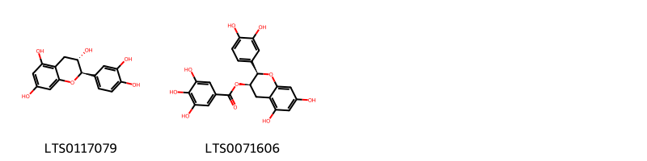
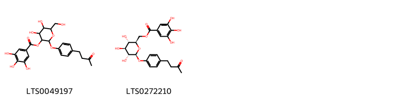
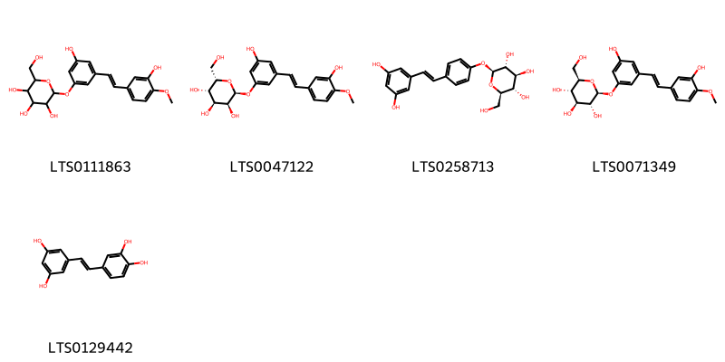

!!! abstract "Tóm tắt"

    Thân rễ Đại hoàng (Rheum palmatum L.) thuộc họ Rau răm (Polygonaceae). Được phân bố ở Trung Quốc, Mông Cổ, Việt Nam, Colombia, Anh. Ở Việt Nam phân bố khắp cả nước, thích hợp ở độ cao trên 1000m. Theo dân gian, dùng chữa hạ lỵ, ứ huyết, kinh bế thuỷ thũng, thấp nhiệt gây vàng da, ung thũng đinh đọc. Hiện nay dùng với liều nhẹ làm thuốc chữa kém ăn, ăn không tiêu, da vàng, hay đau bụng. Trong thân rễ Đại Hoàng người ta tìm thấy aloe-emodin, rhein, cmodin, chrysophanol, physcion.

## Thông tin về thực vật

Dược liệu **Đại Hoàng (Thân Rễ)** từ bộ phận **Rễ và Thân rễ** từ loài *Rheum palmatum*.

**Mô tả thực vật:** Là một cây sống lâu năm, rễ thô, to, n cao tới 2m, giữa rỗng, mặt thân nhẵn. Lá ở dưới to dài, có cuống dài, phiến lá hình tim cắt thành 3-7 thùy, mép thuỳ hơi có răng cưa hoặc hơi cắt, lá ở phía trên thân nhỏ hơn. Cụm hoa mọc thành chùm khi còn non, hoa có màu tím đỏ.

*Tài liệu tham khảo:* "Những cây thuốc và vị thuốc Việt Nam" - Đỗ Tất Lợi 
Trong dược điển Việt nam, một số loài có thể dùng thay thế cho nhau làm dược liệu bao gồm *Rheum palmatum, Rheum officinale*

!!! info "Phân loại thực vật của *Rheum palmatum*"
    - **Kingdom:** Plantae
    - **Phylum:** Tracheophyta
    - **Order:** Caryophyllales
    - **Family:** Polygonaceae
    - **Genus:** Rheum
    - **Species:** *Rheum palmatum*

**Phân bố trên thế giới:** Germany, nan, United States of America, Poland, China, Colombia, Estonia, Sweden, unknown or invalid, United Kingdom of Great Britain and Northern Ireland, Norway, New Zealand, Czechia, Korea, Republic of, Australia, Netherlands, Austria, Belgium

**Phân bố tại Việt nam:** Không có ghi nhận ở Việt Nam

!!! info "Phân loại thực vật của *Rheum officinale*"
    - **Kingdom:** Plantae
    - **Phylum:** Tracheophyta
    - **Order:** Caryophyllales
    - **Family:** Polygonaceae
    - **Genus:** Rheum
    - **Species:** *Rheum officinale*

**Phân bố trên thế giới:** Germany, Iceland, nan, Spain, Poland, Switzerland, China, Colombia, Sweden, unknown or invalid, United Kingdom of Great Britain and Northern Ireland, Hungary, Kenya, Netherlands, Finland, Indonesia

**Phân bố tại Việt nam:** Không có ghi nhận ở Việt Nam

## Thông tin về dược liệu 

### Định danh

!!! info "Thông tin về tên gọi"

    - Dược liệu tiếng Việt: đại hoàng
    - Dược liệu tiếng Trung: 大黄 (Da Huang)
    - Dược liệu tiếng Anh: Root And Rhizome of Sorrel Rhubarb
    - Dược liệu latin thông dụng: Rhizoma RheinRadix et Rhizoma Rhei
    - Dược liệu latin kiểu DĐVN: *rhizoma rhei*
    - Dược liệu latin kiểu DĐVN: *Radix et Rhizoma Rhei*
    - Dược liệu latin kiểu thông tư: *Rhizoma Rhei*
    - Bộ phận dùng: Rễ và Thân rễ (Rhizoma)

### Mô tả dược liệu 

- **Theo dược điển Việt nam V:** 
Dược liệu là thân rễ hình trụ, hình nón, dạng cầu hay méo mó không đều. dài 3 cm đến 17 cm, đường kính 3 cm đến 10 cm hay những phiến mỏng, bề rộng có thể tới 10 cm hay hơn. Thân rễ có mặt ngoài màu nâu vàng hay nâu đỏ, đôi khi có những đám đen nhạt. Vết bẻ màu đỏ cam, có hạt lổn nhổn. Dạng phiến có màu vàng nâu có thể có những sọc đen, mềm, sờ hơi dính tay. Mùi đặc trưng, vị đắng và chát.

- **Mô tả dược liệu theo thông tư chế biến dược liệu theo phương pháp cổ truyền:** 

### Chế biến 

- **Chế biến theo dược điển việt nam V**: 
Thu hoạch vào cuối mùa thu, khi lá khô héo hoặc mùa xuân năm sau, trước khi cây nảy mầm. Đào lấy thân rễ, loại bó rễ tua nhỏ, cạo vỏ ngoài, thái lát hoặc cắt đoạn, xuyên dày thành chuỗi, phơi khô. Bào chế Đại hoàng Đại hoàng: Loại bỏ tạp chất, rửa sạch, ủ mềm, thái lát dày. phơi ảm can nơi thoáng mát. Tửu Đại hoàng (Đại hoàng tẩm rượu): Lấy Đại hoàng phiến, dùng rượu phun ẩm đều, ủ qua, cho vào nồi đun nhỏ lửa, sao hơi se, lấy ra, phơi chỗ mát cho khô. Cứ  100 kg Đại hoàng phiến, dùng 10 L rượu. Thục đại hoàng: cắt Đại hoàng thành miếng nhỏ, trộn đều rượu cho vào thùng đậy kín, đặt vào nồi nước nấu cách thủy cho chín lấy ra phơi khô. Cứ 100 kg Đại hoàng cần 30 L rượu. Đại hoàng thán: Cho phiến Đại hoàng vào nồi. sao to lửa đến khi mặt ngoài màu đen xém, bên trong màu nâu sẫm, nhưng vẫn còn hương vị Đại hoàng.

- **Chế biến theo thông tư:** 

--- 

## Thành phần hóa học

- Theo tài liệu của GS. Đỗ Tất Lợi:  (1). theotannoglucozit, Rheoanthraglucozit
(2). aloe-emodin, rhein, cmodin, chrysophanol, physcion
    

**Thành phần hóa học từ loài **Rheum officinale**

Theo cơ sở dữ liệu lotus, loài *Rheum officinale* đã phân lập và xác định được **27** hoạt chất thuộc về các nhóm Anthracenes, Organooxygen compounds, Flavonoids, Phenols, Benzene and substituted derivatives, Stilbenes trong bảng dưới đây. Danh sách các hoạt chất như sau [(2r,3s,4s,5r,6s)-3,4,5-trihydroxy-6-[4-(3-oxobutyl)phenoxy]oxan-2-yl]methyl 3,4,5-trihydroxybenzoate [(LTS0272210)](https://lotus.naturalproducts.net/compound/lotus_id/LTS0272210), rhaponticin [(LTS0071349)](https://lotus.naturalproducts.net/compound/lotus_id/LTS0071349), sennoside a [(LTS0060282)](https://lotus.naturalproducts.net/compound/lotus_id/LTS0060282), 2,3-dihydroxypropyl 3,4,5-trihydroxybenzoate [(LTS0222449)](https://lotus.naturalproducts.net/compound/lotus_id/LTS0222449), (2s,3s,4s,5s,6s)-2-{3-hydroxy-5-[(1e)-2-(3-hydroxy-4-methoxyphenyl)ethenyl]phenoxy}-6-(hydroxymethyl)oxane-3,4,5-triol [(LTS0047122)](https://lotus.naturalproducts.net/compound/lotus_id/LTS0047122), 4-hydroxy-10-oxo-9-[3,4,5-trihydroxy-6-(hydroxymethyl)oxan-2-yl]-5-{[3,4,5-trihydroxy-6-(hydroxymethyl)oxan-2-yl]oxy}-9h-anthracene-2-carboxylic acid [(LTS0233173)](https://lotus.naturalproducts.net/compound/lotus_id/LTS0233173), (+)-catechol [(LTS0117079)](https://lotus.naturalproducts.net/compound/lotus_id/LTS0117079), methyl gallate [(LTS0043810)](https://lotus.naturalproducts.net/compound/lotus_id/LTS0043810), 4,9-dihydroxy-10-oxo-9-[(2r,3r,4s,5s,6r)-3,4,5-trihydroxy-6-(hydroxymethyl)oxan-2-yl]-5-{[(2s,3r,4s,5s,6r)-3,4,5-trihydroxy-6-(hydroxymethyl)oxan-2-yl]oxy}anthracene-2-carboxylic acid [(LTS0163959)](https://lotus.naturalproducts.net/compound/lotus_id/LTS0163959), galop [(LTS0222857)](https://lotus.naturalproducts.net/compound/lotus_id/LTS0222857), (9s)-4,9-dihydroxy-10-oxo-9-[(2r,3r,4s,5s,6r)-3,4,5-trihydroxy-6-(hydroxymethyl)oxan-2-yl]-5-{[(2s,3r,4s,5s,6r)-3,4,5-trihydroxy-6-(hydroxymethyl)oxan-2-yl]oxy}anthracene-2-carboxylic acid [(LTS0241337)](https://lotus.naturalproducts.net/compound/lotus_id/LTS0241337), frambinone [(LTS0021621)](https://lotus.naturalproducts.net/compound/lotus_id/LTS0021621), piceatannol [(LTS0129442)](https://lotus.naturalproducts.net/compound/lotus_id/LTS0129442), (2s,3r,4s,5s,6r)-2-{4-[2-(3,5-dihydroxyphenyl)ethenyl]phenoxy}-6-(hydroxymethyl)oxane-3,4,5-triol [(LTS0258713)](https://lotus.naturalproducts.net/compound/lotus_id/LTS0258713), 4,5-dihydroxy-6-(hydroxymethyl)-2-[4-(3-oxobutyl)phenoxy]oxan-3-yl 3,4,5-trihydroxybenzoate [(LTS0049197)](https://lotus.naturalproducts.net/compound/lotus_id/LTS0049197), 6-o-galloyl-β-d-glucose [(LTS0167841)](https://lotus.naturalproducts.net/compound/lotus_id/LTS0167841), 2-{3-hydroxy-5-[2-(3-hydroxy-4-methoxyphenyl)ethenyl]phenoxy}-6-(hydroxymethyl)oxane-3,4,5-triol [(LTS0111863)](https://lotus.naturalproducts.net/compound/lotus_id/LTS0111863), physcion [(LTS0052688)](https://lotus.naturalproducts.net/compound/lotus_id/LTS0052688), emodin [(LTS0163480)](https://lotus.naturalproducts.net/compound/lotus_id/LTS0163480), aloe emodin [(LTS0098857)](https://lotus.naturalproducts.net/compound/lotus_id/LTS0098857), 4-hydroxy-10-oxo-9-[(2s,3r,4r,5s,6r)-3,4,5-trihydroxy-6-(hydroxymethyl)oxan-2-yl]-5-{[(2s,3r,4s,5s,6r)-3,4,5-trihydroxy-6-(hydroxymethyl)oxan-2-yl]oxy}-9h-anthracene-2-carboxylic acid [(LTS0222746)](https://lotus.naturalproducts.net/compound/lotus_id/LTS0222746), (9s)-4,9-dihydroxy-10-oxo-9-[(3r,4s,5s,6r)-3,4,5-trihydroxy-6-(hydroxymethyl)oxan-2-yl]-5-{[(2s,3r,4s,5s,6r)-3,4,5-trihydroxy-6-(hydroxymethyl)oxan-2-yl]oxy}anthracene-2-carboxylic acid [(LTS0194880)](https://lotus.naturalproducts.net/compound/lotus_id/LTS0194880), epicatechin gallate [(LTS0071606)](https://lotus.naturalproducts.net/compound/lotus_id/LTS0071606), turkey rhubarb [(LTS0160968)](https://lotus.naturalproducts.net/compound/lotus_id/LTS0160968), (9r)-4-hydroxy-10-oxo-9-[(3r,4r,5s,6r)-3,4,5-trihydroxy-6-(hydroxymethyl)oxan-2-yl]-5-{[(2s,3r,4s,5s,6r)-3,4,5-trihydroxy-6-(hydroxymethyl)oxan-2-yl]oxy}-9h-anthracene-2-carboxylic acid [(LTS0272384)](https://lotus.naturalproducts.net/compound/lotus_id/LTS0272384), (2r,3r,4s,5r)-2,3,4,5-tetrahydroxy-6-oxohexyl 3,4,5-trihydroxybenzoate [(LTS0022275)](https://lotus.naturalproducts.net/compound/lotus_id/LTS0022275), monorhein [(LTS0275952)](https://lotus.naturalproducts.net/compound/lotus_id/LTS0275952). 
        
| chemicalTaxonomyClassyfireClass     |   smiles_count |
|:------------------------------------|---------------:|
| Anthracenes                         |           1039 |
| Benzene and substituted derivatives |            202 |
| Flavonoids                          |            115 |
| Organooxygen compounds              |            142 |
| Phenols                             |             19 |
| Stilbenes                           |            300 |

            
### Nhóm Anthracenes
<figure markdown="span">
    { width=100% }
<figcaption>Hình ảnh cấu trúc hóa học của hoạt chất thuộc nhóm *Anthracenes*. Tên thường gọi của các hoạt chất tương ứng là aloe emodin [(LTS0098857)](https://lotus.naturalproducts.net/compound/lotus_id/LTS0098857), (9s)-4,9-dihydroxy-10-oxo-9-[(3r,4s,5s,6r)-3,4,5-trihydroxy-6-(hydroxymethyl)oxan-2-yl]-5-{[(2s,3r,4s,5s,6r)-3,4,5-trihydroxy-6-(hydroxymethyl)oxan-2-yl]oxy}anthracene-2-carboxylic acid [(LTS0194880)](https://lotus.naturalproducts.net/compound/lotus_id/LTS0194880), 4,9-dihydroxy-10-oxo-9-[(2r,3r,4s,5s,6r)-3,4,5-trihydroxy-6-(hydroxymethyl)oxan-2-yl]-5-{[(2s,3r,4s,5s,6r)-3,4,5-trihydroxy-6-(hydroxymethyl)oxan-2-yl]oxy}anthracene-2-carboxylic acid [(LTS0163959)](https://lotus.naturalproducts.net/compound/lotus_id/LTS0163959), emodin [(LTS0163480)](https://lotus.naturalproducts.net/compound/lotus_id/LTS0163480), sennoside a [(LTS0060282)](https://lotus.naturalproducts.net/compound/lotus_id/LTS0060282), (9r)-4-hydroxy-10-oxo-9-[(3r,4r,5s,6r)-3,4,5-trihydroxy-6-(hydroxymethyl)oxan-2-yl]-5-{[(2s,3r,4s,5s,6r)-3,4,5-trihydroxy-6-(hydroxymethyl)oxan-2-yl]oxy}-9h-anthracene-2-carboxylic acid [(LTS0272384)](https://lotus.naturalproducts.net/compound/lotus_id/LTS0272384), 4-hydroxy-10-oxo-9-[(2s,3r,4r,5s,6r)-3,4,5-trihydroxy-6-(hydroxymethyl)oxan-2-yl]-5-{[(2s,3r,4s,5s,6r)-3,4,5-trihydroxy-6-(hydroxymethyl)oxan-2-yl]oxy}-9h-anthracene-2-carboxylic acid [(LTS0222746)](https://lotus.naturalproducts.net/compound/lotus_id/LTS0222746), (9s)-4,9-dihydroxy-10-oxo-9-[(2r,3r,4s,5s,6r)-3,4,5-trihydroxy-6-(hydroxymethyl)oxan-2-yl]-5-{[(2s,3r,4s,5s,6r)-3,4,5-trihydroxy-6-(hydroxymethyl)oxan-2-yl]oxy}anthracene-2-carboxylic acid [(LTS0241337)](https://lotus.naturalproducts.net/compound/lotus_id/LTS0241337), turkey rhubarb [(LTS0160968)](https://lotus.naturalproducts.net/compound/lotus_id/LTS0160968), 4-hydroxy-10-oxo-9-[3,4,5-trihydroxy-6-(hydroxymethyl)oxan-2-yl]-5-{[3,4,5-trihydroxy-6-(hydroxymethyl)oxan-2-yl]oxy}-9h-anthracene-2-carboxylic acid [(LTS0233173)](https://lotus.naturalproducts.net/compound/lotus_id/LTS0233173), physcion [(LTS0052688)](https://lotus.naturalproducts.net/compound/lotus_id/LTS0052688), monorhein [(LTS0275952)](https://lotus.naturalproducts.net/compound/lotus_id/LTS0275952).</figcaption>
</figure>

            
            
### Nhóm Anthracenes
<figure markdown="span">
    { width=100% }
<figcaption>Hình ảnh cấu trúc hóa học của hoạt chất thuộc nhóm *Anthracenes*. Tên thường gọi của các hoạt chất tương ứng là aloe emodin [(LTS0098857)](https://lotus.naturalproducts.net/compound/lotus_id/LTS0098857), (9s)-4,9-dihydroxy-10-oxo-9-[(3r,4s,5s,6r)-3,4,5-trihydroxy-6-(hydroxymethyl)oxan-2-yl]-5-{[(2s,3r,4s,5s,6r)-3,4,5-trihydroxy-6-(hydroxymethyl)oxan-2-yl]oxy}anthracene-2-carboxylic acid [(LTS0194880)](https://lotus.naturalproducts.net/compound/lotus_id/LTS0194880), 4,9-dihydroxy-10-oxo-9-[(2r,3r,4s,5s,6r)-3,4,5-trihydroxy-6-(hydroxymethyl)oxan-2-yl]-5-{[(2s,3r,4s,5s,6r)-3,4,5-trihydroxy-6-(hydroxymethyl)oxan-2-yl]oxy}anthracene-2-carboxylic acid [(LTS0163959)](https://lotus.naturalproducts.net/compound/lotus_id/LTS0163959), emodin [(LTS0163480)](https://lotus.naturalproducts.net/compound/lotus_id/LTS0163480), sennoside a [(LTS0060282)](https://lotus.naturalproducts.net/compound/lotus_id/LTS0060282), (9r)-4-hydroxy-10-oxo-9-[(3r,4r,5s,6r)-3,4,5-trihydroxy-6-(hydroxymethyl)oxan-2-yl]-5-{[(2s,3r,4s,5s,6r)-3,4,5-trihydroxy-6-(hydroxymethyl)oxan-2-yl]oxy}-9h-anthracene-2-carboxylic acid [(LTS0272384)](https://lotus.naturalproducts.net/compound/lotus_id/LTS0272384), 4-hydroxy-10-oxo-9-[(2s,3r,4r,5s,6r)-3,4,5-trihydroxy-6-(hydroxymethyl)oxan-2-yl]-5-{[(2s,3r,4s,5s,6r)-3,4,5-trihydroxy-6-(hydroxymethyl)oxan-2-yl]oxy}-9h-anthracene-2-carboxylic acid [(LTS0222746)](https://lotus.naturalproducts.net/compound/lotus_id/LTS0222746), (9s)-4,9-dihydroxy-10-oxo-9-[(2r,3r,4s,5s,6r)-3,4,5-trihydroxy-6-(hydroxymethyl)oxan-2-yl]-5-{[(2s,3r,4s,5s,6r)-3,4,5-trihydroxy-6-(hydroxymethyl)oxan-2-yl]oxy}anthracene-2-carboxylic acid [(LTS0241337)](https://lotus.naturalproducts.net/compound/lotus_id/LTS0241337), turkey rhubarb [(LTS0160968)](https://lotus.naturalproducts.net/compound/lotus_id/LTS0160968), 4-hydroxy-10-oxo-9-[3,4,5-trihydroxy-6-(hydroxymethyl)oxan-2-yl]-5-{[3,4,5-trihydroxy-6-(hydroxymethyl)oxan-2-yl]oxy}-9h-anthracene-2-carboxylic acid [(LTS0233173)](https://lotus.naturalproducts.net/compound/lotus_id/LTS0233173), physcion [(LTS0052688)](https://lotus.naturalproducts.net/compound/lotus_id/LTS0052688), monorhein [(LTS0275952)](https://lotus.naturalproducts.net/compound/lotus_id/LTS0275952).</figcaption>
</figure>

### Nhóm Benzene and substituted derivatives
<figure markdown="span">
    { width=100% }
<figcaption>Hình ảnh cấu trúc hóa học của hoạt chất thuộc nhóm *Benzene and substituted derivatives*. Tên thường gọi của các hoạt chất tương ứng là galop [(LTS0222857)](https://lotus.naturalproducts.net/compound/lotus_id/LTS0222857), 2,3-dihydroxypropyl 3,4,5-trihydroxybenzoate [(LTS0222449)](https://lotus.naturalproducts.net/compound/lotus_id/LTS0222449), 6-o-galloyl-β-d-glucose [(LTS0167841)](https://lotus.naturalproducts.net/compound/lotus_id/LTS0167841), methyl gallate [(LTS0043810)](https://lotus.naturalproducts.net/compound/lotus_id/LTS0043810), (2r,3r,4s,5r)-2,3,4,5-tetrahydroxy-6-oxohexyl 3,4,5-trihydroxybenzoate [(LTS0022275)](https://lotus.naturalproducts.net/compound/lotus_id/LTS0022275).</figcaption>
</figure>

            
            
### Nhóm Anthracenes
<figure markdown="span">
    { width=100% }
<figcaption>Hình ảnh cấu trúc hóa học của hoạt chất thuộc nhóm *Anthracenes*. Tên thường gọi của các hoạt chất tương ứng là aloe emodin [(LTS0098857)](https://lotus.naturalproducts.net/compound/lotus_id/LTS0098857), (9s)-4,9-dihydroxy-10-oxo-9-[(3r,4s,5s,6r)-3,4,5-trihydroxy-6-(hydroxymethyl)oxan-2-yl]-5-{[(2s,3r,4s,5s,6r)-3,4,5-trihydroxy-6-(hydroxymethyl)oxan-2-yl]oxy}anthracene-2-carboxylic acid [(LTS0194880)](https://lotus.naturalproducts.net/compound/lotus_id/LTS0194880), 4,9-dihydroxy-10-oxo-9-[(2r,3r,4s,5s,6r)-3,4,5-trihydroxy-6-(hydroxymethyl)oxan-2-yl]-5-{[(2s,3r,4s,5s,6r)-3,4,5-trihydroxy-6-(hydroxymethyl)oxan-2-yl]oxy}anthracene-2-carboxylic acid [(LTS0163959)](https://lotus.naturalproducts.net/compound/lotus_id/LTS0163959), emodin [(LTS0163480)](https://lotus.naturalproducts.net/compound/lotus_id/LTS0163480), sennoside a [(LTS0060282)](https://lotus.naturalproducts.net/compound/lotus_id/LTS0060282), (9r)-4-hydroxy-10-oxo-9-[(3r,4r,5s,6r)-3,4,5-trihydroxy-6-(hydroxymethyl)oxan-2-yl]-5-{[(2s,3r,4s,5s,6r)-3,4,5-trihydroxy-6-(hydroxymethyl)oxan-2-yl]oxy}-9h-anthracene-2-carboxylic acid [(LTS0272384)](https://lotus.naturalproducts.net/compound/lotus_id/LTS0272384), 4-hydroxy-10-oxo-9-[(2s,3r,4r,5s,6r)-3,4,5-trihydroxy-6-(hydroxymethyl)oxan-2-yl]-5-{[(2s,3r,4s,5s,6r)-3,4,5-trihydroxy-6-(hydroxymethyl)oxan-2-yl]oxy}-9h-anthracene-2-carboxylic acid [(LTS0222746)](https://lotus.naturalproducts.net/compound/lotus_id/LTS0222746), (9s)-4,9-dihydroxy-10-oxo-9-[(2r,3r,4s,5s,6r)-3,4,5-trihydroxy-6-(hydroxymethyl)oxan-2-yl]-5-{[(2s,3r,4s,5s,6r)-3,4,5-trihydroxy-6-(hydroxymethyl)oxan-2-yl]oxy}anthracene-2-carboxylic acid [(LTS0241337)](https://lotus.naturalproducts.net/compound/lotus_id/LTS0241337), turkey rhubarb [(LTS0160968)](https://lotus.naturalproducts.net/compound/lotus_id/LTS0160968), 4-hydroxy-10-oxo-9-[3,4,5-trihydroxy-6-(hydroxymethyl)oxan-2-yl]-5-{[3,4,5-trihydroxy-6-(hydroxymethyl)oxan-2-yl]oxy}-9h-anthracene-2-carboxylic acid [(LTS0233173)](https://lotus.naturalproducts.net/compound/lotus_id/LTS0233173), physcion [(LTS0052688)](https://lotus.naturalproducts.net/compound/lotus_id/LTS0052688), monorhein [(LTS0275952)](https://lotus.naturalproducts.net/compound/lotus_id/LTS0275952).</figcaption>
</figure>

### Nhóm Benzene and substituted derivatives
<figure markdown="span">
    { width=100% }
<figcaption>Hình ảnh cấu trúc hóa học của hoạt chất thuộc nhóm *Benzene and substituted derivatives*. Tên thường gọi của các hoạt chất tương ứng là galop [(LTS0222857)](https://lotus.naturalproducts.net/compound/lotus_id/LTS0222857), 2,3-dihydroxypropyl 3,4,5-trihydroxybenzoate [(LTS0222449)](https://lotus.naturalproducts.net/compound/lotus_id/LTS0222449), 6-o-galloyl-β-d-glucose [(LTS0167841)](https://lotus.naturalproducts.net/compound/lotus_id/LTS0167841), methyl gallate [(LTS0043810)](https://lotus.naturalproducts.net/compound/lotus_id/LTS0043810), (2r,3r,4s,5r)-2,3,4,5-tetrahydroxy-6-oxohexyl 3,4,5-trihydroxybenzoate [(LTS0022275)](https://lotus.naturalproducts.net/compound/lotus_id/LTS0022275).</figcaption>
</figure>

### Nhóm Flavonoids
<figure markdown="span">
    { width=100% }
<figcaption>Hình ảnh cấu trúc hóa học của hoạt chất thuộc nhóm *Flavonoids*. Tên thường gọi của các hoạt chất tương ứng là (+)-catechol [(LTS0117079)](https://lotus.naturalproducts.net/compound/lotus_id/LTS0117079), epicatechin gallate [(LTS0071606)](https://lotus.naturalproducts.net/compound/lotus_id/LTS0071606).</figcaption>
</figure>

            
            
### Nhóm Anthracenes
<figure markdown="span">
    { width=100% }
<figcaption>Hình ảnh cấu trúc hóa học của hoạt chất thuộc nhóm *Anthracenes*. Tên thường gọi của các hoạt chất tương ứng là aloe emodin [(LTS0098857)](https://lotus.naturalproducts.net/compound/lotus_id/LTS0098857), (9s)-4,9-dihydroxy-10-oxo-9-[(3r,4s,5s,6r)-3,4,5-trihydroxy-6-(hydroxymethyl)oxan-2-yl]-5-{[(2s,3r,4s,5s,6r)-3,4,5-trihydroxy-6-(hydroxymethyl)oxan-2-yl]oxy}anthracene-2-carboxylic acid [(LTS0194880)](https://lotus.naturalproducts.net/compound/lotus_id/LTS0194880), 4,9-dihydroxy-10-oxo-9-[(2r,3r,4s,5s,6r)-3,4,5-trihydroxy-6-(hydroxymethyl)oxan-2-yl]-5-{[(2s,3r,4s,5s,6r)-3,4,5-trihydroxy-6-(hydroxymethyl)oxan-2-yl]oxy}anthracene-2-carboxylic acid [(LTS0163959)](https://lotus.naturalproducts.net/compound/lotus_id/LTS0163959), emodin [(LTS0163480)](https://lotus.naturalproducts.net/compound/lotus_id/LTS0163480), sennoside a [(LTS0060282)](https://lotus.naturalproducts.net/compound/lotus_id/LTS0060282), (9r)-4-hydroxy-10-oxo-9-[(3r,4r,5s,6r)-3,4,5-trihydroxy-6-(hydroxymethyl)oxan-2-yl]-5-{[(2s,3r,4s,5s,6r)-3,4,5-trihydroxy-6-(hydroxymethyl)oxan-2-yl]oxy}-9h-anthracene-2-carboxylic acid [(LTS0272384)](https://lotus.naturalproducts.net/compound/lotus_id/LTS0272384), 4-hydroxy-10-oxo-9-[(2s,3r,4r,5s,6r)-3,4,5-trihydroxy-6-(hydroxymethyl)oxan-2-yl]-5-{[(2s,3r,4s,5s,6r)-3,4,5-trihydroxy-6-(hydroxymethyl)oxan-2-yl]oxy}-9h-anthracene-2-carboxylic acid [(LTS0222746)](https://lotus.naturalproducts.net/compound/lotus_id/LTS0222746), (9s)-4,9-dihydroxy-10-oxo-9-[(2r,3r,4s,5s,6r)-3,4,5-trihydroxy-6-(hydroxymethyl)oxan-2-yl]-5-{[(2s,3r,4s,5s,6r)-3,4,5-trihydroxy-6-(hydroxymethyl)oxan-2-yl]oxy}anthracene-2-carboxylic acid [(LTS0241337)](https://lotus.naturalproducts.net/compound/lotus_id/LTS0241337), turkey rhubarb [(LTS0160968)](https://lotus.naturalproducts.net/compound/lotus_id/LTS0160968), 4-hydroxy-10-oxo-9-[3,4,5-trihydroxy-6-(hydroxymethyl)oxan-2-yl]-5-{[3,4,5-trihydroxy-6-(hydroxymethyl)oxan-2-yl]oxy}-9h-anthracene-2-carboxylic acid [(LTS0233173)](https://lotus.naturalproducts.net/compound/lotus_id/LTS0233173), physcion [(LTS0052688)](https://lotus.naturalproducts.net/compound/lotus_id/LTS0052688), monorhein [(LTS0275952)](https://lotus.naturalproducts.net/compound/lotus_id/LTS0275952).</figcaption>
</figure>

### Nhóm Benzene and substituted derivatives
<figure markdown="span">
    { width=100% }
<figcaption>Hình ảnh cấu trúc hóa học của hoạt chất thuộc nhóm *Benzene and substituted derivatives*. Tên thường gọi của các hoạt chất tương ứng là galop [(LTS0222857)](https://lotus.naturalproducts.net/compound/lotus_id/LTS0222857), 2,3-dihydroxypropyl 3,4,5-trihydroxybenzoate [(LTS0222449)](https://lotus.naturalproducts.net/compound/lotus_id/LTS0222449), 6-o-galloyl-β-d-glucose [(LTS0167841)](https://lotus.naturalproducts.net/compound/lotus_id/LTS0167841), methyl gallate [(LTS0043810)](https://lotus.naturalproducts.net/compound/lotus_id/LTS0043810), (2r,3r,4s,5r)-2,3,4,5-tetrahydroxy-6-oxohexyl 3,4,5-trihydroxybenzoate [(LTS0022275)](https://lotus.naturalproducts.net/compound/lotus_id/LTS0022275).</figcaption>
</figure>

### Nhóm Flavonoids
<figure markdown="span">
    { width=100% }
<figcaption>Hình ảnh cấu trúc hóa học của hoạt chất thuộc nhóm *Flavonoids*. Tên thường gọi của các hoạt chất tương ứng là (+)-catechol [(LTS0117079)](https://lotus.naturalproducts.net/compound/lotus_id/LTS0117079), epicatechin gallate [(LTS0071606)](https://lotus.naturalproducts.net/compound/lotus_id/LTS0071606).</figcaption>
</figure>

### Nhóm Organooxygen compounds
<figure markdown="span">
    { width=100% }
<figcaption>Hình ảnh cấu trúc hóa học của hoạt chất thuộc nhóm *Organooxygen compounds*. Tên thường gọi của các hoạt chất tương ứng là 4,5-dihydroxy-6-(hydroxymethyl)-2-[4-(3-oxobutyl)phenoxy]oxan-3-yl 3,4,5-trihydroxybenzoate [(LTS0049197)](https://lotus.naturalproducts.net/compound/lotus_id/LTS0049197), [(2r,3s,4s,5r,6s)-3,4,5-trihydroxy-6-[4-(3-oxobutyl)phenoxy]oxan-2-yl]methyl 3,4,5-trihydroxybenzoate [(LTS0272210)](https://lotus.naturalproducts.net/compound/lotus_id/LTS0272210).</figcaption>
</figure>

            
            
### Nhóm Anthracenes
<figure markdown="span">
    { width=100% }
<figcaption>Hình ảnh cấu trúc hóa học của hoạt chất thuộc nhóm *Anthracenes*. Tên thường gọi của các hoạt chất tương ứng là aloe emodin [(LTS0098857)](https://lotus.naturalproducts.net/compound/lotus_id/LTS0098857), (9s)-4,9-dihydroxy-10-oxo-9-[(3r,4s,5s,6r)-3,4,5-trihydroxy-6-(hydroxymethyl)oxan-2-yl]-5-{[(2s,3r,4s,5s,6r)-3,4,5-trihydroxy-6-(hydroxymethyl)oxan-2-yl]oxy}anthracene-2-carboxylic acid [(LTS0194880)](https://lotus.naturalproducts.net/compound/lotus_id/LTS0194880), 4,9-dihydroxy-10-oxo-9-[(2r,3r,4s,5s,6r)-3,4,5-trihydroxy-6-(hydroxymethyl)oxan-2-yl]-5-{[(2s,3r,4s,5s,6r)-3,4,5-trihydroxy-6-(hydroxymethyl)oxan-2-yl]oxy}anthracene-2-carboxylic acid [(LTS0163959)](https://lotus.naturalproducts.net/compound/lotus_id/LTS0163959), emodin [(LTS0163480)](https://lotus.naturalproducts.net/compound/lotus_id/LTS0163480), sennoside a [(LTS0060282)](https://lotus.naturalproducts.net/compound/lotus_id/LTS0060282), (9r)-4-hydroxy-10-oxo-9-[(3r,4r,5s,6r)-3,4,5-trihydroxy-6-(hydroxymethyl)oxan-2-yl]-5-{[(2s,3r,4s,5s,6r)-3,4,5-trihydroxy-6-(hydroxymethyl)oxan-2-yl]oxy}-9h-anthracene-2-carboxylic acid [(LTS0272384)](https://lotus.naturalproducts.net/compound/lotus_id/LTS0272384), 4-hydroxy-10-oxo-9-[(2s,3r,4r,5s,6r)-3,4,5-trihydroxy-6-(hydroxymethyl)oxan-2-yl]-5-{[(2s,3r,4s,5s,6r)-3,4,5-trihydroxy-6-(hydroxymethyl)oxan-2-yl]oxy}-9h-anthracene-2-carboxylic acid [(LTS0222746)](https://lotus.naturalproducts.net/compound/lotus_id/LTS0222746), (9s)-4,9-dihydroxy-10-oxo-9-[(2r,3r,4s,5s,6r)-3,4,5-trihydroxy-6-(hydroxymethyl)oxan-2-yl]-5-{[(2s,3r,4s,5s,6r)-3,4,5-trihydroxy-6-(hydroxymethyl)oxan-2-yl]oxy}anthracene-2-carboxylic acid [(LTS0241337)](https://lotus.naturalproducts.net/compound/lotus_id/LTS0241337), turkey rhubarb [(LTS0160968)](https://lotus.naturalproducts.net/compound/lotus_id/LTS0160968), 4-hydroxy-10-oxo-9-[3,4,5-trihydroxy-6-(hydroxymethyl)oxan-2-yl]-5-{[3,4,5-trihydroxy-6-(hydroxymethyl)oxan-2-yl]oxy}-9h-anthracene-2-carboxylic acid [(LTS0233173)](https://lotus.naturalproducts.net/compound/lotus_id/LTS0233173), physcion [(LTS0052688)](https://lotus.naturalproducts.net/compound/lotus_id/LTS0052688), monorhein [(LTS0275952)](https://lotus.naturalproducts.net/compound/lotus_id/LTS0275952).</figcaption>
</figure>

### Nhóm Benzene and substituted derivatives
<figure markdown="span">
    { width=100% }
<figcaption>Hình ảnh cấu trúc hóa học của hoạt chất thuộc nhóm *Benzene and substituted derivatives*. Tên thường gọi của các hoạt chất tương ứng là galop [(LTS0222857)](https://lotus.naturalproducts.net/compound/lotus_id/LTS0222857), 2,3-dihydroxypropyl 3,4,5-trihydroxybenzoate [(LTS0222449)](https://lotus.naturalproducts.net/compound/lotus_id/LTS0222449), 6-o-galloyl-β-d-glucose [(LTS0167841)](https://lotus.naturalproducts.net/compound/lotus_id/LTS0167841), methyl gallate [(LTS0043810)](https://lotus.naturalproducts.net/compound/lotus_id/LTS0043810), (2r,3r,4s,5r)-2,3,4,5-tetrahydroxy-6-oxohexyl 3,4,5-trihydroxybenzoate [(LTS0022275)](https://lotus.naturalproducts.net/compound/lotus_id/LTS0022275).</figcaption>
</figure>

### Nhóm Flavonoids
<figure markdown="span">
    { width=100% }
<figcaption>Hình ảnh cấu trúc hóa học của hoạt chất thuộc nhóm *Flavonoids*. Tên thường gọi của các hoạt chất tương ứng là (+)-catechol [(LTS0117079)](https://lotus.naturalproducts.net/compound/lotus_id/LTS0117079), epicatechin gallate [(LTS0071606)](https://lotus.naturalproducts.net/compound/lotus_id/LTS0071606).</figcaption>
</figure>

### Nhóm Organooxygen compounds
<figure markdown="span">
    { width=100% }
<figcaption>Hình ảnh cấu trúc hóa học của hoạt chất thuộc nhóm *Organooxygen compounds*. Tên thường gọi của các hoạt chất tương ứng là 4,5-dihydroxy-6-(hydroxymethyl)-2-[4-(3-oxobutyl)phenoxy]oxan-3-yl 3,4,5-trihydroxybenzoate [(LTS0049197)](https://lotus.naturalproducts.net/compound/lotus_id/LTS0049197), [(2r,3s,4s,5r,6s)-3,4,5-trihydroxy-6-[4-(3-oxobutyl)phenoxy]oxan-2-yl]methyl 3,4,5-trihydroxybenzoate [(LTS0272210)](https://lotus.naturalproducts.net/compound/lotus_id/LTS0272210).</figcaption>
</figure>

### Nhóm Phenols
<figure markdown="span">
    { width=100% }
<figcaption>Hình ảnh cấu trúc hóa học của hoạt chất thuộc nhóm *Phenols*. Tên thường gọi của các hoạt chất tương ứng là frambinone [(LTS0021621)](https://lotus.naturalproducts.net/compound/lotus_id/LTS0021621).</figcaption>
</figure>

            
            
### Nhóm Anthracenes
<figure markdown="span">
    { width=100% }
<figcaption>Hình ảnh cấu trúc hóa học của hoạt chất thuộc nhóm *Anthracenes*. Tên thường gọi của các hoạt chất tương ứng là aloe emodin [(LTS0098857)](https://lotus.naturalproducts.net/compound/lotus_id/LTS0098857), (9s)-4,9-dihydroxy-10-oxo-9-[(3r,4s,5s,6r)-3,4,5-trihydroxy-6-(hydroxymethyl)oxan-2-yl]-5-{[(2s,3r,4s,5s,6r)-3,4,5-trihydroxy-6-(hydroxymethyl)oxan-2-yl]oxy}anthracene-2-carboxylic acid [(LTS0194880)](https://lotus.naturalproducts.net/compound/lotus_id/LTS0194880), 4,9-dihydroxy-10-oxo-9-[(2r,3r,4s,5s,6r)-3,4,5-trihydroxy-6-(hydroxymethyl)oxan-2-yl]-5-{[(2s,3r,4s,5s,6r)-3,4,5-trihydroxy-6-(hydroxymethyl)oxan-2-yl]oxy}anthracene-2-carboxylic acid [(LTS0163959)](https://lotus.naturalproducts.net/compound/lotus_id/LTS0163959), emodin [(LTS0163480)](https://lotus.naturalproducts.net/compound/lotus_id/LTS0163480), sennoside a [(LTS0060282)](https://lotus.naturalproducts.net/compound/lotus_id/LTS0060282), (9r)-4-hydroxy-10-oxo-9-[(3r,4r,5s,6r)-3,4,5-trihydroxy-6-(hydroxymethyl)oxan-2-yl]-5-{[(2s,3r,4s,5s,6r)-3,4,5-trihydroxy-6-(hydroxymethyl)oxan-2-yl]oxy}-9h-anthracene-2-carboxylic acid [(LTS0272384)](https://lotus.naturalproducts.net/compound/lotus_id/LTS0272384), 4-hydroxy-10-oxo-9-[(2s,3r,4r,5s,6r)-3,4,5-trihydroxy-6-(hydroxymethyl)oxan-2-yl]-5-{[(2s,3r,4s,5s,6r)-3,4,5-trihydroxy-6-(hydroxymethyl)oxan-2-yl]oxy}-9h-anthracene-2-carboxylic acid [(LTS0222746)](https://lotus.naturalproducts.net/compound/lotus_id/LTS0222746), (9s)-4,9-dihydroxy-10-oxo-9-[(2r,3r,4s,5s,6r)-3,4,5-trihydroxy-6-(hydroxymethyl)oxan-2-yl]-5-{[(2s,3r,4s,5s,6r)-3,4,5-trihydroxy-6-(hydroxymethyl)oxan-2-yl]oxy}anthracene-2-carboxylic acid [(LTS0241337)](https://lotus.naturalproducts.net/compound/lotus_id/LTS0241337), turkey rhubarb [(LTS0160968)](https://lotus.naturalproducts.net/compound/lotus_id/LTS0160968), 4-hydroxy-10-oxo-9-[3,4,5-trihydroxy-6-(hydroxymethyl)oxan-2-yl]-5-{[3,4,5-trihydroxy-6-(hydroxymethyl)oxan-2-yl]oxy}-9h-anthracene-2-carboxylic acid [(LTS0233173)](https://lotus.naturalproducts.net/compound/lotus_id/LTS0233173), physcion [(LTS0052688)](https://lotus.naturalproducts.net/compound/lotus_id/LTS0052688), monorhein [(LTS0275952)](https://lotus.naturalproducts.net/compound/lotus_id/LTS0275952).</figcaption>
</figure>

### Nhóm Benzene and substituted derivatives
<figure markdown="span">
    { width=100% }
<figcaption>Hình ảnh cấu trúc hóa học của hoạt chất thuộc nhóm *Benzene and substituted derivatives*. Tên thường gọi của các hoạt chất tương ứng là galop [(LTS0222857)](https://lotus.naturalproducts.net/compound/lotus_id/LTS0222857), 2,3-dihydroxypropyl 3,4,5-trihydroxybenzoate [(LTS0222449)](https://lotus.naturalproducts.net/compound/lotus_id/LTS0222449), 6-o-galloyl-β-d-glucose [(LTS0167841)](https://lotus.naturalproducts.net/compound/lotus_id/LTS0167841), methyl gallate [(LTS0043810)](https://lotus.naturalproducts.net/compound/lotus_id/LTS0043810), (2r,3r,4s,5r)-2,3,4,5-tetrahydroxy-6-oxohexyl 3,4,5-trihydroxybenzoate [(LTS0022275)](https://lotus.naturalproducts.net/compound/lotus_id/LTS0022275).</figcaption>
</figure>

### Nhóm Flavonoids
<figure markdown="span">
    { width=100% }
<figcaption>Hình ảnh cấu trúc hóa học của hoạt chất thuộc nhóm *Flavonoids*. Tên thường gọi của các hoạt chất tương ứng là (+)-catechol [(LTS0117079)](https://lotus.naturalproducts.net/compound/lotus_id/LTS0117079), epicatechin gallate [(LTS0071606)](https://lotus.naturalproducts.net/compound/lotus_id/LTS0071606).</figcaption>
</figure>

### Nhóm Organooxygen compounds
<figure markdown="span">
    { width=100% }
<figcaption>Hình ảnh cấu trúc hóa học của hoạt chất thuộc nhóm *Organooxygen compounds*. Tên thường gọi của các hoạt chất tương ứng là 4,5-dihydroxy-6-(hydroxymethyl)-2-[4-(3-oxobutyl)phenoxy]oxan-3-yl 3,4,5-trihydroxybenzoate [(LTS0049197)](https://lotus.naturalproducts.net/compound/lotus_id/LTS0049197), [(2r,3s,4s,5r,6s)-3,4,5-trihydroxy-6-[4-(3-oxobutyl)phenoxy]oxan-2-yl]methyl 3,4,5-trihydroxybenzoate [(LTS0272210)](https://lotus.naturalproducts.net/compound/lotus_id/LTS0272210).</figcaption>
</figure>

### Nhóm Phenols
<figure markdown="span">
    { width=100% }
<figcaption>Hình ảnh cấu trúc hóa học của hoạt chất thuộc nhóm *Phenols*. Tên thường gọi của các hoạt chất tương ứng là frambinone [(LTS0021621)](https://lotus.naturalproducts.net/compound/lotus_id/LTS0021621).</figcaption>
</figure>

### Nhóm Stilbenes
<figure markdown="span">
    { width=100% }
<figcaption>Hình ảnh cấu trúc hóa học của hoạt chất thuộc nhóm *Stilbenes*. Tên thường gọi của các hoạt chất tương ứng là 2-{3-hydroxy-5-[2-(3-hydroxy-4-methoxyphenyl)ethenyl]phenoxy}-6-(hydroxymethyl)oxane-3,4,5-triol [(LTS0111863)](https://lotus.naturalproducts.net/compound/lotus_id/LTS0111863), (2s,3s,4s,5s,6s)-2-{3-hydroxy-5-[(1e)-2-(3-hydroxy-4-methoxyphenyl)ethenyl]phenoxy}-6-(hydroxymethyl)oxane-3,4,5-triol [(LTS0047122)](https://lotus.naturalproducts.net/compound/lotus_id/LTS0047122), (2s,3r,4s,5s,6r)-2-{4-[2-(3,5-dihydroxyphenyl)ethenyl]phenoxy}-6-(hydroxymethyl)oxane-3,4,5-triol [(LTS0258713)](https://lotus.naturalproducts.net/compound/lotus_id/LTS0258713), rhaponticin [(LTS0071349)](https://lotus.naturalproducts.net/compound/lotus_id/LTS0071349), piceatannol [(LTS0129442)](https://lotus.naturalproducts.net/compound/lotus_id/LTS0129442).</figcaption>
</figure>

            

---

## Tác dụng dược lý

Theo tài liệu "Những cây thuốc và vị thuốc Việt Nam" - Đỗ Tất Lợi:- Kích thích sự co bóp của ruột
- Tính chất bổ
- Tác dụng diệt khuẩn (staphyllococcus, lỵ, thương hàn, tả).

Theo tài liệu quốc tế: to promote catharsis and purge away heat, to reduce heat in blood and counteract toxicity, and to eliminate blood stasis and stimulate menstrual discharge.

---

## Dược điển Việt Nam V

### Soi bột:

Bột màu vàng nâu, mùi đặc trưng, vị đẳng, chát. Soi kính hiển vi thấy: Mảnh tế bào chứa chất màu vàng, tế bào mô mềm hình nhiều cạnh chứa hạt tinh bột, mảnh mạch mạng. Tinh thể calci oxalat hình cầu gai từ 50 pm đến 200 pm. Hạt tinh bột đơn hay kép hình đĩa hay đa giác, có rốn hình sao. Quan sát dưới ánh sáng từ ngoại ờ bước sóng 366 nm bột có huỳnh quang màu nâu.

<!-- Hình ảnh soi bột sẽ được tự động chèn vào đây sau -->

### Vi phẫu:

Mô mềm vỏ hẹp, libe ít phát triển, tầng sinh libe-gỗ có 3 đến 5 hàng tế bào, phía trong là phần gỗ xếp tỏa tròn. Phần ruột rộng có cấu tạo cấp ba được hình thành nhờ những tầng phát sinh phụ xuất hiện dưới dạng vòng tròn nhỏ sinh ra libe ờ giữa và gỗ ờ xung quanh. Các đám libe-gỗ cấp ba này có các tia ruột tỏa ra giống như những hình sao rất đặc biệt. Mô mềm có chứa tinh bột và tinh thể calci oxalat hình cầu gai.

<!-- Hình ảnh vi phẫu sẽ được tự động chèn vào đây sau -->

### Định tính

A. Đun sôi 0,1 g bột dược liệu với 5 ml dung dịch acid sulfuric 1M (TT) trong 2 min. Để nguội, lắc kỹ hỗn hợp với 10 ml ether ethylic (TT). Tách riêng lớp ether vào một bình gạn và lắc với 5 ml dung dịch amoniac 10 % (TT). Lớp dung dịch amoniac sẽ có màu đỏ tím. B. Phương pháp sắc ký lớp mỏng (Phụ lục 5.4). Bản mỏng: Silica gel G Dung môi khai triển: Toluen – ethylacetat – methanol – acid formic – nước (30 : 10 : 2 : 0,5 : 5) (lắc kỹ, để tách lớp, lấy lớp trên). Dung dịch thử: Lấy 1,0 g bột dược liệu, thêm 50 ml methanol (TT), đun hồi lưu trên cách thủy trong 2 h, lọc, cô trên cách thủy đến cạn. Thêm vào cắn 20 ml dung dịch acid hydrocỉorỉc 10% (TT) và 20 ml cloroform (TT), đun hồi lưu trong cách thủy trong 2 h, để nguội. Chuyên dịch thu được vào bình gạn, gạn lấy lớp cloroform. Lớp nước còn lại lắc với cloroform (TT) thêm 2 lần nữa, mỗi lần 20 ml. Gộp các dịch chiết cloroform ở trên, cô trên cách thủy đến cạn. Hòa cắn thu được trong 5 ml ethanol (TT) được dung dịch chấm sắc ký. Dung dịch chất đối chiếu: Hoà tan emodin chuẩn trong ethanol (TT) để được dung dịch có nồng độ 0,3 mg/ml Dung dịch dược liệu đổi chiếu: Nếu không có emodin chuẩn, lấy 1,0 g bột Đại hoàng (mẫu chuẩn), tiến hành chiết như mô tả ở phần Dung dịch thử. Cách tiến hành: Chấm riêng biệt lên bản mỏng 5 pl dung dịch chất đối chiếu, 10 gỉ dung dịch thử và 10 gl dung dịch dược liệu đối chiếu. Sau khi triển khai sắc ký, lấy bản mỏng ra để khô ở nhiệt độ phòng. Quan sát bản mỏng dưới ánh sáng tử ngoại ở bước sóng 366 nm. Trên sắc ký đồ của dung dịch thử phải có vết huỳnh quang màu vàng, có cùng giá trị Rf với vết emodin trên sắc ký đồ của dung dịch chất đối chiếu; hoặc trên sắc ký’ đồ của dung dịch thử phải có các vết cùng màu sắc và giá trị Rf với các vết trên sắc ký đồ của dung dịch dược liệu đối chiếu. Các vết huỳnh quang vàng chuyển thành màu hồng khi hơ trong hơi amoniac.

### Định lượng

Phương pháp sẳc ký lỏng (Phụ lục 5.3). Pha động’. Methanol – dung dịch acid phosphoric 0. 1 % (TT) (85 : 15). Dung dịch thử: Cân chính xác khoảng 0,15 g bột dược liệu (qua rây số 250) vào bình nón nút mài 100 ml, thêm chính xác 25 ml methanol (TT), đậy kín, cân. Đun sôi hồi lưu trong cách thủy 1 h, để nguội, cân và bổ sung lượng dung môi (nếu cần) để được khối lượng ban đầu, trộn đều, lọc. Lấv chính xác 5 ml dịch lọc, bốc hơi trên cách thủy đến cạn. Thêm vào cắn 10 ml dung dịch acid hydrocloric 8 % (TT), lắc siêu âm trong 2 min, thêm 20 mi cloroform (TT), đun sôi hồi lưu trong 1 h, để nguội, chuyển vào bình gạn. Tráng rửa bình nón bằng 10 mi cloroform (TT), gộp dịch rửa cloroform vào bình gạn trên. Gạn lấy lớp cloroform. Chiết lớp acid còn lại với cloroform (TT) thêm 3 lần nữa, mỗi lần 10 ml. Gộp các dịch chiết cloroform ở trên, cô trên cách thủy đến cạn. cắn được hoà tan trong methanol (TT) và chuyển vào bình định mức 10 ml thêm methanol (TT) đến vạch, lắc đều, lọc qua màng lọc 0,45 pm. Dung dịch chuẩn: Cân chính xác từng chất chuẩn là aloe- emodin, rhein, emodin, chrysophanol và physcion, hòa tan trong methanol (TT) để được 5 dung dịch chuẩn có nồng độ 80 pg/ml mỗi chất aloe-emodin, rhein, emodin, chrysophanol và dung dịch chuẩn physcion có nồng độ 40 gg/ml. Hút chính xác 2 ml mỗi dung dịch chuẩn trên, trộn đều, được dung dịch chuẩn hỗn hợp có nồng độ chính xác khoảng 16 pg/ml mỗi chất aloe-emodin, rhein, emodin, hrỵsophanoỉ và 8 pg/ml physcion. Điều kiện sắc ký’: Cột kích thước (25 cm X 4,6 mm) được nhồi pha tĩnh c (5 pm) hoặc cột tương đương. Detector quang phô từ ngoại đặt ở bước sóng 254 nm. Tốc độ dòng: 1 ml/min. Thể tích tiêm: 20 pl. Cách tiến hành: Tiêm riêng biệt dung dịch chuẩn, dung dịch thử, ghi lại sắc kv đồ. Thứ tự rửa giải các chất lần lượt là aloe-emodin, rhein, emodin, chrysophanol, và physcion. Căn cứ vào diện tích pic thu được từ dung dịch thử, dung dịch chuẩn và hàm lượng của các chuẩn, tính hàm lượng cùa aloe-emodin, rhein, cmodin, chrysophanol, và physcion trong dược liệu. Tổng hàm lượng aloe-emodin (C15H10O5), rhein (C15H8O 6), emodin (C15H10O5), chrysophanol (C15H10O4), và physcion (C16H12O5) không được ít hơn 1,5 % tính theo dược liệu khô kiệt.

### Thông tin khác 

- ** Độ ẩm: ** 
Không quá 13,0 % (Phụ lục 9.6, 1 g, 105 °c, 6 h).

- ** Bảo quản:** 
Để nơi khô, thoáng, tránh ẩm, mốc, mọt, biến màu.nn

## Dược điển Hồng kong

<!-- PDF sẽ được tự động chèn vào đây sau -->

---

## Y dược học cổ truyền

- **Tên vị thuốc:** None
- **Tính vị quy kinh:** Khổ, hàn. Vào các kinh tỳ, vị, đại tràng, can, tâm bào.
- **Công năng chủ trị:** Thanh trường thông tiện, tả hỏa giải độc, trục ứ thông kinh. Chủ trị: Táo bón do thực nhiệt, đau bụng, hoàng đàn, bế kinh, chấn thương tụ máu, chảy máu cam, nhọt độc sưng đau.
- **Chú ý:** 
- **Kiêng kỵ:** 
Không có uất nhiệt tích đọng thì không nên dùng. Phụ nữ có thai không được dùng.nn

## Bình luận

