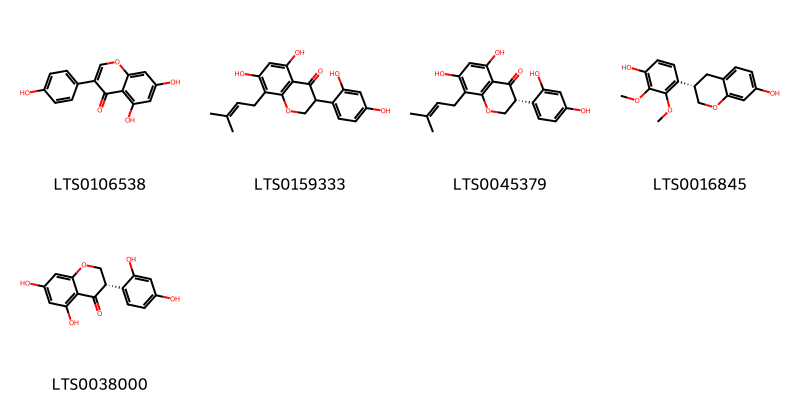
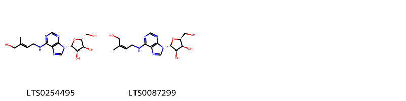

!!! abstract "Tóm tắt"

    Đậu ván trắng (Hạt) (Semen Lablabi purpurei) là hạt của cây đậu ván trắng (Lablab purpureus (L.) Sweet), thuộc họ Đậu (Fabaceae). Đậu ván trắng phân bố chủ yếu ở các khu vực nhiệt đới và cận nhiệt đới của châu Phi như Angola, Ghana, Nigeria, và được trồng rộng rãi tại Việt Nam, Ấn Độ, Thái Lan, Brazil, và nhiều nơi khác. Theo y học cổ truyền, đậu ván trắng có vị ngọt, tính bình, quy vào kinh tỳ và vị, thường được dùng để kiện tỳ hòa trung, giải thử hóa thấp, giải độc rượu, và hỗ trợ điều trị các bệnh về tiêu hóa như nôn mửa, tỳ vị hư nhược, và đại tiện lỏng. Tác dụng dược lý của đậu ván trắng bao gồm kháng viêm, giải độc, hỗ trợ tiêu hóa, chống ngộ độc thực phẩm, và viêm dạ dày ruột cấp tính. Thành phần hóa học chính gồm flavonoid, alkaloid, và saponin.

## Thông tin về thực vật

Dược liệu **Đậu Ván Trắng (Hạt)** từ bộ phận **None** từ loài *Lablab purpureus*.

**Mô tả thực vật:** Đậu ván trắng là một loại dây leo, sống 1-3 năm, có thể leo dài tới 5m hay hơn. Thân leo màu xanh có góc, hơi có rãnh, trên mép của hạt, kéo dài chiếm 1/3-1/2 chu vi có lòng thưa dài, mềm. Lá mọc cách, kép, mỗi lá có 3 lá chét hình trứng, phía dưới hơi bè ra hình quả trầm, lá chét dài 5-10cm, rộng 4-8cm, cuống lá chét giữa dài 2-3,5cm, cuống lá chét 2 bên dài chừng 5mm. Cuống chung dài 4-13cm, phần cuối hơi phình ra. Hoa mọc thành chùm, ở ngọn cành và kẽ lá, cuống cụm hoa dài 6-15cm, mang hoa ở 1/3-1/2 trên. Mỗi mẫu có 2-3 hoa hình bướm màu tím nhạt, cuống của từng hoa dài 2-3cm. Đài hoa hình ống, có 5 răng đều nhau hình tam giác. Tràng 5 cánh, tiền khai hoa cờ 10 nhị xếp thành 2 vòng, 1 nhị đơn độc, 9 nhị khác dính vào nhau thành màng bao quanh nhụy 1 lá noãn. Quả giáp màu xanh nhạt, khi chín có màu vàng nhạt, dài 5-9cm, rộng 1,5- 2,5cm, hơi cong về một phía giống hình lưỡi liềm, trên đầu có mỏ nhọn cong lên phía lưng quả, hai mép sần sùi, trong quả chứa 2-4 hạt hình trứng hay hình thận, không cân đối, màu trắng ngà, dài 8- 12mm, rộng 6-8mm, dày 2-4mm, rốn hạt hình trái xoan, dài 3mm, màu trắng, ngay sát rốn là lỗ noãn màu nâu thẫm. Từ rốn có một mồng màu trắng, nổi hẳn lên một phía hạt đậu thành hình lưỡi liềm, rộng 3-4mm, trên mỏng trắng có 2 đường rãnh chia mồng thành 3 phần. Mùa hoa: Cuối hạ đầu thu

*Tài liệu tham khảo:* "Những cây thuốc và vị thuốc Việt Nam" - Đỗ Tất Lợi 
Trong dược điển Việt nam, một loài được sử dụng làm dược liệu là *Lablab purpureus*.

!!! info "Phân loại thực vật của *Lablab purpureus*"
    - **Kingdom:** Plantae
    - **Phylum:** Tracheophyta
    - **Order:** Fabales
    - **Family:** Fabaceae
    - **Genus:** Lablab
    - **Species:** *Lablab purpureus*

**Phân bố trên thế giới:** Haiti, Korea, Republic of, Cuba, Singapore, Cabo Verde, Guadeloupe, Spain, Mexico, Chinese Taipei, Hong Kong, Réunion, South Africa, British Indian Ocean Territory, Eswatini, Indonesia, Myanmar, Virgin Islands (U.S.), Mozambique, Romania, Saint Kitts and Nevis, India, Palau, Brazil, Northern Mariana Islands, Thailand, Serbia, United States of America, China, Dominican Republic, Fiji, Malaysia, New Zealand, Canada, Ecuador, Maldives, Puerto Rico

**Phân bố tại Việt nam:** Không có ghi nhận ở Việt Nam

## Thông tin về dược liệu 

### Định danh

!!! info "Thông tin về tên gọi"

    - Dược liệu tiếng Việt: đậu ván trắng
    - Dược liệu tiếng Trung: 白扁豆 (Bai Bian Dou)
    - Dược liệu tiếng Anh: White Hyacinth Bean
    - Dược liệu latin thông dụng: Semen Lablab
    - Dược liệu latin kiểu DĐVN: *semen lablab*
    - Dược liệu latin kiểu DĐVN: *None*
    - Dược liệu latin kiểu thông tư: *None*
    - Bộ phận dùng: None (Semen)

### Mô tả dược liệu 

- **Theo dược điển Việt nam V:** 
Hạt hình bầu dục hoặc hình trứng, dẹt, dài 8 mm đến 13 mm, rộng 6 mm đến 9 mm, dày 4 mm. Vỏ ngoài màu trắng ngà, hoặc màu vàng, đôi khi có chấm đen, hơi nhẵn bóng, ớ mép có một vòng màu trắng là mồng chiếm 1/3 đến 1/2 chiều dài hạt. Chất cứng chắc, vỏ mỏng giòn, có 2 lá mầm to màu trắng ngà. Mùi nhẹ, vị nhạt, khi nhai có mùi tanh của đậu.

- **Mô tả dược liệu theo thông tư chế biến dược liệu theo phương pháp cổ truyền:** 

### Chế biến 

- **Chế biến theo dược điển việt nam V**: 
Chế biến Thu hoạch vào mùa thu, đông, hái các quả chín phơi khô lấy hạt, phơi hoặc sấy khô. Bào chế Bạch biển đậu sống: Loại bỏ tạp chất xay vỡ hoặc giã dập khi dùng. Bạch biển đậu sao: Lấy Bạch biển đậu sạch cho vào chảo sao nhỏ lửa (lừa văn) cho đến khi bề mặt có màu vàng nhạt, thỉnh thoảng có đốm đen, xay vỡ hoặc giã dập khi dùng. nn

- **Chế biến theo thông tư:** 

--- 

## Thành phần hóa học

- Theo tài liệu của GS. Đỗ Tất Lợi:  Hạt đậu ván trắng chứa các thành phần có tác dụng kháng viêm, giải độc và hỗ trợ tiêu hóa, trong đó có thể bao gồm các hợp chất flavonoid, alkaloid và saponin.
    

**Thành phần hóa học từ loài **Lablab purpureus**

Theo cơ sở dữ liệu lotus, loài *Lablab purpureus* đã phân lập và xác định được **55** hoạt chất thuộc về các nhóm Steroids and steroid derivatives, Organonitrogen compounds, Organooxygen compounds, Flavonoids, Imidazopyrimidines, Isoflavonoids, Purine nucleosides, 2-arylbenzofuran flavonoids, Prenol lipids trong bảng dưới đây. Danh sách các hoạt chất như sau 24-epibrassinolide [(LTS0092449)](https://lotus.naturalproducts.net/compound/lotus_id/LTS0092449), (3s)-3-(2,4-dihydroxyphenyl)-5,7-dihydroxy-2,3-dihydro-1-benzopyran-4-one [(LTS0038000)](https://lotus.naturalproducts.net/compound/lotus_id/LTS0038000), brassinolide [(LTS0256786)](https://lotus.naturalproducts.net/compound/lotus_id/LTS0256786), kievitone [(LTS0159333)](https://lotus.naturalproducts.net/compound/lotus_id/LTS0159333), (1s,2r,4r,5s,7s,11s,12r,15s,16s)-15-[(2s,3r,4r)-3,4-dihydroxy-6-methyl-5-methylideneheptan-2-yl]-4,5-dihydroxy-2,16-dimethyl-9-oxatetracyclo[9.7.0.0²,⁷.0¹²,¹⁶]octadecan-8-one [(LTS0263225)](https://lotus.naturalproducts.net/compound/lotus_id/LTS0263225), (1r,3as,3bs,5as,7s,8r,9ar,9bs,11ar)-1-[(2s,3r,4r,5s)-3,4-dihydroxy-5,6-dimethylheptan-2-yl]-7,8-dihydroxy-9a,11a-dimethyl-tetradecahydrocyclopenta[a]phenanthren-5-one [(LTS0131918)](https://lotus.naturalproducts.net/compound/lotus_id/LTS0131918), spermidine [(LTS0061428)](https://lotus.naturalproducts.net/compound/lotus_id/LTS0061428), (3s)-3-(4-hydroxy-2,3-dimethoxyphenyl)-3,4-dihydro-2h-1-benzopyran-7-ol [(LTS0016845)](https://lotus.naturalproducts.net/compound/lotus_id/LTS0016845), putrescine [(LTS0238763)](https://lotus.naturalproducts.net/compound/lotus_id/LTS0238763), (2s,3r,4r)-2-[(1r,3as,3br,5as,7s,8r,9as,9bs,11as)-7,8-dihydroxy-9a,11a-dimethyl-tetradecahydro-1h-cyclopenta[a]phenanthren-1-yl]-6-methyl-5-methylideneheptane-3,4-diol [(LTS0179688)](https://lotus.naturalproducts.net/compound/lotus_id/LTS0179688), 15-(3,4-dihydroxy-5-isopropylhept-5-en-2-yl)-4,5-dihydroxy-2,16-dimethyl-9-oxatetracyclo[9.7.0.0²,⁷.0¹²,¹⁶]octadecan-8-one [(LTS0091297)](https://lotus.naturalproducts.net/compound/lotus_id/LTS0091297), [(1r,2r,3s,4r,5s,6s)-2,3,4,5,6-pentakis(phosphonooxy)cyclohexyl]oxyphosphonic acid [(LTS0234844)](https://lotus.naturalproducts.net/compound/lotus_id/LTS0234844), 1-(3,4-dihydroxy-5-isopropylhept-5-en-2-yl)-7,8-dihydroxy-9a,11a-dimethyl-tetradecahydrocyclopenta[a]phenanthren-5-one [(LTS0024842)](https://lotus.naturalproducts.net/compound/lotus_id/LTS0024842), (2r,3r,4s,5s)-2-(6-{[(2z)-4-hydroxy-3-methylbut-2-en-1-yl]amino}purin-9-yl)-5-(hydroxymethyl)oxolane-3,4-diol [(LTS0087299)](https://lotus.naturalproducts.net/compound/lotus_id/LTS0087299), (1s,2r,4r,5s,7s,11r,12r,15r,16s)-15-[(2s,3r,4r,5e)-3,4-dihydroxy-5-isopropylhept-5-en-2-yl]-4,5-dihydroxy-2,16-dimethyl-9-oxatetracyclo[9.7.0.0²,⁷.0¹²,¹⁶]octadecan-8-one [(LTS0199076)](https://lotus.naturalproducts.net/compound/lotus_id/LTS0199076), 5-hydroxy-2-(4-hydroxyphenyl)-3-{[(2s,3r,4s,5s,6r)-3,4,5-trihydroxy-6-(hydroxymethyl)oxan-2-yl]oxy}chromen-7-one [(LTS0103335)](https://lotus.naturalproducts.net/compound/lotus_id/LTS0103335), (1r,3as,3bs,5as,7s,8r,9ar,9bs,11as)-1-[(2s,3r,4r)-3,4-dihydroxy-6-methyl-5-methylideneheptan-2-yl]-7,8-dihydroxy-9a,11a-dimethyl-tetradecahydrocyclopenta[a]phenanthren-5-one [(LTS0227100)](https://lotus.naturalproducts.net/compound/lotus_id/LTS0227100), (1r,7s,8r)-1-[(2s,3r,4r)-3,4-dihydroxy-6-methyl-5-methylideneheptan-2-yl]-7,8-dihydroxy-9a,11a-dimethyl-tetradecahydrocyclopenta[a]phenanthren-5-one [(LTS0135678)](https://lotus.naturalproducts.net/compound/lotus_id/LTS0135678), (2s,3r,4r,5s)-2-[(1r,3as,3br,5as,7s,8r,9as,9bs,11ar)-7,8-dihydroxy-9a,11a-dimethyl-tetradecahydro-1h-cyclopenta[a]phenanthren-1-yl]-5,6-dimethylheptane-3,4-diol [(LTS0232349)](https://lotus.naturalproducts.net/compound/lotus_id/LTS0232349), (1r,3as,3bs,5as,7s,8r,9ar,9bs,11as)-1-[(2s,3r,4r,5e)-3,4-dihydroxy-5-isopropylhept-5-en-2-yl]-7,8-dihydroxy-9a,11a-dimethyl-tetradecahydrocyclopenta[a]phenanthren-5-one [(LTS0198166)](https://lotus.naturalproducts.net/compound/lotus_id/LTS0198166), (1s,2r,4r,5s,7s,11s,12s,15r,16s)-15-[(2s,3r,4r)-3,4-dihydroxy-6-methyl-5-methylideneheptan-2-yl]-4,5-dihydroxy-2,16-dimethyl-9-oxatetracyclo[9.7.0.0²,⁷.0¹²,¹⁶]octadecan-8-one [(LTS0186762)](https://lotus.naturalproducts.net/compound/lotus_id/LTS0186762), 6-deoxocastasterone [(LTS0057195)](https://lotus.naturalproducts.net/compound/lotus_id/LTS0057195), (2s,3r,4r)-2-[(1r,3as,3bs,5as,7s,8r,9as,9bs,11ar)-7,8-dihydroxy-9a,11a-dimethyl-tetradecahydro-1h-cyclopenta[a]phenanthren-1-yl]-6-methyl-5-methylideneheptane-3,4-diol [(LTS0081011)](https://lotus.naturalproducts.net/compound/lotus_id/LTS0081011), 5-hydroxy-3-{[(2s,3r,4s,5s,6r)-3,4,5-trihydroxy-6-(hydroxymethyl)oxan-2-yl]oxy}-2-(3,4,5-trihydroxyphenyl)chromen-7-one [(LTS0073780)](https://lotus.naturalproducts.net/compound/lotus_id/LTS0073780), (4r,5s,15r)-15-[(2s,3r,4r)-3,4-dihydroxy-6-methyl-5-methylideneheptan-2-yl]-4,5-dihydroxy-2,16-dimethyl-9-oxatetracyclo[9.7.0.0²,⁷.0¹²,¹⁶]octadecan-8-one [(LTS0093144)](https://lotus.naturalproducts.net/compound/lotus_id/LTS0093144), 1-(3,4-dihydroxy-6-methyl-5-methylideneheptan-2-yl)-7,8-dihydroxy-9a,11a-dimethyl-tetradecahydrocyclopenta[a]phenanthren-5-one [(LTS0266442)](https://lotus.naturalproducts.net/compound/lotus_id/LTS0266442), (2s,3s,4s,5r,6r)-6-{[(3s,4s,4ar,6ar,6bs,8as,12as,14ar,14br)-4-(hydroxymethyl)-4,6a,6b,11,11,14b-hexamethyl-8a-({[(2s,3r,4s,5s,6r)-3,4,5-trihydroxy-6-(hydroxymethyl)oxan-2-yl]oxy}carbonyl)-1,2,3,4a,5,6,7,8,9,10,12,12a,14,14a-tetradecahydropicen-3-yl]oxy}-5-{[(2s,3r,4s,5r,6r)-4,5-dihydroxy-6-(hydroxymethyl)-3-{[(2s,3r,4r,5r,6s)-3,4,5-trihydroxy-6-methyloxan-2-yl]oxy}oxan-2-yl]oxy}-3,4-dihydroxyoxane-2-carboxylic acid [(LTS0232794)](https://lotus.naturalproducts.net/compound/lotus_id/LTS0232794), (2s,3s,4s,5r,6r)-6-{[(3s,4s,4ar,6ar,6bs,8as,12as,14ar,14br)-8a-({[(2s,3r,4s,5s,6r)-4,5-dihydroxy-6-(hydroxymethyl)-3-{[(2s,3r,4r,5r,6s)-3,4,5-trihydroxy-6-methyloxan-2-yl]oxy}oxan-2-yl]oxy}carbonyl)-4-(hydroxymethyl)-4,6a,6b,11,11,14b-hexamethyl-1,2,3,4a,5,6,7,8,9,10,12,12a,14,14a-tetradecahydropicen-3-yl]oxy}-5-{[(2s,3r,4s,5r,6r)-4,5-dihydroxy-6-(hydroxymethyl)-3-{[(2s,3r,4r,5r,6s)-3,4,5-trihydroxy-6-methyloxan-2-yl]oxy}oxan-2-yl]oxy}-3,4-dihydroxyoxane-2-carboxylic acid [(LTS0047197)](https://lotus.naturalproducts.net/compound/lotus_id/LTS0047197), (1s,4r,5s,7s,11s,12s,15r,16s)-15-[(2s,3r,4r,5e)-3,4-dihydroxy-5-isopropylhept-5-en-2-yl]-4,5-dihydroxy-2,16-dimethyl-9-oxatetracyclo[9.7.0.0²,⁷.0¹²,¹⁶]octadecan-8-one [(LTS0102766)](https://lotus.naturalproducts.net/compound/lotus_id/LTS0102766), genistein [(LTS0106538)](https://lotus.naturalproducts.net/compound/lotus_id/LTS0106538), zeatine [(LTS0032706)](https://lotus.naturalproducts.net/compound/lotus_id/LTS0032706), (1s,2r,4r,5s,7s,11s,12s,15r,16s)-15-[(2s,3r,4r,5e)-3,4-dihydroxy-5-isopropylhept-5-en-2-yl]-4,5-dihydroxy-2,16-dimethyl-9-oxatetracyclo[9.7.0.0²,⁷.0¹²,¹⁶]octadecan-8-one [(LTS0033127)](https://lotus.naturalproducts.net/compound/lotus_id/LTS0033127), (1s,2r,4r,5s,7s,11r,12r,15s,16s)-15-[(2s,3r,4r,5s)-3,4-dihydroxy-5,6-dimethylheptan-2-yl]-4,5-dihydroxy-2,16-dimethyl-9-oxatetracyclo[9.7.0.0²,⁷.0¹²,¹⁶]octadecan-8-one [(LTS0072711)](https://lotus.naturalproducts.net/compound/lotus_id/LTS0072711), 15-(2-hydroxy-3-methylbut-3-en-1-yl)-8,17-dioxatetracyclo[8.7.0.0²,⁷.0¹¹,¹⁶]heptadeca-2,4,6,11(16),12,14-hexaene-5,14-diol [(LTS0054362)](https://lotus.naturalproducts.net/compound/lotus_id/LTS0054362), 6-{[8a-({[3-({3,4-dihydroxy-6-methyl-5-[(3,4,5-trihydroxy-6-methyloxan-2-yl)oxy]oxan-2-yl}oxy)-4,5-dihydroxy-6-(hydroxymethyl)oxan-2-yl]oxy}carbonyl)-4-(hydroxymethyl)-4,6a,6b,11,11,14b-hexamethyl-1,2,3,4a,5,6,7,8,9,10,12,12a,14,14a-tetradecahydropicen-3-yl]oxy}-5-{[4,5-dihydroxy-6-(hydroxymethyl)-3-[(3,4,5-trihydroxy-6-methyloxan-2-yl)oxy]oxan-2-yl]oxy}-3,4-dihydroxyoxane-2-carboxylic acid [(LTS0084234)](https://lotus.naturalproducts.net/compound/lotus_id/LTS0084234), 5-{[4,5-dihydroxy-6-(hydroxymethyl)-3-[(3,4,5-trihydroxy-6-methyloxan-2-yl)oxy]oxan-2-yl]oxy}-3,4-dihydroxy-6-({9-[(5-hydroxy-6-methyl-4-oxo-2,3-dihydropyran-2-yl)oxy]-4-(hydroxymethyl)-4,6a,6b,8a,11,11,14b-heptamethyl-1,2,3,4a,5,6,7,8,9,10,12,12a,14,14a-tetradecahydropicen-3-yl}oxy)oxane-2-carboxylic acid [(LTS0115567)](https://lotus.naturalproducts.net/compound/lotus_id/LTS0115567), (2s,3s,4s,5r,6r)-6-{[(3s,4s,4ar,6ar,6bs,8ar,9r,12as,14ar,14br)-9-{[(2r)-5-hydroxy-6-methyl-4-oxo-2,3-dihydropyran-2-yl]oxy}-4-(hydroxymethyl)-4,6a,6b,8a,11,11,14b-heptamethyl-1,2,3,4a,5,6,7,8,9,10,12,12a,14,14a-tetradecahydropicen-3-yl]oxy}-5-{[(2s,3r,4s,5r,6r)-4,5-dihydroxy-6-(hydroxymethyl)-3-{[(2s,3r,4r,5r,6r)-3,4,5-trihydroxy-6-methyloxan-2-yl]oxy}oxan-2-yl]oxy}-3,4-dihydroxyoxane-2-carboxylic acid [(LTS0040562)](https://lotus.naturalproducts.net/compound/lotus_id/LTS0040562), 6-[(8a-{[(6-{[(4-carboxy-3-hydroxy-3-methylbutanoyl)oxy]methyl}-3,4,5-trihydroxyoxan-2-yl)oxy]carbonyl}-4-(hydroxymethyl)-4,6a,6b,11,11,14b-hexamethyl-1,2,3,4a,5,6,7,8,9,10,12,12a,14,14a-tetradecahydropicen-3-yl)oxy]-5-{[4,5-dihydroxy-6-(hydroxymethyl)-3-[(3,4,5-trihydroxy-6-methyloxan-2-yl)oxy]oxan-2-yl]oxy}-3,4-dihydroxyoxane-2-carboxylic acid [(LTS0219661)](https://lotus.naturalproducts.net/compound/lotus_id/LTS0219661), spermine [(LTS0179313)](https://lotus.naturalproducts.net/compound/lotus_id/LTS0179313), 5-{[4,5-dihydroxy-6-(hydroxymethyl)-3-[(3,4,5-trihydroxy-6-methyloxan-2-yl)oxy]oxan-2-yl]oxy}-3,4-dihydroxy-6-{[4-(hydroxymethyl)-4,6a,6b,11,11,14b-hexamethyl-8a-({[3,4,5-trihydroxy-6-(hydroxymethyl)oxan-2-yl]oxy}carbonyl)-1,2,3,4a,5,6,7,8,9,10,12,12a,14,14a-tetradecahydropicen-3-yl]oxy}oxane-2-carboxylic acid [(LTS0209131)](https://lotus.naturalproducts.net/compound/lotus_id/LTS0209131), (2s,3r,4r,5s)-2-[(1r,3br,5as,7s,8r,9as,9bs,11as)-7,8-dihydroxy-9a,11a-dimethyl-tetradecahydro-1h-cyclopenta[a]phenanthren-1-yl]-5,6-dimethylheptane-3,4-diol [(LTS0026877)](https://lotus.naturalproducts.net/compound/lotus_id/LTS0026877), (2s,3s,4s,5r,6r)-6-{[(3s,4ar,6ar,6bs,8as,12as,14ar,14br)-4,4,6a,6b,11,11,14b-heptamethyl-8a-({[(2s,3r,4s,5s,6r)-3,4,5-trihydroxy-6-(hydroxymethyl)oxan-2-yl]oxy}carbonyl)-1,2,3,4a,5,6,7,8,9,10,12,12a,14,14a-tetradecahydropicen-3-yl]oxy}-5-{[(2s,3r,4s,5r,6r)-4,5-dihydroxy-6-(hydroxymethyl)-3-{[(2s,3r,4r,5r,6s)-3,4,5-trihydroxy-6-methyloxan-2-yl]oxy}oxan-2-yl]oxy}-3,4-dihydroxyoxane-2-carboxylic acid [(LTS0082503)](https://lotus.naturalproducts.net/compound/lotus_id/LTS0082503), castasterone [(LTS0111493)](https://lotus.naturalproducts.net/compound/lotus_id/LTS0111493), thermospermine [(LTS0136028)](https://lotus.naturalproducts.net/compound/lotus_id/LTS0136028), (3r)-3-(2,4-dihydroxyphenyl)-5,7-dihydroxy-8-(3-methylbut-2-en-1-yl)-2,3-dihydro-1-benzopyran-4-one [(LTS0045379)](https://lotus.naturalproducts.net/compound/lotus_id/LTS0045379), 6-{[4,4,6a,6b,11,11,14b-heptamethyl-8a-({[3,4,5-trihydroxy-6-(hydroxymethyl)oxan-2-yl]oxy}carbonyl)-1,2,3,4a,5,6,7,8,9,10,12,12a,14,14a-tetradecahydropicen-3-yl]oxy}-3,4,5-trihydroxyoxane-2-carboxylic acid [(LTS0051408)](https://lotus.naturalproducts.net/compound/lotus_id/LTS0051408), phytic acid [(LTS0210346)](https://lotus.naturalproducts.net/compound/lotus_id/LTS0210346), 1-(3,4-dihydroxy-5,6-dimethylheptan-2-yl)-7,8-dihydroxy-9a,11a-dimethyl-tetradecahydrocyclopenta[a]phenanthren-5-one [(LTS0020071)](https://lotus.naturalproducts.net/compound/lotus_id/LTS0020071), zeatin riboside [(LTS0254495)](https://lotus.naturalproducts.net/compound/lotus_id/LTS0254495), 6-{[8a-({[3-({3,4-dihydroxy-6-methyl-5-[(3,4,5-trihydroxy-6-methyloxan-2-yl)oxy]oxan-2-yl}oxy)-4,5-dihydroxy-6-(hydroxymethyl)oxan-2-yl]oxy}carbonyl)-4,4,6a,6b,11,11,14b-heptamethyl-1,2,3,4a,5,6,7,8,9,10,12,12a,14,14a-tetradecahydropicen-3-yl]oxy}-5-{[4,5-dihydroxy-6-(hydroxymethyl)-3-[(3,4,5-trihydroxy-6-methyloxan-2-yl)oxy]oxan-2-yl]oxy}-3,4-dihydroxyoxane-2-carboxylic acid [(LTS0223141)](https://lotus.naturalproducts.net/compound/lotus_id/LTS0223141), calenduloside f [(LTS0040608)](https://lotus.naturalproducts.net/compound/lotus_id/LTS0040608), 15-(3,4-dihydroxy-6-methyl-5-methylideneheptan-2-yl)-4,5-dihydroxy-2,16-dimethyl-9-oxatetracyclo[9.7.0.0²,⁷.0¹²,¹⁶]octadecan-8-one [(LTS0178674)](https://lotus.naturalproducts.net/compound/lotus_id/LTS0178674), 6-({8a-formyl-9-[(5-hydroxy-6-methyl-4-oxo-2,3-dihydropyran-2-yl)oxy]-4-(hydroxymethyl)-4,6a,6b,11,11,14b-hexamethyl-1,2,3,4a,5,6,7,8,9,10,12,12a,14,14a-tetradecahydropicen-3-yl}oxy)-5-{[4,5-dihydroxy-6-(hydroxymethyl)-3-[(3,4,5-trihydroxy-6-methyloxan-2-yl)oxy]oxan-2-yl]oxy}-3,4-dihydroxyoxane-2-carboxylic acid [(LTS0220400)](https://lotus.naturalproducts.net/compound/lotus_id/LTS0220400), (2s,3s,4s,5r,6r)-6-{[(3s,4s,4ar,6ar,6bs,8as,9r,12as,14ar,14br)-8a-formyl-9-{[(2s)-5-hydroxy-6-methyl-4-oxo-2,3-dihydropyran-2-yl]oxy}-4-(hydroxymethyl)-4,6a,6b,11,11,14b-hexamethyl-1,2,3,4a,5,6,7,8,9,10,12,12a,14,14a-tetradecahydropicen-3-yl]oxy}-5-{[(2s,3r,4s,5r,6r)-4,5-dihydroxy-6-(hydroxymethyl)-3-{[(2s,3r,4r,5r,6r)-3,4,5-trihydroxy-6-methyloxan-2-yl]oxy}oxan-2-yl]oxy}-3,4-dihydroxyoxane-2-carboxylic acid [(LTS0000949)](https://lotus.naturalproducts.net/compound/lotus_id/LTS0000949), vignafuran [(LTS0149167)](https://lotus.naturalproducts.net/compound/lotus_id/LTS0149167). 
        
| chemicalTaxonomyClassyfireClass   |   smiles_count |
|:----------------------------------|---------------:|
| 2-arylbenzofuran flavonoids       |             31 |
| Flavonoids                        |            162 |
| Imidazopyrimidines                |             29 |
| Isoflavonoids                     |            206 |
| Organonitrogen compounds          |             44 |
| Organooxygen compounds            |            178 |
| Prenol lipids                     |            425 |
| Purine nucleosides                |            117 |
| Steroids and steroid derivatives  |           1147 |

            
### Nhóm 2-arylbenzofuran flavonoids
<figure markdown="span">
    { width=100% }
<figcaption>Hình ảnh cấu trúc hóa học của hoạt chất thuộc nhóm *2-arylbenzofuran flavonoids*. Tên thường gọi của các hoạt chất tương ứng là vignafuran [(LTS0149167)](https://lotus.naturalproducts.net/compound/lotus_id/LTS0149167).</figcaption>
</figure>

            
            
### Nhóm 2-arylbenzofuran flavonoids
<figure markdown="span">
    { width=100% }
<figcaption>Hình ảnh cấu trúc hóa học của hoạt chất thuộc nhóm *2-arylbenzofuran flavonoids*. Tên thường gọi của các hoạt chất tương ứng là vignafuran [(LTS0149167)](https://lotus.naturalproducts.net/compound/lotus_id/LTS0149167).</figcaption>
</figure>

### Nhóm Flavonoids
<figure markdown="span">
    { width=100% }
<figcaption>Hình ảnh cấu trúc hóa học của hoạt chất thuộc nhóm *Flavonoids*. Tên thường gọi của các hoạt chất tương ứng là 5-hydroxy-2-(4-hydroxyphenyl)-3-{[(2s,3r,4s,5s,6r)-3,4,5-trihydroxy-6-(hydroxymethyl)oxan-2-yl]oxy}chromen-7-one [(LTS0103335)](https://lotus.naturalproducts.net/compound/lotus_id/LTS0103335), 5-hydroxy-3-{[(2s,3r,4s,5s,6r)-3,4,5-trihydroxy-6-(hydroxymethyl)oxan-2-yl]oxy}-2-(3,4,5-trihydroxyphenyl)chromen-7-one [(LTS0073780)](https://lotus.naturalproducts.net/compound/lotus_id/LTS0073780).</figcaption>
</figure>

            
            
### Nhóm 2-arylbenzofuran flavonoids
<figure markdown="span">
    { width=100% }
<figcaption>Hình ảnh cấu trúc hóa học của hoạt chất thuộc nhóm *2-arylbenzofuran flavonoids*. Tên thường gọi của các hoạt chất tương ứng là vignafuran [(LTS0149167)](https://lotus.naturalproducts.net/compound/lotus_id/LTS0149167).</figcaption>
</figure>

### Nhóm Flavonoids
<figure markdown="span">
    { width=100% }
<figcaption>Hình ảnh cấu trúc hóa học của hoạt chất thuộc nhóm *Flavonoids*. Tên thường gọi của các hoạt chất tương ứng là 5-hydroxy-2-(4-hydroxyphenyl)-3-{[(2s,3r,4s,5s,6r)-3,4,5-trihydroxy-6-(hydroxymethyl)oxan-2-yl]oxy}chromen-7-one [(LTS0103335)](https://lotus.naturalproducts.net/compound/lotus_id/LTS0103335), 5-hydroxy-3-{[(2s,3r,4s,5s,6r)-3,4,5-trihydroxy-6-(hydroxymethyl)oxan-2-yl]oxy}-2-(3,4,5-trihydroxyphenyl)chromen-7-one [(LTS0073780)](https://lotus.naturalproducts.net/compound/lotus_id/LTS0073780).</figcaption>
</figure>

### Nhóm Imidazopyrimidines
<figure markdown="span">
    { width=100% }
<figcaption>Hình ảnh cấu trúc hóa học của hoạt chất thuộc nhóm *Imidazopyrimidines*. Tên thường gọi của các hoạt chất tương ứng là zeatine [(LTS0032706)](https://lotus.naturalproducts.net/compound/lotus_id/LTS0032706).</figcaption>
</figure>

            
            
### Nhóm 2-arylbenzofuran flavonoids
<figure markdown="span">
    { width=100% }
<figcaption>Hình ảnh cấu trúc hóa học của hoạt chất thuộc nhóm *2-arylbenzofuran flavonoids*. Tên thường gọi của các hoạt chất tương ứng là vignafuran [(LTS0149167)](https://lotus.naturalproducts.net/compound/lotus_id/LTS0149167).</figcaption>
</figure>

### Nhóm Flavonoids
<figure markdown="span">
    { width=100% }
<figcaption>Hình ảnh cấu trúc hóa học của hoạt chất thuộc nhóm *Flavonoids*. Tên thường gọi của các hoạt chất tương ứng là 5-hydroxy-2-(4-hydroxyphenyl)-3-{[(2s,3r,4s,5s,6r)-3,4,5-trihydroxy-6-(hydroxymethyl)oxan-2-yl]oxy}chromen-7-one [(LTS0103335)](https://lotus.naturalproducts.net/compound/lotus_id/LTS0103335), 5-hydroxy-3-{[(2s,3r,4s,5s,6r)-3,4,5-trihydroxy-6-(hydroxymethyl)oxan-2-yl]oxy}-2-(3,4,5-trihydroxyphenyl)chromen-7-one [(LTS0073780)](https://lotus.naturalproducts.net/compound/lotus_id/LTS0073780).</figcaption>
</figure>

### Nhóm Imidazopyrimidines
<figure markdown="span">
    { width=100% }
<figcaption>Hình ảnh cấu trúc hóa học của hoạt chất thuộc nhóm *Imidazopyrimidines*. Tên thường gọi của các hoạt chất tương ứng là zeatine [(LTS0032706)](https://lotus.naturalproducts.net/compound/lotus_id/LTS0032706).</figcaption>
</figure>

### Nhóm Isoflavonoids
<figure markdown="span">
    { width=100% }
<figcaption>Hình ảnh cấu trúc hóa học của hoạt chất thuộc nhóm *Isoflavonoids*. Tên thường gọi của các hoạt chất tương ứng là genistein [(LTS0106538)](https://lotus.naturalproducts.net/compound/lotus_id/LTS0106538), kievitone [(LTS0159333)](https://lotus.naturalproducts.net/compound/lotus_id/LTS0159333), (3r)-3-(2,4-dihydroxyphenyl)-5,7-dihydroxy-8-(3-methylbut-2-en-1-yl)-2,3-dihydro-1-benzopyran-4-one [(LTS0045379)](https://lotus.naturalproducts.net/compound/lotus_id/LTS0045379), (3s)-3-(4-hydroxy-2,3-dimethoxyphenyl)-3,4-dihydro-2h-1-benzopyran-7-ol [(LTS0016845)](https://lotus.naturalproducts.net/compound/lotus_id/LTS0016845), (3s)-3-(2,4-dihydroxyphenyl)-5,7-dihydroxy-2,3-dihydro-1-benzopyran-4-one [(LTS0038000)](https://lotus.naturalproducts.net/compound/lotus_id/LTS0038000).</figcaption>
</figure>

            
            
### Nhóm 2-arylbenzofuran flavonoids
<figure markdown="span">
    { width=100% }
<figcaption>Hình ảnh cấu trúc hóa học của hoạt chất thuộc nhóm *2-arylbenzofuran flavonoids*. Tên thường gọi của các hoạt chất tương ứng là vignafuran [(LTS0149167)](https://lotus.naturalproducts.net/compound/lotus_id/LTS0149167).</figcaption>
</figure>

### Nhóm Flavonoids
<figure markdown="span">
    { width=100% }
<figcaption>Hình ảnh cấu trúc hóa học của hoạt chất thuộc nhóm *Flavonoids*. Tên thường gọi của các hoạt chất tương ứng là 5-hydroxy-2-(4-hydroxyphenyl)-3-{[(2s,3r,4s,5s,6r)-3,4,5-trihydroxy-6-(hydroxymethyl)oxan-2-yl]oxy}chromen-7-one [(LTS0103335)](https://lotus.naturalproducts.net/compound/lotus_id/LTS0103335), 5-hydroxy-3-{[(2s,3r,4s,5s,6r)-3,4,5-trihydroxy-6-(hydroxymethyl)oxan-2-yl]oxy}-2-(3,4,5-trihydroxyphenyl)chromen-7-one [(LTS0073780)](https://lotus.naturalproducts.net/compound/lotus_id/LTS0073780).</figcaption>
</figure>

### Nhóm Imidazopyrimidines
<figure markdown="span">
    { width=100% }
<figcaption>Hình ảnh cấu trúc hóa học của hoạt chất thuộc nhóm *Imidazopyrimidines*. Tên thường gọi của các hoạt chất tương ứng là zeatine [(LTS0032706)](https://lotus.naturalproducts.net/compound/lotus_id/LTS0032706).</figcaption>
</figure>

### Nhóm Isoflavonoids
<figure markdown="span">
    { width=100% }
<figcaption>Hình ảnh cấu trúc hóa học của hoạt chất thuộc nhóm *Isoflavonoids*. Tên thường gọi của các hoạt chất tương ứng là genistein [(LTS0106538)](https://lotus.naturalproducts.net/compound/lotus_id/LTS0106538), kievitone [(LTS0159333)](https://lotus.naturalproducts.net/compound/lotus_id/LTS0159333), (3r)-3-(2,4-dihydroxyphenyl)-5,7-dihydroxy-8-(3-methylbut-2-en-1-yl)-2,3-dihydro-1-benzopyran-4-one [(LTS0045379)](https://lotus.naturalproducts.net/compound/lotus_id/LTS0045379), (3s)-3-(4-hydroxy-2,3-dimethoxyphenyl)-3,4-dihydro-2h-1-benzopyran-7-ol [(LTS0016845)](https://lotus.naturalproducts.net/compound/lotus_id/LTS0016845), (3s)-3-(2,4-dihydroxyphenyl)-5,7-dihydroxy-2,3-dihydro-1-benzopyran-4-one [(LTS0038000)](https://lotus.naturalproducts.net/compound/lotus_id/LTS0038000).</figcaption>
</figure>

### Nhóm Organonitrogen compounds
<figure markdown="span">
    { width=100% }
<figcaption>Hình ảnh cấu trúc hóa học của hoạt chất thuộc nhóm *Organonitrogen compounds*. Tên thường gọi của các hoạt chất tương ứng là thermospermine [(LTS0136028)](https://lotus.naturalproducts.net/compound/lotus_id/LTS0136028), putrescine [(LTS0238763)](https://lotus.naturalproducts.net/compound/lotus_id/LTS0238763), spermine [(LTS0179313)](https://lotus.naturalproducts.net/compound/lotus_id/LTS0179313), spermidine [(LTS0061428)](https://lotus.naturalproducts.net/compound/lotus_id/LTS0061428).</figcaption>
</figure>

            
            
### Nhóm 2-arylbenzofuran flavonoids
<figure markdown="span">
    { width=100% }
<figcaption>Hình ảnh cấu trúc hóa học của hoạt chất thuộc nhóm *2-arylbenzofuran flavonoids*. Tên thường gọi của các hoạt chất tương ứng là vignafuran [(LTS0149167)](https://lotus.naturalproducts.net/compound/lotus_id/LTS0149167).</figcaption>
</figure>

### Nhóm Flavonoids
<figure markdown="span">
    { width=100% }
<figcaption>Hình ảnh cấu trúc hóa học của hoạt chất thuộc nhóm *Flavonoids*. Tên thường gọi của các hoạt chất tương ứng là 5-hydroxy-2-(4-hydroxyphenyl)-3-{[(2s,3r,4s,5s,6r)-3,4,5-trihydroxy-6-(hydroxymethyl)oxan-2-yl]oxy}chromen-7-one [(LTS0103335)](https://lotus.naturalproducts.net/compound/lotus_id/LTS0103335), 5-hydroxy-3-{[(2s,3r,4s,5s,6r)-3,4,5-trihydroxy-6-(hydroxymethyl)oxan-2-yl]oxy}-2-(3,4,5-trihydroxyphenyl)chromen-7-one [(LTS0073780)](https://lotus.naturalproducts.net/compound/lotus_id/LTS0073780).</figcaption>
</figure>

### Nhóm Imidazopyrimidines
<figure markdown="span">
    { width=100% }
<figcaption>Hình ảnh cấu trúc hóa học của hoạt chất thuộc nhóm *Imidazopyrimidines*. Tên thường gọi của các hoạt chất tương ứng là zeatine [(LTS0032706)](https://lotus.naturalproducts.net/compound/lotus_id/LTS0032706).</figcaption>
</figure>

### Nhóm Isoflavonoids
<figure markdown="span">
    { width=100% }
<figcaption>Hình ảnh cấu trúc hóa học của hoạt chất thuộc nhóm *Isoflavonoids*. Tên thường gọi của các hoạt chất tương ứng là genistein [(LTS0106538)](https://lotus.naturalproducts.net/compound/lotus_id/LTS0106538), kievitone [(LTS0159333)](https://lotus.naturalproducts.net/compound/lotus_id/LTS0159333), (3r)-3-(2,4-dihydroxyphenyl)-5,7-dihydroxy-8-(3-methylbut-2-en-1-yl)-2,3-dihydro-1-benzopyran-4-one [(LTS0045379)](https://lotus.naturalproducts.net/compound/lotus_id/LTS0045379), (3s)-3-(4-hydroxy-2,3-dimethoxyphenyl)-3,4-dihydro-2h-1-benzopyran-7-ol [(LTS0016845)](https://lotus.naturalproducts.net/compound/lotus_id/LTS0016845), (3s)-3-(2,4-dihydroxyphenyl)-5,7-dihydroxy-2,3-dihydro-1-benzopyran-4-one [(LTS0038000)](https://lotus.naturalproducts.net/compound/lotus_id/LTS0038000).</figcaption>
</figure>

### Nhóm Organonitrogen compounds
<figure markdown="span">
    { width=100% }
<figcaption>Hình ảnh cấu trúc hóa học của hoạt chất thuộc nhóm *Organonitrogen compounds*. Tên thường gọi của các hoạt chất tương ứng là thermospermine [(LTS0136028)](https://lotus.naturalproducts.net/compound/lotus_id/LTS0136028), putrescine [(LTS0238763)](https://lotus.naturalproducts.net/compound/lotus_id/LTS0238763), spermine [(LTS0179313)](https://lotus.naturalproducts.net/compound/lotus_id/LTS0179313), spermidine [(LTS0061428)](https://lotus.naturalproducts.net/compound/lotus_id/LTS0061428).</figcaption>
</figure>

### Nhóm Organooxygen compounds
<figure markdown="span">
    { width=100% }
<figcaption>Hình ảnh cấu trúc hóa học của hoạt chất thuộc nhóm *Organooxygen compounds*. Tên thường gọi của các hoạt chất tương ứng là phytic acid [(LTS0210346)](https://lotus.naturalproducts.net/compound/lotus_id/LTS0210346), [(1r,2r,3s,4r,5s,6s)-2,3,4,5,6-pentakis(phosphonooxy)cyclohexyl]oxyphosphonic acid [(LTS0234844)](https://lotus.naturalproducts.net/compound/lotus_id/LTS0234844).</figcaption>
</figure>

            
            
### Nhóm 2-arylbenzofuran flavonoids
<figure markdown="span">
    { width=100% }
<figcaption>Hình ảnh cấu trúc hóa học của hoạt chất thuộc nhóm *2-arylbenzofuran flavonoids*. Tên thường gọi của các hoạt chất tương ứng là vignafuran [(LTS0149167)](https://lotus.naturalproducts.net/compound/lotus_id/LTS0149167).</figcaption>
</figure>

### Nhóm Flavonoids
<figure markdown="span">
    { width=100% }
<figcaption>Hình ảnh cấu trúc hóa học của hoạt chất thuộc nhóm *Flavonoids*. Tên thường gọi của các hoạt chất tương ứng là 5-hydroxy-2-(4-hydroxyphenyl)-3-{[(2s,3r,4s,5s,6r)-3,4,5-trihydroxy-6-(hydroxymethyl)oxan-2-yl]oxy}chromen-7-one [(LTS0103335)](https://lotus.naturalproducts.net/compound/lotus_id/LTS0103335), 5-hydroxy-3-{[(2s,3r,4s,5s,6r)-3,4,5-trihydroxy-6-(hydroxymethyl)oxan-2-yl]oxy}-2-(3,4,5-trihydroxyphenyl)chromen-7-one [(LTS0073780)](https://lotus.naturalproducts.net/compound/lotus_id/LTS0073780).</figcaption>
</figure>

### Nhóm Imidazopyrimidines
<figure markdown="span">
    { width=100% }
<figcaption>Hình ảnh cấu trúc hóa học của hoạt chất thuộc nhóm *Imidazopyrimidines*. Tên thường gọi của các hoạt chất tương ứng là zeatine [(LTS0032706)](https://lotus.naturalproducts.net/compound/lotus_id/LTS0032706).</figcaption>
</figure>

### Nhóm Isoflavonoids
<figure markdown="span">
    { width=100% }
<figcaption>Hình ảnh cấu trúc hóa học của hoạt chất thuộc nhóm *Isoflavonoids*. Tên thường gọi của các hoạt chất tương ứng là genistein [(LTS0106538)](https://lotus.naturalproducts.net/compound/lotus_id/LTS0106538), kievitone [(LTS0159333)](https://lotus.naturalproducts.net/compound/lotus_id/LTS0159333), (3r)-3-(2,4-dihydroxyphenyl)-5,7-dihydroxy-8-(3-methylbut-2-en-1-yl)-2,3-dihydro-1-benzopyran-4-one [(LTS0045379)](https://lotus.naturalproducts.net/compound/lotus_id/LTS0045379), (3s)-3-(4-hydroxy-2,3-dimethoxyphenyl)-3,4-dihydro-2h-1-benzopyran-7-ol [(LTS0016845)](https://lotus.naturalproducts.net/compound/lotus_id/LTS0016845), (3s)-3-(2,4-dihydroxyphenyl)-5,7-dihydroxy-2,3-dihydro-1-benzopyran-4-one [(LTS0038000)](https://lotus.naturalproducts.net/compound/lotus_id/LTS0038000).</figcaption>
</figure>

### Nhóm Organonitrogen compounds
<figure markdown="span">
    { width=100% }
<figcaption>Hình ảnh cấu trúc hóa học của hoạt chất thuộc nhóm *Organonitrogen compounds*. Tên thường gọi của các hoạt chất tương ứng là thermospermine [(LTS0136028)](https://lotus.naturalproducts.net/compound/lotus_id/LTS0136028), putrescine [(LTS0238763)](https://lotus.naturalproducts.net/compound/lotus_id/LTS0238763), spermine [(LTS0179313)](https://lotus.naturalproducts.net/compound/lotus_id/LTS0179313), spermidine [(LTS0061428)](https://lotus.naturalproducts.net/compound/lotus_id/LTS0061428).</figcaption>
</figure>

### Nhóm Organooxygen compounds
<figure markdown="span">
    { width=100% }
<figcaption>Hình ảnh cấu trúc hóa học của hoạt chất thuộc nhóm *Organooxygen compounds*. Tên thường gọi của các hoạt chất tương ứng là phytic acid [(LTS0210346)](https://lotus.naturalproducts.net/compound/lotus_id/LTS0210346), [(1r,2r,3s,4r,5s,6s)-2,3,4,5,6-pentakis(phosphonooxy)cyclohexyl]oxyphosphonic acid [(LTS0234844)](https://lotus.naturalproducts.net/compound/lotus_id/LTS0234844).</figcaption>
</figure>

### Nhóm Prenol lipids
<figure markdown="span">
    { width=100% }
<figcaption>Hình ảnh cấu trúc hóa học của hoạt chất thuộc nhóm *Prenol lipids*. Tên thường gọi của các hoạt chất tương ứng là calenduloside f [(LTS0040608)](https://lotus.naturalproducts.net/compound/lotus_id/LTS0040608), 5-{[4,5-dihydroxy-6-(hydroxymethyl)-3-[(3,4,5-trihydroxy-6-methyloxan-2-yl)oxy]oxan-2-yl]oxy}-3,4-dihydroxy-6-({9-[(5-hydroxy-6-methyl-4-oxo-2,3-dihydropyran-2-yl)oxy]-4-(hydroxymethyl)-4,6a,6b,8a,11,11,14b-heptamethyl-1,2,3,4a,5,6,7,8,9,10,12,12a,14,14a-tetradecahydropicen-3-yl}oxy)oxane-2-carboxylic acid [(LTS0115567)](https://lotus.naturalproducts.net/compound/lotus_id/LTS0115567), 6-{[4,4,6a,6b,11,11,14b-heptamethyl-8a-({[3,4,5-trihydroxy-6-(hydroxymethyl)oxan-2-yl]oxy}carbonyl)-1,2,3,4a,5,6,7,8,9,10,12,12a,14,14a-tetradecahydropicen-3-yl]oxy}-3,4,5-trihydroxyoxane-2-carboxylic acid [(LTS0051408)](https://lotus.naturalproducts.net/compound/lotus_id/LTS0051408).</figcaption>
</figure>

            
            
### Nhóm 2-arylbenzofuran flavonoids
<figure markdown="span">
    { width=100% }
<figcaption>Hình ảnh cấu trúc hóa học của hoạt chất thuộc nhóm *2-arylbenzofuran flavonoids*. Tên thường gọi của các hoạt chất tương ứng là vignafuran [(LTS0149167)](https://lotus.naturalproducts.net/compound/lotus_id/LTS0149167).</figcaption>
</figure>

### Nhóm Flavonoids
<figure markdown="span">
    { width=100% }
<figcaption>Hình ảnh cấu trúc hóa học của hoạt chất thuộc nhóm *Flavonoids*. Tên thường gọi của các hoạt chất tương ứng là 5-hydroxy-2-(4-hydroxyphenyl)-3-{[(2s,3r,4s,5s,6r)-3,4,5-trihydroxy-6-(hydroxymethyl)oxan-2-yl]oxy}chromen-7-one [(LTS0103335)](https://lotus.naturalproducts.net/compound/lotus_id/LTS0103335), 5-hydroxy-3-{[(2s,3r,4s,5s,6r)-3,4,5-trihydroxy-6-(hydroxymethyl)oxan-2-yl]oxy}-2-(3,4,5-trihydroxyphenyl)chromen-7-one [(LTS0073780)](https://lotus.naturalproducts.net/compound/lotus_id/LTS0073780).</figcaption>
</figure>

### Nhóm Imidazopyrimidines
<figure markdown="span">
    { width=100% }
<figcaption>Hình ảnh cấu trúc hóa học của hoạt chất thuộc nhóm *Imidazopyrimidines*. Tên thường gọi của các hoạt chất tương ứng là zeatine [(LTS0032706)](https://lotus.naturalproducts.net/compound/lotus_id/LTS0032706).</figcaption>
</figure>

### Nhóm Isoflavonoids
<figure markdown="span">
    { width=100% }
<figcaption>Hình ảnh cấu trúc hóa học của hoạt chất thuộc nhóm *Isoflavonoids*. Tên thường gọi của các hoạt chất tương ứng là genistein [(LTS0106538)](https://lotus.naturalproducts.net/compound/lotus_id/LTS0106538), kievitone [(LTS0159333)](https://lotus.naturalproducts.net/compound/lotus_id/LTS0159333), (3r)-3-(2,4-dihydroxyphenyl)-5,7-dihydroxy-8-(3-methylbut-2-en-1-yl)-2,3-dihydro-1-benzopyran-4-one [(LTS0045379)](https://lotus.naturalproducts.net/compound/lotus_id/LTS0045379), (3s)-3-(4-hydroxy-2,3-dimethoxyphenyl)-3,4-dihydro-2h-1-benzopyran-7-ol [(LTS0016845)](https://lotus.naturalproducts.net/compound/lotus_id/LTS0016845), (3s)-3-(2,4-dihydroxyphenyl)-5,7-dihydroxy-2,3-dihydro-1-benzopyran-4-one [(LTS0038000)](https://lotus.naturalproducts.net/compound/lotus_id/LTS0038000).</figcaption>
</figure>

### Nhóm Organonitrogen compounds
<figure markdown="span">
    { width=100% }
<figcaption>Hình ảnh cấu trúc hóa học của hoạt chất thuộc nhóm *Organonitrogen compounds*. Tên thường gọi của các hoạt chất tương ứng là thermospermine [(LTS0136028)](https://lotus.naturalproducts.net/compound/lotus_id/LTS0136028), putrescine [(LTS0238763)](https://lotus.naturalproducts.net/compound/lotus_id/LTS0238763), spermine [(LTS0179313)](https://lotus.naturalproducts.net/compound/lotus_id/LTS0179313), spermidine [(LTS0061428)](https://lotus.naturalproducts.net/compound/lotus_id/LTS0061428).</figcaption>
</figure>

### Nhóm Organooxygen compounds
<figure markdown="span">
    { width=100% }
<figcaption>Hình ảnh cấu trúc hóa học của hoạt chất thuộc nhóm *Organooxygen compounds*. Tên thường gọi của các hoạt chất tương ứng là phytic acid [(LTS0210346)](https://lotus.naturalproducts.net/compound/lotus_id/LTS0210346), [(1r,2r,3s,4r,5s,6s)-2,3,4,5,6-pentakis(phosphonooxy)cyclohexyl]oxyphosphonic acid [(LTS0234844)](https://lotus.naturalproducts.net/compound/lotus_id/LTS0234844).</figcaption>
</figure>

### Nhóm Prenol lipids
<figure markdown="span">
    { width=100% }
<figcaption>Hình ảnh cấu trúc hóa học của hoạt chất thuộc nhóm *Prenol lipids*. Tên thường gọi của các hoạt chất tương ứng là calenduloside f [(LTS0040608)](https://lotus.naturalproducts.net/compound/lotus_id/LTS0040608), 5-{[4,5-dihydroxy-6-(hydroxymethyl)-3-[(3,4,5-trihydroxy-6-methyloxan-2-yl)oxy]oxan-2-yl]oxy}-3,4-dihydroxy-6-({9-[(5-hydroxy-6-methyl-4-oxo-2,3-dihydropyran-2-yl)oxy]-4-(hydroxymethyl)-4,6a,6b,8a,11,11,14b-heptamethyl-1,2,3,4a,5,6,7,8,9,10,12,12a,14,14a-tetradecahydropicen-3-yl}oxy)oxane-2-carboxylic acid [(LTS0115567)](https://lotus.naturalproducts.net/compound/lotus_id/LTS0115567), 6-{[4,4,6a,6b,11,11,14b-heptamethyl-8a-({[3,4,5-trihydroxy-6-(hydroxymethyl)oxan-2-yl]oxy}carbonyl)-1,2,3,4a,5,6,7,8,9,10,12,12a,14,14a-tetradecahydropicen-3-yl]oxy}-3,4,5-trihydroxyoxane-2-carboxylic acid [(LTS0051408)](https://lotus.naturalproducts.net/compound/lotus_id/LTS0051408).</figcaption>
</figure>

### Nhóm Purine nucleosides
<figure markdown="span">
    { width=100% }
<figcaption>Hình ảnh cấu trúc hóa học của hoạt chất thuộc nhóm *Purine nucleosides*. Tên thường gọi của các hoạt chất tương ứng là zeatin riboside [(LTS0254495)](https://lotus.naturalproducts.net/compound/lotus_id/LTS0254495), (2r,3r,4s,5s)-2-(6-{[(2z)-4-hydroxy-3-methylbut-2-en-1-yl]amino}purin-9-yl)-5-(hydroxymethyl)oxolane-3,4-diol [(LTS0087299)](https://lotus.naturalproducts.net/compound/lotus_id/LTS0087299).</figcaption>
</figure>

            
            
### Nhóm 2-arylbenzofuran flavonoids
<figure markdown="span">
    { width=100% }
<figcaption>Hình ảnh cấu trúc hóa học của hoạt chất thuộc nhóm *2-arylbenzofuran flavonoids*. Tên thường gọi của các hoạt chất tương ứng là vignafuran [(LTS0149167)](https://lotus.naturalproducts.net/compound/lotus_id/LTS0149167).</figcaption>
</figure>

### Nhóm Flavonoids
<figure markdown="span">
    { width=100% }
<figcaption>Hình ảnh cấu trúc hóa học của hoạt chất thuộc nhóm *Flavonoids*. Tên thường gọi của các hoạt chất tương ứng là 5-hydroxy-2-(4-hydroxyphenyl)-3-{[(2s,3r,4s,5s,6r)-3,4,5-trihydroxy-6-(hydroxymethyl)oxan-2-yl]oxy}chromen-7-one [(LTS0103335)](https://lotus.naturalproducts.net/compound/lotus_id/LTS0103335), 5-hydroxy-3-{[(2s,3r,4s,5s,6r)-3,4,5-trihydroxy-6-(hydroxymethyl)oxan-2-yl]oxy}-2-(3,4,5-trihydroxyphenyl)chromen-7-one [(LTS0073780)](https://lotus.naturalproducts.net/compound/lotus_id/LTS0073780).</figcaption>
</figure>

### Nhóm Imidazopyrimidines
<figure markdown="span">
    { width=100% }
<figcaption>Hình ảnh cấu trúc hóa học của hoạt chất thuộc nhóm *Imidazopyrimidines*. Tên thường gọi của các hoạt chất tương ứng là zeatine [(LTS0032706)](https://lotus.naturalproducts.net/compound/lotus_id/LTS0032706).</figcaption>
</figure>

### Nhóm Isoflavonoids
<figure markdown="span">
    { width=100% }
<figcaption>Hình ảnh cấu trúc hóa học của hoạt chất thuộc nhóm *Isoflavonoids*. Tên thường gọi của các hoạt chất tương ứng là genistein [(LTS0106538)](https://lotus.naturalproducts.net/compound/lotus_id/LTS0106538), kievitone [(LTS0159333)](https://lotus.naturalproducts.net/compound/lotus_id/LTS0159333), (3r)-3-(2,4-dihydroxyphenyl)-5,7-dihydroxy-8-(3-methylbut-2-en-1-yl)-2,3-dihydro-1-benzopyran-4-one [(LTS0045379)](https://lotus.naturalproducts.net/compound/lotus_id/LTS0045379), (3s)-3-(4-hydroxy-2,3-dimethoxyphenyl)-3,4-dihydro-2h-1-benzopyran-7-ol [(LTS0016845)](https://lotus.naturalproducts.net/compound/lotus_id/LTS0016845), (3s)-3-(2,4-dihydroxyphenyl)-5,7-dihydroxy-2,3-dihydro-1-benzopyran-4-one [(LTS0038000)](https://lotus.naturalproducts.net/compound/lotus_id/LTS0038000).</figcaption>
</figure>

### Nhóm Organonitrogen compounds
<figure markdown="span">
    { width=100% }
<figcaption>Hình ảnh cấu trúc hóa học của hoạt chất thuộc nhóm *Organonitrogen compounds*. Tên thường gọi của các hoạt chất tương ứng là thermospermine [(LTS0136028)](https://lotus.naturalproducts.net/compound/lotus_id/LTS0136028), putrescine [(LTS0238763)](https://lotus.naturalproducts.net/compound/lotus_id/LTS0238763), spermine [(LTS0179313)](https://lotus.naturalproducts.net/compound/lotus_id/LTS0179313), spermidine [(LTS0061428)](https://lotus.naturalproducts.net/compound/lotus_id/LTS0061428).</figcaption>
</figure>

### Nhóm Organooxygen compounds
<figure markdown="span">
    { width=100% }
<figcaption>Hình ảnh cấu trúc hóa học của hoạt chất thuộc nhóm *Organooxygen compounds*. Tên thường gọi của các hoạt chất tương ứng là phytic acid [(LTS0210346)](https://lotus.naturalproducts.net/compound/lotus_id/LTS0210346), [(1r,2r,3s,4r,5s,6s)-2,3,4,5,6-pentakis(phosphonooxy)cyclohexyl]oxyphosphonic acid [(LTS0234844)](https://lotus.naturalproducts.net/compound/lotus_id/LTS0234844).</figcaption>
</figure>

### Nhóm Prenol lipids
<figure markdown="span">
    { width=100% }
<figcaption>Hình ảnh cấu trúc hóa học của hoạt chất thuộc nhóm *Prenol lipids*. Tên thường gọi của các hoạt chất tương ứng là calenduloside f [(LTS0040608)](https://lotus.naturalproducts.net/compound/lotus_id/LTS0040608), 5-{[4,5-dihydroxy-6-(hydroxymethyl)-3-[(3,4,5-trihydroxy-6-methyloxan-2-yl)oxy]oxan-2-yl]oxy}-3,4-dihydroxy-6-({9-[(5-hydroxy-6-methyl-4-oxo-2,3-dihydropyran-2-yl)oxy]-4-(hydroxymethyl)-4,6a,6b,8a,11,11,14b-heptamethyl-1,2,3,4a,5,6,7,8,9,10,12,12a,14,14a-tetradecahydropicen-3-yl}oxy)oxane-2-carboxylic acid [(LTS0115567)](https://lotus.naturalproducts.net/compound/lotus_id/LTS0115567), 6-{[4,4,6a,6b,11,11,14b-heptamethyl-8a-({[3,4,5-trihydroxy-6-(hydroxymethyl)oxan-2-yl]oxy}carbonyl)-1,2,3,4a,5,6,7,8,9,10,12,12a,14,14a-tetradecahydropicen-3-yl]oxy}-3,4,5-trihydroxyoxane-2-carboxylic acid [(LTS0051408)](https://lotus.naturalproducts.net/compound/lotus_id/LTS0051408).</figcaption>
</figure>

### Nhóm Purine nucleosides
<figure markdown="span">
    { width=100% }
<figcaption>Hình ảnh cấu trúc hóa học của hoạt chất thuộc nhóm *Purine nucleosides*. Tên thường gọi của các hoạt chất tương ứng là zeatin riboside [(LTS0254495)](https://lotus.naturalproducts.net/compound/lotus_id/LTS0254495), (2r,3r,4s,5s)-2-(6-{[(2z)-4-hydroxy-3-methylbut-2-en-1-yl]amino}purin-9-yl)-5-(hydroxymethyl)oxolane-3,4-diol [(LTS0087299)](https://lotus.naturalproducts.net/compound/lotus_id/LTS0087299).</figcaption>
</figure>

### Nhóm Steroids and steroid derivatives
<figure markdown="span">
    { width=100% }
<figcaption>Hình ảnh cấu trúc hóa học của hoạt chất thuộc nhóm *Steroids and steroid derivatives*. Tên thường gọi của các hoạt chất tương ứng là castasterone [(LTS0111493)](https://lotus.naturalproducts.net/compound/lotus_id/LTS0111493), (2s,3r,4r)-2-[(1r,3as,3br,5as,7s,8r,9as,9bs,11as)-7,8-dihydroxy-9a,11a-dimethyl-tetradecahydro-1h-cyclopenta[a]phenanthren-1-yl]-6-methyl-5-methylideneheptane-3,4-diol [(LTS0179688)](https://lotus.naturalproducts.net/compound/lotus_id/LTS0179688), (1r,3as,3bs,5as,7s,8r,9ar,9bs,11ar)-1-[(2s,3r,4r,5s)-3,4-dihydroxy-5,6-dimethylheptan-2-yl]-7,8-dihydroxy-9a,11a-dimethyl-tetradecahydrocyclopenta[a]phenanthren-5-one [(LTS0131918)](https://lotus.naturalproducts.net/compound/lotus_id/LTS0131918), 24-epibrassinolide [(LTS0092449)](https://lotus.naturalproducts.net/compound/lotus_id/LTS0092449), (1s,2r,4r,5s,7s,11r,12r,15s,16s)-15-[(2s,3r,4r,5s)-3,4-dihydroxy-5,6-dimethylheptan-2-yl]-4,5-dihydroxy-2,16-dimethyl-9-oxatetracyclo[9.7.0.0²,⁷.0¹²,¹⁶]octadecan-8-one [(LTS0072711)](https://lotus.naturalproducts.net/compound/lotus_id/LTS0072711), 15-(3,4-dihydroxy-6-methyl-5-methylideneheptan-2-yl)-4,5-dihydroxy-2,16-dimethyl-9-oxatetracyclo[9.7.0.0²,⁷.0¹²,¹⁶]octadecan-8-one [(LTS0178674)](https://lotus.naturalproducts.net/compound/lotus_id/LTS0178674), (1r,7s,8r)-1-[(2s,3r,4r)-3,4-dihydroxy-6-methyl-5-methylideneheptan-2-yl]-7,8-dihydroxy-9a,11a-dimethyl-tetradecahydrocyclopenta[a]phenanthren-5-one [(LTS0135678)](https://lotus.naturalproducts.net/compound/lotus_id/LTS0135678), (4r,5s,15r)-15-[(2s,3r,4r)-3,4-dihydroxy-6-methyl-5-methylideneheptan-2-yl]-4,5-dihydroxy-2,16-dimethyl-9-oxatetracyclo[9.7.0.0²,⁷.0¹²,¹⁶]octadecan-8-one [(LTS0093144)](https://lotus.naturalproducts.net/compound/lotus_id/LTS0093144), brassinolide [(LTS0256786)](https://lotus.naturalproducts.net/compound/lotus_id/LTS0256786), 6-deoxocastasterone [(LTS0057195)](https://lotus.naturalproducts.net/compound/lotus_id/LTS0057195), 1-(3,4-dihydroxy-5,6-dimethylheptan-2-yl)-7,8-dihydroxy-9a,11a-dimethyl-tetradecahydrocyclopenta[a]phenanthren-5-one [(LTS0020071)](https://lotus.naturalproducts.net/compound/lotus_id/LTS0020071), (1s,2r,4r,5s,7s,11s,12s,15r,16s)-15-[(2s,3r,4r,5e)-3,4-dihydroxy-5-isopropylhept-5-en-2-yl]-4,5-dihydroxy-2,16-dimethyl-9-oxatetracyclo[9.7.0.0²,⁷.0¹²,¹⁶]octadecan-8-one [(LTS0033127)](https://lotus.naturalproducts.net/compound/lotus_id/LTS0033127).</figcaption>
</figure>

            

---

## Tác dụng dược lý

Theo tài liệu "Những cây thuốc và vị thuốc Việt Nam" - Đỗ Tất Lợi:Có tác dụng chống bị ngộ độc thức ăn mà sinh ra nôn mửa, viêm dạ dày và ruột cấp tính.

Theo tài liệu quốc tế: To invigorate the spleen and remove damp

---

## Dược điển Việt Nam V

### Soi bột:

Màu trắng ngà, miết lên tay thấy hơi nhờn, vị bùi, để lâu có mùi tanh gây buồn nôn. Nhiều hạt tinh bột kích thước lớn, hình trứng hay trái xoan, có rốn rách ở giữa. Mảnh mô mềm của lá mầm chứa nhiều hạt tinh bột. Mảnh vỏ hạt gồm các tế bào dài dẹt. Mảnh rễ mầm gồm các tế bào hình chữ nhật hoặc hơi tròn, nhỏ, đều đặn.nn

<!-- Hình ảnh soi bột sẽ được tự động chèn vào đây sau -->

### Vi phẫu:

Biểu bì gồm một lớp tế bào xếp đều đặn (giống mô dậu) và 2 lớp ờ rốn hạt có hình hơi cong, tế bào nâng của 1 lớp hình quả tạ, có 3 đến 5 hàng tế bào nâng đỡ rốn hạt. Mô mềm gồm 10 hàng tế bào nằm dưới hàng tế bào nâng, lớp trong của nó bị tiêu đi. Các tế bào lá mầm chứa nhiều tinh bột. ở phía ngoài lớp tế bào biểu bì (giống mô dậu) ở rốn hạt có mồng, ở phía trong có các đám quán bào, thành dày có hình mạng với các mô hình sao ờởhai bên, khoảng giữa các tế bào hình sao có những khoang chứa chất màu nâu.

<!-- Hình ảnh vi phẫu sẽ được tự động chèn vào đây sau -->

### Định tính

### Định lượng

### Thông tin khác 

- ** Độ ẩm: ** 
Không quá 12,0 % (Phụ lục 9.6, 1 g, 105 °c, 5 h).

- ** Bảo quản:** 
Nơi khô ráo, tránh mốc mọt.nn

## Dược điển Hồng kong

<!-- PDF sẽ được tự động chèn vào đây sau -->

---

## Y dược học cổ truyền

- **Tên vị thuốc:** None
- **Tính vị quy kinh:** Cam, vi ôn. Quy vào các kinh tỳ, vị.
- **Công năng chủ trị:** "Kiện tỳ hòa trung, giải thử hóa thấp, giải độc rượu.
Chủ trị: Tỳ vị hư nhược, kém ăn, đại tiện lỏng, bạch đới, nôn mửa. tiết tả, say rượu."
- **Chú ý:** 
- **Kiêng kỵ:** 

## Bình luận

