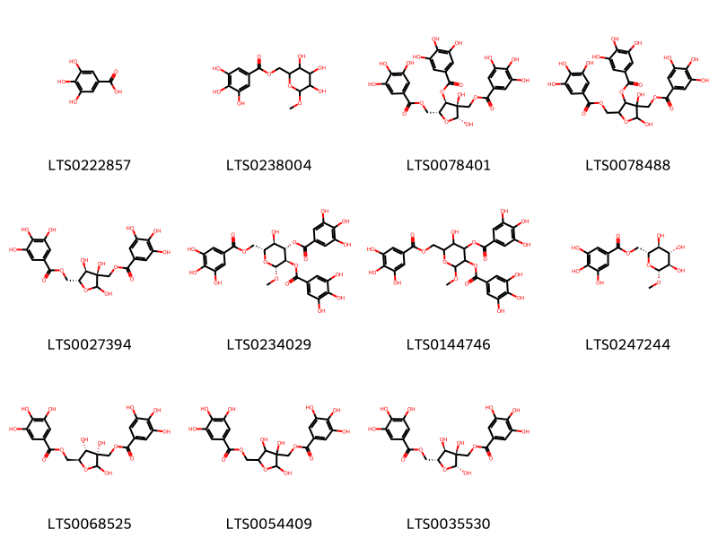
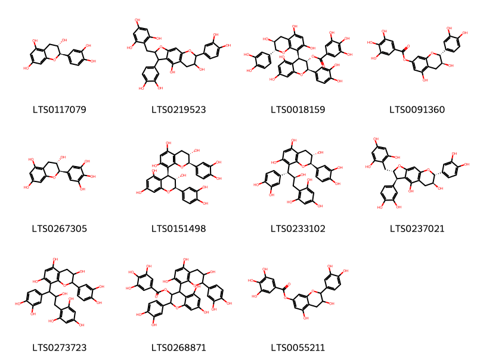
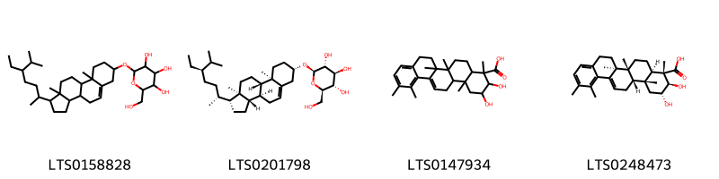
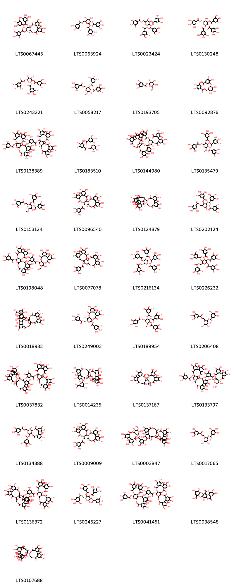

!!! abstract "Tóm tắt"

    Địa du (Rễ) (Radix Sanguisorbae) là rễ của cây Địa du (Sanguisorba officinalis), thuộc họ Hoa hồng (Rosaceae). Địa du phân bố chủ yếu ở châu Á và châu Âu, nhưng không phải cây bản địa tại Việt Nam. Theo y học cổ truyền, Địa du có vị đắng, tính hàn, với công năng lương huyết chỉ huyết, giải độc, và liễm nhọt. Địa du được dùng để chữa các chứng đại tiểu tiện ra máu, trĩ ra máu, lỵ ra máu, băng huyết, khí hư, bỏng, và mụn nhọt. Tác dụng dược lý của Địa du bao gồm cầm máu, hỗ trợ tiêu hóa, rửa vết loét, và giảm viêm. Thành phần hóa học chính gồm tannin, saponosit, flavon, và các chất biomarker như ziyu-glycoside I và ziyu-glycoside II.

## Thông tin về thực vật

Dược liệu **Địa Du (Rễ)** từ bộ phận **Rễ** từ loài *Sanguisorba officinalis*.

**Mô tả thực vật:** Loài cây sống dai. Cao 0,3-1,5m, có khi đạt 2m. Thân rỗng, mọc thẳng đứng, nhẵn, mang ít lá. Lá dài 30-40cm, kép lông chim lẻ, 5-15 lá chét, hình trứng, mép răng cưa to, tù. Hoa màu đỏ sẫm, lưỡng tính, nhỏ, tụ thành cụm hình trứng, ra hoa suốt mua hè (từ tháng 7-9), quả nhẵn, màu nâu, hơi bốn cạnh, chứa một hạt. Rễ bò ngầm dưới đất, màu nâu

*Tài liệu tham khảo:* "Những cây thuốc và vị thuốc Việt Nam" - Đỗ Tất Lợi 
Trong dược điển Việt nam, một số loài có thể dùng thay thế cho nhau làm dược liệu bao gồm *Sanguisorba officinalis, Sanguisorba officinalis*

!!! info "Phân loại thực vật của *Sanguisorba officinalis*"
    - **Kingdom:** Plantae
    - **Phylum:** Tracheophyta
    - **Order:** Rosales
    - **Family:** Rosaceae
    - **Genus:** Sanguisorba
    - **Species:** *Sanguisorba officinalis*

**Phân bố trên thế giới:** Germany, France, United States of America, Poland, Switzerland, Russian Federation, Croatia, Ukraine, United Kingdom of Great Britain and Northern Ireland, Norway, Czechia, Japan, Netherlands, Hungary, Austria

**Phân bố tại Việt nam:** Không có ghi nhận ở Việt Nam

!!! info "Phân loại thực vật của *Sanguisorba officinalis*"
    - **Kingdom:** Plantae
    - **Phylum:** Tracheophyta
    - **Order:** Rosales
    - **Family:** Rosaceae
    - **Genus:** Sanguisorba
    - **Species:** *Sanguisorba officinalis*

**Phân bố trên thế giới:** Germany, France, United States of America, Poland, Switzerland, Russian Federation, Croatia, Ukraine, United Kingdom of Great Britain and Northern Ireland, Norway, Czechia, Japan, Netherlands, Hungary, Austria

**Phân bố tại Việt nam:** Không có ghi nhận ở Việt Nam

## Thông tin về dược liệu 

### Định danh

!!! info "Thông tin về tên gọi"

    - Dược liệu tiếng Việt: địa du
    - Dược liệu tiếng Trung: 地榆 (Di Yu)
    - Dược liệu tiếng Anh: Sanguisorba Officinalis
    - Dược liệu latin thông dụng: Radix SanguisorbaenSanguisorbae Radix
    - Dược liệu latin kiểu DĐVN: *radix sanguisorbae*
    - Dược liệu latin kiểu DĐVN: *Sanguisorbae Radix*
    - Dược liệu latin kiểu thông tư: *None*
    - Bộ phận dùng: Rễ (Radix)

### Mô tả dược liệu 

- **Theo dược điển Việt nam V:** 
Rễ hình thoi hoặc hình trụ không đều, hơi cong queo hoặc vặn, dài 5 cm đến 25 cm, đường kính 0,5 cm đến 2 cm, mặt ngoài màu nâu tro, màu nâu hoặc tía thẫm, thô, có nếp nhăn dọc, có vân nứt ngang và vết rễ con. Chất cứng. Mặt bẻ tương đối phẳng, vỏ có nhiều sợi dạng bông, từ màu trắng vàng đến màu nâu vàng, gỗ màu vàng hoặc nâu vàng, tia gỗ xếp thành hàng xuyên tâm. Lát cắt hình tròn hay hình bầu dục không đều, dầy 0,2 cm đến 0,5 cm, mặt cắt màu đỏ tía hoặc nâu. Không mùi, vị hơi đắng, săn.

- **Mô tả dược liệu theo thông tư chế biến dược liệu theo phương pháp cổ truyền:** 

### Chế biến 

- **Chế biến theo dược điển việt nam V**: 
Mùa xuân, khi cây sắp nảy chồi, hoặc mùa thu sau khi cây khô, đào lấy rễ, loại bỏ rễ con, rửa sạch, phơi hoặc sấy khô, hoặc thái phiến rồi phơi khô. Bào chế Địa du phiến: Rửa sạch rễ Địa du, loại bỏ tạp chất, thân cây còn sót lại, ủ mềm, thái lát dày, phơi hoặc sấy khô để dùng. Địa du thán sao: Lấy Địa du đã thái lát, sao lửa to đến khi mặt ngoài có màu đen sém và bên trong có màu vàng hay màu nâu. Lấy ra để nguội.nn

- **Chế biến theo thông tư:** 

--- 

## Thành phần hóa học

- Theo tài liệu của GS. Đỗ Tất Lợi:  Thành phần chủ yếu trong địa du là tannin, saponosit, flavon
    

**Thành phần hóa học từ loài **Sanguisorba officinalis**

Theo cơ sở dữ liệu lotus, loài *Sanguisorba officinalis* đã phân lập và xác định được **141** hoạt chất thuộc về các nhóm Pyrans, Steroids and steroid derivatives, Organooxygen compounds, Flavonoids, Tannins, Benzene and substituted derivatives, Prenol lipids trong bảng dưới đây. Danh sách các hoạt chất như sau 3,4-dihydroxy-5-({3,4,5-trihydroxy-6-[(3,4,5-trihydroxybenzoyloxy)methyl]oxan-2-yl}oxy)benzoic acid [(LTS0183510)](https://lotus.naturalproducts.net/compound/lotus_id/LTS0183510), 3,4,5-trihydroxy-6-(hydroxymethyl)oxan-2-yl 9-(hydroxymethyl)-2,2,6a,6b,9,12a-hexamethyl-10-[(3,4,5-trihydroxyoxan-2-yl)oxy]-1,3,4,5,6,7,8,8a,10,11,12,12b,13,14b-tetradecahydropicene-4a-carboxylate [(LTS0137322)](https://lotus.naturalproducts.net/compound/lotus_id/LTS0137322), (2s,3r,4s,5s,6r)-4,5-dihydroxy-3-(3,4,5-trihydroxybenzoyloxy)-6-[(3,4,5-trihydroxybenzoyloxy)methyl]oxan-2-yl 3,4,5-trihydroxybenzoate [(LTS0243221)](https://lotus.naturalproducts.net/compound/lotus_id/LTS0243221), (4as,6ar,6br,8ar,10s,12ar,12bs,14bs)-10-hydroxy-1,2,6a,6b,9,9,12a-heptamethyl-4,5,6,7,8,8a,10,11,12,12b,13,14b-dodecahydro-3h-picene-4a-carboxylic acid [(LTS0032188)](https://lotus.naturalproducts.net/compound/lotus_id/LTS0032188), (10r,11s,13r,14r,15s)-3,4,5,14,20,21,22-heptahydroxy-13-(hydroxymethyl)-8,17-dioxo-9,12,16-trioxatetracyclo[16.4.0.0²,⁷.0¹⁰,¹⁵]docosa-1(22),2(7),3,5,18,20-hexaen-11-yl 3-{[(1r,2s,19r,20r,22r)-7,8,9,12,13,14,28,29,30,33,34,35-dodecahydroxy-4,17,25,38-tetraoxo-20-(3,4,5-trihydroxybenzoyloxy)-3,18,21,24,39-pentaoxaheptacyclo[20.17.0.0²,¹⁹.0⁵,¹⁰.0¹¹,¹⁶.0²⁶,³¹.0³²,³⁷]nonatriaconta-5,7,9,11(16),12,14,26,28,30,32(37),33,35-dodecaen-36-yl]oxy}-4,5-dihydroxybenzoate [(LTS0133797)](https://lotus.naturalproducts.net/compound/lotus_id/LTS0133797), 3,4,5,14,20,21,22-heptahydroxy-13-(hydroxymethyl)-8,17-dioxo-9,12,16-trioxatetracyclo[16.4.0.0²,⁷.0¹⁰,¹⁵]docosa-1(22),2(7),3,5,18,20-hexaen-11-yl 3-{[7,8,9,12,13,14,28,29,30,33,34,35-dodecahydroxy-4,17,25,38-tetraoxo-20-(3,4,5-trihydroxybenzoyloxy)-3,18,21,24,39-pentaoxaheptacyclo[20.17.0.0²,¹⁹.0⁵,¹⁰.0¹¹,¹⁶.0²⁶,³¹.0³²,³⁷]nonatriaconta-5(10),6,8,11,13,15,26,28,30,32(37),33,35-dodecaen-36-yl]oxy}-4,5-dihydroxybenzoate [(LTS0198048)](https://lotus.naturalproducts.net/compound/lotus_id/LTS0198048), (11r,12r)-12-[(15s,19s)-2,3,4,7,8,9,19-heptahydroxy-12,17-dioxo-13,16-dioxatetracyclo[13.3.1.0⁵,¹⁸.0⁶,¹¹]nonadeca-1(18),2,4,6,8,10-hexaen-14-yl]-3,4,5,17,18,19-hexahydroxy-8,14-dioxo-9,13-dioxatricyclo[13.4.0.0²,⁷]nonadeca-1(15),2,4,6,16,18-hexaen-11-yl 3,4,5-trihydroxybenzoate [(LTS0107688)](https://lotus.naturalproducts.net/compound/lotus_id/LTS0107688), (+)-catechol [(LTS0117079)](https://lotus.naturalproducts.net/compound/lotus_id/LTS0117079), (4s,4as,6as,6br,8as,10r,12ar,12bs,14bs)-10-hydroxy-1,6a,6b,9,9,12a-hexamethyl-3,4,4a,5,6,7,8,8a,10,11,12,12b,13,14b-tetradecahydropicene-4-carboxylic acid [(LTS0128389)](https://lotus.naturalproducts.net/compound/lotus_id/LTS0128389), 10-hydroxy-1,2,6a,6b,9,9,12a-heptamethyl-4,5,6,7,8,8a,10,11,12,12b,13,14b-dodecahydro-3h-picene-4a-carboxylic acid [(LTS0082442)](https://lotus.naturalproducts.net/compound/lotus_id/LTS0082442), (2s,3r,4s,5s,6r)-3,4,5-trihydroxy-6-(hydroxymethyl)oxan-2-yl (2r,4as,6as,6br,8ar,9r,10s,12ar,12br,14bs)-10-{[(2s,3s,4s,5r)-3,4-dihydroxy-5-(hydroxymethyl)oxolan-2-yl]oxy}-9-(hydroxymethyl)-2,6a,6b,9,12a-pentamethyl-1-methylidene-2,3,4,5,6,7,8,8a,10,11,12,12b,13,14b-tetradecahydropicene-4a-carboxylate [(LTS0219609)](https://lotus.naturalproducts.net/compound/lotus_id/LTS0219609), (2s,3r,4s,5s,6r)-3,4,5-trihydroxy-6-[(3,4,5-trihydroxybenzoyloxy)methyl]oxan-2-yl (1r,2r,4as,6as,6br,8ar,10s,12ar,12br,14bs)-1-hydroxy-1,2,6a,6b,9,9,12a-heptamethyl-10-{[(2s,3r,4s,5s)-3,4,5-trihydroxyoxan-2-yl]oxy}-2,3,4,5,6,7,8,8a,10,11,12,12b,13,14b-tetradecahydropicene-4a-carboxylate [(LTS0264820)](https://lotus.naturalproducts.net/compound/lotus_id/LTS0264820), galop [(LTS0222857)](https://lotus.naturalproducts.net/compound/lotus_id/LTS0222857), [4,5-dihydroxy-6-methoxy-3-(3,4,5-trihydroxybenzoyloxy)oxan-2-yl]methyl 3,4,5-trihydroxybenzoate [(LTS0206408)](https://lotus.naturalproducts.net/compound/lotus_id/LTS0206408), 3,4,5-trihydroxy-6-(hydroxymethyl)oxan-2-yl 1,2,6a,6b,9,9,12a-heptamethyl-10-[(3,4,5-trihydroxyoxan-2-yl)oxy]-2,3,4,5,6,7,8,8a,10,11,12,12b-dodecahydro-1h-picene-4a-carboxylate [(LTS0062114)](https://lotus.naturalproducts.net/compound/lotus_id/LTS0062114), 3,4-dihydroxy-5-({6,7,13,14-tetrahydroxy-3,10-dioxo-2,9-dioxatetracyclo[6.6.2.0⁴,¹⁶.0¹¹,¹⁵]hexadeca-1(14),4(16),5,7,11(15),12-hexaen-5-yl}oxy)benzoic acid [(LTS0038548)](https://lotus.naturalproducts.net/compound/lotus_id/LTS0038548), 1-hydroxy-1,6a,6b,9,9,12a-hexamethyl-2-methylidene-10-[(3,4,5-trihydroxyoxan-2-yl)oxy]-4,5,6,7,8,8a,10,11,12,12b,13,14b-dodecahydro-3h-picene-4a-carboxylic acid [(LTS0214369)](https://lotus.naturalproducts.net/compound/lotus_id/LTS0214369), [(2r,3r,4r,5r)-2,3-dihydroxy-4-(3,4,5-trihydroxybenzoyloxy)-5-[(3,4,5-trihydroxybenzoyloxy)methyl]oxolan-3-yl]methyl 3,4,5-trihydroxybenzoate [(LTS0078401)](https://lotus.naturalproducts.net/compound/lotus_id/LTS0078401), 2-{[6,12-bis(3,4-dihydroxyphenyl)-8,11-dihydroxy-4,13-dioxatricyclo[7.4.0.0³,⁷]trideca-1(9),2,7-trien-5-yl]methyl}benzene-1,3,5-triol [(LTS0219523)](https://lotus.naturalproducts.net/compound/lotus_id/LTS0219523), (2s,3r,4s,5s,6r)-3,4,5-trihydroxy-6-(hydroxymethyl)oxan-2-yl (1s,4ar,6as,6br,8ar,10s,12ar,12br,14bs)-10-{[(2s,3s,4s,5r)-3,4-dihydroxy-5-(hydroxymethyl)oxolan-2-yl]oxy}-1-hydroxy-2,2,6a,6b,9,9,12a-heptamethyl-1,3,4,5,6,7,8,8a,10,11,12,12b,13,14b-tetradecahydropicene-4a-carboxylate [(LTS0260253)](https://lotus.naturalproducts.net/compound/lotus_id/LTS0260253), chlorogenic acid [(LTS0226495)](https://lotus.naturalproducts.net/compound/lotus_id/LTS0226495), [(2r,3r,4s,5r,6r)-6-methoxy-3,4,5-tris(3,4,5-trihydroxybenzoyloxy)oxan-2-yl]methyl 3,4,5-trihydroxybenzoate [(LTS0189954)](https://lotus.naturalproducts.net/compound/lotus_id/LTS0189954), 1,2,6a,6b,9,9,12a-heptamethyl-10-[(3,4,5-trihydroxyoxan-2-yl)oxy]-3,4,5,6,7,8,8a,10,11,12,12b,13-dodecahydro-2h-picene-4a-carboxylic acid [(LTS0010023)](https://lotus.naturalproducts.net/compound/lotus_id/LTS0010023), 1,2,6a,6b,9,9,12a-heptamethyl-10-[(3,4,5-trihydroxyoxan-2-yl)oxy]-4,5,6,7,8,8a,10,11,12,12b,13,14b-dodecahydro-3h-picene-4a-carboxylic acid [(LTS0068840)](https://lotus.naturalproducts.net/compound/lotus_id/LTS0068840), 3,4-dihydroxy-5-{[(2s,3r,4s,5s,6r)-3,4,5-trihydroxy-6-[(3,4,5-trihydroxybenzoyloxy)methyl]oxan-2-yl]oxy}benzoic acid [(LTS0092876)](https://lotus.naturalproducts.net/compound/lotus_id/LTS0092876), β-glucogallin [(LTS0193705)](https://lotus.naturalproducts.net/compound/lotus_id/LTS0193705), 1-hydroxy-1,2,6a,6b,9,9,12a-heptamethyl-10-oxo-3,4,5,6,7,8,8a,11,12,12b,13,14b-dodecahydro-2h-picene-4a-carboxylic acid [(LTS0111779)](https://lotus.naturalproducts.net/compound/lotus_id/LTS0111779), 3,4,5-trihydroxy-6-(hydroxymethyl)oxan-2-yl 10-{[3,4-dihydroxy-5-(hydroxymethyl)oxolan-2-yl]oxy}-9-(hydroxymethyl)-2,2,6a,6b,9,12a-hexamethyl-1,3,4,5,6,7,8,8a,10,11,12,12b,13,14b-tetradecahydropicene-4a-carboxylate [(LTS0272472)](https://lotus.naturalproducts.net/compound/lotus_id/LTS0272472), 1,10,11-trihydroxy-1,2,6a,6b,9,9,12a-heptamethyl-2,3,4,5,6,7,8,8a,10,11,12,12b,13,14b-tetradecahydropicene-4a-carboxylic acid [(LTS0013744)](https://lotus.naturalproducts.net/compound/lotus_id/LTS0013744), (1r,2r,4as,6as,6br,8ar,12as,12br,14bs)-1-hydroxy-1,2,6a,6b,9,9,12a-heptamethyl-10,13-dioxo-2,3,4,5,6,7,8,8a,11,12,12b,14b-dodecahydropicene-4a-carboxylic acid [(LTS0194289)](https://lotus.naturalproducts.net/compound/lotus_id/LTS0194289), 3-{[9,10,11,14,15,16,27,28,29,32,33,34-dodecahydroxy-6,19,24,37-tetraoxo-3-(3,4,5-trihydroxybenzoyloxy)-2,5,20,23,38-pentaoxaheptacyclo[19.18.0.0⁴,²².0⁷,¹².0¹³,¹⁸.0²⁵,³⁰.0³¹,³⁶]nonatriaconta-7(12),8,10,13,15,17,25(30),26,28,31,33,35-dodecaen-26-yl]oxy}-4,5-dihydroxybenzoic acid [(LTS0018932)](https://lotus.naturalproducts.net/compound/lotus_id/LTS0018932), 2-{[(5s,6r,11s,12r)-6,12-bis(3,4-dihydroxyphenyl)-8,11-dihydroxy-4,13-dioxatricyclo[7.4.0.0³,⁷]trideca-1(9),2,7-trien-5-yl]methyl}benzene-1,3,5-triol [(LTS0237021)](https://lotus.naturalproducts.net/compound/lotus_id/LTS0237021), (4as,6as,6br,8ar,10s,12ar,12br,14bs)-1,2,6a,6b,9,9,12a-heptamethyl-10-{[(2s,3r,4s,5s)-3,4,5-trihydroxyoxan-2-yl]oxy}-4,5,6,7,8,8a,10,11,12,12b,13,14b-dodecahydro-3h-picene-4a-carboxylic acid [(LTS0001344)](https://lotus.naturalproducts.net/compound/lotus_id/LTS0001344), (1s,4r,4as,6as,6br,8as,10s,12ar,12br,14bs)-1,6a,6b,9,9,12a-hexamethyl-10-{[(2r,3r,4s,5s)-3,4,5-trihydroxyoxan-2-yl]oxy}-1,2,3,4,4a,5,6,7,8,8a,10,11,12,12b,13,14b-hexadecahydropicene-4-carboxylic acid [(LTS0098360)](https://lotus.naturalproducts.net/compound/lotus_id/LTS0098360), 1-hydroxy-2,2,6a,6b,9,9,12a-heptamethyl-10-[(3,4,5-trihydroxyoxan-2-yl)oxy]-1,3,4,5,6,7,8,8a,10,11,12,12b,13,14b-tetradecahydropicene-4a-carboxylic acid [(LTS0161017)](https://lotus.naturalproducts.net/compound/lotus_id/LTS0161017), (1s,4ar,6as,6br,8as,10s,12ar,12br,14bs)-1-hydroxy-2,2,6a,6b,9,9,12a-heptamethyl-10-{[(2s,3r,4s,5s)-3,4,5-trihydroxyoxan-2-yl]oxy}-1,3,4,5,6,7,8,8a,10,11,12,12b,13,14b-tetradecahydropicene-4a-carboxylic acid [(LTS0198821)](https://lotus.naturalproducts.net/compound/lotus_id/LTS0198821), 3,4,5,14,20,21,22-heptahydroxy-13-(hydroxymethyl)-8,17-dioxo-9,12,16-trioxatetracyclo[16.4.0.0²,⁷.0¹⁰,¹⁵]docosa-1(22),2(7),3,5,18,20-hexaen-11-yl 3-{[9,10,11,14,15,16,26,28,29,32,33,34-dodecahydroxy-6,19,24,37-tetraoxo-3-(3,4,5-trihydroxybenzoyloxy)-2,5,20,23,38-pentaoxaheptacyclo[19.18.0.0⁴,²².0⁷,¹².0¹³,¹⁸.0²⁵,³⁰.0³¹,³⁶]nonatriaconta-7(12),8,10,13,15,17,25,27,29,31,33,35-dodecaen-27-yl]oxy}-4,5-dihydroxybenzoate [(LTS0144980)](https://lotus.naturalproducts.net/compound/lotus_id/LTS0144980), procyanidin b3 3-o-gallate [(LTS0018159)](https://lotus.naturalproducts.net/compound/lotus_id/LTS0018159), (2s,3r,4s,5s,6r)-3,4,5-trihydroxy-6-(hydroxymethyl)oxan-2-yl (1r,2r,4as,6as,6br,8ar,10s,12ar,12br,14bs)-1-hydroxy-1,2,6a,6b,9,9,12a-heptamethyl-10-{[(2r,3r,4s,5s)-3,4,5-trihydroxyoxan-2-yl]oxy}-2,3,4,5,6,7,8,8a,10,11,12,12b,13,14b-tetradecahydropicene-4a-carboxylate [(LTS0159180)](https://lotus.naturalproducts.net/compound/lotus_id/LTS0159180), 2-hydroxy-4,5-bis(3,4,5-trihydroxybenzoyloxy)-6-[(3,4,5-trihydroxybenzoyloxy)methyl]oxan-3-yl 3,4,5-trihydroxybenzoate [(LTS0202124)](https://lotus.naturalproducts.net/compound/lotus_id/LTS0202124), (1r,2s,19r,20s,22r)-7,8,9,12,13,14,28,29,30,33,34,35-dodecahydroxy-4,17,25,38-tetraoxo-3,18,21,24,39-pentaoxaheptacyclo[20.17.0.0²,¹⁹.0⁵,¹⁰.0¹¹,¹⁶.0²⁶,³¹.0³²,³⁷]nonatriaconta-5,7,9,11(16),12,14,26,28,30,32(37),33,35-dodecaen-20-yl 3-{[(1r,2s,19r,20r,22r)-7,8,9,12,13,14,28,29,30,33,34,35-dodecahydroxy-4,17,25,38-tetraoxo-20-(3,4,5-trihydroxybenzoyloxy)-3,18,21,24,39-pentaoxaheptacyclo[20.17.0.0²,¹⁹.0⁵,¹⁰.0¹¹,¹⁶.0²⁶,³¹.0³²,³⁷]nonatriaconta-5,7,9,11(16),12,14,26,28,30,32(37),33,35-dodecaen-36-yl]oxy}-4,5-dihydroxybenzoate [(LTS0138389)](https://lotus.naturalproducts.net/compound/lotus_id/LTS0138389), [(2r,3s,4s,5r,6r)-3,4,5-trihydroxy-6-methoxyoxan-2-yl]methyl 3,4,5-trihydroxybenzoate [(LTS0247244)](https://lotus.naturalproducts.net/compound/lotus_id/LTS0247244), 7,8,9,12,13,14,28,29,30,33,34,35-dodecahydroxy-4,17,25,38-tetraoxo-3,18,21,24,39-pentaoxaheptacyclo[20.17.0.0²,¹⁹.0⁵,¹⁰.0¹¹,¹⁶.0²⁶,³¹.0³²,³⁷]nonatriaconta-5,7,9,11(16),12,14,26,28,30,32(37),33,35-dodecaen-20-yl 3-{[7,8,9,12,13,14,28,29,30,33,34,35-dodecahydroxy-4,17,25,38-tetraoxo-20-(3,4,5-trihydroxybenzoyloxy)-3,18,21,24,39-pentaoxaheptacyclo[20.17.0.0²,¹⁹.0⁵,¹⁰.0¹¹,¹⁶.0²⁶,³¹.0³²,³⁷]nonatriaconta-5(10),6,8,11,13,15,26,28,30,32(37),33,35-dodecaen-36-yl]oxy}-4,5-dihydroxybenzoate [(LTS0041451)](https://lotus.naturalproducts.net/compound/lotus_id/LTS0041451), [(2r,3r,4r,5r)-2,3,4-trihydroxy-5-[(3,4,5-trihydroxybenzoyloxy)methyl]oxolan-3-yl]methyl 3,4,5-trihydroxybenzoate [(LTS0035530)](https://lotus.naturalproducts.net/compound/lotus_id/LTS0035530), 3,4,5-trihydroxy-6-[(3,4,5-trihydroxybenzoyloxy)methyl]oxan-2-yl 1-hydroxy-1,2,6a,6b,9,9,12a-heptamethyl-10-[(3,4,5-trihydroxyoxan-2-yl)oxy]-2,3,4,5,6,7,8,8a,10,11,12,12b,13,14b-tetradecahydropicene-4a-carboxylate [(LTS0035299)](https://lotus.naturalproducts.net/compound/lotus_id/LTS0035299), betulinic acid [(LTS0210795)](https://lotus.naturalproducts.net/compound/lotus_id/LTS0210795), 2-(3,4-dihydroxyphenyl)-8-[1-(3,4-dihydroxyphenyl)-2-hydroxy-3-(2,4,6-trihydroxyphenyl)propyl]-3,4-dihydro-2h-1-benzopyran-3,5,7-triol [(LTS0273723)](https://lotus.naturalproducts.net/compound/lotus_id/LTS0273723), 3,4,5-trihydroxy-6-(hydroxymethyl)oxan-2-yl 10-{[3,4-dihydroxy-5-(hydroxymethyl)oxolan-2-yl]oxy}-9-(hydroxymethyl)-2,6a,6b,9,12a-pentamethyl-1-methylidene-2,3,4,5,6,7,8,8a,10,11,12,12b,13,14b-tetradecahydropicene-4a-carboxylate [(LTS0016302)](https://lotus.naturalproducts.net/compound/lotus_id/LTS0016302), 10-hydroxy-1,6a,6b,9,9,12a-hexamethyl-3,4,4a,5,6,7,8,8a,10,11,12,12b,13,14b-tetradecahydropicene-4-carboxylic acid [(LTS0162147)](https://lotus.naturalproducts.net/compound/lotus_id/LTS0162147), euscaphic acid [(LTS0205657)](https://lotus.naturalproducts.net/compound/lotus_id/LTS0205657), (4as,6as,6br,8ar,10s,12ar,12br,14bs)-10-hydroxy-1,2,6a,6b,9,9,12a-heptamethyl-4,5,6,7,8,8a,10,11,12,12b,13,14b-dodecahydro-3h-picene-4a-carboxylic acid [(LTS0158817)](https://lotus.naturalproducts.net/compound/lotus_id/LTS0158817), [(3s,4s,5s)-2,3,4-trihydroxy-5-[(3,4,5-trihydroxybenzoyloxy)methyl]oxolan-3-yl]methyl 3,4,5-trihydroxybenzoate [(LTS0068525)](https://lotus.naturalproducts.net/compound/lotus_id/LTS0068525), (2s,20s,22r)-7,8,9,12,13,14,28,29,30,33,34,35-dodecahydroxy-4,17,25,38-tetraoxo-3,18,21,24,39-pentaoxaheptacyclo[20.17.0.0²,¹⁹.0⁵,¹⁰.0¹¹,¹⁶.0²⁶,³¹.0³²,³⁷]nonatriaconta-5,7,9,11(16),12,14,26,28,30,32(37),33,35-dodecaen-20-yl 3,4,5-trihydroxybenzoate [(LTS0096540)](https://lotus.naturalproducts.net/compound/lotus_id/LTS0096540), tormentic acid [(LTS0102591)](https://lotus.naturalproducts.net/compound/lotus_id/LTS0102591), (1r,2s,19r,20s,22r)-7,8,9,12,13,14,28,29,30,33,34,35-dodecahydroxy-4,17,25,38-tetraoxo-3,18,21,24,39-pentaoxaheptacyclo[20.17.0.0²,¹⁹.0⁵,¹⁰.0¹¹,¹⁶.0²⁶,³¹.0³²,³⁷]nonatriaconta-5,7,9,11(16),12,14,26,28,30,32(37),33,35-dodecaen-20-yl 3-{[(1r,3s,4r,21r,22s)-9,10,11,14,15,16,27,28,29,32,33,34-dodecahydroxy-6,19,24,37-tetraoxo-3-(3,4,5-trihydroxybenzoyloxy)-2,5,20,23,38-pentaoxaheptacyclo[19.18.0.0⁴,²².0⁷,¹².0¹³,¹⁸.0²⁵,³⁰.0³¹,³⁶]nonatriaconta-7,9,11,13(18),14,16,25(30),26,28,31,33,35-dodecaen-26-yl]oxy}-4,5-dihydroxybenzoate [(LTS0037832)](https://lotus.naturalproducts.net/compound/lotus_id/LTS0037832), 2-(3,4-dihydroxyphenyl)-4-[2-(3,4-dihydroxyphenyl)-3,5,7-trihydroxy-3,4-dihydro-2h-1-benzopyran-8-yl]-5,7-dihydroxy-3,4-dihydro-2h-1-benzopyran-3-yl 3,4,5-trihydroxybenzoate [(LTS0268871)](https://lotus.naturalproducts.net/compound/lotus_id/LTS0268871), (2s,3r,4s,5s,6r)-3,4,5-trihydroxy-6-(hydroxymethyl)oxan-2-yl (2r,4as,6as,6br,8ar,10s,12ar,12br,14bs)-2,6a,6b,9,9,12a-hexamethyl-1-methylidene-10-{[(2s,3r,4s,5s)-3,4,5-trihydroxyoxan-2-yl]oxy}-2,3,4,5,6,7,8,8a,10,11,12,12b,13,14b-tetradecahydropicene-4a-carboxylate [(LTS0152807)](https://lotus.naturalproducts.net/compound/lotus_id/LTS0152807), [(2r,3r,4s,5r,6r)-3-hydroxy-6-methoxy-4,5-bis(3,4,5-trihydroxybenzoyloxy)oxan-2-yl]methyl 3,4,5-trihydroxybenzoate [(LTS0234029)](https://lotus.naturalproducts.net/compound/lotus_id/LTS0234029), (2s,3r,4s,5s,6r)-3,4,5-trihydroxy-6-(hydroxymethyl)oxan-2-yl (1s,4ar,6as,6br,8ar,10s,12ar,12br,14bs)-1-hydroxy-2,2,6a,6b,9,9,12a-heptamethyl-10-{[(2s,3r,4s,5s)-3,4,5-trihydroxyoxan-2-yl]oxy}-1,3,4,5,6,7,8,8a,10,11,12,12b,13,14b-tetradecahydropicene-4a-carboxylate [(LTS0148457)](https://lotus.naturalproducts.net/compound/lotus_id/LTS0148457), 1,10,11,12-tetrahydroxy-1,2,6a,6b,9,9,12a-heptamethyl-2,3,4,5,6,7,8,8a,10,11,12,12b,13,14b-tetradecahydropicene-4a-carboxylic acid [(LTS0236587)](https://lotus.naturalproducts.net/compound/lotus_id/LTS0236587), [(3r,4r,5r)-2,3,4-trihydroxy-5-[(3,4,5-trihydroxybenzoyloxy)methyl]oxolan-3-yl]methyl 3,4,5-trihydroxybenzoate [(LTS0027394)](https://lotus.naturalproducts.net/compound/lotus_id/LTS0027394), (3,4,5-trihydroxy-6-methoxyoxan-2-yl)methyl 3,4,5-trihydroxybenzoate [(LTS0238004)](https://lotus.naturalproducts.net/compound/lotus_id/LTS0238004), 3,4,5-trihydroxy-6-[(3,4,5-trihydroxybenzoyloxy)methyl]oxan-2-yl 10-{[3,4-dihydroxy-5-(hydroxymethyl)oxolan-2-yl]oxy}-1-hydroxy-1,2,6a,6b,9,9,12a-heptamethyl-2,3,4,5,6,7,8,8a,10,11,12,12b,13,14b-tetradecahydropicene-4a-carboxylate [(LTS0187329)](https://lotus.naturalproducts.net/compound/lotus_id/LTS0187329), 3,4,5-trihydroxy-6-(hydroxymethyl)oxan-2-yl 10-{[3,4-dihydroxy-5-(hydroxymethyl)oxolan-2-yl]oxy}-1-hydroxy-1,2,6a,6b,9,9,12a-heptamethyl-2,3,4,5,6,7,8,8a,10,11,12,12b,13,14b-tetradecahydropicene-4a-carboxylate [(LTS0162623)](https://lotus.naturalproducts.net/compound/lotus_id/LTS0162623), α-pyrone [(LTS0231090)](https://lotus.naturalproducts.net/compound/lotus_id/LTS0231090), (2r,4as,6as,6br,8ar,10s,12ar,12br)-1,2,6a,6b,9,9,12a-heptamethyl-10-{[(2s,3r,4s,5s)-3,4,5-trihydroxyoxan-2-yl]oxy}-3,4,5,6,7,8,8a,10,11,12,12b,13-dodecahydro-2h-picene-4a-carboxylic acid [(LTS0035375)](https://lotus.naturalproducts.net/compound/lotus_id/LTS0035375), 3,4,5-trihydroxy-6-(hydroxymethyl)oxan-2-yl 1-hydroxy-1,2,6a,6b,9,9,12a-heptamethyl-10-[(3,4,5-trihydroxyoxan-2-yl)oxy]-2,3,4,5,6,7,8,8a,10,11,12,12b,13,14b-tetradecahydropicene-4a-carboxylate [(LTS0268210)](https://lotus.naturalproducts.net/compound/lotus_id/LTS0268210), 7,8,9,12,13,14,28,29,30,33,34,35-dodecahydroxy-4,17,25,38-tetraoxo-3,18,21,24,39-pentaoxaheptacyclo[20.17.0.0²,¹⁹.0⁵,¹⁰.0¹¹,¹⁶.0²⁶,³¹.0³²,³⁷]nonatriaconta-5,7,9,11(16),12,14,26,28,30,32(37),33,35-dodecaen-20-yl 3,4,5-trihydroxybenzoate [(LTS0009009)](https://lotus.naturalproducts.net/compound/lotus_id/LTS0009009), (2s,3r,4s,5s,6r)-3,4,5-trihydroxy-6-(hydroxymethyl)oxan-2-yl (1r,2r,4as,6as,6br,8ar,10s,12ar,12br,14bs)-10-{[(2s,3s,4s,5r)-3,4-dihydroxy-5-(hydroxymethyl)oxolan-2-yl]oxy}-1-hydroxy-1,2,6a,6b,9,9,12a-heptamethyl-2,3,4,5,6,7,8,8a,10,11,12,12b,13,14b-tetradecahydropicene-4a-carboxylate [(LTS0129016)](https://lotus.naturalproducts.net/compound/lotus_id/LTS0129016), 3,4,5,14,20,21,22-heptahydroxy-8,17-dioxo-13-[(3,4,5-trihydroxybenzoyloxy)methyl]-9,12,16-trioxatetracyclo[16.4.0.0²,⁷.0¹⁰,¹⁵]docosa-1(18),2,4,6,19,21-hexaen-11-yl 3,4,5-trihydroxybenzoate [(LTS0134388)](https://lotus.naturalproducts.net/compound/lotus_id/LTS0134388), (2s,3r,4s,5s,6r)-3,4,5-trihydroxy-6-(hydroxymethyl)oxan-2-yl (1r,2r,4as,6as,6br,8ar,10s,12ar,12br,14bs)-1,10-dihydroxy-1,2,6a,6b,9,9,12a-heptamethyl-2,3,4,5,6,7,8,8a,10,11,12,12b,13,14b-tetradecahydropicene-4a-carboxylate [(LTS0126971)](https://lotus.naturalproducts.net/compound/lotus_id/LTS0126971), (1r,2r,4as,6as,6br,8ar,10s,12ar,12br,14bs)-1-hydroxy-1,2,6a,6b,9,9,12a-heptamethyl-10-{[(2r,3r,4s,5s)-3,4,5-trihydroxyoxan-2-yl]oxy}-2,3,4,5,6,7,8,8a,10,11,12,12b,13,14b-tetradecahydropicene-4a-carboxylic acid [(LTS0143279)](https://lotus.naturalproducts.net/compound/lotus_id/LTS0143279), 3,4,5-trihydroxy-6-(hydroxymethyl)oxan-2-yl 1-hydroxy-2,2,6a,6b,9,9,12a-heptamethyl-10-[(3,4,5-trihydroxyoxan-2-yl)oxy]-1,3,4,5,6,7,8,8a,10,11,12,12b,13,14b-tetradecahydropicene-4a-carboxylate [(LTS0095998)](https://lotus.naturalproducts.net/compound/lotus_id/LTS0095998), 3,4,5-trihydroxy-6-(hydroxymethyl)oxan-2-yl 1,10-dihydroxy-1,2,6a,6b,9,9,12a-heptamethyl-2,3,4,5,6,7,8,8a,10,11,12,12b,13,14b-tetradecahydropicene-4a-carboxylate [(LTS0150203)](https://lotus.naturalproducts.net/compound/lotus_id/LTS0150203), (1r,2r,4as,6as,6br,8ar,10s,12ar,12br,14bs)-1-hydroxy-1,2,6a,6b,9,9,12a-heptamethyl-10-{[(2s,3r,4s,5s)-3,4,5-trihydroxyoxan-2-yl]oxy}-2,3,4,5,6,7,8,8a,10,11,12,12b,13,14b-tetradecahydropicene-4a-carboxylic acid [(LTS0157847)](https://lotus.naturalproducts.net/compound/lotus_id/LTS0157847), (1r,2r,4as,6as,6br,8ar,10s,12ar,12br,14bs)-10-{[(2s,3s,4s,5r)-3,4-dihydroxy-5-(hydroxymethyl)oxolan-2-yl]oxy}-1-hydroxy-1,2,6a,6b,9,9,12a-heptamethyl-2,3,4,5,6,7,8,8a,10,11,12,12b,13,14b-tetradecahydropicene-4a-carboxylic acid [(LTS0103269)](https://lotus.naturalproducts.net/compound/lotus_id/LTS0103269), 3-{[(1r,3s,4r,21r,22s)-9,10,11,14,15,16,27,28,29,32,33,34-dodecahydroxy-6,19,24,37-tetraoxo-3-(3,4,5-trihydroxybenzoyloxy)-2,5,20,23,38-pentaoxaheptacyclo[19.18.0.0⁴,²².0⁷,¹².0¹³,¹⁸.0²⁵,³⁰.0³¹,³⁶]nonatriaconta-7,9,11,13(18),14,16,25(30),26,28,31,33,35-dodecaen-26-yl]oxy}-4,5-dihydroxybenzoic acid [(LTS0014235)](https://lotus.naturalproducts.net/compound/lotus_id/LTS0014235), pomolic acid [(LTS0196537)](https://lotus.naturalproducts.net/compound/lotus_id/LTS0196537), (1r,2s,19r,20r,22r)-7,8,9,12,13,14,28,29,30,33,34,35-dodecahydroxy-4,17,25,38-tetraoxo-3,18,21,24,39-pentaoxaheptacyclo[20.17.0.0²,¹⁹.0⁵,¹⁰.0¹¹,¹⁶.0²⁶,³¹.0³²,³⁷]nonatriaconta-5,7,9,11(16),12,14,26,28,30,32(37),33,35-dodecaen-20-yl 3,4,5-trihydroxybenzoate [(LTS0077078)](https://lotus.naturalproducts.net/compound/lotus_id/LTS0077078), 10-{[3,4-dihydroxy-5-(hydroxymethyl)oxolan-2-yl]oxy}-1,2,6a,6b,9,9,12a-heptamethyl-3,4,5,6,7,8,8a,10,11,12,12b,13-dodecahydro-2h-picene-4a-carboxylic acid [(LTS0129649)](https://lotus.naturalproducts.net/compound/lotus_id/LTS0129649), (2s,3r,4s,5s,6r)-3,4,5-trihydroxy-6-(hydroxymethyl)oxan-2-yl (4as,6as,6br,8ar,9r,10s,12ar,12br,14bs)-9-(hydroxymethyl)-2,2,6a,6b,9,12a-hexamethyl-10-{[(2s,3r,4s,5s)-3,4,5-trihydroxyoxan-2-yl]oxy}-1,3,4,5,6,7,8,8a,10,11,12,12b,13,14b-tetradecahydropicene-4a-carboxylate [(LTS0115586)](https://lotus.naturalproducts.net/compound/lotus_id/LTS0115586), sitogluside [(LTS0201798)](https://lotus.naturalproducts.net/compound/lotus_id/LTS0201798), 10-{[3,4-dihydroxy-5-(hydroxymethyl)oxolan-2-yl]oxy}-1-hydroxy-1,2,6a,6b,9,9,12a-heptamethyl-2,3,4,5,6,7,8,8a,10,11,12,12b,13,14b-tetradecahydropicene-4a-carboxylic acid [(LTS0125605)](https://lotus.naturalproducts.net/compound/lotus_id/LTS0125605), 5-hydroxy-3,4-bis(3,4,5-trihydroxybenzoyloxy)-6-[(3,4,5-trihydroxybenzoyloxy)methyl]oxan-2-yl 3,4,5-trihydroxybenzoate [(LTS0023424)](https://lotus.naturalproducts.net/compound/lotus_id/LTS0023424), 3,4,5-trihydroxy-6-(hydroxymethyl)oxan-2-yl 1,6a-dihydroxy-1,2,6b,9,9,12a-hexamethyl-10-[(3,4,5-trihydroxyoxan-2-yl)oxy]-2,3,4,5,6,7,8,8a,10,11,12,12b,13,14b-tetradecahydropicene-4a-carboxylate [(LTS0037119)](https://lotus.naturalproducts.net/compound/lotus_id/LTS0037119), (2s,3r,4s,5s,6r)-3,4,5-trihydroxy-6-(hydroxymethyl)oxan-2-yl (1r,2r,4as,6as,6br,8ar,10r,11r,12ar,12br,14bs)-1,10,11-trihydroxy-1,2,6a,6b,9,9,12a-heptamethyl-2,3,4,5,6,7,8,8a,10,11,12,12b,13,14b-tetradecahydropicene-4a-carboxylate [(LTS0206047)](https://lotus.naturalproducts.net/compound/lotus_id/LTS0206047), (2s,3r,4s,5r,6r)-3,4,5-tris(3,4,5-trihydroxybenzoyloxy)-6-[(3,4,5-trihydroxybenzoyloxy)methyl]oxan-2-yl 3,4,5-trihydroxybenzoate [(LTS0216134)](https://lotus.naturalproducts.net/compound/lotus_id/LTS0216134), 1-hydroxy-1,2,6a,6b,9,9,12a-heptamethyl-10-[(3,4,5-trihydroxyoxan-2-yl)oxy]-2,3,4,5,6,7,8,8a,10,11,12,12b,13,14b-tetradecahydropicene-4a-carboxylic acid [(LTS0207787)](https://lotus.naturalproducts.net/compound/lotus_id/LTS0207787), (2r,3s,4s)-2-(3,4-dihydroxyphenyl)-4-[(2r,3s)-2-(3,4-dihydroxyphenyl)-3,5,7-trihydroxy-3,4-dihydro-2h-1-benzopyran-8-yl]-3,4-dihydro-2h-1-benzopyran-3,5,7-triol [(LTS0151498)](https://lotus.naturalproducts.net/compound/lotus_id/LTS0151498), (2s,3r,4s,5s,6r)-3,4,5-trihydroxy-6-(hydroxymethyl)oxan-2-yl (1r,2r,4as,6ar,6br,8as,10r,12as,12br,14br)-1,6a-dihydroxy-1,2,6b,9,9,12a-hexamethyl-10-{[(2s,3r,4s,5s)-3,4,5-trihydroxyoxan-2-yl]oxy}-2,3,4,5,6,7,8,8a,10,11,12,12b,13,14b-tetradecahydropicene-4a-carboxylate [(LTS0068063)](https://lotus.naturalproducts.net/compound/lotus_id/LTS0068063), (2s,3r,4s,5s,6r)-3,4,5-trihydroxy-6-(hydroxymethyl)oxan-2-yl (4as,6as,6br,8ar,9r,10s,12ar,12br,14bs)-10-{[(2s,3s,4s,5r)-3,4-dihydroxy-5-(hydroxymethyl)oxolan-2-yl]oxy}-9-(hydroxymethyl)-2,2,6a,6b,9,12a-hexamethyl-1,3,4,5,6,7,8,8a,10,11,12,12b,13,14b-tetradecahydropicene-4a-carboxylate [(LTS0053233)](https://lotus.naturalproducts.net/compound/lotus_id/LTS0053233), 1-hydroxy-1,2,6a,6b,9,9,12a-heptamethyl-10,13-dioxo-2,3,4,5,6,7,8,8a,11,12,12b,14b-dodecahydropicene-4a-carboxylic acid [(LTS0156542)](https://lotus.naturalproducts.net/compound/lotus_id/LTS0156542), [(2r,3r,4r,5r,6r)-5-hydroxy-6-methoxy-3,4-bis(3,4,5-trihydroxybenzoyloxy)oxan-2-yl]methyl 3,4,5-trihydroxybenzoate [(LTS0058217)](https://lotus.naturalproducts.net/compound/lotus_id/LTS0058217), [2,3-dihydroxy-4-(3,4,5-trihydroxybenzoyloxy)-5-[(3,4,5-trihydroxybenzoyloxy)methyl]oxolan-3-yl]methyl 3,4,5-trihydroxybenzoate [(LTS0078488)](https://lotus.naturalproducts.net/compound/lotus_id/LTS0078488), (2r,3s,4s,4ar,6ar,6bs,8as,11r,12r,12ar,14ar,14br)-2,3,12-trihydroxy-4-(hydroxymethyl)-6a,6b,11,12,14b-pentamethyl-8a-({[(2s,3r,4s,5s,6r)-3,4,5-trihydroxy-6-(hydroxymethyl)oxan-2-yl]oxy}carbonyl)-1,2,3,4a,5,6,7,8,9,10,11,12a,14,14a-tetradecahydropicene-4-carboxylic acid [(LTS0078120)](https://lotus.naturalproducts.net/compound/lotus_id/LTS0078120), (2r,3r,4s,5r,6r)-2-hydroxy-4,5-bis(3,4,5-trihydroxybenzoyloxy)-6-[(3,4,5-trihydroxybenzoyloxy)methyl]oxan-3-yl 3,4,5-trihydroxybenzoate [(LTS0245227)](https://lotus.naturalproducts.net/compound/lotus_id/LTS0245227), 3,4,5-trihydroxy-6-(hydroxymethyl)oxan-2-yl 9-(hydroxymethyl)-2,6a,6b,9,12a-pentamethyl-1-methylidene-10-[(3,4,5-trihydroxyoxan-2-yl)oxy]-2,3,4,5,6,7,8,8a,10,11,12,12b,13,14b-tetradecahydropicene-4a-carboxylate [(LTS0030992)](https://lotus.naturalproducts.net/compound/lotus_id/LTS0030992), 2,3,12-trihydroxy-4-(hydroxymethyl)-6a,6b,11,12,14b-pentamethyl-8a-({[3,4,5-trihydroxy-6-(hydroxymethyl)oxan-2-yl]oxy}carbonyl)-1,2,3,4a,5,6,7,8,9,10,11,12a,14,14a-tetradecahydropicene-4-carboxylic acid [(LTS0240960)](https://lotus.naturalproducts.net/compound/lotus_id/LTS0240960), (2s,3r,4s,5s,6r)-3,4,5-trihydroxy-6-[(3,4,5-trihydroxybenzoyloxy)methyl]oxan-2-yl (1r,2s,4as,6as,6bs,8as,10s,12as,12br,14br)-10-{[(2s,3s,4s,5r)-3,4-dihydroxy-5-(hydroxymethyl)oxolan-2-yl]oxy}-1-hydroxy-1,2,6a,6b,9,9,12a-heptamethyl-2,3,4,5,6,7,8,8a,10,11,12,12b,13,14b-tetradecahydropicene-4a-carboxylate [(LTS0102303)](https://lotus.naturalproducts.net/compound/lotus_id/LTS0102303), (1r,4ar,6as,6br,8as,10s,12ar,12br,14bs)-1-hydroxy-1,6a,6b,9,9,12a-hexamethyl-2-methylidene-10-{[(2s,3r,4s,5s)-3,4,5-trihydroxyoxan-2-yl]oxy}-4,5,6,7,8,8a,10,11,12,12b,13,14b-dodecahydro-3h-picene-4a-carboxylic acid [(LTS0110255)](https://lotus.naturalproducts.net/compound/lotus_id/LTS0110255), {2,3,4-trihydroxy-5-[(3,4,5-trihydroxybenzoyloxy)methyl]oxolan-3-yl}methyl 3,4,5-trihydroxybenzoate [(LTS0054409)](https://lotus.naturalproducts.net/compound/lotus_id/LTS0054409), (2r,3s,4r,5r,6s)-3,4,5-trihydroxy-6-(hydroxymethyl)oxan-2-yl (1r,2r,4as,6as,6br,8ar,10r,12as,12br)-1,2,6a,6b,9,9,12a-heptamethyl-10-{[(2r,3s,4r,5s)-3,4,5-trihydroxyoxan-2-yl]oxy}-2,3,4,5,6,7,8,8a,10,11,12,12b-dodecahydro-1h-picene-4a-carboxylate [(LTS0164305)](https://lotus.naturalproducts.net/compound/lotus_id/LTS0164305), (10r,11s,13r,14r,15s)-3,4,5,14,20,21,22-heptahydroxy-13-(hydroxymethyl)-8,17-dioxo-9,12,16-trioxatetracyclo[16.4.0.0²,⁷.0¹⁰,¹⁵]docosa-1(22),2(7),3,5,18,20-hexaen-11-yl 3-{[(1r,3s,4r,21r,22s)-9,10,11,14,15,16,26,28,29,32,33,34-dodecahydroxy-6,19,24,37-tetraoxo-3-(3,4,5-trihydroxybenzoyloxy)-2,5,20,23,38-pentaoxaheptacyclo[19.18.0.0⁴,²².0⁷,¹².0¹³,¹⁸.0²⁵,³⁰.0³¹,³⁶]nonatriaconta-7,9,11,13(18),14,16,25,27,29,31,33,35-dodecaen-27-yl]oxy}-4,5-dihydroxybenzoate [(LTS0003847)](https://lotus.naturalproducts.net/compound/lotus_id/LTS0003847), 3,4,5-trihydroxy-6-(hydroxymethyl)oxan-2-yl 10-{[3,4-dihydroxy-5-(hydroxymethyl)oxolan-2-yl]oxy}-2,6a,6b,9,9,12a-hexamethyl-1-methylidene-2,3,4,5,6,7,8,8a,10,11,12,12b,13,14b-tetradecahydropicene-4a-carboxylate [(LTS0143536)](https://lotus.naturalproducts.net/compound/lotus_id/LTS0143536), 1,6a,6b,9,9,12a-hexamethyl-10-[(3,4,5-trihydroxyoxan-2-yl)oxy]-1,2,3,4,4a,5,6,7,8,8a,10,11,12,12b,13,14b-hexadecahydropicene-4-carboxylic acid [(LTS0195059)](https://lotus.naturalproducts.net/compound/lotus_id/LTS0195059), [(2r,3s,4r,5r,6r)-4,5-dihydroxy-6-methoxy-3-(3,4,5-trihydroxybenzoyloxy)oxan-2-yl]methyl 3,4,5-trihydroxybenzoate [(LTS0017065)](https://lotus.naturalproducts.net/compound/lotus_id/LTS0017065), 2-{[1-(5-ethyl-6-methylheptan-2-yl)-9a,11a-dimethyl-1h,2h,3h,3ah,3bh,4h,6h,7h,8h,9h,9bh,10h,11h-cyclopenta[a]phenanthren-7-yl]oxy}-6-(hydroxymethyl)oxane-3,4,5-triol [(LTS0158828)](https://lotus.naturalproducts.net/compound/lotus_id/LTS0158828), (2s,3r,4s,5r,6r)-5-hydroxy-3,4-bis(3,4,5-trihydroxybenzoyloxy)-6-[(3,4,5-trihydroxybenzoyloxy)methyl]oxan-2-yl 3,4,5-trihydroxybenzoate [(LTS0130248)](https://lotus.naturalproducts.net/compound/lotus_id/LTS0130248), (2r,3r,4s,4ar,6ar,6bs,14as,14br)-2,3-dihydroxy-4,6a,6b,11,12,14b-hexamethyl-1,2,3,4a,5,6,7,8,14,14a-decahydropicene-4-carboxylic acid [(LTS0248473)](https://lotus.naturalproducts.net/compound/lotus_id/LTS0248473), 2,6a,6b,9,9,12a-hexamethyl-1-methylidene-10-[(3,4,5-trihydroxyoxan-2-yl)oxy]-2,3,4,5,6,7,8,8a,10,11,12,12b,13,14b-tetradecahydropicene-4a-carboxylic acid [(LTS0187446)](https://lotus.naturalproducts.net/compound/lotus_id/LTS0187446), (10r,11r,13r,14r,15s)-3,4,5,14,20,21,22-heptahydroxy-8,17-dioxo-13-[(3,4,5-trihydroxybenzoyloxy)methyl]-9,12,16-trioxatetracyclo[16.4.0.0²,⁷.0¹⁰,¹⁵]docosa-1(18),2,4,6,19,21-hexaen-11-yl 3,4,5-trihydroxybenzoate [(LTS0249002)](https://lotus.naturalproducts.net/compound/lotus_id/LTS0249002), 3,4,5-trihydroxy-6-(hydroxymethyl)oxan-2-yl 10-{[3,4-dihydroxy-5-(hydroxymethyl)oxolan-2-yl]oxy}-1-hydroxy-2,2,6a,6b,9,9,12a-heptamethyl-1,3,4,5,6,7,8,8a,10,11,12,12b,13,14b-tetradecahydropicene-4a-carboxylate [(LTS0227004)](https://lotus.naturalproducts.net/compound/lotus_id/LTS0227004), (3r,4s,5s,6r)-3,4,5-trihydroxy-6-(hydroxymethyl)oxan-2-yl (1r,2r,4as,6as,6br,8ar,10s,12ar,12br,14bs)-1-hydroxy-1,2,6a,6b,9,9,12a-heptamethyl-10-{[(2s,3r,4s,5s)-3,4,5-trihydroxyoxan-2-yl]oxy}-2,3,4,5,6,7,8,8a,10,11,12,12b,13,14b-tetradecahydropicene-4a-carboxylate [(LTS0016510)](https://lotus.naturalproducts.net/compound/lotus_id/LTS0016510), (4as,6as,6br,8as,10s,12ar,12bs,14bs)-1,2,6a,6b,9,9,12a-heptamethyl-10-{[(2s,3r,4s,5s)-3,4,5-trihydroxyoxan-2-yl]oxy}-4,5,6,7,8,8a,10,11,12,12b,13,14b-dodecahydro-3h-picene-4a-carboxylic acid [(LTS0111415)](https://lotus.naturalproducts.net/compound/lotus_id/LTS0111415), 4,5-dihydroxy-3-(3,4,5-trihydroxybenzoyloxy)-6-[(3,4,5-trihydroxybenzoyloxy)methyl]oxan-2-yl 3,4,5-trihydroxybenzoate [(LTS0063924)](https://lotus.naturalproducts.net/compound/lotus_id/LTS0063924), (11r,12r)-12-[(14r,15s,19s)-2,3,4,7,8,9,19-heptahydroxy-12,17-dioxo-13,16-dioxatetracyclo[13.3.1.0⁵,¹⁸.0⁶,¹¹]nonadeca-1(18),2,4,6,8,10-hexaen-14-yl]-3,4,5,17,18,19-hexahydroxy-8,14-dioxo-9,13-dioxatricyclo[13.4.0.0²,⁷]nonadeca-1(15),2,4,6,16,18-hexaen-11-yl 3,4,5-trihydroxybenzoate [(LTS0124879)](https://lotus.naturalproducts.net/compound/lotus_id/LTS0124879), (1r,2r,4as,6as,6br,8ar,10r,12ar,12br,14bs)-1,10-dihydroxy-1,2,6a,6b,9,9,12a-heptamethyl-2,3,4,5,6,7,8,8a,10,11,12,12b,13,14b-tetradecahydropicene-4a-carboxylic acid [(LTS0100658)](https://lotus.naturalproducts.net/compound/lotus_id/LTS0100658), catechin 7-o-gallate [(LTS0091360)](https://lotus.naturalproducts.net/compound/lotus_id/LTS0091360), (1r,2r,4as,6as,6br,8ar,12ar,12br,14bs)-1-hydroxy-1,2,6a,6b,9,9,12a-heptamethyl-10-oxo-3,4,5,6,7,8,8a,11,12,12b,13,14b-dodecahydro-2h-picene-4a-carboxylic acid [(LTS0153152)](https://lotus.naturalproducts.net/compound/lotus_id/LTS0153152), (10r,11s,12r,13s,15r)-3,4,5,21,22,23-hexahydroxy-8,18-dioxo-12,13-bis(3,4,5-trihydroxybenzoyloxy)-9,14,17-trioxatetracyclo[17.4.0.0²,⁷.0¹⁰,¹⁵]tricosa-1(23),2(7),3,5,19,21-hexaen-11-yl 3,4,5-trihydroxybenzoate [(LTS0067445)](https://lotus.naturalproducts.net/compound/lotus_id/LTS0067445), gambiriin a1 [(LTS0233102)](https://lotus.naturalproducts.net/compound/lotus_id/LTS0233102), (2s,3r,4s,5s,6r)-3,4,5-trihydroxy-6-(hydroxymethyl)oxan-2-yl (2r,4as,6as,6br,8ar,10s,12ar,12br,14bs)-10-{[(2s,3s,4s,5r)-3,4-dihydroxy-5-(hydroxymethyl)oxolan-2-yl]oxy}-2,6a,6b,9,9,12a-hexamethyl-1-methylidene-2,3,4,5,6,7,8,8a,10,11,12,12b,13,14b-tetradecahydropicene-4a-carboxylate [(LTS0058907)](https://lotus.naturalproducts.net/compound/lotus_id/LTS0058907), (2s,3r,4s,5s,6r)-3,4,5-trihydroxy-6-(hydroxymethyl)oxan-2-yl (1r,2r,4as,6as,6br,8ar,10s,12ar,12br,14bs)-1-hydroxy-1,2,6a,6b,9,9,12a-heptamethyl-10-{[(2s,3r,4s,5s)-3,4,5-trihydroxyoxan-2-yl]oxy}-2,3,4,5,6,7,8,8a,10,11,12,12b,13,14b-tetradecahydropicene-4a-carboxylate [(LTS0253525)](https://lotus.naturalproducts.net/compound/lotus_id/LTS0253525), (1s,2r)-1-(4-hydroxy-3-methoxyphenyl)-2-[2-hydroxy-4-(3-hydroxypropyl)-6-methoxyphenoxy]propane-1,3-diol [(LTS0248104)](https://lotus.naturalproducts.net/compound/lotus_id/LTS0248104), (2r,4as,6as,6br,8ar,10s,12ar,12br)-10-{[(2s,3s,4s,5r)-3,4-dihydroxy-5-(hydroxymethyl)oxolan-2-yl]oxy}-1,2,6a,6b,9,9,12a-heptamethyl-3,4,5,6,7,8,8a,10,11,12,12b,13-dodecahydro-2h-picene-4a-carboxylic acid [(LTS0032884)](https://lotus.naturalproducts.net/compound/lotus_id/LTS0032884), [5-hydroxy-6-methoxy-3,4-bis(3,4,5-trihydroxybenzoyloxy)oxan-2-yl]methyl 3,4,5-trihydroxybenzoate [(LTS0153124)](https://lotus.naturalproducts.net/compound/lotus_id/LTS0153124), (2s,3r,4s,5s,6r)-3,4,5-trihydroxy-6-(hydroxymethyl)oxan-2-yl (2r,4as,6as,6br,8ar,9r,10s,12ar,12br,14bs)-9-(hydroxymethyl)-2,6a,6b,9,12a-pentamethyl-1-methylidene-10-{[(2s,3r,4s,5s)-3,4,5-trihydroxyoxan-2-yl]oxy}-2,3,4,5,6,7,8,8a,10,11,12,12b,13,14b-tetradecahydropicene-4a-carboxylate [(LTS0145092)](https://lotus.naturalproducts.net/compound/lotus_id/LTS0145092), (1r,2r,4as,6as,6br,8as,10s,11s,12s,12ar,12bs,14bs)-1,10,11,12-tetrahydroxy-1,2,6a,6b,9,9,12a-heptamethyl-2,3,4,5,6,7,8,8a,10,11,12,12b,13,14b-tetradecahydropicene-4a-carboxylic acid [(LTS0217675)](https://lotus.naturalproducts.net/compound/lotus_id/LTS0217675), 2-(3,4-dihydroxyphenyl)-3,5-dihydroxy-3,4-dihydro-2h-1-benzopyran-7-yl 3,4,5-trihydroxybenzoate [(LTS0055211)](https://lotus.naturalproducts.net/compound/lotus_id/LTS0055211), [6-methoxy-3,4,5-tris(3,4,5-trihydroxybenzoyloxy)oxan-2-yl]methyl 3,4,5-trihydroxybenzoate [(LTS0135479)](https://lotus.naturalproducts.net/compound/lotus_id/LTS0135479), 3,4,5-tris(3,4,5-trihydroxybenzoyloxy)-6-[(3,4,5-trihydroxybenzoyloxy)methyl]oxan-2-yl 3,4,5-trihydroxybenzoate [(LTS0226232)](https://lotus.naturalproducts.net/compound/lotus_id/LTS0226232), 7,8,9,12,13,14,28,29,30,33,34,35-dodecahydroxy-4,17,25,38-tetraoxo-3,18,21,24,39-pentaoxaheptacyclo[20.17.0.0²,¹⁹.0⁵,¹⁰.0¹¹,¹⁶.0²⁶,³¹.0³²,³⁷]nonatriaconta-5,7,9,11(16),12,14,26,28,30,32(37),33,35-dodecaen-20-yl 3-{[9,10,11,14,15,16,27,28,29,32,33,34-dodecahydroxy-6,19,24,37-tetraoxo-3-(3,4,5-trihydroxybenzoyloxy)-2,5,20,23,38-pentaoxaheptacyclo[19.18.0.0⁴,²².0⁷,¹².0¹³,¹⁸.0²⁵,³⁰.0³¹,³⁶]nonatriaconta-7(12),8,10,13,15,17,25(30),26,28,31,33,35-dodecaen-26-yl]oxy}-4,5-dihydroxybenzoate [(LTS0136372)](https://lotus.naturalproducts.net/compound/lotus_id/LTS0136372), (1r,2s,19r,22r)-7,8,9,12,13,14,20,28,29,30,33,34,35-tridecahydroxy-3,18,21,24,39-pentaoxaheptacyclo[20.17.0.0²,¹⁹.0⁵,¹⁰.0¹¹,¹⁶.0²⁶,³¹.0³²,³⁷]nonatriaconta-5(10),6,8,11,13,15,26(31),27,29,32,34,36-dodecaene-4,17,25,38-tetrone [(LTS0137167)](https://lotus.naturalproducts.net/compound/lotus_id/LTS0137167), (2r,4as,6as,6br,8ar,10s,12ar,12bs,14bs)-2,6a,6b,9,9,12a-hexamethyl-1-methylidene-10-{[(2s,3r,4s,5s)-3,4,5-trihydroxyoxan-2-yl]oxy}-2,3,4,5,6,7,8,8a,10,11,12,12b,13,14b-tetradecahydropicene-4a-carboxylic acid [(LTS0157138)](https://lotus.naturalproducts.net/compound/lotus_id/LTS0157138), 3,4,5-trihydroxy-6-(hydroxymethyl)oxan-2-yl 2,6a,6b,9,9,12a-hexamethyl-1-methylidene-10-[(3,4,5-trihydroxyoxan-2-yl)oxy]-2,3,4,5,6,7,8,8a,10,11,12,12b,13,14b-tetradecahydropicene-4a-carboxylate [(LTS0276307)](https://lotus.naturalproducts.net/compound/lotus_id/LTS0276307), 1,10-dihydroxy-1,2,6a,6b,9,9,12a-heptamethyl-2,3,4,5,6,7,8,8a,10,11,12,12b,13,14b-tetradecahydropicene-4a-carboxylic acid [(LTS0147544)](https://lotus.naturalproducts.net/compound/lotus_id/LTS0147544), 3,4,5-trihydroxy-6-(hydroxymethyl)oxan-2-yl 1,10,11-trihydroxy-1,2,6a,6b,9,9,12a-heptamethyl-2,3,4,5,6,7,8,8a,10,11,12,12b,13,14b-tetradecahydropicene-4a-carboxylate [(LTS0195391)](https://lotus.naturalproducts.net/compound/lotus_id/LTS0195391), [3-hydroxy-6-methoxy-4,5-bis(3,4,5-trihydroxybenzoyloxy)oxan-2-yl]methyl 3,4,5-trihydroxybenzoate [(LTS0144746)](https://lotus.naturalproducts.net/compound/lotus_id/LTS0144746), gallocatechol [(LTS0267305)](https://lotus.naturalproducts.net/compound/lotus_id/LTS0267305), 2,3-dihydroxy-4,6a,6b,11,12,14b-hexamethyl-1,2,3,4a,5,6,7,8,14,14a-decahydropicene-4-carboxylic acid [(LTS0147934)](https://lotus.naturalproducts.net/compound/lotus_id/LTS0147934), (2s,3r,4s,5s,6r)-3,4,5-trihydroxy-6-(hydroxymethyl)oxan-2-yl (1r,2r,4as,6as,6br,8ar,10s,11r,12ar,12br,14bs)-1,10,11-trihydroxy-1,2,6a,6b,9,9,12a-heptamethyl-2,3,4,5,6,7,8,8a,10,11,12,12b,13,14b-tetradecahydropicene-4a-carboxylate [(LTS0056517)](https://lotus.naturalproducts.net/compound/lotus_id/LTS0056517). 
        
| chemicalTaxonomyClassyfireClass     |   smiles_count |
|:------------------------------------|---------------:|
|                                     |             51 |
| Benzene and substituted derivatives |            816 |
| Flavonoids                          |            890 |
| Organooxygen compounds              |             65 |
| Prenol lipids                       |           8900 |
| Pyrans                              |             10 |
| Steroids and steroid derivatives    |            355 |
| Tannins                             |           5511 |

            
### Nhóm 
<figure markdown="span">
    { width=100% }
<figcaption>Hình ảnh cấu trúc hóa học của hoạt chất thuộc nhóm **. Tên thường gọi của các hoạt chất tương ứng là (1s,2r)-1-(4-hydroxy-3-methoxyphenyl)-2-[2-hydroxy-4-(3-hydroxypropyl)-6-methoxyphenoxy]propane-1,3-diol [(LTS0248104)](https://lotus.naturalproducts.net/compound/lotus_id/LTS0248104).</figcaption>
</figure>

            
            
### Nhóm 
<figure markdown="span">
    { width=100% }
<figcaption>Hình ảnh cấu trúc hóa học của hoạt chất thuộc nhóm **. Tên thường gọi của các hoạt chất tương ứng là (1s,2r)-1-(4-hydroxy-3-methoxyphenyl)-2-[2-hydroxy-4-(3-hydroxypropyl)-6-methoxyphenoxy]propane-1,3-diol [(LTS0248104)](https://lotus.naturalproducts.net/compound/lotus_id/LTS0248104).</figcaption>
</figure>

### Nhóm Benzene and substituted derivatives
<figure markdown="span">
    { width=100% }
<figcaption>Hình ảnh cấu trúc hóa học của hoạt chất thuộc nhóm *Benzene and substituted derivatives*. Tên thường gọi của các hoạt chất tương ứng là galop [(LTS0222857)](https://lotus.naturalproducts.net/compound/lotus_id/LTS0222857), (3,4,5-trihydroxy-6-methoxyoxan-2-yl)methyl 3,4,5-trihydroxybenzoate [(LTS0238004)](https://lotus.naturalproducts.net/compound/lotus_id/LTS0238004), [(2r,3r,4r,5r)-2,3-dihydroxy-4-(3,4,5-trihydroxybenzoyloxy)-5-[(3,4,5-trihydroxybenzoyloxy)methyl]oxolan-3-yl]methyl 3,4,5-trihydroxybenzoate [(LTS0078401)](https://lotus.naturalproducts.net/compound/lotus_id/LTS0078401), [2,3-dihydroxy-4-(3,4,5-trihydroxybenzoyloxy)-5-[(3,4,5-trihydroxybenzoyloxy)methyl]oxolan-3-yl]methyl 3,4,5-trihydroxybenzoate [(LTS0078488)](https://lotus.naturalproducts.net/compound/lotus_id/LTS0078488), [(3r,4r,5r)-2,3,4-trihydroxy-5-[(3,4,5-trihydroxybenzoyloxy)methyl]oxolan-3-yl]methyl 3,4,5-trihydroxybenzoate [(LTS0027394)](https://lotus.naturalproducts.net/compound/lotus_id/LTS0027394), [(2r,3r,4s,5r,6r)-3-hydroxy-6-methoxy-4,5-bis(3,4,5-trihydroxybenzoyloxy)oxan-2-yl]methyl 3,4,5-trihydroxybenzoate [(LTS0234029)](https://lotus.naturalproducts.net/compound/lotus_id/LTS0234029), [3-hydroxy-6-methoxy-4,5-bis(3,4,5-trihydroxybenzoyloxy)oxan-2-yl]methyl 3,4,5-trihydroxybenzoate [(LTS0144746)](https://lotus.naturalproducts.net/compound/lotus_id/LTS0144746), [(2r,3s,4s,5r,6r)-3,4,5-trihydroxy-6-methoxyoxan-2-yl]methyl 3,4,5-trihydroxybenzoate [(LTS0247244)](https://lotus.naturalproducts.net/compound/lotus_id/LTS0247244), [(3s,4s,5s)-2,3,4-trihydroxy-5-[(3,4,5-trihydroxybenzoyloxy)methyl]oxolan-3-yl]methyl 3,4,5-trihydroxybenzoate [(LTS0068525)](https://lotus.naturalproducts.net/compound/lotus_id/LTS0068525), {2,3,4-trihydroxy-5-[(3,4,5-trihydroxybenzoyloxy)methyl]oxolan-3-yl}methyl 3,4,5-trihydroxybenzoate [(LTS0054409)](https://lotus.naturalproducts.net/compound/lotus_id/LTS0054409), [(2r,3r,4r,5r)-2,3,4-trihydroxy-5-[(3,4,5-trihydroxybenzoyloxy)methyl]oxolan-3-yl]methyl 3,4,5-trihydroxybenzoate [(LTS0035530)](https://lotus.naturalproducts.net/compound/lotus_id/LTS0035530).</figcaption>
</figure>

            
            
### Nhóm 
<figure markdown="span">
    { width=100% }
<figcaption>Hình ảnh cấu trúc hóa học của hoạt chất thuộc nhóm **. Tên thường gọi của các hoạt chất tương ứng là (1s,2r)-1-(4-hydroxy-3-methoxyphenyl)-2-[2-hydroxy-4-(3-hydroxypropyl)-6-methoxyphenoxy]propane-1,3-diol [(LTS0248104)](https://lotus.naturalproducts.net/compound/lotus_id/LTS0248104).</figcaption>
</figure>

### Nhóm Benzene and substituted derivatives
<figure markdown="span">
    { width=100% }
<figcaption>Hình ảnh cấu trúc hóa học của hoạt chất thuộc nhóm *Benzene and substituted derivatives*. Tên thường gọi của các hoạt chất tương ứng là galop [(LTS0222857)](https://lotus.naturalproducts.net/compound/lotus_id/LTS0222857), (3,4,5-trihydroxy-6-methoxyoxan-2-yl)methyl 3,4,5-trihydroxybenzoate [(LTS0238004)](https://lotus.naturalproducts.net/compound/lotus_id/LTS0238004), [(2r,3r,4r,5r)-2,3-dihydroxy-4-(3,4,5-trihydroxybenzoyloxy)-5-[(3,4,5-trihydroxybenzoyloxy)methyl]oxolan-3-yl]methyl 3,4,5-trihydroxybenzoate [(LTS0078401)](https://lotus.naturalproducts.net/compound/lotus_id/LTS0078401), [2,3-dihydroxy-4-(3,4,5-trihydroxybenzoyloxy)-5-[(3,4,5-trihydroxybenzoyloxy)methyl]oxolan-3-yl]methyl 3,4,5-trihydroxybenzoate [(LTS0078488)](https://lotus.naturalproducts.net/compound/lotus_id/LTS0078488), [(3r,4r,5r)-2,3,4-trihydroxy-5-[(3,4,5-trihydroxybenzoyloxy)methyl]oxolan-3-yl]methyl 3,4,5-trihydroxybenzoate [(LTS0027394)](https://lotus.naturalproducts.net/compound/lotus_id/LTS0027394), [(2r,3r,4s,5r,6r)-3-hydroxy-6-methoxy-4,5-bis(3,4,5-trihydroxybenzoyloxy)oxan-2-yl]methyl 3,4,5-trihydroxybenzoate [(LTS0234029)](https://lotus.naturalproducts.net/compound/lotus_id/LTS0234029), [3-hydroxy-6-methoxy-4,5-bis(3,4,5-trihydroxybenzoyloxy)oxan-2-yl]methyl 3,4,5-trihydroxybenzoate [(LTS0144746)](https://lotus.naturalproducts.net/compound/lotus_id/LTS0144746), [(2r,3s,4s,5r,6r)-3,4,5-trihydroxy-6-methoxyoxan-2-yl]methyl 3,4,5-trihydroxybenzoate [(LTS0247244)](https://lotus.naturalproducts.net/compound/lotus_id/LTS0247244), [(3s,4s,5s)-2,3,4-trihydroxy-5-[(3,4,5-trihydroxybenzoyloxy)methyl]oxolan-3-yl]methyl 3,4,5-trihydroxybenzoate [(LTS0068525)](https://lotus.naturalproducts.net/compound/lotus_id/LTS0068525), {2,3,4-trihydroxy-5-[(3,4,5-trihydroxybenzoyloxy)methyl]oxolan-3-yl}methyl 3,4,5-trihydroxybenzoate [(LTS0054409)](https://lotus.naturalproducts.net/compound/lotus_id/LTS0054409), [(2r,3r,4r,5r)-2,3,4-trihydroxy-5-[(3,4,5-trihydroxybenzoyloxy)methyl]oxolan-3-yl]methyl 3,4,5-trihydroxybenzoate [(LTS0035530)](https://lotus.naturalproducts.net/compound/lotus_id/LTS0035530).</figcaption>
</figure>

### Nhóm Flavonoids
<figure markdown="span">
    { width=100% }
<figcaption>Hình ảnh cấu trúc hóa học của hoạt chất thuộc nhóm *Flavonoids*. Tên thường gọi của các hoạt chất tương ứng là (+)-catechol [(LTS0117079)](https://lotus.naturalproducts.net/compound/lotus_id/LTS0117079), 2-{[6,12-bis(3,4-dihydroxyphenyl)-8,11-dihydroxy-4,13-dioxatricyclo[7.4.0.0³,⁷]trideca-1(9),2,7-trien-5-yl]methyl}benzene-1,3,5-triol [(LTS0219523)](https://lotus.naturalproducts.net/compound/lotus_id/LTS0219523), procyanidin b3 3-o-gallate [(LTS0018159)](https://lotus.naturalproducts.net/compound/lotus_id/LTS0018159), catechin 7-o-gallate [(LTS0091360)](https://lotus.naturalproducts.net/compound/lotus_id/LTS0091360), gallocatechol [(LTS0267305)](https://lotus.naturalproducts.net/compound/lotus_id/LTS0267305), (2r,3s,4s)-2-(3,4-dihydroxyphenyl)-4-[(2r,3s)-2-(3,4-dihydroxyphenyl)-3,5,7-trihydroxy-3,4-dihydro-2h-1-benzopyran-8-yl]-3,4-dihydro-2h-1-benzopyran-3,5,7-triol [(LTS0151498)](https://lotus.naturalproducts.net/compound/lotus_id/LTS0151498), gambiriin a1 [(LTS0233102)](https://lotus.naturalproducts.net/compound/lotus_id/LTS0233102), 2-{[(5s,6r,11s,12r)-6,12-bis(3,4-dihydroxyphenyl)-8,11-dihydroxy-4,13-dioxatricyclo[7.4.0.0³,⁷]trideca-1(9),2,7-trien-5-yl]methyl}benzene-1,3,5-triol [(LTS0237021)](https://lotus.naturalproducts.net/compound/lotus_id/LTS0237021), 2-(3,4-dihydroxyphenyl)-8-[1-(3,4-dihydroxyphenyl)-2-hydroxy-3-(2,4,6-trihydroxyphenyl)propyl]-3,4-dihydro-2h-1-benzopyran-3,5,7-triol [(LTS0273723)](https://lotus.naturalproducts.net/compound/lotus_id/LTS0273723), 2-(3,4-dihydroxyphenyl)-4-[2-(3,4-dihydroxyphenyl)-3,5,7-trihydroxy-3,4-dihydro-2h-1-benzopyran-8-yl]-5,7-dihydroxy-3,4-dihydro-2h-1-benzopyran-3-yl 3,4,5-trihydroxybenzoate [(LTS0268871)](https://lotus.naturalproducts.net/compound/lotus_id/LTS0268871), 2-(3,4-dihydroxyphenyl)-3,5-dihydroxy-3,4-dihydro-2h-1-benzopyran-7-yl 3,4,5-trihydroxybenzoate [(LTS0055211)](https://lotus.naturalproducts.net/compound/lotus_id/LTS0055211).</figcaption>
</figure>

            
            
### Nhóm 
<figure markdown="span">
    { width=100% }
<figcaption>Hình ảnh cấu trúc hóa học của hoạt chất thuộc nhóm **. Tên thường gọi của các hoạt chất tương ứng là (1s,2r)-1-(4-hydroxy-3-methoxyphenyl)-2-[2-hydroxy-4-(3-hydroxypropyl)-6-methoxyphenoxy]propane-1,3-diol [(LTS0248104)](https://lotus.naturalproducts.net/compound/lotus_id/LTS0248104).</figcaption>
</figure>

### Nhóm Benzene and substituted derivatives
<figure markdown="span">
    { width=100% }
<figcaption>Hình ảnh cấu trúc hóa học của hoạt chất thuộc nhóm *Benzene and substituted derivatives*. Tên thường gọi của các hoạt chất tương ứng là galop [(LTS0222857)](https://lotus.naturalproducts.net/compound/lotus_id/LTS0222857), (3,4,5-trihydroxy-6-methoxyoxan-2-yl)methyl 3,4,5-trihydroxybenzoate [(LTS0238004)](https://lotus.naturalproducts.net/compound/lotus_id/LTS0238004), [(2r,3r,4r,5r)-2,3-dihydroxy-4-(3,4,5-trihydroxybenzoyloxy)-5-[(3,4,5-trihydroxybenzoyloxy)methyl]oxolan-3-yl]methyl 3,4,5-trihydroxybenzoate [(LTS0078401)](https://lotus.naturalproducts.net/compound/lotus_id/LTS0078401), [2,3-dihydroxy-4-(3,4,5-trihydroxybenzoyloxy)-5-[(3,4,5-trihydroxybenzoyloxy)methyl]oxolan-3-yl]methyl 3,4,5-trihydroxybenzoate [(LTS0078488)](https://lotus.naturalproducts.net/compound/lotus_id/LTS0078488), [(3r,4r,5r)-2,3,4-trihydroxy-5-[(3,4,5-trihydroxybenzoyloxy)methyl]oxolan-3-yl]methyl 3,4,5-trihydroxybenzoate [(LTS0027394)](https://lotus.naturalproducts.net/compound/lotus_id/LTS0027394), [(2r,3r,4s,5r,6r)-3-hydroxy-6-methoxy-4,5-bis(3,4,5-trihydroxybenzoyloxy)oxan-2-yl]methyl 3,4,5-trihydroxybenzoate [(LTS0234029)](https://lotus.naturalproducts.net/compound/lotus_id/LTS0234029), [3-hydroxy-6-methoxy-4,5-bis(3,4,5-trihydroxybenzoyloxy)oxan-2-yl]methyl 3,4,5-trihydroxybenzoate [(LTS0144746)](https://lotus.naturalproducts.net/compound/lotus_id/LTS0144746), [(2r,3s,4s,5r,6r)-3,4,5-trihydroxy-6-methoxyoxan-2-yl]methyl 3,4,5-trihydroxybenzoate [(LTS0247244)](https://lotus.naturalproducts.net/compound/lotus_id/LTS0247244), [(3s,4s,5s)-2,3,4-trihydroxy-5-[(3,4,5-trihydroxybenzoyloxy)methyl]oxolan-3-yl]methyl 3,4,5-trihydroxybenzoate [(LTS0068525)](https://lotus.naturalproducts.net/compound/lotus_id/LTS0068525), {2,3,4-trihydroxy-5-[(3,4,5-trihydroxybenzoyloxy)methyl]oxolan-3-yl}methyl 3,4,5-trihydroxybenzoate [(LTS0054409)](https://lotus.naturalproducts.net/compound/lotus_id/LTS0054409), [(2r,3r,4r,5r)-2,3,4-trihydroxy-5-[(3,4,5-trihydroxybenzoyloxy)methyl]oxolan-3-yl]methyl 3,4,5-trihydroxybenzoate [(LTS0035530)](https://lotus.naturalproducts.net/compound/lotus_id/LTS0035530).</figcaption>
</figure>

### Nhóm Flavonoids
<figure markdown="span">
    { width=100% }
<figcaption>Hình ảnh cấu trúc hóa học của hoạt chất thuộc nhóm *Flavonoids*. Tên thường gọi của các hoạt chất tương ứng là (+)-catechol [(LTS0117079)](https://lotus.naturalproducts.net/compound/lotus_id/LTS0117079), 2-{[6,12-bis(3,4-dihydroxyphenyl)-8,11-dihydroxy-4,13-dioxatricyclo[7.4.0.0³,⁷]trideca-1(9),2,7-trien-5-yl]methyl}benzene-1,3,5-triol [(LTS0219523)](https://lotus.naturalproducts.net/compound/lotus_id/LTS0219523), procyanidin b3 3-o-gallate [(LTS0018159)](https://lotus.naturalproducts.net/compound/lotus_id/LTS0018159), catechin 7-o-gallate [(LTS0091360)](https://lotus.naturalproducts.net/compound/lotus_id/LTS0091360), gallocatechol [(LTS0267305)](https://lotus.naturalproducts.net/compound/lotus_id/LTS0267305), (2r,3s,4s)-2-(3,4-dihydroxyphenyl)-4-[(2r,3s)-2-(3,4-dihydroxyphenyl)-3,5,7-trihydroxy-3,4-dihydro-2h-1-benzopyran-8-yl]-3,4-dihydro-2h-1-benzopyran-3,5,7-triol [(LTS0151498)](https://lotus.naturalproducts.net/compound/lotus_id/LTS0151498), gambiriin a1 [(LTS0233102)](https://lotus.naturalproducts.net/compound/lotus_id/LTS0233102), 2-{[(5s,6r,11s,12r)-6,12-bis(3,4-dihydroxyphenyl)-8,11-dihydroxy-4,13-dioxatricyclo[7.4.0.0³,⁷]trideca-1(9),2,7-trien-5-yl]methyl}benzene-1,3,5-triol [(LTS0237021)](https://lotus.naturalproducts.net/compound/lotus_id/LTS0237021), 2-(3,4-dihydroxyphenyl)-8-[1-(3,4-dihydroxyphenyl)-2-hydroxy-3-(2,4,6-trihydroxyphenyl)propyl]-3,4-dihydro-2h-1-benzopyran-3,5,7-triol [(LTS0273723)](https://lotus.naturalproducts.net/compound/lotus_id/LTS0273723), 2-(3,4-dihydroxyphenyl)-4-[2-(3,4-dihydroxyphenyl)-3,5,7-trihydroxy-3,4-dihydro-2h-1-benzopyran-8-yl]-5,7-dihydroxy-3,4-dihydro-2h-1-benzopyran-3-yl 3,4,5-trihydroxybenzoate [(LTS0268871)](https://lotus.naturalproducts.net/compound/lotus_id/LTS0268871), 2-(3,4-dihydroxyphenyl)-3,5-dihydroxy-3,4-dihydro-2h-1-benzopyran-7-yl 3,4,5-trihydroxybenzoate [(LTS0055211)](https://lotus.naturalproducts.net/compound/lotus_id/LTS0055211).</figcaption>
</figure>

### Nhóm Organooxygen compounds
<figure markdown="span">
    { width=100% }
<figcaption>Hình ảnh cấu trúc hóa học của hoạt chất thuộc nhóm *Organooxygen compounds*. Tên thường gọi của các hoạt chất tương ứng là chlorogenic acid [(LTS0226495)](https://lotus.naturalproducts.net/compound/lotus_id/LTS0226495).</figcaption>
</figure>

            
            
### Nhóm 
<figure markdown="span">
    { width=100% }
<figcaption>Hình ảnh cấu trúc hóa học của hoạt chất thuộc nhóm **. Tên thường gọi của các hoạt chất tương ứng là (1s,2r)-1-(4-hydroxy-3-methoxyphenyl)-2-[2-hydroxy-4-(3-hydroxypropyl)-6-methoxyphenoxy]propane-1,3-diol [(LTS0248104)](https://lotus.naturalproducts.net/compound/lotus_id/LTS0248104).</figcaption>
</figure>

### Nhóm Benzene and substituted derivatives
<figure markdown="span">
    { width=100% }
<figcaption>Hình ảnh cấu trúc hóa học của hoạt chất thuộc nhóm *Benzene and substituted derivatives*. Tên thường gọi của các hoạt chất tương ứng là galop [(LTS0222857)](https://lotus.naturalproducts.net/compound/lotus_id/LTS0222857), (3,4,5-trihydroxy-6-methoxyoxan-2-yl)methyl 3,4,5-trihydroxybenzoate [(LTS0238004)](https://lotus.naturalproducts.net/compound/lotus_id/LTS0238004), [(2r,3r,4r,5r)-2,3-dihydroxy-4-(3,4,5-trihydroxybenzoyloxy)-5-[(3,4,5-trihydroxybenzoyloxy)methyl]oxolan-3-yl]methyl 3,4,5-trihydroxybenzoate [(LTS0078401)](https://lotus.naturalproducts.net/compound/lotus_id/LTS0078401), [2,3-dihydroxy-4-(3,4,5-trihydroxybenzoyloxy)-5-[(3,4,5-trihydroxybenzoyloxy)methyl]oxolan-3-yl]methyl 3,4,5-trihydroxybenzoate [(LTS0078488)](https://lotus.naturalproducts.net/compound/lotus_id/LTS0078488), [(3r,4r,5r)-2,3,4-trihydroxy-5-[(3,4,5-trihydroxybenzoyloxy)methyl]oxolan-3-yl]methyl 3,4,5-trihydroxybenzoate [(LTS0027394)](https://lotus.naturalproducts.net/compound/lotus_id/LTS0027394), [(2r,3r,4s,5r,6r)-3-hydroxy-6-methoxy-4,5-bis(3,4,5-trihydroxybenzoyloxy)oxan-2-yl]methyl 3,4,5-trihydroxybenzoate [(LTS0234029)](https://lotus.naturalproducts.net/compound/lotus_id/LTS0234029), [3-hydroxy-6-methoxy-4,5-bis(3,4,5-trihydroxybenzoyloxy)oxan-2-yl]methyl 3,4,5-trihydroxybenzoate [(LTS0144746)](https://lotus.naturalproducts.net/compound/lotus_id/LTS0144746), [(2r,3s,4s,5r,6r)-3,4,5-trihydroxy-6-methoxyoxan-2-yl]methyl 3,4,5-trihydroxybenzoate [(LTS0247244)](https://lotus.naturalproducts.net/compound/lotus_id/LTS0247244), [(3s,4s,5s)-2,3,4-trihydroxy-5-[(3,4,5-trihydroxybenzoyloxy)methyl]oxolan-3-yl]methyl 3,4,5-trihydroxybenzoate [(LTS0068525)](https://lotus.naturalproducts.net/compound/lotus_id/LTS0068525), {2,3,4-trihydroxy-5-[(3,4,5-trihydroxybenzoyloxy)methyl]oxolan-3-yl}methyl 3,4,5-trihydroxybenzoate [(LTS0054409)](https://lotus.naturalproducts.net/compound/lotus_id/LTS0054409), [(2r,3r,4r,5r)-2,3,4-trihydroxy-5-[(3,4,5-trihydroxybenzoyloxy)methyl]oxolan-3-yl]methyl 3,4,5-trihydroxybenzoate [(LTS0035530)](https://lotus.naturalproducts.net/compound/lotus_id/LTS0035530).</figcaption>
</figure>

### Nhóm Flavonoids
<figure markdown="span">
    { width=100% }
<figcaption>Hình ảnh cấu trúc hóa học của hoạt chất thuộc nhóm *Flavonoids*. Tên thường gọi của các hoạt chất tương ứng là (+)-catechol [(LTS0117079)](https://lotus.naturalproducts.net/compound/lotus_id/LTS0117079), 2-{[6,12-bis(3,4-dihydroxyphenyl)-8,11-dihydroxy-4,13-dioxatricyclo[7.4.0.0³,⁷]trideca-1(9),2,7-trien-5-yl]methyl}benzene-1,3,5-triol [(LTS0219523)](https://lotus.naturalproducts.net/compound/lotus_id/LTS0219523), procyanidin b3 3-o-gallate [(LTS0018159)](https://lotus.naturalproducts.net/compound/lotus_id/LTS0018159), catechin 7-o-gallate [(LTS0091360)](https://lotus.naturalproducts.net/compound/lotus_id/LTS0091360), gallocatechol [(LTS0267305)](https://lotus.naturalproducts.net/compound/lotus_id/LTS0267305), (2r,3s,4s)-2-(3,4-dihydroxyphenyl)-4-[(2r,3s)-2-(3,4-dihydroxyphenyl)-3,5,7-trihydroxy-3,4-dihydro-2h-1-benzopyran-8-yl]-3,4-dihydro-2h-1-benzopyran-3,5,7-triol [(LTS0151498)](https://lotus.naturalproducts.net/compound/lotus_id/LTS0151498), gambiriin a1 [(LTS0233102)](https://lotus.naturalproducts.net/compound/lotus_id/LTS0233102), 2-{[(5s,6r,11s,12r)-6,12-bis(3,4-dihydroxyphenyl)-8,11-dihydroxy-4,13-dioxatricyclo[7.4.0.0³,⁷]trideca-1(9),2,7-trien-5-yl]methyl}benzene-1,3,5-triol [(LTS0237021)](https://lotus.naturalproducts.net/compound/lotus_id/LTS0237021), 2-(3,4-dihydroxyphenyl)-8-[1-(3,4-dihydroxyphenyl)-2-hydroxy-3-(2,4,6-trihydroxyphenyl)propyl]-3,4-dihydro-2h-1-benzopyran-3,5,7-triol [(LTS0273723)](https://lotus.naturalproducts.net/compound/lotus_id/LTS0273723), 2-(3,4-dihydroxyphenyl)-4-[2-(3,4-dihydroxyphenyl)-3,5,7-trihydroxy-3,4-dihydro-2h-1-benzopyran-8-yl]-5,7-dihydroxy-3,4-dihydro-2h-1-benzopyran-3-yl 3,4,5-trihydroxybenzoate [(LTS0268871)](https://lotus.naturalproducts.net/compound/lotus_id/LTS0268871), 2-(3,4-dihydroxyphenyl)-3,5-dihydroxy-3,4-dihydro-2h-1-benzopyran-7-yl 3,4,5-trihydroxybenzoate [(LTS0055211)](https://lotus.naturalproducts.net/compound/lotus_id/LTS0055211).</figcaption>
</figure>

### Nhóm Organooxygen compounds
<figure markdown="span">
    { width=100% }
<figcaption>Hình ảnh cấu trúc hóa học của hoạt chất thuộc nhóm *Organooxygen compounds*. Tên thường gọi của các hoạt chất tương ứng là chlorogenic acid [(LTS0226495)](https://lotus.naturalproducts.net/compound/lotus_id/LTS0226495).</figcaption>
</figure>

### Nhóm Prenol lipids
<figure markdown="span">
    { width=100% }
<figcaption>Hình ảnh cấu trúc hóa học của hoạt chất thuộc nhóm *Prenol lipids*. Tên thường gọi của các hoạt chất tương ứng là betulinic acid [(LTS0210795)](https://lotus.naturalproducts.net/compound/lotus_id/LTS0210795), (2s,3r,4s,5s,6r)-3,4,5-trihydroxy-6-(hydroxymethyl)oxan-2-yl (1r,2r,4as,6as,6br,8ar,10s,12ar,12br,14bs)-1,10-dihydroxy-1,2,6a,6b,9,9,12a-heptamethyl-2,3,4,5,6,7,8,8a,10,11,12,12b,13,14b-tetradecahydropicene-4a-carboxylate [(LTS0126971)](https://lotus.naturalproducts.net/compound/lotus_id/LTS0126971), 10-{[3,4-dihydroxy-5-(hydroxymethyl)oxolan-2-yl]oxy}-1-hydroxy-1,2,6a,6b,9,9,12a-heptamethyl-2,3,4,5,6,7,8,8a,10,11,12,12b,13,14b-tetradecahydropicene-4a-carboxylic acid [(LTS0125605)](https://lotus.naturalproducts.net/compound/lotus_id/LTS0125605), 1,6a,6b,9,9,12a-hexamethyl-10-[(3,4,5-trihydroxyoxan-2-yl)oxy]-1,2,3,4,4a,5,6,7,8,8a,10,11,12,12b,13,14b-hexadecahydropicene-4-carboxylic acid [(LTS0195059)](https://lotus.naturalproducts.net/compound/lotus_id/LTS0195059), euscaphic acid [(LTS0205657)](https://lotus.naturalproducts.net/compound/lotus_id/LTS0205657), 10-{[3,4-dihydroxy-5-(hydroxymethyl)oxolan-2-yl]oxy}-1,2,6a,6b,9,9,12a-heptamethyl-3,4,5,6,7,8,8a,10,11,12,12b,13-dodecahydro-2h-picene-4a-carboxylic acid [(LTS0129649)](https://lotus.naturalproducts.net/compound/lotus_id/LTS0129649), (1s,4r,4as,6as,6br,8as,10s,12ar,12br,14bs)-1,6a,6b,9,9,12a-hexamethyl-10-{[(2r,3r,4s,5s)-3,4,5-trihydroxyoxan-2-yl]oxy}-1,2,3,4,4a,5,6,7,8,8a,10,11,12,12b,13,14b-hexadecahydropicene-4-carboxylic acid [(LTS0098360)](https://lotus.naturalproducts.net/compound/lotus_id/LTS0098360), 1,10,11,12-tetrahydroxy-1,2,6a,6b,9,9,12a-heptamethyl-2,3,4,5,6,7,8,8a,10,11,12,12b,13,14b-tetradecahydropicene-4a-carboxylic acid [(LTS0236587)](https://lotus.naturalproducts.net/compound/lotus_id/LTS0236587), 1-hydroxy-2,2,6a,6b,9,9,12a-heptamethyl-10-[(3,4,5-trihydroxyoxan-2-yl)oxy]-1,3,4,5,6,7,8,8a,10,11,12,12b,13,14b-tetradecahydropicene-4a-carboxylic acid [(LTS0161017)](https://lotus.naturalproducts.net/compound/lotus_id/LTS0161017), (1r,2r,4as,6as,6br,8ar,10r,12ar,12br,14bs)-1,10-dihydroxy-1,2,6a,6b,9,9,12a-heptamethyl-2,3,4,5,6,7,8,8a,10,11,12,12b,13,14b-tetradecahydropicene-4a-carboxylic acid [(LTS0100658)](https://lotus.naturalproducts.net/compound/lotus_id/LTS0100658), 1,10,11-trihydroxy-1,2,6a,6b,9,9,12a-heptamethyl-2,3,4,5,6,7,8,8a,10,11,12,12b,13,14b-tetradecahydropicene-4a-carboxylic acid [(LTS0013744)](https://lotus.naturalproducts.net/compound/lotus_id/LTS0013744), (2r,4as,6as,6br,8ar,10s,12ar,12bs,14bs)-2,6a,6b,9,9,12a-hexamethyl-1-methylidene-10-{[(2s,3r,4s,5s)-3,4,5-trihydroxyoxan-2-yl]oxy}-2,3,4,5,6,7,8,8a,10,11,12,12b,13,14b-tetradecahydropicene-4a-carboxylic acid [(LTS0157138)](https://lotus.naturalproducts.net/compound/lotus_id/LTS0157138), (2s,3r,4s,5s,6r)-3,4,5-trihydroxy-6-(hydroxymethyl)oxan-2-yl (1r,2r,4as,6ar,6br,8as,10r,12as,12br,14br)-1,6a-dihydroxy-1,2,6b,9,9,12a-hexamethyl-10-{[(2s,3r,4s,5s)-3,4,5-trihydroxyoxan-2-yl]oxy}-2,3,4,5,6,7,8,8a,10,11,12,12b,13,14b-tetradecahydropicene-4a-carboxylate [(LTS0068063)](https://lotus.naturalproducts.net/compound/lotus_id/LTS0068063), (2s,3r,4s,5s,6r)-3,4,5-trihydroxy-6-(hydroxymethyl)oxan-2-yl (1r,2r,4as,6as,6br,8ar,10r,11r,12ar,12br,14bs)-1,10,11-trihydroxy-1,2,6a,6b,9,9,12a-heptamethyl-2,3,4,5,6,7,8,8a,10,11,12,12b,13,14b-tetradecahydropicene-4a-carboxylate [(LTS0206047)](https://lotus.naturalproducts.net/compound/lotus_id/LTS0206047), (1r,2r,4as,6as,6br,8ar,10s,12ar,12br,14bs)-10-{[(2s,3s,4s,5r)-3,4-dihydroxy-5-(hydroxymethyl)oxolan-2-yl]oxy}-1-hydroxy-1,2,6a,6b,9,9,12a-heptamethyl-2,3,4,5,6,7,8,8a,10,11,12,12b,13,14b-tetradecahydropicene-4a-carboxylic acid [(LTS0103269)](https://lotus.naturalproducts.net/compound/lotus_id/LTS0103269), 3,4,5-trihydroxy-6-(hydroxymethyl)oxan-2-yl 1-hydroxy-2,2,6a,6b,9,9,12a-heptamethyl-10-[(3,4,5-trihydroxyoxan-2-yl)oxy]-1,3,4,5,6,7,8,8a,10,11,12,12b,13,14b-tetradecahydropicene-4a-carboxylate [(LTS0095998)](https://lotus.naturalproducts.net/compound/lotus_id/LTS0095998), 3,4,5-trihydroxy-6-[(3,4,5-trihydroxybenzoyloxy)methyl]oxan-2-yl 10-{[3,4-dihydroxy-5-(hydroxymethyl)oxolan-2-yl]oxy}-1-hydroxy-1,2,6a,6b,9,9,12a-heptamethyl-2,3,4,5,6,7,8,8a,10,11,12,12b,13,14b-tetradecahydropicene-4a-carboxylate [(LTS0187329)](https://lotus.naturalproducts.net/compound/lotus_id/LTS0187329), (2s,3r,4s,5s,6r)-3,4,5-trihydroxy-6-(hydroxymethyl)oxan-2-yl (1r,2r,4as,6as,6br,8ar,10s,11r,12ar,12br,14bs)-1,10,11-trihydroxy-1,2,6a,6b,9,9,12a-heptamethyl-2,3,4,5,6,7,8,8a,10,11,12,12b,13,14b-tetradecahydropicene-4a-carboxylate [(LTS0056517)](https://lotus.naturalproducts.net/compound/lotus_id/LTS0056517), (2s,3r,4s,5s,6r)-3,4,5-trihydroxy-6-(hydroxymethyl)oxan-2-yl (2r,4as,6as,6br,8ar,9r,10s,12ar,12br,14bs)-9-(hydroxymethyl)-2,6a,6b,9,12a-pentamethyl-1-methylidene-10-{[(2s,3r,4s,5s)-3,4,5-trihydroxyoxan-2-yl]oxy}-2,3,4,5,6,7,8,8a,10,11,12,12b,13,14b-tetradecahydropicene-4a-carboxylate [(LTS0145092)](https://lotus.naturalproducts.net/compound/lotus_id/LTS0145092), 3,4,5-trihydroxy-6-(hydroxymethyl)oxan-2-yl 10-{[3,4-dihydroxy-5-(hydroxymethyl)oxolan-2-yl]oxy}-9-(hydroxymethyl)-2,2,6a,6b,9,12a-hexamethyl-1,3,4,5,6,7,8,8a,10,11,12,12b,13,14b-tetradecahydropicene-4a-carboxylate [(LTS0272472)](https://lotus.naturalproducts.net/compound/lotus_id/LTS0272472), (2s,3r,4s,5s,6r)-3,4,5-trihydroxy-6-(hydroxymethyl)oxan-2-yl (1s,4ar,6as,6br,8ar,10s,12ar,12br,14bs)-10-{[(2s,3s,4s,5r)-3,4-dihydroxy-5-(hydroxymethyl)oxolan-2-yl]oxy}-1-hydroxy-2,2,6a,6b,9,9,12a-heptamethyl-1,3,4,5,6,7,8,8a,10,11,12,12b,13,14b-tetradecahydropicene-4a-carboxylate [(LTS0260253)](https://lotus.naturalproducts.net/compound/lotus_id/LTS0260253), (1r,2r,4as,6as,6br,8ar,12as,12br,14bs)-1-hydroxy-1,2,6a,6b,9,9,12a-heptamethyl-10,13-dioxo-2,3,4,5,6,7,8,8a,11,12,12b,14b-dodecahydropicene-4a-carboxylic acid [(LTS0194289)](https://lotus.naturalproducts.net/compound/lotus_id/LTS0194289), 1,10-dihydroxy-1,2,6a,6b,9,9,12a-heptamethyl-2,3,4,5,6,7,8,8a,10,11,12,12b,13,14b-tetradecahydropicene-4a-carboxylic acid [(LTS0147544)](https://lotus.naturalproducts.net/compound/lotus_id/LTS0147544), (2s,3r,4s,5s,6r)-3,4,5-trihydroxy-6-(hydroxymethyl)oxan-2-yl (1s,4ar,6as,6br,8ar,10s,12ar,12br,14bs)-1-hydroxy-2,2,6a,6b,9,9,12a-heptamethyl-10-{[(2s,3r,4s,5s)-3,4,5-trihydroxyoxan-2-yl]oxy}-1,3,4,5,6,7,8,8a,10,11,12,12b,13,14b-tetradecahydropicene-4a-carboxylate [(LTS0148457)](https://lotus.naturalproducts.net/compound/lotus_id/LTS0148457), (2s,3r,4s,5s,6r)-3,4,5-trihydroxy-6-[(3,4,5-trihydroxybenzoyloxy)methyl]oxan-2-yl (1r,2r,4as,6as,6br,8ar,10s,12ar,12br,14bs)-1-hydroxy-1,2,6a,6b,9,9,12a-heptamethyl-10-{[(2s,3r,4s,5s)-3,4,5-trihydroxyoxan-2-yl]oxy}-2,3,4,5,6,7,8,8a,10,11,12,12b,13,14b-tetradecahydropicene-4a-carboxylate [(LTS0264820)](https://lotus.naturalproducts.net/compound/lotus_id/LTS0264820), 3,4,5-trihydroxy-6-(hydroxymethyl)oxan-2-yl 1,10-dihydroxy-1,2,6a,6b,9,9,12a-heptamethyl-2,3,4,5,6,7,8,8a,10,11,12,12b,13,14b-tetradecahydropicene-4a-carboxylate [(LTS0150203)](https://lotus.naturalproducts.net/compound/lotus_id/LTS0150203), (1r,2r,4as,6as,6br,8ar,12ar,12br,14bs)-1-hydroxy-1,2,6a,6b,9,9,12a-heptamethyl-10-oxo-3,4,5,6,7,8,8a,11,12,12b,13,14b-dodecahydro-2h-picene-4a-carboxylic acid [(LTS0153152)](https://lotus.naturalproducts.net/compound/lotus_id/LTS0153152), (2s,3r,4s,5s,6r)-3,4,5-trihydroxy-6-(hydroxymethyl)oxan-2-yl (2r,4as,6as,6br,8ar,10s,12ar,12br,14bs)-2,6a,6b,9,9,12a-hexamethyl-1-methylidene-10-{[(2s,3r,4s,5s)-3,4,5-trihydroxyoxan-2-yl]oxy}-2,3,4,5,6,7,8,8a,10,11,12,12b,13,14b-tetradecahydropicene-4a-carboxylate [(LTS0152807)](https://lotus.naturalproducts.net/compound/lotus_id/LTS0152807), (1s,4ar,6as,6br,8as,10s,12ar,12br,14bs)-1-hydroxy-2,2,6a,6b,9,9,12a-heptamethyl-10-{[(2s,3r,4s,5s)-3,4,5-trihydroxyoxan-2-yl]oxy}-1,3,4,5,6,7,8,8a,10,11,12,12b,13,14b-tetradecahydropicene-4a-carboxylic acid [(LTS0198821)](https://lotus.naturalproducts.net/compound/lotus_id/LTS0198821), 1-hydroxy-1,2,6a,6b,9,9,12a-heptamethyl-10,13-dioxo-2,3,4,5,6,7,8,8a,11,12,12b,14b-dodecahydropicene-4a-carboxylic acid [(LTS0156542)](https://lotus.naturalproducts.net/compound/lotus_id/LTS0156542), (1r,2r,4as,6as,6br,8ar,10s,12ar,12br,14bs)-1-hydroxy-1,2,6a,6b,9,9,12a-heptamethyl-10-{[(2s,3r,4s,5s)-3,4,5-trihydroxyoxan-2-yl]oxy}-2,3,4,5,6,7,8,8a,10,11,12,12b,13,14b-tetradecahydropicene-4a-carboxylic acid [(LTS0157847)](https://lotus.naturalproducts.net/compound/lotus_id/LTS0157847), (4as,6as,6br,8ar,10s,12ar,12br,14bs)-10-hydroxy-1,2,6a,6b,9,9,12a-heptamethyl-4,5,6,7,8,8a,10,11,12,12b,13,14b-dodecahydro-3h-picene-4a-carboxylic acid [(LTS0158817)](https://lotus.naturalproducts.net/compound/lotus_id/LTS0158817), 3,4,5-trihydroxy-6-(hydroxymethyl)oxan-2-yl 10-{[3,4-dihydroxy-5-(hydroxymethyl)oxolan-2-yl]oxy}-1-hydroxy-1,2,6a,6b,9,9,12a-heptamethyl-2,3,4,5,6,7,8,8a,10,11,12,12b,13,14b-tetradecahydropicene-4a-carboxylate [(LTS0162623)](https://lotus.naturalproducts.net/compound/lotus_id/LTS0162623), (2s,3r,4s,5s,6r)-3,4,5-trihydroxy-6-(hydroxymethyl)oxan-2-yl (1r,2r,4as,6as,6br,8ar,10s,12ar,12br,14bs)-1-hydroxy-1,2,6a,6b,9,9,12a-heptamethyl-10-{[(2r,3r,4s,5s)-3,4,5-trihydroxyoxan-2-yl]oxy}-2,3,4,5,6,7,8,8a,10,11,12,12b,13,14b-tetradecahydropicene-4a-carboxylate [(LTS0159180)](https://lotus.naturalproducts.net/compound/lotus_id/LTS0159180), (1r,2r,4as,6as,6br,8ar,10s,12ar,12br,14bs)-1-hydroxy-1,2,6a,6b,9,9,12a-heptamethyl-10-{[(2r,3r,4s,5s)-3,4,5-trihydroxyoxan-2-yl]oxy}-2,3,4,5,6,7,8,8a,10,11,12,12b,13,14b-tetradecahydropicene-4a-carboxylic acid [(LTS0143279)](https://lotus.naturalproducts.net/compound/lotus_id/LTS0143279), 1-hydroxy-1,2,6a,6b,9,9,12a-heptamethyl-10-oxo-3,4,5,6,7,8,8a,11,12,12b,13,14b-dodecahydro-2h-picene-4a-carboxylic acid [(LTS0111779)](https://lotus.naturalproducts.net/compound/lotus_id/LTS0111779), (2s,3r,4s,5s,6r)-3,4,5-trihydroxy-6-[(3,4,5-trihydroxybenzoyloxy)methyl]oxan-2-yl (1r,2s,4as,6as,6bs,8as,10s,12as,12br,14br)-10-{[(2s,3s,4s,5r)-3,4-dihydroxy-5-(hydroxymethyl)oxolan-2-yl]oxy}-1-hydroxy-1,2,6a,6b,9,9,12a-heptamethyl-2,3,4,5,6,7,8,8a,10,11,12,12b,13,14b-tetradecahydropicene-4a-carboxylate [(LTS0102303)](https://lotus.naturalproducts.net/compound/lotus_id/LTS0102303), 3,4,5-trihydroxy-6-(hydroxymethyl)oxan-2-yl 10-{[3,4-dihydroxy-5-(hydroxymethyl)oxolan-2-yl]oxy}-2,6a,6b,9,9,12a-hexamethyl-1-methylidene-2,3,4,5,6,7,8,8a,10,11,12,12b,13,14b-tetradecahydropicene-4a-carboxylate [(LTS0143536)](https://lotus.naturalproducts.net/compound/lotus_id/LTS0143536), (2s,3r,4s,5s,6r)-3,4,5-trihydroxy-6-(hydroxymethyl)oxan-2-yl (4as,6as,6br,8ar,9r,10s,12ar,12br,14bs)-9-(hydroxymethyl)-2,2,6a,6b,9,12a-hexamethyl-10-{[(2s,3r,4s,5s)-3,4,5-trihydroxyoxan-2-yl]oxy}-1,3,4,5,6,7,8,8a,10,11,12,12b,13,14b-tetradecahydropicene-4a-carboxylate [(LTS0115586)](https://lotus.naturalproducts.net/compound/lotus_id/LTS0115586), (2r,3s,4r,5r,6s)-3,4,5-trihydroxy-6-(hydroxymethyl)oxan-2-yl (1r,2r,4as,6as,6br,8ar,10r,12as,12br)-1,2,6a,6b,9,9,12a-heptamethyl-10-{[(2r,3s,4r,5s)-3,4,5-trihydroxyoxan-2-yl]oxy}-2,3,4,5,6,7,8,8a,10,11,12,12b-dodecahydro-1h-picene-4a-carboxylate [(LTS0164305)](https://lotus.naturalproducts.net/compound/lotus_id/LTS0164305), 2,6a,6b,9,9,12a-hexamethyl-1-methylidene-10-[(3,4,5-trihydroxyoxan-2-yl)oxy]-2,3,4,5,6,7,8,8a,10,11,12,12b,13,14b-tetradecahydropicene-4a-carboxylic acid [(LTS0187446)](https://lotus.naturalproducts.net/compound/lotus_id/LTS0187446), 3,4,5-trihydroxy-6-(hydroxymethyl)oxan-2-yl 1-hydroxy-1,2,6a,6b,9,9,12a-heptamethyl-10-[(3,4,5-trihydroxyoxan-2-yl)oxy]-2,3,4,5,6,7,8,8a,10,11,12,12b,13,14b-tetradecahydropicene-4a-carboxylate [(LTS0268210)](https://lotus.naturalproducts.net/compound/lotus_id/LTS0268210), 3,4,5-trihydroxy-6-(hydroxymethyl)oxan-2-yl 1,2,6a,6b,9,9,12a-heptamethyl-10-[(3,4,5-trihydroxyoxan-2-yl)oxy]-2,3,4,5,6,7,8,8a,10,11,12,12b-dodecahydro-1h-picene-4a-carboxylate [(LTS0062114)](https://lotus.naturalproducts.net/compound/lotus_id/LTS0062114), 3,4,5-trihydroxy-6-(hydroxymethyl)oxan-2-yl 1,6a-dihydroxy-1,2,6b,9,9,12a-hexamethyl-10-[(3,4,5-trihydroxyoxan-2-yl)oxy]-2,3,4,5,6,7,8,8a,10,11,12,12b,13,14b-tetradecahydropicene-4a-carboxylate [(LTS0037119)](https://lotus.naturalproducts.net/compound/lotus_id/LTS0037119), 10-hydroxy-1,2,6a,6b,9,9,12a-heptamethyl-4,5,6,7,8,8a,10,11,12,12b,13,14b-dodecahydro-3h-picene-4a-carboxylic acid [(LTS0082442)](https://lotus.naturalproducts.net/compound/lotus_id/LTS0082442), pomolic acid [(LTS0196537)](https://lotus.naturalproducts.net/compound/lotus_id/LTS0196537), 2,3,12-trihydroxy-4-(hydroxymethyl)-6a,6b,11,12,14b-pentamethyl-8a-({[3,4,5-trihydroxy-6-(hydroxymethyl)oxan-2-yl]oxy}carbonyl)-1,2,3,4a,5,6,7,8,9,10,11,12a,14,14a-tetradecahydropicene-4-carboxylic acid [(LTS0240960)](https://lotus.naturalproducts.net/compound/lotus_id/LTS0240960), 1-hydroxy-1,6a,6b,9,9,12a-hexamethyl-2-methylidene-10-[(3,4,5-trihydroxyoxan-2-yl)oxy]-4,5,6,7,8,8a,10,11,12,12b,13,14b-dodecahydro-3h-picene-4a-carboxylic acid [(LTS0214369)](https://lotus.naturalproducts.net/compound/lotus_id/LTS0214369), (2s,3r,4s,5s,6r)-3,4,5-trihydroxy-6-(hydroxymethyl)oxan-2-yl (2r,4as,6as,6br,8ar,9r,10s,12ar,12br,14bs)-10-{[(2s,3s,4s,5r)-3,4-dihydroxy-5-(hydroxymethyl)oxolan-2-yl]oxy}-9-(hydroxymethyl)-2,6a,6b,9,12a-pentamethyl-1-methylidene-2,3,4,5,6,7,8,8a,10,11,12,12b,13,14b-tetradecahydropicene-4a-carboxylate [(LTS0219609)](https://lotus.naturalproducts.net/compound/lotus_id/LTS0219609), 1-hydroxy-1,2,6a,6b,9,9,12a-heptamethyl-10-[(3,4,5-trihydroxyoxan-2-yl)oxy]-2,3,4,5,6,7,8,8a,10,11,12,12b,13,14b-tetradecahydropicene-4a-carboxylic acid [(LTS0207787)](https://lotus.naturalproducts.net/compound/lotus_id/LTS0207787), (2r,3s,4s,4ar,6ar,6bs,8as,11r,12r,12ar,14ar,14br)-2,3,12-trihydroxy-4-(hydroxymethyl)-6a,6b,11,12,14b-pentamethyl-8a-({[(2s,3r,4s,5s,6r)-3,4,5-trihydroxy-6-(hydroxymethyl)oxan-2-yl]oxy}carbonyl)-1,2,3,4a,5,6,7,8,9,10,11,12a,14,14a-tetradecahydropicene-4-carboxylic acid [(LTS0078120)](https://lotus.naturalproducts.net/compound/lotus_id/LTS0078120), (1r,2r,4as,6as,6br,8as,10s,11s,12s,12ar,12bs,14bs)-1,10,11,12-tetrahydroxy-1,2,6a,6b,9,9,12a-heptamethyl-2,3,4,5,6,7,8,8a,10,11,12,12b,13,14b-tetradecahydropicene-4a-carboxylic acid [(LTS0217675)](https://lotus.naturalproducts.net/compound/lotus_id/LTS0217675), 3,4,5-trihydroxy-6-(hydroxymethyl)oxan-2-yl 10-{[3,4-dihydroxy-5-(hydroxymethyl)oxolan-2-yl]oxy}-1-hydroxy-2,2,6a,6b,9,9,12a-heptamethyl-1,3,4,5,6,7,8,8a,10,11,12,12b,13,14b-tetradecahydropicene-4a-carboxylate [(LTS0227004)](https://lotus.naturalproducts.net/compound/lotus_id/LTS0227004), 3,4,5-trihydroxy-6-(hydroxymethyl)oxan-2-yl 1,10,11-trihydroxy-1,2,6a,6b,9,9,12a-heptamethyl-2,3,4,5,6,7,8,8a,10,11,12,12b,13,14b-tetradecahydropicene-4a-carboxylate [(LTS0195391)](https://lotus.naturalproducts.net/compound/lotus_id/LTS0195391), 10-hydroxy-1,6a,6b,9,9,12a-hexamethyl-3,4,4a,5,6,7,8,8a,10,11,12,12b,13,14b-tetradecahydropicene-4-carboxylic acid [(LTS0162147)](https://lotus.naturalproducts.net/compound/lotus_id/LTS0162147), 3,4,5-trihydroxy-6-(hydroxymethyl)oxan-2-yl 2,6a,6b,9,9,12a-hexamethyl-1-methylidene-10-[(3,4,5-trihydroxyoxan-2-yl)oxy]-2,3,4,5,6,7,8,8a,10,11,12,12b,13,14b-tetradecahydropicene-4a-carboxylate [(LTS0276307)](https://lotus.naturalproducts.net/compound/lotus_id/LTS0276307), 1,2,6a,6b,9,9,12a-heptamethyl-10-[(3,4,5-trihydroxyoxan-2-yl)oxy]-4,5,6,7,8,8a,10,11,12,12b,13,14b-dodecahydro-3h-picene-4a-carboxylic acid [(LTS0068840)](https://lotus.naturalproducts.net/compound/lotus_id/LTS0068840), (2s,3r,4s,5s,6r)-3,4,5-trihydroxy-6-(hydroxymethyl)oxan-2-yl (4as,6as,6br,8ar,9r,10s,12ar,12br,14bs)-10-{[(2s,3s,4s,5r)-3,4-dihydroxy-5-(hydroxymethyl)oxolan-2-yl]oxy}-9-(hydroxymethyl)-2,2,6a,6b,9,12a-hexamethyl-1,3,4,5,6,7,8,8a,10,11,12,12b,13,14b-tetradecahydropicene-4a-carboxylate [(LTS0053233)](https://lotus.naturalproducts.net/compound/lotus_id/LTS0053233), (4as,6as,6br,8ar,10s,12ar,12br,14bs)-1,2,6a,6b,9,9,12a-heptamethyl-10-{[(2s,3r,4s,5s)-3,4,5-trihydroxyoxan-2-yl]oxy}-4,5,6,7,8,8a,10,11,12,12b,13,14b-dodecahydro-3h-picene-4a-carboxylic acid [(LTS0001344)](https://lotus.naturalproducts.net/compound/lotus_id/LTS0001344), (2s,3r,4s,5s,6r)-3,4,5-trihydroxy-6-(hydroxymethyl)oxan-2-yl (2r,4as,6as,6br,8ar,10s,12ar,12br,14bs)-10-{[(2s,3s,4s,5r)-3,4-dihydroxy-5-(hydroxymethyl)oxolan-2-yl]oxy}-2,6a,6b,9,9,12a-hexamethyl-1-methylidene-2,3,4,5,6,7,8,8a,10,11,12,12b,13,14b-tetradecahydropicene-4a-carboxylate [(LTS0058907)](https://lotus.naturalproducts.net/compound/lotus_id/LTS0058907), (3r,4s,5s,6r)-3,4,5-trihydroxy-6-(hydroxymethyl)oxan-2-yl (1r,2r,4as,6as,6br,8ar,10s,12ar,12br,14bs)-1-hydroxy-1,2,6a,6b,9,9,12a-heptamethyl-10-{[(2s,3r,4s,5s)-3,4,5-trihydroxyoxan-2-yl]oxy}-2,3,4,5,6,7,8,8a,10,11,12,12b,13,14b-tetradecahydropicene-4a-carboxylate [(LTS0016510)](https://lotus.naturalproducts.net/compound/lotus_id/LTS0016510), 3,4,5-trihydroxy-6-(hydroxymethyl)oxan-2-yl 10-{[3,4-dihydroxy-5-(hydroxymethyl)oxolan-2-yl]oxy}-9-(hydroxymethyl)-2,6a,6b,9,12a-pentamethyl-1-methylidene-2,3,4,5,6,7,8,8a,10,11,12,12b,13,14b-tetradecahydropicene-4a-carboxylate [(LTS0016302)](https://lotus.naturalproducts.net/compound/lotus_id/LTS0016302), (4as,6ar,6br,8ar,10s,12ar,12bs,14bs)-10-hydroxy-1,2,6a,6b,9,9,12a-heptamethyl-4,5,6,7,8,8a,10,11,12,12b,13,14b-dodecahydro-3h-picene-4a-carboxylic acid [(LTS0032188)](https://lotus.naturalproducts.net/compound/lotus_id/LTS0032188), 1,2,6a,6b,9,9,12a-heptamethyl-10-[(3,4,5-trihydroxyoxan-2-yl)oxy]-3,4,5,6,7,8,8a,10,11,12,12b,13-dodecahydro-2h-picene-4a-carboxylic acid [(LTS0010023)](https://lotus.naturalproducts.net/compound/lotus_id/LTS0010023), (2s,3r,4s,5s,6r)-3,4,5-trihydroxy-6-(hydroxymethyl)oxan-2-yl (1r,2r,4as,6as,6br,8ar,10s,12ar,12br,14bs)-1-hydroxy-1,2,6a,6b,9,9,12a-heptamethyl-10-{[(2s,3r,4s,5s)-3,4,5-trihydroxyoxan-2-yl]oxy}-2,3,4,5,6,7,8,8a,10,11,12,12b,13,14b-tetradecahydropicene-4a-carboxylate [(LTS0253525)](https://lotus.naturalproducts.net/compound/lotus_id/LTS0253525), (2r,4as,6as,6br,8ar,10s,12ar,12br)-10-{[(2s,3s,4s,5r)-3,4-dihydroxy-5-(hydroxymethyl)oxolan-2-yl]oxy}-1,2,6a,6b,9,9,12a-heptamethyl-3,4,5,6,7,8,8a,10,11,12,12b,13-dodecahydro-2h-picene-4a-carboxylic acid [(LTS0032884)](https://lotus.naturalproducts.net/compound/lotus_id/LTS0032884), 3,4,5-trihydroxy-6-(hydroxymethyl)oxan-2-yl 9-(hydroxymethyl)-2,2,6a,6b,9,12a-hexamethyl-10-[(3,4,5-trihydroxyoxan-2-yl)oxy]-1,3,4,5,6,7,8,8a,10,11,12,12b,13,14b-tetradecahydropicene-4a-carboxylate [(LTS0137322)](https://lotus.naturalproducts.net/compound/lotus_id/LTS0137322), tormentic acid [(LTS0102591)](https://lotus.naturalproducts.net/compound/lotus_id/LTS0102591), (1r,4ar,6as,6br,8as,10s,12ar,12br,14bs)-1-hydroxy-1,6a,6b,9,9,12a-hexamethyl-2-methylidene-10-{[(2s,3r,4s,5s)-3,4,5-trihydroxyoxan-2-yl]oxy}-4,5,6,7,8,8a,10,11,12,12b,13,14b-dodecahydro-3h-picene-4a-carboxylic acid [(LTS0110255)](https://lotus.naturalproducts.net/compound/lotus_id/LTS0110255), 3,4,5-trihydroxy-6-(hydroxymethyl)oxan-2-yl 9-(hydroxymethyl)-2,6a,6b,9,12a-pentamethyl-1-methylidene-10-[(3,4,5-trihydroxyoxan-2-yl)oxy]-2,3,4,5,6,7,8,8a,10,11,12,12b,13,14b-tetradecahydropicene-4a-carboxylate [(LTS0030992)](https://lotus.naturalproducts.net/compound/lotus_id/LTS0030992), (4s,4as,6as,6br,8as,10r,12ar,12bs,14bs)-10-hydroxy-1,6a,6b,9,9,12a-hexamethyl-3,4,4a,5,6,7,8,8a,10,11,12,12b,13,14b-tetradecahydropicene-4-carboxylic acid [(LTS0128389)](https://lotus.naturalproducts.net/compound/lotus_id/LTS0128389), (2s,3r,4s,5s,6r)-3,4,5-trihydroxy-6-(hydroxymethyl)oxan-2-yl (1r,2r,4as,6as,6br,8ar,10s,12ar,12br,14bs)-10-{[(2s,3s,4s,5r)-3,4-dihydroxy-5-(hydroxymethyl)oxolan-2-yl]oxy}-1-hydroxy-1,2,6a,6b,9,9,12a-heptamethyl-2,3,4,5,6,7,8,8a,10,11,12,12b,13,14b-tetradecahydropicene-4a-carboxylate [(LTS0129016)](https://lotus.naturalproducts.net/compound/lotus_id/LTS0129016), (4as,6as,6br,8as,10s,12ar,12bs,14bs)-1,2,6a,6b,9,9,12a-heptamethyl-10-{[(2s,3r,4s,5s)-3,4,5-trihydroxyoxan-2-yl]oxy}-4,5,6,7,8,8a,10,11,12,12b,13,14b-dodecahydro-3h-picene-4a-carboxylic acid [(LTS0111415)](https://lotus.naturalproducts.net/compound/lotus_id/LTS0111415), (2r,4as,6as,6br,8ar,10s,12ar,12br)-1,2,6a,6b,9,9,12a-heptamethyl-10-{[(2s,3r,4s,5s)-3,4,5-trihydroxyoxan-2-yl]oxy}-3,4,5,6,7,8,8a,10,11,12,12b,13-dodecahydro-2h-picene-4a-carboxylic acid [(LTS0035375)](https://lotus.naturalproducts.net/compound/lotus_id/LTS0035375), 3,4,5-trihydroxy-6-[(3,4,5-trihydroxybenzoyloxy)methyl]oxan-2-yl 1-hydroxy-1,2,6a,6b,9,9,12a-heptamethyl-10-[(3,4,5-trihydroxyoxan-2-yl)oxy]-2,3,4,5,6,7,8,8a,10,11,12,12b,13,14b-tetradecahydropicene-4a-carboxylate [(LTS0035299)](https://lotus.naturalproducts.net/compound/lotus_id/LTS0035299).</figcaption>
</figure>

            
            
### Nhóm 
<figure markdown="span">
    { width=100% }
<figcaption>Hình ảnh cấu trúc hóa học của hoạt chất thuộc nhóm **. Tên thường gọi của các hoạt chất tương ứng là (1s,2r)-1-(4-hydroxy-3-methoxyphenyl)-2-[2-hydroxy-4-(3-hydroxypropyl)-6-methoxyphenoxy]propane-1,3-diol [(LTS0248104)](https://lotus.naturalproducts.net/compound/lotus_id/LTS0248104).</figcaption>
</figure>

### Nhóm Benzene and substituted derivatives
<figure markdown="span">
    { width=100% }
<figcaption>Hình ảnh cấu trúc hóa học của hoạt chất thuộc nhóm *Benzene and substituted derivatives*. Tên thường gọi của các hoạt chất tương ứng là galop [(LTS0222857)](https://lotus.naturalproducts.net/compound/lotus_id/LTS0222857), (3,4,5-trihydroxy-6-methoxyoxan-2-yl)methyl 3,4,5-trihydroxybenzoate [(LTS0238004)](https://lotus.naturalproducts.net/compound/lotus_id/LTS0238004), [(2r,3r,4r,5r)-2,3-dihydroxy-4-(3,4,5-trihydroxybenzoyloxy)-5-[(3,4,5-trihydroxybenzoyloxy)methyl]oxolan-3-yl]methyl 3,4,5-trihydroxybenzoate [(LTS0078401)](https://lotus.naturalproducts.net/compound/lotus_id/LTS0078401), [2,3-dihydroxy-4-(3,4,5-trihydroxybenzoyloxy)-5-[(3,4,5-trihydroxybenzoyloxy)methyl]oxolan-3-yl]methyl 3,4,5-trihydroxybenzoate [(LTS0078488)](https://lotus.naturalproducts.net/compound/lotus_id/LTS0078488), [(3r,4r,5r)-2,3,4-trihydroxy-5-[(3,4,5-trihydroxybenzoyloxy)methyl]oxolan-3-yl]methyl 3,4,5-trihydroxybenzoate [(LTS0027394)](https://lotus.naturalproducts.net/compound/lotus_id/LTS0027394), [(2r,3r,4s,5r,6r)-3-hydroxy-6-methoxy-4,5-bis(3,4,5-trihydroxybenzoyloxy)oxan-2-yl]methyl 3,4,5-trihydroxybenzoate [(LTS0234029)](https://lotus.naturalproducts.net/compound/lotus_id/LTS0234029), [3-hydroxy-6-methoxy-4,5-bis(3,4,5-trihydroxybenzoyloxy)oxan-2-yl]methyl 3,4,5-trihydroxybenzoate [(LTS0144746)](https://lotus.naturalproducts.net/compound/lotus_id/LTS0144746), [(2r,3s,4s,5r,6r)-3,4,5-trihydroxy-6-methoxyoxan-2-yl]methyl 3,4,5-trihydroxybenzoate [(LTS0247244)](https://lotus.naturalproducts.net/compound/lotus_id/LTS0247244), [(3s,4s,5s)-2,3,4-trihydroxy-5-[(3,4,5-trihydroxybenzoyloxy)methyl]oxolan-3-yl]methyl 3,4,5-trihydroxybenzoate [(LTS0068525)](https://lotus.naturalproducts.net/compound/lotus_id/LTS0068525), {2,3,4-trihydroxy-5-[(3,4,5-trihydroxybenzoyloxy)methyl]oxolan-3-yl}methyl 3,4,5-trihydroxybenzoate [(LTS0054409)](https://lotus.naturalproducts.net/compound/lotus_id/LTS0054409), [(2r,3r,4r,5r)-2,3,4-trihydroxy-5-[(3,4,5-trihydroxybenzoyloxy)methyl]oxolan-3-yl]methyl 3,4,5-trihydroxybenzoate [(LTS0035530)](https://lotus.naturalproducts.net/compound/lotus_id/LTS0035530).</figcaption>
</figure>

### Nhóm Flavonoids
<figure markdown="span">
    { width=100% }
<figcaption>Hình ảnh cấu trúc hóa học của hoạt chất thuộc nhóm *Flavonoids*. Tên thường gọi của các hoạt chất tương ứng là (+)-catechol [(LTS0117079)](https://lotus.naturalproducts.net/compound/lotus_id/LTS0117079), 2-{[6,12-bis(3,4-dihydroxyphenyl)-8,11-dihydroxy-4,13-dioxatricyclo[7.4.0.0³,⁷]trideca-1(9),2,7-trien-5-yl]methyl}benzene-1,3,5-triol [(LTS0219523)](https://lotus.naturalproducts.net/compound/lotus_id/LTS0219523), procyanidin b3 3-o-gallate [(LTS0018159)](https://lotus.naturalproducts.net/compound/lotus_id/LTS0018159), catechin 7-o-gallate [(LTS0091360)](https://lotus.naturalproducts.net/compound/lotus_id/LTS0091360), gallocatechol [(LTS0267305)](https://lotus.naturalproducts.net/compound/lotus_id/LTS0267305), (2r,3s,4s)-2-(3,4-dihydroxyphenyl)-4-[(2r,3s)-2-(3,4-dihydroxyphenyl)-3,5,7-trihydroxy-3,4-dihydro-2h-1-benzopyran-8-yl]-3,4-dihydro-2h-1-benzopyran-3,5,7-triol [(LTS0151498)](https://lotus.naturalproducts.net/compound/lotus_id/LTS0151498), gambiriin a1 [(LTS0233102)](https://lotus.naturalproducts.net/compound/lotus_id/LTS0233102), 2-{[(5s,6r,11s,12r)-6,12-bis(3,4-dihydroxyphenyl)-8,11-dihydroxy-4,13-dioxatricyclo[7.4.0.0³,⁷]trideca-1(9),2,7-trien-5-yl]methyl}benzene-1,3,5-triol [(LTS0237021)](https://lotus.naturalproducts.net/compound/lotus_id/LTS0237021), 2-(3,4-dihydroxyphenyl)-8-[1-(3,4-dihydroxyphenyl)-2-hydroxy-3-(2,4,6-trihydroxyphenyl)propyl]-3,4-dihydro-2h-1-benzopyran-3,5,7-triol [(LTS0273723)](https://lotus.naturalproducts.net/compound/lotus_id/LTS0273723), 2-(3,4-dihydroxyphenyl)-4-[2-(3,4-dihydroxyphenyl)-3,5,7-trihydroxy-3,4-dihydro-2h-1-benzopyran-8-yl]-5,7-dihydroxy-3,4-dihydro-2h-1-benzopyran-3-yl 3,4,5-trihydroxybenzoate [(LTS0268871)](https://lotus.naturalproducts.net/compound/lotus_id/LTS0268871), 2-(3,4-dihydroxyphenyl)-3,5-dihydroxy-3,4-dihydro-2h-1-benzopyran-7-yl 3,4,5-trihydroxybenzoate [(LTS0055211)](https://lotus.naturalproducts.net/compound/lotus_id/LTS0055211).</figcaption>
</figure>

### Nhóm Organooxygen compounds
<figure markdown="span">
    { width=100% }
<figcaption>Hình ảnh cấu trúc hóa học của hoạt chất thuộc nhóm *Organooxygen compounds*. Tên thường gọi của các hoạt chất tương ứng là chlorogenic acid [(LTS0226495)](https://lotus.naturalproducts.net/compound/lotus_id/LTS0226495).</figcaption>
</figure>

### Nhóm Prenol lipids
<figure markdown="span">
    { width=100% }
<figcaption>Hình ảnh cấu trúc hóa học của hoạt chất thuộc nhóm *Prenol lipids*. Tên thường gọi của các hoạt chất tương ứng là betulinic acid [(LTS0210795)](https://lotus.naturalproducts.net/compound/lotus_id/LTS0210795), (2s,3r,4s,5s,6r)-3,4,5-trihydroxy-6-(hydroxymethyl)oxan-2-yl (1r,2r,4as,6as,6br,8ar,10s,12ar,12br,14bs)-1,10-dihydroxy-1,2,6a,6b,9,9,12a-heptamethyl-2,3,4,5,6,7,8,8a,10,11,12,12b,13,14b-tetradecahydropicene-4a-carboxylate [(LTS0126971)](https://lotus.naturalproducts.net/compound/lotus_id/LTS0126971), 10-{[3,4-dihydroxy-5-(hydroxymethyl)oxolan-2-yl]oxy}-1-hydroxy-1,2,6a,6b,9,9,12a-heptamethyl-2,3,4,5,6,7,8,8a,10,11,12,12b,13,14b-tetradecahydropicene-4a-carboxylic acid [(LTS0125605)](https://lotus.naturalproducts.net/compound/lotus_id/LTS0125605), 1,6a,6b,9,9,12a-hexamethyl-10-[(3,4,5-trihydroxyoxan-2-yl)oxy]-1,2,3,4,4a,5,6,7,8,8a,10,11,12,12b,13,14b-hexadecahydropicene-4-carboxylic acid [(LTS0195059)](https://lotus.naturalproducts.net/compound/lotus_id/LTS0195059), euscaphic acid [(LTS0205657)](https://lotus.naturalproducts.net/compound/lotus_id/LTS0205657), 10-{[3,4-dihydroxy-5-(hydroxymethyl)oxolan-2-yl]oxy}-1,2,6a,6b,9,9,12a-heptamethyl-3,4,5,6,7,8,8a,10,11,12,12b,13-dodecahydro-2h-picene-4a-carboxylic acid [(LTS0129649)](https://lotus.naturalproducts.net/compound/lotus_id/LTS0129649), (1s,4r,4as,6as,6br,8as,10s,12ar,12br,14bs)-1,6a,6b,9,9,12a-hexamethyl-10-{[(2r,3r,4s,5s)-3,4,5-trihydroxyoxan-2-yl]oxy}-1,2,3,4,4a,5,6,7,8,8a,10,11,12,12b,13,14b-hexadecahydropicene-4-carboxylic acid [(LTS0098360)](https://lotus.naturalproducts.net/compound/lotus_id/LTS0098360), 1,10,11,12-tetrahydroxy-1,2,6a,6b,9,9,12a-heptamethyl-2,3,4,5,6,7,8,8a,10,11,12,12b,13,14b-tetradecahydropicene-4a-carboxylic acid [(LTS0236587)](https://lotus.naturalproducts.net/compound/lotus_id/LTS0236587), 1-hydroxy-2,2,6a,6b,9,9,12a-heptamethyl-10-[(3,4,5-trihydroxyoxan-2-yl)oxy]-1,3,4,5,6,7,8,8a,10,11,12,12b,13,14b-tetradecahydropicene-4a-carboxylic acid [(LTS0161017)](https://lotus.naturalproducts.net/compound/lotus_id/LTS0161017), (1r,2r,4as,6as,6br,8ar,10r,12ar,12br,14bs)-1,10-dihydroxy-1,2,6a,6b,9,9,12a-heptamethyl-2,3,4,5,6,7,8,8a,10,11,12,12b,13,14b-tetradecahydropicene-4a-carboxylic acid [(LTS0100658)](https://lotus.naturalproducts.net/compound/lotus_id/LTS0100658), 1,10,11-trihydroxy-1,2,6a,6b,9,9,12a-heptamethyl-2,3,4,5,6,7,8,8a,10,11,12,12b,13,14b-tetradecahydropicene-4a-carboxylic acid [(LTS0013744)](https://lotus.naturalproducts.net/compound/lotus_id/LTS0013744), (2r,4as,6as,6br,8ar,10s,12ar,12bs,14bs)-2,6a,6b,9,9,12a-hexamethyl-1-methylidene-10-{[(2s,3r,4s,5s)-3,4,5-trihydroxyoxan-2-yl]oxy}-2,3,4,5,6,7,8,8a,10,11,12,12b,13,14b-tetradecahydropicene-4a-carboxylic acid [(LTS0157138)](https://lotus.naturalproducts.net/compound/lotus_id/LTS0157138), (2s,3r,4s,5s,6r)-3,4,5-trihydroxy-6-(hydroxymethyl)oxan-2-yl (1r,2r,4as,6ar,6br,8as,10r,12as,12br,14br)-1,6a-dihydroxy-1,2,6b,9,9,12a-hexamethyl-10-{[(2s,3r,4s,5s)-3,4,5-trihydroxyoxan-2-yl]oxy}-2,3,4,5,6,7,8,8a,10,11,12,12b,13,14b-tetradecahydropicene-4a-carboxylate [(LTS0068063)](https://lotus.naturalproducts.net/compound/lotus_id/LTS0068063), (2s,3r,4s,5s,6r)-3,4,5-trihydroxy-6-(hydroxymethyl)oxan-2-yl (1r,2r,4as,6as,6br,8ar,10r,11r,12ar,12br,14bs)-1,10,11-trihydroxy-1,2,6a,6b,9,9,12a-heptamethyl-2,3,4,5,6,7,8,8a,10,11,12,12b,13,14b-tetradecahydropicene-4a-carboxylate [(LTS0206047)](https://lotus.naturalproducts.net/compound/lotus_id/LTS0206047), (1r,2r,4as,6as,6br,8ar,10s,12ar,12br,14bs)-10-{[(2s,3s,4s,5r)-3,4-dihydroxy-5-(hydroxymethyl)oxolan-2-yl]oxy}-1-hydroxy-1,2,6a,6b,9,9,12a-heptamethyl-2,3,4,5,6,7,8,8a,10,11,12,12b,13,14b-tetradecahydropicene-4a-carboxylic acid [(LTS0103269)](https://lotus.naturalproducts.net/compound/lotus_id/LTS0103269), 3,4,5-trihydroxy-6-(hydroxymethyl)oxan-2-yl 1-hydroxy-2,2,6a,6b,9,9,12a-heptamethyl-10-[(3,4,5-trihydroxyoxan-2-yl)oxy]-1,3,4,5,6,7,8,8a,10,11,12,12b,13,14b-tetradecahydropicene-4a-carboxylate [(LTS0095998)](https://lotus.naturalproducts.net/compound/lotus_id/LTS0095998), 3,4,5-trihydroxy-6-[(3,4,5-trihydroxybenzoyloxy)methyl]oxan-2-yl 10-{[3,4-dihydroxy-5-(hydroxymethyl)oxolan-2-yl]oxy}-1-hydroxy-1,2,6a,6b,9,9,12a-heptamethyl-2,3,4,5,6,7,8,8a,10,11,12,12b,13,14b-tetradecahydropicene-4a-carboxylate [(LTS0187329)](https://lotus.naturalproducts.net/compound/lotus_id/LTS0187329), (2s,3r,4s,5s,6r)-3,4,5-trihydroxy-6-(hydroxymethyl)oxan-2-yl (1r,2r,4as,6as,6br,8ar,10s,11r,12ar,12br,14bs)-1,10,11-trihydroxy-1,2,6a,6b,9,9,12a-heptamethyl-2,3,4,5,6,7,8,8a,10,11,12,12b,13,14b-tetradecahydropicene-4a-carboxylate [(LTS0056517)](https://lotus.naturalproducts.net/compound/lotus_id/LTS0056517), (2s,3r,4s,5s,6r)-3,4,5-trihydroxy-6-(hydroxymethyl)oxan-2-yl (2r,4as,6as,6br,8ar,9r,10s,12ar,12br,14bs)-9-(hydroxymethyl)-2,6a,6b,9,12a-pentamethyl-1-methylidene-10-{[(2s,3r,4s,5s)-3,4,5-trihydroxyoxan-2-yl]oxy}-2,3,4,5,6,7,8,8a,10,11,12,12b,13,14b-tetradecahydropicene-4a-carboxylate [(LTS0145092)](https://lotus.naturalproducts.net/compound/lotus_id/LTS0145092), 3,4,5-trihydroxy-6-(hydroxymethyl)oxan-2-yl 10-{[3,4-dihydroxy-5-(hydroxymethyl)oxolan-2-yl]oxy}-9-(hydroxymethyl)-2,2,6a,6b,9,12a-hexamethyl-1,3,4,5,6,7,8,8a,10,11,12,12b,13,14b-tetradecahydropicene-4a-carboxylate [(LTS0272472)](https://lotus.naturalproducts.net/compound/lotus_id/LTS0272472), (2s,3r,4s,5s,6r)-3,4,5-trihydroxy-6-(hydroxymethyl)oxan-2-yl (1s,4ar,6as,6br,8ar,10s,12ar,12br,14bs)-10-{[(2s,3s,4s,5r)-3,4-dihydroxy-5-(hydroxymethyl)oxolan-2-yl]oxy}-1-hydroxy-2,2,6a,6b,9,9,12a-heptamethyl-1,3,4,5,6,7,8,8a,10,11,12,12b,13,14b-tetradecahydropicene-4a-carboxylate [(LTS0260253)](https://lotus.naturalproducts.net/compound/lotus_id/LTS0260253), (1r,2r,4as,6as,6br,8ar,12as,12br,14bs)-1-hydroxy-1,2,6a,6b,9,9,12a-heptamethyl-10,13-dioxo-2,3,4,5,6,7,8,8a,11,12,12b,14b-dodecahydropicene-4a-carboxylic acid [(LTS0194289)](https://lotus.naturalproducts.net/compound/lotus_id/LTS0194289), 1,10-dihydroxy-1,2,6a,6b,9,9,12a-heptamethyl-2,3,4,5,6,7,8,8a,10,11,12,12b,13,14b-tetradecahydropicene-4a-carboxylic acid [(LTS0147544)](https://lotus.naturalproducts.net/compound/lotus_id/LTS0147544), (2s,3r,4s,5s,6r)-3,4,5-trihydroxy-6-(hydroxymethyl)oxan-2-yl (1s,4ar,6as,6br,8ar,10s,12ar,12br,14bs)-1-hydroxy-2,2,6a,6b,9,9,12a-heptamethyl-10-{[(2s,3r,4s,5s)-3,4,5-trihydroxyoxan-2-yl]oxy}-1,3,4,5,6,7,8,8a,10,11,12,12b,13,14b-tetradecahydropicene-4a-carboxylate [(LTS0148457)](https://lotus.naturalproducts.net/compound/lotus_id/LTS0148457), (2s,3r,4s,5s,6r)-3,4,5-trihydroxy-6-[(3,4,5-trihydroxybenzoyloxy)methyl]oxan-2-yl (1r,2r,4as,6as,6br,8ar,10s,12ar,12br,14bs)-1-hydroxy-1,2,6a,6b,9,9,12a-heptamethyl-10-{[(2s,3r,4s,5s)-3,4,5-trihydroxyoxan-2-yl]oxy}-2,3,4,5,6,7,8,8a,10,11,12,12b,13,14b-tetradecahydropicene-4a-carboxylate [(LTS0264820)](https://lotus.naturalproducts.net/compound/lotus_id/LTS0264820), 3,4,5-trihydroxy-6-(hydroxymethyl)oxan-2-yl 1,10-dihydroxy-1,2,6a,6b,9,9,12a-heptamethyl-2,3,4,5,6,7,8,8a,10,11,12,12b,13,14b-tetradecahydropicene-4a-carboxylate [(LTS0150203)](https://lotus.naturalproducts.net/compound/lotus_id/LTS0150203), (1r,2r,4as,6as,6br,8ar,12ar,12br,14bs)-1-hydroxy-1,2,6a,6b,9,9,12a-heptamethyl-10-oxo-3,4,5,6,7,8,8a,11,12,12b,13,14b-dodecahydro-2h-picene-4a-carboxylic acid [(LTS0153152)](https://lotus.naturalproducts.net/compound/lotus_id/LTS0153152), (2s,3r,4s,5s,6r)-3,4,5-trihydroxy-6-(hydroxymethyl)oxan-2-yl (2r,4as,6as,6br,8ar,10s,12ar,12br,14bs)-2,6a,6b,9,9,12a-hexamethyl-1-methylidene-10-{[(2s,3r,4s,5s)-3,4,5-trihydroxyoxan-2-yl]oxy}-2,3,4,5,6,7,8,8a,10,11,12,12b,13,14b-tetradecahydropicene-4a-carboxylate [(LTS0152807)](https://lotus.naturalproducts.net/compound/lotus_id/LTS0152807), (1s,4ar,6as,6br,8as,10s,12ar,12br,14bs)-1-hydroxy-2,2,6a,6b,9,9,12a-heptamethyl-10-{[(2s,3r,4s,5s)-3,4,5-trihydroxyoxan-2-yl]oxy}-1,3,4,5,6,7,8,8a,10,11,12,12b,13,14b-tetradecahydropicene-4a-carboxylic acid [(LTS0198821)](https://lotus.naturalproducts.net/compound/lotus_id/LTS0198821), 1-hydroxy-1,2,6a,6b,9,9,12a-heptamethyl-10,13-dioxo-2,3,4,5,6,7,8,8a,11,12,12b,14b-dodecahydropicene-4a-carboxylic acid [(LTS0156542)](https://lotus.naturalproducts.net/compound/lotus_id/LTS0156542), (1r,2r,4as,6as,6br,8ar,10s,12ar,12br,14bs)-1-hydroxy-1,2,6a,6b,9,9,12a-heptamethyl-10-{[(2s,3r,4s,5s)-3,4,5-trihydroxyoxan-2-yl]oxy}-2,3,4,5,6,7,8,8a,10,11,12,12b,13,14b-tetradecahydropicene-4a-carboxylic acid [(LTS0157847)](https://lotus.naturalproducts.net/compound/lotus_id/LTS0157847), (4as,6as,6br,8ar,10s,12ar,12br,14bs)-10-hydroxy-1,2,6a,6b,9,9,12a-heptamethyl-4,5,6,7,8,8a,10,11,12,12b,13,14b-dodecahydro-3h-picene-4a-carboxylic acid [(LTS0158817)](https://lotus.naturalproducts.net/compound/lotus_id/LTS0158817), 3,4,5-trihydroxy-6-(hydroxymethyl)oxan-2-yl 10-{[3,4-dihydroxy-5-(hydroxymethyl)oxolan-2-yl]oxy}-1-hydroxy-1,2,6a,6b,9,9,12a-heptamethyl-2,3,4,5,6,7,8,8a,10,11,12,12b,13,14b-tetradecahydropicene-4a-carboxylate [(LTS0162623)](https://lotus.naturalproducts.net/compound/lotus_id/LTS0162623), (2s,3r,4s,5s,6r)-3,4,5-trihydroxy-6-(hydroxymethyl)oxan-2-yl (1r,2r,4as,6as,6br,8ar,10s,12ar,12br,14bs)-1-hydroxy-1,2,6a,6b,9,9,12a-heptamethyl-10-{[(2r,3r,4s,5s)-3,4,5-trihydroxyoxan-2-yl]oxy}-2,3,4,5,6,7,8,8a,10,11,12,12b,13,14b-tetradecahydropicene-4a-carboxylate [(LTS0159180)](https://lotus.naturalproducts.net/compound/lotus_id/LTS0159180), (1r,2r,4as,6as,6br,8ar,10s,12ar,12br,14bs)-1-hydroxy-1,2,6a,6b,9,9,12a-heptamethyl-10-{[(2r,3r,4s,5s)-3,4,5-trihydroxyoxan-2-yl]oxy}-2,3,4,5,6,7,8,8a,10,11,12,12b,13,14b-tetradecahydropicene-4a-carboxylic acid [(LTS0143279)](https://lotus.naturalproducts.net/compound/lotus_id/LTS0143279), 1-hydroxy-1,2,6a,6b,9,9,12a-heptamethyl-10-oxo-3,4,5,6,7,8,8a,11,12,12b,13,14b-dodecahydro-2h-picene-4a-carboxylic acid [(LTS0111779)](https://lotus.naturalproducts.net/compound/lotus_id/LTS0111779), (2s,3r,4s,5s,6r)-3,4,5-trihydroxy-6-[(3,4,5-trihydroxybenzoyloxy)methyl]oxan-2-yl (1r,2s,4as,6as,6bs,8as,10s,12as,12br,14br)-10-{[(2s,3s,4s,5r)-3,4-dihydroxy-5-(hydroxymethyl)oxolan-2-yl]oxy}-1-hydroxy-1,2,6a,6b,9,9,12a-heptamethyl-2,3,4,5,6,7,8,8a,10,11,12,12b,13,14b-tetradecahydropicene-4a-carboxylate [(LTS0102303)](https://lotus.naturalproducts.net/compound/lotus_id/LTS0102303), 3,4,5-trihydroxy-6-(hydroxymethyl)oxan-2-yl 10-{[3,4-dihydroxy-5-(hydroxymethyl)oxolan-2-yl]oxy}-2,6a,6b,9,9,12a-hexamethyl-1-methylidene-2,3,4,5,6,7,8,8a,10,11,12,12b,13,14b-tetradecahydropicene-4a-carboxylate [(LTS0143536)](https://lotus.naturalproducts.net/compound/lotus_id/LTS0143536), (2s,3r,4s,5s,6r)-3,4,5-trihydroxy-6-(hydroxymethyl)oxan-2-yl (4as,6as,6br,8ar,9r,10s,12ar,12br,14bs)-9-(hydroxymethyl)-2,2,6a,6b,9,12a-hexamethyl-10-{[(2s,3r,4s,5s)-3,4,5-trihydroxyoxan-2-yl]oxy}-1,3,4,5,6,7,8,8a,10,11,12,12b,13,14b-tetradecahydropicene-4a-carboxylate [(LTS0115586)](https://lotus.naturalproducts.net/compound/lotus_id/LTS0115586), (2r,3s,4r,5r,6s)-3,4,5-trihydroxy-6-(hydroxymethyl)oxan-2-yl (1r,2r,4as,6as,6br,8ar,10r,12as,12br)-1,2,6a,6b,9,9,12a-heptamethyl-10-{[(2r,3s,4r,5s)-3,4,5-trihydroxyoxan-2-yl]oxy}-2,3,4,5,6,7,8,8a,10,11,12,12b-dodecahydro-1h-picene-4a-carboxylate [(LTS0164305)](https://lotus.naturalproducts.net/compound/lotus_id/LTS0164305), 2,6a,6b,9,9,12a-hexamethyl-1-methylidene-10-[(3,4,5-trihydroxyoxan-2-yl)oxy]-2,3,4,5,6,7,8,8a,10,11,12,12b,13,14b-tetradecahydropicene-4a-carboxylic acid [(LTS0187446)](https://lotus.naturalproducts.net/compound/lotus_id/LTS0187446), 3,4,5-trihydroxy-6-(hydroxymethyl)oxan-2-yl 1-hydroxy-1,2,6a,6b,9,9,12a-heptamethyl-10-[(3,4,5-trihydroxyoxan-2-yl)oxy]-2,3,4,5,6,7,8,8a,10,11,12,12b,13,14b-tetradecahydropicene-4a-carboxylate [(LTS0268210)](https://lotus.naturalproducts.net/compound/lotus_id/LTS0268210), 3,4,5-trihydroxy-6-(hydroxymethyl)oxan-2-yl 1,2,6a,6b,9,9,12a-heptamethyl-10-[(3,4,5-trihydroxyoxan-2-yl)oxy]-2,3,4,5,6,7,8,8a,10,11,12,12b-dodecahydro-1h-picene-4a-carboxylate [(LTS0062114)](https://lotus.naturalproducts.net/compound/lotus_id/LTS0062114), 3,4,5-trihydroxy-6-(hydroxymethyl)oxan-2-yl 1,6a-dihydroxy-1,2,6b,9,9,12a-hexamethyl-10-[(3,4,5-trihydroxyoxan-2-yl)oxy]-2,3,4,5,6,7,8,8a,10,11,12,12b,13,14b-tetradecahydropicene-4a-carboxylate [(LTS0037119)](https://lotus.naturalproducts.net/compound/lotus_id/LTS0037119), 10-hydroxy-1,2,6a,6b,9,9,12a-heptamethyl-4,5,6,7,8,8a,10,11,12,12b,13,14b-dodecahydro-3h-picene-4a-carboxylic acid [(LTS0082442)](https://lotus.naturalproducts.net/compound/lotus_id/LTS0082442), pomolic acid [(LTS0196537)](https://lotus.naturalproducts.net/compound/lotus_id/LTS0196537), 2,3,12-trihydroxy-4-(hydroxymethyl)-6a,6b,11,12,14b-pentamethyl-8a-({[3,4,5-trihydroxy-6-(hydroxymethyl)oxan-2-yl]oxy}carbonyl)-1,2,3,4a,5,6,7,8,9,10,11,12a,14,14a-tetradecahydropicene-4-carboxylic acid [(LTS0240960)](https://lotus.naturalproducts.net/compound/lotus_id/LTS0240960), 1-hydroxy-1,6a,6b,9,9,12a-hexamethyl-2-methylidene-10-[(3,4,5-trihydroxyoxan-2-yl)oxy]-4,5,6,7,8,8a,10,11,12,12b,13,14b-dodecahydro-3h-picene-4a-carboxylic acid [(LTS0214369)](https://lotus.naturalproducts.net/compound/lotus_id/LTS0214369), (2s,3r,4s,5s,6r)-3,4,5-trihydroxy-6-(hydroxymethyl)oxan-2-yl (2r,4as,6as,6br,8ar,9r,10s,12ar,12br,14bs)-10-{[(2s,3s,4s,5r)-3,4-dihydroxy-5-(hydroxymethyl)oxolan-2-yl]oxy}-9-(hydroxymethyl)-2,6a,6b,9,12a-pentamethyl-1-methylidene-2,3,4,5,6,7,8,8a,10,11,12,12b,13,14b-tetradecahydropicene-4a-carboxylate [(LTS0219609)](https://lotus.naturalproducts.net/compound/lotus_id/LTS0219609), 1-hydroxy-1,2,6a,6b,9,9,12a-heptamethyl-10-[(3,4,5-trihydroxyoxan-2-yl)oxy]-2,3,4,5,6,7,8,8a,10,11,12,12b,13,14b-tetradecahydropicene-4a-carboxylic acid [(LTS0207787)](https://lotus.naturalproducts.net/compound/lotus_id/LTS0207787), (2r,3s,4s,4ar,6ar,6bs,8as,11r,12r,12ar,14ar,14br)-2,3,12-trihydroxy-4-(hydroxymethyl)-6a,6b,11,12,14b-pentamethyl-8a-({[(2s,3r,4s,5s,6r)-3,4,5-trihydroxy-6-(hydroxymethyl)oxan-2-yl]oxy}carbonyl)-1,2,3,4a,5,6,7,8,9,10,11,12a,14,14a-tetradecahydropicene-4-carboxylic acid [(LTS0078120)](https://lotus.naturalproducts.net/compound/lotus_id/LTS0078120), (1r,2r,4as,6as,6br,8as,10s,11s,12s,12ar,12bs,14bs)-1,10,11,12-tetrahydroxy-1,2,6a,6b,9,9,12a-heptamethyl-2,3,4,5,6,7,8,8a,10,11,12,12b,13,14b-tetradecahydropicene-4a-carboxylic acid [(LTS0217675)](https://lotus.naturalproducts.net/compound/lotus_id/LTS0217675), 3,4,5-trihydroxy-6-(hydroxymethyl)oxan-2-yl 10-{[3,4-dihydroxy-5-(hydroxymethyl)oxolan-2-yl]oxy}-1-hydroxy-2,2,6a,6b,9,9,12a-heptamethyl-1,3,4,5,6,7,8,8a,10,11,12,12b,13,14b-tetradecahydropicene-4a-carboxylate [(LTS0227004)](https://lotus.naturalproducts.net/compound/lotus_id/LTS0227004), 3,4,5-trihydroxy-6-(hydroxymethyl)oxan-2-yl 1,10,11-trihydroxy-1,2,6a,6b,9,9,12a-heptamethyl-2,3,4,5,6,7,8,8a,10,11,12,12b,13,14b-tetradecahydropicene-4a-carboxylate [(LTS0195391)](https://lotus.naturalproducts.net/compound/lotus_id/LTS0195391), 10-hydroxy-1,6a,6b,9,9,12a-hexamethyl-3,4,4a,5,6,7,8,8a,10,11,12,12b,13,14b-tetradecahydropicene-4-carboxylic acid [(LTS0162147)](https://lotus.naturalproducts.net/compound/lotus_id/LTS0162147), 3,4,5-trihydroxy-6-(hydroxymethyl)oxan-2-yl 2,6a,6b,9,9,12a-hexamethyl-1-methylidene-10-[(3,4,5-trihydroxyoxan-2-yl)oxy]-2,3,4,5,6,7,8,8a,10,11,12,12b,13,14b-tetradecahydropicene-4a-carboxylate [(LTS0276307)](https://lotus.naturalproducts.net/compound/lotus_id/LTS0276307), 1,2,6a,6b,9,9,12a-heptamethyl-10-[(3,4,5-trihydroxyoxan-2-yl)oxy]-4,5,6,7,8,8a,10,11,12,12b,13,14b-dodecahydro-3h-picene-4a-carboxylic acid [(LTS0068840)](https://lotus.naturalproducts.net/compound/lotus_id/LTS0068840), (2s,3r,4s,5s,6r)-3,4,5-trihydroxy-6-(hydroxymethyl)oxan-2-yl (4as,6as,6br,8ar,9r,10s,12ar,12br,14bs)-10-{[(2s,3s,4s,5r)-3,4-dihydroxy-5-(hydroxymethyl)oxolan-2-yl]oxy}-9-(hydroxymethyl)-2,2,6a,6b,9,12a-hexamethyl-1,3,4,5,6,7,8,8a,10,11,12,12b,13,14b-tetradecahydropicene-4a-carboxylate [(LTS0053233)](https://lotus.naturalproducts.net/compound/lotus_id/LTS0053233), (4as,6as,6br,8ar,10s,12ar,12br,14bs)-1,2,6a,6b,9,9,12a-heptamethyl-10-{[(2s,3r,4s,5s)-3,4,5-trihydroxyoxan-2-yl]oxy}-4,5,6,7,8,8a,10,11,12,12b,13,14b-dodecahydro-3h-picene-4a-carboxylic acid [(LTS0001344)](https://lotus.naturalproducts.net/compound/lotus_id/LTS0001344), (2s,3r,4s,5s,6r)-3,4,5-trihydroxy-6-(hydroxymethyl)oxan-2-yl (2r,4as,6as,6br,8ar,10s,12ar,12br,14bs)-10-{[(2s,3s,4s,5r)-3,4-dihydroxy-5-(hydroxymethyl)oxolan-2-yl]oxy}-2,6a,6b,9,9,12a-hexamethyl-1-methylidene-2,3,4,5,6,7,8,8a,10,11,12,12b,13,14b-tetradecahydropicene-4a-carboxylate [(LTS0058907)](https://lotus.naturalproducts.net/compound/lotus_id/LTS0058907), (3r,4s,5s,6r)-3,4,5-trihydroxy-6-(hydroxymethyl)oxan-2-yl (1r,2r,4as,6as,6br,8ar,10s,12ar,12br,14bs)-1-hydroxy-1,2,6a,6b,9,9,12a-heptamethyl-10-{[(2s,3r,4s,5s)-3,4,5-trihydroxyoxan-2-yl]oxy}-2,3,4,5,6,7,8,8a,10,11,12,12b,13,14b-tetradecahydropicene-4a-carboxylate [(LTS0016510)](https://lotus.naturalproducts.net/compound/lotus_id/LTS0016510), 3,4,5-trihydroxy-6-(hydroxymethyl)oxan-2-yl 10-{[3,4-dihydroxy-5-(hydroxymethyl)oxolan-2-yl]oxy}-9-(hydroxymethyl)-2,6a,6b,9,12a-pentamethyl-1-methylidene-2,3,4,5,6,7,8,8a,10,11,12,12b,13,14b-tetradecahydropicene-4a-carboxylate [(LTS0016302)](https://lotus.naturalproducts.net/compound/lotus_id/LTS0016302), (4as,6ar,6br,8ar,10s,12ar,12bs,14bs)-10-hydroxy-1,2,6a,6b,9,9,12a-heptamethyl-4,5,6,7,8,8a,10,11,12,12b,13,14b-dodecahydro-3h-picene-4a-carboxylic acid [(LTS0032188)](https://lotus.naturalproducts.net/compound/lotus_id/LTS0032188), 1,2,6a,6b,9,9,12a-heptamethyl-10-[(3,4,5-trihydroxyoxan-2-yl)oxy]-3,4,5,6,7,8,8a,10,11,12,12b,13-dodecahydro-2h-picene-4a-carboxylic acid [(LTS0010023)](https://lotus.naturalproducts.net/compound/lotus_id/LTS0010023), (2s,3r,4s,5s,6r)-3,4,5-trihydroxy-6-(hydroxymethyl)oxan-2-yl (1r,2r,4as,6as,6br,8ar,10s,12ar,12br,14bs)-1-hydroxy-1,2,6a,6b,9,9,12a-heptamethyl-10-{[(2s,3r,4s,5s)-3,4,5-trihydroxyoxan-2-yl]oxy}-2,3,4,5,6,7,8,8a,10,11,12,12b,13,14b-tetradecahydropicene-4a-carboxylate [(LTS0253525)](https://lotus.naturalproducts.net/compound/lotus_id/LTS0253525), (2r,4as,6as,6br,8ar,10s,12ar,12br)-10-{[(2s,3s,4s,5r)-3,4-dihydroxy-5-(hydroxymethyl)oxolan-2-yl]oxy}-1,2,6a,6b,9,9,12a-heptamethyl-3,4,5,6,7,8,8a,10,11,12,12b,13-dodecahydro-2h-picene-4a-carboxylic acid [(LTS0032884)](https://lotus.naturalproducts.net/compound/lotus_id/LTS0032884), 3,4,5-trihydroxy-6-(hydroxymethyl)oxan-2-yl 9-(hydroxymethyl)-2,2,6a,6b,9,12a-hexamethyl-10-[(3,4,5-trihydroxyoxan-2-yl)oxy]-1,3,4,5,6,7,8,8a,10,11,12,12b,13,14b-tetradecahydropicene-4a-carboxylate [(LTS0137322)](https://lotus.naturalproducts.net/compound/lotus_id/LTS0137322), tormentic acid [(LTS0102591)](https://lotus.naturalproducts.net/compound/lotus_id/LTS0102591), (1r,4ar,6as,6br,8as,10s,12ar,12br,14bs)-1-hydroxy-1,6a,6b,9,9,12a-hexamethyl-2-methylidene-10-{[(2s,3r,4s,5s)-3,4,5-trihydroxyoxan-2-yl]oxy}-4,5,6,7,8,8a,10,11,12,12b,13,14b-dodecahydro-3h-picene-4a-carboxylic acid [(LTS0110255)](https://lotus.naturalproducts.net/compound/lotus_id/LTS0110255), 3,4,5-trihydroxy-6-(hydroxymethyl)oxan-2-yl 9-(hydroxymethyl)-2,6a,6b,9,12a-pentamethyl-1-methylidene-10-[(3,4,5-trihydroxyoxan-2-yl)oxy]-2,3,4,5,6,7,8,8a,10,11,12,12b,13,14b-tetradecahydropicene-4a-carboxylate [(LTS0030992)](https://lotus.naturalproducts.net/compound/lotus_id/LTS0030992), (4s,4as,6as,6br,8as,10r,12ar,12bs,14bs)-10-hydroxy-1,6a,6b,9,9,12a-hexamethyl-3,4,4a,5,6,7,8,8a,10,11,12,12b,13,14b-tetradecahydropicene-4-carboxylic acid [(LTS0128389)](https://lotus.naturalproducts.net/compound/lotus_id/LTS0128389), (2s,3r,4s,5s,6r)-3,4,5-trihydroxy-6-(hydroxymethyl)oxan-2-yl (1r,2r,4as,6as,6br,8ar,10s,12ar,12br,14bs)-10-{[(2s,3s,4s,5r)-3,4-dihydroxy-5-(hydroxymethyl)oxolan-2-yl]oxy}-1-hydroxy-1,2,6a,6b,9,9,12a-heptamethyl-2,3,4,5,6,7,8,8a,10,11,12,12b,13,14b-tetradecahydropicene-4a-carboxylate [(LTS0129016)](https://lotus.naturalproducts.net/compound/lotus_id/LTS0129016), (4as,6as,6br,8as,10s,12ar,12bs,14bs)-1,2,6a,6b,9,9,12a-heptamethyl-10-{[(2s,3r,4s,5s)-3,4,5-trihydroxyoxan-2-yl]oxy}-4,5,6,7,8,8a,10,11,12,12b,13,14b-dodecahydro-3h-picene-4a-carboxylic acid [(LTS0111415)](https://lotus.naturalproducts.net/compound/lotus_id/LTS0111415), (2r,4as,6as,6br,8ar,10s,12ar,12br)-1,2,6a,6b,9,9,12a-heptamethyl-10-{[(2s,3r,4s,5s)-3,4,5-trihydroxyoxan-2-yl]oxy}-3,4,5,6,7,8,8a,10,11,12,12b,13-dodecahydro-2h-picene-4a-carboxylic acid [(LTS0035375)](https://lotus.naturalproducts.net/compound/lotus_id/LTS0035375), 3,4,5-trihydroxy-6-[(3,4,5-trihydroxybenzoyloxy)methyl]oxan-2-yl 1-hydroxy-1,2,6a,6b,9,9,12a-heptamethyl-10-[(3,4,5-trihydroxyoxan-2-yl)oxy]-2,3,4,5,6,7,8,8a,10,11,12,12b,13,14b-tetradecahydropicene-4a-carboxylate [(LTS0035299)](https://lotus.naturalproducts.net/compound/lotus_id/LTS0035299).</figcaption>
</figure>

### Nhóm Pyrans
<figure markdown="span">
    { width=100% }
<figcaption>Hình ảnh cấu trúc hóa học của hoạt chất thuộc nhóm *Pyrans*. Tên thường gọi của các hoạt chất tương ứng là α-pyrone [(LTS0231090)](https://lotus.naturalproducts.net/compound/lotus_id/LTS0231090).</figcaption>
</figure>

            
            
### Nhóm 
<figure markdown="span">
    { width=100% }
<figcaption>Hình ảnh cấu trúc hóa học của hoạt chất thuộc nhóm **. Tên thường gọi của các hoạt chất tương ứng là (1s,2r)-1-(4-hydroxy-3-methoxyphenyl)-2-[2-hydroxy-4-(3-hydroxypropyl)-6-methoxyphenoxy]propane-1,3-diol [(LTS0248104)](https://lotus.naturalproducts.net/compound/lotus_id/LTS0248104).</figcaption>
</figure>

### Nhóm Benzene and substituted derivatives
<figure markdown="span">
    { width=100% }
<figcaption>Hình ảnh cấu trúc hóa học của hoạt chất thuộc nhóm *Benzene and substituted derivatives*. Tên thường gọi của các hoạt chất tương ứng là galop [(LTS0222857)](https://lotus.naturalproducts.net/compound/lotus_id/LTS0222857), (3,4,5-trihydroxy-6-methoxyoxan-2-yl)methyl 3,4,5-trihydroxybenzoate [(LTS0238004)](https://lotus.naturalproducts.net/compound/lotus_id/LTS0238004), [(2r,3r,4r,5r)-2,3-dihydroxy-4-(3,4,5-trihydroxybenzoyloxy)-5-[(3,4,5-trihydroxybenzoyloxy)methyl]oxolan-3-yl]methyl 3,4,5-trihydroxybenzoate [(LTS0078401)](https://lotus.naturalproducts.net/compound/lotus_id/LTS0078401), [2,3-dihydroxy-4-(3,4,5-trihydroxybenzoyloxy)-5-[(3,4,5-trihydroxybenzoyloxy)methyl]oxolan-3-yl]methyl 3,4,5-trihydroxybenzoate [(LTS0078488)](https://lotus.naturalproducts.net/compound/lotus_id/LTS0078488), [(3r,4r,5r)-2,3,4-trihydroxy-5-[(3,4,5-trihydroxybenzoyloxy)methyl]oxolan-3-yl]methyl 3,4,5-trihydroxybenzoate [(LTS0027394)](https://lotus.naturalproducts.net/compound/lotus_id/LTS0027394), [(2r,3r,4s,5r,6r)-3-hydroxy-6-methoxy-4,5-bis(3,4,5-trihydroxybenzoyloxy)oxan-2-yl]methyl 3,4,5-trihydroxybenzoate [(LTS0234029)](https://lotus.naturalproducts.net/compound/lotus_id/LTS0234029), [3-hydroxy-6-methoxy-4,5-bis(3,4,5-trihydroxybenzoyloxy)oxan-2-yl]methyl 3,4,5-trihydroxybenzoate [(LTS0144746)](https://lotus.naturalproducts.net/compound/lotus_id/LTS0144746), [(2r,3s,4s,5r,6r)-3,4,5-trihydroxy-6-methoxyoxan-2-yl]methyl 3,4,5-trihydroxybenzoate [(LTS0247244)](https://lotus.naturalproducts.net/compound/lotus_id/LTS0247244), [(3s,4s,5s)-2,3,4-trihydroxy-5-[(3,4,5-trihydroxybenzoyloxy)methyl]oxolan-3-yl]methyl 3,4,5-trihydroxybenzoate [(LTS0068525)](https://lotus.naturalproducts.net/compound/lotus_id/LTS0068525), {2,3,4-trihydroxy-5-[(3,4,5-trihydroxybenzoyloxy)methyl]oxolan-3-yl}methyl 3,4,5-trihydroxybenzoate [(LTS0054409)](https://lotus.naturalproducts.net/compound/lotus_id/LTS0054409), [(2r,3r,4r,5r)-2,3,4-trihydroxy-5-[(3,4,5-trihydroxybenzoyloxy)methyl]oxolan-3-yl]methyl 3,4,5-trihydroxybenzoate [(LTS0035530)](https://lotus.naturalproducts.net/compound/lotus_id/LTS0035530).</figcaption>
</figure>

### Nhóm Flavonoids
<figure markdown="span">
    { width=100% }
<figcaption>Hình ảnh cấu trúc hóa học của hoạt chất thuộc nhóm *Flavonoids*. Tên thường gọi của các hoạt chất tương ứng là (+)-catechol [(LTS0117079)](https://lotus.naturalproducts.net/compound/lotus_id/LTS0117079), 2-{[6,12-bis(3,4-dihydroxyphenyl)-8,11-dihydroxy-4,13-dioxatricyclo[7.4.0.0³,⁷]trideca-1(9),2,7-trien-5-yl]methyl}benzene-1,3,5-triol [(LTS0219523)](https://lotus.naturalproducts.net/compound/lotus_id/LTS0219523), procyanidin b3 3-o-gallate [(LTS0018159)](https://lotus.naturalproducts.net/compound/lotus_id/LTS0018159), catechin 7-o-gallate [(LTS0091360)](https://lotus.naturalproducts.net/compound/lotus_id/LTS0091360), gallocatechol [(LTS0267305)](https://lotus.naturalproducts.net/compound/lotus_id/LTS0267305), (2r,3s,4s)-2-(3,4-dihydroxyphenyl)-4-[(2r,3s)-2-(3,4-dihydroxyphenyl)-3,5,7-trihydroxy-3,4-dihydro-2h-1-benzopyran-8-yl]-3,4-dihydro-2h-1-benzopyran-3,5,7-triol [(LTS0151498)](https://lotus.naturalproducts.net/compound/lotus_id/LTS0151498), gambiriin a1 [(LTS0233102)](https://lotus.naturalproducts.net/compound/lotus_id/LTS0233102), 2-{[(5s,6r,11s,12r)-6,12-bis(3,4-dihydroxyphenyl)-8,11-dihydroxy-4,13-dioxatricyclo[7.4.0.0³,⁷]trideca-1(9),2,7-trien-5-yl]methyl}benzene-1,3,5-triol [(LTS0237021)](https://lotus.naturalproducts.net/compound/lotus_id/LTS0237021), 2-(3,4-dihydroxyphenyl)-8-[1-(3,4-dihydroxyphenyl)-2-hydroxy-3-(2,4,6-trihydroxyphenyl)propyl]-3,4-dihydro-2h-1-benzopyran-3,5,7-triol [(LTS0273723)](https://lotus.naturalproducts.net/compound/lotus_id/LTS0273723), 2-(3,4-dihydroxyphenyl)-4-[2-(3,4-dihydroxyphenyl)-3,5,7-trihydroxy-3,4-dihydro-2h-1-benzopyran-8-yl]-5,7-dihydroxy-3,4-dihydro-2h-1-benzopyran-3-yl 3,4,5-trihydroxybenzoate [(LTS0268871)](https://lotus.naturalproducts.net/compound/lotus_id/LTS0268871), 2-(3,4-dihydroxyphenyl)-3,5-dihydroxy-3,4-dihydro-2h-1-benzopyran-7-yl 3,4,5-trihydroxybenzoate [(LTS0055211)](https://lotus.naturalproducts.net/compound/lotus_id/LTS0055211).</figcaption>
</figure>

### Nhóm Organooxygen compounds
<figure markdown="span">
    { width=100% }
<figcaption>Hình ảnh cấu trúc hóa học của hoạt chất thuộc nhóm *Organooxygen compounds*. Tên thường gọi của các hoạt chất tương ứng là chlorogenic acid [(LTS0226495)](https://lotus.naturalproducts.net/compound/lotus_id/LTS0226495).</figcaption>
</figure>

### Nhóm Prenol lipids
<figure markdown="span">
    { width=100% }
<figcaption>Hình ảnh cấu trúc hóa học của hoạt chất thuộc nhóm *Prenol lipids*. Tên thường gọi của các hoạt chất tương ứng là betulinic acid [(LTS0210795)](https://lotus.naturalproducts.net/compound/lotus_id/LTS0210795), (2s,3r,4s,5s,6r)-3,4,5-trihydroxy-6-(hydroxymethyl)oxan-2-yl (1r,2r,4as,6as,6br,8ar,10s,12ar,12br,14bs)-1,10-dihydroxy-1,2,6a,6b,9,9,12a-heptamethyl-2,3,4,5,6,7,8,8a,10,11,12,12b,13,14b-tetradecahydropicene-4a-carboxylate [(LTS0126971)](https://lotus.naturalproducts.net/compound/lotus_id/LTS0126971), 10-{[3,4-dihydroxy-5-(hydroxymethyl)oxolan-2-yl]oxy}-1-hydroxy-1,2,6a,6b,9,9,12a-heptamethyl-2,3,4,5,6,7,8,8a,10,11,12,12b,13,14b-tetradecahydropicene-4a-carboxylic acid [(LTS0125605)](https://lotus.naturalproducts.net/compound/lotus_id/LTS0125605), 1,6a,6b,9,9,12a-hexamethyl-10-[(3,4,5-trihydroxyoxan-2-yl)oxy]-1,2,3,4,4a,5,6,7,8,8a,10,11,12,12b,13,14b-hexadecahydropicene-4-carboxylic acid [(LTS0195059)](https://lotus.naturalproducts.net/compound/lotus_id/LTS0195059), euscaphic acid [(LTS0205657)](https://lotus.naturalproducts.net/compound/lotus_id/LTS0205657), 10-{[3,4-dihydroxy-5-(hydroxymethyl)oxolan-2-yl]oxy}-1,2,6a,6b,9,9,12a-heptamethyl-3,4,5,6,7,8,8a,10,11,12,12b,13-dodecahydro-2h-picene-4a-carboxylic acid [(LTS0129649)](https://lotus.naturalproducts.net/compound/lotus_id/LTS0129649), (1s,4r,4as,6as,6br,8as,10s,12ar,12br,14bs)-1,6a,6b,9,9,12a-hexamethyl-10-{[(2r,3r,4s,5s)-3,4,5-trihydroxyoxan-2-yl]oxy}-1,2,3,4,4a,5,6,7,8,8a,10,11,12,12b,13,14b-hexadecahydropicene-4-carboxylic acid [(LTS0098360)](https://lotus.naturalproducts.net/compound/lotus_id/LTS0098360), 1,10,11,12-tetrahydroxy-1,2,6a,6b,9,9,12a-heptamethyl-2,3,4,5,6,7,8,8a,10,11,12,12b,13,14b-tetradecahydropicene-4a-carboxylic acid [(LTS0236587)](https://lotus.naturalproducts.net/compound/lotus_id/LTS0236587), 1-hydroxy-2,2,6a,6b,9,9,12a-heptamethyl-10-[(3,4,5-trihydroxyoxan-2-yl)oxy]-1,3,4,5,6,7,8,8a,10,11,12,12b,13,14b-tetradecahydropicene-4a-carboxylic acid [(LTS0161017)](https://lotus.naturalproducts.net/compound/lotus_id/LTS0161017), (1r,2r,4as,6as,6br,8ar,10r,12ar,12br,14bs)-1,10-dihydroxy-1,2,6a,6b,9,9,12a-heptamethyl-2,3,4,5,6,7,8,8a,10,11,12,12b,13,14b-tetradecahydropicene-4a-carboxylic acid [(LTS0100658)](https://lotus.naturalproducts.net/compound/lotus_id/LTS0100658), 1,10,11-trihydroxy-1,2,6a,6b,9,9,12a-heptamethyl-2,3,4,5,6,7,8,8a,10,11,12,12b,13,14b-tetradecahydropicene-4a-carboxylic acid [(LTS0013744)](https://lotus.naturalproducts.net/compound/lotus_id/LTS0013744), (2r,4as,6as,6br,8ar,10s,12ar,12bs,14bs)-2,6a,6b,9,9,12a-hexamethyl-1-methylidene-10-{[(2s,3r,4s,5s)-3,4,5-trihydroxyoxan-2-yl]oxy}-2,3,4,5,6,7,8,8a,10,11,12,12b,13,14b-tetradecahydropicene-4a-carboxylic acid [(LTS0157138)](https://lotus.naturalproducts.net/compound/lotus_id/LTS0157138), (2s,3r,4s,5s,6r)-3,4,5-trihydroxy-6-(hydroxymethyl)oxan-2-yl (1r,2r,4as,6ar,6br,8as,10r,12as,12br,14br)-1,6a-dihydroxy-1,2,6b,9,9,12a-hexamethyl-10-{[(2s,3r,4s,5s)-3,4,5-trihydroxyoxan-2-yl]oxy}-2,3,4,5,6,7,8,8a,10,11,12,12b,13,14b-tetradecahydropicene-4a-carboxylate [(LTS0068063)](https://lotus.naturalproducts.net/compound/lotus_id/LTS0068063), (2s,3r,4s,5s,6r)-3,4,5-trihydroxy-6-(hydroxymethyl)oxan-2-yl (1r,2r,4as,6as,6br,8ar,10r,11r,12ar,12br,14bs)-1,10,11-trihydroxy-1,2,6a,6b,9,9,12a-heptamethyl-2,3,4,5,6,7,8,8a,10,11,12,12b,13,14b-tetradecahydropicene-4a-carboxylate [(LTS0206047)](https://lotus.naturalproducts.net/compound/lotus_id/LTS0206047), (1r,2r,4as,6as,6br,8ar,10s,12ar,12br,14bs)-10-{[(2s,3s,4s,5r)-3,4-dihydroxy-5-(hydroxymethyl)oxolan-2-yl]oxy}-1-hydroxy-1,2,6a,6b,9,9,12a-heptamethyl-2,3,4,5,6,7,8,8a,10,11,12,12b,13,14b-tetradecahydropicene-4a-carboxylic acid [(LTS0103269)](https://lotus.naturalproducts.net/compound/lotus_id/LTS0103269), 3,4,5-trihydroxy-6-(hydroxymethyl)oxan-2-yl 1-hydroxy-2,2,6a,6b,9,9,12a-heptamethyl-10-[(3,4,5-trihydroxyoxan-2-yl)oxy]-1,3,4,5,6,7,8,8a,10,11,12,12b,13,14b-tetradecahydropicene-4a-carboxylate [(LTS0095998)](https://lotus.naturalproducts.net/compound/lotus_id/LTS0095998), 3,4,5-trihydroxy-6-[(3,4,5-trihydroxybenzoyloxy)methyl]oxan-2-yl 10-{[3,4-dihydroxy-5-(hydroxymethyl)oxolan-2-yl]oxy}-1-hydroxy-1,2,6a,6b,9,9,12a-heptamethyl-2,3,4,5,6,7,8,8a,10,11,12,12b,13,14b-tetradecahydropicene-4a-carboxylate [(LTS0187329)](https://lotus.naturalproducts.net/compound/lotus_id/LTS0187329), (2s,3r,4s,5s,6r)-3,4,5-trihydroxy-6-(hydroxymethyl)oxan-2-yl (1r,2r,4as,6as,6br,8ar,10s,11r,12ar,12br,14bs)-1,10,11-trihydroxy-1,2,6a,6b,9,9,12a-heptamethyl-2,3,4,5,6,7,8,8a,10,11,12,12b,13,14b-tetradecahydropicene-4a-carboxylate [(LTS0056517)](https://lotus.naturalproducts.net/compound/lotus_id/LTS0056517), (2s,3r,4s,5s,6r)-3,4,5-trihydroxy-6-(hydroxymethyl)oxan-2-yl (2r,4as,6as,6br,8ar,9r,10s,12ar,12br,14bs)-9-(hydroxymethyl)-2,6a,6b,9,12a-pentamethyl-1-methylidene-10-{[(2s,3r,4s,5s)-3,4,5-trihydroxyoxan-2-yl]oxy}-2,3,4,5,6,7,8,8a,10,11,12,12b,13,14b-tetradecahydropicene-4a-carboxylate [(LTS0145092)](https://lotus.naturalproducts.net/compound/lotus_id/LTS0145092), 3,4,5-trihydroxy-6-(hydroxymethyl)oxan-2-yl 10-{[3,4-dihydroxy-5-(hydroxymethyl)oxolan-2-yl]oxy}-9-(hydroxymethyl)-2,2,6a,6b,9,12a-hexamethyl-1,3,4,5,6,7,8,8a,10,11,12,12b,13,14b-tetradecahydropicene-4a-carboxylate [(LTS0272472)](https://lotus.naturalproducts.net/compound/lotus_id/LTS0272472), (2s,3r,4s,5s,6r)-3,4,5-trihydroxy-6-(hydroxymethyl)oxan-2-yl (1s,4ar,6as,6br,8ar,10s,12ar,12br,14bs)-10-{[(2s,3s,4s,5r)-3,4-dihydroxy-5-(hydroxymethyl)oxolan-2-yl]oxy}-1-hydroxy-2,2,6a,6b,9,9,12a-heptamethyl-1,3,4,5,6,7,8,8a,10,11,12,12b,13,14b-tetradecahydropicene-4a-carboxylate [(LTS0260253)](https://lotus.naturalproducts.net/compound/lotus_id/LTS0260253), (1r,2r,4as,6as,6br,8ar,12as,12br,14bs)-1-hydroxy-1,2,6a,6b,9,9,12a-heptamethyl-10,13-dioxo-2,3,4,5,6,7,8,8a,11,12,12b,14b-dodecahydropicene-4a-carboxylic acid [(LTS0194289)](https://lotus.naturalproducts.net/compound/lotus_id/LTS0194289), 1,10-dihydroxy-1,2,6a,6b,9,9,12a-heptamethyl-2,3,4,5,6,7,8,8a,10,11,12,12b,13,14b-tetradecahydropicene-4a-carboxylic acid [(LTS0147544)](https://lotus.naturalproducts.net/compound/lotus_id/LTS0147544), (2s,3r,4s,5s,6r)-3,4,5-trihydroxy-6-(hydroxymethyl)oxan-2-yl (1s,4ar,6as,6br,8ar,10s,12ar,12br,14bs)-1-hydroxy-2,2,6a,6b,9,9,12a-heptamethyl-10-{[(2s,3r,4s,5s)-3,4,5-trihydroxyoxan-2-yl]oxy}-1,3,4,5,6,7,8,8a,10,11,12,12b,13,14b-tetradecahydropicene-4a-carboxylate [(LTS0148457)](https://lotus.naturalproducts.net/compound/lotus_id/LTS0148457), (2s,3r,4s,5s,6r)-3,4,5-trihydroxy-6-[(3,4,5-trihydroxybenzoyloxy)methyl]oxan-2-yl (1r,2r,4as,6as,6br,8ar,10s,12ar,12br,14bs)-1-hydroxy-1,2,6a,6b,9,9,12a-heptamethyl-10-{[(2s,3r,4s,5s)-3,4,5-trihydroxyoxan-2-yl]oxy}-2,3,4,5,6,7,8,8a,10,11,12,12b,13,14b-tetradecahydropicene-4a-carboxylate [(LTS0264820)](https://lotus.naturalproducts.net/compound/lotus_id/LTS0264820), 3,4,5-trihydroxy-6-(hydroxymethyl)oxan-2-yl 1,10-dihydroxy-1,2,6a,6b,9,9,12a-heptamethyl-2,3,4,5,6,7,8,8a,10,11,12,12b,13,14b-tetradecahydropicene-4a-carboxylate [(LTS0150203)](https://lotus.naturalproducts.net/compound/lotus_id/LTS0150203), (1r,2r,4as,6as,6br,8ar,12ar,12br,14bs)-1-hydroxy-1,2,6a,6b,9,9,12a-heptamethyl-10-oxo-3,4,5,6,7,8,8a,11,12,12b,13,14b-dodecahydro-2h-picene-4a-carboxylic acid [(LTS0153152)](https://lotus.naturalproducts.net/compound/lotus_id/LTS0153152), (2s,3r,4s,5s,6r)-3,4,5-trihydroxy-6-(hydroxymethyl)oxan-2-yl (2r,4as,6as,6br,8ar,10s,12ar,12br,14bs)-2,6a,6b,9,9,12a-hexamethyl-1-methylidene-10-{[(2s,3r,4s,5s)-3,4,5-trihydroxyoxan-2-yl]oxy}-2,3,4,5,6,7,8,8a,10,11,12,12b,13,14b-tetradecahydropicene-4a-carboxylate [(LTS0152807)](https://lotus.naturalproducts.net/compound/lotus_id/LTS0152807), (1s,4ar,6as,6br,8as,10s,12ar,12br,14bs)-1-hydroxy-2,2,6a,6b,9,9,12a-heptamethyl-10-{[(2s,3r,4s,5s)-3,4,5-trihydroxyoxan-2-yl]oxy}-1,3,4,5,6,7,8,8a,10,11,12,12b,13,14b-tetradecahydropicene-4a-carboxylic acid [(LTS0198821)](https://lotus.naturalproducts.net/compound/lotus_id/LTS0198821), 1-hydroxy-1,2,6a,6b,9,9,12a-heptamethyl-10,13-dioxo-2,3,4,5,6,7,8,8a,11,12,12b,14b-dodecahydropicene-4a-carboxylic acid [(LTS0156542)](https://lotus.naturalproducts.net/compound/lotus_id/LTS0156542), (1r,2r,4as,6as,6br,8ar,10s,12ar,12br,14bs)-1-hydroxy-1,2,6a,6b,9,9,12a-heptamethyl-10-{[(2s,3r,4s,5s)-3,4,5-trihydroxyoxan-2-yl]oxy}-2,3,4,5,6,7,8,8a,10,11,12,12b,13,14b-tetradecahydropicene-4a-carboxylic acid [(LTS0157847)](https://lotus.naturalproducts.net/compound/lotus_id/LTS0157847), (4as,6as,6br,8ar,10s,12ar,12br,14bs)-10-hydroxy-1,2,6a,6b,9,9,12a-heptamethyl-4,5,6,7,8,8a,10,11,12,12b,13,14b-dodecahydro-3h-picene-4a-carboxylic acid [(LTS0158817)](https://lotus.naturalproducts.net/compound/lotus_id/LTS0158817), 3,4,5-trihydroxy-6-(hydroxymethyl)oxan-2-yl 10-{[3,4-dihydroxy-5-(hydroxymethyl)oxolan-2-yl]oxy}-1-hydroxy-1,2,6a,6b,9,9,12a-heptamethyl-2,3,4,5,6,7,8,8a,10,11,12,12b,13,14b-tetradecahydropicene-4a-carboxylate [(LTS0162623)](https://lotus.naturalproducts.net/compound/lotus_id/LTS0162623), (2s,3r,4s,5s,6r)-3,4,5-trihydroxy-6-(hydroxymethyl)oxan-2-yl (1r,2r,4as,6as,6br,8ar,10s,12ar,12br,14bs)-1-hydroxy-1,2,6a,6b,9,9,12a-heptamethyl-10-{[(2r,3r,4s,5s)-3,4,5-trihydroxyoxan-2-yl]oxy}-2,3,4,5,6,7,8,8a,10,11,12,12b,13,14b-tetradecahydropicene-4a-carboxylate [(LTS0159180)](https://lotus.naturalproducts.net/compound/lotus_id/LTS0159180), (1r,2r,4as,6as,6br,8ar,10s,12ar,12br,14bs)-1-hydroxy-1,2,6a,6b,9,9,12a-heptamethyl-10-{[(2r,3r,4s,5s)-3,4,5-trihydroxyoxan-2-yl]oxy}-2,3,4,5,6,7,8,8a,10,11,12,12b,13,14b-tetradecahydropicene-4a-carboxylic acid [(LTS0143279)](https://lotus.naturalproducts.net/compound/lotus_id/LTS0143279), 1-hydroxy-1,2,6a,6b,9,9,12a-heptamethyl-10-oxo-3,4,5,6,7,8,8a,11,12,12b,13,14b-dodecahydro-2h-picene-4a-carboxylic acid [(LTS0111779)](https://lotus.naturalproducts.net/compound/lotus_id/LTS0111779), (2s,3r,4s,5s,6r)-3,4,5-trihydroxy-6-[(3,4,5-trihydroxybenzoyloxy)methyl]oxan-2-yl (1r,2s,4as,6as,6bs,8as,10s,12as,12br,14br)-10-{[(2s,3s,4s,5r)-3,4-dihydroxy-5-(hydroxymethyl)oxolan-2-yl]oxy}-1-hydroxy-1,2,6a,6b,9,9,12a-heptamethyl-2,3,4,5,6,7,8,8a,10,11,12,12b,13,14b-tetradecahydropicene-4a-carboxylate [(LTS0102303)](https://lotus.naturalproducts.net/compound/lotus_id/LTS0102303), 3,4,5-trihydroxy-6-(hydroxymethyl)oxan-2-yl 10-{[3,4-dihydroxy-5-(hydroxymethyl)oxolan-2-yl]oxy}-2,6a,6b,9,9,12a-hexamethyl-1-methylidene-2,3,4,5,6,7,8,8a,10,11,12,12b,13,14b-tetradecahydropicene-4a-carboxylate [(LTS0143536)](https://lotus.naturalproducts.net/compound/lotus_id/LTS0143536), (2s,3r,4s,5s,6r)-3,4,5-trihydroxy-6-(hydroxymethyl)oxan-2-yl (4as,6as,6br,8ar,9r,10s,12ar,12br,14bs)-9-(hydroxymethyl)-2,2,6a,6b,9,12a-hexamethyl-10-{[(2s,3r,4s,5s)-3,4,5-trihydroxyoxan-2-yl]oxy}-1,3,4,5,6,7,8,8a,10,11,12,12b,13,14b-tetradecahydropicene-4a-carboxylate [(LTS0115586)](https://lotus.naturalproducts.net/compound/lotus_id/LTS0115586), (2r,3s,4r,5r,6s)-3,4,5-trihydroxy-6-(hydroxymethyl)oxan-2-yl (1r,2r,4as,6as,6br,8ar,10r,12as,12br)-1,2,6a,6b,9,9,12a-heptamethyl-10-{[(2r,3s,4r,5s)-3,4,5-trihydroxyoxan-2-yl]oxy}-2,3,4,5,6,7,8,8a,10,11,12,12b-dodecahydro-1h-picene-4a-carboxylate [(LTS0164305)](https://lotus.naturalproducts.net/compound/lotus_id/LTS0164305), 2,6a,6b,9,9,12a-hexamethyl-1-methylidene-10-[(3,4,5-trihydroxyoxan-2-yl)oxy]-2,3,4,5,6,7,8,8a,10,11,12,12b,13,14b-tetradecahydropicene-4a-carboxylic acid [(LTS0187446)](https://lotus.naturalproducts.net/compound/lotus_id/LTS0187446), 3,4,5-trihydroxy-6-(hydroxymethyl)oxan-2-yl 1-hydroxy-1,2,6a,6b,9,9,12a-heptamethyl-10-[(3,4,5-trihydroxyoxan-2-yl)oxy]-2,3,4,5,6,7,8,8a,10,11,12,12b,13,14b-tetradecahydropicene-4a-carboxylate [(LTS0268210)](https://lotus.naturalproducts.net/compound/lotus_id/LTS0268210), 3,4,5-trihydroxy-6-(hydroxymethyl)oxan-2-yl 1,2,6a,6b,9,9,12a-heptamethyl-10-[(3,4,5-trihydroxyoxan-2-yl)oxy]-2,3,4,5,6,7,8,8a,10,11,12,12b-dodecahydro-1h-picene-4a-carboxylate [(LTS0062114)](https://lotus.naturalproducts.net/compound/lotus_id/LTS0062114), 3,4,5-trihydroxy-6-(hydroxymethyl)oxan-2-yl 1,6a-dihydroxy-1,2,6b,9,9,12a-hexamethyl-10-[(3,4,5-trihydroxyoxan-2-yl)oxy]-2,3,4,5,6,7,8,8a,10,11,12,12b,13,14b-tetradecahydropicene-4a-carboxylate [(LTS0037119)](https://lotus.naturalproducts.net/compound/lotus_id/LTS0037119), 10-hydroxy-1,2,6a,6b,9,9,12a-heptamethyl-4,5,6,7,8,8a,10,11,12,12b,13,14b-dodecahydro-3h-picene-4a-carboxylic acid [(LTS0082442)](https://lotus.naturalproducts.net/compound/lotus_id/LTS0082442), pomolic acid [(LTS0196537)](https://lotus.naturalproducts.net/compound/lotus_id/LTS0196537), 2,3,12-trihydroxy-4-(hydroxymethyl)-6a,6b,11,12,14b-pentamethyl-8a-({[3,4,5-trihydroxy-6-(hydroxymethyl)oxan-2-yl]oxy}carbonyl)-1,2,3,4a,5,6,7,8,9,10,11,12a,14,14a-tetradecahydropicene-4-carboxylic acid [(LTS0240960)](https://lotus.naturalproducts.net/compound/lotus_id/LTS0240960), 1-hydroxy-1,6a,6b,9,9,12a-hexamethyl-2-methylidene-10-[(3,4,5-trihydroxyoxan-2-yl)oxy]-4,5,6,7,8,8a,10,11,12,12b,13,14b-dodecahydro-3h-picene-4a-carboxylic acid [(LTS0214369)](https://lotus.naturalproducts.net/compound/lotus_id/LTS0214369), (2s,3r,4s,5s,6r)-3,4,5-trihydroxy-6-(hydroxymethyl)oxan-2-yl (2r,4as,6as,6br,8ar,9r,10s,12ar,12br,14bs)-10-{[(2s,3s,4s,5r)-3,4-dihydroxy-5-(hydroxymethyl)oxolan-2-yl]oxy}-9-(hydroxymethyl)-2,6a,6b,9,12a-pentamethyl-1-methylidene-2,3,4,5,6,7,8,8a,10,11,12,12b,13,14b-tetradecahydropicene-4a-carboxylate [(LTS0219609)](https://lotus.naturalproducts.net/compound/lotus_id/LTS0219609), 1-hydroxy-1,2,6a,6b,9,9,12a-heptamethyl-10-[(3,4,5-trihydroxyoxan-2-yl)oxy]-2,3,4,5,6,7,8,8a,10,11,12,12b,13,14b-tetradecahydropicene-4a-carboxylic acid [(LTS0207787)](https://lotus.naturalproducts.net/compound/lotus_id/LTS0207787), (2r,3s,4s,4ar,6ar,6bs,8as,11r,12r,12ar,14ar,14br)-2,3,12-trihydroxy-4-(hydroxymethyl)-6a,6b,11,12,14b-pentamethyl-8a-({[(2s,3r,4s,5s,6r)-3,4,5-trihydroxy-6-(hydroxymethyl)oxan-2-yl]oxy}carbonyl)-1,2,3,4a,5,6,7,8,9,10,11,12a,14,14a-tetradecahydropicene-4-carboxylic acid [(LTS0078120)](https://lotus.naturalproducts.net/compound/lotus_id/LTS0078120), (1r,2r,4as,6as,6br,8as,10s,11s,12s,12ar,12bs,14bs)-1,10,11,12-tetrahydroxy-1,2,6a,6b,9,9,12a-heptamethyl-2,3,4,5,6,7,8,8a,10,11,12,12b,13,14b-tetradecahydropicene-4a-carboxylic acid [(LTS0217675)](https://lotus.naturalproducts.net/compound/lotus_id/LTS0217675), 3,4,5-trihydroxy-6-(hydroxymethyl)oxan-2-yl 10-{[3,4-dihydroxy-5-(hydroxymethyl)oxolan-2-yl]oxy}-1-hydroxy-2,2,6a,6b,9,9,12a-heptamethyl-1,3,4,5,6,7,8,8a,10,11,12,12b,13,14b-tetradecahydropicene-4a-carboxylate [(LTS0227004)](https://lotus.naturalproducts.net/compound/lotus_id/LTS0227004), 3,4,5-trihydroxy-6-(hydroxymethyl)oxan-2-yl 1,10,11-trihydroxy-1,2,6a,6b,9,9,12a-heptamethyl-2,3,4,5,6,7,8,8a,10,11,12,12b,13,14b-tetradecahydropicene-4a-carboxylate [(LTS0195391)](https://lotus.naturalproducts.net/compound/lotus_id/LTS0195391), 10-hydroxy-1,6a,6b,9,9,12a-hexamethyl-3,4,4a,5,6,7,8,8a,10,11,12,12b,13,14b-tetradecahydropicene-4-carboxylic acid [(LTS0162147)](https://lotus.naturalproducts.net/compound/lotus_id/LTS0162147), 3,4,5-trihydroxy-6-(hydroxymethyl)oxan-2-yl 2,6a,6b,9,9,12a-hexamethyl-1-methylidene-10-[(3,4,5-trihydroxyoxan-2-yl)oxy]-2,3,4,5,6,7,8,8a,10,11,12,12b,13,14b-tetradecahydropicene-4a-carboxylate [(LTS0276307)](https://lotus.naturalproducts.net/compound/lotus_id/LTS0276307), 1,2,6a,6b,9,9,12a-heptamethyl-10-[(3,4,5-trihydroxyoxan-2-yl)oxy]-4,5,6,7,8,8a,10,11,12,12b,13,14b-dodecahydro-3h-picene-4a-carboxylic acid [(LTS0068840)](https://lotus.naturalproducts.net/compound/lotus_id/LTS0068840), (2s,3r,4s,5s,6r)-3,4,5-trihydroxy-6-(hydroxymethyl)oxan-2-yl (4as,6as,6br,8ar,9r,10s,12ar,12br,14bs)-10-{[(2s,3s,4s,5r)-3,4-dihydroxy-5-(hydroxymethyl)oxolan-2-yl]oxy}-9-(hydroxymethyl)-2,2,6a,6b,9,12a-hexamethyl-1,3,4,5,6,7,8,8a,10,11,12,12b,13,14b-tetradecahydropicene-4a-carboxylate [(LTS0053233)](https://lotus.naturalproducts.net/compound/lotus_id/LTS0053233), (4as,6as,6br,8ar,10s,12ar,12br,14bs)-1,2,6a,6b,9,9,12a-heptamethyl-10-{[(2s,3r,4s,5s)-3,4,5-trihydroxyoxan-2-yl]oxy}-4,5,6,7,8,8a,10,11,12,12b,13,14b-dodecahydro-3h-picene-4a-carboxylic acid [(LTS0001344)](https://lotus.naturalproducts.net/compound/lotus_id/LTS0001344), (2s,3r,4s,5s,6r)-3,4,5-trihydroxy-6-(hydroxymethyl)oxan-2-yl (2r,4as,6as,6br,8ar,10s,12ar,12br,14bs)-10-{[(2s,3s,4s,5r)-3,4-dihydroxy-5-(hydroxymethyl)oxolan-2-yl]oxy}-2,6a,6b,9,9,12a-hexamethyl-1-methylidene-2,3,4,5,6,7,8,8a,10,11,12,12b,13,14b-tetradecahydropicene-4a-carboxylate [(LTS0058907)](https://lotus.naturalproducts.net/compound/lotus_id/LTS0058907), (3r,4s,5s,6r)-3,4,5-trihydroxy-6-(hydroxymethyl)oxan-2-yl (1r,2r,4as,6as,6br,8ar,10s,12ar,12br,14bs)-1-hydroxy-1,2,6a,6b,9,9,12a-heptamethyl-10-{[(2s,3r,4s,5s)-3,4,5-trihydroxyoxan-2-yl]oxy}-2,3,4,5,6,7,8,8a,10,11,12,12b,13,14b-tetradecahydropicene-4a-carboxylate [(LTS0016510)](https://lotus.naturalproducts.net/compound/lotus_id/LTS0016510), 3,4,5-trihydroxy-6-(hydroxymethyl)oxan-2-yl 10-{[3,4-dihydroxy-5-(hydroxymethyl)oxolan-2-yl]oxy}-9-(hydroxymethyl)-2,6a,6b,9,12a-pentamethyl-1-methylidene-2,3,4,5,6,7,8,8a,10,11,12,12b,13,14b-tetradecahydropicene-4a-carboxylate [(LTS0016302)](https://lotus.naturalproducts.net/compound/lotus_id/LTS0016302), (4as,6ar,6br,8ar,10s,12ar,12bs,14bs)-10-hydroxy-1,2,6a,6b,9,9,12a-heptamethyl-4,5,6,7,8,8a,10,11,12,12b,13,14b-dodecahydro-3h-picene-4a-carboxylic acid [(LTS0032188)](https://lotus.naturalproducts.net/compound/lotus_id/LTS0032188), 1,2,6a,6b,9,9,12a-heptamethyl-10-[(3,4,5-trihydroxyoxan-2-yl)oxy]-3,4,5,6,7,8,8a,10,11,12,12b,13-dodecahydro-2h-picene-4a-carboxylic acid [(LTS0010023)](https://lotus.naturalproducts.net/compound/lotus_id/LTS0010023), (2s,3r,4s,5s,6r)-3,4,5-trihydroxy-6-(hydroxymethyl)oxan-2-yl (1r,2r,4as,6as,6br,8ar,10s,12ar,12br,14bs)-1-hydroxy-1,2,6a,6b,9,9,12a-heptamethyl-10-{[(2s,3r,4s,5s)-3,4,5-trihydroxyoxan-2-yl]oxy}-2,3,4,5,6,7,8,8a,10,11,12,12b,13,14b-tetradecahydropicene-4a-carboxylate [(LTS0253525)](https://lotus.naturalproducts.net/compound/lotus_id/LTS0253525), (2r,4as,6as,6br,8ar,10s,12ar,12br)-10-{[(2s,3s,4s,5r)-3,4-dihydroxy-5-(hydroxymethyl)oxolan-2-yl]oxy}-1,2,6a,6b,9,9,12a-heptamethyl-3,4,5,6,7,8,8a,10,11,12,12b,13-dodecahydro-2h-picene-4a-carboxylic acid [(LTS0032884)](https://lotus.naturalproducts.net/compound/lotus_id/LTS0032884), 3,4,5-trihydroxy-6-(hydroxymethyl)oxan-2-yl 9-(hydroxymethyl)-2,2,6a,6b,9,12a-hexamethyl-10-[(3,4,5-trihydroxyoxan-2-yl)oxy]-1,3,4,5,6,7,8,8a,10,11,12,12b,13,14b-tetradecahydropicene-4a-carboxylate [(LTS0137322)](https://lotus.naturalproducts.net/compound/lotus_id/LTS0137322), tormentic acid [(LTS0102591)](https://lotus.naturalproducts.net/compound/lotus_id/LTS0102591), (1r,4ar,6as,6br,8as,10s,12ar,12br,14bs)-1-hydroxy-1,6a,6b,9,9,12a-hexamethyl-2-methylidene-10-{[(2s,3r,4s,5s)-3,4,5-trihydroxyoxan-2-yl]oxy}-4,5,6,7,8,8a,10,11,12,12b,13,14b-dodecahydro-3h-picene-4a-carboxylic acid [(LTS0110255)](https://lotus.naturalproducts.net/compound/lotus_id/LTS0110255), 3,4,5-trihydroxy-6-(hydroxymethyl)oxan-2-yl 9-(hydroxymethyl)-2,6a,6b,9,12a-pentamethyl-1-methylidene-10-[(3,4,5-trihydroxyoxan-2-yl)oxy]-2,3,4,5,6,7,8,8a,10,11,12,12b,13,14b-tetradecahydropicene-4a-carboxylate [(LTS0030992)](https://lotus.naturalproducts.net/compound/lotus_id/LTS0030992), (4s,4as,6as,6br,8as,10r,12ar,12bs,14bs)-10-hydroxy-1,6a,6b,9,9,12a-hexamethyl-3,4,4a,5,6,7,8,8a,10,11,12,12b,13,14b-tetradecahydropicene-4-carboxylic acid [(LTS0128389)](https://lotus.naturalproducts.net/compound/lotus_id/LTS0128389), (2s,3r,4s,5s,6r)-3,4,5-trihydroxy-6-(hydroxymethyl)oxan-2-yl (1r,2r,4as,6as,6br,8ar,10s,12ar,12br,14bs)-10-{[(2s,3s,4s,5r)-3,4-dihydroxy-5-(hydroxymethyl)oxolan-2-yl]oxy}-1-hydroxy-1,2,6a,6b,9,9,12a-heptamethyl-2,3,4,5,6,7,8,8a,10,11,12,12b,13,14b-tetradecahydropicene-4a-carboxylate [(LTS0129016)](https://lotus.naturalproducts.net/compound/lotus_id/LTS0129016), (4as,6as,6br,8as,10s,12ar,12bs,14bs)-1,2,6a,6b,9,9,12a-heptamethyl-10-{[(2s,3r,4s,5s)-3,4,5-trihydroxyoxan-2-yl]oxy}-4,5,6,7,8,8a,10,11,12,12b,13,14b-dodecahydro-3h-picene-4a-carboxylic acid [(LTS0111415)](https://lotus.naturalproducts.net/compound/lotus_id/LTS0111415), (2r,4as,6as,6br,8ar,10s,12ar,12br)-1,2,6a,6b,9,9,12a-heptamethyl-10-{[(2s,3r,4s,5s)-3,4,5-trihydroxyoxan-2-yl]oxy}-3,4,5,6,7,8,8a,10,11,12,12b,13-dodecahydro-2h-picene-4a-carboxylic acid [(LTS0035375)](https://lotus.naturalproducts.net/compound/lotus_id/LTS0035375), 3,4,5-trihydroxy-6-[(3,4,5-trihydroxybenzoyloxy)methyl]oxan-2-yl 1-hydroxy-1,2,6a,6b,9,9,12a-heptamethyl-10-[(3,4,5-trihydroxyoxan-2-yl)oxy]-2,3,4,5,6,7,8,8a,10,11,12,12b,13,14b-tetradecahydropicene-4a-carboxylate [(LTS0035299)](https://lotus.naturalproducts.net/compound/lotus_id/LTS0035299).</figcaption>
</figure>

### Nhóm Pyrans
<figure markdown="span">
    { width=100% }
<figcaption>Hình ảnh cấu trúc hóa học của hoạt chất thuộc nhóm *Pyrans*. Tên thường gọi của các hoạt chất tương ứng là α-pyrone [(LTS0231090)](https://lotus.naturalproducts.net/compound/lotus_id/LTS0231090).</figcaption>
</figure>

### Nhóm Steroids and steroid derivatives
<figure markdown="span">
    { width=100% }
<figcaption>Hình ảnh cấu trúc hóa học của hoạt chất thuộc nhóm *Steroids and steroid derivatives*. Tên thường gọi của các hoạt chất tương ứng là 2-{[1-(5-ethyl-6-methylheptan-2-yl)-9a,11a-dimethyl-1h,2h,3h,3ah,3bh,4h,6h,7h,8h,9h,9bh,10h,11h-cyclopenta[a]phenanthren-7-yl]oxy}-6-(hydroxymethyl)oxane-3,4,5-triol [(LTS0158828)](https://lotus.naturalproducts.net/compound/lotus_id/LTS0158828), sitogluside [(LTS0201798)](https://lotus.naturalproducts.net/compound/lotus_id/LTS0201798), 2,3-dihydroxy-4,6a,6b,11,12,14b-hexamethyl-1,2,3,4a,5,6,7,8,14,14a-decahydropicene-4-carboxylic acid [(LTS0147934)](https://lotus.naturalproducts.net/compound/lotus_id/LTS0147934), (2r,3r,4s,4ar,6ar,6bs,14as,14br)-2,3-dihydroxy-4,6a,6b,11,12,14b-hexamethyl-1,2,3,4a,5,6,7,8,14,14a-decahydropicene-4-carboxylic acid [(LTS0248473)](https://lotus.naturalproducts.net/compound/lotus_id/LTS0248473).</figcaption>
</figure>

            
            
### Nhóm 
<figure markdown="span">
    { width=100% }
<figcaption>Hình ảnh cấu trúc hóa học của hoạt chất thuộc nhóm **. Tên thường gọi của các hoạt chất tương ứng là (1s,2r)-1-(4-hydroxy-3-methoxyphenyl)-2-[2-hydroxy-4-(3-hydroxypropyl)-6-methoxyphenoxy]propane-1,3-diol [(LTS0248104)](https://lotus.naturalproducts.net/compound/lotus_id/LTS0248104).</figcaption>
</figure>

### Nhóm Benzene and substituted derivatives
<figure markdown="span">
    { width=100% }
<figcaption>Hình ảnh cấu trúc hóa học của hoạt chất thuộc nhóm *Benzene and substituted derivatives*. Tên thường gọi của các hoạt chất tương ứng là galop [(LTS0222857)](https://lotus.naturalproducts.net/compound/lotus_id/LTS0222857), (3,4,5-trihydroxy-6-methoxyoxan-2-yl)methyl 3,4,5-trihydroxybenzoate [(LTS0238004)](https://lotus.naturalproducts.net/compound/lotus_id/LTS0238004), [(2r,3r,4r,5r)-2,3-dihydroxy-4-(3,4,5-trihydroxybenzoyloxy)-5-[(3,4,5-trihydroxybenzoyloxy)methyl]oxolan-3-yl]methyl 3,4,5-trihydroxybenzoate [(LTS0078401)](https://lotus.naturalproducts.net/compound/lotus_id/LTS0078401), [2,3-dihydroxy-4-(3,4,5-trihydroxybenzoyloxy)-5-[(3,4,5-trihydroxybenzoyloxy)methyl]oxolan-3-yl]methyl 3,4,5-trihydroxybenzoate [(LTS0078488)](https://lotus.naturalproducts.net/compound/lotus_id/LTS0078488), [(3r,4r,5r)-2,3,4-trihydroxy-5-[(3,4,5-trihydroxybenzoyloxy)methyl]oxolan-3-yl]methyl 3,4,5-trihydroxybenzoate [(LTS0027394)](https://lotus.naturalproducts.net/compound/lotus_id/LTS0027394), [(2r,3r,4s,5r,6r)-3-hydroxy-6-methoxy-4,5-bis(3,4,5-trihydroxybenzoyloxy)oxan-2-yl]methyl 3,4,5-trihydroxybenzoate [(LTS0234029)](https://lotus.naturalproducts.net/compound/lotus_id/LTS0234029), [3-hydroxy-6-methoxy-4,5-bis(3,4,5-trihydroxybenzoyloxy)oxan-2-yl]methyl 3,4,5-trihydroxybenzoate [(LTS0144746)](https://lotus.naturalproducts.net/compound/lotus_id/LTS0144746), [(2r,3s,4s,5r,6r)-3,4,5-trihydroxy-6-methoxyoxan-2-yl]methyl 3,4,5-trihydroxybenzoate [(LTS0247244)](https://lotus.naturalproducts.net/compound/lotus_id/LTS0247244), [(3s,4s,5s)-2,3,4-trihydroxy-5-[(3,4,5-trihydroxybenzoyloxy)methyl]oxolan-3-yl]methyl 3,4,5-trihydroxybenzoate [(LTS0068525)](https://lotus.naturalproducts.net/compound/lotus_id/LTS0068525), {2,3,4-trihydroxy-5-[(3,4,5-trihydroxybenzoyloxy)methyl]oxolan-3-yl}methyl 3,4,5-trihydroxybenzoate [(LTS0054409)](https://lotus.naturalproducts.net/compound/lotus_id/LTS0054409), [(2r,3r,4r,5r)-2,3,4-trihydroxy-5-[(3,4,5-trihydroxybenzoyloxy)methyl]oxolan-3-yl]methyl 3,4,5-trihydroxybenzoate [(LTS0035530)](https://lotus.naturalproducts.net/compound/lotus_id/LTS0035530).</figcaption>
</figure>

### Nhóm Flavonoids
<figure markdown="span">
    { width=100% }
<figcaption>Hình ảnh cấu trúc hóa học của hoạt chất thuộc nhóm *Flavonoids*. Tên thường gọi của các hoạt chất tương ứng là (+)-catechol [(LTS0117079)](https://lotus.naturalproducts.net/compound/lotus_id/LTS0117079), 2-{[6,12-bis(3,4-dihydroxyphenyl)-8,11-dihydroxy-4,13-dioxatricyclo[7.4.0.0³,⁷]trideca-1(9),2,7-trien-5-yl]methyl}benzene-1,3,5-triol [(LTS0219523)](https://lotus.naturalproducts.net/compound/lotus_id/LTS0219523), procyanidin b3 3-o-gallate [(LTS0018159)](https://lotus.naturalproducts.net/compound/lotus_id/LTS0018159), catechin 7-o-gallate [(LTS0091360)](https://lotus.naturalproducts.net/compound/lotus_id/LTS0091360), gallocatechol [(LTS0267305)](https://lotus.naturalproducts.net/compound/lotus_id/LTS0267305), (2r,3s,4s)-2-(3,4-dihydroxyphenyl)-4-[(2r,3s)-2-(3,4-dihydroxyphenyl)-3,5,7-trihydroxy-3,4-dihydro-2h-1-benzopyran-8-yl]-3,4-dihydro-2h-1-benzopyran-3,5,7-triol [(LTS0151498)](https://lotus.naturalproducts.net/compound/lotus_id/LTS0151498), gambiriin a1 [(LTS0233102)](https://lotus.naturalproducts.net/compound/lotus_id/LTS0233102), 2-{[(5s,6r,11s,12r)-6,12-bis(3,4-dihydroxyphenyl)-8,11-dihydroxy-4,13-dioxatricyclo[7.4.0.0³,⁷]trideca-1(9),2,7-trien-5-yl]methyl}benzene-1,3,5-triol [(LTS0237021)](https://lotus.naturalproducts.net/compound/lotus_id/LTS0237021), 2-(3,4-dihydroxyphenyl)-8-[1-(3,4-dihydroxyphenyl)-2-hydroxy-3-(2,4,6-trihydroxyphenyl)propyl]-3,4-dihydro-2h-1-benzopyran-3,5,7-triol [(LTS0273723)](https://lotus.naturalproducts.net/compound/lotus_id/LTS0273723), 2-(3,4-dihydroxyphenyl)-4-[2-(3,4-dihydroxyphenyl)-3,5,7-trihydroxy-3,4-dihydro-2h-1-benzopyran-8-yl]-5,7-dihydroxy-3,4-dihydro-2h-1-benzopyran-3-yl 3,4,5-trihydroxybenzoate [(LTS0268871)](https://lotus.naturalproducts.net/compound/lotus_id/LTS0268871), 2-(3,4-dihydroxyphenyl)-3,5-dihydroxy-3,4-dihydro-2h-1-benzopyran-7-yl 3,4,5-trihydroxybenzoate [(LTS0055211)](https://lotus.naturalproducts.net/compound/lotus_id/LTS0055211).</figcaption>
</figure>

### Nhóm Organooxygen compounds
<figure markdown="span">
    { width=100% }
<figcaption>Hình ảnh cấu trúc hóa học của hoạt chất thuộc nhóm *Organooxygen compounds*. Tên thường gọi của các hoạt chất tương ứng là chlorogenic acid [(LTS0226495)](https://lotus.naturalproducts.net/compound/lotus_id/LTS0226495).</figcaption>
</figure>

### Nhóm Prenol lipids
<figure markdown="span">
    { width=100% }
<figcaption>Hình ảnh cấu trúc hóa học của hoạt chất thuộc nhóm *Prenol lipids*. Tên thường gọi của các hoạt chất tương ứng là betulinic acid [(LTS0210795)](https://lotus.naturalproducts.net/compound/lotus_id/LTS0210795), (2s,3r,4s,5s,6r)-3,4,5-trihydroxy-6-(hydroxymethyl)oxan-2-yl (1r,2r,4as,6as,6br,8ar,10s,12ar,12br,14bs)-1,10-dihydroxy-1,2,6a,6b,9,9,12a-heptamethyl-2,3,4,5,6,7,8,8a,10,11,12,12b,13,14b-tetradecahydropicene-4a-carboxylate [(LTS0126971)](https://lotus.naturalproducts.net/compound/lotus_id/LTS0126971), 10-{[3,4-dihydroxy-5-(hydroxymethyl)oxolan-2-yl]oxy}-1-hydroxy-1,2,6a,6b,9,9,12a-heptamethyl-2,3,4,5,6,7,8,8a,10,11,12,12b,13,14b-tetradecahydropicene-4a-carboxylic acid [(LTS0125605)](https://lotus.naturalproducts.net/compound/lotus_id/LTS0125605), 1,6a,6b,9,9,12a-hexamethyl-10-[(3,4,5-trihydroxyoxan-2-yl)oxy]-1,2,3,4,4a,5,6,7,8,8a,10,11,12,12b,13,14b-hexadecahydropicene-4-carboxylic acid [(LTS0195059)](https://lotus.naturalproducts.net/compound/lotus_id/LTS0195059), euscaphic acid [(LTS0205657)](https://lotus.naturalproducts.net/compound/lotus_id/LTS0205657), 10-{[3,4-dihydroxy-5-(hydroxymethyl)oxolan-2-yl]oxy}-1,2,6a,6b,9,9,12a-heptamethyl-3,4,5,6,7,8,8a,10,11,12,12b,13-dodecahydro-2h-picene-4a-carboxylic acid [(LTS0129649)](https://lotus.naturalproducts.net/compound/lotus_id/LTS0129649), (1s,4r,4as,6as,6br,8as,10s,12ar,12br,14bs)-1,6a,6b,9,9,12a-hexamethyl-10-{[(2r,3r,4s,5s)-3,4,5-trihydroxyoxan-2-yl]oxy}-1,2,3,4,4a,5,6,7,8,8a,10,11,12,12b,13,14b-hexadecahydropicene-4-carboxylic acid [(LTS0098360)](https://lotus.naturalproducts.net/compound/lotus_id/LTS0098360), 1,10,11,12-tetrahydroxy-1,2,6a,6b,9,9,12a-heptamethyl-2,3,4,5,6,7,8,8a,10,11,12,12b,13,14b-tetradecahydropicene-4a-carboxylic acid [(LTS0236587)](https://lotus.naturalproducts.net/compound/lotus_id/LTS0236587), 1-hydroxy-2,2,6a,6b,9,9,12a-heptamethyl-10-[(3,4,5-trihydroxyoxan-2-yl)oxy]-1,3,4,5,6,7,8,8a,10,11,12,12b,13,14b-tetradecahydropicene-4a-carboxylic acid [(LTS0161017)](https://lotus.naturalproducts.net/compound/lotus_id/LTS0161017), (1r,2r,4as,6as,6br,8ar,10r,12ar,12br,14bs)-1,10-dihydroxy-1,2,6a,6b,9,9,12a-heptamethyl-2,3,4,5,6,7,8,8a,10,11,12,12b,13,14b-tetradecahydropicene-4a-carboxylic acid [(LTS0100658)](https://lotus.naturalproducts.net/compound/lotus_id/LTS0100658), 1,10,11-trihydroxy-1,2,6a,6b,9,9,12a-heptamethyl-2,3,4,5,6,7,8,8a,10,11,12,12b,13,14b-tetradecahydropicene-4a-carboxylic acid [(LTS0013744)](https://lotus.naturalproducts.net/compound/lotus_id/LTS0013744), (2r,4as,6as,6br,8ar,10s,12ar,12bs,14bs)-2,6a,6b,9,9,12a-hexamethyl-1-methylidene-10-{[(2s,3r,4s,5s)-3,4,5-trihydroxyoxan-2-yl]oxy}-2,3,4,5,6,7,8,8a,10,11,12,12b,13,14b-tetradecahydropicene-4a-carboxylic acid [(LTS0157138)](https://lotus.naturalproducts.net/compound/lotus_id/LTS0157138), (2s,3r,4s,5s,6r)-3,4,5-trihydroxy-6-(hydroxymethyl)oxan-2-yl (1r,2r,4as,6ar,6br,8as,10r,12as,12br,14br)-1,6a-dihydroxy-1,2,6b,9,9,12a-hexamethyl-10-{[(2s,3r,4s,5s)-3,4,5-trihydroxyoxan-2-yl]oxy}-2,3,4,5,6,7,8,8a,10,11,12,12b,13,14b-tetradecahydropicene-4a-carboxylate [(LTS0068063)](https://lotus.naturalproducts.net/compound/lotus_id/LTS0068063), (2s,3r,4s,5s,6r)-3,4,5-trihydroxy-6-(hydroxymethyl)oxan-2-yl (1r,2r,4as,6as,6br,8ar,10r,11r,12ar,12br,14bs)-1,10,11-trihydroxy-1,2,6a,6b,9,9,12a-heptamethyl-2,3,4,5,6,7,8,8a,10,11,12,12b,13,14b-tetradecahydropicene-4a-carboxylate [(LTS0206047)](https://lotus.naturalproducts.net/compound/lotus_id/LTS0206047), (1r,2r,4as,6as,6br,8ar,10s,12ar,12br,14bs)-10-{[(2s,3s,4s,5r)-3,4-dihydroxy-5-(hydroxymethyl)oxolan-2-yl]oxy}-1-hydroxy-1,2,6a,6b,9,9,12a-heptamethyl-2,3,4,5,6,7,8,8a,10,11,12,12b,13,14b-tetradecahydropicene-4a-carboxylic acid [(LTS0103269)](https://lotus.naturalproducts.net/compound/lotus_id/LTS0103269), 3,4,5-trihydroxy-6-(hydroxymethyl)oxan-2-yl 1-hydroxy-2,2,6a,6b,9,9,12a-heptamethyl-10-[(3,4,5-trihydroxyoxan-2-yl)oxy]-1,3,4,5,6,7,8,8a,10,11,12,12b,13,14b-tetradecahydropicene-4a-carboxylate [(LTS0095998)](https://lotus.naturalproducts.net/compound/lotus_id/LTS0095998), 3,4,5-trihydroxy-6-[(3,4,5-trihydroxybenzoyloxy)methyl]oxan-2-yl 10-{[3,4-dihydroxy-5-(hydroxymethyl)oxolan-2-yl]oxy}-1-hydroxy-1,2,6a,6b,9,9,12a-heptamethyl-2,3,4,5,6,7,8,8a,10,11,12,12b,13,14b-tetradecahydropicene-4a-carboxylate [(LTS0187329)](https://lotus.naturalproducts.net/compound/lotus_id/LTS0187329), (2s,3r,4s,5s,6r)-3,4,5-trihydroxy-6-(hydroxymethyl)oxan-2-yl (1r,2r,4as,6as,6br,8ar,10s,11r,12ar,12br,14bs)-1,10,11-trihydroxy-1,2,6a,6b,9,9,12a-heptamethyl-2,3,4,5,6,7,8,8a,10,11,12,12b,13,14b-tetradecahydropicene-4a-carboxylate [(LTS0056517)](https://lotus.naturalproducts.net/compound/lotus_id/LTS0056517), (2s,3r,4s,5s,6r)-3,4,5-trihydroxy-6-(hydroxymethyl)oxan-2-yl (2r,4as,6as,6br,8ar,9r,10s,12ar,12br,14bs)-9-(hydroxymethyl)-2,6a,6b,9,12a-pentamethyl-1-methylidene-10-{[(2s,3r,4s,5s)-3,4,5-trihydroxyoxan-2-yl]oxy}-2,3,4,5,6,7,8,8a,10,11,12,12b,13,14b-tetradecahydropicene-4a-carboxylate [(LTS0145092)](https://lotus.naturalproducts.net/compound/lotus_id/LTS0145092), 3,4,5-trihydroxy-6-(hydroxymethyl)oxan-2-yl 10-{[3,4-dihydroxy-5-(hydroxymethyl)oxolan-2-yl]oxy}-9-(hydroxymethyl)-2,2,6a,6b,9,12a-hexamethyl-1,3,4,5,6,7,8,8a,10,11,12,12b,13,14b-tetradecahydropicene-4a-carboxylate [(LTS0272472)](https://lotus.naturalproducts.net/compound/lotus_id/LTS0272472), (2s,3r,4s,5s,6r)-3,4,5-trihydroxy-6-(hydroxymethyl)oxan-2-yl (1s,4ar,6as,6br,8ar,10s,12ar,12br,14bs)-10-{[(2s,3s,4s,5r)-3,4-dihydroxy-5-(hydroxymethyl)oxolan-2-yl]oxy}-1-hydroxy-2,2,6a,6b,9,9,12a-heptamethyl-1,3,4,5,6,7,8,8a,10,11,12,12b,13,14b-tetradecahydropicene-4a-carboxylate [(LTS0260253)](https://lotus.naturalproducts.net/compound/lotus_id/LTS0260253), (1r,2r,4as,6as,6br,8ar,12as,12br,14bs)-1-hydroxy-1,2,6a,6b,9,9,12a-heptamethyl-10,13-dioxo-2,3,4,5,6,7,8,8a,11,12,12b,14b-dodecahydropicene-4a-carboxylic acid [(LTS0194289)](https://lotus.naturalproducts.net/compound/lotus_id/LTS0194289), 1,10-dihydroxy-1,2,6a,6b,9,9,12a-heptamethyl-2,3,4,5,6,7,8,8a,10,11,12,12b,13,14b-tetradecahydropicene-4a-carboxylic acid [(LTS0147544)](https://lotus.naturalproducts.net/compound/lotus_id/LTS0147544), (2s,3r,4s,5s,6r)-3,4,5-trihydroxy-6-(hydroxymethyl)oxan-2-yl (1s,4ar,6as,6br,8ar,10s,12ar,12br,14bs)-1-hydroxy-2,2,6a,6b,9,9,12a-heptamethyl-10-{[(2s,3r,4s,5s)-3,4,5-trihydroxyoxan-2-yl]oxy}-1,3,4,5,6,7,8,8a,10,11,12,12b,13,14b-tetradecahydropicene-4a-carboxylate [(LTS0148457)](https://lotus.naturalproducts.net/compound/lotus_id/LTS0148457), (2s,3r,4s,5s,6r)-3,4,5-trihydroxy-6-[(3,4,5-trihydroxybenzoyloxy)methyl]oxan-2-yl (1r,2r,4as,6as,6br,8ar,10s,12ar,12br,14bs)-1-hydroxy-1,2,6a,6b,9,9,12a-heptamethyl-10-{[(2s,3r,4s,5s)-3,4,5-trihydroxyoxan-2-yl]oxy}-2,3,4,5,6,7,8,8a,10,11,12,12b,13,14b-tetradecahydropicene-4a-carboxylate [(LTS0264820)](https://lotus.naturalproducts.net/compound/lotus_id/LTS0264820), 3,4,5-trihydroxy-6-(hydroxymethyl)oxan-2-yl 1,10-dihydroxy-1,2,6a,6b,9,9,12a-heptamethyl-2,3,4,5,6,7,8,8a,10,11,12,12b,13,14b-tetradecahydropicene-4a-carboxylate [(LTS0150203)](https://lotus.naturalproducts.net/compound/lotus_id/LTS0150203), (1r,2r,4as,6as,6br,8ar,12ar,12br,14bs)-1-hydroxy-1,2,6a,6b,9,9,12a-heptamethyl-10-oxo-3,4,5,6,7,8,8a,11,12,12b,13,14b-dodecahydro-2h-picene-4a-carboxylic acid [(LTS0153152)](https://lotus.naturalproducts.net/compound/lotus_id/LTS0153152), (2s,3r,4s,5s,6r)-3,4,5-trihydroxy-6-(hydroxymethyl)oxan-2-yl (2r,4as,6as,6br,8ar,10s,12ar,12br,14bs)-2,6a,6b,9,9,12a-hexamethyl-1-methylidene-10-{[(2s,3r,4s,5s)-3,4,5-trihydroxyoxan-2-yl]oxy}-2,3,4,5,6,7,8,8a,10,11,12,12b,13,14b-tetradecahydropicene-4a-carboxylate [(LTS0152807)](https://lotus.naturalproducts.net/compound/lotus_id/LTS0152807), (1s,4ar,6as,6br,8as,10s,12ar,12br,14bs)-1-hydroxy-2,2,6a,6b,9,9,12a-heptamethyl-10-{[(2s,3r,4s,5s)-3,4,5-trihydroxyoxan-2-yl]oxy}-1,3,4,5,6,7,8,8a,10,11,12,12b,13,14b-tetradecahydropicene-4a-carboxylic acid [(LTS0198821)](https://lotus.naturalproducts.net/compound/lotus_id/LTS0198821), 1-hydroxy-1,2,6a,6b,9,9,12a-heptamethyl-10,13-dioxo-2,3,4,5,6,7,8,8a,11,12,12b,14b-dodecahydropicene-4a-carboxylic acid [(LTS0156542)](https://lotus.naturalproducts.net/compound/lotus_id/LTS0156542), (1r,2r,4as,6as,6br,8ar,10s,12ar,12br,14bs)-1-hydroxy-1,2,6a,6b,9,9,12a-heptamethyl-10-{[(2s,3r,4s,5s)-3,4,5-trihydroxyoxan-2-yl]oxy}-2,3,4,5,6,7,8,8a,10,11,12,12b,13,14b-tetradecahydropicene-4a-carboxylic acid [(LTS0157847)](https://lotus.naturalproducts.net/compound/lotus_id/LTS0157847), (4as,6as,6br,8ar,10s,12ar,12br,14bs)-10-hydroxy-1,2,6a,6b,9,9,12a-heptamethyl-4,5,6,7,8,8a,10,11,12,12b,13,14b-dodecahydro-3h-picene-4a-carboxylic acid [(LTS0158817)](https://lotus.naturalproducts.net/compound/lotus_id/LTS0158817), 3,4,5-trihydroxy-6-(hydroxymethyl)oxan-2-yl 10-{[3,4-dihydroxy-5-(hydroxymethyl)oxolan-2-yl]oxy}-1-hydroxy-1,2,6a,6b,9,9,12a-heptamethyl-2,3,4,5,6,7,8,8a,10,11,12,12b,13,14b-tetradecahydropicene-4a-carboxylate [(LTS0162623)](https://lotus.naturalproducts.net/compound/lotus_id/LTS0162623), (2s,3r,4s,5s,6r)-3,4,5-trihydroxy-6-(hydroxymethyl)oxan-2-yl (1r,2r,4as,6as,6br,8ar,10s,12ar,12br,14bs)-1-hydroxy-1,2,6a,6b,9,9,12a-heptamethyl-10-{[(2r,3r,4s,5s)-3,4,5-trihydroxyoxan-2-yl]oxy}-2,3,4,5,6,7,8,8a,10,11,12,12b,13,14b-tetradecahydropicene-4a-carboxylate [(LTS0159180)](https://lotus.naturalproducts.net/compound/lotus_id/LTS0159180), (1r,2r,4as,6as,6br,8ar,10s,12ar,12br,14bs)-1-hydroxy-1,2,6a,6b,9,9,12a-heptamethyl-10-{[(2r,3r,4s,5s)-3,4,5-trihydroxyoxan-2-yl]oxy}-2,3,4,5,6,7,8,8a,10,11,12,12b,13,14b-tetradecahydropicene-4a-carboxylic acid [(LTS0143279)](https://lotus.naturalproducts.net/compound/lotus_id/LTS0143279), 1-hydroxy-1,2,6a,6b,9,9,12a-heptamethyl-10-oxo-3,4,5,6,7,8,8a,11,12,12b,13,14b-dodecahydro-2h-picene-4a-carboxylic acid [(LTS0111779)](https://lotus.naturalproducts.net/compound/lotus_id/LTS0111779), (2s,3r,4s,5s,6r)-3,4,5-trihydroxy-6-[(3,4,5-trihydroxybenzoyloxy)methyl]oxan-2-yl (1r,2s,4as,6as,6bs,8as,10s,12as,12br,14br)-10-{[(2s,3s,4s,5r)-3,4-dihydroxy-5-(hydroxymethyl)oxolan-2-yl]oxy}-1-hydroxy-1,2,6a,6b,9,9,12a-heptamethyl-2,3,4,5,6,7,8,8a,10,11,12,12b,13,14b-tetradecahydropicene-4a-carboxylate [(LTS0102303)](https://lotus.naturalproducts.net/compound/lotus_id/LTS0102303), 3,4,5-trihydroxy-6-(hydroxymethyl)oxan-2-yl 10-{[3,4-dihydroxy-5-(hydroxymethyl)oxolan-2-yl]oxy}-2,6a,6b,9,9,12a-hexamethyl-1-methylidene-2,3,4,5,6,7,8,8a,10,11,12,12b,13,14b-tetradecahydropicene-4a-carboxylate [(LTS0143536)](https://lotus.naturalproducts.net/compound/lotus_id/LTS0143536), (2s,3r,4s,5s,6r)-3,4,5-trihydroxy-6-(hydroxymethyl)oxan-2-yl (4as,6as,6br,8ar,9r,10s,12ar,12br,14bs)-9-(hydroxymethyl)-2,2,6a,6b,9,12a-hexamethyl-10-{[(2s,3r,4s,5s)-3,4,5-trihydroxyoxan-2-yl]oxy}-1,3,4,5,6,7,8,8a,10,11,12,12b,13,14b-tetradecahydropicene-4a-carboxylate [(LTS0115586)](https://lotus.naturalproducts.net/compound/lotus_id/LTS0115586), (2r,3s,4r,5r,6s)-3,4,5-trihydroxy-6-(hydroxymethyl)oxan-2-yl (1r,2r,4as,6as,6br,8ar,10r,12as,12br)-1,2,6a,6b,9,9,12a-heptamethyl-10-{[(2r,3s,4r,5s)-3,4,5-trihydroxyoxan-2-yl]oxy}-2,3,4,5,6,7,8,8a,10,11,12,12b-dodecahydro-1h-picene-4a-carboxylate [(LTS0164305)](https://lotus.naturalproducts.net/compound/lotus_id/LTS0164305), 2,6a,6b,9,9,12a-hexamethyl-1-methylidene-10-[(3,4,5-trihydroxyoxan-2-yl)oxy]-2,3,4,5,6,7,8,8a,10,11,12,12b,13,14b-tetradecahydropicene-4a-carboxylic acid [(LTS0187446)](https://lotus.naturalproducts.net/compound/lotus_id/LTS0187446), 3,4,5-trihydroxy-6-(hydroxymethyl)oxan-2-yl 1-hydroxy-1,2,6a,6b,9,9,12a-heptamethyl-10-[(3,4,5-trihydroxyoxan-2-yl)oxy]-2,3,4,5,6,7,8,8a,10,11,12,12b,13,14b-tetradecahydropicene-4a-carboxylate [(LTS0268210)](https://lotus.naturalproducts.net/compound/lotus_id/LTS0268210), 3,4,5-trihydroxy-6-(hydroxymethyl)oxan-2-yl 1,2,6a,6b,9,9,12a-heptamethyl-10-[(3,4,5-trihydroxyoxan-2-yl)oxy]-2,3,4,5,6,7,8,8a,10,11,12,12b-dodecahydro-1h-picene-4a-carboxylate [(LTS0062114)](https://lotus.naturalproducts.net/compound/lotus_id/LTS0062114), 3,4,5-trihydroxy-6-(hydroxymethyl)oxan-2-yl 1,6a-dihydroxy-1,2,6b,9,9,12a-hexamethyl-10-[(3,4,5-trihydroxyoxan-2-yl)oxy]-2,3,4,5,6,7,8,8a,10,11,12,12b,13,14b-tetradecahydropicene-4a-carboxylate [(LTS0037119)](https://lotus.naturalproducts.net/compound/lotus_id/LTS0037119), 10-hydroxy-1,2,6a,6b,9,9,12a-heptamethyl-4,5,6,7,8,8a,10,11,12,12b,13,14b-dodecahydro-3h-picene-4a-carboxylic acid [(LTS0082442)](https://lotus.naturalproducts.net/compound/lotus_id/LTS0082442), pomolic acid [(LTS0196537)](https://lotus.naturalproducts.net/compound/lotus_id/LTS0196537), 2,3,12-trihydroxy-4-(hydroxymethyl)-6a,6b,11,12,14b-pentamethyl-8a-({[3,4,5-trihydroxy-6-(hydroxymethyl)oxan-2-yl]oxy}carbonyl)-1,2,3,4a,5,6,7,8,9,10,11,12a,14,14a-tetradecahydropicene-4-carboxylic acid [(LTS0240960)](https://lotus.naturalproducts.net/compound/lotus_id/LTS0240960), 1-hydroxy-1,6a,6b,9,9,12a-hexamethyl-2-methylidene-10-[(3,4,5-trihydroxyoxan-2-yl)oxy]-4,5,6,7,8,8a,10,11,12,12b,13,14b-dodecahydro-3h-picene-4a-carboxylic acid [(LTS0214369)](https://lotus.naturalproducts.net/compound/lotus_id/LTS0214369), (2s,3r,4s,5s,6r)-3,4,5-trihydroxy-6-(hydroxymethyl)oxan-2-yl (2r,4as,6as,6br,8ar,9r,10s,12ar,12br,14bs)-10-{[(2s,3s,4s,5r)-3,4-dihydroxy-5-(hydroxymethyl)oxolan-2-yl]oxy}-9-(hydroxymethyl)-2,6a,6b,9,12a-pentamethyl-1-methylidene-2,3,4,5,6,7,8,8a,10,11,12,12b,13,14b-tetradecahydropicene-4a-carboxylate [(LTS0219609)](https://lotus.naturalproducts.net/compound/lotus_id/LTS0219609), 1-hydroxy-1,2,6a,6b,9,9,12a-heptamethyl-10-[(3,4,5-trihydroxyoxan-2-yl)oxy]-2,3,4,5,6,7,8,8a,10,11,12,12b,13,14b-tetradecahydropicene-4a-carboxylic acid [(LTS0207787)](https://lotus.naturalproducts.net/compound/lotus_id/LTS0207787), (2r,3s,4s,4ar,6ar,6bs,8as,11r,12r,12ar,14ar,14br)-2,3,12-trihydroxy-4-(hydroxymethyl)-6a,6b,11,12,14b-pentamethyl-8a-({[(2s,3r,4s,5s,6r)-3,4,5-trihydroxy-6-(hydroxymethyl)oxan-2-yl]oxy}carbonyl)-1,2,3,4a,5,6,7,8,9,10,11,12a,14,14a-tetradecahydropicene-4-carboxylic acid [(LTS0078120)](https://lotus.naturalproducts.net/compound/lotus_id/LTS0078120), (1r,2r,4as,6as,6br,8as,10s,11s,12s,12ar,12bs,14bs)-1,10,11,12-tetrahydroxy-1,2,6a,6b,9,9,12a-heptamethyl-2,3,4,5,6,7,8,8a,10,11,12,12b,13,14b-tetradecahydropicene-4a-carboxylic acid [(LTS0217675)](https://lotus.naturalproducts.net/compound/lotus_id/LTS0217675), 3,4,5-trihydroxy-6-(hydroxymethyl)oxan-2-yl 10-{[3,4-dihydroxy-5-(hydroxymethyl)oxolan-2-yl]oxy}-1-hydroxy-2,2,6a,6b,9,9,12a-heptamethyl-1,3,4,5,6,7,8,8a,10,11,12,12b,13,14b-tetradecahydropicene-4a-carboxylate [(LTS0227004)](https://lotus.naturalproducts.net/compound/lotus_id/LTS0227004), 3,4,5-trihydroxy-6-(hydroxymethyl)oxan-2-yl 1,10,11-trihydroxy-1,2,6a,6b,9,9,12a-heptamethyl-2,3,4,5,6,7,8,8a,10,11,12,12b,13,14b-tetradecahydropicene-4a-carboxylate [(LTS0195391)](https://lotus.naturalproducts.net/compound/lotus_id/LTS0195391), 10-hydroxy-1,6a,6b,9,9,12a-hexamethyl-3,4,4a,5,6,7,8,8a,10,11,12,12b,13,14b-tetradecahydropicene-4-carboxylic acid [(LTS0162147)](https://lotus.naturalproducts.net/compound/lotus_id/LTS0162147), 3,4,5-trihydroxy-6-(hydroxymethyl)oxan-2-yl 2,6a,6b,9,9,12a-hexamethyl-1-methylidene-10-[(3,4,5-trihydroxyoxan-2-yl)oxy]-2,3,4,5,6,7,8,8a,10,11,12,12b,13,14b-tetradecahydropicene-4a-carboxylate [(LTS0276307)](https://lotus.naturalproducts.net/compound/lotus_id/LTS0276307), 1,2,6a,6b,9,9,12a-heptamethyl-10-[(3,4,5-trihydroxyoxan-2-yl)oxy]-4,5,6,7,8,8a,10,11,12,12b,13,14b-dodecahydro-3h-picene-4a-carboxylic acid [(LTS0068840)](https://lotus.naturalproducts.net/compound/lotus_id/LTS0068840), (2s,3r,4s,5s,6r)-3,4,5-trihydroxy-6-(hydroxymethyl)oxan-2-yl (4as,6as,6br,8ar,9r,10s,12ar,12br,14bs)-10-{[(2s,3s,4s,5r)-3,4-dihydroxy-5-(hydroxymethyl)oxolan-2-yl]oxy}-9-(hydroxymethyl)-2,2,6a,6b,9,12a-hexamethyl-1,3,4,5,6,7,8,8a,10,11,12,12b,13,14b-tetradecahydropicene-4a-carboxylate [(LTS0053233)](https://lotus.naturalproducts.net/compound/lotus_id/LTS0053233), (4as,6as,6br,8ar,10s,12ar,12br,14bs)-1,2,6a,6b,9,9,12a-heptamethyl-10-{[(2s,3r,4s,5s)-3,4,5-trihydroxyoxan-2-yl]oxy}-4,5,6,7,8,8a,10,11,12,12b,13,14b-dodecahydro-3h-picene-4a-carboxylic acid [(LTS0001344)](https://lotus.naturalproducts.net/compound/lotus_id/LTS0001344), (2s,3r,4s,5s,6r)-3,4,5-trihydroxy-6-(hydroxymethyl)oxan-2-yl (2r,4as,6as,6br,8ar,10s,12ar,12br,14bs)-10-{[(2s,3s,4s,5r)-3,4-dihydroxy-5-(hydroxymethyl)oxolan-2-yl]oxy}-2,6a,6b,9,9,12a-hexamethyl-1-methylidene-2,3,4,5,6,7,8,8a,10,11,12,12b,13,14b-tetradecahydropicene-4a-carboxylate [(LTS0058907)](https://lotus.naturalproducts.net/compound/lotus_id/LTS0058907), (3r,4s,5s,6r)-3,4,5-trihydroxy-6-(hydroxymethyl)oxan-2-yl (1r,2r,4as,6as,6br,8ar,10s,12ar,12br,14bs)-1-hydroxy-1,2,6a,6b,9,9,12a-heptamethyl-10-{[(2s,3r,4s,5s)-3,4,5-trihydroxyoxan-2-yl]oxy}-2,3,4,5,6,7,8,8a,10,11,12,12b,13,14b-tetradecahydropicene-4a-carboxylate [(LTS0016510)](https://lotus.naturalproducts.net/compound/lotus_id/LTS0016510), 3,4,5-trihydroxy-6-(hydroxymethyl)oxan-2-yl 10-{[3,4-dihydroxy-5-(hydroxymethyl)oxolan-2-yl]oxy}-9-(hydroxymethyl)-2,6a,6b,9,12a-pentamethyl-1-methylidene-2,3,4,5,6,7,8,8a,10,11,12,12b,13,14b-tetradecahydropicene-4a-carboxylate [(LTS0016302)](https://lotus.naturalproducts.net/compound/lotus_id/LTS0016302), (4as,6ar,6br,8ar,10s,12ar,12bs,14bs)-10-hydroxy-1,2,6a,6b,9,9,12a-heptamethyl-4,5,6,7,8,8a,10,11,12,12b,13,14b-dodecahydro-3h-picene-4a-carboxylic acid [(LTS0032188)](https://lotus.naturalproducts.net/compound/lotus_id/LTS0032188), 1,2,6a,6b,9,9,12a-heptamethyl-10-[(3,4,5-trihydroxyoxan-2-yl)oxy]-3,4,5,6,7,8,8a,10,11,12,12b,13-dodecahydro-2h-picene-4a-carboxylic acid [(LTS0010023)](https://lotus.naturalproducts.net/compound/lotus_id/LTS0010023), (2s,3r,4s,5s,6r)-3,4,5-trihydroxy-6-(hydroxymethyl)oxan-2-yl (1r,2r,4as,6as,6br,8ar,10s,12ar,12br,14bs)-1-hydroxy-1,2,6a,6b,9,9,12a-heptamethyl-10-{[(2s,3r,4s,5s)-3,4,5-trihydroxyoxan-2-yl]oxy}-2,3,4,5,6,7,8,8a,10,11,12,12b,13,14b-tetradecahydropicene-4a-carboxylate [(LTS0253525)](https://lotus.naturalproducts.net/compound/lotus_id/LTS0253525), (2r,4as,6as,6br,8ar,10s,12ar,12br)-10-{[(2s,3s,4s,5r)-3,4-dihydroxy-5-(hydroxymethyl)oxolan-2-yl]oxy}-1,2,6a,6b,9,9,12a-heptamethyl-3,4,5,6,7,8,8a,10,11,12,12b,13-dodecahydro-2h-picene-4a-carboxylic acid [(LTS0032884)](https://lotus.naturalproducts.net/compound/lotus_id/LTS0032884), 3,4,5-trihydroxy-6-(hydroxymethyl)oxan-2-yl 9-(hydroxymethyl)-2,2,6a,6b,9,12a-hexamethyl-10-[(3,4,5-trihydroxyoxan-2-yl)oxy]-1,3,4,5,6,7,8,8a,10,11,12,12b,13,14b-tetradecahydropicene-4a-carboxylate [(LTS0137322)](https://lotus.naturalproducts.net/compound/lotus_id/LTS0137322), tormentic acid [(LTS0102591)](https://lotus.naturalproducts.net/compound/lotus_id/LTS0102591), (1r,4ar,6as,6br,8as,10s,12ar,12br,14bs)-1-hydroxy-1,6a,6b,9,9,12a-hexamethyl-2-methylidene-10-{[(2s,3r,4s,5s)-3,4,5-trihydroxyoxan-2-yl]oxy}-4,5,6,7,8,8a,10,11,12,12b,13,14b-dodecahydro-3h-picene-4a-carboxylic acid [(LTS0110255)](https://lotus.naturalproducts.net/compound/lotus_id/LTS0110255), 3,4,5-trihydroxy-6-(hydroxymethyl)oxan-2-yl 9-(hydroxymethyl)-2,6a,6b,9,12a-pentamethyl-1-methylidene-10-[(3,4,5-trihydroxyoxan-2-yl)oxy]-2,3,4,5,6,7,8,8a,10,11,12,12b,13,14b-tetradecahydropicene-4a-carboxylate [(LTS0030992)](https://lotus.naturalproducts.net/compound/lotus_id/LTS0030992), (4s,4as,6as,6br,8as,10r,12ar,12bs,14bs)-10-hydroxy-1,6a,6b,9,9,12a-hexamethyl-3,4,4a,5,6,7,8,8a,10,11,12,12b,13,14b-tetradecahydropicene-4-carboxylic acid [(LTS0128389)](https://lotus.naturalproducts.net/compound/lotus_id/LTS0128389), (2s,3r,4s,5s,6r)-3,4,5-trihydroxy-6-(hydroxymethyl)oxan-2-yl (1r,2r,4as,6as,6br,8ar,10s,12ar,12br,14bs)-10-{[(2s,3s,4s,5r)-3,4-dihydroxy-5-(hydroxymethyl)oxolan-2-yl]oxy}-1-hydroxy-1,2,6a,6b,9,9,12a-heptamethyl-2,3,4,5,6,7,8,8a,10,11,12,12b,13,14b-tetradecahydropicene-4a-carboxylate [(LTS0129016)](https://lotus.naturalproducts.net/compound/lotus_id/LTS0129016), (4as,6as,6br,8as,10s,12ar,12bs,14bs)-1,2,6a,6b,9,9,12a-heptamethyl-10-{[(2s,3r,4s,5s)-3,4,5-trihydroxyoxan-2-yl]oxy}-4,5,6,7,8,8a,10,11,12,12b,13,14b-dodecahydro-3h-picene-4a-carboxylic acid [(LTS0111415)](https://lotus.naturalproducts.net/compound/lotus_id/LTS0111415), (2r,4as,6as,6br,8ar,10s,12ar,12br)-1,2,6a,6b,9,9,12a-heptamethyl-10-{[(2s,3r,4s,5s)-3,4,5-trihydroxyoxan-2-yl]oxy}-3,4,5,6,7,8,8a,10,11,12,12b,13-dodecahydro-2h-picene-4a-carboxylic acid [(LTS0035375)](https://lotus.naturalproducts.net/compound/lotus_id/LTS0035375), 3,4,5-trihydroxy-6-[(3,4,5-trihydroxybenzoyloxy)methyl]oxan-2-yl 1-hydroxy-1,2,6a,6b,9,9,12a-heptamethyl-10-[(3,4,5-trihydroxyoxan-2-yl)oxy]-2,3,4,5,6,7,8,8a,10,11,12,12b,13,14b-tetradecahydropicene-4a-carboxylate [(LTS0035299)](https://lotus.naturalproducts.net/compound/lotus_id/LTS0035299).</figcaption>
</figure>

### Nhóm Pyrans
<figure markdown="span">
    { width=100% }
<figcaption>Hình ảnh cấu trúc hóa học của hoạt chất thuộc nhóm *Pyrans*. Tên thường gọi của các hoạt chất tương ứng là α-pyrone [(LTS0231090)](https://lotus.naturalproducts.net/compound/lotus_id/LTS0231090).</figcaption>
</figure>

### Nhóm Steroids and steroid derivatives
<figure markdown="span">
    { width=100% }
<figcaption>Hình ảnh cấu trúc hóa học của hoạt chất thuộc nhóm *Steroids and steroid derivatives*. Tên thường gọi của các hoạt chất tương ứng là 2-{[1-(5-ethyl-6-methylheptan-2-yl)-9a,11a-dimethyl-1h,2h,3h,3ah,3bh,4h,6h,7h,8h,9h,9bh,10h,11h-cyclopenta[a]phenanthren-7-yl]oxy}-6-(hydroxymethyl)oxane-3,4,5-triol [(LTS0158828)](https://lotus.naturalproducts.net/compound/lotus_id/LTS0158828), sitogluside [(LTS0201798)](https://lotus.naturalproducts.net/compound/lotus_id/LTS0201798), 2,3-dihydroxy-4,6a,6b,11,12,14b-hexamethyl-1,2,3,4a,5,6,7,8,14,14a-decahydropicene-4-carboxylic acid [(LTS0147934)](https://lotus.naturalproducts.net/compound/lotus_id/LTS0147934), (2r,3r,4s,4ar,6ar,6bs,14as,14br)-2,3-dihydroxy-4,6a,6b,11,12,14b-hexamethyl-1,2,3,4a,5,6,7,8,14,14a-decahydropicene-4-carboxylic acid [(LTS0248473)](https://lotus.naturalproducts.net/compound/lotus_id/LTS0248473).</figcaption>
</figure>

### Nhóm Tannins
<figure markdown="span">
    { width=100% }
<figcaption>Hình ảnh cấu trúc hóa học của hoạt chất thuộc nhóm *Tannins*. Tên thường gọi của các hoạt chất tương ứng là (10r,11s,12r,13s,15r)-3,4,5,21,22,23-hexahydroxy-8,18-dioxo-12,13-bis(3,4,5-trihydroxybenzoyloxy)-9,14,17-trioxatetracyclo[17.4.0.0²,⁷.0¹⁰,¹⁵]tricosa-1(23),2(7),3,5,19,21-hexaen-11-yl 3,4,5-trihydroxybenzoate [(LTS0067445)](https://lotus.naturalproducts.net/compound/lotus_id/LTS0067445), 4,5-dihydroxy-3-(3,4,5-trihydroxybenzoyloxy)-6-[(3,4,5-trihydroxybenzoyloxy)methyl]oxan-2-yl 3,4,5-trihydroxybenzoate [(LTS0063924)](https://lotus.naturalproducts.net/compound/lotus_id/LTS0063924), 5-hydroxy-3,4-bis(3,4,5-trihydroxybenzoyloxy)-6-[(3,4,5-trihydroxybenzoyloxy)methyl]oxan-2-yl 3,4,5-trihydroxybenzoate [(LTS0023424)](https://lotus.naturalproducts.net/compound/lotus_id/LTS0023424), (2s,3r,4s,5r,6r)-5-hydroxy-3,4-bis(3,4,5-trihydroxybenzoyloxy)-6-[(3,4,5-trihydroxybenzoyloxy)methyl]oxan-2-yl 3,4,5-trihydroxybenzoate [(LTS0130248)](https://lotus.naturalproducts.net/compound/lotus_id/LTS0130248), (2s,3r,4s,5s,6r)-4,5-dihydroxy-3-(3,4,5-trihydroxybenzoyloxy)-6-[(3,4,5-trihydroxybenzoyloxy)methyl]oxan-2-yl 3,4,5-trihydroxybenzoate [(LTS0243221)](https://lotus.naturalproducts.net/compound/lotus_id/LTS0243221), [(2r,3r,4r,5r,6r)-5-hydroxy-6-methoxy-3,4-bis(3,4,5-trihydroxybenzoyloxy)oxan-2-yl]methyl 3,4,5-trihydroxybenzoate [(LTS0058217)](https://lotus.naturalproducts.net/compound/lotus_id/LTS0058217), β-glucogallin [(LTS0193705)](https://lotus.naturalproducts.net/compound/lotus_id/LTS0193705), 3,4-dihydroxy-5-{[(2s,3r,4s,5s,6r)-3,4,5-trihydroxy-6-[(3,4,5-trihydroxybenzoyloxy)methyl]oxan-2-yl]oxy}benzoic acid [(LTS0092876)](https://lotus.naturalproducts.net/compound/lotus_id/LTS0092876), (1r,2s,19r,20s,22r)-7,8,9,12,13,14,28,29,30,33,34,35-dodecahydroxy-4,17,25,38-tetraoxo-3,18,21,24,39-pentaoxaheptacyclo[20.17.0.0²,¹⁹.0⁵,¹⁰.0¹¹,¹⁶.0²⁶,³¹.0³²,³⁷]nonatriaconta-5,7,9,11(16),12,14,26,28,30,32(37),33,35-dodecaen-20-yl 3-{[(1r,2s,19r,20r,22r)-7,8,9,12,13,14,28,29,30,33,34,35-dodecahydroxy-4,17,25,38-tetraoxo-20-(3,4,5-trihydroxybenzoyloxy)-3,18,21,24,39-pentaoxaheptacyclo[20.17.0.0²,¹⁹.0⁵,¹⁰.0¹¹,¹⁶.0²⁶,³¹.0³²,³⁷]nonatriaconta-5,7,9,11(16),12,14,26,28,30,32(37),33,35-dodecaen-36-yl]oxy}-4,5-dihydroxybenzoate [(LTS0138389)](https://lotus.naturalproducts.net/compound/lotus_id/LTS0138389), 3,4-dihydroxy-5-({3,4,5-trihydroxy-6-[(3,4,5-trihydroxybenzoyloxy)methyl]oxan-2-yl}oxy)benzoic acid [(LTS0183510)](https://lotus.naturalproducts.net/compound/lotus_id/LTS0183510), 3,4,5,14,20,21,22-heptahydroxy-13-(hydroxymethyl)-8,17-dioxo-9,12,16-trioxatetracyclo[16.4.0.0²,⁷.0¹⁰,¹⁵]docosa-1(22),2(7),3,5,18,20-hexaen-11-yl 3-{[9,10,11,14,15,16,26,28,29,32,33,34-dodecahydroxy-6,19,24,37-tetraoxo-3-(3,4,5-trihydroxybenzoyloxy)-2,5,20,23,38-pentaoxaheptacyclo[19.18.0.0⁴,²².0⁷,¹².0¹³,¹⁸.0²⁵,³⁰.0³¹,³⁶]nonatriaconta-7(12),8,10,13,15,17,25,27,29,31,33,35-dodecaen-27-yl]oxy}-4,5-dihydroxybenzoate [(LTS0144980)](https://lotus.naturalproducts.net/compound/lotus_id/LTS0144980), [6-methoxy-3,4,5-tris(3,4,5-trihydroxybenzoyloxy)oxan-2-yl]methyl 3,4,5-trihydroxybenzoate [(LTS0135479)](https://lotus.naturalproducts.net/compound/lotus_id/LTS0135479), [5-hydroxy-6-methoxy-3,4-bis(3,4,5-trihydroxybenzoyloxy)oxan-2-yl]methyl 3,4,5-trihydroxybenzoate [(LTS0153124)](https://lotus.naturalproducts.net/compound/lotus_id/LTS0153124), (2s,20s,22r)-7,8,9,12,13,14,28,29,30,33,34,35-dodecahydroxy-4,17,25,38-tetraoxo-3,18,21,24,39-pentaoxaheptacyclo[20.17.0.0²,¹⁹.0⁵,¹⁰.0¹¹,¹⁶.0²⁶,³¹.0³²,³⁷]nonatriaconta-5,7,9,11(16),12,14,26,28,30,32(37),33,35-dodecaen-20-yl 3,4,5-trihydroxybenzoate [(LTS0096540)](https://lotus.naturalproducts.net/compound/lotus_id/LTS0096540), (11r,12r)-12-[(14r,15s,19s)-2,3,4,7,8,9,19-heptahydroxy-12,17-dioxo-13,16-dioxatetracyclo[13.3.1.0⁵,¹⁸.0⁶,¹¹]nonadeca-1(18),2,4,6,8,10-hexaen-14-yl]-3,4,5,17,18,19-hexahydroxy-8,14-dioxo-9,13-dioxatricyclo[13.4.0.0²,⁷]nonadeca-1(15),2,4,6,16,18-hexaen-11-yl 3,4,5-trihydroxybenzoate [(LTS0124879)](https://lotus.naturalproducts.net/compound/lotus_id/LTS0124879), 2-hydroxy-4,5-bis(3,4,5-trihydroxybenzoyloxy)-6-[(3,4,5-trihydroxybenzoyloxy)methyl]oxan-3-yl 3,4,5-trihydroxybenzoate [(LTS0202124)](https://lotus.naturalproducts.net/compound/lotus_id/LTS0202124), 3,4,5,14,20,21,22-heptahydroxy-13-(hydroxymethyl)-8,17-dioxo-9,12,16-trioxatetracyclo[16.4.0.0²,⁷.0¹⁰,¹⁵]docosa-1(22),2(7),3,5,18,20-hexaen-11-yl 3-{[7,8,9,12,13,14,28,29,30,33,34,35-dodecahydroxy-4,17,25,38-tetraoxo-20-(3,4,5-trihydroxybenzoyloxy)-3,18,21,24,39-pentaoxaheptacyclo[20.17.0.0²,¹⁹.0⁵,¹⁰.0¹¹,¹⁶.0²⁶,³¹.0³²,³⁷]nonatriaconta-5(10),6,8,11,13,15,26,28,30,32(37),33,35-dodecaen-36-yl]oxy}-4,5-dihydroxybenzoate [(LTS0198048)](https://lotus.naturalproducts.net/compound/lotus_id/LTS0198048), (1r,2s,19r,20r,22r)-7,8,9,12,13,14,28,29,30,33,34,35-dodecahydroxy-4,17,25,38-tetraoxo-3,18,21,24,39-pentaoxaheptacyclo[20.17.0.0²,¹⁹.0⁵,¹⁰.0¹¹,¹⁶.0²⁶,³¹.0³²,³⁷]nonatriaconta-5,7,9,11(16),12,14,26,28,30,32(37),33,35-dodecaen-20-yl 3,4,5-trihydroxybenzoate [(LTS0077078)](https://lotus.naturalproducts.net/compound/lotus_id/LTS0077078), (2s,3r,4s,5r,6r)-3,4,5-tris(3,4,5-trihydroxybenzoyloxy)-6-[(3,4,5-trihydroxybenzoyloxy)methyl]oxan-2-yl 3,4,5-trihydroxybenzoate [(LTS0216134)](https://lotus.naturalproducts.net/compound/lotus_id/LTS0216134), 3,4,5-tris(3,4,5-trihydroxybenzoyloxy)-6-[(3,4,5-trihydroxybenzoyloxy)methyl]oxan-2-yl 3,4,5-trihydroxybenzoate [(LTS0226232)](https://lotus.naturalproducts.net/compound/lotus_id/LTS0226232), 3-{[9,10,11,14,15,16,27,28,29,32,33,34-dodecahydroxy-6,19,24,37-tetraoxo-3-(3,4,5-trihydroxybenzoyloxy)-2,5,20,23,38-pentaoxaheptacyclo[19.18.0.0⁴,²².0⁷,¹².0¹³,¹⁸.0²⁵,³⁰.0³¹,³⁶]nonatriaconta-7(12),8,10,13,15,17,25(30),26,28,31,33,35-dodecaen-26-yl]oxy}-4,5-dihydroxybenzoic acid [(LTS0018932)](https://lotus.naturalproducts.net/compound/lotus_id/LTS0018932), (10r,11r,13r,14r,15s)-3,4,5,14,20,21,22-heptahydroxy-8,17-dioxo-13-[(3,4,5-trihydroxybenzoyloxy)methyl]-9,12,16-trioxatetracyclo[16.4.0.0²,⁷.0¹⁰,¹⁵]docosa-1(18),2,4,6,19,21-hexaen-11-yl 3,4,5-trihydroxybenzoate [(LTS0249002)](https://lotus.naturalproducts.net/compound/lotus_id/LTS0249002), [(2r,3r,4s,5r,6r)-6-methoxy-3,4,5-tris(3,4,5-trihydroxybenzoyloxy)oxan-2-yl]methyl 3,4,5-trihydroxybenzoate [(LTS0189954)](https://lotus.naturalproducts.net/compound/lotus_id/LTS0189954), [4,5-dihydroxy-6-methoxy-3-(3,4,5-trihydroxybenzoyloxy)oxan-2-yl]methyl 3,4,5-trihydroxybenzoate [(LTS0206408)](https://lotus.naturalproducts.net/compound/lotus_id/LTS0206408), (1r,2s,19r,20s,22r)-7,8,9,12,13,14,28,29,30,33,34,35-dodecahydroxy-4,17,25,38-tetraoxo-3,18,21,24,39-pentaoxaheptacyclo[20.17.0.0²,¹⁹.0⁵,¹⁰.0¹¹,¹⁶.0²⁶,³¹.0³²,³⁷]nonatriaconta-5,7,9,11(16),12,14,26,28,30,32(37),33,35-dodecaen-20-yl 3-{[(1r,3s,4r,21r,22s)-9,10,11,14,15,16,27,28,29,32,33,34-dodecahydroxy-6,19,24,37-tetraoxo-3-(3,4,5-trihydroxybenzoyloxy)-2,5,20,23,38-pentaoxaheptacyclo[19.18.0.0⁴,²².0⁷,¹².0¹³,¹⁸.0²⁵,³⁰.0³¹,³⁶]nonatriaconta-7,9,11,13(18),14,16,25(30),26,28,31,33,35-dodecaen-26-yl]oxy}-4,5-dihydroxybenzoate [(LTS0037832)](https://lotus.naturalproducts.net/compound/lotus_id/LTS0037832), 3-{[(1r,3s,4r,21r,22s)-9,10,11,14,15,16,27,28,29,32,33,34-dodecahydroxy-6,19,24,37-tetraoxo-3-(3,4,5-trihydroxybenzoyloxy)-2,5,20,23,38-pentaoxaheptacyclo[19.18.0.0⁴,²².0⁷,¹².0¹³,¹⁸.0²⁵,³⁰.0³¹,³⁶]nonatriaconta-7,9,11,13(18),14,16,25(30),26,28,31,33,35-dodecaen-26-yl]oxy}-4,5-dihydroxybenzoic acid [(LTS0014235)](https://lotus.naturalproducts.net/compound/lotus_id/LTS0014235), (1r,2s,19r,22r)-7,8,9,12,13,14,20,28,29,30,33,34,35-tridecahydroxy-3,18,21,24,39-pentaoxaheptacyclo[20.17.0.0²,¹⁹.0⁵,¹⁰.0¹¹,¹⁶.0²⁶,³¹.0³²,³⁷]nonatriaconta-5(10),6,8,11,13,15,26(31),27,29,32,34,36-dodecaene-4,17,25,38-tetrone [(LTS0137167)](https://lotus.naturalproducts.net/compound/lotus_id/LTS0137167), (10r,11s,13r,14r,15s)-3,4,5,14,20,21,22-heptahydroxy-13-(hydroxymethyl)-8,17-dioxo-9,12,16-trioxatetracyclo[16.4.0.0²,⁷.0¹⁰,¹⁵]docosa-1(22),2(7),3,5,18,20-hexaen-11-yl 3-{[(1r,2s,19r,20r,22r)-7,8,9,12,13,14,28,29,30,33,34,35-dodecahydroxy-4,17,25,38-tetraoxo-20-(3,4,5-trihydroxybenzoyloxy)-3,18,21,24,39-pentaoxaheptacyclo[20.17.0.0²,¹⁹.0⁵,¹⁰.0¹¹,¹⁶.0²⁶,³¹.0³²,³⁷]nonatriaconta-5,7,9,11(16),12,14,26,28,30,32(37),33,35-dodecaen-36-yl]oxy}-4,5-dihydroxybenzoate [(LTS0133797)](https://lotus.naturalproducts.net/compound/lotus_id/LTS0133797), 3,4,5,14,20,21,22-heptahydroxy-8,17-dioxo-13-[(3,4,5-trihydroxybenzoyloxy)methyl]-9,12,16-trioxatetracyclo[16.4.0.0²,⁷.0¹⁰,¹⁵]docosa-1(18),2,4,6,19,21-hexaen-11-yl 3,4,5-trihydroxybenzoate [(LTS0134388)](https://lotus.naturalproducts.net/compound/lotus_id/LTS0134388), 7,8,9,12,13,14,28,29,30,33,34,35-dodecahydroxy-4,17,25,38-tetraoxo-3,18,21,24,39-pentaoxaheptacyclo[20.17.0.0²,¹⁹.0⁵,¹⁰.0¹¹,¹⁶.0²⁶,³¹.0³²,³⁷]nonatriaconta-5,7,9,11(16),12,14,26,28,30,32(37),33,35-dodecaen-20-yl 3,4,5-trihydroxybenzoate [(LTS0009009)](https://lotus.naturalproducts.net/compound/lotus_id/LTS0009009), (10r,11s,13r,14r,15s)-3,4,5,14,20,21,22-heptahydroxy-13-(hydroxymethyl)-8,17-dioxo-9,12,16-trioxatetracyclo[16.4.0.0²,⁷.0¹⁰,¹⁵]docosa-1(22),2(7),3,5,18,20-hexaen-11-yl 3-{[(1r,3s,4r,21r,22s)-9,10,11,14,15,16,26,28,29,32,33,34-dodecahydroxy-6,19,24,37-tetraoxo-3-(3,4,5-trihydroxybenzoyloxy)-2,5,20,23,38-pentaoxaheptacyclo[19.18.0.0⁴,²².0⁷,¹².0¹³,¹⁸.0²⁵,³⁰.0³¹,³⁶]nonatriaconta-7,9,11,13(18),14,16,25,27,29,31,33,35-dodecaen-27-yl]oxy}-4,5-dihydroxybenzoate [(LTS0003847)](https://lotus.naturalproducts.net/compound/lotus_id/LTS0003847), [(2r,3s,4r,5r,6r)-4,5-dihydroxy-6-methoxy-3-(3,4,5-trihydroxybenzoyloxy)oxan-2-yl]methyl 3,4,5-trihydroxybenzoate [(LTS0017065)](https://lotus.naturalproducts.net/compound/lotus_id/LTS0017065), 7,8,9,12,13,14,28,29,30,33,34,35-dodecahydroxy-4,17,25,38-tetraoxo-3,18,21,24,39-pentaoxaheptacyclo[20.17.0.0²,¹⁹.0⁵,¹⁰.0¹¹,¹⁶.0²⁶,³¹.0³²,³⁷]nonatriaconta-5,7,9,11(16),12,14,26,28,30,32(37),33,35-dodecaen-20-yl 3-{[9,10,11,14,15,16,27,28,29,32,33,34-dodecahydroxy-6,19,24,37-tetraoxo-3-(3,4,5-trihydroxybenzoyloxy)-2,5,20,23,38-pentaoxaheptacyclo[19.18.0.0⁴,²².0⁷,¹².0¹³,¹⁸.0²⁵,³⁰.0³¹,³⁶]nonatriaconta-7(12),8,10,13,15,17,25(30),26,28,31,33,35-dodecaen-26-yl]oxy}-4,5-dihydroxybenzoate [(LTS0136372)](https://lotus.naturalproducts.net/compound/lotus_id/LTS0136372), (2r,3r,4s,5r,6r)-2-hydroxy-4,5-bis(3,4,5-trihydroxybenzoyloxy)-6-[(3,4,5-trihydroxybenzoyloxy)methyl]oxan-3-yl 3,4,5-trihydroxybenzoate [(LTS0245227)](https://lotus.naturalproducts.net/compound/lotus_id/LTS0245227), 7,8,9,12,13,14,28,29,30,33,34,35-dodecahydroxy-4,17,25,38-tetraoxo-3,18,21,24,39-pentaoxaheptacyclo[20.17.0.0²,¹⁹.0⁵,¹⁰.0¹¹,¹⁶.0²⁶,³¹.0³²,³⁷]nonatriaconta-5,7,9,11(16),12,14,26,28,30,32(37),33,35-dodecaen-20-yl 3-{[7,8,9,12,13,14,28,29,30,33,34,35-dodecahydroxy-4,17,25,38-tetraoxo-20-(3,4,5-trihydroxybenzoyloxy)-3,18,21,24,39-pentaoxaheptacyclo[20.17.0.0²,¹⁹.0⁵,¹⁰.0¹¹,¹⁶.0²⁶,³¹.0³²,³⁷]nonatriaconta-5(10),6,8,11,13,15,26,28,30,32(37),33,35-dodecaen-36-yl]oxy}-4,5-dihydroxybenzoate [(LTS0041451)](https://lotus.naturalproducts.net/compound/lotus_id/LTS0041451), 3,4-dihydroxy-5-({6,7,13,14-tetrahydroxy-3,10-dioxo-2,9-dioxatetracyclo[6.6.2.0⁴,¹⁶.0¹¹,¹⁵]hexadeca-1(14),4(16),5,7,11(15),12-hexaen-5-yl}oxy)benzoic acid [(LTS0038548)](https://lotus.naturalproducts.net/compound/lotus_id/LTS0038548), (11r,12r)-12-[(15s,19s)-2,3,4,7,8,9,19-heptahydroxy-12,17-dioxo-13,16-dioxatetracyclo[13.3.1.0⁵,¹⁸.0⁶,¹¹]nonadeca-1(18),2,4,6,8,10-hexaen-14-yl]-3,4,5,17,18,19-hexahydroxy-8,14-dioxo-9,13-dioxatricyclo[13.4.0.0²,⁷]nonadeca-1(15),2,4,6,16,18-hexaen-11-yl 3,4,5-trihydroxybenzoate [(LTS0107688)](https://lotus.naturalproducts.net/compound/lotus_id/LTS0107688).</figcaption>
</figure>

            

---

## Tác dụng dược lý

Theo tài liệu "Những cây thuốc và vị thuốc Việt Nam" - Đỗ Tất Lợi:- cầm máu, giúp sự tiêu hóa, rửa vết loét, khí hư. 
-Dùng trong những trường hợp phụ nữ tắc sữa, khí hư, thấy kinh đau bụng, còn dùng chữa nôn ra máu, cảy máu cam, đại tiện ra máu, ỉa chảy, kinh nguyệt ra nhiều, mọi chứng huyết của phụ nữ sau sinh.

Theo tài liệu quốc tế: To arrest bleeding by dispelling heat for blood, and to counteract toxicity and cure sores.

---

## Dược điển Việt Nam V

### Soi bột:

Màu xám, vị hơi đắng. Soi kính hiển vi thấy: Nhiều hạt tinh bột hình tròn hoặc hình bầu dục, đơn, kép đôi, ít khi kép ba hoặc kép bốn. Mảnh mô mềm có chứa hạt tinh bột, đôi khi thấy cả tinh thể calci oxalat hình câu gai. Mảnh mạch, mảnh bần màu vàng, tế bào có chiều dài gấp hai đến ba lần chiều rộng. Tinh thể calci oxalat đứng riêng lẻ. nn

<!-- Hình ảnh soi bột sẽ được tự động chèn vào đây sau -->

### Vi phẫu:

lớp bần gồm nhiều hàng tế bào dài xếp theo hướng tiếp tuyến, thường màu vàng nâu. Mô mềm vỏ rộng, tế bào mô mềm tương đối đều, gần tròn hoặc bầu dục. Trong mô mềm có các khoảng gian bào lớn. Tia ruột nhiều, hẹp, thường có một dãy tế bào. Tầng phát sinh libe-gỗ thấy rõ. Rải rác trong mô mềm gỗ có những mạch gỗ to và những đám sợi mô cứng. Trong tế bào mô mềm có hạt tinh bột và tinh thể calci oxalat to, hình cầu gai. nn

<!-- Hình ảnh vi phẫu sẽ được tự động chèn vào đây sau -->

### Định tính

Lấy 2 g dược liệu thêm 20 ml ethanol (TT), đun hồi lưu trên cách thủy khoảng 10 min, lọc. Điều chỉnh pH dịch lọc đến pH 8 đến 9 bằng dung dịch amoniac loãng (TT), lọc. Phần kết tủa để riêng (tủa 1). Lấy dịch lọc, bốc hơi đến khô. Hòa tan cặn trong 10 ml nước, lọc. Lấy 5 ml dịch lọc đem bốc hơi đến khô, thêm 1 ml anhydrid acetic (TT) và 2 giọt acid sulfuric (TT) xuất hiện màu tím đỏ để lâu sẽ biến thành màu nâu. Lấy một ít tủa 1, thêm 2 ml nước và 2 giọt dung dịch sắt (III) clorid 5 % (TT) sẽ có màu lam sẫm đen.

### Định lượng

Định lượng Cân chính xác khoảng 10 g bột dược liệu (qua rây số 355), tiến hành phương pháp định lượng taninoid (Phụ lục 12.6). Hàm lượng taninoid trong dược liệu không được dưới 10,0 % tính theo dược liệu khô kiệt.

### Thông tin khác 

- ** Độ ẩm: ** 
Không quá 13,0 % (Phụ lục 9.6, 1 g, 105 °c, 5 h).

- ** Bảo quản:** 
Để nơi khô, thoáng, trong bao bì kín, tránh sâu, mọt.nn

## Dược điển Hồng kong

<!-- PDF sẽ được tự động chèn vào đây sau -->

---

## Y dược học cổ truyền

- **Tên vị thuốc:** None
- **Tính vị quy kinh:** Khổ, toan, sáp, vi hàn. Vào các kinh can, đại trường
- **Công năng chủ trị:** Lương huyết chỉ huyết, giải độc, liễm nhọt.

Chủ trị: Đại tiểu tiện ra máu, trĩ ra máu, lỵ ra máu, băng huyết, rong huyết, bỏng nước, bỏng lửa, mụn nhọt thũng độc.
- **Chú ý:** 
- **Kiêng kỵ:** 

## Bình luận

