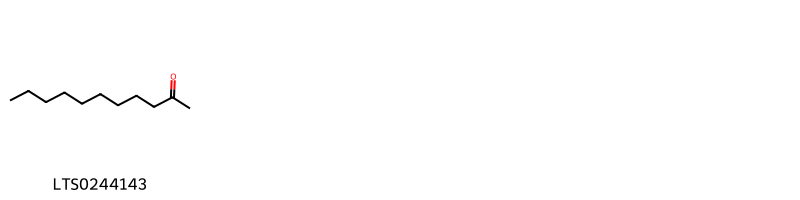
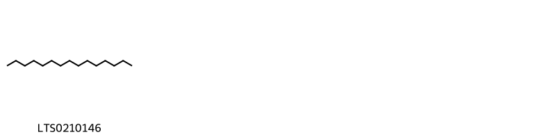

!!! abstract "Tóm tắt"

    Cây địa liền có tên khoa học là Kaempferia galanga L., thuộc họ Gừng (Zingiberaceae). Phân bố bản địa của loài này là từ Tiểu lục địa Ấn Độ đến Nam Trung Quốc. Ở Việt Nam chúng được trồng mọi nơi trên cả nước. Kinh nghiệm sử dụng dân gian ngày dùng 2 đến 4g dưới dạng thuốc sắc, thuốc bột, thuốc viên, hay pha như pha chè mà uống; Địa liền 2g, quế chỉ 1g. Hai vị tán nhỏ chia làm 3 lần uống trong một ngày, mỗi lần 0,5 hay 1g bột. Dùng chữa ăn uống không tiêu, đau dạ dày, đau thần kinh. Thành phần hoá học trong địa liền có tình dầu thành phần chủ yếu là bocneola metyl, metyl p. cumaric axit etyl este, xinamic axit etyl este, pentadecan C,H,,, xinamic andehyt và xincola.

## Thông tin về thực vật

Dược liệu **Địa Liền (Thân Rễ)** từ bộ phận **nan** từ loài *Kaempferia galanga*.

**Mô tả thực vật:** Địa liền là một loại cỏ nhỏ, sống lâu năm, có thân rễ hình củ nhỏ, bám vào nhau, hình trứng. Lá 2 hoặc 3 mọc sát mặt đất, hình trứng, phía cuống hẹp lại thành một cuống dài độ 1-2cm, mặt trên xanh lục và nhấn, mặt dưới có lông.

*Tài liệu tham khảo:* "Những cây thuốc và vị thuốc Việt Nam" - Đỗ Tất Lợi 
Trong dược điển Việt nam, một loài được sử dụng làm dược liệu là *Kaempferia galanga*.

!!! info "Phân loại thực vật của *Kaempferia galanga*"
    - **Kingdom:** Plantae
    - **Phylum:** Tracheophyta
    - **Order:** Zingiberales
    - **Family:** Zingiberaceae
    - **Genus:** Kaempferia
    - **Species:** *Kaempferia galanga*

**Phân bố trên thế giới:** nan, France, Suriname, Solomon Islands, Netherlands, Sri Lanka, Sierra Leone, Mexico, Hong Kong, unknown or invalid, Cambodia, Bangladesh, Panama, Indonesia, Myanmar, India, Brazil, Peru, Viet Nam, Thailand, United States of America, Philippines, China, Malaysia, Norway, Lao People’s Democratic Republic

**Phân bố tại Việt nam:** Dak Nong, Tay Ninh, Kiên Giang, Bà Rịa - Vũng Tàu, Tây Ninh

## Thông tin về dược liệu 

### Định danh

!!! info "Thông tin về tên gọi"

    - Dược liệu tiếng Việt: nan
    - Dược liệu tiếng Trung: nan (nan)
    - Dược liệu tiếng Anh: nan
    - Dược liệu latin thông dụng: nan
    - Dược liệu latin kiểu DĐVN: *rhizoma kaempferiae galangae*
    - Dược liệu latin kiểu DĐVN: *nan*
    - Dược liệu latin kiểu thông tư: *nan*
    - Bộ phận dùng: nan (nan)

### Mô tả dược liệu 

- **Theo dược điển Việt nam V:** nan

- **Mô tả dược liệu theo thông tư chế biến dược liệu theo phương pháp cổ truyền:** nan

### Chế biến 

- **Chế biến theo dược điển việt nam V**: nan

- **Chế biến theo thông tư:** nan

--- 

## Thành phần hóa học

- Theo tài liệu của GS. Đỗ Tất Lợi:  (1)Trong địa liền có tình dầu thành phần chủ yếu là bocneola metyl, metyl p. cumaric axit etyl este, xinamic axit etyl este, pentadecan C,H,,, xinamic andehyt và xincola.
(2)
    

**Thành phần hóa học từ loài **Kaempferia galanga**

Theo cơ sở dữ liệu lotus, loài *Kaempferia galanga* đã phân lập và xác định được **24** hoạt chất thuộc về các nhóm Azepanes, Organonitrogen compounds, Organooxygen compounds, Fatty Acyls, Cinnamic acids and derivatives, Saturated hydrocarbons, Phenol esters, Prenol lipids, Cinnamaldehydes trong bảng dưới đây. Danh sách các hoạt chất như sau 4-methoxycinnamic acid [(LTS0173807)](https://lotus.naturalproducts.net/compound/lotus_id/LTS0173807), undec-10-yn-1-ol [(LTS0115069)](https://lotus.naturalproducts.net/compound/lotus_id/LTS0115069), isopropyl 3-phenylprop-2-enoate [(LTS0062739)](https://lotus.naturalproducts.net/compound/lotus_id/LTS0062739), (11z)-11-tetradecenyl acetate [(LTS0062980)](https://lotus.naturalproducts.net/compound/lotus_id/LTS0062980), 9-hydroxynonan-2-one [(LTS0105724)](https://lotus.naturalproducts.net/compound/lotus_id/LTS0105724), p-methoxy-cinnamic acid [(LTS0159893)](https://lotus.naturalproducts.net/compound/lotus_id/LTS0159893), cinnamal [(LTS0271313)](https://lotus.naturalproducts.net/compound/lotus_id/LTS0271313), (2r,4br)-2-ethenyl-2,4b,8,8-tetramethyl-4,4a,5,6,7,8a,9,10-octahydro-3h-phenanthren-9-ol [(LTS0038685)](https://lotus.naturalproducts.net/compound/lotus_id/LTS0038685), ethyl 3-phenylprop-2-enoate [(LTS0005299)](https://lotus.naturalproducts.net/compound/lotus_id/LTS0005299), pentadecane [(LTS0210146)](https://lotus.naturalproducts.net/compound/lotus_id/LTS0210146), 1-[4-(acetyloxy)phenyl]prop-2-en-1-yl acetate [(LTS0185726)](https://lotus.naturalproducts.net/compound/lotus_id/LTS0185726), ethyl 3-(4-methoxyphenyl)prop-2-enoate [(LTS0044760)](https://lotus.naturalproducts.net/compound/lotus_id/LTS0044760), methyl 3-(4-ethoxyphenyl)prop-2-enoate [(LTS0074406)](https://lotus.naturalproducts.net/compound/lotus_id/LTS0074406), (1r,5s)-1,8,8-trimethyl-3-azabicyclo[3.2.1]octane [(LTS0140173)](https://lotus.naturalproducts.net/compound/lotus_id/LTS0140173), (1s,6r)-4,7,7-trimethylbicyclo[4.1.0]hept-3-en-2-one [(LTS0256656)](https://lotus.naturalproducts.net/compound/lotus_id/LTS0256656), phenylacrylic acid [(LTS0097258)](https://lotus.naturalproducts.net/compound/lotus_id/LTS0097258), cinnamic acid [(LTS0128130)](https://lotus.naturalproducts.net/compound/lotus_id/LTS0128130), undecan-2-one [(LTS0244143)](https://lotus.naturalproducts.net/compound/lotus_id/LTS0244143), ethyl cinnamate [(LTS0031825)](https://lotus.naturalproducts.net/compound/lotus_id/LTS0031825), ethyl p-methoxycinnamate [(LTS0171262)](https://lotus.naturalproducts.net/compound/lotus_id/LTS0171262), methyl (2e)-3-(4-ethoxyphenyl)prop-2-enoate [(LTS0169813)](https://lotus.naturalproducts.net/compound/lotus_id/LTS0169813), 3-{2-[(4ar,8as)-5,5,8a-trimethyl-2-methylidene-hexahydro-1h-naphthalen-1-yl]ethenyl}furan [(LTS0071838)](https://lotus.naturalproducts.net/compound/lotus_id/LTS0071838), dicyclohexylpropanedinitrile [(LTS0052225)](https://lotus.naturalproducts.net/compound/lotus_id/LTS0052225), 4,7,7-trimethylbicyclo[4.1.0]hept-3-en-2-one [(LTS0134334)](https://lotus.naturalproducts.net/compound/lotus_id/LTS0134334). 
        
| chemicalTaxonomyClassyfireClass   |   smiles_count |
|:----------------------------------|---------------:|
| Azepanes                          |             28 |
| Cinnamaldehydes                   |             16 |
| Cinnamic acids and derivatives    |            238 |
| Fatty Acyls                       |             51 |
| Organonitrogen compounds          |             27 |
| Organooxygen compounds            |             15 |
| Phenol esters                     |             30 |
| Prenol lipids                     |             98 |
| Saturated hydrocarbons            |             15 |

            
### Nhóm Azepanes
<figure markdown="span">
    { width=100% }
<figcaption>Hình ảnh cấu trúc hóa học của hoạt chất thuộc nhóm *Azepanes*. Tên thường gọi của các hoạt chất tương ứng là (1r,5s)-1,8,8-trimethyl-3-azabicyclo[3.2.1]octane [(LTS0140173)](https://lotus.naturalproducts.net/compound/lotus_id/LTS0140173).</figcaption>
</figure>

            
            
### Nhóm Azepanes
<figure markdown="span">
    { width=100% }
<figcaption>Hình ảnh cấu trúc hóa học của hoạt chất thuộc nhóm *Azepanes*. Tên thường gọi của các hoạt chất tương ứng là (1r,5s)-1,8,8-trimethyl-3-azabicyclo[3.2.1]octane [(LTS0140173)](https://lotus.naturalproducts.net/compound/lotus_id/LTS0140173).</figcaption>
</figure>

### Nhóm Cinnamaldehydes
<figure markdown="span">
    { width=100% }
<figcaption>Hình ảnh cấu trúc hóa học của hoạt chất thuộc nhóm *Cinnamaldehydes*. Tên thường gọi của các hoạt chất tương ứng là cinnamal [(LTS0271313)](https://lotus.naturalproducts.net/compound/lotus_id/LTS0271313).</figcaption>
</figure>

            
            
### Nhóm Azepanes
<figure markdown="span">
    { width=100% }
<figcaption>Hình ảnh cấu trúc hóa học của hoạt chất thuộc nhóm *Azepanes*. Tên thường gọi của các hoạt chất tương ứng là (1r,5s)-1,8,8-trimethyl-3-azabicyclo[3.2.1]octane [(LTS0140173)](https://lotus.naturalproducts.net/compound/lotus_id/LTS0140173).</figcaption>
</figure>

### Nhóm Cinnamaldehydes
<figure markdown="span">
    { width=100% }
<figcaption>Hình ảnh cấu trúc hóa học của hoạt chất thuộc nhóm *Cinnamaldehydes*. Tên thường gọi của các hoạt chất tương ứng là cinnamal [(LTS0271313)](https://lotus.naturalproducts.net/compound/lotus_id/LTS0271313).</figcaption>
</figure>

### Nhóm Cinnamic acids and derivatives
<figure markdown="span">
    { width=100% }
<figcaption>Hình ảnh cấu trúc hóa học của hoạt chất thuộc nhóm *Cinnamic acids and derivatives*. Tên thường gọi của các hoạt chất tương ứng là 4-methoxycinnamic acid [(LTS0173807)](https://lotus.naturalproducts.net/compound/lotus_id/LTS0173807), ethyl 3-phenylprop-2-enoate [(LTS0005299)](https://lotus.naturalproducts.net/compound/lotus_id/LTS0005299), ethyl cinnamate [(LTS0031825)](https://lotus.naturalproducts.net/compound/lotus_id/LTS0031825), cinnamic acid [(LTS0128130)](https://lotus.naturalproducts.net/compound/lotus_id/LTS0128130), methyl 3-(4-ethoxyphenyl)prop-2-enoate [(LTS0074406)](https://lotus.naturalproducts.net/compound/lotus_id/LTS0074406), ethyl p-methoxycinnamate [(LTS0171262)](https://lotus.naturalproducts.net/compound/lotus_id/LTS0171262), methyl (2e)-3-(4-ethoxyphenyl)prop-2-enoate [(LTS0169813)](https://lotus.naturalproducts.net/compound/lotus_id/LTS0169813), phenylacrylic acid [(LTS0097258)](https://lotus.naturalproducts.net/compound/lotus_id/LTS0097258), p-methoxy-cinnamic acid [(LTS0159893)](https://lotus.naturalproducts.net/compound/lotus_id/LTS0159893), ethyl 3-(4-methoxyphenyl)prop-2-enoate [(LTS0044760)](https://lotus.naturalproducts.net/compound/lotus_id/LTS0044760), isopropyl 3-phenylprop-2-enoate [(LTS0062739)](https://lotus.naturalproducts.net/compound/lotus_id/LTS0062739).</figcaption>
</figure>

            
            
### Nhóm Azepanes
<figure markdown="span">
    { width=100% }
<figcaption>Hình ảnh cấu trúc hóa học của hoạt chất thuộc nhóm *Azepanes*. Tên thường gọi của các hoạt chất tương ứng là (1r,5s)-1,8,8-trimethyl-3-azabicyclo[3.2.1]octane [(LTS0140173)](https://lotus.naturalproducts.net/compound/lotus_id/LTS0140173).</figcaption>
</figure>

### Nhóm Cinnamaldehydes
<figure markdown="span">
    { width=100% }
<figcaption>Hình ảnh cấu trúc hóa học của hoạt chất thuộc nhóm *Cinnamaldehydes*. Tên thường gọi của các hoạt chất tương ứng là cinnamal [(LTS0271313)](https://lotus.naturalproducts.net/compound/lotus_id/LTS0271313).</figcaption>
</figure>

### Nhóm Cinnamic acids and derivatives
<figure markdown="span">
    { width=100% }
<figcaption>Hình ảnh cấu trúc hóa học của hoạt chất thuộc nhóm *Cinnamic acids and derivatives*. Tên thường gọi của các hoạt chất tương ứng là 4-methoxycinnamic acid [(LTS0173807)](https://lotus.naturalproducts.net/compound/lotus_id/LTS0173807), ethyl 3-phenylprop-2-enoate [(LTS0005299)](https://lotus.naturalproducts.net/compound/lotus_id/LTS0005299), ethyl cinnamate [(LTS0031825)](https://lotus.naturalproducts.net/compound/lotus_id/LTS0031825), cinnamic acid [(LTS0128130)](https://lotus.naturalproducts.net/compound/lotus_id/LTS0128130), methyl 3-(4-ethoxyphenyl)prop-2-enoate [(LTS0074406)](https://lotus.naturalproducts.net/compound/lotus_id/LTS0074406), ethyl p-methoxycinnamate [(LTS0171262)](https://lotus.naturalproducts.net/compound/lotus_id/LTS0171262), methyl (2e)-3-(4-ethoxyphenyl)prop-2-enoate [(LTS0169813)](https://lotus.naturalproducts.net/compound/lotus_id/LTS0169813), phenylacrylic acid [(LTS0097258)](https://lotus.naturalproducts.net/compound/lotus_id/LTS0097258), p-methoxy-cinnamic acid [(LTS0159893)](https://lotus.naturalproducts.net/compound/lotus_id/LTS0159893), ethyl 3-(4-methoxyphenyl)prop-2-enoate [(LTS0044760)](https://lotus.naturalproducts.net/compound/lotus_id/LTS0044760), isopropyl 3-phenylprop-2-enoate [(LTS0062739)](https://lotus.naturalproducts.net/compound/lotus_id/LTS0062739).</figcaption>
</figure>

### Nhóm Fatty Acyls
<figure markdown="span">
    { width=100% }
<figcaption>Hình ảnh cấu trúc hóa học của hoạt chất thuộc nhóm *Fatty Acyls*. Tên thường gọi của các hoạt chất tương ứng là 9-hydroxynonan-2-one [(LTS0105724)](https://lotus.naturalproducts.net/compound/lotus_id/LTS0105724), undec-10-yn-1-ol [(LTS0115069)](https://lotus.naturalproducts.net/compound/lotus_id/LTS0115069), (11z)-11-tetradecenyl acetate [(LTS0062980)](https://lotus.naturalproducts.net/compound/lotus_id/LTS0062980).</figcaption>
</figure>

            
            
### Nhóm Azepanes
<figure markdown="span">
    { width=100% }
<figcaption>Hình ảnh cấu trúc hóa học của hoạt chất thuộc nhóm *Azepanes*. Tên thường gọi của các hoạt chất tương ứng là (1r,5s)-1,8,8-trimethyl-3-azabicyclo[3.2.1]octane [(LTS0140173)](https://lotus.naturalproducts.net/compound/lotus_id/LTS0140173).</figcaption>
</figure>

### Nhóm Cinnamaldehydes
<figure markdown="span">
    { width=100% }
<figcaption>Hình ảnh cấu trúc hóa học của hoạt chất thuộc nhóm *Cinnamaldehydes*. Tên thường gọi của các hoạt chất tương ứng là cinnamal [(LTS0271313)](https://lotus.naturalproducts.net/compound/lotus_id/LTS0271313).</figcaption>
</figure>

### Nhóm Cinnamic acids and derivatives
<figure markdown="span">
    { width=100% }
<figcaption>Hình ảnh cấu trúc hóa học của hoạt chất thuộc nhóm *Cinnamic acids and derivatives*. Tên thường gọi của các hoạt chất tương ứng là 4-methoxycinnamic acid [(LTS0173807)](https://lotus.naturalproducts.net/compound/lotus_id/LTS0173807), ethyl 3-phenylprop-2-enoate [(LTS0005299)](https://lotus.naturalproducts.net/compound/lotus_id/LTS0005299), ethyl cinnamate [(LTS0031825)](https://lotus.naturalproducts.net/compound/lotus_id/LTS0031825), cinnamic acid [(LTS0128130)](https://lotus.naturalproducts.net/compound/lotus_id/LTS0128130), methyl 3-(4-ethoxyphenyl)prop-2-enoate [(LTS0074406)](https://lotus.naturalproducts.net/compound/lotus_id/LTS0074406), ethyl p-methoxycinnamate [(LTS0171262)](https://lotus.naturalproducts.net/compound/lotus_id/LTS0171262), methyl (2e)-3-(4-ethoxyphenyl)prop-2-enoate [(LTS0169813)](https://lotus.naturalproducts.net/compound/lotus_id/LTS0169813), phenylacrylic acid [(LTS0097258)](https://lotus.naturalproducts.net/compound/lotus_id/LTS0097258), p-methoxy-cinnamic acid [(LTS0159893)](https://lotus.naturalproducts.net/compound/lotus_id/LTS0159893), ethyl 3-(4-methoxyphenyl)prop-2-enoate [(LTS0044760)](https://lotus.naturalproducts.net/compound/lotus_id/LTS0044760), isopropyl 3-phenylprop-2-enoate [(LTS0062739)](https://lotus.naturalproducts.net/compound/lotus_id/LTS0062739).</figcaption>
</figure>

### Nhóm Fatty Acyls
<figure markdown="span">
    { width=100% }
<figcaption>Hình ảnh cấu trúc hóa học của hoạt chất thuộc nhóm *Fatty Acyls*. Tên thường gọi của các hoạt chất tương ứng là 9-hydroxynonan-2-one [(LTS0105724)](https://lotus.naturalproducts.net/compound/lotus_id/LTS0105724), undec-10-yn-1-ol [(LTS0115069)](https://lotus.naturalproducts.net/compound/lotus_id/LTS0115069), (11z)-11-tetradecenyl acetate [(LTS0062980)](https://lotus.naturalproducts.net/compound/lotus_id/LTS0062980).</figcaption>
</figure>

### Nhóm Organonitrogen compounds
<figure markdown="span">
    { width=100% }
<figcaption>Hình ảnh cấu trúc hóa học của hoạt chất thuộc nhóm *Organonitrogen compounds*. Tên thường gọi của các hoạt chất tương ứng là dicyclohexylpropanedinitrile [(LTS0052225)](https://lotus.naturalproducts.net/compound/lotus_id/LTS0052225).</figcaption>
</figure>

            
            
### Nhóm Azepanes
<figure markdown="span">
    { width=100% }
<figcaption>Hình ảnh cấu trúc hóa học của hoạt chất thuộc nhóm *Azepanes*. Tên thường gọi của các hoạt chất tương ứng là (1r,5s)-1,8,8-trimethyl-3-azabicyclo[3.2.1]octane [(LTS0140173)](https://lotus.naturalproducts.net/compound/lotus_id/LTS0140173).</figcaption>
</figure>

### Nhóm Cinnamaldehydes
<figure markdown="span">
    { width=100% }
<figcaption>Hình ảnh cấu trúc hóa học của hoạt chất thuộc nhóm *Cinnamaldehydes*. Tên thường gọi của các hoạt chất tương ứng là cinnamal [(LTS0271313)](https://lotus.naturalproducts.net/compound/lotus_id/LTS0271313).</figcaption>
</figure>

### Nhóm Cinnamic acids and derivatives
<figure markdown="span">
    { width=100% }
<figcaption>Hình ảnh cấu trúc hóa học của hoạt chất thuộc nhóm *Cinnamic acids and derivatives*. Tên thường gọi của các hoạt chất tương ứng là 4-methoxycinnamic acid [(LTS0173807)](https://lotus.naturalproducts.net/compound/lotus_id/LTS0173807), ethyl 3-phenylprop-2-enoate [(LTS0005299)](https://lotus.naturalproducts.net/compound/lotus_id/LTS0005299), ethyl cinnamate [(LTS0031825)](https://lotus.naturalproducts.net/compound/lotus_id/LTS0031825), cinnamic acid [(LTS0128130)](https://lotus.naturalproducts.net/compound/lotus_id/LTS0128130), methyl 3-(4-ethoxyphenyl)prop-2-enoate [(LTS0074406)](https://lotus.naturalproducts.net/compound/lotus_id/LTS0074406), ethyl p-methoxycinnamate [(LTS0171262)](https://lotus.naturalproducts.net/compound/lotus_id/LTS0171262), methyl (2e)-3-(4-ethoxyphenyl)prop-2-enoate [(LTS0169813)](https://lotus.naturalproducts.net/compound/lotus_id/LTS0169813), phenylacrylic acid [(LTS0097258)](https://lotus.naturalproducts.net/compound/lotus_id/LTS0097258), p-methoxy-cinnamic acid [(LTS0159893)](https://lotus.naturalproducts.net/compound/lotus_id/LTS0159893), ethyl 3-(4-methoxyphenyl)prop-2-enoate [(LTS0044760)](https://lotus.naturalproducts.net/compound/lotus_id/LTS0044760), isopropyl 3-phenylprop-2-enoate [(LTS0062739)](https://lotus.naturalproducts.net/compound/lotus_id/LTS0062739).</figcaption>
</figure>

### Nhóm Fatty Acyls
<figure markdown="span">
    { width=100% }
<figcaption>Hình ảnh cấu trúc hóa học của hoạt chất thuộc nhóm *Fatty Acyls*. Tên thường gọi của các hoạt chất tương ứng là 9-hydroxynonan-2-one [(LTS0105724)](https://lotus.naturalproducts.net/compound/lotus_id/LTS0105724), undec-10-yn-1-ol [(LTS0115069)](https://lotus.naturalproducts.net/compound/lotus_id/LTS0115069), (11z)-11-tetradecenyl acetate [(LTS0062980)](https://lotus.naturalproducts.net/compound/lotus_id/LTS0062980).</figcaption>
</figure>

### Nhóm Organonitrogen compounds
<figure markdown="span">
    { width=100% }
<figcaption>Hình ảnh cấu trúc hóa học của hoạt chất thuộc nhóm *Organonitrogen compounds*. Tên thường gọi của các hoạt chất tương ứng là dicyclohexylpropanedinitrile [(LTS0052225)](https://lotus.naturalproducts.net/compound/lotus_id/LTS0052225).</figcaption>
</figure>

### Nhóm Organooxygen compounds
<figure markdown="span">
    { width=100% }
<figcaption>Hình ảnh cấu trúc hóa học của hoạt chất thuộc nhóm *Organooxygen compounds*. Tên thường gọi của các hoạt chất tương ứng là undecan-2-one [(LTS0244143)](https://lotus.naturalproducts.net/compound/lotus_id/LTS0244143).</figcaption>
</figure>

            
            
### Nhóm Azepanes
<figure markdown="span">
    { width=100% }
<figcaption>Hình ảnh cấu trúc hóa học của hoạt chất thuộc nhóm *Azepanes*. Tên thường gọi của các hoạt chất tương ứng là (1r,5s)-1,8,8-trimethyl-3-azabicyclo[3.2.1]octane [(LTS0140173)](https://lotus.naturalproducts.net/compound/lotus_id/LTS0140173).</figcaption>
</figure>

### Nhóm Cinnamaldehydes
<figure markdown="span">
    { width=100% }
<figcaption>Hình ảnh cấu trúc hóa học của hoạt chất thuộc nhóm *Cinnamaldehydes*. Tên thường gọi của các hoạt chất tương ứng là cinnamal [(LTS0271313)](https://lotus.naturalproducts.net/compound/lotus_id/LTS0271313).</figcaption>
</figure>

### Nhóm Cinnamic acids and derivatives
<figure markdown="span">
    { width=100% }
<figcaption>Hình ảnh cấu trúc hóa học của hoạt chất thuộc nhóm *Cinnamic acids and derivatives*. Tên thường gọi của các hoạt chất tương ứng là 4-methoxycinnamic acid [(LTS0173807)](https://lotus.naturalproducts.net/compound/lotus_id/LTS0173807), ethyl 3-phenylprop-2-enoate [(LTS0005299)](https://lotus.naturalproducts.net/compound/lotus_id/LTS0005299), ethyl cinnamate [(LTS0031825)](https://lotus.naturalproducts.net/compound/lotus_id/LTS0031825), cinnamic acid [(LTS0128130)](https://lotus.naturalproducts.net/compound/lotus_id/LTS0128130), methyl 3-(4-ethoxyphenyl)prop-2-enoate [(LTS0074406)](https://lotus.naturalproducts.net/compound/lotus_id/LTS0074406), ethyl p-methoxycinnamate [(LTS0171262)](https://lotus.naturalproducts.net/compound/lotus_id/LTS0171262), methyl (2e)-3-(4-ethoxyphenyl)prop-2-enoate [(LTS0169813)](https://lotus.naturalproducts.net/compound/lotus_id/LTS0169813), phenylacrylic acid [(LTS0097258)](https://lotus.naturalproducts.net/compound/lotus_id/LTS0097258), p-methoxy-cinnamic acid [(LTS0159893)](https://lotus.naturalproducts.net/compound/lotus_id/LTS0159893), ethyl 3-(4-methoxyphenyl)prop-2-enoate [(LTS0044760)](https://lotus.naturalproducts.net/compound/lotus_id/LTS0044760), isopropyl 3-phenylprop-2-enoate [(LTS0062739)](https://lotus.naturalproducts.net/compound/lotus_id/LTS0062739).</figcaption>
</figure>

### Nhóm Fatty Acyls
<figure markdown="span">
    { width=100% }
<figcaption>Hình ảnh cấu trúc hóa học của hoạt chất thuộc nhóm *Fatty Acyls*. Tên thường gọi của các hoạt chất tương ứng là 9-hydroxynonan-2-one [(LTS0105724)](https://lotus.naturalproducts.net/compound/lotus_id/LTS0105724), undec-10-yn-1-ol [(LTS0115069)](https://lotus.naturalproducts.net/compound/lotus_id/LTS0115069), (11z)-11-tetradecenyl acetate [(LTS0062980)](https://lotus.naturalproducts.net/compound/lotus_id/LTS0062980).</figcaption>
</figure>

### Nhóm Organonitrogen compounds
<figure markdown="span">
    { width=100% }
<figcaption>Hình ảnh cấu trúc hóa học của hoạt chất thuộc nhóm *Organonitrogen compounds*. Tên thường gọi của các hoạt chất tương ứng là dicyclohexylpropanedinitrile [(LTS0052225)](https://lotus.naturalproducts.net/compound/lotus_id/LTS0052225).</figcaption>
</figure>

### Nhóm Organooxygen compounds
<figure markdown="span">
    { width=100% }
<figcaption>Hình ảnh cấu trúc hóa học của hoạt chất thuộc nhóm *Organooxygen compounds*. Tên thường gọi của các hoạt chất tương ứng là undecan-2-one [(LTS0244143)](https://lotus.naturalproducts.net/compound/lotus_id/LTS0244143).</figcaption>
</figure>

### Nhóm Phenol esters
<figure markdown="span">
    { width=100% }
<figcaption>Hình ảnh cấu trúc hóa học của hoạt chất thuộc nhóm *Phenol esters*. Tên thường gọi của các hoạt chất tương ứng là 1-[4-(acetyloxy)phenyl]prop-2-en-1-yl acetate [(LTS0185726)](https://lotus.naturalproducts.net/compound/lotus_id/LTS0185726).</figcaption>
</figure>

            
            
### Nhóm Azepanes
<figure markdown="span">
    { width=100% }
<figcaption>Hình ảnh cấu trúc hóa học của hoạt chất thuộc nhóm *Azepanes*. Tên thường gọi của các hoạt chất tương ứng là (1r,5s)-1,8,8-trimethyl-3-azabicyclo[3.2.1]octane [(LTS0140173)](https://lotus.naturalproducts.net/compound/lotus_id/LTS0140173).</figcaption>
</figure>

### Nhóm Cinnamaldehydes
<figure markdown="span">
    { width=100% }
<figcaption>Hình ảnh cấu trúc hóa học của hoạt chất thuộc nhóm *Cinnamaldehydes*. Tên thường gọi của các hoạt chất tương ứng là cinnamal [(LTS0271313)](https://lotus.naturalproducts.net/compound/lotus_id/LTS0271313).</figcaption>
</figure>

### Nhóm Cinnamic acids and derivatives
<figure markdown="span">
    { width=100% }
<figcaption>Hình ảnh cấu trúc hóa học của hoạt chất thuộc nhóm *Cinnamic acids and derivatives*. Tên thường gọi của các hoạt chất tương ứng là 4-methoxycinnamic acid [(LTS0173807)](https://lotus.naturalproducts.net/compound/lotus_id/LTS0173807), ethyl 3-phenylprop-2-enoate [(LTS0005299)](https://lotus.naturalproducts.net/compound/lotus_id/LTS0005299), ethyl cinnamate [(LTS0031825)](https://lotus.naturalproducts.net/compound/lotus_id/LTS0031825), cinnamic acid [(LTS0128130)](https://lotus.naturalproducts.net/compound/lotus_id/LTS0128130), methyl 3-(4-ethoxyphenyl)prop-2-enoate [(LTS0074406)](https://lotus.naturalproducts.net/compound/lotus_id/LTS0074406), ethyl p-methoxycinnamate [(LTS0171262)](https://lotus.naturalproducts.net/compound/lotus_id/LTS0171262), methyl (2e)-3-(4-ethoxyphenyl)prop-2-enoate [(LTS0169813)](https://lotus.naturalproducts.net/compound/lotus_id/LTS0169813), phenylacrylic acid [(LTS0097258)](https://lotus.naturalproducts.net/compound/lotus_id/LTS0097258), p-methoxy-cinnamic acid [(LTS0159893)](https://lotus.naturalproducts.net/compound/lotus_id/LTS0159893), ethyl 3-(4-methoxyphenyl)prop-2-enoate [(LTS0044760)](https://lotus.naturalproducts.net/compound/lotus_id/LTS0044760), isopropyl 3-phenylprop-2-enoate [(LTS0062739)](https://lotus.naturalproducts.net/compound/lotus_id/LTS0062739).</figcaption>
</figure>

### Nhóm Fatty Acyls
<figure markdown="span">
    { width=100% }
<figcaption>Hình ảnh cấu trúc hóa học của hoạt chất thuộc nhóm *Fatty Acyls*. Tên thường gọi của các hoạt chất tương ứng là 9-hydroxynonan-2-one [(LTS0105724)](https://lotus.naturalproducts.net/compound/lotus_id/LTS0105724), undec-10-yn-1-ol [(LTS0115069)](https://lotus.naturalproducts.net/compound/lotus_id/LTS0115069), (11z)-11-tetradecenyl acetate [(LTS0062980)](https://lotus.naturalproducts.net/compound/lotus_id/LTS0062980).</figcaption>
</figure>

### Nhóm Organonitrogen compounds
<figure markdown="span">
    { width=100% }
<figcaption>Hình ảnh cấu trúc hóa học của hoạt chất thuộc nhóm *Organonitrogen compounds*. Tên thường gọi của các hoạt chất tương ứng là dicyclohexylpropanedinitrile [(LTS0052225)](https://lotus.naturalproducts.net/compound/lotus_id/LTS0052225).</figcaption>
</figure>

### Nhóm Organooxygen compounds
<figure markdown="span">
    { width=100% }
<figcaption>Hình ảnh cấu trúc hóa học của hoạt chất thuộc nhóm *Organooxygen compounds*. Tên thường gọi của các hoạt chất tương ứng là undecan-2-one [(LTS0244143)](https://lotus.naturalproducts.net/compound/lotus_id/LTS0244143).</figcaption>
</figure>

### Nhóm Phenol esters
<figure markdown="span">
    { width=100% }
<figcaption>Hình ảnh cấu trúc hóa học của hoạt chất thuộc nhóm *Phenol esters*. Tên thường gọi của các hoạt chất tương ứng là 1-[4-(acetyloxy)phenyl]prop-2-en-1-yl acetate [(LTS0185726)](https://lotus.naturalproducts.net/compound/lotus_id/LTS0185726).</figcaption>
</figure>

### Nhóm Prenol lipids
<figure markdown="span">
    { width=100% }
<figcaption>Hình ảnh cấu trúc hóa học của hoạt chất thuộc nhóm *Prenol lipids*. Tên thường gọi của các hoạt chất tương ứng là 3-{2-[(4ar,8as)-5,5,8a-trimethyl-2-methylidene-hexahydro-1h-naphthalen-1-yl]ethenyl}furan [(LTS0071838)](https://lotus.naturalproducts.net/compound/lotus_id/LTS0071838), 4,7,7-trimethylbicyclo[4.1.0]hept-3-en-2-one [(LTS0134334)](https://lotus.naturalproducts.net/compound/lotus_id/LTS0134334), (1s,6r)-4,7,7-trimethylbicyclo[4.1.0]hept-3-en-2-one [(LTS0256656)](https://lotus.naturalproducts.net/compound/lotus_id/LTS0256656).</figcaption>
</figure>

            
            
### Nhóm Azepanes
<figure markdown="span">
    { width=100% }
<figcaption>Hình ảnh cấu trúc hóa học của hoạt chất thuộc nhóm *Azepanes*. Tên thường gọi của các hoạt chất tương ứng là (1r,5s)-1,8,8-trimethyl-3-azabicyclo[3.2.1]octane [(LTS0140173)](https://lotus.naturalproducts.net/compound/lotus_id/LTS0140173).</figcaption>
</figure>

### Nhóm Cinnamaldehydes
<figure markdown="span">
    { width=100% }
<figcaption>Hình ảnh cấu trúc hóa học của hoạt chất thuộc nhóm *Cinnamaldehydes*. Tên thường gọi của các hoạt chất tương ứng là cinnamal [(LTS0271313)](https://lotus.naturalproducts.net/compound/lotus_id/LTS0271313).</figcaption>
</figure>

### Nhóm Cinnamic acids and derivatives
<figure markdown="span">
    { width=100% }
<figcaption>Hình ảnh cấu trúc hóa học của hoạt chất thuộc nhóm *Cinnamic acids and derivatives*. Tên thường gọi của các hoạt chất tương ứng là 4-methoxycinnamic acid [(LTS0173807)](https://lotus.naturalproducts.net/compound/lotus_id/LTS0173807), ethyl 3-phenylprop-2-enoate [(LTS0005299)](https://lotus.naturalproducts.net/compound/lotus_id/LTS0005299), ethyl cinnamate [(LTS0031825)](https://lotus.naturalproducts.net/compound/lotus_id/LTS0031825), cinnamic acid [(LTS0128130)](https://lotus.naturalproducts.net/compound/lotus_id/LTS0128130), methyl 3-(4-ethoxyphenyl)prop-2-enoate [(LTS0074406)](https://lotus.naturalproducts.net/compound/lotus_id/LTS0074406), ethyl p-methoxycinnamate [(LTS0171262)](https://lotus.naturalproducts.net/compound/lotus_id/LTS0171262), methyl (2e)-3-(4-ethoxyphenyl)prop-2-enoate [(LTS0169813)](https://lotus.naturalproducts.net/compound/lotus_id/LTS0169813), phenylacrylic acid [(LTS0097258)](https://lotus.naturalproducts.net/compound/lotus_id/LTS0097258), p-methoxy-cinnamic acid [(LTS0159893)](https://lotus.naturalproducts.net/compound/lotus_id/LTS0159893), ethyl 3-(4-methoxyphenyl)prop-2-enoate [(LTS0044760)](https://lotus.naturalproducts.net/compound/lotus_id/LTS0044760), isopropyl 3-phenylprop-2-enoate [(LTS0062739)](https://lotus.naturalproducts.net/compound/lotus_id/LTS0062739).</figcaption>
</figure>

### Nhóm Fatty Acyls
<figure markdown="span">
    { width=100% }
<figcaption>Hình ảnh cấu trúc hóa học của hoạt chất thuộc nhóm *Fatty Acyls*. Tên thường gọi của các hoạt chất tương ứng là 9-hydroxynonan-2-one [(LTS0105724)](https://lotus.naturalproducts.net/compound/lotus_id/LTS0105724), undec-10-yn-1-ol [(LTS0115069)](https://lotus.naturalproducts.net/compound/lotus_id/LTS0115069), (11z)-11-tetradecenyl acetate [(LTS0062980)](https://lotus.naturalproducts.net/compound/lotus_id/LTS0062980).</figcaption>
</figure>

### Nhóm Organonitrogen compounds
<figure markdown="span">
    { width=100% }
<figcaption>Hình ảnh cấu trúc hóa học của hoạt chất thuộc nhóm *Organonitrogen compounds*. Tên thường gọi của các hoạt chất tương ứng là dicyclohexylpropanedinitrile [(LTS0052225)](https://lotus.naturalproducts.net/compound/lotus_id/LTS0052225).</figcaption>
</figure>

### Nhóm Organooxygen compounds
<figure markdown="span">
    { width=100% }
<figcaption>Hình ảnh cấu trúc hóa học của hoạt chất thuộc nhóm *Organooxygen compounds*. Tên thường gọi của các hoạt chất tương ứng là undecan-2-one [(LTS0244143)](https://lotus.naturalproducts.net/compound/lotus_id/LTS0244143).</figcaption>
</figure>

### Nhóm Phenol esters
<figure markdown="span">
    { width=100% }
<figcaption>Hình ảnh cấu trúc hóa học của hoạt chất thuộc nhóm *Phenol esters*. Tên thường gọi của các hoạt chất tương ứng là 1-[4-(acetyloxy)phenyl]prop-2-en-1-yl acetate [(LTS0185726)](https://lotus.naturalproducts.net/compound/lotus_id/LTS0185726).</figcaption>
</figure>

### Nhóm Prenol lipids
<figure markdown="span">
    { width=100% }
<figcaption>Hình ảnh cấu trúc hóa học của hoạt chất thuộc nhóm *Prenol lipids*. Tên thường gọi của các hoạt chất tương ứng là 3-{2-[(4ar,8as)-5,5,8a-trimethyl-2-methylidene-hexahydro-1h-naphthalen-1-yl]ethenyl}furan [(LTS0071838)](https://lotus.naturalproducts.net/compound/lotus_id/LTS0071838), 4,7,7-trimethylbicyclo[4.1.0]hept-3-en-2-one [(LTS0134334)](https://lotus.naturalproducts.net/compound/lotus_id/LTS0134334), (1s,6r)-4,7,7-trimethylbicyclo[4.1.0]hept-3-en-2-one [(LTS0256656)](https://lotus.naturalproducts.net/compound/lotus_id/LTS0256656).</figcaption>
</figure>

### Nhóm Saturated hydrocarbons
<figure markdown="span">
    { width=100% }
<figcaption>Hình ảnh cấu trúc hóa học của hoạt chất thuộc nhóm *Saturated hydrocarbons*. Tên thường gọi của các hoạt chất tương ứng là pentadecane [(LTS0210146)](https://lotus.naturalproducts.net/compound/lotus_id/LTS0210146).</figcaption>
</figure>

            

---

## Tác dụng dược lý

Theo tài liệu "Những cây thuốc và vị thuốc Việt Nam" - Đỗ Tất Lợi:-Gây tê
-Cải thiện hoạt động của đường tiêu hóa.

Theo tài liệu quốc tế: nan

---

## Dược điển Việt Nam V

### Soi bột:

nan

<!-- Hình ảnh soi bột sẽ được tự động chèn vào đây sau -->

### Vi phẫu:

nan

<!-- Hình ảnh vi phẫu sẽ được tự động chèn vào đây sau -->

### Định tính

nan

### Định lượng

nan

### Thông tin khác 

- ** Độ ẩm: ** nan
- ** Bảo quản:** nan

## Dược điển Hồng kong

<!-- PDF sẽ được tự động chèn vào đây sau -->

---

## Y dược học cổ truyền

- **Tên vị thuốc:** nan
- **Tính vị quy kinh:** Tân, ôn. Vào hai kinh tỳ, vị.
- **Công năng chủ trị:** Hành khí, ôn trung, tiêu thực, chỉ thống.
Chủ trị: Tê thấp, đau nhức xương khớp, nhức đầu, răng đau, ngực bụng lạnh đau, tiêu hóa kém.
- **Chú ý:** nan
- **Kiêng kỵ:** nan

## Bình luận

