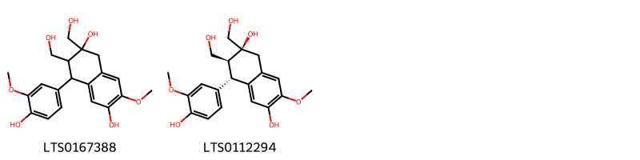
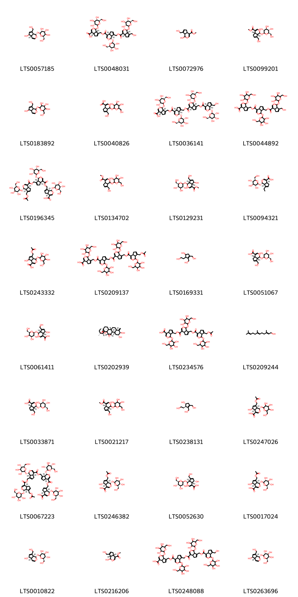

!!! abstract "Tóm tắt"

    Vỏ thân cây đỗ trọng có tên khoa học Cortex Eucommiae, thuộc loài đỗ trọng Eucommia ulmoides Oliv, họ đỗ trọng - Eucommiaceae. Đỗ trọng có nguồn gốc ở Trung Quốc, phân bố thêm tại Hàn Quốc, Mỹ, và một số nước khác. Tại Việt Nam, cây được nhập về trồng thử nghiệm từ năm 1958, phù hợp với khí hậu lạnh, nhưng chưa phát triển rộng rãi. Theo y học cổ truyền, vỏ đỗ trọng có tác dụng bổ can thận, mạnh gân cốt, an thai, hạ huyết áp. Dược liệu thường được dùng trong nhân dân để điều trị các bệnh như đau lưng, nhức mỏi xương khớp, liệt dương, di tinh, động thai, chóng mặt và tăng huyết áp. Về tác dụng dược lý, vỏ cây đỗ trọng có khả năng điều hòa miễn dịch, chống oxy hóa, chống viêm, bảo vệ gan và hệ thần kinh. Thành phần hóa học chính gồm cycloether, phenol, flavonoid, lignan, polysaccharide, sterol và nhựa thực vật.

## Thông tin về thực vật

Dược liệu **Đỗ Trọng (Vỏ Thân)** từ bộ phận **Vỏ** từ loài *Eucommia ulmoides*.

**Mô tả thực vật:** Đỗ Trọng là một cây có thể to hoặc nhỏ, cao tới 10m, 20m, luôn luôn xanh tươi. Liên Xô cũ đã biến cây này thành cây nhỏ cao 3-3,5m để tiện cho việc thu hoạch; lá mọc so le, hình trứng rộng, đầu lá nhọn, gốc lá tròn, mép lá có răng cưa, khi đứt lá làm 2-3 mảnh sẽ thấy những sợi nhựa trắng như tơ giữa các mảnh lá đó liền nhau, phiến lá rộng 3,5-6,5cm, dài 6-13cm. Cuống lá ngắn 1-1,5cm. Hoa đơn tính. Hoa đực, hoa cái khác gốc; không có bao hoa. Quả hình thoi dài 3cm, rộng 1cm dẹt, đầu quả xẻ làm 2 thành hình chữ V.

*Tài liệu tham khảo:* "Những cây thuốc và vị thuốc Việt Nam" - Đỗ Tất Lợi 
Trong dược điển Việt nam, một loài được sử dụng làm dược liệu là *Eucommia ulmoides*.

!!! info "Phân loại thực vật của *Eucommia ulmoides*"
    - **Kingdom:** Plantae
    - **Phylum:** Tracheophyta
    - **Order:** Garryales
    - **Family:** Eucommiaceae
    - **Genus:** Eucommia
    - **Species:** *Eucommia ulmoides*

**Phân bố trên thế giới:** Germany, United States of America, Poland, Russian Federation, China, Japan, Korea, Republic of, Ukraine, Belgium

**Phân bố tại Việt nam:** Không có ghi nhận ở Việt Nam

## Thông tin về dược liệu 

### Định danh

!!! info "Thông tin về tên gọi"

    - Dược liệu tiếng Việt: đỗ trọng
    - Dược liệu tiếng Trung: 杜仲 (Du Zhong)
    - Dược liệu tiếng Anh: Eucommia Ulmoides
    - Dược liệu latin thông dụng: Cortex EucommiaenCortex Eucommiae
    - Dược liệu latin kiểu DĐVN: *cortex eucommiae*
    - Dược liệu latin kiểu DĐVN: *Cortex Eucommiae*
    - Dược liệu latin kiểu thông tư: *Cortex Eucommiae*
    - Bộ phận dùng: Vỏ (Cortex)

### Mô tả dược liệu 

- **Theo dược điển Việt nam V:** 
Dược liệu là những miếng vỏ phẳng hoặc hai bên mép hơi cong vào, to nhỏ không đều, dày 0,2 cm đến 0,7 cm, màu xám tro. Mặt ngoài sần sùi, có nhiều nếp nhăn dọc và vết tích của cành con. Mặt trong vỏ màu sẫm, trơn, chất giòn, dễ bẻ gãy, mặt bẻ có nhiều sợi màu trắng ánh bạc, có tính đàn hồi như cao su. Vị hơi đắng.

- **Mô tả dược liệu theo thông tư chế biến dược liệu theo phương pháp cổ truyền:** 

### Chế biến 

- **Chế biến theo dược điển việt nam V**: 
Thu hoạch từ tháng 4 đến tháng 6, bóc lấy vỏ, cạo bỏ vỏ thô xếp đống cho đến khi mặt trong của vỏ có màu nâu tía đen thì phơi khô. Bào chế Đỗ trọng thái miếng: Cạo vỏ thô còn sót lại, rửa sạch, thái miếng hoặc sợi còn tơ, phơi khô, dùng sống hoặc chế. Diêm đỗ trọng (Chế muối): Lấy Đồ trọng thái miếng, tẩm nước muối trong 2 h (1 kg Đỗ trọng dùng 30 g muối trong 200 ml nước), sao vàng, đứt tơ là được; hoặc sao đen khi mặt ngoài màu đen sẫm, khi bẻ gãy thấy tính đàn hôi tơ kém so với khi chưa sao. Vị hơi mặn.

- **Chế biến theo thông tư:** 

--- 

## Thành phần hóa học

- Theo tài liệu của GS. Đỗ Tất Lợi:  Cycloether, phenol, flavonoid, lignan, polysaccharide, sterol và nhựa thực vật
    

**Thành phần hóa học từ loài **Eucommia ulmoides**

Theo cơ sở dữ liệu lotus, loài *Eucommia ulmoides* đã phân lập và xác định được **141** hoạt chất thuộc về các nhóm Furopyrans, Organooxygen compounds, Lignan glycosides, Flavonoids, Cinnamic acids and derivatives, Aryltetralin lignans, Furanoid lignans, Lactones, Indoles and derivatives, Benzofurans, Phenols, 2-arylbenzofuran flavonoids, Dihydrofurans, Benzene and substituted derivatives, Linear 1,3-diarylpropanoids, Prenol lipids trong bảng dưới đây. Danh sách các hoạt chất như sau (1s,4as,7as)-7-(hydroxymethyl)-1-{[(2r,3s,4s,5s,6r)-3,4,5-trihydroxy-6-(hydroxymethyl)oxan-2-yl]oxy}-1h,4ah,5h,7ah-cyclopenta[c]pyran-4-carboxylic acid [(LTS0033871)](https://lotus.naturalproducts.net/compound/lotus_id/LTS0033871), 3-(4-{[1,3-dihydroxy-1-(4-hydroxy-3-methoxyphenyl)propan-2-yl]oxy}-3-methoxyphenyl)prop-2-enal [(LTS0160965)](https://lotus.naturalproducts.net/compound/lotus_id/LTS0160965), kaempherol [(LTS0155822)](https://lotus.naturalproducts.net/compound/lotus_id/LTS0155822), 5-(4-hydroxy-3-methoxyphenyl)-3-[(4-hydroxy-3-methoxyphenyl)methyl]-4-(hydroxymethyl)oxolan-3-ol [(LTS0230969)](https://lotus.naturalproducts.net/compound/lotus_id/LTS0230969), (+)-catechol [(LTS0117079)](https://lotus.naturalproducts.net/compound/lotus_id/LTS0117079), [(1s,3s,5r,6s,7s,8r,10s,11s,14r,17s,19s)-6,7-dihydroxy-5-(hydroxymethyl)-12-oxo-2,4,9,13,18-pentaoxapentacyclo[8.7.1.1¹¹,¹⁴.0³,⁸.0¹⁷,¹⁹]nonadec-15-en-16-yl]methyl acetate [(LTS0159517)](https://lotus.naturalproducts.net/compound/lotus_id/LTS0159517), 6,6a-bis(hydroxymethyl)-3h,3ah,4h-cyclopenta[b]furan-2-one [(LTS0007041)](https://lotus.naturalproducts.net/compound/lotus_id/LTS0007041), (2s,3r,4s,5s,6r)-2-{4-[(1s,3as,4r,6ar)-3a-hydroxy-4-(3-methoxy-4-{[(2s,3s,4s,5s,6r)-3,4,5-trihydroxy-6-(hydroxymethyl)oxan-2-yl]oxy}phenyl)-tetrahydro-1h-furo[3,4-c]furan-1-yl]-2-methoxyphenoxy}-6-(hydroxymethyl)oxane-3,4,5-triol [(LTS0116319)](https://lotus.naturalproducts.net/compound/lotus_id/LTS0116319), galop [(LTS0222857)](https://lotus.naturalproducts.net/compound/lotus_id/LTS0222857), (2s,3r,4s,5s,6r)-2-{4-[(1r,2s)-1,3-dihydroxy-2-{4-[(1e)-3-hydroxyprop-1-en-1-yl]-2,6-dimethoxyphenoxy}propyl]-2-methoxyphenoxy}-6-(hydroxymethyl)oxane-3,4,5-triol [(LTS0068355)](https://lotus.naturalproducts.net/compound/lotus_id/LTS0068355), 4-[(2s,3r)-3-(hydroxymethyl)-5-(3-hydroxypropyl)-7-methoxy-2,3-dihydro-1-benzofuran-2-yl]-2-methoxyphenol [(LTS0153479)](https://lotus.naturalproducts.net/compound/lotus_id/LTS0153479), (2s,3r,4s,5r,6r)-2-{[(1s,4as,5r)-5-hydroxy-7-(hydroxymethyl)-1h,4ah,5h,7ah-cyclopenta[c]pyran-1-yl]oxy}-6-(hydroxymethyl)oxane-3,4,5-triol [(LTS0057185)](https://lotus.naturalproducts.net/compound/lotus_id/LTS0057185), guaiacylglycerol [(LTS0120388)](https://lotus.naturalproducts.net/compound/lotus_id/LTS0120388), 3-{[(2s,3r,4s,5s,6r)-4,5-dihydroxy-6-(hydroxymethyl)-3-{[(2s,3r,4r,5r)-3,4,5-trihydroxyoxan-2-yl]oxy}oxan-2-yl]oxy}-2-(3,4-dihydroxyphenyl)-5,7-dihydroxychromen-4-one [(LTS0141354)](https://lotus.naturalproducts.net/compound/lotus_id/LTS0141354), wogonin [(LTS0176185)](https://lotus.naturalproducts.net/compound/lotus_id/LTS0176185), chlorogenic acid [(LTS0226495)](https://lotus.naturalproducts.net/compound/lotus_id/LTS0226495), olivil [(LTS0178537)](https://lotus.naturalproducts.net/compound/lotus_id/LTS0178537), (2r,3s,4s,5r,6s)-2-(hydroxymethyl)-6-{2-methoxy-4-[4-(3-methoxy-4-{[(2s,3r,4s,5s,6r)-3,4,5-trihydroxy-6-(hydroxymethyl)oxan-2-yl]oxy}phenyl)-hexahydrofuro[3,4-c]furan-1-yl]phenoxy}oxane-3,4,5-triol [(LTS0198529)](https://lotus.naturalproducts.net/compound/lotus_id/LTS0198529), (1r,2r)-2-(2-hydroxyethyl)-3,4-bis(hydroxymethyl)cyclopent-3-en-1-ol [(LTS0238131)](https://lotus.naturalproducts.net/compound/lotus_id/LTS0238131), 3,4-dihydroxybenzoic acid [(LTS0018765)](https://lotus.naturalproducts.net/compound/lotus_id/LTS0018765), astragalin [(LTS0249588)](https://lotus.naturalproducts.net/compound/lotus_id/LTS0249588), genipin [(LTS0216206)](https://lotus.naturalproducts.net/compound/lotus_id/LTS0216206), 2-{4-[6a-hydroxy-4-(4-hydroxy-3-methoxyphenyl)-tetrahydro-1h-furo[3,4-c]furan-1-yl]-2-methoxyphenoxy}-6-(hydroxymethyl)oxane-3,4,5-triol [(LTS0006520)](https://lotus.naturalproducts.net/compound/lotus_id/LTS0006520), (1s,2r)-2-{4-[(1s,3ar,4s,6ar)-4-(4-hydroxy-3-methoxyphenyl)-hexahydrofuro[3,4-c]furan-1-yl]-2,6-dimethoxyphenoxy}-1-(4-hydroxy-3-methoxyphenyl)propane-1,3-diol [(LTS0138179)](https://lotus.naturalproducts.net/compound/lotus_id/LTS0138179), 2-(2-hydroxyethyl)-3,4-bis(hydroxymethyl)cyclopent-3-en-1-ol [(LTS0169331)](https://lotus.naturalproducts.net/compound/lotus_id/LTS0169331), aucubin [(LTS0010822)](https://lotus.naturalproducts.net/compound/lotus_id/LTS0010822), 2-{4-[4-(3,5-dimethoxy-4-{[3,4,5-trihydroxy-6-(hydroxymethyl)oxan-2-yl]oxy}phenyl)-hexahydrofuro[3,4-c]furan-1-yl]-2,6-dimethoxyphenoxy}-6-methoxyoxane-3,4,5-triol [(LTS0267894)](https://lotus.naturalproducts.net/compound/lotus_id/LTS0267894), (2s,3r,4s,5s,6r)-2-{4-[(1r,2s)-2-{4-[(1r,3ar,4s,6ar)-4-(3-methoxy-4-{[(2s,3r,4s,5s,6r)-3,4,5-trihydroxy-6-(hydroxymethyl)oxan-2-yl]oxy}phenyl)-octahydropentalen-1-yl]-2,6-dimethoxyphenoxy}-1,3-dihydroxypropyl]-2-methoxyphenoxy}-6-(hydroxymethyl)oxane-3,4,5-triol [(LTS0273460)](https://lotus.naturalproducts.net/compound/lotus_id/LTS0273460), polyprenol [(LTS0209244)](https://lotus.naturalproducts.net/compound/lotus_id/LTS0209244), (2s,3r,4r,5r,6r)-2-{4-[(1s,3ar,4s,6ar)-4-(3-methoxy-4-{[(2s,3r,4r,5r,6r)-3,4,5-trihydroxy-6-(hydroxymethyl)oxan-2-yl]oxy}phenyl)-hexahydrofuro[3,4-c]furan-1-yl]-2-methoxyphenoxy}-6-(hydroxymethyl)oxane-3,4,5-triol [(LTS0116486)](https://lotus.naturalproducts.net/compound/lotus_id/LTS0116486), 2-(3,4-dihydroxyphenyl)-5,7-dihydroxy-3-{[3,4,5-trihydroxy-6-(hydroxymethyl)oxan-2-yl]oxy}chromen-4-one [(LTS0195312)](https://lotus.naturalproducts.net/compound/lotus_id/LTS0195312), 2-(3,4-dihydroxyphenyl)-5,7-dihydroxy-3-{[(2s,3r,4r,5s,6r)-3,4,5-trihydroxy-6-(hydroxymethyl)oxan-2-yl]oxy}chromen-4-one [(LTS0220665)](https://lotus.naturalproducts.net/compound/lotus_id/LTS0220665), 7-[(7-{[7-(hydroxymethyl)-1-{[3,4,5-trihydroxy-6-(hydroxymethyl)oxan-2-yl]oxy}-1h,4ah,5h,7ah-cyclopenta[c]pyran-4-carbonyloxy]methyl}-1-{[3,4,5-trihydroxy-6-(hydroxymethyl)oxan-2-yl]oxy}-1h,4ah,5h,7ah-cyclopenta[c]pyran-4-carbonyloxy)methyl]-1-{[3,4,5-trihydroxy-6-(hydroxymethyl)oxan-2-yl]oxy}-1h,4ah,5h,7ah-cyclopenta[c]pyran-4-carboxylic acid [(LTS0044892)](https://lotus.naturalproducts.net/compound/lotus_id/LTS0044892), (1s,4as,5r,7as)-7-[(acetyloxy)methyl]-5-hydroxy-1-{[(2s,3r,4s,5s,6r)-3,4,5-trihydroxy-6-(hydroxymethyl)oxan-2-yl]oxy}-1h,4ah,5h,7ah-cyclopenta[c]pyran-4-carboxylic acid [(LTS0246382)](https://lotus.naturalproducts.net/compound/lotus_id/LTS0246382), acanthoside b [(LTS0081842)](https://lotus.naturalproducts.net/compound/lotus_id/LTS0081842), (2s,3r,4s,5s,6r)-2-(4-{[(3s,4r,5s)-3-hydroxy-5-(4-hydroxy-3-methoxyphenyl)-4-(hydroxymethyl)oxolan-3-yl]methyl}-2-methoxyphenoxy)-6-(hydroxymethyl)oxane-3,4,5-triol [(LTS0052367)](https://lotus.naturalproducts.net/compound/lotus_id/LTS0052367), 2-(3,4-dihydroxyphenyl)-5,7-dihydroxy-3-{[(2s,3r,4r,5r,6s)-3,4,5-trihydroxy-6-(hydroxymethyl)oxan-2-yl]oxy}chromen-4-one [(LTS0241372)](https://lotus.naturalproducts.net/compound/lotus_id/LTS0241372), 2-[4-(1,3-dihydroxy-2-{4-[(1z)-3-hydroxyprop-1-en-1-yl]-2,6-dimethoxyphenoxy}propyl)-2-methoxyphenoxy]-6-(hydroxymethyl)oxane-3,4,5-triol [(LTS0044176)](https://lotus.naturalproducts.net/compound/lotus_id/LTS0044176), (1s,2s,4s,5r,6s,8r,9r,11r,14r,15s,18s,21r,22s,23r)-8,9-dihydroxy-6,14,15,21,22-pentamethyl-10-methylidene-3,24-dioxaheptacyclo[16.5.2.0¹,¹⁵.0²,⁴.0⁵,¹⁴.0⁶,¹¹.0¹⁸,²³]pentacosan-25-one [(LTS0202939)](https://lotus.naturalproducts.net/compound/lotus_id/LTS0202939), baicalein [(LTS0214160)](https://lotus.naturalproducts.net/compound/lotus_id/LTS0214160), 5,7-dihydroxy-2-(4-hydroxyphenyl)-3-{[(2s,3r,4s,5s,6s)-3,4,5-trihydroxy-6-({[(2r,3r,4s,5r,6s)-3,4,5-trihydroxy-6-methyloxan-2-yl]oxy}methyl)oxan-2-yl]oxy}chromen-4-one [(LTS0113249)](https://lotus.naturalproducts.net/compound/lotus_id/LTS0113249), 2-{4-[3a-hydroxy-4-(4-hydroxy-3-methoxyphenyl)-tetrahydro-1h-furo[3,4-c]furan-1-yl]-2-methoxyphenoxy}-6-(hydroxymethyl)oxane-3,4,5-triol [(LTS0208249)](https://lotus.naturalproducts.net/compound/lotus_id/LTS0208249), 4-[4-(4-hydroxy-3-methoxyphenyl)-hexahydrofuro[3,4-c]furan-1-yl]-2,6-dimethoxyphenol [(LTS0251212)](https://lotus.naturalproducts.net/compound/lotus_id/LTS0251212), 2-(4-{[3-hydroxy-5-(4-hydroxy-3-methoxyphenyl)-4-(hydroxymethyl)oxolan-3-yl]methyl}-2-methoxyphenoxy)-6-(hydroxymethyl)oxane-3,4,5-triol [(LTS0036032)](https://lotus.naturalproducts.net/compound/lotus_id/LTS0036032), (2s,3r,4s,5s,6s)-2-{4-[(1s,3ar,4s,6ar)-4-(3,5-dimethoxy-4-{[(2s,3s,4s,5s,6r)-3,4,5-trihydroxy-6-(hydroxymethyl)oxan-2-yl]oxy}phenyl)-hexahydrofuro[3,4-c]furan-1-yl]-2,6-dimethoxyphenoxy}-6-(hydroxymethyl)oxane-3,4,5-triol [(LTS0018309)](https://lotus.naturalproducts.net/compound/lotus_id/LTS0018309), (2s,3r,4s,5s,6r)-2-{4-[(1r,3ar,4s,6as)-6a-hydroxy-4-(4-hydroxy-3-methoxyphenyl)-tetrahydro-1h-furo[3,4-c]furan-1-yl]-2-methoxyphenoxy}-6-(hydroxymethyl)oxane-3,4,5-triol [(LTS0204558)](https://lotus.naturalproducts.net/compound/lotus_id/LTS0204558), methyl (4ar,7as)-7-(hydroxymethyl)-1-{[3,4,5-trihydroxy-6-(hydroxymethyl)oxan-2-yl]oxy}-1h,4ah,5h,7ah-cyclopenta[c]pyran-4-carboxylate [(LTS0021217)](https://lotus.naturalproducts.net/compound/lotus_id/LTS0021217), methyl 1-hydroxy-7-(hydroxymethyl)-1h,4ah,5h,7ah-cyclopenta[c]pyran-4-carboxylate [(LTS0072976)](https://lotus.naturalproducts.net/compound/lotus_id/LTS0072976), 3,4-dihydroxycinnamic acid [(LTS0128050)](https://lotus.naturalproducts.net/compound/lotus_id/LTS0128050), 4-[(1s,3ar,4r,6ar)-4-(4-hydroxy-3-methoxyphenyl)-hexahydrofuro[3,4-c]furan-1-yl]-2-methoxyphenol [(LTS0014948)](https://lotus.naturalproducts.net/compound/lotus_id/LTS0014948), isoquercetin [(LTS0254337)](https://lotus.naturalproducts.net/compound/lotus_id/LTS0254337), asperuloside [(LTS0186128)](https://lotus.naturalproducts.net/compound/lotus_id/LTS0186128), 7-({7-[(7-{[7-(hydroxymethyl)-1-{[3,4,5-trihydroxy-6-(hydroxymethyl)oxan-2-yl]oxy}-1h,4ah,5h,7ah-cyclopenta[c]pyran-4-carbonyloxy]methyl}-1-{[3,4,5-trihydroxy-6-(hydroxymethyl)oxan-2-yl]oxy}-1h,4ah,5h,7ah-cyclopenta[c]pyran-4-carbonyloxy)methyl]-1-{[3,4,5-trihydroxy-6-(hydroxymethyl)oxan-2-yl]oxy}-1h,4ah,5h,7ah-cyclopenta[c]pyran-4-carbonyloxy}methyl)-1-{[3,4,5-trihydroxy-6-(hydroxymethyl)oxan-2-yl]oxy}-1h,4ah,5h,7ah-cyclopenta[c]pyran-4-carboxylic acid [(LTS0248088)](https://lotus.naturalproducts.net/compound/lotus_id/LTS0248088), 4-[3-(hydroxymethyl)-5-(3-hydroxypropyl)-7-methoxy-2,3-dihydro-1-benzofuran-2-yl]-2-methoxyphenol [(LTS0259518)](https://lotus.naturalproducts.net/compound/lotus_id/LTS0259518), buddlenol e [(LTS0131955)](https://lotus.naturalproducts.net/compound/lotus_id/LTS0131955), vitamin c [(LTS0022555)](https://lotus.naturalproducts.net/compound/lotus_id/LTS0022555), (2s,3s,4s)-4-(4-hydroxy-3-methoxyphenyl)-2,3-bis(hydroxymethyl)-7-methoxy-3,4-dihydro-1h-naphthalene-2,6-diol [(LTS0112294)](https://lotus.naturalproducts.net/compound/lotus_id/LTS0112294), (1s,4as,5s,7as)-7-[(acetyloxy)methyl]-5-hydroxy-1-{[(2s,3r,4s,5s,6r)-3,4,5-trihydroxy-6-(hydroxymethyl)oxan-2-yl]oxy}-1h,4ah,5h,7ah-cyclopenta[c]pyran-4-carboxylic acid [(LTS0017024)](https://lotus.naturalproducts.net/compound/lotus_id/LTS0017024), scandoside methyl ester [(LTS0129231)](https://lotus.naturalproducts.net/compound/lotus_id/LTS0129231), (1r,2r)-1-(4-hydroxy-3-methoxyphenyl)propane-1,2,3-triol [(LTS0263325)](https://lotus.naturalproducts.net/compound/lotus_id/LTS0263325), 2-(4-{1,3-dihydroxy-2-[4-(3-hydroxyprop-1-en-1-yl)-2,6-dimethoxyphenoxy]propyl}-2-methoxyphenoxy)-6-(hydroxymethyl)oxane-3,4,5-triol [(LTS0271561)](https://lotus.naturalproducts.net/compound/lotus_id/LTS0271561), 2-(4-{4-hydroxy-4-[(4-hydroxy-3-methoxyphenyl)methyl]-3-(hydroxymethyl)oxolan-2-yl}-2-methoxyphenoxy)-6-(hydroxymethyl)oxane-3,4,5-triol [(LTS0258998)](https://lotus.naturalproducts.net/compound/lotus_id/LTS0258998), 7-{[7-({7-[(acetyloxy)methyl]-1-{[3,4,5-trihydroxy-6-(hydroxymethyl)oxan-2-yl]oxy}-1h,4ah,5h,7ah-cyclopenta[c]pyran-4-carbonyloxy}methyl)-1-{[3,4,5-trihydroxy-6-(hydroxymethyl)oxan-2-yl]oxy}-1h,4ah,5h,7ah-cyclopenta[c]pyran-4-carbonyloxy]methyl}-1-{[3,4,5-trihydroxy-6-(hydroxymethyl)oxan-2-yl]oxy}-1h,4ah,5h,7ah-cyclopenta[c]pyran-4-carboxylic acid [(LTS0234576)](https://lotus.naturalproducts.net/compound/lotus_id/LTS0234576), (1s,4as,7as)-7-{[(1s,4as,7as)-7-{[(1s,4as,7as)-7-{[(1s,4as,7as)-7-(hydroxymethyl)-1-{[(2s,3r,4s,5s,6r)-3,4,5-trihydroxy-6-(hydroxymethyl)oxan-2-yl]oxy}-1h,4ah,5h,7ah-cyclopenta[c]pyran-4-carbonyloxy]methyl}-1-{[(2s,3r,4s,5s,6r)-3,4,5-trihydroxy-6-(hydroxymethyl)oxan-2-yl]oxy}-1h,4ah,5h,7ah-cyclopenta[c]pyran-4-carbonyloxy]methyl}-1-{[(2s,3r,4s,5s,6r)-3,4,5-trihydroxy-6-(hydroxymethyl)oxan-2-yl]oxy}-1h,4ah,5h,7ah-cyclopenta[c]pyran-4-carbonyloxy]methyl}-1-{[(2s,3r,4s,5s,6r)-3,4,5-trihydroxy-6-(hydroxymethyl)oxan-2-yl]oxy}-1h,4ah,5h,7ah-cyclopenta[c]pyran-4-carboxylic acid [(LTS0036141)](https://lotus.naturalproducts.net/compound/lotus_id/LTS0036141), (2e)-3-(4-{[(1r,2s)-1,3-dihydroxy-1-(4-hydroxy-3-methoxyphenyl)propan-2-yl]oxy}-3-methoxyphenyl)prop-2-enal [(LTS0219165)](https://lotus.naturalproducts.net/compound/lotus_id/LTS0219165), (1s,4as,7as)-7-{[(1s,4as,7as)-7-{[(1s,4as,7as)-7-(hydroxymethyl)-1-{[(2s,3r,4s,5s,6r)-3,4,5-trihydroxy-6-(hydroxymethyl)oxan-2-yl]oxy}-1h,4ah,5h,7ah-cyclopenta[c]pyran-4-carbonyloxy]methyl}-1-{[(2s,3r,4s,5s,6r)-3,4,5-trihydroxy-6-(hydroxymethyl)oxan-2-yl]oxy}-1h,4ah,5h,7ah-cyclopenta[c]pyran-4-carbonyloxy]methyl}-1-{[(2s,3r,4s,5s,6r)-3,4,5-trihydroxy-6-(hydroxymethyl)oxan-2-yl]oxy}-1h,4ah,5h,7ah-cyclopenta[c]pyran-4-carboxylic acid [(LTS0048031)](https://lotus.naturalproducts.net/compound/lotus_id/LTS0048031), 2-{2-[5-hydroxy-2,3-bis(hydroxymethyl)cyclopent-2-en-1-yl]ethoxy}-6-(hydroxymethyl)oxane-3,4,5-triol [(LTS0080264)](https://lotus.naturalproducts.net/compound/lotus_id/LTS0080264), 2-{4-[4-(4-{[1-(3,5-dimethoxy-4-{[3,4,5-trihydroxy-6-(hydroxymethyl)oxan-2-yl]oxy}phenyl)-1,3-dihydroxypropan-2-yl]oxy}-3,5-dimethoxyphenyl)-hexahydrofuro[3,4-c]furan-1-yl]-2,6-dimethoxyphenoxy}-6-(hydroxymethyl)oxane-3,4,5-triol [(LTS0274960)](https://lotus.naturalproducts.net/compound/lotus_id/LTS0274960), 1-[2-(4-hydroxy-3-methoxyphenyl)-3-(hydroxymethyl)-7-methoxy-2,3-dihydro-1-benzofuran-5-yl]propane-1,2,3-triol [(LTS0090973)](https://lotus.naturalproducts.net/compound/lotus_id/LTS0090973), pinoresinol [(LTS0057431)](https://lotus.naturalproducts.net/compound/lotus_id/LTS0057431), (1s,4as,7as)-7-{[(1s,4as,7as)-7-{[(1s,4as,7as)-7-[(acetyloxy)methyl]-1-{[(2s,3r,4s,5s,6r)-3,4,5-trihydroxy-6-(hydroxymethyl)oxan-2-yl]oxy}-1h,4ah,5h,7ah-cyclopenta[c]pyran-4-carbonyloxy]methyl}-1-{[(2s,3r,4s,5s,6r)-3,4,5-trihydroxy-6-(hydroxymethyl)oxan-2-yl]oxy}-1h,4ah,5h,7ah-cyclopenta[c]pyran-4-carbonyloxy]methyl}-1-{[(2s,3r,4s,5s,6r)-3,4,5-trihydroxy-6-(hydroxymethyl)oxan-2-yl]oxy}-1h,4ah,5h,7ah-cyclopenta[c]pyran-4-carboxylic acid [(LTS0196345)](https://lotus.naturalproducts.net/compound/lotus_id/LTS0196345), 2-{[2-(2,5-dihydroxycyclopentyl)furan-3-yl]oxy}-6-(hydroxymethyl)oxane-3,4,5-triol [(LTS0017556)](https://lotus.naturalproducts.net/compound/lotus_id/LTS0017556), 7-(hydroxymethyl)-1-{[3,4,5-trihydroxy-6-(hydroxymethyl)oxan-2-yl]oxy}-1h,4ah,5h,7ah-cyclopenta[c]pyran-4-carboxylic acid [(LTS0040826)](https://lotus.naturalproducts.net/compound/lotus_id/LTS0040826), (1s,4as,5s,7as)-7-[(acetyloxy)methyl]-5-hydroxy-1-{[3,4,5-trihydroxy-6-(hydroxymethyl)oxan-2-yl]oxy}-1h,4ah,5h,7ah-cyclopenta[c]pyran-4-carboxylic acid [(LTS0247026)](https://lotus.naturalproducts.net/compound/lotus_id/LTS0247026), 2-methoxy-6-{2-methoxy-4-[4-(3-methoxy-4-{[3,4,5-trihydroxy-6-(hydroxymethyl)oxan-2-yl]oxy}phenyl)-hexahydrofuro[3,4-c]furan-1-yl]phenoxy}oxane-3,4,5-triol [(LTS0134869)](https://lotus.naturalproducts.net/compound/lotus_id/LTS0134869), methyl chlorogenate [(LTS0209879)](https://lotus.naturalproducts.net/compound/lotus_id/LTS0209879), (2r,3r,4s,5s,6s)-2-{4-[(1s,3ar,4s,6ar)-4-(3-methoxy-4-{[(2s,3r,4s,5s,6r)-3,4,5-trihydroxy-6-(hydroxymethyl)oxan-2-yl]oxy}phenyl)-hexahydrofuro[3,4-c]furan-1-yl]-2,6-dimethoxyphenoxy}-6-methoxyoxane-3,4,5-triol [(LTS0212724)](https://lotus.naturalproducts.net/compound/lotus_id/LTS0212724), (1s,4as,7as)-7-{[(1s,4as,7as)-7-{[(1s,4as,7as)-7-{[(1s,4as,7as)-7-[(acetyloxy)methyl]-1-{[(2s,3r,4s,5s,6r)-3,4,5-trihydroxy-6-(hydroxymethyl)oxan-2-yl]oxy}-1h,4ah,5h,7ah-cyclopenta[c]pyran-4-carbonyloxy]methyl}-1-{[(2s,3r,4s,5s,6r)-3,4,5-trihydroxy-6-(hydroxymethyl)oxan-2-yl]oxy}-1h,4ah,5h,7ah-cyclopenta[c]pyran-4-carbonyloxy]methyl}-1-{[(2s,3r,4s,5s,6r)-3,4,5-trihydroxy-6-(hydroxymethyl)oxan-2-yl]oxy}-1h,4ah,5h,7ah-cyclopenta[c]pyran-4-carbonyloxy]methyl}-1-{[(2s,3r,4s,5s,6r)-3,4,5-trihydroxy-6-(hydroxymethyl)oxan-2-yl]oxy}-1h,4ah,5h,7ah-cyclopenta[c]pyran-4-carboxylic acid [(LTS0067223)](https://lotus.naturalproducts.net/compound/lotus_id/LTS0067223), 3-rutinosyl quercetin [(LTS0032845)](https://lotus.naturalproducts.net/compound/lotus_id/LTS0032845), quercetin [(LTS0004651)](https://lotus.naturalproducts.net/compound/lotus_id/LTS0004651), 3-{[3-(3,4-dihydroxyphenyl)prop-2-enoyl]oxy}-1,4,5-trihydroxycyclohexane-1-carboxylic acid [(LTS0143901)](https://lotus.naturalproducts.net/compound/lotus_id/LTS0143901), eucommin a [(LTS0241140)](https://lotus.naturalproducts.net/compound/lotus_id/LTS0241140), 2-{4-[4-(3,5-dimethoxy-4-{[3,4,5-trihydroxy-6-(hydroxymethyl)oxan-2-yl]oxy}phenyl)-hexahydrofuro[3,4-c]furan-1-yl]-2,6-dimethoxyphenoxy}-6-(hydroxymethyl)oxane-3,4,5-triol [(LTS0011685)](https://lotus.naturalproducts.net/compound/lotus_id/LTS0011685), syringaresinol [(LTS0116280)](https://lotus.naturalproducts.net/compound/lotus_id/LTS0116280), ethyl caffeate [(LTS0147324)](https://lotus.naturalproducts.net/compound/lotus_id/LTS0147324), caffeic acid [(LTS0027481)](https://lotus.naturalproducts.net/compound/lotus_id/LTS0027481), (2s,3r,4s,5s,6r)-2-({2-[(1s,2r,5s)-2,5-dihydroxycyclopentyl]furan-3-yl}oxy)-6-(hydroxymethyl)oxane-3,4,5-triol [(LTS0243834)](https://lotus.naturalproducts.net/compound/lotus_id/LTS0243834), n-[2-(5-methoxy-1h-indol-3-yl)ethyl]ethanimidic acid [(LTS0219322)](https://lotus.naturalproducts.net/compound/lotus_id/LTS0219322), 2-{4-[4-(4-{[1,3-dihydroxy-1-(3-methoxy-4-{[3,4,5-trihydroxy-6-(hydroxymethyl)oxan-2-yl]oxy}phenyl)propan-2-yl]oxy}-3,5-dimethoxyphenyl)-octahydropentalen-1-yl]-2-methoxyphenoxy}-6-(hydroxymethyl)oxane-3,4,5-triol [(LTS0235363)](https://lotus.naturalproducts.net/compound/lotus_id/LTS0235363), (2s,3r,4s,5s,6r)-2-{4-[(1r,3as,4s,6as)-4-(4-{[(1r,2s)-1-(3,5-dimethoxy-4-{[(2s,3r,4s,5s,6r)-3,4,5-trihydroxy-6-(hydroxymethyl)oxan-2-yl]oxy}phenyl)-1,3-dihydroxypropan-2-yl]oxy}-3,5-dimethoxyphenyl)-hexahydrofuro[3,4-c]furan-1-yl]-2,6-dimethoxyphenoxy}-6-(hydroxymethyl)oxane-3,4,5-triol [(LTS0005600)](https://lotus.naturalproducts.net/compound/lotus_id/LTS0005600), (2s,3r,4s,5s,6r)-2-{4-[(1s,3as,4r,6ar)-3a-hydroxy-4-(4-hydroxy-3-methoxyphenyl)-tetrahydro-1h-furo[3,4-c]furan-1-yl]-2-methoxyphenoxy}-6-(hydroxymethyl)oxane-3,4,5-triol [(LTS0068333)](https://lotus.naturalproducts.net/compound/lotus_id/LTS0068333), oroxylin a [(LTS0188883)](https://lotus.naturalproducts.net/compound/lotus_id/LTS0188883), nictoflorin [(LTS0182501)](https://lotus.naturalproducts.net/compound/lotus_id/LTS0182501), (2r,3r,4s,5s,6s)-2-{4-[(1s,3ar,4s,6ar)-4-(3-methoxy-4-{[(2s,3r,4s,5s,6r)-3,4,5-trihydroxy-6-(hydroxymethyl)oxan-2-yl]oxy}phenyl)-hexahydrofuro[3,4-c]furan-1-yl]-2-methoxyphenoxy}-6-methoxyoxane-3,4,5-triol [(LTS0135551)](https://lotus.naturalproducts.net/compound/lotus_id/LTS0135551), 7-[(7-{[7-({7-[(acetyloxy)methyl]-1-{[3,4,5-trihydroxy-6-(hydroxymethyl)oxan-2-yl]oxy}-1h,4ah,5h,7ah-cyclopenta[c]pyran-4-carbonyloxy}methyl)-1-{[3,4,5-trihydroxy-6-(hydroxymethyl)oxan-2-yl]oxy}-1h,4ah,5h,7ah-cyclopenta[c]pyran-4-carbonyloxy]methyl}-1-{[3,4,5-trihydroxy-6-(hydroxymethyl)oxan-2-yl]oxy}-1h,4ah,5h,7ah-cyclopenta[c]pyran-4-carbonyloxy)methyl]-1-{[3,4,5-trihydroxy-6-(hydroxymethyl)oxan-2-yl]oxy}-1h,4ah,5h,7ah-cyclopenta[c]pyran-4-carboxylic acid [(LTS0209137)](https://lotus.naturalproducts.net/compound/lotus_id/LTS0209137), loliolide [(LTS0254454)](https://lotus.naturalproducts.net/compound/lotus_id/LTS0254454), 3-{[(2s,3r,4s,5s,6r)-4,5-dihydroxy-6-(hydroxymethyl)-3-{[(2s,3r,4s,5r)-3,4,5-trihydroxyoxan-2-yl]oxy}oxan-2-yl]oxy}-2-(3,4-dihydroxyphenyl)-5,7-dihydroxychromen-4-one [(LTS0005222)](https://lotus.naturalproducts.net/compound/lotus_id/LTS0005222), asperuloside [(LTS0072898)](https://lotus.naturalproducts.net/compound/lotus_id/LTS0072898), (2r,3r,4s,5s,6s)-2-{4-[(1s,3ar,4s,6ar)-4-(3,5-dimethoxy-4-{[(2s,3r,4s,5s,6r)-3,4,5-trihydroxy-6-(hydroxymethyl)oxan-2-yl]oxy}phenyl)-hexahydrofuro[3,4-c]furan-1-yl]-2,6-dimethoxyphenoxy}-6-methoxyoxane-3,4,5-triol [(LTS0204921)](https://lotus.naturalproducts.net/compound/lotus_id/LTS0204921), 2-{4-[(3as,6ar)-4-(3,5-dimethoxy-4-{[3,4,5-trihydroxy-6-(hydroxymethyl)oxan-2-yl]oxy}phenyl)-hexahydrofuro[3,4-c]furan-1-yl]-2,6-dimethoxyphenoxy}-6-(hydroxymethyl)oxane-3,4,5-triol [(LTS0192414)](https://lotus.naturalproducts.net/compound/lotus_id/LTS0192414), (2r,3r,4s,5s,6r)-2-{2-[(1r,5r)-5-hydroxy-2,3-bis(hydroxymethyl)cyclopent-2-en-1-yl]ethoxy}-6-(hydroxymethyl)oxane-3,4,5-triol [(LTS0170136)](https://lotus.naturalproducts.net/compound/lotus_id/LTS0170136), (1s,2s,4s,5s,6s,8r,9r,11r,14r,15s,18s,21r,22s,23r)-8,9-dihydroxy-6,14,15,21,22-pentamethyl-10-methylidene-3,24-dioxaheptacyclo[16.5.2.0¹,¹⁵.0²,⁴.0⁵,¹⁴.0⁶,¹¹.0¹⁸,²³]pentacosan-25-one [(LTS0011965)](https://lotus.naturalproducts.net/compound/lotus_id/LTS0011965), (-)-medioresinol [(LTS0211003)](https://lotus.naturalproducts.net/compound/lotus_id/LTS0211003), 5,7-dihydroxy-2-(4-hydroxyphenyl)-3-[(3,4,5-trihydroxy-6-{[(3,4,5-trihydroxy-6-methyloxan-2-yl)oxy]methyl}oxan-2-yl)oxy]chromen-4-one [(LTS0122456)](https://lotus.naturalproducts.net/compound/lotus_id/LTS0122456), (+)-syringaresinol [(LTS0158868)](https://lotus.naturalproducts.net/compound/lotus_id/LTS0158868), (1s,4as,5r,7as)-5-hydroxy-7-(hydroxymethyl)-1-{[(2s,3r,4s,5r,6r)-3,4,5-trihydroxy-6-(hydroxymethyl)oxan-2-yl]oxy}-1h,4ah,5h,7ah-cyclopenta[c]pyran-4-carboxylic acid [(LTS0061411)](https://lotus.naturalproducts.net/compound/lotus_id/LTS0061411), 2-{2,6-dimethoxy-4-[4-(3-methoxy-4-{[3,4,5-trihydroxy-6-(hydroxymethyl)oxan-2-yl]oxy}phenyl)-hexahydrofuro[3,4-c]furan-1-yl]phenoxy}-6-methoxyoxane-3,4,5-triol [(LTS0136109)](https://lotus.naturalproducts.net/compound/lotus_id/LTS0136109), loliolide [(LTS0119422)](https://lotus.naturalproducts.net/compound/lotus_id/LTS0119422), geniposidic acid [(LTS0051067)](https://lotus.naturalproducts.net/compound/lotus_id/LTS0051067), 2-(3,4-dihydroxyphenyl)-5,7-dihydroxy-3-{[(2s,3r,4s,5s,6r)-3,4,5-trihydroxy-6-({[(2r,3s,4s,5r,6s)-3,4,5-trihydroxy-6-methyloxan-2-yl]oxy}methyl)oxan-2-yl]oxy}chromen-4-one [(LTS0218865)](https://lotus.naturalproducts.net/compound/lotus_id/LTS0218865), 2-{4-[4-(4-hydroxy-3,5-dimethoxyphenyl)-hexahydrofuro[3,4-c]furan-1-yl]-2,6-dimethoxyphenoxy}-6-(hydroxymethyl)oxane-3,4,5-triol [(LTS0209275)](https://lotus.naturalproducts.net/compound/lotus_id/LTS0209275), 1-(2,4-dihydroxyphenyl)-3-(4-hydroxyphenyl)-2-{[(2s,3r,4s,5s,6r)-3,4,5-trihydroxy-6-(hydroxymethyl)oxan-2-yl]oxy}propan-1-one [(LTS0091997)](https://lotus.naturalproducts.net/compound/lotus_id/LTS0091997), methyl 7-(hydroxymethyl)-1-{[3,4,5-trihydroxy-6-(hydroxymethyl)oxan-2-yl]oxy}-1h,4ah,5h,7ah-cyclopenta[c]pyran-4-carboxylate [(LTS0134702)](https://lotus.naturalproducts.net/compound/lotus_id/LTS0134702), 2-{4-[4-(4-hydroxy-3-methoxyphenyl)-hexahydrofuro[3,4-c]furan-1-yl]-2-methoxyphenoxy}-6-methoxyoxane-3,4,5-triol [(LTS0158394)](https://lotus.naturalproducts.net/compound/lotus_id/LTS0158394), 1,4-bis(4-hydroxy-3-methoxyphenyl)-tetrahydro-1h-furo[3,4-c]furan-3a-ol [(LTS0057021)](https://lotus.naturalproducts.net/compound/lotus_id/LTS0057021), aucubin [(LTS0183892)](https://lotus.naturalproducts.net/compound/lotus_id/LTS0183892), trifolin [(LTS0267055)](https://lotus.naturalproducts.net/compound/lotus_id/LTS0267055), 7-[(acetyloxy)methyl]-5-hydroxy-1-{[3,4,5-trihydroxy-6-(hydroxymethyl)oxan-2-yl]oxy}-1h,4ah,5h,7ah-cyclopenta[c]pyran-4-carboxylic acid [(LTS0243332)](https://lotus.naturalproducts.net/compound/lotus_id/LTS0243332), methyl 3-{[3-(3,4-dihydroxyphenyl)prop-2-enoyl]oxy}-1,4,5-trihydroxycyclohexane-1-carboxylate [(LTS0085688)](https://lotus.naturalproducts.net/compound/lotus_id/LTS0085688), (2s,3r,4s,5s,6r)-2-{4-[(2s,3r,4s)-4-hydroxy-4-[(4-hydroxy-3-methoxyphenyl)methyl]-3-(hydroxymethyl)oxolan-2-yl]-2-methoxyphenoxy}-6-(hydroxymethyl)oxane-3,4,5-triol [(LTS0024066)](https://lotus.naturalproducts.net/compound/lotus_id/LTS0024066), (1s,4as,7as)-7-ethyl-1-{[(2s,3r,4s,5s,6r)-3,4,5-trihydroxy-6-(hydroxymethyl)oxan-2-yl]oxy}-1h,4ah,5h,7ah-cyclopenta[c]pyran-4-carboxylic acid [(LTS0094321)](https://lotus.naturalproducts.net/compound/lotus_id/LTS0094321), (2r,3r,4s,5s,6s)-2-{4-[(1s,3ar,4s,6ar)-4-(4-hydroxy-3-methoxyphenyl)-hexahydrofuro[3,4-c]furan-1-yl]-2-methoxyphenoxy}-6-methoxyoxane-3,4,5-triol [(LTS0226518)](https://lotus.naturalproducts.net/compound/lotus_id/LTS0226518), hydroxymethylfurfural [(LTS0233269)](https://lotus.naturalproducts.net/compound/lotus_id/LTS0233269), (2r,3s,4s,5r,6r)-2-(hydroxymethyl)-6-{[(2e)-3-[(2s,3r)-3-(hydroxymethyl)-7-methoxy-2-(3-methoxy-4-{[(2s,3r,4s,5s,6r)-3,4,5-trihydroxy-6-(hydroxymethyl)oxan-2-yl]oxy}phenyl)-2,3-dihydro-1-benzofuran-5-yl]prop-2-en-1-yl]oxy}oxane-3,4,5-triol [(LTS0244783)](https://lotus.naturalproducts.net/compound/lotus_id/LTS0244783), (4r,5s,14r)-4,14-bis(3,4-dihydroxyphenyl)-5,8-dihydroxy-3,11-dioxatricyclo[8.4.0.0²,⁷]tetradeca-1(10),2(7),8-trien-12-one [(LTS0168767)](https://lotus.naturalproducts.net/compound/lotus_id/LTS0168767), pinoresinol [(LTS0011247)](https://lotus.naturalproducts.net/compound/lotus_id/LTS0011247), (4r,5s,14s)-4,14-bis(3,4-dihydroxyphenyl)-5,8-dihydroxy-3,11-dioxatricyclo[8.4.0.0²,⁷]tetradeca-1(10),2(7),8-trien-12-one [(LTS0183189)](https://lotus.naturalproducts.net/compound/lotus_id/LTS0183189), 8,9-dihydroxy-6,14,15,21,22-pentamethyl-10-methylidene-3,24-dioxaheptacyclo[16.5.2.0¹,¹⁵.0²,⁴.0⁵,¹⁴.0⁶,¹¹.0¹⁸,²³]pentacosan-25-one [(LTS0210654)](https://lotus.naturalproducts.net/compound/lotus_id/LTS0210654), (1r,2r)-1-[(2s,3r)-2-(4-hydroxy-3-methoxyphenyl)-3-(hydroxymethyl)-7-methoxy-2,3-dihydro-1-benzofuran-5-yl]propane-1,2,3-triol [(LTS0125469)](https://lotus.naturalproducts.net/compound/lotus_id/LTS0125469), (2s,3r,4s,5s,6r)-2-[4-(1,3-dihydroxy-2-{4-[(1e)-3-hydroxyprop-1-en-1-yl]-2,6-dimethoxyphenoxy}propyl)-2-methoxyphenoxy]-6-(hydroxymethyl)oxane-3,4,5-triol [(LTS0213809)](https://lotus.naturalproducts.net/compound/lotus_id/LTS0213809), 3-{[4,5-dihydroxy-6-(hydroxymethyl)-3-[(3,4,5-trihydroxyoxan-2-yl)oxy]oxan-2-yl]oxy}-2-(3,4-dihydroxyphenyl)-5,7-dihydroxychromen-4-one [(LTS0030005)](https://lotus.naturalproducts.net/compound/lotus_id/LTS0030005), 4,14-bis(3,4-dihydroxyphenyl)-5,8-dihydroxy-3,11-dioxatricyclo[8.4.0.0²,⁷]tetradeca-1(10),2(7),8-trien-12-one [(LTS0256404)](https://lotus.naturalproducts.net/compound/lotus_id/LTS0256404), deacetylasperulosidic acid [(LTS0052630)](https://lotus.naturalproducts.net/compound/lotus_id/LTS0052630), hydroxycinnamic acid [(LTS0233023)](https://lotus.naturalproducts.net/compound/lotus_id/LTS0233023), 4-(4-hydroxy-3-methoxyphenyl)-2,3-bis(hydroxymethyl)-7-methoxy-3,4-dihydro-1h-naphthalene-2,6-diol [(LTS0167388)](https://lotus.naturalproducts.net/compound/lotus_id/LTS0167388), geniposide [(LTS0099201)](https://lotus.naturalproducts.net/compound/lotus_id/LTS0099201), (1s,3as,4r,6ar)-1,4-bis(4-hydroxy-3-methoxyphenyl)-tetrahydro-1h-furo[3,4-c]furan-3a-ol [(LTS0119092)](https://lotus.naturalproducts.net/compound/lotus_id/LTS0119092), ethyl glucoside [(LTS0006661)](https://lotus.naturalproducts.net/compound/lotus_id/LTS0006661), (2s,3r,4s,5r,6r)-2-{[(1s,4as,5r,7as)-5-hydroxy-7-(hydroxymethyl)-1h,4ah,5h,7ah-cyclopenta[c]pyran-1-yl]oxy}-6-(hydroxymethyl)oxane-3,4,5-triol [(LTS0263696)](https://lotus.naturalproducts.net/compound/lotus_id/LTS0263696), 2-(hydroxymethyl)-6-({3-[3-(hydroxymethyl)-7-methoxy-2-(3-methoxy-4-{[3,4,5-trihydroxy-6-(hydroxymethyl)oxan-2-yl]oxy}phenyl)-2,3-dihydro-1-benzofuran-5-yl]prop-2-en-1-yl}oxy)oxane-3,4,5-triol [(LTS0075632)](https://lotus.naturalproducts.net/compound/lotus_id/LTS0075632), rutin [(LTS0042292)](https://lotus.naturalproducts.net/compound/lotus_id/LTS0042292). 
        
| chemicalTaxonomyClassyfireClass     |   smiles_count |
|:------------------------------------|---------------:|
|                                     |             93 |
| 2-arylbenzofuran flavonoids         |            400 |
| Aryltetralin lignans                |             99 |
| Benzene and substituted derivatives |             43 |
| Benzofurans                         |             64 |
| Cinnamic acids and derivatives      |             95 |
| Dihydrofurans                       |             31 |
| Flavonoids                          |           1846 |
| Furanoid lignans                    |            756 |
| Furopyrans                          |            105 |
| Indoles and derivatives             |             29 |
| Lactones                            |            216 |
| Lignan glycosides                   |           3422 |
| Linear 1,3-diarylpropanoids         |             74 |
| Organooxygen compounds              |            615 |
| Phenols                             |             55 |
| Prenol lipids                       |           3460 |

            
### Nhóm 
<figure markdown="span">
    { width=100% }
<figcaption>Hình ảnh cấu trúc hóa học của hoạt chất thuộc nhóm **. Tên thường gọi của các hoạt chất tương ứng là 3-(4-{[1,3-dihydroxy-1-(4-hydroxy-3-methoxyphenyl)propan-2-yl]oxy}-3-methoxyphenyl)prop-2-enal [(LTS0160965)](https://lotus.naturalproducts.net/compound/lotus_id/LTS0160965), (2e)-3-(4-{[(1r,2s)-1,3-dihydroxy-1-(4-hydroxy-3-methoxyphenyl)propan-2-yl]oxy}-3-methoxyphenyl)prop-2-enal [(LTS0219165)](https://lotus.naturalproducts.net/compound/lotus_id/LTS0219165).</figcaption>
</figure>

            
            
### Nhóm 
<figure markdown="span">
    { width=100% }
<figcaption>Hình ảnh cấu trúc hóa học của hoạt chất thuộc nhóm **. Tên thường gọi của các hoạt chất tương ứng là 3-(4-{[1,3-dihydroxy-1-(4-hydroxy-3-methoxyphenyl)propan-2-yl]oxy}-3-methoxyphenyl)prop-2-enal [(LTS0160965)](https://lotus.naturalproducts.net/compound/lotus_id/LTS0160965), (2e)-3-(4-{[(1r,2s)-1,3-dihydroxy-1-(4-hydroxy-3-methoxyphenyl)propan-2-yl]oxy}-3-methoxyphenyl)prop-2-enal [(LTS0219165)](https://lotus.naturalproducts.net/compound/lotus_id/LTS0219165).</figcaption>
</figure>

### Nhóm 2-arylbenzofuran flavonoids
<figure markdown="span">
    { width=100% }
<figcaption>Hình ảnh cấu trúc hóa học của hoạt chất thuộc nhóm *2-arylbenzofuran flavonoids*. Tên thường gọi của các hoạt chất tương ứng là 2-(hydroxymethyl)-6-({3-[3-(hydroxymethyl)-7-methoxy-2-(3-methoxy-4-{[3,4,5-trihydroxy-6-(hydroxymethyl)oxan-2-yl]oxy}phenyl)-2,3-dihydro-1-benzofuran-5-yl]prop-2-en-1-yl}oxy)oxane-3,4,5-triol [(LTS0075632)](https://lotus.naturalproducts.net/compound/lotus_id/LTS0075632), 4-[(2s,3r)-3-(hydroxymethyl)-5-(3-hydroxypropyl)-7-methoxy-2,3-dihydro-1-benzofuran-2-yl]-2-methoxyphenol [(LTS0153479)](https://lotus.naturalproducts.net/compound/lotus_id/LTS0153479), 1-[2-(4-hydroxy-3-methoxyphenyl)-3-(hydroxymethyl)-7-methoxy-2,3-dihydro-1-benzofuran-5-yl]propane-1,2,3-triol [(LTS0090973)](https://lotus.naturalproducts.net/compound/lotus_id/LTS0090973), (1r,2r)-1-[(2s,3r)-2-(4-hydroxy-3-methoxyphenyl)-3-(hydroxymethyl)-7-methoxy-2,3-dihydro-1-benzofuran-5-yl]propane-1,2,3-triol [(LTS0125469)](https://lotus.naturalproducts.net/compound/lotus_id/LTS0125469), 4-[3-(hydroxymethyl)-5-(3-hydroxypropyl)-7-methoxy-2,3-dihydro-1-benzofuran-2-yl]-2-methoxyphenol [(LTS0259518)](https://lotus.naturalproducts.net/compound/lotus_id/LTS0259518), (2r,3s,4s,5r,6r)-2-(hydroxymethyl)-6-{[(2e)-3-[(2s,3r)-3-(hydroxymethyl)-7-methoxy-2-(3-methoxy-4-{[(2s,3r,4s,5s,6r)-3,4,5-trihydroxy-6-(hydroxymethyl)oxan-2-yl]oxy}phenyl)-2,3-dihydro-1-benzofuran-5-yl]prop-2-en-1-yl]oxy}oxane-3,4,5-triol [(LTS0244783)](https://lotus.naturalproducts.net/compound/lotus_id/LTS0244783).</figcaption>
</figure>

            
            
### Nhóm 
<figure markdown="span">
    { width=100% }
<figcaption>Hình ảnh cấu trúc hóa học của hoạt chất thuộc nhóm **. Tên thường gọi của các hoạt chất tương ứng là 3-(4-{[1,3-dihydroxy-1-(4-hydroxy-3-methoxyphenyl)propan-2-yl]oxy}-3-methoxyphenyl)prop-2-enal [(LTS0160965)](https://lotus.naturalproducts.net/compound/lotus_id/LTS0160965), (2e)-3-(4-{[(1r,2s)-1,3-dihydroxy-1-(4-hydroxy-3-methoxyphenyl)propan-2-yl]oxy}-3-methoxyphenyl)prop-2-enal [(LTS0219165)](https://lotus.naturalproducts.net/compound/lotus_id/LTS0219165).</figcaption>
</figure>

### Nhóm 2-arylbenzofuran flavonoids
<figure markdown="span">
    { width=100% }
<figcaption>Hình ảnh cấu trúc hóa học của hoạt chất thuộc nhóm *2-arylbenzofuran flavonoids*. Tên thường gọi của các hoạt chất tương ứng là 2-(hydroxymethyl)-6-({3-[3-(hydroxymethyl)-7-methoxy-2-(3-methoxy-4-{[3,4,5-trihydroxy-6-(hydroxymethyl)oxan-2-yl]oxy}phenyl)-2,3-dihydro-1-benzofuran-5-yl]prop-2-en-1-yl}oxy)oxane-3,4,5-triol [(LTS0075632)](https://lotus.naturalproducts.net/compound/lotus_id/LTS0075632), 4-[(2s,3r)-3-(hydroxymethyl)-5-(3-hydroxypropyl)-7-methoxy-2,3-dihydro-1-benzofuran-2-yl]-2-methoxyphenol [(LTS0153479)](https://lotus.naturalproducts.net/compound/lotus_id/LTS0153479), 1-[2-(4-hydroxy-3-methoxyphenyl)-3-(hydroxymethyl)-7-methoxy-2,3-dihydro-1-benzofuran-5-yl]propane-1,2,3-triol [(LTS0090973)](https://lotus.naturalproducts.net/compound/lotus_id/LTS0090973), (1r,2r)-1-[(2s,3r)-2-(4-hydroxy-3-methoxyphenyl)-3-(hydroxymethyl)-7-methoxy-2,3-dihydro-1-benzofuran-5-yl]propane-1,2,3-triol [(LTS0125469)](https://lotus.naturalproducts.net/compound/lotus_id/LTS0125469), 4-[3-(hydroxymethyl)-5-(3-hydroxypropyl)-7-methoxy-2,3-dihydro-1-benzofuran-2-yl]-2-methoxyphenol [(LTS0259518)](https://lotus.naturalproducts.net/compound/lotus_id/LTS0259518), (2r,3s,4s,5r,6r)-2-(hydroxymethyl)-6-{[(2e)-3-[(2s,3r)-3-(hydroxymethyl)-7-methoxy-2-(3-methoxy-4-{[(2s,3r,4s,5s,6r)-3,4,5-trihydroxy-6-(hydroxymethyl)oxan-2-yl]oxy}phenyl)-2,3-dihydro-1-benzofuran-5-yl]prop-2-en-1-yl]oxy}oxane-3,4,5-triol [(LTS0244783)](https://lotus.naturalproducts.net/compound/lotus_id/LTS0244783).</figcaption>
</figure>

### Nhóm Aryltetralin lignans
<figure markdown="span">
    { width=100% }
<figcaption>Hình ảnh cấu trúc hóa học của hoạt chất thuộc nhóm *Aryltetralin lignans*. Tên thường gọi của các hoạt chất tương ứng là 4-(4-hydroxy-3-methoxyphenyl)-2,3-bis(hydroxymethyl)-7-methoxy-3,4-dihydro-1h-naphthalene-2,6-diol [(LTS0167388)](https://lotus.naturalproducts.net/compound/lotus_id/LTS0167388), (2s,3s,4s)-4-(4-hydroxy-3-methoxyphenyl)-2,3-bis(hydroxymethyl)-7-methoxy-3,4-dihydro-1h-naphthalene-2,6-diol [(LTS0112294)](https://lotus.naturalproducts.net/compound/lotus_id/LTS0112294).</figcaption>
</figure>

            
            
### Nhóm 
<figure markdown="span">
    { width=100% }
<figcaption>Hình ảnh cấu trúc hóa học của hoạt chất thuộc nhóm **. Tên thường gọi của các hoạt chất tương ứng là 3-(4-{[1,3-dihydroxy-1-(4-hydroxy-3-methoxyphenyl)propan-2-yl]oxy}-3-methoxyphenyl)prop-2-enal [(LTS0160965)](https://lotus.naturalproducts.net/compound/lotus_id/LTS0160965), (2e)-3-(4-{[(1r,2s)-1,3-dihydroxy-1-(4-hydroxy-3-methoxyphenyl)propan-2-yl]oxy}-3-methoxyphenyl)prop-2-enal [(LTS0219165)](https://lotus.naturalproducts.net/compound/lotus_id/LTS0219165).</figcaption>
</figure>

### Nhóm 2-arylbenzofuran flavonoids
<figure markdown="span">
    { width=100% }
<figcaption>Hình ảnh cấu trúc hóa học của hoạt chất thuộc nhóm *2-arylbenzofuran flavonoids*. Tên thường gọi của các hoạt chất tương ứng là 2-(hydroxymethyl)-6-({3-[3-(hydroxymethyl)-7-methoxy-2-(3-methoxy-4-{[3,4,5-trihydroxy-6-(hydroxymethyl)oxan-2-yl]oxy}phenyl)-2,3-dihydro-1-benzofuran-5-yl]prop-2-en-1-yl}oxy)oxane-3,4,5-triol [(LTS0075632)](https://lotus.naturalproducts.net/compound/lotus_id/LTS0075632), 4-[(2s,3r)-3-(hydroxymethyl)-5-(3-hydroxypropyl)-7-methoxy-2,3-dihydro-1-benzofuran-2-yl]-2-methoxyphenol [(LTS0153479)](https://lotus.naturalproducts.net/compound/lotus_id/LTS0153479), 1-[2-(4-hydroxy-3-methoxyphenyl)-3-(hydroxymethyl)-7-methoxy-2,3-dihydro-1-benzofuran-5-yl]propane-1,2,3-triol [(LTS0090973)](https://lotus.naturalproducts.net/compound/lotus_id/LTS0090973), (1r,2r)-1-[(2s,3r)-2-(4-hydroxy-3-methoxyphenyl)-3-(hydroxymethyl)-7-methoxy-2,3-dihydro-1-benzofuran-5-yl]propane-1,2,3-triol [(LTS0125469)](https://lotus.naturalproducts.net/compound/lotus_id/LTS0125469), 4-[3-(hydroxymethyl)-5-(3-hydroxypropyl)-7-methoxy-2,3-dihydro-1-benzofuran-2-yl]-2-methoxyphenol [(LTS0259518)](https://lotus.naturalproducts.net/compound/lotus_id/LTS0259518), (2r,3s,4s,5r,6r)-2-(hydroxymethyl)-6-{[(2e)-3-[(2s,3r)-3-(hydroxymethyl)-7-methoxy-2-(3-methoxy-4-{[(2s,3r,4s,5s,6r)-3,4,5-trihydroxy-6-(hydroxymethyl)oxan-2-yl]oxy}phenyl)-2,3-dihydro-1-benzofuran-5-yl]prop-2-en-1-yl]oxy}oxane-3,4,5-triol [(LTS0244783)](https://lotus.naturalproducts.net/compound/lotus_id/LTS0244783).</figcaption>
</figure>

### Nhóm Aryltetralin lignans
<figure markdown="span">
    { width=100% }
<figcaption>Hình ảnh cấu trúc hóa học của hoạt chất thuộc nhóm *Aryltetralin lignans*. Tên thường gọi của các hoạt chất tương ứng là 4-(4-hydroxy-3-methoxyphenyl)-2,3-bis(hydroxymethyl)-7-methoxy-3,4-dihydro-1h-naphthalene-2,6-diol [(LTS0167388)](https://lotus.naturalproducts.net/compound/lotus_id/LTS0167388), (2s,3s,4s)-4-(4-hydroxy-3-methoxyphenyl)-2,3-bis(hydroxymethyl)-7-methoxy-3,4-dihydro-1h-naphthalene-2,6-diol [(LTS0112294)](https://lotus.naturalproducts.net/compound/lotus_id/LTS0112294).</figcaption>
</figure>

### Nhóm Benzene and substituted derivatives
<figure markdown="span">
    { width=100% }
<figcaption>Hình ảnh cấu trúc hóa học của hoạt chất thuộc nhóm *Benzene and substituted derivatives*. Tên thường gọi của các hoạt chất tương ứng là galop [(LTS0222857)](https://lotus.naturalproducts.net/compound/lotus_id/LTS0222857), 3,4-dihydroxybenzoic acid [(LTS0018765)](https://lotus.naturalproducts.net/compound/lotus_id/LTS0018765).</figcaption>
</figure>

            
            
### Nhóm 
<figure markdown="span">
    { width=100% }
<figcaption>Hình ảnh cấu trúc hóa học của hoạt chất thuộc nhóm **. Tên thường gọi của các hoạt chất tương ứng là 3-(4-{[1,3-dihydroxy-1-(4-hydroxy-3-methoxyphenyl)propan-2-yl]oxy}-3-methoxyphenyl)prop-2-enal [(LTS0160965)](https://lotus.naturalproducts.net/compound/lotus_id/LTS0160965), (2e)-3-(4-{[(1r,2s)-1,3-dihydroxy-1-(4-hydroxy-3-methoxyphenyl)propan-2-yl]oxy}-3-methoxyphenyl)prop-2-enal [(LTS0219165)](https://lotus.naturalproducts.net/compound/lotus_id/LTS0219165).</figcaption>
</figure>

### Nhóm 2-arylbenzofuran flavonoids
<figure markdown="span">
    { width=100% }
<figcaption>Hình ảnh cấu trúc hóa học của hoạt chất thuộc nhóm *2-arylbenzofuran flavonoids*. Tên thường gọi của các hoạt chất tương ứng là 2-(hydroxymethyl)-6-({3-[3-(hydroxymethyl)-7-methoxy-2-(3-methoxy-4-{[3,4,5-trihydroxy-6-(hydroxymethyl)oxan-2-yl]oxy}phenyl)-2,3-dihydro-1-benzofuran-5-yl]prop-2-en-1-yl}oxy)oxane-3,4,5-triol [(LTS0075632)](https://lotus.naturalproducts.net/compound/lotus_id/LTS0075632), 4-[(2s,3r)-3-(hydroxymethyl)-5-(3-hydroxypropyl)-7-methoxy-2,3-dihydro-1-benzofuran-2-yl]-2-methoxyphenol [(LTS0153479)](https://lotus.naturalproducts.net/compound/lotus_id/LTS0153479), 1-[2-(4-hydroxy-3-methoxyphenyl)-3-(hydroxymethyl)-7-methoxy-2,3-dihydro-1-benzofuran-5-yl]propane-1,2,3-triol [(LTS0090973)](https://lotus.naturalproducts.net/compound/lotus_id/LTS0090973), (1r,2r)-1-[(2s,3r)-2-(4-hydroxy-3-methoxyphenyl)-3-(hydroxymethyl)-7-methoxy-2,3-dihydro-1-benzofuran-5-yl]propane-1,2,3-triol [(LTS0125469)](https://lotus.naturalproducts.net/compound/lotus_id/LTS0125469), 4-[3-(hydroxymethyl)-5-(3-hydroxypropyl)-7-methoxy-2,3-dihydro-1-benzofuran-2-yl]-2-methoxyphenol [(LTS0259518)](https://lotus.naturalproducts.net/compound/lotus_id/LTS0259518), (2r,3s,4s,5r,6r)-2-(hydroxymethyl)-6-{[(2e)-3-[(2s,3r)-3-(hydroxymethyl)-7-methoxy-2-(3-methoxy-4-{[(2s,3r,4s,5s,6r)-3,4,5-trihydroxy-6-(hydroxymethyl)oxan-2-yl]oxy}phenyl)-2,3-dihydro-1-benzofuran-5-yl]prop-2-en-1-yl]oxy}oxane-3,4,5-triol [(LTS0244783)](https://lotus.naturalproducts.net/compound/lotus_id/LTS0244783).</figcaption>
</figure>

### Nhóm Aryltetralin lignans
<figure markdown="span">
    { width=100% }
<figcaption>Hình ảnh cấu trúc hóa học của hoạt chất thuộc nhóm *Aryltetralin lignans*. Tên thường gọi của các hoạt chất tương ứng là 4-(4-hydroxy-3-methoxyphenyl)-2,3-bis(hydroxymethyl)-7-methoxy-3,4-dihydro-1h-naphthalene-2,6-diol [(LTS0167388)](https://lotus.naturalproducts.net/compound/lotus_id/LTS0167388), (2s,3s,4s)-4-(4-hydroxy-3-methoxyphenyl)-2,3-bis(hydroxymethyl)-7-methoxy-3,4-dihydro-1h-naphthalene-2,6-diol [(LTS0112294)](https://lotus.naturalproducts.net/compound/lotus_id/LTS0112294).</figcaption>
</figure>

### Nhóm Benzene and substituted derivatives
<figure markdown="span">
    { width=100% }
<figcaption>Hình ảnh cấu trúc hóa học của hoạt chất thuộc nhóm *Benzene and substituted derivatives*. Tên thường gọi của các hoạt chất tương ứng là galop [(LTS0222857)](https://lotus.naturalproducts.net/compound/lotus_id/LTS0222857), 3,4-dihydroxybenzoic acid [(LTS0018765)](https://lotus.naturalproducts.net/compound/lotus_id/LTS0018765).</figcaption>
</figure>

### Nhóm Benzofurans
<figure markdown="span">
    { width=100% }
<figcaption>Hình ảnh cấu trúc hóa học của hoạt chất thuộc nhóm *Benzofurans*. Tên thường gọi của các hoạt chất tương ứng là loliolide [(LTS0254454)](https://lotus.naturalproducts.net/compound/lotus_id/LTS0254454), loliolide [(LTS0119422)](https://lotus.naturalproducts.net/compound/lotus_id/LTS0119422).</figcaption>
</figure>

            
            
### Nhóm 
<figure markdown="span">
    { width=100% }
<figcaption>Hình ảnh cấu trúc hóa học của hoạt chất thuộc nhóm **. Tên thường gọi của các hoạt chất tương ứng là 3-(4-{[1,3-dihydroxy-1-(4-hydroxy-3-methoxyphenyl)propan-2-yl]oxy}-3-methoxyphenyl)prop-2-enal [(LTS0160965)](https://lotus.naturalproducts.net/compound/lotus_id/LTS0160965), (2e)-3-(4-{[(1r,2s)-1,3-dihydroxy-1-(4-hydroxy-3-methoxyphenyl)propan-2-yl]oxy}-3-methoxyphenyl)prop-2-enal [(LTS0219165)](https://lotus.naturalproducts.net/compound/lotus_id/LTS0219165).</figcaption>
</figure>

### Nhóm 2-arylbenzofuran flavonoids
<figure markdown="span">
    { width=100% }
<figcaption>Hình ảnh cấu trúc hóa học của hoạt chất thuộc nhóm *2-arylbenzofuran flavonoids*. Tên thường gọi của các hoạt chất tương ứng là 2-(hydroxymethyl)-6-({3-[3-(hydroxymethyl)-7-methoxy-2-(3-methoxy-4-{[3,4,5-trihydroxy-6-(hydroxymethyl)oxan-2-yl]oxy}phenyl)-2,3-dihydro-1-benzofuran-5-yl]prop-2-en-1-yl}oxy)oxane-3,4,5-triol [(LTS0075632)](https://lotus.naturalproducts.net/compound/lotus_id/LTS0075632), 4-[(2s,3r)-3-(hydroxymethyl)-5-(3-hydroxypropyl)-7-methoxy-2,3-dihydro-1-benzofuran-2-yl]-2-methoxyphenol [(LTS0153479)](https://lotus.naturalproducts.net/compound/lotus_id/LTS0153479), 1-[2-(4-hydroxy-3-methoxyphenyl)-3-(hydroxymethyl)-7-methoxy-2,3-dihydro-1-benzofuran-5-yl]propane-1,2,3-triol [(LTS0090973)](https://lotus.naturalproducts.net/compound/lotus_id/LTS0090973), (1r,2r)-1-[(2s,3r)-2-(4-hydroxy-3-methoxyphenyl)-3-(hydroxymethyl)-7-methoxy-2,3-dihydro-1-benzofuran-5-yl]propane-1,2,3-triol [(LTS0125469)](https://lotus.naturalproducts.net/compound/lotus_id/LTS0125469), 4-[3-(hydroxymethyl)-5-(3-hydroxypropyl)-7-methoxy-2,3-dihydro-1-benzofuran-2-yl]-2-methoxyphenol [(LTS0259518)](https://lotus.naturalproducts.net/compound/lotus_id/LTS0259518), (2r,3s,4s,5r,6r)-2-(hydroxymethyl)-6-{[(2e)-3-[(2s,3r)-3-(hydroxymethyl)-7-methoxy-2-(3-methoxy-4-{[(2s,3r,4s,5s,6r)-3,4,5-trihydroxy-6-(hydroxymethyl)oxan-2-yl]oxy}phenyl)-2,3-dihydro-1-benzofuran-5-yl]prop-2-en-1-yl]oxy}oxane-3,4,5-triol [(LTS0244783)](https://lotus.naturalproducts.net/compound/lotus_id/LTS0244783).</figcaption>
</figure>

### Nhóm Aryltetralin lignans
<figure markdown="span">
    { width=100% }
<figcaption>Hình ảnh cấu trúc hóa học của hoạt chất thuộc nhóm *Aryltetralin lignans*. Tên thường gọi của các hoạt chất tương ứng là 4-(4-hydroxy-3-methoxyphenyl)-2,3-bis(hydroxymethyl)-7-methoxy-3,4-dihydro-1h-naphthalene-2,6-diol [(LTS0167388)](https://lotus.naturalproducts.net/compound/lotus_id/LTS0167388), (2s,3s,4s)-4-(4-hydroxy-3-methoxyphenyl)-2,3-bis(hydroxymethyl)-7-methoxy-3,4-dihydro-1h-naphthalene-2,6-diol [(LTS0112294)](https://lotus.naturalproducts.net/compound/lotus_id/LTS0112294).</figcaption>
</figure>

### Nhóm Benzene and substituted derivatives
<figure markdown="span">
    { width=100% }
<figcaption>Hình ảnh cấu trúc hóa học của hoạt chất thuộc nhóm *Benzene and substituted derivatives*. Tên thường gọi của các hoạt chất tương ứng là galop [(LTS0222857)](https://lotus.naturalproducts.net/compound/lotus_id/LTS0222857), 3,4-dihydroxybenzoic acid [(LTS0018765)](https://lotus.naturalproducts.net/compound/lotus_id/LTS0018765).</figcaption>
</figure>

### Nhóm Benzofurans
<figure markdown="span">
    { width=100% }
<figcaption>Hình ảnh cấu trúc hóa học của hoạt chất thuộc nhóm *Benzofurans*. Tên thường gọi của các hoạt chất tương ứng là loliolide [(LTS0254454)](https://lotus.naturalproducts.net/compound/lotus_id/LTS0254454), loliolide [(LTS0119422)](https://lotus.naturalproducts.net/compound/lotus_id/LTS0119422).</figcaption>
</figure>

### Nhóm Cinnamic acids and derivatives
<figure markdown="span">
    { width=100% }
<figcaption>Hình ảnh cấu trúc hóa học của hoạt chất thuộc nhóm *Cinnamic acids and derivatives*. Tên thường gọi của các hoạt chất tương ứng là ethyl caffeate [(LTS0147324)](https://lotus.naturalproducts.net/compound/lotus_id/LTS0147324), 3,4-dihydroxycinnamic acid [(LTS0128050)](https://lotus.naturalproducts.net/compound/lotus_id/LTS0128050), caffeic acid [(LTS0027481)](https://lotus.naturalproducts.net/compound/lotus_id/LTS0027481), hydroxycinnamic acid [(LTS0233023)](https://lotus.naturalproducts.net/compound/lotus_id/LTS0233023).</figcaption>
</figure>

            
            
### Nhóm 
<figure markdown="span">
    { width=100% }
<figcaption>Hình ảnh cấu trúc hóa học của hoạt chất thuộc nhóm **. Tên thường gọi của các hoạt chất tương ứng là 3-(4-{[1,3-dihydroxy-1-(4-hydroxy-3-methoxyphenyl)propan-2-yl]oxy}-3-methoxyphenyl)prop-2-enal [(LTS0160965)](https://lotus.naturalproducts.net/compound/lotus_id/LTS0160965), (2e)-3-(4-{[(1r,2s)-1,3-dihydroxy-1-(4-hydroxy-3-methoxyphenyl)propan-2-yl]oxy}-3-methoxyphenyl)prop-2-enal [(LTS0219165)](https://lotus.naturalproducts.net/compound/lotus_id/LTS0219165).</figcaption>
</figure>

### Nhóm 2-arylbenzofuran flavonoids
<figure markdown="span">
    { width=100% }
<figcaption>Hình ảnh cấu trúc hóa học của hoạt chất thuộc nhóm *2-arylbenzofuran flavonoids*. Tên thường gọi của các hoạt chất tương ứng là 2-(hydroxymethyl)-6-({3-[3-(hydroxymethyl)-7-methoxy-2-(3-methoxy-4-{[3,4,5-trihydroxy-6-(hydroxymethyl)oxan-2-yl]oxy}phenyl)-2,3-dihydro-1-benzofuran-5-yl]prop-2-en-1-yl}oxy)oxane-3,4,5-triol [(LTS0075632)](https://lotus.naturalproducts.net/compound/lotus_id/LTS0075632), 4-[(2s,3r)-3-(hydroxymethyl)-5-(3-hydroxypropyl)-7-methoxy-2,3-dihydro-1-benzofuran-2-yl]-2-methoxyphenol [(LTS0153479)](https://lotus.naturalproducts.net/compound/lotus_id/LTS0153479), 1-[2-(4-hydroxy-3-methoxyphenyl)-3-(hydroxymethyl)-7-methoxy-2,3-dihydro-1-benzofuran-5-yl]propane-1,2,3-triol [(LTS0090973)](https://lotus.naturalproducts.net/compound/lotus_id/LTS0090973), (1r,2r)-1-[(2s,3r)-2-(4-hydroxy-3-methoxyphenyl)-3-(hydroxymethyl)-7-methoxy-2,3-dihydro-1-benzofuran-5-yl]propane-1,2,3-triol [(LTS0125469)](https://lotus.naturalproducts.net/compound/lotus_id/LTS0125469), 4-[3-(hydroxymethyl)-5-(3-hydroxypropyl)-7-methoxy-2,3-dihydro-1-benzofuran-2-yl]-2-methoxyphenol [(LTS0259518)](https://lotus.naturalproducts.net/compound/lotus_id/LTS0259518), (2r,3s,4s,5r,6r)-2-(hydroxymethyl)-6-{[(2e)-3-[(2s,3r)-3-(hydroxymethyl)-7-methoxy-2-(3-methoxy-4-{[(2s,3r,4s,5s,6r)-3,4,5-trihydroxy-6-(hydroxymethyl)oxan-2-yl]oxy}phenyl)-2,3-dihydro-1-benzofuran-5-yl]prop-2-en-1-yl]oxy}oxane-3,4,5-triol [(LTS0244783)](https://lotus.naturalproducts.net/compound/lotus_id/LTS0244783).</figcaption>
</figure>

### Nhóm Aryltetralin lignans
<figure markdown="span">
    { width=100% }
<figcaption>Hình ảnh cấu trúc hóa học của hoạt chất thuộc nhóm *Aryltetralin lignans*. Tên thường gọi của các hoạt chất tương ứng là 4-(4-hydroxy-3-methoxyphenyl)-2,3-bis(hydroxymethyl)-7-methoxy-3,4-dihydro-1h-naphthalene-2,6-diol [(LTS0167388)](https://lotus.naturalproducts.net/compound/lotus_id/LTS0167388), (2s,3s,4s)-4-(4-hydroxy-3-methoxyphenyl)-2,3-bis(hydroxymethyl)-7-methoxy-3,4-dihydro-1h-naphthalene-2,6-diol [(LTS0112294)](https://lotus.naturalproducts.net/compound/lotus_id/LTS0112294).</figcaption>
</figure>

### Nhóm Benzene and substituted derivatives
<figure markdown="span">
    { width=100% }
<figcaption>Hình ảnh cấu trúc hóa học của hoạt chất thuộc nhóm *Benzene and substituted derivatives*. Tên thường gọi của các hoạt chất tương ứng là galop [(LTS0222857)](https://lotus.naturalproducts.net/compound/lotus_id/LTS0222857), 3,4-dihydroxybenzoic acid [(LTS0018765)](https://lotus.naturalproducts.net/compound/lotus_id/LTS0018765).</figcaption>
</figure>

### Nhóm Benzofurans
<figure markdown="span">
    { width=100% }
<figcaption>Hình ảnh cấu trúc hóa học của hoạt chất thuộc nhóm *Benzofurans*. Tên thường gọi của các hoạt chất tương ứng là loliolide [(LTS0254454)](https://lotus.naturalproducts.net/compound/lotus_id/LTS0254454), loliolide [(LTS0119422)](https://lotus.naturalproducts.net/compound/lotus_id/LTS0119422).</figcaption>
</figure>

### Nhóm Cinnamic acids and derivatives
<figure markdown="span">
    { width=100% }
<figcaption>Hình ảnh cấu trúc hóa học của hoạt chất thuộc nhóm *Cinnamic acids and derivatives*. Tên thường gọi của các hoạt chất tương ứng là ethyl caffeate [(LTS0147324)](https://lotus.naturalproducts.net/compound/lotus_id/LTS0147324), 3,4-dihydroxycinnamic acid [(LTS0128050)](https://lotus.naturalproducts.net/compound/lotus_id/LTS0128050), caffeic acid [(LTS0027481)](https://lotus.naturalproducts.net/compound/lotus_id/LTS0027481), hydroxycinnamic acid [(LTS0233023)](https://lotus.naturalproducts.net/compound/lotus_id/LTS0233023).</figcaption>
</figure>

### Nhóm Dihydrofurans
<figure markdown="span">
    { width=100% }
<figcaption>Hình ảnh cấu trúc hóa học của hoạt chất thuộc nhóm *Dihydrofurans*. Tên thường gọi của các hoạt chất tương ứng là vitamin c [(LTS0022555)](https://lotus.naturalproducts.net/compound/lotus_id/LTS0022555).</figcaption>
</figure>

            
            
### Nhóm 
<figure markdown="span">
    { width=100% }
<figcaption>Hình ảnh cấu trúc hóa học của hoạt chất thuộc nhóm **. Tên thường gọi của các hoạt chất tương ứng là 3-(4-{[1,3-dihydroxy-1-(4-hydroxy-3-methoxyphenyl)propan-2-yl]oxy}-3-methoxyphenyl)prop-2-enal [(LTS0160965)](https://lotus.naturalproducts.net/compound/lotus_id/LTS0160965), (2e)-3-(4-{[(1r,2s)-1,3-dihydroxy-1-(4-hydroxy-3-methoxyphenyl)propan-2-yl]oxy}-3-methoxyphenyl)prop-2-enal [(LTS0219165)](https://lotus.naturalproducts.net/compound/lotus_id/LTS0219165).</figcaption>
</figure>

### Nhóm 2-arylbenzofuran flavonoids
<figure markdown="span">
    { width=100% }
<figcaption>Hình ảnh cấu trúc hóa học của hoạt chất thuộc nhóm *2-arylbenzofuran flavonoids*. Tên thường gọi của các hoạt chất tương ứng là 2-(hydroxymethyl)-6-({3-[3-(hydroxymethyl)-7-methoxy-2-(3-methoxy-4-{[3,4,5-trihydroxy-6-(hydroxymethyl)oxan-2-yl]oxy}phenyl)-2,3-dihydro-1-benzofuran-5-yl]prop-2-en-1-yl}oxy)oxane-3,4,5-triol [(LTS0075632)](https://lotus.naturalproducts.net/compound/lotus_id/LTS0075632), 4-[(2s,3r)-3-(hydroxymethyl)-5-(3-hydroxypropyl)-7-methoxy-2,3-dihydro-1-benzofuran-2-yl]-2-methoxyphenol [(LTS0153479)](https://lotus.naturalproducts.net/compound/lotus_id/LTS0153479), 1-[2-(4-hydroxy-3-methoxyphenyl)-3-(hydroxymethyl)-7-methoxy-2,3-dihydro-1-benzofuran-5-yl]propane-1,2,3-triol [(LTS0090973)](https://lotus.naturalproducts.net/compound/lotus_id/LTS0090973), (1r,2r)-1-[(2s,3r)-2-(4-hydroxy-3-methoxyphenyl)-3-(hydroxymethyl)-7-methoxy-2,3-dihydro-1-benzofuran-5-yl]propane-1,2,3-triol [(LTS0125469)](https://lotus.naturalproducts.net/compound/lotus_id/LTS0125469), 4-[3-(hydroxymethyl)-5-(3-hydroxypropyl)-7-methoxy-2,3-dihydro-1-benzofuran-2-yl]-2-methoxyphenol [(LTS0259518)](https://lotus.naturalproducts.net/compound/lotus_id/LTS0259518), (2r,3s,4s,5r,6r)-2-(hydroxymethyl)-6-{[(2e)-3-[(2s,3r)-3-(hydroxymethyl)-7-methoxy-2-(3-methoxy-4-{[(2s,3r,4s,5s,6r)-3,4,5-trihydroxy-6-(hydroxymethyl)oxan-2-yl]oxy}phenyl)-2,3-dihydro-1-benzofuran-5-yl]prop-2-en-1-yl]oxy}oxane-3,4,5-triol [(LTS0244783)](https://lotus.naturalproducts.net/compound/lotus_id/LTS0244783).</figcaption>
</figure>

### Nhóm Aryltetralin lignans
<figure markdown="span">
    { width=100% }
<figcaption>Hình ảnh cấu trúc hóa học của hoạt chất thuộc nhóm *Aryltetralin lignans*. Tên thường gọi của các hoạt chất tương ứng là 4-(4-hydroxy-3-methoxyphenyl)-2,3-bis(hydroxymethyl)-7-methoxy-3,4-dihydro-1h-naphthalene-2,6-diol [(LTS0167388)](https://lotus.naturalproducts.net/compound/lotus_id/LTS0167388), (2s,3s,4s)-4-(4-hydroxy-3-methoxyphenyl)-2,3-bis(hydroxymethyl)-7-methoxy-3,4-dihydro-1h-naphthalene-2,6-diol [(LTS0112294)](https://lotus.naturalproducts.net/compound/lotus_id/LTS0112294).</figcaption>
</figure>

### Nhóm Benzene and substituted derivatives
<figure markdown="span">
    { width=100% }
<figcaption>Hình ảnh cấu trúc hóa học của hoạt chất thuộc nhóm *Benzene and substituted derivatives*. Tên thường gọi của các hoạt chất tương ứng là galop [(LTS0222857)](https://lotus.naturalproducts.net/compound/lotus_id/LTS0222857), 3,4-dihydroxybenzoic acid [(LTS0018765)](https://lotus.naturalproducts.net/compound/lotus_id/LTS0018765).</figcaption>
</figure>

### Nhóm Benzofurans
<figure markdown="span">
    { width=100% }
<figcaption>Hình ảnh cấu trúc hóa học của hoạt chất thuộc nhóm *Benzofurans*. Tên thường gọi của các hoạt chất tương ứng là loliolide [(LTS0254454)](https://lotus.naturalproducts.net/compound/lotus_id/LTS0254454), loliolide [(LTS0119422)](https://lotus.naturalproducts.net/compound/lotus_id/LTS0119422).</figcaption>
</figure>

### Nhóm Cinnamic acids and derivatives
<figure markdown="span">
    { width=100% }
<figcaption>Hình ảnh cấu trúc hóa học của hoạt chất thuộc nhóm *Cinnamic acids and derivatives*. Tên thường gọi của các hoạt chất tương ứng là ethyl caffeate [(LTS0147324)](https://lotus.naturalproducts.net/compound/lotus_id/LTS0147324), 3,4-dihydroxycinnamic acid [(LTS0128050)](https://lotus.naturalproducts.net/compound/lotus_id/LTS0128050), caffeic acid [(LTS0027481)](https://lotus.naturalproducts.net/compound/lotus_id/LTS0027481), hydroxycinnamic acid [(LTS0233023)](https://lotus.naturalproducts.net/compound/lotus_id/LTS0233023).</figcaption>
</figure>

### Nhóm Dihydrofurans
<figure markdown="span">
    { width=100% }
<figcaption>Hình ảnh cấu trúc hóa học của hoạt chất thuộc nhóm *Dihydrofurans*. Tên thường gọi của các hoạt chất tương ứng là vitamin c [(LTS0022555)](https://lotus.naturalproducts.net/compound/lotus_id/LTS0022555).</figcaption>
</figure>

### Nhóm Flavonoids
<figure markdown="span">
    { width=100% }
<figcaption>Hình ảnh cấu trúc hóa học của hoạt chất thuộc nhóm *Flavonoids*. Tên thường gọi của các hoạt chất tương ứng là (+)-catechol [(LTS0117079)](https://lotus.naturalproducts.net/compound/lotus_id/LTS0117079), 5,7-dihydroxy-2-(4-hydroxyphenyl)-3-[(3,4,5-trihydroxy-6-{[(3,4,5-trihydroxy-6-methyloxan-2-yl)oxy]methyl}oxan-2-yl)oxy]chromen-4-one [(LTS0122456)](https://lotus.naturalproducts.net/compound/lotus_id/LTS0122456), 2-(3,4-dihydroxyphenyl)-5,7-dihydroxy-3-{[(2s,3r,4s,5s,6r)-3,4,5-trihydroxy-6-({[(2r,3s,4s,5r,6s)-3,4,5-trihydroxy-6-methyloxan-2-yl]oxy}methyl)oxan-2-yl]oxy}chromen-4-one [(LTS0218865)](https://lotus.naturalproducts.net/compound/lotus_id/LTS0218865), rutin [(LTS0042292)](https://lotus.naturalproducts.net/compound/lotus_id/LTS0042292), 2-(3,4-dihydroxyphenyl)-5,7-dihydroxy-3-{[3,4,5-trihydroxy-6-(hydroxymethyl)oxan-2-yl]oxy}chromen-4-one [(LTS0195312)](https://lotus.naturalproducts.net/compound/lotus_id/LTS0195312), 3-{[(2s,3r,4s,5s,6r)-4,5-dihydroxy-6-(hydroxymethyl)-3-{[(2s,3r,4r,5r)-3,4,5-trihydroxyoxan-2-yl]oxy}oxan-2-yl]oxy}-2-(3,4-dihydroxyphenyl)-5,7-dihydroxychromen-4-one [(LTS0141354)](https://lotus.naturalproducts.net/compound/lotus_id/LTS0141354), 5,7-dihydroxy-2-(4-hydroxyphenyl)-3-{[(2s,3r,4s,5s,6s)-3,4,5-trihydroxy-6-({[(2r,3r,4s,5r,6s)-3,4,5-trihydroxy-6-methyloxan-2-yl]oxy}methyl)oxan-2-yl]oxy}chromen-4-one [(LTS0113249)](https://lotus.naturalproducts.net/compound/lotus_id/LTS0113249), (4r,5s,14r)-4,14-bis(3,4-dihydroxyphenyl)-5,8-dihydroxy-3,11-dioxatricyclo[8.4.0.0²,⁷]tetradeca-1(10),2(7),8-trien-12-one [(LTS0168767)](https://lotus.naturalproducts.net/compound/lotus_id/LTS0168767), wogonin [(LTS0176185)](https://lotus.naturalproducts.net/compound/lotus_id/LTS0176185), kaempherol [(LTS0155822)](https://lotus.naturalproducts.net/compound/lotus_id/LTS0155822), isoquercetin [(LTS0254337)](https://lotus.naturalproducts.net/compound/lotus_id/LTS0254337), trifolin [(LTS0267055)](https://lotus.naturalproducts.net/compound/lotus_id/LTS0267055), baicalein [(LTS0214160)](https://lotus.naturalproducts.net/compound/lotus_id/LTS0214160), 2-(3,4-dihydroxyphenyl)-5,7-dihydroxy-3-{[(2s,3r,4r,5s,6r)-3,4,5-trihydroxy-6-(hydroxymethyl)oxan-2-yl]oxy}chromen-4-one [(LTS0220665)](https://lotus.naturalproducts.net/compound/lotus_id/LTS0220665), 2-(3,4-dihydroxyphenyl)-5,7-dihydroxy-3-{[(2s,3r,4r,5r,6s)-3,4,5-trihydroxy-6-(hydroxymethyl)oxan-2-yl]oxy}chromen-4-one [(LTS0241372)](https://lotus.naturalproducts.net/compound/lotus_id/LTS0241372), nictoflorin [(LTS0182501)](https://lotus.naturalproducts.net/compound/lotus_id/LTS0182501), (4r,5s,14s)-4,14-bis(3,4-dihydroxyphenyl)-5,8-dihydroxy-3,11-dioxatricyclo[8.4.0.0²,⁷]tetradeca-1(10),2(7),8-trien-12-one [(LTS0183189)](https://lotus.naturalproducts.net/compound/lotus_id/LTS0183189), astragalin [(LTS0249588)](https://lotus.naturalproducts.net/compound/lotus_id/LTS0249588), oroxylin a [(LTS0188883)](https://lotus.naturalproducts.net/compound/lotus_id/LTS0188883), quercetin [(LTS0004651)](https://lotus.naturalproducts.net/compound/lotus_id/LTS0004651), 3-{[(2s,3r,4s,5s,6r)-4,5-dihydroxy-6-(hydroxymethyl)-3-{[(2s,3r,4s,5r)-3,4,5-trihydroxyoxan-2-yl]oxy}oxan-2-yl]oxy}-2-(3,4-dihydroxyphenyl)-5,7-dihydroxychromen-4-one [(LTS0005222)](https://lotus.naturalproducts.net/compound/lotus_id/LTS0005222), 3-rutinosyl quercetin [(LTS0032845)](https://lotus.naturalproducts.net/compound/lotus_id/LTS0032845), 3-{[4,5-dihydroxy-6-(hydroxymethyl)-3-[(3,4,5-trihydroxyoxan-2-yl)oxy]oxan-2-yl]oxy}-2-(3,4-dihydroxyphenyl)-5,7-dihydroxychromen-4-one [(LTS0030005)](https://lotus.naturalproducts.net/compound/lotus_id/LTS0030005), 4,14-bis(3,4-dihydroxyphenyl)-5,8-dihydroxy-3,11-dioxatricyclo[8.4.0.0²,⁷]tetradeca-1(10),2(7),8-trien-12-one [(LTS0256404)](https://lotus.naturalproducts.net/compound/lotus_id/LTS0256404).</figcaption>
</figure>

            
            
### Nhóm 
<figure markdown="span">
    { width=100% }
<figcaption>Hình ảnh cấu trúc hóa học của hoạt chất thuộc nhóm **. Tên thường gọi của các hoạt chất tương ứng là 3-(4-{[1,3-dihydroxy-1-(4-hydroxy-3-methoxyphenyl)propan-2-yl]oxy}-3-methoxyphenyl)prop-2-enal [(LTS0160965)](https://lotus.naturalproducts.net/compound/lotus_id/LTS0160965), (2e)-3-(4-{[(1r,2s)-1,3-dihydroxy-1-(4-hydroxy-3-methoxyphenyl)propan-2-yl]oxy}-3-methoxyphenyl)prop-2-enal [(LTS0219165)](https://lotus.naturalproducts.net/compound/lotus_id/LTS0219165).</figcaption>
</figure>

### Nhóm 2-arylbenzofuran flavonoids
<figure markdown="span">
    { width=100% }
<figcaption>Hình ảnh cấu trúc hóa học của hoạt chất thuộc nhóm *2-arylbenzofuran flavonoids*. Tên thường gọi của các hoạt chất tương ứng là 2-(hydroxymethyl)-6-({3-[3-(hydroxymethyl)-7-methoxy-2-(3-methoxy-4-{[3,4,5-trihydroxy-6-(hydroxymethyl)oxan-2-yl]oxy}phenyl)-2,3-dihydro-1-benzofuran-5-yl]prop-2-en-1-yl}oxy)oxane-3,4,5-triol [(LTS0075632)](https://lotus.naturalproducts.net/compound/lotus_id/LTS0075632), 4-[(2s,3r)-3-(hydroxymethyl)-5-(3-hydroxypropyl)-7-methoxy-2,3-dihydro-1-benzofuran-2-yl]-2-methoxyphenol [(LTS0153479)](https://lotus.naturalproducts.net/compound/lotus_id/LTS0153479), 1-[2-(4-hydroxy-3-methoxyphenyl)-3-(hydroxymethyl)-7-methoxy-2,3-dihydro-1-benzofuran-5-yl]propane-1,2,3-triol [(LTS0090973)](https://lotus.naturalproducts.net/compound/lotus_id/LTS0090973), (1r,2r)-1-[(2s,3r)-2-(4-hydroxy-3-methoxyphenyl)-3-(hydroxymethyl)-7-methoxy-2,3-dihydro-1-benzofuran-5-yl]propane-1,2,3-triol [(LTS0125469)](https://lotus.naturalproducts.net/compound/lotus_id/LTS0125469), 4-[3-(hydroxymethyl)-5-(3-hydroxypropyl)-7-methoxy-2,3-dihydro-1-benzofuran-2-yl]-2-methoxyphenol [(LTS0259518)](https://lotus.naturalproducts.net/compound/lotus_id/LTS0259518), (2r,3s,4s,5r,6r)-2-(hydroxymethyl)-6-{[(2e)-3-[(2s,3r)-3-(hydroxymethyl)-7-methoxy-2-(3-methoxy-4-{[(2s,3r,4s,5s,6r)-3,4,5-trihydroxy-6-(hydroxymethyl)oxan-2-yl]oxy}phenyl)-2,3-dihydro-1-benzofuran-5-yl]prop-2-en-1-yl]oxy}oxane-3,4,5-triol [(LTS0244783)](https://lotus.naturalproducts.net/compound/lotus_id/LTS0244783).</figcaption>
</figure>

### Nhóm Aryltetralin lignans
<figure markdown="span">
    { width=100% }
<figcaption>Hình ảnh cấu trúc hóa học của hoạt chất thuộc nhóm *Aryltetralin lignans*. Tên thường gọi của các hoạt chất tương ứng là 4-(4-hydroxy-3-methoxyphenyl)-2,3-bis(hydroxymethyl)-7-methoxy-3,4-dihydro-1h-naphthalene-2,6-diol [(LTS0167388)](https://lotus.naturalproducts.net/compound/lotus_id/LTS0167388), (2s,3s,4s)-4-(4-hydroxy-3-methoxyphenyl)-2,3-bis(hydroxymethyl)-7-methoxy-3,4-dihydro-1h-naphthalene-2,6-diol [(LTS0112294)](https://lotus.naturalproducts.net/compound/lotus_id/LTS0112294).</figcaption>
</figure>

### Nhóm Benzene and substituted derivatives
<figure markdown="span">
    { width=100% }
<figcaption>Hình ảnh cấu trúc hóa học của hoạt chất thuộc nhóm *Benzene and substituted derivatives*. Tên thường gọi của các hoạt chất tương ứng là galop [(LTS0222857)](https://lotus.naturalproducts.net/compound/lotus_id/LTS0222857), 3,4-dihydroxybenzoic acid [(LTS0018765)](https://lotus.naturalproducts.net/compound/lotus_id/LTS0018765).</figcaption>
</figure>

### Nhóm Benzofurans
<figure markdown="span">
    { width=100% }
<figcaption>Hình ảnh cấu trúc hóa học của hoạt chất thuộc nhóm *Benzofurans*. Tên thường gọi của các hoạt chất tương ứng là loliolide [(LTS0254454)](https://lotus.naturalproducts.net/compound/lotus_id/LTS0254454), loliolide [(LTS0119422)](https://lotus.naturalproducts.net/compound/lotus_id/LTS0119422).</figcaption>
</figure>

### Nhóm Cinnamic acids and derivatives
<figure markdown="span">
    { width=100% }
<figcaption>Hình ảnh cấu trúc hóa học của hoạt chất thuộc nhóm *Cinnamic acids and derivatives*. Tên thường gọi của các hoạt chất tương ứng là ethyl caffeate [(LTS0147324)](https://lotus.naturalproducts.net/compound/lotus_id/LTS0147324), 3,4-dihydroxycinnamic acid [(LTS0128050)](https://lotus.naturalproducts.net/compound/lotus_id/LTS0128050), caffeic acid [(LTS0027481)](https://lotus.naturalproducts.net/compound/lotus_id/LTS0027481), hydroxycinnamic acid [(LTS0233023)](https://lotus.naturalproducts.net/compound/lotus_id/LTS0233023).</figcaption>
</figure>

### Nhóm Dihydrofurans
<figure markdown="span">
    { width=100% }
<figcaption>Hình ảnh cấu trúc hóa học của hoạt chất thuộc nhóm *Dihydrofurans*. Tên thường gọi của các hoạt chất tương ứng là vitamin c [(LTS0022555)](https://lotus.naturalproducts.net/compound/lotus_id/LTS0022555).</figcaption>
</figure>

### Nhóm Flavonoids
<figure markdown="span">
    { width=100% }
<figcaption>Hình ảnh cấu trúc hóa học của hoạt chất thuộc nhóm *Flavonoids*. Tên thường gọi của các hoạt chất tương ứng là (+)-catechol [(LTS0117079)](https://lotus.naturalproducts.net/compound/lotus_id/LTS0117079), 5,7-dihydroxy-2-(4-hydroxyphenyl)-3-[(3,4,5-trihydroxy-6-{[(3,4,5-trihydroxy-6-methyloxan-2-yl)oxy]methyl}oxan-2-yl)oxy]chromen-4-one [(LTS0122456)](https://lotus.naturalproducts.net/compound/lotus_id/LTS0122456), 2-(3,4-dihydroxyphenyl)-5,7-dihydroxy-3-{[(2s,3r,4s,5s,6r)-3,4,5-trihydroxy-6-({[(2r,3s,4s,5r,6s)-3,4,5-trihydroxy-6-methyloxan-2-yl]oxy}methyl)oxan-2-yl]oxy}chromen-4-one [(LTS0218865)](https://lotus.naturalproducts.net/compound/lotus_id/LTS0218865), rutin [(LTS0042292)](https://lotus.naturalproducts.net/compound/lotus_id/LTS0042292), 2-(3,4-dihydroxyphenyl)-5,7-dihydroxy-3-{[3,4,5-trihydroxy-6-(hydroxymethyl)oxan-2-yl]oxy}chromen-4-one [(LTS0195312)](https://lotus.naturalproducts.net/compound/lotus_id/LTS0195312), 3-{[(2s,3r,4s,5s,6r)-4,5-dihydroxy-6-(hydroxymethyl)-3-{[(2s,3r,4r,5r)-3,4,5-trihydroxyoxan-2-yl]oxy}oxan-2-yl]oxy}-2-(3,4-dihydroxyphenyl)-5,7-dihydroxychromen-4-one [(LTS0141354)](https://lotus.naturalproducts.net/compound/lotus_id/LTS0141354), 5,7-dihydroxy-2-(4-hydroxyphenyl)-3-{[(2s,3r,4s,5s,6s)-3,4,5-trihydroxy-6-({[(2r,3r,4s,5r,6s)-3,4,5-trihydroxy-6-methyloxan-2-yl]oxy}methyl)oxan-2-yl]oxy}chromen-4-one [(LTS0113249)](https://lotus.naturalproducts.net/compound/lotus_id/LTS0113249), (4r,5s,14r)-4,14-bis(3,4-dihydroxyphenyl)-5,8-dihydroxy-3,11-dioxatricyclo[8.4.0.0²,⁷]tetradeca-1(10),2(7),8-trien-12-one [(LTS0168767)](https://lotus.naturalproducts.net/compound/lotus_id/LTS0168767), wogonin [(LTS0176185)](https://lotus.naturalproducts.net/compound/lotus_id/LTS0176185), kaempherol [(LTS0155822)](https://lotus.naturalproducts.net/compound/lotus_id/LTS0155822), isoquercetin [(LTS0254337)](https://lotus.naturalproducts.net/compound/lotus_id/LTS0254337), trifolin [(LTS0267055)](https://lotus.naturalproducts.net/compound/lotus_id/LTS0267055), baicalein [(LTS0214160)](https://lotus.naturalproducts.net/compound/lotus_id/LTS0214160), 2-(3,4-dihydroxyphenyl)-5,7-dihydroxy-3-{[(2s,3r,4r,5s,6r)-3,4,5-trihydroxy-6-(hydroxymethyl)oxan-2-yl]oxy}chromen-4-one [(LTS0220665)](https://lotus.naturalproducts.net/compound/lotus_id/LTS0220665), 2-(3,4-dihydroxyphenyl)-5,7-dihydroxy-3-{[(2s,3r,4r,5r,6s)-3,4,5-trihydroxy-6-(hydroxymethyl)oxan-2-yl]oxy}chromen-4-one [(LTS0241372)](https://lotus.naturalproducts.net/compound/lotus_id/LTS0241372), nictoflorin [(LTS0182501)](https://lotus.naturalproducts.net/compound/lotus_id/LTS0182501), (4r,5s,14s)-4,14-bis(3,4-dihydroxyphenyl)-5,8-dihydroxy-3,11-dioxatricyclo[8.4.0.0²,⁷]tetradeca-1(10),2(7),8-trien-12-one [(LTS0183189)](https://lotus.naturalproducts.net/compound/lotus_id/LTS0183189), astragalin [(LTS0249588)](https://lotus.naturalproducts.net/compound/lotus_id/LTS0249588), oroxylin a [(LTS0188883)](https://lotus.naturalproducts.net/compound/lotus_id/LTS0188883), quercetin [(LTS0004651)](https://lotus.naturalproducts.net/compound/lotus_id/LTS0004651), 3-{[(2s,3r,4s,5s,6r)-4,5-dihydroxy-6-(hydroxymethyl)-3-{[(2s,3r,4s,5r)-3,4,5-trihydroxyoxan-2-yl]oxy}oxan-2-yl]oxy}-2-(3,4-dihydroxyphenyl)-5,7-dihydroxychromen-4-one [(LTS0005222)](https://lotus.naturalproducts.net/compound/lotus_id/LTS0005222), 3-rutinosyl quercetin [(LTS0032845)](https://lotus.naturalproducts.net/compound/lotus_id/LTS0032845), 3-{[4,5-dihydroxy-6-(hydroxymethyl)-3-[(3,4,5-trihydroxyoxan-2-yl)oxy]oxan-2-yl]oxy}-2-(3,4-dihydroxyphenyl)-5,7-dihydroxychromen-4-one [(LTS0030005)](https://lotus.naturalproducts.net/compound/lotus_id/LTS0030005), 4,14-bis(3,4-dihydroxyphenyl)-5,8-dihydroxy-3,11-dioxatricyclo[8.4.0.0²,⁷]tetradeca-1(10),2(7),8-trien-12-one [(LTS0256404)](https://lotus.naturalproducts.net/compound/lotus_id/LTS0256404).</figcaption>
</figure>

### Nhóm Furanoid lignans
<figure markdown="span">
    { width=100% }
<figcaption>Hình ảnh cấu trúc hóa học của hoạt chất thuộc nhóm *Furanoid lignans*. Tên thường gọi của các hoạt chất tương ứng là syringaresinol [(LTS0116280)](https://lotus.naturalproducts.net/compound/lotus_id/LTS0116280), buddlenol e [(LTS0131955)](https://lotus.naturalproducts.net/compound/lotus_id/LTS0131955), (-)-medioresinol [(LTS0211003)](https://lotus.naturalproducts.net/compound/lotus_id/LTS0211003), pinoresinol [(LTS0057431)](https://lotus.naturalproducts.net/compound/lotus_id/LTS0057431), (+)-syringaresinol [(LTS0158868)](https://lotus.naturalproducts.net/compound/lotus_id/LTS0158868), (1s,2r)-2-{4-[(1s,3ar,4s,6ar)-4-(4-hydroxy-3-methoxyphenyl)-hexahydrofuro[3,4-c]furan-1-yl]-2,6-dimethoxyphenoxy}-1-(4-hydroxy-3-methoxyphenyl)propane-1,3-diol [(LTS0138179)](https://lotus.naturalproducts.net/compound/lotus_id/LTS0138179), (1s,3as,4r,6ar)-1,4-bis(4-hydroxy-3-methoxyphenyl)-tetrahydro-1h-furo[3,4-c]furan-3a-ol [(LTS0119092)](https://lotus.naturalproducts.net/compound/lotus_id/LTS0119092), 4-[4-(4-hydroxy-3-methoxyphenyl)-hexahydrofuro[3,4-c]furan-1-yl]-2,6-dimethoxyphenol [(LTS0251212)](https://lotus.naturalproducts.net/compound/lotus_id/LTS0251212), 5-(4-hydroxy-3-methoxyphenyl)-3-[(4-hydroxy-3-methoxyphenyl)methyl]-4-(hydroxymethyl)oxolan-3-ol [(LTS0230969)](https://lotus.naturalproducts.net/compound/lotus_id/LTS0230969), olivil [(LTS0178537)](https://lotus.naturalproducts.net/compound/lotus_id/LTS0178537), 4-[(1s,3ar,4r,6ar)-4-(4-hydroxy-3-methoxyphenyl)-hexahydrofuro[3,4-c]furan-1-yl]-2-methoxyphenol [(LTS0014948)](https://lotus.naturalproducts.net/compound/lotus_id/LTS0014948), 1,4-bis(4-hydroxy-3-methoxyphenyl)-tetrahydro-1h-furo[3,4-c]furan-3a-ol [(LTS0057021)](https://lotus.naturalproducts.net/compound/lotus_id/LTS0057021), pinoresinol [(LTS0011247)](https://lotus.naturalproducts.net/compound/lotus_id/LTS0011247).</figcaption>
</figure>

            
            
### Nhóm 
<figure markdown="span">
    { width=100% }
<figcaption>Hình ảnh cấu trúc hóa học của hoạt chất thuộc nhóm **. Tên thường gọi của các hoạt chất tương ứng là 3-(4-{[1,3-dihydroxy-1-(4-hydroxy-3-methoxyphenyl)propan-2-yl]oxy}-3-methoxyphenyl)prop-2-enal [(LTS0160965)](https://lotus.naturalproducts.net/compound/lotus_id/LTS0160965), (2e)-3-(4-{[(1r,2s)-1,3-dihydroxy-1-(4-hydroxy-3-methoxyphenyl)propan-2-yl]oxy}-3-methoxyphenyl)prop-2-enal [(LTS0219165)](https://lotus.naturalproducts.net/compound/lotus_id/LTS0219165).</figcaption>
</figure>

### Nhóm 2-arylbenzofuran flavonoids
<figure markdown="span">
    { width=100% }
<figcaption>Hình ảnh cấu trúc hóa học của hoạt chất thuộc nhóm *2-arylbenzofuran flavonoids*. Tên thường gọi của các hoạt chất tương ứng là 2-(hydroxymethyl)-6-({3-[3-(hydroxymethyl)-7-methoxy-2-(3-methoxy-4-{[3,4,5-trihydroxy-6-(hydroxymethyl)oxan-2-yl]oxy}phenyl)-2,3-dihydro-1-benzofuran-5-yl]prop-2-en-1-yl}oxy)oxane-3,4,5-triol [(LTS0075632)](https://lotus.naturalproducts.net/compound/lotus_id/LTS0075632), 4-[(2s,3r)-3-(hydroxymethyl)-5-(3-hydroxypropyl)-7-methoxy-2,3-dihydro-1-benzofuran-2-yl]-2-methoxyphenol [(LTS0153479)](https://lotus.naturalproducts.net/compound/lotus_id/LTS0153479), 1-[2-(4-hydroxy-3-methoxyphenyl)-3-(hydroxymethyl)-7-methoxy-2,3-dihydro-1-benzofuran-5-yl]propane-1,2,3-triol [(LTS0090973)](https://lotus.naturalproducts.net/compound/lotus_id/LTS0090973), (1r,2r)-1-[(2s,3r)-2-(4-hydroxy-3-methoxyphenyl)-3-(hydroxymethyl)-7-methoxy-2,3-dihydro-1-benzofuran-5-yl]propane-1,2,3-triol [(LTS0125469)](https://lotus.naturalproducts.net/compound/lotus_id/LTS0125469), 4-[3-(hydroxymethyl)-5-(3-hydroxypropyl)-7-methoxy-2,3-dihydro-1-benzofuran-2-yl]-2-methoxyphenol [(LTS0259518)](https://lotus.naturalproducts.net/compound/lotus_id/LTS0259518), (2r,3s,4s,5r,6r)-2-(hydroxymethyl)-6-{[(2e)-3-[(2s,3r)-3-(hydroxymethyl)-7-methoxy-2-(3-methoxy-4-{[(2s,3r,4s,5s,6r)-3,4,5-trihydroxy-6-(hydroxymethyl)oxan-2-yl]oxy}phenyl)-2,3-dihydro-1-benzofuran-5-yl]prop-2-en-1-yl]oxy}oxane-3,4,5-triol [(LTS0244783)](https://lotus.naturalproducts.net/compound/lotus_id/LTS0244783).</figcaption>
</figure>

### Nhóm Aryltetralin lignans
<figure markdown="span">
    { width=100% }
<figcaption>Hình ảnh cấu trúc hóa học của hoạt chất thuộc nhóm *Aryltetralin lignans*. Tên thường gọi của các hoạt chất tương ứng là 4-(4-hydroxy-3-methoxyphenyl)-2,3-bis(hydroxymethyl)-7-methoxy-3,4-dihydro-1h-naphthalene-2,6-diol [(LTS0167388)](https://lotus.naturalproducts.net/compound/lotus_id/LTS0167388), (2s,3s,4s)-4-(4-hydroxy-3-methoxyphenyl)-2,3-bis(hydroxymethyl)-7-methoxy-3,4-dihydro-1h-naphthalene-2,6-diol [(LTS0112294)](https://lotus.naturalproducts.net/compound/lotus_id/LTS0112294).</figcaption>
</figure>

### Nhóm Benzene and substituted derivatives
<figure markdown="span">
    { width=100% }
<figcaption>Hình ảnh cấu trúc hóa học của hoạt chất thuộc nhóm *Benzene and substituted derivatives*. Tên thường gọi của các hoạt chất tương ứng là galop [(LTS0222857)](https://lotus.naturalproducts.net/compound/lotus_id/LTS0222857), 3,4-dihydroxybenzoic acid [(LTS0018765)](https://lotus.naturalproducts.net/compound/lotus_id/LTS0018765).</figcaption>
</figure>

### Nhóm Benzofurans
<figure markdown="span">
    { width=100% }
<figcaption>Hình ảnh cấu trúc hóa học của hoạt chất thuộc nhóm *Benzofurans*. Tên thường gọi của các hoạt chất tương ứng là loliolide [(LTS0254454)](https://lotus.naturalproducts.net/compound/lotus_id/LTS0254454), loliolide [(LTS0119422)](https://lotus.naturalproducts.net/compound/lotus_id/LTS0119422).</figcaption>
</figure>

### Nhóm Cinnamic acids and derivatives
<figure markdown="span">
    { width=100% }
<figcaption>Hình ảnh cấu trúc hóa học của hoạt chất thuộc nhóm *Cinnamic acids and derivatives*. Tên thường gọi của các hoạt chất tương ứng là ethyl caffeate [(LTS0147324)](https://lotus.naturalproducts.net/compound/lotus_id/LTS0147324), 3,4-dihydroxycinnamic acid [(LTS0128050)](https://lotus.naturalproducts.net/compound/lotus_id/LTS0128050), caffeic acid [(LTS0027481)](https://lotus.naturalproducts.net/compound/lotus_id/LTS0027481), hydroxycinnamic acid [(LTS0233023)](https://lotus.naturalproducts.net/compound/lotus_id/LTS0233023).</figcaption>
</figure>

### Nhóm Dihydrofurans
<figure markdown="span">
    { width=100% }
<figcaption>Hình ảnh cấu trúc hóa học của hoạt chất thuộc nhóm *Dihydrofurans*. Tên thường gọi của các hoạt chất tương ứng là vitamin c [(LTS0022555)](https://lotus.naturalproducts.net/compound/lotus_id/LTS0022555).</figcaption>
</figure>

### Nhóm Flavonoids
<figure markdown="span">
    { width=100% }
<figcaption>Hình ảnh cấu trúc hóa học của hoạt chất thuộc nhóm *Flavonoids*. Tên thường gọi của các hoạt chất tương ứng là (+)-catechol [(LTS0117079)](https://lotus.naturalproducts.net/compound/lotus_id/LTS0117079), 5,7-dihydroxy-2-(4-hydroxyphenyl)-3-[(3,4,5-trihydroxy-6-{[(3,4,5-trihydroxy-6-methyloxan-2-yl)oxy]methyl}oxan-2-yl)oxy]chromen-4-one [(LTS0122456)](https://lotus.naturalproducts.net/compound/lotus_id/LTS0122456), 2-(3,4-dihydroxyphenyl)-5,7-dihydroxy-3-{[(2s,3r,4s,5s,6r)-3,4,5-trihydroxy-6-({[(2r,3s,4s,5r,6s)-3,4,5-trihydroxy-6-methyloxan-2-yl]oxy}methyl)oxan-2-yl]oxy}chromen-4-one [(LTS0218865)](https://lotus.naturalproducts.net/compound/lotus_id/LTS0218865), rutin [(LTS0042292)](https://lotus.naturalproducts.net/compound/lotus_id/LTS0042292), 2-(3,4-dihydroxyphenyl)-5,7-dihydroxy-3-{[3,4,5-trihydroxy-6-(hydroxymethyl)oxan-2-yl]oxy}chromen-4-one [(LTS0195312)](https://lotus.naturalproducts.net/compound/lotus_id/LTS0195312), 3-{[(2s,3r,4s,5s,6r)-4,5-dihydroxy-6-(hydroxymethyl)-3-{[(2s,3r,4r,5r)-3,4,5-trihydroxyoxan-2-yl]oxy}oxan-2-yl]oxy}-2-(3,4-dihydroxyphenyl)-5,7-dihydroxychromen-4-one [(LTS0141354)](https://lotus.naturalproducts.net/compound/lotus_id/LTS0141354), 5,7-dihydroxy-2-(4-hydroxyphenyl)-3-{[(2s,3r,4s,5s,6s)-3,4,5-trihydroxy-6-({[(2r,3r,4s,5r,6s)-3,4,5-trihydroxy-6-methyloxan-2-yl]oxy}methyl)oxan-2-yl]oxy}chromen-4-one [(LTS0113249)](https://lotus.naturalproducts.net/compound/lotus_id/LTS0113249), (4r,5s,14r)-4,14-bis(3,4-dihydroxyphenyl)-5,8-dihydroxy-3,11-dioxatricyclo[8.4.0.0²,⁷]tetradeca-1(10),2(7),8-trien-12-one [(LTS0168767)](https://lotus.naturalproducts.net/compound/lotus_id/LTS0168767), wogonin [(LTS0176185)](https://lotus.naturalproducts.net/compound/lotus_id/LTS0176185), kaempherol [(LTS0155822)](https://lotus.naturalproducts.net/compound/lotus_id/LTS0155822), isoquercetin [(LTS0254337)](https://lotus.naturalproducts.net/compound/lotus_id/LTS0254337), trifolin [(LTS0267055)](https://lotus.naturalproducts.net/compound/lotus_id/LTS0267055), baicalein [(LTS0214160)](https://lotus.naturalproducts.net/compound/lotus_id/LTS0214160), 2-(3,4-dihydroxyphenyl)-5,7-dihydroxy-3-{[(2s,3r,4r,5s,6r)-3,4,5-trihydroxy-6-(hydroxymethyl)oxan-2-yl]oxy}chromen-4-one [(LTS0220665)](https://lotus.naturalproducts.net/compound/lotus_id/LTS0220665), 2-(3,4-dihydroxyphenyl)-5,7-dihydroxy-3-{[(2s,3r,4r,5r,6s)-3,4,5-trihydroxy-6-(hydroxymethyl)oxan-2-yl]oxy}chromen-4-one [(LTS0241372)](https://lotus.naturalproducts.net/compound/lotus_id/LTS0241372), nictoflorin [(LTS0182501)](https://lotus.naturalproducts.net/compound/lotus_id/LTS0182501), (4r,5s,14s)-4,14-bis(3,4-dihydroxyphenyl)-5,8-dihydroxy-3,11-dioxatricyclo[8.4.0.0²,⁷]tetradeca-1(10),2(7),8-trien-12-one [(LTS0183189)](https://lotus.naturalproducts.net/compound/lotus_id/LTS0183189), astragalin [(LTS0249588)](https://lotus.naturalproducts.net/compound/lotus_id/LTS0249588), oroxylin a [(LTS0188883)](https://lotus.naturalproducts.net/compound/lotus_id/LTS0188883), quercetin [(LTS0004651)](https://lotus.naturalproducts.net/compound/lotus_id/LTS0004651), 3-{[(2s,3r,4s,5s,6r)-4,5-dihydroxy-6-(hydroxymethyl)-3-{[(2s,3r,4s,5r)-3,4,5-trihydroxyoxan-2-yl]oxy}oxan-2-yl]oxy}-2-(3,4-dihydroxyphenyl)-5,7-dihydroxychromen-4-one [(LTS0005222)](https://lotus.naturalproducts.net/compound/lotus_id/LTS0005222), 3-rutinosyl quercetin [(LTS0032845)](https://lotus.naturalproducts.net/compound/lotus_id/LTS0032845), 3-{[4,5-dihydroxy-6-(hydroxymethyl)-3-[(3,4,5-trihydroxyoxan-2-yl)oxy]oxan-2-yl]oxy}-2-(3,4-dihydroxyphenyl)-5,7-dihydroxychromen-4-one [(LTS0030005)](https://lotus.naturalproducts.net/compound/lotus_id/LTS0030005), 4,14-bis(3,4-dihydroxyphenyl)-5,8-dihydroxy-3,11-dioxatricyclo[8.4.0.0²,⁷]tetradeca-1(10),2(7),8-trien-12-one [(LTS0256404)](https://lotus.naturalproducts.net/compound/lotus_id/LTS0256404).</figcaption>
</figure>

### Nhóm Furanoid lignans
<figure markdown="span">
    { width=100% }
<figcaption>Hình ảnh cấu trúc hóa học của hoạt chất thuộc nhóm *Furanoid lignans*. Tên thường gọi của các hoạt chất tương ứng là syringaresinol [(LTS0116280)](https://lotus.naturalproducts.net/compound/lotus_id/LTS0116280), buddlenol e [(LTS0131955)](https://lotus.naturalproducts.net/compound/lotus_id/LTS0131955), (-)-medioresinol [(LTS0211003)](https://lotus.naturalproducts.net/compound/lotus_id/LTS0211003), pinoresinol [(LTS0057431)](https://lotus.naturalproducts.net/compound/lotus_id/LTS0057431), (+)-syringaresinol [(LTS0158868)](https://lotus.naturalproducts.net/compound/lotus_id/LTS0158868), (1s,2r)-2-{4-[(1s,3ar,4s,6ar)-4-(4-hydroxy-3-methoxyphenyl)-hexahydrofuro[3,4-c]furan-1-yl]-2,6-dimethoxyphenoxy}-1-(4-hydroxy-3-methoxyphenyl)propane-1,3-diol [(LTS0138179)](https://lotus.naturalproducts.net/compound/lotus_id/LTS0138179), (1s,3as,4r,6ar)-1,4-bis(4-hydroxy-3-methoxyphenyl)-tetrahydro-1h-furo[3,4-c]furan-3a-ol [(LTS0119092)](https://lotus.naturalproducts.net/compound/lotus_id/LTS0119092), 4-[4-(4-hydroxy-3-methoxyphenyl)-hexahydrofuro[3,4-c]furan-1-yl]-2,6-dimethoxyphenol [(LTS0251212)](https://lotus.naturalproducts.net/compound/lotus_id/LTS0251212), 5-(4-hydroxy-3-methoxyphenyl)-3-[(4-hydroxy-3-methoxyphenyl)methyl]-4-(hydroxymethyl)oxolan-3-ol [(LTS0230969)](https://lotus.naturalproducts.net/compound/lotus_id/LTS0230969), olivil [(LTS0178537)](https://lotus.naturalproducts.net/compound/lotus_id/LTS0178537), 4-[(1s,3ar,4r,6ar)-4-(4-hydroxy-3-methoxyphenyl)-hexahydrofuro[3,4-c]furan-1-yl]-2-methoxyphenol [(LTS0014948)](https://lotus.naturalproducts.net/compound/lotus_id/LTS0014948), 1,4-bis(4-hydroxy-3-methoxyphenyl)-tetrahydro-1h-furo[3,4-c]furan-3a-ol [(LTS0057021)](https://lotus.naturalproducts.net/compound/lotus_id/LTS0057021), pinoresinol [(LTS0011247)](https://lotus.naturalproducts.net/compound/lotus_id/LTS0011247).</figcaption>
</figure>

### Nhóm Furopyrans
<figure markdown="span">
    { width=100% }
<figcaption>Hình ảnh cấu trúc hóa học của hoạt chất thuộc nhóm *Furopyrans*. Tên thường gọi của các hoạt chất tương ứng là [(1s,3s,5r,6s,7s,8r,10s,11s,14r,17s,19s)-6,7-dihydroxy-5-(hydroxymethyl)-12-oxo-2,4,9,13,18-pentaoxapentacyclo[8.7.1.1¹¹,¹⁴.0³,⁸.0¹⁷,¹⁹]nonadec-15-en-16-yl]methyl acetate [(LTS0159517)](https://lotus.naturalproducts.net/compound/lotus_id/LTS0159517).</figcaption>
</figure>

            
            
### Nhóm 
<figure markdown="span">
    { width=100% }
<figcaption>Hình ảnh cấu trúc hóa học của hoạt chất thuộc nhóm **. Tên thường gọi của các hoạt chất tương ứng là 3-(4-{[1,3-dihydroxy-1-(4-hydroxy-3-methoxyphenyl)propan-2-yl]oxy}-3-methoxyphenyl)prop-2-enal [(LTS0160965)](https://lotus.naturalproducts.net/compound/lotus_id/LTS0160965), (2e)-3-(4-{[(1r,2s)-1,3-dihydroxy-1-(4-hydroxy-3-methoxyphenyl)propan-2-yl]oxy}-3-methoxyphenyl)prop-2-enal [(LTS0219165)](https://lotus.naturalproducts.net/compound/lotus_id/LTS0219165).</figcaption>
</figure>

### Nhóm 2-arylbenzofuran flavonoids
<figure markdown="span">
    { width=100% }
<figcaption>Hình ảnh cấu trúc hóa học của hoạt chất thuộc nhóm *2-arylbenzofuran flavonoids*. Tên thường gọi của các hoạt chất tương ứng là 2-(hydroxymethyl)-6-({3-[3-(hydroxymethyl)-7-methoxy-2-(3-methoxy-4-{[3,4,5-trihydroxy-6-(hydroxymethyl)oxan-2-yl]oxy}phenyl)-2,3-dihydro-1-benzofuran-5-yl]prop-2-en-1-yl}oxy)oxane-3,4,5-triol [(LTS0075632)](https://lotus.naturalproducts.net/compound/lotus_id/LTS0075632), 4-[(2s,3r)-3-(hydroxymethyl)-5-(3-hydroxypropyl)-7-methoxy-2,3-dihydro-1-benzofuran-2-yl]-2-methoxyphenol [(LTS0153479)](https://lotus.naturalproducts.net/compound/lotus_id/LTS0153479), 1-[2-(4-hydroxy-3-methoxyphenyl)-3-(hydroxymethyl)-7-methoxy-2,3-dihydro-1-benzofuran-5-yl]propane-1,2,3-triol [(LTS0090973)](https://lotus.naturalproducts.net/compound/lotus_id/LTS0090973), (1r,2r)-1-[(2s,3r)-2-(4-hydroxy-3-methoxyphenyl)-3-(hydroxymethyl)-7-methoxy-2,3-dihydro-1-benzofuran-5-yl]propane-1,2,3-triol [(LTS0125469)](https://lotus.naturalproducts.net/compound/lotus_id/LTS0125469), 4-[3-(hydroxymethyl)-5-(3-hydroxypropyl)-7-methoxy-2,3-dihydro-1-benzofuran-2-yl]-2-methoxyphenol [(LTS0259518)](https://lotus.naturalproducts.net/compound/lotus_id/LTS0259518), (2r,3s,4s,5r,6r)-2-(hydroxymethyl)-6-{[(2e)-3-[(2s,3r)-3-(hydroxymethyl)-7-methoxy-2-(3-methoxy-4-{[(2s,3r,4s,5s,6r)-3,4,5-trihydroxy-6-(hydroxymethyl)oxan-2-yl]oxy}phenyl)-2,3-dihydro-1-benzofuran-5-yl]prop-2-en-1-yl]oxy}oxane-3,4,5-triol [(LTS0244783)](https://lotus.naturalproducts.net/compound/lotus_id/LTS0244783).</figcaption>
</figure>

### Nhóm Aryltetralin lignans
<figure markdown="span">
    { width=100% }
<figcaption>Hình ảnh cấu trúc hóa học của hoạt chất thuộc nhóm *Aryltetralin lignans*. Tên thường gọi của các hoạt chất tương ứng là 4-(4-hydroxy-3-methoxyphenyl)-2,3-bis(hydroxymethyl)-7-methoxy-3,4-dihydro-1h-naphthalene-2,6-diol [(LTS0167388)](https://lotus.naturalproducts.net/compound/lotus_id/LTS0167388), (2s,3s,4s)-4-(4-hydroxy-3-methoxyphenyl)-2,3-bis(hydroxymethyl)-7-methoxy-3,4-dihydro-1h-naphthalene-2,6-diol [(LTS0112294)](https://lotus.naturalproducts.net/compound/lotus_id/LTS0112294).</figcaption>
</figure>

### Nhóm Benzene and substituted derivatives
<figure markdown="span">
    { width=100% }
<figcaption>Hình ảnh cấu trúc hóa học của hoạt chất thuộc nhóm *Benzene and substituted derivatives*. Tên thường gọi của các hoạt chất tương ứng là galop [(LTS0222857)](https://lotus.naturalproducts.net/compound/lotus_id/LTS0222857), 3,4-dihydroxybenzoic acid [(LTS0018765)](https://lotus.naturalproducts.net/compound/lotus_id/LTS0018765).</figcaption>
</figure>

### Nhóm Benzofurans
<figure markdown="span">
    { width=100% }
<figcaption>Hình ảnh cấu trúc hóa học của hoạt chất thuộc nhóm *Benzofurans*. Tên thường gọi của các hoạt chất tương ứng là loliolide [(LTS0254454)](https://lotus.naturalproducts.net/compound/lotus_id/LTS0254454), loliolide [(LTS0119422)](https://lotus.naturalproducts.net/compound/lotus_id/LTS0119422).</figcaption>
</figure>

### Nhóm Cinnamic acids and derivatives
<figure markdown="span">
    { width=100% }
<figcaption>Hình ảnh cấu trúc hóa học của hoạt chất thuộc nhóm *Cinnamic acids and derivatives*. Tên thường gọi của các hoạt chất tương ứng là ethyl caffeate [(LTS0147324)](https://lotus.naturalproducts.net/compound/lotus_id/LTS0147324), 3,4-dihydroxycinnamic acid [(LTS0128050)](https://lotus.naturalproducts.net/compound/lotus_id/LTS0128050), caffeic acid [(LTS0027481)](https://lotus.naturalproducts.net/compound/lotus_id/LTS0027481), hydroxycinnamic acid [(LTS0233023)](https://lotus.naturalproducts.net/compound/lotus_id/LTS0233023).</figcaption>
</figure>

### Nhóm Dihydrofurans
<figure markdown="span">
    { width=100% }
<figcaption>Hình ảnh cấu trúc hóa học của hoạt chất thuộc nhóm *Dihydrofurans*. Tên thường gọi của các hoạt chất tương ứng là vitamin c [(LTS0022555)](https://lotus.naturalproducts.net/compound/lotus_id/LTS0022555).</figcaption>
</figure>

### Nhóm Flavonoids
<figure markdown="span">
    { width=100% }
<figcaption>Hình ảnh cấu trúc hóa học của hoạt chất thuộc nhóm *Flavonoids*. Tên thường gọi của các hoạt chất tương ứng là (+)-catechol [(LTS0117079)](https://lotus.naturalproducts.net/compound/lotus_id/LTS0117079), 5,7-dihydroxy-2-(4-hydroxyphenyl)-3-[(3,4,5-trihydroxy-6-{[(3,4,5-trihydroxy-6-methyloxan-2-yl)oxy]methyl}oxan-2-yl)oxy]chromen-4-one [(LTS0122456)](https://lotus.naturalproducts.net/compound/lotus_id/LTS0122456), 2-(3,4-dihydroxyphenyl)-5,7-dihydroxy-3-{[(2s,3r,4s,5s,6r)-3,4,5-trihydroxy-6-({[(2r,3s,4s,5r,6s)-3,4,5-trihydroxy-6-methyloxan-2-yl]oxy}methyl)oxan-2-yl]oxy}chromen-4-one [(LTS0218865)](https://lotus.naturalproducts.net/compound/lotus_id/LTS0218865), rutin [(LTS0042292)](https://lotus.naturalproducts.net/compound/lotus_id/LTS0042292), 2-(3,4-dihydroxyphenyl)-5,7-dihydroxy-3-{[3,4,5-trihydroxy-6-(hydroxymethyl)oxan-2-yl]oxy}chromen-4-one [(LTS0195312)](https://lotus.naturalproducts.net/compound/lotus_id/LTS0195312), 3-{[(2s,3r,4s,5s,6r)-4,5-dihydroxy-6-(hydroxymethyl)-3-{[(2s,3r,4r,5r)-3,4,5-trihydroxyoxan-2-yl]oxy}oxan-2-yl]oxy}-2-(3,4-dihydroxyphenyl)-5,7-dihydroxychromen-4-one [(LTS0141354)](https://lotus.naturalproducts.net/compound/lotus_id/LTS0141354), 5,7-dihydroxy-2-(4-hydroxyphenyl)-3-{[(2s,3r,4s,5s,6s)-3,4,5-trihydroxy-6-({[(2r,3r,4s,5r,6s)-3,4,5-trihydroxy-6-methyloxan-2-yl]oxy}methyl)oxan-2-yl]oxy}chromen-4-one [(LTS0113249)](https://lotus.naturalproducts.net/compound/lotus_id/LTS0113249), (4r,5s,14r)-4,14-bis(3,4-dihydroxyphenyl)-5,8-dihydroxy-3,11-dioxatricyclo[8.4.0.0²,⁷]tetradeca-1(10),2(7),8-trien-12-one [(LTS0168767)](https://lotus.naturalproducts.net/compound/lotus_id/LTS0168767), wogonin [(LTS0176185)](https://lotus.naturalproducts.net/compound/lotus_id/LTS0176185), kaempherol [(LTS0155822)](https://lotus.naturalproducts.net/compound/lotus_id/LTS0155822), isoquercetin [(LTS0254337)](https://lotus.naturalproducts.net/compound/lotus_id/LTS0254337), trifolin [(LTS0267055)](https://lotus.naturalproducts.net/compound/lotus_id/LTS0267055), baicalein [(LTS0214160)](https://lotus.naturalproducts.net/compound/lotus_id/LTS0214160), 2-(3,4-dihydroxyphenyl)-5,7-dihydroxy-3-{[(2s,3r,4r,5s,6r)-3,4,5-trihydroxy-6-(hydroxymethyl)oxan-2-yl]oxy}chromen-4-one [(LTS0220665)](https://lotus.naturalproducts.net/compound/lotus_id/LTS0220665), 2-(3,4-dihydroxyphenyl)-5,7-dihydroxy-3-{[(2s,3r,4r,5r,6s)-3,4,5-trihydroxy-6-(hydroxymethyl)oxan-2-yl]oxy}chromen-4-one [(LTS0241372)](https://lotus.naturalproducts.net/compound/lotus_id/LTS0241372), nictoflorin [(LTS0182501)](https://lotus.naturalproducts.net/compound/lotus_id/LTS0182501), (4r,5s,14s)-4,14-bis(3,4-dihydroxyphenyl)-5,8-dihydroxy-3,11-dioxatricyclo[8.4.0.0²,⁷]tetradeca-1(10),2(7),8-trien-12-one [(LTS0183189)](https://lotus.naturalproducts.net/compound/lotus_id/LTS0183189), astragalin [(LTS0249588)](https://lotus.naturalproducts.net/compound/lotus_id/LTS0249588), oroxylin a [(LTS0188883)](https://lotus.naturalproducts.net/compound/lotus_id/LTS0188883), quercetin [(LTS0004651)](https://lotus.naturalproducts.net/compound/lotus_id/LTS0004651), 3-{[(2s,3r,4s,5s,6r)-4,5-dihydroxy-6-(hydroxymethyl)-3-{[(2s,3r,4s,5r)-3,4,5-trihydroxyoxan-2-yl]oxy}oxan-2-yl]oxy}-2-(3,4-dihydroxyphenyl)-5,7-dihydroxychromen-4-one [(LTS0005222)](https://lotus.naturalproducts.net/compound/lotus_id/LTS0005222), 3-rutinosyl quercetin [(LTS0032845)](https://lotus.naturalproducts.net/compound/lotus_id/LTS0032845), 3-{[4,5-dihydroxy-6-(hydroxymethyl)-3-[(3,4,5-trihydroxyoxan-2-yl)oxy]oxan-2-yl]oxy}-2-(3,4-dihydroxyphenyl)-5,7-dihydroxychromen-4-one [(LTS0030005)](https://lotus.naturalproducts.net/compound/lotus_id/LTS0030005), 4,14-bis(3,4-dihydroxyphenyl)-5,8-dihydroxy-3,11-dioxatricyclo[8.4.0.0²,⁷]tetradeca-1(10),2(7),8-trien-12-one [(LTS0256404)](https://lotus.naturalproducts.net/compound/lotus_id/LTS0256404).</figcaption>
</figure>

### Nhóm Furanoid lignans
<figure markdown="span">
    { width=100% }
<figcaption>Hình ảnh cấu trúc hóa học của hoạt chất thuộc nhóm *Furanoid lignans*. Tên thường gọi của các hoạt chất tương ứng là syringaresinol [(LTS0116280)](https://lotus.naturalproducts.net/compound/lotus_id/LTS0116280), buddlenol e [(LTS0131955)](https://lotus.naturalproducts.net/compound/lotus_id/LTS0131955), (-)-medioresinol [(LTS0211003)](https://lotus.naturalproducts.net/compound/lotus_id/LTS0211003), pinoresinol [(LTS0057431)](https://lotus.naturalproducts.net/compound/lotus_id/LTS0057431), (+)-syringaresinol [(LTS0158868)](https://lotus.naturalproducts.net/compound/lotus_id/LTS0158868), (1s,2r)-2-{4-[(1s,3ar,4s,6ar)-4-(4-hydroxy-3-methoxyphenyl)-hexahydrofuro[3,4-c]furan-1-yl]-2,6-dimethoxyphenoxy}-1-(4-hydroxy-3-methoxyphenyl)propane-1,3-diol [(LTS0138179)](https://lotus.naturalproducts.net/compound/lotus_id/LTS0138179), (1s,3as,4r,6ar)-1,4-bis(4-hydroxy-3-methoxyphenyl)-tetrahydro-1h-furo[3,4-c]furan-3a-ol [(LTS0119092)](https://lotus.naturalproducts.net/compound/lotus_id/LTS0119092), 4-[4-(4-hydroxy-3-methoxyphenyl)-hexahydrofuro[3,4-c]furan-1-yl]-2,6-dimethoxyphenol [(LTS0251212)](https://lotus.naturalproducts.net/compound/lotus_id/LTS0251212), 5-(4-hydroxy-3-methoxyphenyl)-3-[(4-hydroxy-3-methoxyphenyl)methyl]-4-(hydroxymethyl)oxolan-3-ol [(LTS0230969)](https://lotus.naturalproducts.net/compound/lotus_id/LTS0230969), olivil [(LTS0178537)](https://lotus.naturalproducts.net/compound/lotus_id/LTS0178537), 4-[(1s,3ar,4r,6ar)-4-(4-hydroxy-3-methoxyphenyl)-hexahydrofuro[3,4-c]furan-1-yl]-2-methoxyphenol [(LTS0014948)](https://lotus.naturalproducts.net/compound/lotus_id/LTS0014948), 1,4-bis(4-hydroxy-3-methoxyphenyl)-tetrahydro-1h-furo[3,4-c]furan-3a-ol [(LTS0057021)](https://lotus.naturalproducts.net/compound/lotus_id/LTS0057021), pinoresinol [(LTS0011247)](https://lotus.naturalproducts.net/compound/lotus_id/LTS0011247).</figcaption>
</figure>

### Nhóm Furopyrans
<figure markdown="span">
    { width=100% }
<figcaption>Hình ảnh cấu trúc hóa học của hoạt chất thuộc nhóm *Furopyrans*. Tên thường gọi của các hoạt chất tương ứng là [(1s,3s,5r,6s,7s,8r,10s,11s,14r,17s,19s)-6,7-dihydroxy-5-(hydroxymethyl)-12-oxo-2,4,9,13,18-pentaoxapentacyclo[8.7.1.1¹¹,¹⁴.0³,⁸.0¹⁷,¹⁹]nonadec-15-en-16-yl]methyl acetate [(LTS0159517)](https://lotus.naturalproducts.net/compound/lotus_id/LTS0159517).</figcaption>
</figure>

### Nhóm Indoles and derivatives
<figure markdown="span">
    { width=100% }
<figcaption>Hình ảnh cấu trúc hóa học của hoạt chất thuộc nhóm *Indoles and derivatives*. Tên thường gọi của các hoạt chất tương ứng là n-[2-(5-methoxy-1h-indol-3-yl)ethyl]ethanimidic acid [(LTS0219322)](https://lotus.naturalproducts.net/compound/lotus_id/LTS0219322).</figcaption>
</figure>

            
            
### Nhóm 
<figure markdown="span">
    { width=100% }
<figcaption>Hình ảnh cấu trúc hóa học của hoạt chất thuộc nhóm **. Tên thường gọi của các hoạt chất tương ứng là 3-(4-{[1,3-dihydroxy-1-(4-hydroxy-3-methoxyphenyl)propan-2-yl]oxy}-3-methoxyphenyl)prop-2-enal [(LTS0160965)](https://lotus.naturalproducts.net/compound/lotus_id/LTS0160965), (2e)-3-(4-{[(1r,2s)-1,3-dihydroxy-1-(4-hydroxy-3-methoxyphenyl)propan-2-yl]oxy}-3-methoxyphenyl)prop-2-enal [(LTS0219165)](https://lotus.naturalproducts.net/compound/lotus_id/LTS0219165).</figcaption>
</figure>

### Nhóm 2-arylbenzofuran flavonoids
<figure markdown="span">
    { width=100% }
<figcaption>Hình ảnh cấu trúc hóa học của hoạt chất thuộc nhóm *2-arylbenzofuran flavonoids*. Tên thường gọi của các hoạt chất tương ứng là 2-(hydroxymethyl)-6-({3-[3-(hydroxymethyl)-7-methoxy-2-(3-methoxy-4-{[3,4,5-trihydroxy-6-(hydroxymethyl)oxan-2-yl]oxy}phenyl)-2,3-dihydro-1-benzofuran-5-yl]prop-2-en-1-yl}oxy)oxane-3,4,5-triol [(LTS0075632)](https://lotus.naturalproducts.net/compound/lotus_id/LTS0075632), 4-[(2s,3r)-3-(hydroxymethyl)-5-(3-hydroxypropyl)-7-methoxy-2,3-dihydro-1-benzofuran-2-yl]-2-methoxyphenol [(LTS0153479)](https://lotus.naturalproducts.net/compound/lotus_id/LTS0153479), 1-[2-(4-hydroxy-3-methoxyphenyl)-3-(hydroxymethyl)-7-methoxy-2,3-dihydro-1-benzofuran-5-yl]propane-1,2,3-triol [(LTS0090973)](https://lotus.naturalproducts.net/compound/lotus_id/LTS0090973), (1r,2r)-1-[(2s,3r)-2-(4-hydroxy-3-methoxyphenyl)-3-(hydroxymethyl)-7-methoxy-2,3-dihydro-1-benzofuran-5-yl]propane-1,2,3-triol [(LTS0125469)](https://lotus.naturalproducts.net/compound/lotus_id/LTS0125469), 4-[3-(hydroxymethyl)-5-(3-hydroxypropyl)-7-methoxy-2,3-dihydro-1-benzofuran-2-yl]-2-methoxyphenol [(LTS0259518)](https://lotus.naturalproducts.net/compound/lotus_id/LTS0259518), (2r,3s,4s,5r,6r)-2-(hydroxymethyl)-6-{[(2e)-3-[(2s,3r)-3-(hydroxymethyl)-7-methoxy-2-(3-methoxy-4-{[(2s,3r,4s,5s,6r)-3,4,5-trihydroxy-6-(hydroxymethyl)oxan-2-yl]oxy}phenyl)-2,3-dihydro-1-benzofuran-5-yl]prop-2-en-1-yl]oxy}oxane-3,4,5-triol [(LTS0244783)](https://lotus.naturalproducts.net/compound/lotus_id/LTS0244783).</figcaption>
</figure>

### Nhóm Aryltetralin lignans
<figure markdown="span">
    { width=100% }
<figcaption>Hình ảnh cấu trúc hóa học của hoạt chất thuộc nhóm *Aryltetralin lignans*. Tên thường gọi của các hoạt chất tương ứng là 4-(4-hydroxy-3-methoxyphenyl)-2,3-bis(hydroxymethyl)-7-methoxy-3,4-dihydro-1h-naphthalene-2,6-diol [(LTS0167388)](https://lotus.naturalproducts.net/compound/lotus_id/LTS0167388), (2s,3s,4s)-4-(4-hydroxy-3-methoxyphenyl)-2,3-bis(hydroxymethyl)-7-methoxy-3,4-dihydro-1h-naphthalene-2,6-diol [(LTS0112294)](https://lotus.naturalproducts.net/compound/lotus_id/LTS0112294).</figcaption>
</figure>

### Nhóm Benzene and substituted derivatives
<figure markdown="span">
    { width=100% }
<figcaption>Hình ảnh cấu trúc hóa học của hoạt chất thuộc nhóm *Benzene and substituted derivatives*. Tên thường gọi của các hoạt chất tương ứng là galop [(LTS0222857)](https://lotus.naturalproducts.net/compound/lotus_id/LTS0222857), 3,4-dihydroxybenzoic acid [(LTS0018765)](https://lotus.naturalproducts.net/compound/lotus_id/LTS0018765).</figcaption>
</figure>

### Nhóm Benzofurans
<figure markdown="span">
    { width=100% }
<figcaption>Hình ảnh cấu trúc hóa học của hoạt chất thuộc nhóm *Benzofurans*. Tên thường gọi của các hoạt chất tương ứng là loliolide [(LTS0254454)](https://lotus.naturalproducts.net/compound/lotus_id/LTS0254454), loliolide [(LTS0119422)](https://lotus.naturalproducts.net/compound/lotus_id/LTS0119422).</figcaption>
</figure>

### Nhóm Cinnamic acids and derivatives
<figure markdown="span">
    { width=100% }
<figcaption>Hình ảnh cấu trúc hóa học của hoạt chất thuộc nhóm *Cinnamic acids and derivatives*. Tên thường gọi của các hoạt chất tương ứng là ethyl caffeate [(LTS0147324)](https://lotus.naturalproducts.net/compound/lotus_id/LTS0147324), 3,4-dihydroxycinnamic acid [(LTS0128050)](https://lotus.naturalproducts.net/compound/lotus_id/LTS0128050), caffeic acid [(LTS0027481)](https://lotus.naturalproducts.net/compound/lotus_id/LTS0027481), hydroxycinnamic acid [(LTS0233023)](https://lotus.naturalproducts.net/compound/lotus_id/LTS0233023).</figcaption>
</figure>

### Nhóm Dihydrofurans
<figure markdown="span">
    { width=100% }
<figcaption>Hình ảnh cấu trúc hóa học của hoạt chất thuộc nhóm *Dihydrofurans*. Tên thường gọi của các hoạt chất tương ứng là vitamin c [(LTS0022555)](https://lotus.naturalproducts.net/compound/lotus_id/LTS0022555).</figcaption>
</figure>

### Nhóm Flavonoids
<figure markdown="span">
    { width=100% }
<figcaption>Hình ảnh cấu trúc hóa học của hoạt chất thuộc nhóm *Flavonoids*. Tên thường gọi của các hoạt chất tương ứng là (+)-catechol [(LTS0117079)](https://lotus.naturalproducts.net/compound/lotus_id/LTS0117079), 5,7-dihydroxy-2-(4-hydroxyphenyl)-3-[(3,4,5-trihydroxy-6-{[(3,4,5-trihydroxy-6-methyloxan-2-yl)oxy]methyl}oxan-2-yl)oxy]chromen-4-one [(LTS0122456)](https://lotus.naturalproducts.net/compound/lotus_id/LTS0122456), 2-(3,4-dihydroxyphenyl)-5,7-dihydroxy-3-{[(2s,3r,4s,5s,6r)-3,4,5-trihydroxy-6-({[(2r,3s,4s,5r,6s)-3,4,5-trihydroxy-6-methyloxan-2-yl]oxy}methyl)oxan-2-yl]oxy}chromen-4-one [(LTS0218865)](https://lotus.naturalproducts.net/compound/lotus_id/LTS0218865), rutin [(LTS0042292)](https://lotus.naturalproducts.net/compound/lotus_id/LTS0042292), 2-(3,4-dihydroxyphenyl)-5,7-dihydroxy-3-{[3,4,5-trihydroxy-6-(hydroxymethyl)oxan-2-yl]oxy}chromen-4-one [(LTS0195312)](https://lotus.naturalproducts.net/compound/lotus_id/LTS0195312), 3-{[(2s,3r,4s,5s,6r)-4,5-dihydroxy-6-(hydroxymethyl)-3-{[(2s,3r,4r,5r)-3,4,5-trihydroxyoxan-2-yl]oxy}oxan-2-yl]oxy}-2-(3,4-dihydroxyphenyl)-5,7-dihydroxychromen-4-one [(LTS0141354)](https://lotus.naturalproducts.net/compound/lotus_id/LTS0141354), 5,7-dihydroxy-2-(4-hydroxyphenyl)-3-{[(2s,3r,4s,5s,6s)-3,4,5-trihydroxy-6-({[(2r,3r,4s,5r,6s)-3,4,5-trihydroxy-6-methyloxan-2-yl]oxy}methyl)oxan-2-yl]oxy}chromen-4-one [(LTS0113249)](https://lotus.naturalproducts.net/compound/lotus_id/LTS0113249), (4r,5s,14r)-4,14-bis(3,4-dihydroxyphenyl)-5,8-dihydroxy-3,11-dioxatricyclo[8.4.0.0²,⁷]tetradeca-1(10),2(7),8-trien-12-one [(LTS0168767)](https://lotus.naturalproducts.net/compound/lotus_id/LTS0168767), wogonin [(LTS0176185)](https://lotus.naturalproducts.net/compound/lotus_id/LTS0176185), kaempherol [(LTS0155822)](https://lotus.naturalproducts.net/compound/lotus_id/LTS0155822), isoquercetin [(LTS0254337)](https://lotus.naturalproducts.net/compound/lotus_id/LTS0254337), trifolin [(LTS0267055)](https://lotus.naturalproducts.net/compound/lotus_id/LTS0267055), baicalein [(LTS0214160)](https://lotus.naturalproducts.net/compound/lotus_id/LTS0214160), 2-(3,4-dihydroxyphenyl)-5,7-dihydroxy-3-{[(2s,3r,4r,5s,6r)-3,4,5-trihydroxy-6-(hydroxymethyl)oxan-2-yl]oxy}chromen-4-one [(LTS0220665)](https://lotus.naturalproducts.net/compound/lotus_id/LTS0220665), 2-(3,4-dihydroxyphenyl)-5,7-dihydroxy-3-{[(2s,3r,4r,5r,6s)-3,4,5-trihydroxy-6-(hydroxymethyl)oxan-2-yl]oxy}chromen-4-one [(LTS0241372)](https://lotus.naturalproducts.net/compound/lotus_id/LTS0241372), nictoflorin [(LTS0182501)](https://lotus.naturalproducts.net/compound/lotus_id/LTS0182501), (4r,5s,14s)-4,14-bis(3,4-dihydroxyphenyl)-5,8-dihydroxy-3,11-dioxatricyclo[8.4.0.0²,⁷]tetradeca-1(10),2(7),8-trien-12-one [(LTS0183189)](https://lotus.naturalproducts.net/compound/lotus_id/LTS0183189), astragalin [(LTS0249588)](https://lotus.naturalproducts.net/compound/lotus_id/LTS0249588), oroxylin a [(LTS0188883)](https://lotus.naturalproducts.net/compound/lotus_id/LTS0188883), quercetin [(LTS0004651)](https://lotus.naturalproducts.net/compound/lotus_id/LTS0004651), 3-{[(2s,3r,4s,5s,6r)-4,5-dihydroxy-6-(hydroxymethyl)-3-{[(2s,3r,4s,5r)-3,4,5-trihydroxyoxan-2-yl]oxy}oxan-2-yl]oxy}-2-(3,4-dihydroxyphenyl)-5,7-dihydroxychromen-4-one [(LTS0005222)](https://lotus.naturalproducts.net/compound/lotus_id/LTS0005222), 3-rutinosyl quercetin [(LTS0032845)](https://lotus.naturalproducts.net/compound/lotus_id/LTS0032845), 3-{[4,5-dihydroxy-6-(hydroxymethyl)-3-[(3,4,5-trihydroxyoxan-2-yl)oxy]oxan-2-yl]oxy}-2-(3,4-dihydroxyphenyl)-5,7-dihydroxychromen-4-one [(LTS0030005)](https://lotus.naturalproducts.net/compound/lotus_id/LTS0030005), 4,14-bis(3,4-dihydroxyphenyl)-5,8-dihydroxy-3,11-dioxatricyclo[8.4.0.0²,⁷]tetradeca-1(10),2(7),8-trien-12-one [(LTS0256404)](https://lotus.naturalproducts.net/compound/lotus_id/LTS0256404).</figcaption>
</figure>

### Nhóm Furanoid lignans
<figure markdown="span">
    { width=100% }
<figcaption>Hình ảnh cấu trúc hóa học của hoạt chất thuộc nhóm *Furanoid lignans*. Tên thường gọi của các hoạt chất tương ứng là syringaresinol [(LTS0116280)](https://lotus.naturalproducts.net/compound/lotus_id/LTS0116280), buddlenol e [(LTS0131955)](https://lotus.naturalproducts.net/compound/lotus_id/LTS0131955), (-)-medioresinol [(LTS0211003)](https://lotus.naturalproducts.net/compound/lotus_id/LTS0211003), pinoresinol [(LTS0057431)](https://lotus.naturalproducts.net/compound/lotus_id/LTS0057431), (+)-syringaresinol [(LTS0158868)](https://lotus.naturalproducts.net/compound/lotus_id/LTS0158868), (1s,2r)-2-{4-[(1s,3ar,4s,6ar)-4-(4-hydroxy-3-methoxyphenyl)-hexahydrofuro[3,4-c]furan-1-yl]-2,6-dimethoxyphenoxy}-1-(4-hydroxy-3-methoxyphenyl)propane-1,3-diol [(LTS0138179)](https://lotus.naturalproducts.net/compound/lotus_id/LTS0138179), (1s,3as,4r,6ar)-1,4-bis(4-hydroxy-3-methoxyphenyl)-tetrahydro-1h-furo[3,4-c]furan-3a-ol [(LTS0119092)](https://lotus.naturalproducts.net/compound/lotus_id/LTS0119092), 4-[4-(4-hydroxy-3-methoxyphenyl)-hexahydrofuro[3,4-c]furan-1-yl]-2,6-dimethoxyphenol [(LTS0251212)](https://lotus.naturalproducts.net/compound/lotus_id/LTS0251212), 5-(4-hydroxy-3-methoxyphenyl)-3-[(4-hydroxy-3-methoxyphenyl)methyl]-4-(hydroxymethyl)oxolan-3-ol [(LTS0230969)](https://lotus.naturalproducts.net/compound/lotus_id/LTS0230969), olivil [(LTS0178537)](https://lotus.naturalproducts.net/compound/lotus_id/LTS0178537), 4-[(1s,3ar,4r,6ar)-4-(4-hydroxy-3-methoxyphenyl)-hexahydrofuro[3,4-c]furan-1-yl]-2-methoxyphenol [(LTS0014948)](https://lotus.naturalproducts.net/compound/lotus_id/LTS0014948), 1,4-bis(4-hydroxy-3-methoxyphenyl)-tetrahydro-1h-furo[3,4-c]furan-3a-ol [(LTS0057021)](https://lotus.naturalproducts.net/compound/lotus_id/LTS0057021), pinoresinol [(LTS0011247)](https://lotus.naturalproducts.net/compound/lotus_id/LTS0011247).</figcaption>
</figure>

### Nhóm Furopyrans
<figure markdown="span">
    { width=100% }
<figcaption>Hình ảnh cấu trúc hóa học của hoạt chất thuộc nhóm *Furopyrans*. Tên thường gọi của các hoạt chất tương ứng là [(1s,3s,5r,6s,7s,8r,10s,11s,14r,17s,19s)-6,7-dihydroxy-5-(hydroxymethyl)-12-oxo-2,4,9,13,18-pentaoxapentacyclo[8.7.1.1¹¹,¹⁴.0³,⁸.0¹⁷,¹⁹]nonadec-15-en-16-yl]methyl acetate [(LTS0159517)](https://lotus.naturalproducts.net/compound/lotus_id/LTS0159517).</figcaption>
</figure>

### Nhóm Indoles and derivatives
<figure markdown="span">
    { width=100% }
<figcaption>Hình ảnh cấu trúc hóa học của hoạt chất thuộc nhóm *Indoles and derivatives*. Tên thường gọi của các hoạt chất tương ứng là n-[2-(5-methoxy-1h-indol-3-yl)ethyl]ethanimidic acid [(LTS0219322)](https://lotus.naturalproducts.net/compound/lotus_id/LTS0219322).</figcaption>
</figure>

### Nhóm Lactones
<figure markdown="span">
    { width=100% }
<figcaption>Hình ảnh cấu trúc hóa học của hoạt chất thuộc nhóm *Lactones*. Tên thường gọi của các hoạt chất tương ứng là 8,9-dihydroxy-6,14,15,21,22-pentamethyl-10-methylidene-3,24-dioxaheptacyclo[16.5.2.0¹,¹⁵.0²,⁴.0⁵,¹⁴.0⁶,¹¹.0¹⁸,²³]pentacosan-25-one [(LTS0210654)](https://lotus.naturalproducts.net/compound/lotus_id/LTS0210654), (1s,2s,4s,5s,6s,8r,9r,11r,14r,15s,18s,21r,22s,23r)-8,9-dihydroxy-6,14,15,21,22-pentamethyl-10-methylidene-3,24-dioxaheptacyclo[16.5.2.0¹,¹⁵.0²,⁴.0⁵,¹⁴.0⁶,¹¹.0¹⁸,²³]pentacosan-25-one [(LTS0011965)](https://lotus.naturalproducts.net/compound/lotus_id/LTS0011965), 6,6a-bis(hydroxymethyl)-3h,3ah,4h-cyclopenta[b]furan-2-one [(LTS0007041)](https://lotus.naturalproducts.net/compound/lotus_id/LTS0007041).</figcaption>
</figure>

            
            
### Nhóm 
<figure markdown="span">
    { width=100% }
<figcaption>Hình ảnh cấu trúc hóa học của hoạt chất thuộc nhóm **. Tên thường gọi của các hoạt chất tương ứng là 3-(4-{[1,3-dihydroxy-1-(4-hydroxy-3-methoxyphenyl)propan-2-yl]oxy}-3-methoxyphenyl)prop-2-enal [(LTS0160965)](https://lotus.naturalproducts.net/compound/lotus_id/LTS0160965), (2e)-3-(4-{[(1r,2s)-1,3-dihydroxy-1-(4-hydroxy-3-methoxyphenyl)propan-2-yl]oxy}-3-methoxyphenyl)prop-2-enal [(LTS0219165)](https://lotus.naturalproducts.net/compound/lotus_id/LTS0219165).</figcaption>
</figure>

### Nhóm 2-arylbenzofuran flavonoids
<figure markdown="span">
    { width=100% }
<figcaption>Hình ảnh cấu trúc hóa học của hoạt chất thuộc nhóm *2-arylbenzofuran flavonoids*. Tên thường gọi của các hoạt chất tương ứng là 2-(hydroxymethyl)-6-({3-[3-(hydroxymethyl)-7-methoxy-2-(3-methoxy-4-{[3,4,5-trihydroxy-6-(hydroxymethyl)oxan-2-yl]oxy}phenyl)-2,3-dihydro-1-benzofuran-5-yl]prop-2-en-1-yl}oxy)oxane-3,4,5-triol [(LTS0075632)](https://lotus.naturalproducts.net/compound/lotus_id/LTS0075632), 4-[(2s,3r)-3-(hydroxymethyl)-5-(3-hydroxypropyl)-7-methoxy-2,3-dihydro-1-benzofuran-2-yl]-2-methoxyphenol [(LTS0153479)](https://lotus.naturalproducts.net/compound/lotus_id/LTS0153479), 1-[2-(4-hydroxy-3-methoxyphenyl)-3-(hydroxymethyl)-7-methoxy-2,3-dihydro-1-benzofuran-5-yl]propane-1,2,3-triol [(LTS0090973)](https://lotus.naturalproducts.net/compound/lotus_id/LTS0090973), (1r,2r)-1-[(2s,3r)-2-(4-hydroxy-3-methoxyphenyl)-3-(hydroxymethyl)-7-methoxy-2,3-dihydro-1-benzofuran-5-yl]propane-1,2,3-triol [(LTS0125469)](https://lotus.naturalproducts.net/compound/lotus_id/LTS0125469), 4-[3-(hydroxymethyl)-5-(3-hydroxypropyl)-7-methoxy-2,3-dihydro-1-benzofuran-2-yl]-2-methoxyphenol [(LTS0259518)](https://lotus.naturalproducts.net/compound/lotus_id/LTS0259518), (2r,3s,4s,5r,6r)-2-(hydroxymethyl)-6-{[(2e)-3-[(2s,3r)-3-(hydroxymethyl)-7-methoxy-2-(3-methoxy-4-{[(2s,3r,4s,5s,6r)-3,4,5-trihydroxy-6-(hydroxymethyl)oxan-2-yl]oxy}phenyl)-2,3-dihydro-1-benzofuran-5-yl]prop-2-en-1-yl]oxy}oxane-3,4,5-triol [(LTS0244783)](https://lotus.naturalproducts.net/compound/lotus_id/LTS0244783).</figcaption>
</figure>

### Nhóm Aryltetralin lignans
<figure markdown="span">
    { width=100% }
<figcaption>Hình ảnh cấu trúc hóa học của hoạt chất thuộc nhóm *Aryltetralin lignans*. Tên thường gọi của các hoạt chất tương ứng là 4-(4-hydroxy-3-methoxyphenyl)-2,3-bis(hydroxymethyl)-7-methoxy-3,4-dihydro-1h-naphthalene-2,6-diol [(LTS0167388)](https://lotus.naturalproducts.net/compound/lotus_id/LTS0167388), (2s,3s,4s)-4-(4-hydroxy-3-methoxyphenyl)-2,3-bis(hydroxymethyl)-7-methoxy-3,4-dihydro-1h-naphthalene-2,6-diol [(LTS0112294)](https://lotus.naturalproducts.net/compound/lotus_id/LTS0112294).</figcaption>
</figure>

### Nhóm Benzene and substituted derivatives
<figure markdown="span">
    { width=100% }
<figcaption>Hình ảnh cấu trúc hóa học của hoạt chất thuộc nhóm *Benzene and substituted derivatives*. Tên thường gọi của các hoạt chất tương ứng là galop [(LTS0222857)](https://lotus.naturalproducts.net/compound/lotus_id/LTS0222857), 3,4-dihydroxybenzoic acid [(LTS0018765)](https://lotus.naturalproducts.net/compound/lotus_id/LTS0018765).</figcaption>
</figure>

### Nhóm Benzofurans
<figure markdown="span">
    { width=100% }
<figcaption>Hình ảnh cấu trúc hóa học của hoạt chất thuộc nhóm *Benzofurans*. Tên thường gọi của các hoạt chất tương ứng là loliolide [(LTS0254454)](https://lotus.naturalproducts.net/compound/lotus_id/LTS0254454), loliolide [(LTS0119422)](https://lotus.naturalproducts.net/compound/lotus_id/LTS0119422).</figcaption>
</figure>

### Nhóm Cinnamic acids and derivatives
<figure markdown="span">
    { width=100% }
<figcaption>Hình ảnh cấu trúc hóa học của hoạt chất thuộc nhóm *Cinnamic acids and derivatives*. Tên thường gọi của các hoạt chất tương ứng là ethyl caffeate [(LTS0147324)](https://lotus.naturalproducts.net/compound/lotus_id/LTS0147324), 3,4-dihydroxycinnamic acid [(LTS0128050)](https://lotus.naturalproducts.net/compound/lotus_id/LTS0128050), caffeic acid [(LTS0027481)](https://lotus.naturalproducts.net/compound/lotus_id/LTS0027481), hydroxycinnamic acid [(LTS0233023)](https://lotus.naturalproducts.net/compound/lotus_id/LTS0233023).</figcaption>
</figure>

### Nhóm Dihydrofurans
<figure markdown="span">
    { width=100% }
<figcaption>Hình ảnh cấu trúc hóa học của hoạt chất thuộc nhóm *Dihydrofurans*. Tên thường gọi của các hoạt chất tương ứng là vitamin c [(LTS0022555)](https://lotus.naturalproducts.net/compound/lotus_id/LTS0022555).</figcaption>
</figure>

### Nhóm Flavonoids
<figure markdown="span">
    { width=100% }
<figcaption>Hình ảnh cấu trúc hóa học của hoạt chất thuộc nhóm *Flavonoids*. Tên thường gọi của các hoạt chất tương ứng là (+)-catechol [(LTS0117079)](https://lotus.naturalproducts.net/compound/lotus_id/LTS0117079), 5,7-dihydroxy-2-(4-hydroxyphenyl)-3-[(3,4,5-trihydroxy-6-{[(3,4,5-trihydroxy-6-methyloxan-2-yl)oxy]methyl}oxan-2-yl)oxy]chromen-4-one [(LTS0122456)](https://lotus.naturalproducts.net/compound/lotus_id/LTS0122456), 2-(3,4-dihydroxyphenyl)-5,7-dihydroxy-3-{[(2s,3r,4s,5s,6r)-3,4,5-trihydroxy-6-({[(2r,3s,4s,5r,6s)-3,4,5-trihydroxy-6-methyloxan-2-yl]oxy}methyl)oxan-2-yl]oxy}chromen-4-one [(LTS0218865)](https://lotus.naturalproducts.net/compound/lotus_id/LTS0218865), rutin [(LTS0042292)](https://lotus.naturalproducts.net/compound/lotus_id/LTS0042292), 2-(3,4-dihydroxyphenyl)-5,7-dihydroxy-3-{[3,4,5-trihydroxy-6-(hydroxymethyl)oxan-2-yl]oxy}chromen-4-one [(LTS0195312)](https://lotus.naturalproducts.net/compound/lotus_id/LTS0195312), 3-{[(2s,3r,4s,5s,6r)-4,5-dihydroxy-6-(hydroxymethyl)-3-{[(2s,3r,4r,5r)-3,4,5-trihydroxyoxan-2-yl]oxy}oxan-2-yl]oxy}-2-(3,4-dihydroxyphenyl)-5,7-dihydroxychromen-4-one [(LTS0141354)](https://lotus.naturalproducts.net/compound/lotus_id/LTS0141354), 5,7-dihydroxy-2-(4-hydroxyphenyl)-3-{[(2s,3r,4s,5s,6s)-3,4,5-trihydroxy-6-({[(2r,3r,4s,5r,6s)-3,4,5-trihydroxy-6-methyloxan-2-yl]oxy}methyl)oxan-2-yl]oxy}chromen-4-one [(LTS0113249)](https://lotus.naturalproducts.net/compound/lotus_id/LTS0113249), (4r,5s,14r)-4,14-bis(3,4-dihydroxyphenyl)-5,8-dihydroxy-3,11-dioxatricyclo[8.4.0.0²,⁷]tetradeca-1(10),2(7),8-trien-12-one [(LTS0168767)](https://lotus.naturalproducts.net/compound/lotus_id/LTS0168767), wogonin [(LTS0176185)](https://lotus.naturalproducts.net/compound/lotus_id/LTS0176185), kaempherol [(LTS0155822)](https://lotus.naturalproducts.net/compound/lotus_id/LTS0155822), isoquercetin [(LTS0254337)](https://lotus.naturalproducts.net/compound/lotus_id/LTS0254337), trifolin [(LTS0267055)](https://lotus.naturalproducts.net/compound/lotus_id/LTS0267055), baicalein [(LTS0214160)](https://lotus.naturalproducts.net/compound/lotus_id/LTS0214160), 2-(3,4-dihydroxyphenyl)-5,7-dihydroxy-3-{[(2s,3r,4r,5s,6r)-3,4,5-trihydroxy-6-(hydroxymethyl)oxan-2-yl]oxy}chromen-4-one [(LTS0220665)](https://lotus.naturalproducts.net/compound/lotus_id/LTS0220665), 2-(3,4-dihydroxyphenyl)-5,7-dihydroxy-3-{[(2s,3r,4r,5r,6s)-3,4,5-trihydroxy-6-(hydroxymethyl)oxan-2-yl]oxy}chromen-4-one [(LTS0241372)](https://lotus.naturalproducts.net/compound/lotus_id/LTS0241372), nictoflorin [(LTS0182501)](https://lotus.naturalproducts.net/compound/lotus_id/LTS0182501), (4r,5s,14s)-4,14-bis(3,4-dihydroxyphenyl)-5,8-dihydroxy-3,11-dioxatricyclo[8.4.0.0²,⁷]tetradeca-1(10),2(7),8-trien-12-one [(LTS0183189)](https://lotus.naturalproducts.net/compound/lotus_id/LTS0183189), astragalin [(LTS0249588)](https://lotus.naturalproducts.net/compound/lotus_id/LTS0249588), oroxylin a [(LTS0188883)](https://lotus.naturalproducts.net/compound/lotus_id/LTS0188883), quercetin [(LTS0004651)](https://lotus.naturalproducts.net/compound/lotus_id/LTS0004651), 3-{[(2s,3r,4s,5s,6r)-4,5-dihydroxy-6-(hydroxymethyl)-3-{[(2s,3r,4s,5r)-3,4,5-trihydroxyoxan-2-yl]oxy}oxan-2-yl]oxy}-2-(3,4-dihydroxyphenyl)-5,7-dihydroxychromen-4-one [(LTS0005222)](https://lotus.naturalproducts.net/compound/lotus_id/LTS0005222), 3-rutinosyl quercetin [(LTS0032845)](https://lotus.naturalproducts.net/compound/lotus_id/LTS0032845), 3-{[4,5-dihydroxy-6-(hydroxymethyl)-3-[(3,4,5-trihydroxyoxan-2-yl)oxy]oxan-2-yl]oxy}-2-(3,4-dihydroxyphenyl)-5,7-dihydroxychromen-4-one [(LTS0030005)](https://lotus.naturalproducts.net/compound/lotus_id/LTS0030005), 4,14-bis(3,4-dihydroxyphenyl)-5,8-dihydroxy-3,11-dioxatricyclo[8.4.0.0²,⁷]tetradeca-1(10),2(7),8-trien-12-one [(LTS0256404)](https://lotus.naturalproducts.net/compound/lotus_id/LTS0256404).</figcaption>
</figure>

### Nhóm Furanoid lignans
<figure markdown="span">
    { width=100% }
<figcaption>Hình ảnh cấu trúc hóa học của hoạt chất thuộc nhóm *Furanoid lignans*. Tên thường gọi của các hoạt chất tương ứng là syringaresinol [(LTS0116280)](https://lotus.naturalproducts.net/compound/lotus_id/LTS0116280), buddlenol e [(LTS0131955)](https://lotus.naturalproducts.net/compound/lotus_id/LTS0131955), (-)-medioresinol [(LTS0211003)](https://lotus.naturalproducts.net/compound/lotus_id/LTS0211003), pinoresinol [(LTS0057431)](https://lotus.naturalproducts.net/compound/lotus_id/LTS0057431), (+)-syringaresinol [(LTS0158868)](https://lotus.naturalproducts.net/compound/lotus_id/LTS0158868), (1s,2r)-2-{4-[(1s,3ar,4s,6ar)-4-(4-hydroxy-3-methoxyphenyl)-hexahydrofuro[3,4-c]furan-1-yl]-2,6-dimethoxyphenoxy}-1-(4-hydroxy-3-methoxyphenyl)propane-1,3-diol [(LTS0138179)](https://lotus.naturalproducts.net/compound/lotus_id/LTS0138179), (1s,3as,4r,6ar)-1,4-bis(4-hydroxy-3-methoxyphenyl)-tetrahydro-1h-furo[3,4-c]furan-3a-ol [(LTS0119092)](https://lotus.naturalproducts.net/compound/lotus_id/LTS0119092), 4-[4-(4-hydroxy-3-methoxyphenyl)-hexahydrofuro[3,4-c]furan-1-yl]-2,6-dimethoxyphenol [(LTS0251212)](https://lotus.naturalproducts.net/compound/lotus_id/LTS0251212), 5-(4-hydroxy-3-methoxyphenyl)-3-[(4-hydroxy-3-methoxyphenyl)methyl]-4-(hydroxymethyl)oxolan-3-ol [(LTS0230969)](https://lotus.naturalproducts.net/compound/lotus_id/LTS0230969), olivil [(LTS0178537)](https://lotus.naturalproducts.net/compound/lotus_id/LTS0178537), 4-[(1s,3ar,4r,6ar)-4-(4-hydroxy-3-methoxyphenyl)-hexahydrofuro[3,4-c]furan-1-yl]-2-methoxyphenol [(LTS0014948)](https://lotus.naturalproducts.net/compound/lotus_id/LTS0014948), 1,4-bis(4-hydroxy-3-methoxyphenyl)-tetrahydro-1h-furo[3,4-c]furan-3a-ol [(LTS0057021)](https://lotus.naturalproducts.net/compound/lotus_id/LTS0057021), pinoresinol [(LTS0011247)](https://lotus.naturalproducts.net/compound/lotus_id/LTS0011247).</figcaption>
</figure>

### Nhóm Furopyrans
<figure markdown="span">
    { width=100% }
<figcaption>Hình ảnh cấu trúc hóa học của hoạt chất thuộc nhóm *Furopyrans*. Tên thường gọi của các hoạt chất tương ứng là [(1s,3s,5r,6s,7s,8r,10s,11s,14r,17s,19s)-6,7-dihydroxy-5-(hydroxymethyl)-12-oxo-2,4,9,13,18-pentaoxapentacyclo[8.7.1.1¹¹,¹⁴.0³,⁸.0¹⁷,¹⁹]nonadec-15-en-16-yl]methyl acetate [(LTS0159517)](https://lotus.naturalproducts.net/compound/lotus_id/LTS0159517).</figcaption>
</figure>

### Nhóm Indoles and derivatives
<figure markdown="span">
    { width=100% }
<figcaption>Hình ảnh cấu trúc hóa học của hoạt chất thuộc nhóm *Indoles and derivatives*. Tên thường gọi của các hoạt chất tương ứng là n-[2-(5-methoxy-1h-indol-3-yl)ethyl]ethanimidic acid [(LTS0219322)](https://lotus.naturalproducts.net/compound/lotus_id/LTS0219322).</figcaption>
</figure>

### Nhóm Lactones
<figure markdown="span">
    { width=100% }
<figcaption>Hình ảnh cấu trúc hóa học của hoạt chất thuộc nhóm *Lactones*. Tên thường gọi của các hoạt chất tương ứng là 8,9-dihydroxy-6,14,15,21,22-pentamethyl-10-methylidene-3,24-dioxaheptacyclo[16.5.2.0¹,¹⁵.0²,⁴.0⁵,¹⁴.0⁶,¹¹.0¹⁸,²³]pentacosan-25-one [(LTS0210654)](https://lotus.naturalproducts.net/compound/lotus_id/LTS0210654), (1s,2s,4s,5s,6s,8r,9r,11r,14r,15s,18s,21r,22s,23r)-8,9-dihydroxy-6,14,15,21,22-pentamethyl-10-methylidene-3,24-dioxaheptacyclo[16.5.2.0¹,¹⁵.0²,⁴.0⁵,¹⁴.0⁶,¹¹.0¹⁸,²³]pentacosan-25-one [(LTS0011965)](https://lotus.naturalproducts.net/compound/lotus_id/LTS0011965), 6,6a-bis(hydroxymethyl)-3h,3ah,4h-cyclopenta[b]furan-2-one [(LTS0007041)](https://lotus.naturalproducts.net/compound/lotus_id/LTS0007041).</figcaption>
</figure>

### Nhóm Lignan glycosides
<figure markdown="span">
    { width=100% }
<figcaption>Hình ảnh cấu trúc hóa học của hoạt chất thuộc nhóm *Lignan glycosides*. Tên thường gọi của các hoạt chất tương ứng là 2-[4-(1,3-dihydroxy-2-{4-[(1z)-3-hydroxyprop-1-en-1-yl]-2,6-dimethoxyphenoxy}propyl)-2-methoxyphenoxy]-6-(hydroxymethyl)oxane-3,4,5-triol [(LTS0044176)](https://lotus.naturalproducts.net/compound/lotus_id/LTS0044176), (2r,3r,4s,5s,6s)-2-{4-[(1s,3ar,4s,6ar)-4-(3-methoxy-4-{[(2s,3r,4s,5s,6r)-3,4,5-trihydroxy-6-(hydroxymethyl)oxan-2-yl]oxy}phenyl)-hexahydrofuro[3,4-c]furan-1-yl]-2-methoxyphenoxy}-6-methoxyoxane-3,4,5-triol [(LTS0135551)](https://lotus.naturalproducts.net/compound/lotus_id/LTS0135551), 2-{4-[(3as,6ar)-4-(3,5-dimethoxy-4-{[3,4,5-trihydroxy-6-(hydroxymethyl)oxan-2-yl]oxy}phenyl)-hexahydrofuro[3,4-c]furan-1-yl]-2,6-dimethoxyphenoxy}-6-(hydroxymethyl)oxane-3,4,5-triol [(LTS0192414)](https://lotus.naturalproducts.net/compound/lotus_id/LTS0192414), 2-{4-[4-(4-hydroxy-3,5-dimethoxyphenyl)-hexahydrofuro[3,4-c]furan-1-yl]-2,6-dimethoxyphenoxy}-6-(hydroxymethyl)oxane-3,4,5-triol [(LTS0209275)](https://lotus.naturalproducts.net/compound/lotus_id/LTS0209275), (2r,3r,4s,5s,6s)-2-{4-[(1s,3ar,4s,6ar)-4-(4-hydroxy-3-methoxyphenyl)-hexahydrofuro[3,4-c]furan-1-yl]-2-methoxyphenoxy}-6-methoxyoxane-3,4,5-triol [(LTS0226518)](https://lotus.naturalproducts.net/compound/lotus_id/LTS0226518), 2-{4-[4-(4-hydroxy-3-methoxyphenyl)-hexahydrofuro[3,4-c]furan-1-yl]-2-methoxyphenoxy}-6-methoxyoxane-3,4,5-triol [(LTS0158394)](https://lotus.naturalproducts.net/compound/lotus_id/LTS0158394), (2r,3s,4s,5r,6s)-2-(hydroxymethyl)-6-{2-methoxy-4-[4-(3-methoxy-4-{[(2s,3r,4s,5s,6r)-3,4,5-trihydroxy-6-(hydroxymethyl)oxan-2-yl]oxy}phenyl)-hexahydrofuro[3,4-c]furan-1-yl]phenoxy}oxane-3,4,5-triol [(LTS0198529)](https://lotus.naturalproducts.net/compound/lotus_id/LTS0198529), 2-{4-[4-(4-{[1-(3,5-dimethoxy-4-{[3,4,5-trihydroxy-6-(hydroxymethyl)oxan-2-yl]oxy}phenyl)-1,3-dihydroxypropan-2-yl]oxy}-3,5-dimethoxyphenyl)-hexahydrofuro[3,4-c]furan-1-yl]-2,6-dimethoxyphenoxy}-6-(hydroxymethyl)oxane-3,4,5-triol [(LTS0274960)](https://lotus.naturalproducts.net/compound/lotus_id/LTS0274960), (2s,3r,4s,5s,6r)-2-{4-[(1r,3ar,4s,6as)-6a-hydroxy-4-(4-hydroxy-3-methoxyphenyl)-tetrahydro-1h-furo[3,4-c]furan-1-yl]-2-methoxyphenoxy}-6-(hydroxymethyl)oxane-3,4,5-triol [(LTS0204558)](https://lotus.naturalproducts.net/compound/lotus_id/LTS0204558), 2-{4-[4-(4-{[1,3-dihydroxy-1-(3-methoxy-4-{[3,4,5-trihydroxy-6-(hydroxymethyl)oxan-2-yl]oxy}phenyl)propan-2-yl]oxy}-3,5-dimethoxyphenyl)-octahydropentalen-1-yl]-2-methoxyphenoxy}-6-(hydroxymethyl)oxane-3,4,5-triol [(LTS0235363)](https://lotus.naturalproducts.net/compound/lotus_id/LTS0235363), 2-methoxy-6-{2-methoxy-4-[4-(3-methoxy-4-{[3,4,5-trihydroxy-6-(hydroxymethyl)oxan-2-yl]oxy}phenyl)-hexahydrofuro[3,4-c]furan-1-yl]phenoxy}oxane-3,4,5-triol [(LTS0134869)](https://lotus.naturalproducts.net/compound/lotus_id/LTS0134869), (2s,3r,4s,5s,6r)-2-{4-[(1r,2s)-2-{4-[(1r,3ar,4s,6ar)-4-(3-methoxy-4-{[(2s,3r,4s,5s,6r)-3,4,5-trihydroxy-6-(hydroxymethyl)oxan-2-yl]oxy}phenyl)-octahydropentalen-1-yl]-2,6-dimethoxyphenoxy}-1,3-dihydroxypropyl]-2-methoxyphenoxy}-6-(hydroxymethyl)oxane-3,4,5-triol [(LTS0273460)](https://lotus.naturalproducts.net/compound/lotus_id/LTS0273460), acanthoside b [(LTS0081842)](https://lotus.naturalproducts.net/compound/lotus_id/LTS0081842), 2-(4-{1,3-dihydroxy-2-[4-(3-hydroxyprop-1-en-1-yl)-2,6-dimethoxyphenoxy]propyl}-2-methoxyphenoxy)-6-(hydroxymethyl)oxane-3,4,5-triol [(LTS0271561)](https://lotus.naturalproducts.net/compound/lotus_id/LTS0271561), 2-(4-{4-hydroxy-4-[(4-hydroxy-3-methoxyphenyl)methyl]-3-(hydroxymethyl)oxolan-2-yl}-2-methoxyphenoxy)-6-(hydroxymethyl)oxane-3,4,5-triol [(LTS0258998)](https://lotus.naturalproducts.net/compound/lotus_id/LTS0258998), (2s,3r,4s,5s,6r)-2-{4-[(1s,3as,4r,6ar)-3a-hydroxy-4-(4-hydroxy-3-methoxyphenyl)-tetrahydro-1h-furo[3,4-c]furan-1-yl]-2-methoxyphenoxy}-6-(hydroxymethyl)oxane-3,4,5-triol [(LTS0068333)](https://lotus.naturalproducts.net/compound/lotus_id/LTS0068333), (2r,3r,4s,5s,6s)-2-{4-[(1s,3ar,4s,6ar)-4-(3,5-dimethoxy-4-{[(2s,3r,4s,5s,6r)-3,4,5-trihydroxy-6-(hydroxymethyl)oxan-2-yl]oxy}phenyl)-hexahydrofuro[3,4-c]furan-1-yl]-2,6-dimethoxyphenoxy}-6-methoxyoxane-3,4,5-triol [(LTS0204921)](https://lotus.naturalproducts.net/compound/lotus_id/LTS0204921), (2r,3r,4s,5s,6s)-2-{4-[(1s,3ar,4s,6ar)-4-(3-methoxy-4-{[(2s,3r,4s,5s,6r)-3,4,5-trihydroxy-6-(hydroxymethyl)oxan-2-yl]oxy}phenyl)-hexahydrofuro[3,4-c]furan-1-yl]-2,6-dimethoxyphenoxy}-6-methoxyoxane-3,4,5-triol [(LTS0212724)](https://lotus.naturalproducts.net/compound/lotus_id/LTS0212724), (2s,3r,4s,5s,6r)-2-[4-(1,3-dihydroxy-2-{4-[(1e)-3-hydroxyprop-1-en-1-yl]-2,6-dimethoxyphenoxy}propyl)-2-methoxyphenoxy]-6-(hydroxymethyl)oxane-3,4,5-triol [(LTS0213809)](https://lotus.naturalproducts.net/compound/lotus_id/LTS0213809), 2-{4-[3a-hydroxy-4-(4-hydroxy-3-methoxyphenyl)-tetrahydro-1h-furo[3,4-c]furan-1-yl]-2-methoxyphenoxy}-6-(hydroxymethyl)oxane-3,4,5-triol [(LTS0208249)](https://lotus.naturalproducts.net/compound/lotus_id/LTS0208249), eucommin a [(LTS0241140)](https://lotus.naturalproducts.net/compound/lotus_id/LTS0241140), (2s,3r,4s,5s,6r)-2-(4-{[(3s,4r,5s)-3-hydroxy-5-(4-hydroxy-3-methoxyphenyl)-4-(hydroxymethyl)oxolan-3-yl]methyl}-2-methoxyphenoxy)-6-(hydroxymethyl)oxane-3,4,5-triol [(LTS0052367)](https://lotus.naturalproducts.net/compound/lotus_id/LTS0052367), (2s,3r,4r,5r,6r)-2-{4-[(1s,3ar,4s,6ar)-4-(3-methoxy-4-{[(2s,3r,4r,5r,6r)-3,4,5-trihydroxy-6-(hydroxymethyl)oxan-2-yl]oxy}phenyl)-hexahydrofuro[3,4-c]furan-1-yl]-2-methoxyphenoxy}-6-(hydroxymethyl)oxane-3,4,5-triol [(LTS0116486)](https://lotus.naturalproducts.net/compound/lotus_id/LTS0116486), (2s,3r,4s,5s,6r)-2-{4-[(1r,2s)-1,3-dihydroxy-2-{4-[(1e)-3-hydroxyprop-1-en-1-yl]-2,6-dimethoxyphenoxy}propyl]-2-methoxyphenoxy}-6-(hydroxymethyl)oxane-3,4,5-triol [(LTS0068355)](https://lotus.naturalproducts.net/compound/lotus_id/LTS0068355), 2-(4-{[3-hydroxy-5-(4-hydroxy-3-methoxyphenyl)-4-(hydroxymethyl)oxolan-3-yl]methyl}-2-methoxyphenoxy)-6-(hydroxymethyl)oxane-3,4,5-triol [(LTS0036032)](https://lotus.naturalproducts.net/compound/lotus_id/LTS0036032), 2-{4-[4-(3,5-dimethoxy-4-{[3,4,5-trihydroxy-6-(hydroxymethyl)oxan-2-yl]oxy}phenyl)-hexahydrofuro[3,4-c]furan-1-yl]-2,6-dimethoxyphenoxy}-6-(hydroxymethyl)oxane-3,4,5-triol [(LTS0011685)](https://lotus.naturalproducts.net/compound/lotus_id/LTS0011685), (2s,3r,4s,5s,6r)-2-{4-[(2s,3r,4s)-4-hydroxy-4-[(4-hydroxy-3-methoxyphenyl)methyl]-3-(hydroxymethyl)oxolan-2-yl]-2-methoxyphenoxy}-6-(hydroxymethyl)oxane-3,4,5-triol [(LTS0024066)](https://lotus.naturalproducts.net/compound/lotus_id/LTS0024066), 2-{4-[6a-hydroxy-4-(4-hydroxy-3-methoxyphenyl)-tetrahydro-1h-furo[3,4-c]furan-1-yl]-2-methoxyphenoxy}-6-(hydroxymethyl)oxane-3,4,5-triol [(LTS0006520)](https://lotus.naturalproducts.net/compound/lotus_id/LTS0006520), (2s,3r,4s,5s,6r)-2-{4-[(1r,3as,4s,6as)-4-(4-{[(1r,2s)-1-(3,5-dimethoxy-4-{[(2s,3r,4s,5s,6r)-3,4,5-trihydroxy-6-(hydroxymethyl)oxan-2-yl]oxy}phenyl)-1,3-dihydroxypropan-2-yl]oxy}-3,5-dimethoxyphenyl)-hexahydrofuro[3,4-c]furan-1-yl]-2,6-dimethoxyphenoxy}-6-(hydroxymethyl)oxane-3,4,5-triol [(LTS0005600)](https://lotus.naturalproducts.net/compound/lotus_id/LTS0005600), 2-{4-[4-(3,5-dimethoxy-4-{[3,4,5-trihydroxy-6-(hydroxymethyl)oxan-2-yl]oxy}phenyl)-hexahydrofuro[3,4-c]furan-1-yl]-2,6-dimethoxyphenoxy}-6-methoxyoxane-3,4,5-triol [(LTS0267894)](https://lotus.naturalproducts.net/compound/lotus_id/LTS0267894), 2-{2,6-dimethoxy-4-[4-(3-methoxy-4-{[3,4,5-trihydroxy-6-(hydroxymethyl)oxan-2-yl]oxy}phenyl)-hexahydrofuro[3,4-c]furan-1-yl]phenoxy}-6-methoxyoxane-3,4,5-triol [(LTS0136109)](https://lotus.naturalproducts.net/compound/lotus_id/LTS0136109), (2s,3r,4s,5s,6s)-2-{4-[(1s,3ar,4s,6ar)-4-(3,5-dimethoxy-4-{[(2s,3s,4s,5s,6r)-3,4,5-trihydroxy-6-(hydroxymethyl)oxan-2-yl]oxy}phenyl)-hexahydrofuro[3,4-c]furan-1-yl]-2,6-dimethoxyphenoxy}-6-(hydroxymethyl)oxane-3,4,5-triol [(LTS0018309)](https://lotus.naturalproducts.net/compound/lotus_id/LTS0018309), (2s,3r,4s,5s,6r)-2-{4-[(1s,3as,4r,6ar)-3a-hydroxy-4-(3-methoxy-4-{[(2s,3s,4s,5s,6r)-3,4,5-trihydroxy-6-(hydroxymethyl)oxan-2-yl]oxy}phenyl)-tetrahydro-1h-furo[3,4-c]furan-1-yl]-2-methoxyphenoxy}-6-(hydroxymethyl)oxane-3,4,5-triol [(LTS0116319)](https://lotus.naturalproducts.net/compound/lotus_id/LTS0116319).</figcaption>
</figure>

            
            
### Nhóm 
<figure markdown="span">
    { width=100% }
<figcaption>Hình ảnh cấu trúc hóa học của hoạt chất thuộc nhóm **. Tên thường gọi của các hoạt chất tương ứng là 3-(4-{[1,3-dihydroxy-1-(4-hydroxy-3-methoxyphenyl)propan-2-yl]oxy}-3-methoxyphenyl)prop-2-enal [(LTS0160965)](https://lotus.naturalproducts.net/compound/lotus_id/LTS0160965), (2e)-3-(4-{[(1r,2s)-1,3-dihydroxy-1-(4-hydroxy-3-methoxyphenyl)propan-2-yl]oxy}-3-methoxyphenyl)prop-2-enal [(LTS0219165)](https://lotus.naturalproducts.net/compound/lotus_id/LTS0219165).</figcaption>
</figure>

### Nhóm 2-arylbenzofuran flavonoids
<figure markdown="span">
    { width=100% }
<figcaption>Hình ảnh cấu trúc hóa học của hoạt chất thuộc nhóm *2-arylbenzofuran flavonoids*. Tên thường gọi của các hoạt chất tương ứng là 2-(hydroxymethyl)-6-({3-[3-(hydroxymethyl)-7-methoxy-2-(3-methoxy-4-{[3,4,5-trihydroxy-6-(hydroxymethyl)oxan-2-yl]oxy}phenyl)-2,3-dihydro-1-benzofuran-5-yl]prop-2-en-1-yl}oxy)oxane-3,4,5-triol [(LTS0075632)](https://lotus.naturalproducts.net/compound/lotus_id/LTS0075632), 4-[(2s,3r)-3-(hydroxymethyl)-5-(3-hydroxypropyl)-7-methoxy-2,3-dihydro-1-benzofuran-2-yl]-2-methoxyphenol [(LTS0153479)](https://lotus.naturalproducts.net/compound/lotus_id/LTS0153479), 1-[2-(4-hydroxy-3-methoxyphenyl)-3-(hydroxymethyl)-7-methoxy-2,3-dihydro-1-benzofuran-5-yl]propane-1,2,3-triol [(LTS0090973)](https://lotus.naturalproducts.net/compound/lotus_id/LTS0090973), (1r,2r)-1-[(2s,3r)-2-(4-hydroxy-3-methoxyphenyl)-3-(hydroxymethyl)-7-methoxy-2,3-dihydro-1-benzofuran-5-yl]propane-1,2,3-triol [(LTS0125469)](https://lotus.naturalproducts.net/compound/lotus_id/LTS0125469), 4-[3-(hydroxymethyl)-5-(3-hydroxypropyl)-7-methoxy-2,3-dihydro-1-benzofuran-2-yl]-2-methoxyphenol [(LTS0259518)](https://lotus.naturalproducts.net/compound/lotus_id/LTS0259518), (2r,3s,4s,5r,6r)-2-(hydroxymethyl)-6-{[(2e)-3-[(2s,3r)-3-(hydroxymethyl)-7-methoxy-2-(3-methoxy-4-{[(2s,3r,4s,5s,6r)-3,4,5-trihydroxy-6-(hydroxymethyl)oxan-2-yl]oxy}phenyl)-2,3-dihydro-1-benzofuran-5-yl]prop-2-en-1-yl]oxy}oxane-3,4,5-triol [(LTS0244783)](https://lotus.naturalproducts.net/compound/lotus_id/LTS0244783).</figcaption>
</figure>

### Nhóm Aryltetralin lignans
<figure markdown="span">
    { width=100% }
<figcaption>Hình ảnh cấu trúc hóa học của hoạt chất thuộc nhóm *Aryltetralin lignans*. Tên thường gọi của các hoạt chất tương ứng là 4-(4-hydroxy-3-methoxyphenyl)-2,3-bis(hydroxymethyl)-7-methoxy-3,4-dihydro-1h-naphthalene-2,6-diol [(LTS0167388)](https://lotus.naturalproducts.net/compound/lotus_id/LTS0167388), (2s,3s,4s)-4-(4-hydroxy-3-methoxyphenyl)-2,3-bis(hydroxymethyl)-7-methoxy-3,4-dihydro-1h-naphthalene-2,6-diol [(LTS0112294)](https://lotus.naturalproducts.net/compound/lotus_id/LTS0112294).</figcaption>
</figure>

### Nhóm Benzene and substituted derivatives
<figure markdown="span">
    { width=100% }
<figcaption>Hình ảnh cấu trúc hóa học của hoạt chất thuộc nhóm *Benzene and substituted derivatives*. Tên thường gọi của các hoạt chất tương ứng là galop [(LTS0222857)](https://lotus.naturalproducts.net/compound/lotus_id/LTS0222857), 3,4-dihydroxybenzoic acid [(LTS0018765)](https://lotus.naturalproducts.net/compound/lotus_id/LTS0018765).</figcaption>
</figure>

### Nhóm Benzofurans
<figure markdown="span">
    { width=100% }
<figcaption>Hình ảnh cấu trúc hóa học của hoạt chất thuộc nhóm *Benzofurans*. Tên thường gọi của các hoạt chất tương ứng là loliolide [(LTS0254454)](https://lotus.naturalproducts.net/compound/lotus_id/LTS0254454), loliolide [(LTS0119422)](https://lotus.naturalproducts.net/compound/lotus_id/LTS0119422).</figcaption>
</figure>

### Nhóm Cinnamic acids and derivatives
<figure markdown="span">
    { width=100% }
<figcaption>Hình ảnh cấu trúc hóa học của hoạt chất thuộc nhóm *Cinnamic acids and derivatives*. Tên thường gọi của các hoạt chất tương ứng là ethyl caffeate [(LTS0147324)](https://lotus.naturalproducts.net/compound/lotus_id/LTS0147324), 3,4-dihydroxycinnamic acid [(LTS0128050)](https://lotus.naturalproducts.net/compound/lotus_id/LTS0128050), caffeic acid [(LTS0027481)](https://lotus.naturalproducts.net/compound/lotus_id/LTS0027481), hydroxycinnamic acid [(LTS0233023)](https://lotus.naturalproducts.net/compound/lotus_id/LTS0233023).</figcaption>
</figure>

### Nhóm Dihydrofurans
<figure markdown="span">
    { width=100% }
<figcaption>Hình ảnh cấu trúc hóa học của hoạt chất thuộc nhóm *Dihydrofurans*. Tên thường gọi của các hoạt chất tương ứng là vitamin c [(LTS0022555)](https://lotus.naturalproducts.net/compound/lotus_id/LTS0022555).</figcaption>
</figure>

### Nhóm Flavonoids
<figure markdown="span">
    { width=100% }
<figcaption>Hình ảnh cấu trúc hóa học của hoạt chất thuộc nhóm *Flavonoids*. Tên thường gọi của các hoạt chất tương ứng là (+)-catechol [(LTS0117079)](https://lotus.naturalproducts.net/compound/lotus_id/LTS0117079), 5,7-dihydroxy-2-(4-hydroxyphenyl)-3-[(3,4,5-trihydroxy-6-{[(3,4,5-trihydroxy-6-methyloxan-2-yl)oxy]methyl}oxan-2-yl)oxy]chromen-4-one [(LTS0122456)](https://lotus.naturalproducts.net/compound/lotus_id/LTS0122456), 2-(3,4-dihydroxyphenyl)-5,7-dihydroxy-3-{[(2s,3r,4s,5s,6r)-3,4,5-trihydroxy-6-({[(2r,3s,4s,5r,6s)-3,4,5-trihydroxy-6-methyloxan-2-yl]oxy}methyl)oxan-2-yl]oxy}chromen-4-one [(LTS0218865)](https://lotus.naturalproducts.net/compound/lotus_id/LTS0218865), rutin [(LTS0042292)](https://lotus.naturalproducts.net/compound/lotus_id/LTS0042292), 2-(3,4-dihydroxyphenyl)-5,7-dihydroxy-3-{[3,4,5-trihydroxy-6-(hydroxymethyl)oxan-2-yl]oxy}chromen-4-one [(LTS0195312)](https://lotus.naturalproducts.net/compound/lotus_id/LTS0195312), 3-{[(2s,3r,4s,5s,6r)-4,5-dihydroxy-6-(hydroxymethyl)-3-{[(2s,3r,4r,5r)-3,4,5-trihydroxyoxan-2-yl]oxy}oxan-2-yl]oxy}-2-(3,4-dihydroxyphenyl)-5,7-dihydroxychromen-4-one [(LTS0141354)](https://lotus.naturalproducts.net/compound/lotus_id/LTS0141354), 5,7-dihydroxy-2-(4-hydroxyphenyl)-3-{[(2s,3r,4s,5s,6s)-3,4,5-trihydroxy-6-({[(2r,3r,4s,5r,6s)-3,4,5-trihydroxy-6-methyloxan-2-yl]oxy}methyl)oxan-2-yl]oxy}chromen-4-one [(LTS0113249)](https://lotus.naturalproducts.net/compound/lotus_id/LTS0113249), (4r,5s,14r)-4,14-bis(3,4-dihydroxyphenyl)-5,8-dihydroxy-3,11-dioxatricyclo[8.4.0.0²,⁷]tetradeca-1(10),2(7),8-trien-12-one [(LTS0168767)](https://lotus.naturalproducts.net/compound/lotus_id/LTS0168767), wogonin [(LTS0176185)](https://lotus.naturalproducts.net/compound/lotus_id/LTS0176185), kaempherol [(LTS0155822)](https://lotus.naturalproducts.net/compound/lotus_id/LTS0155822), isoquercetin [(LTS0254337)](https://lotus.naturalproducts.net/compound/lotus_id/LTS0254337), trifolin [(LTS0267055)](https://lotus.naturalproducts.net/compound/lotus_id/LTS0267055), baicalein [(LTS0214160)](https://lotus.naturalproducts.net/compound/lotus_id/LTS0214160), 2-(3,4-dihydroxyphenyl)-5,7-dihydroxy-3-{[(2s,3r,4r,5s,6r)-3,4,5-trihydroxy-6-(hydroxymethyl)oxan-2-yl]oxy}chromen-4-one [(LTS0220665)](https://lotus.naturalproducts.net/compound/lotus_id/LTS0220665), 2-(3,4-dihydroxyphenyl)-5,7-dihydroxy-3-{[(2s,3r,4r,5r,6s)-3,4,5-trihydroxy-6-(hydroxymethyl)oxan-2-yl]oxy}chromen-4-one [(LTS0241372)](https://lotus.naturalproducts.net/compound/lotus_id/LTS0241372), nictoflorin [(LTS0182501)](https://lotus.naturalproducts.net/compound/lotus_id/LTS0182501), (4r,5s,14s)-4,14-bis(3,4-dihydroxyphenyl)-5,8-dihydroxy-3,11-dioxatricyclo[8.4.0.0²,⁷]tetradeca-1(10),2(7),8-trien-12-one [(LTS0183189)](https://lotus.naturalproducts.net/compound/lotus_id/LTS0183189), astragalin [(LTS0249588)](https://lotus.naturalproducts.net/compound/lotus_id/LTS0249588), oroxylin a [(LTS0188883)](https://lotus.naturalproducts.net/compound/lotus_id/LTS0188883), quercetin [(LTS0004651)](https://lotus.naturalproducts.net/compound/lotus_id/LTS0004651), 3-{[(2s,3r,4s,5s,6r)-4,5-dihydroxy-6-(hydroxymethyl)-3-{[(2s,3r,4s,5r)-3,4,5-trihydroxyoxan-2-yl]oxy}oxan-2-yl]oxy}-2-(3,4-dihydroxyphenyl)-5,7-dihydroxychromen-4-one [(LTS0005222)](https://lotus.naturalproducts.net/compound/lotus_id/LTS0005222), 3-rutinosyl quercetin [(LTS0032845)](https://lotus.naturalproducts.net/compound/lotus_id/LTS0032845), 3-{[4,5-dihydroxy-6-(hydroxymethyl)-3-[(3,4,5-trihydroxyoxan-2-yl)oxy]oxan-2-yl]oxy}-2-(3,4-dihydroxyphenyl)-5,7-dihydroxychromen-4-one [(LTS0030005)](https://lotus.naturalproducts.net/compound/lotus_id/LTS0030005), 4,14-bis(3,4-dihydroxyphenyl)-5,8-dihydroxy-3,11-dioxatricyclo[8.4.0.0²,⁷]tetradeca-1(10),2(7),8-trien-12-one [(LTS0256404)](https://lotus.naturalproducts.net/compound/lotus_id/LTS0256404).</figcaption>
</figure>

### Nhóm Furanoid lignans
<figure markdown="span">
    { width=100% }
<figcaption>Hình ảnh cấu trúc hóa học của hoạt chất thuộc nhóm *Furanoid lignans*. Tên thường gọi của các hoạt chất tương ứng là syringaresinol [(LTS0116280)](https://lotus.naturalproducts.net/compound/lotus_id/LTS0116280), buddlenol e [(LTS0131955)](https://lotus.naturalproducts.net/compound/lotus_id/LTS0131955), (-)-medioresinol [(LTS0211003)](https://lotus.naturalproducts.net/compound/lotus_id/LTS0211003), pinoresinol [(LTS0057431)](https://lotus.naturalproducts.net/compound/lotus_id/LTS0057431), (+)-syringaresinol [(LTS0158868)](https://lotus.naturalproducts.net/compound/lotus_id/LTS0158868), (1s,2r)-2-{4-[(1s,3ar,4s,6ar)-4-(4-hydroxy-3-methoxyphenyl)-hexahydrofuro[3,4-c]furan-1-yl]-2,6-dimethoxyphenoxy}-1-(4-hydroxy-3-methoxyphenyl)propane-1,3-diol [(LTS0138179)](https://lotus.naturalproducts.net/compound/lotus_id/LTS0138179), (1s,3as,4r,6ar)-1,4-bis(4-hydroxy-3-methoxyphenyl)-tetrahydro-1h-furo[3,4-c]furan-3a-ol [(LTS0119092)](https://lotus.naturalproducts.net/compound/lotus_id/LTS0119092), 4-[4-(4-hydroxy-3-methoxyphenyl)-hexahydrofuro[3,4-c]furan-1-yl]-2,6-dimethoxyphenol [(LTS0251212)](https://lotus.naturalproducts.net/compound/lotus_id/LTS0251212), 5-(4-hydroxy-3-methoxyphenyl)-3-[(4-hydroxy-3-methoxyphenyl)methyl]-4-(hydroxymethyl)oxolan-3-ol [(LTS0230969)](https://lotus.naturalproducts.net/compound/lotus_id/LTS0230969), olivil [(LTS0178537)](https://lotus.naturalproducts.net/compound/lotus_id/LTS0178537), 4-[(1s,3ar,4r,6ar)-4-(4-hydroxy-3-methoxyphenyl)-hexahydrofuro[3,4-c]furan-1-yl]-2-methoxyphenol [(LTS0014948)](https://lotus.naturalproducts.net/compound/lotus_id/LTS0014948), 1,4-bis(4-hydroxy-3-methoxyphenyl)-tetrahydro-1h-furo[3,4-c]furan-3a-ol [(LTS0057021)](https://lotus.naturalproducts.net/compound/lotus_id/LTS0057021), pinoresinol [(LTS0011247)](https://lotus.naturalproducts.net/compound/lotus_id/LTS0011247).</figcaption>
</figure>

### Nhóm Furopyrans
<figure markdown="span">
    { width=100% }
<figcaption>Hình ảnh cấu trúc hóa học của hoạt chất thuộc nhóm *Furopyrans*. Tên thường gọi của các hoạt chất tương ứng là [(1s,3s,5r,6s,7s,8r,10s,11s,14r,17s,19s)-6,7-dihydroxy-5-(hydroxymethyl)-12-oxo-2,4,9,13,18-pentaoxapentacyclo[8.7.1.1¹¹,¹⁴.0³,⁸.0¹⁷,¹⁹]nonadec-15-en-16-yl]methyl acetate [(LTS0159517)](https://lotus.naturalproducts.net/compound/lotus_id/LTS0159517).</figcaption>
</figure>

### Nhóm Indoles and derivatives
<figure markdown="span">
    { width=100% }
<figcaption>Hình ảnh cấu trúc hóa học của hoạt chất thuộc nhóm *Indoles and derivatives*. Tên thường gọi của các hoạt chất tương ứng là n-[2-(5-methoxy-1h-indol-3-yl)ethyl]ethanimidic acid [(LTS0219322)](https://lotus.naturalproducts.net/compound/lotus_id/LTS0219322).</figcaption>
</figure>

### Nhóm Lactones
<figure markdown="span">
    { width=100% }
<figcaption>Hình ảnh cấu trúc hóa học của hoạt chất thuộc nhóm *Lactones*. Tên thường gọi của các hoạt chất tương ứng là 8,9-dihydroxy-6,14,15,21,22-pentamethyl-10-methylidene-3,24-dioxaheptacyclo[16.5.2.0¹,¹⁵.0²,⁴.0⁵,¹⁴.0⁶,¹¹.0¹⁸,²³]pentacosan-25-one [(LTS0210654)](https://lotus.naturalproducts.net/compound/lotus_id/LTS0210654), (1s,2s,4s,5s,6s,8r,9r,11r,14r,15s,18s,21r,22s,23r)-8,9-dihydroxy-6,14,15,21,22-pentamethyl-10-methylidene-3,24-dioxaheptacyclo[16.5.2.0¹,¹⁵.0²,⁴.0⁵,¹⁴.0⁶,¹¹.0¹⁸,²³]pentacosan-25-one [(LTS0011965)](https://lotus.naturalproducts.net/compound/lotus_id/LTS0011965), 6,6a-bis(hydroxymethyl)-3h,3ah,4h-cyclopenta[b]furan-2-one [(LTS0007041)](https://lotus.naturalproducts.net/compound/lotus_id/LTS0007041).</figcaption>
</figure>

### Nhóm Lignan glycosides
<figure markdown="span">
    { width=100% }
<figcaption>Hình ảnh cấu trúc hóa học của hoạt chất thuộc nhóm *Lignan glycosides*. Tên thường gọi của các hoạt chất tương ứng là 2-[4-(1,3-dihydroxy-2-{4-[(1z)-3-hydroxyprop-1-en-1-yl]-2,6-dimethoxyphenoxy}propyl)-2-methoxyphenoxy]-6-(hydroxymethyl)oxane-3,4,5-triol [(LTS0044176)](https://lotus.naturalproducts.net/compound/lotus_id/LTS0044176), (2r,3r,4s,5s,6s)-2-{4-[(1s,3ar,4s,6ar)-4-(3-methoxy-4-{[(2s,3r,4s,5s,6r)-3,4,5-trihydroxy-6-(hydroxymethyl)oxan-2-yl]oxy}phenyl)-hexahydrofuro[3,4-c]furan-1-yl]-2-methoxyphenoxy}-6-methoxyoxane-3,4,5-triol [(LTS0135551)](https://lotus.naturalproducts.net/compound/lotus_id/LTS0135551), 2-{4-[(3as,6ar)-4-(3,5-dimethoxy-4-{[3,4,5-trihydroxy-6-(hydroxymethyl)oxan-2-yl]oxy}phenyl)-hexahydrofuro[3,4-c]furan-1-yl]-2,6-dimethoxyphenoxy}-6-(hydroxymethyl)oxane-3,4,5-triol [(LTS0192414)](https://lotus.naturalproducts.net/compound/lotus_id/LTS0192414), 2-{4-[4-(4-hydroxy-3,5-dimethoxyphenyl)-hexahydrofuro[3,4-c]furan-1-yl]-2,6-dimethoxyphenoxy}-6-(hydroxymethyl)oxane-3,4,5-triol [(LTS0209275)](https://lotus.naturalproducts.net/compound/lotus_id/LTS0209275), (2r,3r,4s,5s,6s)-2-{4-[(1s,3ar,4s,6ar)-4-(4-hydroxy-3-methoxyphenyl)-hexahydrofuro[3,4-c]furan-1-yl]-2-methoxyphenoxy}-6-methoxyoxane-3,4,5-triol [(LTS0226518)](https://lotus.naturalproducts.net/compound/lotus_id/LTS0226518), 2-{4-[4-(4-hydroxy-3-methoxyphenyl)-hexahydrofuro[3,4-c]furan-1-yl]-2-methoxyphenoxy}-6-methoxyoxane-3,4,5-triol [(LTS0158394)](https://lotus.naturalproducts.net/compound/lotus_id/LTS0158394), (2r,3s,4s,5r,6s)-2-(hydroxymethyl)-6-{2-methoxy-4-[4-(3-methoxy-4-{[(2s,3r,4s,5s,6r)-3,4,5-trihydroxy-6-(hydroxymethyl)oxan-2-yl]oxy}phenyl)-hexahydrofuro[3,4-c]furan-1-yl]phenoxy}oxane-3,4,5-triol [(LTS0198529)](https://lotus.naturalproducts.net/compound/lotus_id/LTS0198529), 2-{4-[4-(4-{[1-(3,5-dimethoxy-4-{[3,4,5-trihydroxy-6-(hydroxymethyl)oxan-2-yl]oxy}phenyl)-1,3-dihydroxypropan-2-yl]oxy}-3,5-dimethoxyphenyl)-hexahydrofuro[3,4-c]furan-1-yl]-2,6-dimethoxyphenoxy}-6-(hydroxymethyl)oxane-3,4,5-triol [(LTS0274960)](https://lotus.naturalproducts.net/compound/lotus_id/LTS0274960), (2s,3r,4s,5s,6r)-2-{4-[(1r,3ar,4s,6as)-6a-hydroxy-4-(4-hydroxy-3-methoxyphenyl)-tetrahydro-1h-furo[3,4-c]furan-1-yl]-2-methoxyphenoxy}-6-(hydroxymethyl)oxane-3,4,5-triol [(LTS0204558)](https://lotus.naturalproducts.net/compound/lotus_id/LTS0204558), 2-{4-[4-(4-{[1,3-dihydroxy-1-(3-methoxy-4-{[3,4,5-trihydroxy-6-(hydroxymethyl)oxan-2-yl]oxy}phenyl)propan-2-yl]oxy}-3,5-dimethoxyphenyl)-octahydropentalen-1-yl]-2-methoxyphenoxy}-6-(hydroxymethyl)oxane-3,4,5-triol [(LTS0235363)](https://lotus.naturalproducts.net/compound/lotus_id/LTS0235363), 2-methoxy-6-{2-methoxy-4-[4-(3-methoxy-4-{[3,4,5-trihydroxy-6-(hydroxymethyl)oxan-2-yl]oxy}phenyl)-hexahydrofuro[3,4-c]furan-1-yl]phenoxy}oxane-3,4,5-triol [(LTS0134869)](https://lotus.naturalproducts.net/compound/lotus_id/LTS0134869), (2s,3r,4s,5s,6r)-2-{4-[(1r,2s)-2-{4-[(1r,3ar,4s,6ar)-4-(3-methoxy-4-{[(2s,3r,4s,5s,6r)-3,4,5-trihydroxy-6-(hydroxymethyl)oxan-2-yl]oxy}phenyl)-octahydropentalen-1-yl]-2,6-dimethoxyphenoxy}-1,3-dihydroxypropyl]-2-methoxyphenoxy}-6-(hydroxymethyl)oxane-3,4,5-triol [(LTS0273460)](https://lotus.naturalproducts.net/compound/lotus_id/LTS0273460), acanthoside b [(LTS0081842)](https://lotus.naturalproducts.net/compound/lotus_id/LTS0081842), 2-(4-{1,3-dihydroxy-2-[4-(3-hydroxyprop-1-en-1-yl)-2,6-dimethoxyphenoxy]propyl}-2-methoxyphenoxy)-6-(hydroxymethyl)oxane-3,4,5-triol [(LTS0271561)](https://lotus.naturalproducts.net/compound/lotus_id/LTS0271561), 2-(4-{4-hydroxy-4-[(4-hydroxy-3-methoxyphenyl)methyl]-3-(hydroxymethyl)oxolan-2-yl}-2-methoxyphenoxy)-6-(hydroxymethyl)oxane-3,4,5-triol [(LTS0258998)](https://lotus.naturalproducts.net/compound/lotus_id/LTS0258998), (2s,3r,4s,5s,6r)-2-{4-[(1s,3as,4r,6ar)-3a-hydroxy-4-(4-hydroxy-3-methoxyphenyl)-tetrahydro-1h-furo[3,4-c]furan-1-yl]-2-methoxyphenoxy}-6-(hydroxymethyl)oxane-3,4,5-triol [(LTS0068333)](https://lotus.naturalproducts.net/compound/lotus_id/LTS0068333), (2r,3r,4s,5s,6s)-2-{4-[(1s,3ar,4s,6ar)-4-(3,5-dimethoxy-4-{[(2s,3r,4s,5s,6r)-3,4,5-trihydroxy-6-(hydroxymethyl)oxan-2-yl]oxy}phenyl)-hexahydrofuro[3,4-c]furan-1-yl]-2,6-dimethoxyphenoxy}-6-methoxyoxane-3,4,5-triol [(LTS0204921)](https://lotus.naturalproducts.net/compound/lotus_id/LTS0204921), (2r,3r,4s,5s,6s)-2-{4-[(1s,3ar,4s,6ar)-4-(3-methoxy-4-{[(2s,3r,4s,5s,6r)-3,4,5-trihydroxy-6-(hydroxymethyl)oxan-2-yl]oxy}phenyl)-hexahydrofuro[3,4-c]furan-1-yl]-2,6-dimethoxyphenoxy}-6-methoxyoxane-3,4,5-triol [(LTS0212724)](https://lotus.naturalproducts.net/compound/lotus_id/LTS0212724), (2s,3r,4s,5s,6r)-2-[4-(1,3-dihydroxy-2-{4-[(1e)-3-hydroxyprop-1-en-1-yl]-2,6-dimethoxyphenoxy}propyl)-2-methoxyphenoxy]-6-(hydroxymethyl)oxane-3,4,5-triol [(LTS0213809)](https://lotus.naturalproducts.net/compound/lotus_id/LTS0213809), 2-{4-[3a-hydroxy-4-(4-hydroxy-3-methoxyphenyl)-tetrahydro-1h-furo[3,4-c]furan-1-yl]-2-methoxyphenoxy}-6-(hydroxymethyl)oxane-3,4,5-triol [(LTS0208249)](https://lotus.naturalproducts.net/compound/lotus_id/LTS0208249), eucommin a [(LTS0241140)](https://lotus.naturalproducts.net/compound/lotus_id/LTS0241140), (2s,3r,4s,5s,6r)-2-(4-{[(3s,4r,5s)-3-hydroxy-5-(4-hydroxy-3-methoxyphenyl)-4-(hydroxymethyl)oxolan-3-yl]methyl}-2-methoxyphenoxy)-6-(hydroxymethyl)oxane-3,4,5-triol [(LTS0052367)](https://lotus.naturalproducts.net/compound/lotus_id/LTS0052367), (2s,3r,4r,5r,6r)-2-{4-[(1s,3ar,4s,6ar)-4-(3-methoxy-4-{[(2s,3r,4r,5r,6r)-3,4,5-trihydroxy-6-(hydroxymethyl)oxan-2-yl]oxy}phenyl)-hexahydrofuro[3,4-c]furan-1-yl]-2-methoxyphenoxy}-6-(hydroxymethyl)oxane-3,4,5-triol [(LTS0116486)](https://lotus.naturalproducts.net/compound/lotus_id/LTS0116486), (2s,3r,4s,5s,6r)-2-{4-[(1r,2s)-1,3-dihydroxy-2-{4-[(1e)-3-hydroxyprop-1-en-1-yl]-2,6-dimethoxyphenoxy}propyl]-2-methoxyphenoxy}-6-(hydroxymethyl)oxane-3,4,5-triol [(LTS0068355)](https://lotus.naturalproducts.net/compound/lotus_id/LTS0068355), 2-(4-{[3-hydroxy-5-(4-hydroxy-3-methoxyphenyl)-4-(hydroxymethyl)oxolan-3-yl]methyl}-2-methoxyphenoxy)-6-(hydroxymethyl)oxane-3,4,5-triol [(LTS0036032)](https://lotus.naturalproducts.net/compound/lotus_id/LTS0036032), 2-{4-[4-(3,5-dimethoxy-4-{[3,4,5-trihydroxy-6-(hydroxymethyl)oxan-2-yl]oxy}phenyl)-hexahydrofuro[3,4-c]furan-1-yl]-2,6-dimethoxyphenoxy}-6-(hydroxymethyl)oxane-3,4,5-triol [(LTS0011685)](https://lotus.naturalproducts.net/compound/lotus_id/LTS0011685), (2s,3r,4s,5s,6r)-2-{4-[(2s,3r,4s)-4-hydroxy-4-[(4-hydroxy-3-methoxyphenyl)methyl]-3-(hydroxymethyl)oxolan-2-yl]-2-methoxyphenoxy}-6-(hydroxymethyl)oxane-3,4,5-triol [(LTS0024066)](https://lotus.naturalproducts.net/compound/lotus_id/LTS0024066), 2-{4-[6a-hydroxy-4-(4-hydroxy-3-methoxyphenyl)-tetrahydro-1h-furo[3,4-c]furan-1-yl]-2-methoxyphenoxy}-6-(hydroxymethyl)oxane-3,4,5-triol [(LTS0006520)](https://lotus.naturalproducts.net/compound/lotus_id/LTS0006520), (2s,3r,4s,5s,6r)-2-{4-[(1r,3as,4s,6as)-4-(4-{[(1r,2s)-1-(3,5-dimethoxy-4-{[(2s,3r,4s,5s,6r)-3,4,5-trihydroxy-6-(hydroxymethyl)oxan-2-yl]oxy}phenyl)-1,3-dihydroxypropan-2-yl]oxy}-3,5-dimethoxyphenyl)-hexahydrofuro[3,4-c]furan-1-yl]-2,6-dimethoxyphenoxy}-6-(hydroxymethyl)oxane-3,4,5-triol [(LTS0005600)](https://lotus.naturalproducts.net/compound/lotus_id/LTS0005600), 2-{4-[4-(3,5-dimethoxy-4-{[3,4,5-trihydroxy-6-(hydroxymethyl)oxan-2-yl]oxy}phenyl)-hexahydrofuro[3,4-c]furan-1-yl]-2,6-dimethoxyphenoxy}-6-methoxyoxane-3,4,5-triol [(LTS0267894)](https://lotus.naturalproducts.net/compound/lotus_id/LTS0267894), 2-{2,6-dimethoxy-4-[4-(3-methoxy-4-{[3,4,5-trihydroxy-6-(hydroxymethyl)oxan-2-yl]oxy}phenyl)-hexahydrofuro[3,4-c]furan-1-yl]phenoxy}-6-methoxyoxane-3,4,5-triol [(LTS0136109)](https://lotus.naturalproducts.net/compound/lotus_id/LTS0136109), (2s,3r,4s,5s,6s)-2-{4-[(1s,3ar,4s,6ar)-4-(3,5-dimethoxy-4-{[(2s,3s,4s,5s,6r)-3,4,5-trihydroxy-6-(hydroxymethyl)oxan-2-yl]oxy}phenyl)-hexahydrofuro[3,4-c]furan-1-yl]-2,6-dimethoxyphenoxy}-6-(hydroxymethyl)oxane-3,4,5-triol [(LTS0018309)](https://lotus.naturalproducts.net/compound/lotus_id/LTS0018309), (2s,3r,4s,5s,6r)-2-{4-[(1s,3as,4r,6ar)-3a-hydroxy-4-(3-methoxy-4-{[(2s,3s,4s,5s,6r)-3,4,5-trihydroxy-6-(hydroxymethyl)oxan-2-yl]oxy}phenyl)-tetrahydro-1h-furo[3,4-c]furan-1-yl]-2-methoxyphenoxy}-6-(hydroxymethyl)oxane-3,4,5-triol [(LTS0116319)](https://lotus.naturalproducts.net/compound/lotus_id/LTS0116319).</figcaption>
</figure>

### Nhóm Linear 1,3-diarylpropanoids
<figure markdown="span">
    { width=100% }
<figcaption>Hình ảnh cấu trúc hóa học của hoạt chất thuộc nhóm *Linear 1,3-diarylpropanoids*. Tên thường gọi của các hoạt chất tương ứng là 1-(2,4-dihydroxyphenyl)-3-(4-hydroxyphenyl)-2-{[(2s,3r,4s,5s,6r)-3,4,5-trihydroxy-6-(hydroxymethyl)oxan-2-yl]oxy}propan-1-one [(LTS0091997)](https://lotus.naturalproducts.net/compound/lotus_id/LTS0091997).</figcaption>
</figure>

            
            
### Nhóm 
<figure markdown="span">
    { width=100% }
<figcaption>Hình ảnh cấu trúc hóa học của hoạt chất thuộc nhóm **. Tên thường gọi của các hoạt chất tương ứng là 3-(4-{[1,3-dihydroxy-1-(4-hydroxy-3-methoxyphenyl)propan-2-yl]oxy}-3-methoxyphenyl)prop-2-enal [(LTS0160965)](https://lotus.naturalproducts.net/compound/lotus_id/LTS0160965), (2e)-3-(4-{[(1r,2s)-1,3-dihydroxy-1-(4-hydroxy-3-methoxyphenyl)propan-2-yl]oxy}-3-methoxyphenyl)prop-2-enal [(LTS0219165)](https://lotus.naturalproducts.net/compound/lotus_id/LTS0219165).</figcaption>
</figure>

### Nhóm 2-arylbenzofuran flavonoids
<figure markdown="span">
    { width=100% }
<figcaption>Hình ảnh cấu trúc hóa học của hoạt chất thuộc nhóm *2-arylbenzofuran flavonoids*. Tên thường gọi của các hoạt chất tương ứng là 2-(hydroxymethyl)-6-({3-[3-(hydroxymethyl)-7-methoxy-2-(3-methoxy-4-{[3,4,5-trihydroxy-6-(hydroxymethyl)oxan-2-yl]oxy}phenyl)-2,3-dihydro-1-benzofuran-5-yl]prop-2-en-1-yl}oxy)oxane-3,4,5-triol [(LTS0075632)](https://lotus.naturalproducts.net/compound/lotus_id/LTS0075632), 4-[(2s,3r)-3-(hydroxymethyl)-5-(3-hydroxypropyl)-7-methoxy-2,3-dihydro-1-benzofuran-2-yl]-2-methoxyphenol [(LTS0153479)](https://lotus.naturalproducts.net/compound/lotus_id/LTS0153479), 1-[2-(4-hydroxy-3-methoxyphenyl)-3-(hydroxymethyl)-7-methoxy-2,3-dihydro-1-benzofuran-5-yl]propane-1,2,3-triol [(LTS0090973)](https://lotus.naturalproducts.net/compound/lotus_id/LTS0090973), (1r,2r)-1-[(2s,3r)-2-(4-hydroxy-3-methoxyphenyl)-3-(hydroxymethyl)-7-methoxy-2,3-dihydro-1-benzofuran-5-yl]propane-1,2,3-triol [(LTS0125469)](https://lotus.naturalproducts.net/compound/lotus_id/LTS0125469), 4-[3-(hydroxymethyl)-5-(3-hydroxypropyl)-7-methoxy-2,3-dihydro-1-benzofuran-2-yl]-2-methoxyphenol [(LTS0259518)](https://lotus.naturalproducts.net/compound/lotus_id/LTS0259518), (2r,3s,4s,5r,6r)-2-(hydroxymethyl)-6-{[(2e)-3-[(2s,3r)-3-(hydroxymethyl)-7-methoxy-2-(3-methoxy-4-{[(2s,3r,4s,5s,6r)-3,4,5-trihydroxy-6-(hydroxymethyl)oxan-2-yl]oxy}phenyl)-2,3-dihydro-1-benzofuran-5-yl]prop-2-en-1-yl]oxy}oxane-3,4,5-triol [(LTS0244783)](https://lotus.naturalproducts.net/compound/lotus_id/LTS0244783).</figcaption>
</figure>

### Nhóm Aryltetralin lignans
<figure markdown="span">
    { width=100% }
<figcaption>Hình ảnh cấu trúc hóa học của hoạt chất thuộc nhóm *Aryltetralin lignans*. Tên thường gọi của các hoạt chất tương ứng là 4-(4-hydroxy-3-methoxyphenyl)-2,3-bis(hydroxymethyl)-7-methoxy-3,4-dihydro-1h-naphthalene-2,6-diol [(LTS0167388)](https://lotus.naturalproducts.net/compound/lotus_id/LTS0167388), (2s,3s,4s)-4-(4-hydroxy-3-methoxyphenyl)-2,3-bis(hydroxymethyl)-7-methoxy-3,4-dihydro-1h-naphthalene-2,6-diol [(LTS0112294)](https://lotus.naturalproducts.net/compound/lotus_id/LTS0112294).</figcaption>
</figure>

### Nhóm Benzene and substituted derivatives
<figure markdown="span">
    { width=100% }
<figcaption>Hình ảnh cấu trúc hóa học của hoạt chất thuộc nhóm *Benzene and substituted derivatives*. Tên thường gọi của các hoạt chất tương ứng là galop [(LTS0222857)](https://lotus.naturalproducts.net/compound/lotus_id/LTS0222857), 3,4-dihydroxybenzoic acid [(LTS0018765)](https://lotus.naturalproducts.net/compound/lotus_id/LTS0018765).</figcaption>
</figure>

### Nhóm Benzofurans
<figure markdown="span">
    { width=100% }
<figcaption>Hình ảnh cấu trúc hóa học của hoạt chất thuộc nhóm *Benzofurans*. Tên thường gọi của các hoạt chất tương ứng là loliolide [(LTS0254454)](https://lotus.naturalproducts.net/compound/lotus_id/LTS0254454), loliolide [(LTS0119422)](https://lotus.naturalproducts.net/compound/lotus_id/LTS0119422).</figcaption>
</figure>

### Nhóm Cinnamic acids and derivatives
<figure markdown="span">
    { width=100% }
<figcaption>Hình ảnh cấu trúc hóa học của hoạt chất thuộc nhóm *Cinnamic acids and derivatives*. Tên thường gọi của các hoạt chất tương ứng là ethyl caffeate [(LTS0147324)](https://lotus.naturalproducts.net/compound/lotus_id/LTS0147324), 3,4-dihydroxycinnamic acid [(LTS0128050)](https://lotus.naturalproducts.net/compound/lotus_id/LTS0128050), caffeic acid [(LTS0027481)](https://lotus.naturalproducts.net/compound/lotus_id/LTS0027481), hydroxycinnamic acid [(LTS0233023)](https://lotus.naturalproducts.net/compound/lotus_id/LTS0233023).</figcaption>
</figure>

### Nhóm Dihydrofurans
<figure markdown="span">
    { width=100% }
<figcaption>Hình ảnh cấu trúc hóa học của hoạt chất thuộc nhóm *Dihydrofurans*. Tên thường gọi của các hoạt chất tương ứng là vitamin c [(LTS0022555)](https://lotus.naturalproducts.net/compound/lotus_id/LTS0022555).</figcaption>
</figure>

### Nhóm Flavonoids
<figure markdown="span">
    { width=100% }
<figcaption>Hình ảnh cấu trúc hóa học của hoạt chất thuộc nhóm *Flavonoids*. Tên thường gọi của các hoạt chất tương ứng là (+)-catechol [(LTS0117079)](https://lotus.naturalproducts.net/compound/lotus_id/LTS0117079), 5,7-dihydroxy-2-(4-hydroxyphenyl)-3-[(3,4,5-trihydroxy-6-{[(3,4,5-trihydroxy-6-methyloxan-2-yl)oxy]methyl}oxan-2-yl)oxy]chromen-4-one [(LTS0122456)](https://lotus.naturalproducts.net/compound/lotus_id/LTS0122456), 2-(3,4-dihydroxyphenyl)-5,7-dihydroxy-3-{[(2s,3r,4s,5s,6r)-3,4,5-trihydroxy-6-({[(2r,3s,4s,5r,6s)-3,4,5-trihydroxy-6-methyloxan-2-yl]oxy}methyl)oxan-2-yl]oxy}chromen-4-one [(LTS0218865)](https://lotus.naturalproducts.net/compound/lotus_id/LTS0218865), rutin [(LTS0042292)](https://lotus.naturalproducts.net/compound/lotus_id/LTS0042292), 2-(3,4-dihydroxyphenyl)-5,7-dihydroxy-3-{[3,4,5-trihydroxy-6-(hydroxymethyl)oxan-2-yl]oxy}chromen-4-one [(LTS0195312)](https://lotus.naturalproducts.net/compound/lotus_id/LTS0195312), 3-{[(2s,3r,4s,5s,6r)-4,5-dihydroxy-6-(hydroxymethyl)-3-{[(2s,3r,4r,5r)-3,4,5-trihydroxyoxan-2-yl]oxy}oxan-2-yl]oxy}-2-(3,4-dihydroxyphenyl)-5,7-dihydroxychromen-4-one [(LTS0141354)](https://lotus.naturalproducts.net/compound/lotus_id/LTS0141354), 5,7-dihydroxy-2-(4-hydroxyphenyl)-3-{[(2s,3r,4s,5s,6s)-3,4,5-trihydroxy-6-({[(2r,3r,4s,5r,6s)-3,4,5-trihydroxy-6-methyloxan-2-yl]oxy}methyl)oxan-2-yl]oxy}chromen-4-one [(LTS0113249)](https://lotus.naturalproducts.net/compound/lotus_id/LTS0113249), (4r,5s,14r)-4,14-bis(3,4-dihydroxyphenyl)-5,8-dihydroxy-3,11-dioxatricyclo[8.4.0.0²,⁷]tetradeca-1(10),2(7),8-trien-12-one [(LTS0168767)](https://lotus.naturalproducts.net/compound/lotus_id/LTS0168767), wogonin [(LTS0176185)](https://lotus.naturalproducts.net/compound/lotus_id/LTS0176185), kaempherol [(LTS0155822)](https://lotus.naturalproducts.net/compound/lotus_id/LTS0155822), isoquercetin [(LTS0254337)](https://lotus.naturalproducts.net/compound/lotus_id/LTS0254337), trifolin [(LTS0267055)](https://lotus.naturalproducts.net/compound/lotus_id/LTS0267055), baicalein [(LTS0214160)](https://lotus.naturalproducts.net/compound/lotus_id/LTS0214160), 2-(3,4-dihydroxyphenyl)-5,7-dihydroxy-3-{[(2s,3r,4r,5s,6r)-3,4,5-trihydroxy-6-(hydroxymethyl)oxan-2-yl]oxy}chromen-4-one [(LTS0220665)](https://lotus.naturalproducts.net/compound/lotus_id/LTS0220665), 2-(3,4-dihydroxyphenyl)-5,7-dihydroxy-3-{[(2s,3r,4r,5r,6s)-3,4,5-trihydroxy-6-(hydroxymethyl)oxan-2-yl]oxy}chromen-4-one [(LTS0241372)](https://lotus.naturalproducts.net/compound/lotus_id/LTS0241372), nictoflorin [(LTS0182501)](https://lotus.naturalproducts.net/compound/lotus_id/LTS0182501), (4r,5s,14s)-4,14-bis(3,4-dihydroxyphenyl)-5,8-dihydroxy-3,11-dioxatricyclo[8.4.0.0²,⁷]tetradeca-1(10),2(7),8-trien-12-one [(LTS0183189)](https://lotus.naturalproducts.net/compound/lotus_id/LTS0183189), astragalin [(LTS0249588)](https://lotus.naturalproducts.net/compound/lotus_id/LTS0249588), oroxylin a [(LTS0188883)](https://lotus.naturalproducts.net/compound/lotus_id/LTS0188883), quercetin [(LTS0004651)](https://lotus.naturalproducts.net/compound/lotus_id/LTS0004651), 3-{[(2s,3r,4s,5s,6r)-4,5-dihydroxy-6-(hydroxymethyl)-3-{[(2s,3r,4s,5r)-3,4,5-trihydroxyoxan-2-yl]oxy}oxan-2-yl]oxy}-2-(3,4-dihydroxyphenyl)-5,7-dihydroxychromen-4-one [(LTS0005222)](https://lotus.naturalproducts.net/compound/lotus_id/LTS0005222), 3-rutinosyl quercetin [(LTS0032845)](https://lotus.naturalproducts.net/compound/lotus_id/LTS0032845), 3-{[4,5-dihydroxy-6-(hydroxymethyl)-3-[(3,4,5-trihydroxyoxan-2-yl)oxy]oxan-2-yl]oxy}-2-(3,4-dihydroxyphenyl)-5,7-dihydroxychromen-4-one [(LTS0030005)](https://lotus.naturalproducts.net/compound/lotus_id/LTS0030005), 4,14-bis(3,4-dihydroxyphenyl)-5,8-dihydroxy-3,11-dioxatricyclo[8.4.0.0²,⁷]tetradeca-1(10),2(7),8-trien-12-one [(LTS0256404)](https://lotus.naturalproducts.net/compound/lotus_id/LTS0256404).</figcaption>
</figure>

### Nhóm Furanoid lignans
<figure markdown="span">
    { width=100% }
<figcaption>Hình ảnh cấu trúc hóa học của hoạt chất thuộc nhóm *Furanoid lignans*. Tên thường gọi của các hoạt chất tương ứng là syringaresinol [(LTS0116280)](https://lotus.naturalproducts.net/compound/lotus_id/LTS0116280), buddlenol e [(LTS0131955)](https://lotus.naturalproducts.net/compound/lotus_id/LTS0131955), (-)-medioresinol [(LTS0211003)](https://lotus.naturalproducts.net/compound/lotus_id/LTS0211003), pinoresinol [(LTS0057431)](https://lotus.naturalproducts.net/compound/lotus_id/LTS0057431), (+)-syringaresinol [(LTS0158868)](https://lotus.naturalproducts.net/compound/lotus_id/LTS0158868), (1s,2r)-2-{4-[(1s,3ar,4s,6ar)-4-(4-hydroxy-3-methoxyphenyl)-hexahydrofuro[3,4-c]furan-1-yl]-2,6-dimethoxyphenoxy}-1-(4-hydroxy-3-methoxyphenyl)propane-1,3-diol [(LTS0138179)](https://lotus.naturalproducts.net/compound/lotus_id/LTS0138179), (1s,3as,4r,6ar)-1,4-bis(4-hydroxy-3-methoxyphenyl)-tetrahydro-1h-furo[3,4-c]furan-3a-ol [(LTS0119092)](https://lotus.naturalproducts.net/compound/lotus_id/LTS0119092), 4-[4-(4-hydroxy-3-methoxyphenyl)-hexahydrofuro[3,4-c]furan-1-yl]-2,6-dimethoxyphenol [(LTS0251212)](https://lotus.naturalproducts.net/compound/lotus_id/LTS0251212), 5-(4-hydroxy-3-methoxyphenyl)-3-[(4-hydroxy-3-methoxyphenyl)methyl]-4-(hydroxymethyl)oxolan-3-ol [(LTS0230969)](https://lotus.naturalproducts.net/compound/lotus_id/LTS0230969), olivil [(LTS0178537)](https://lotus.naturalproducts.net/compound/lotus_id/LTS0178537), 4-[(1s,3ar,4r,6ar)-4-(4-hydroxy-3-methoxyphenyl)-hexahydrofuro[3,4-c]furan-1-yl]-2-methoxyphenol [(LTS0014948)](https://lotus.naturalproducts.net/compound/lotus_id/LTS0014948), 1,4-bis(4-hydroxy-3-methoxyphenyl)-tetrahydro-1h-furo[3,4-c]furan-3a-ol [(LTS0057021)](https://lotus.naturalproducts.net/compound/lotus_id/LTS0057021), pinoresinol [(LTS0011247)](https://lotus.naturalproducts.net/compound/lotus_id/LTS0011247).</figcaption>
</figure>

### Nhóm Furopyrans
<figure markdown="span">
    { width=100% }
<figcaption>Hình ảnh cấu trúc hóa học của hoạt chất thuộc nhóm *Furopyrans*. Tên thường gọi của các hoạt chất tương ứng là [(1s,3s,5r,6s,7s,8r,10s,11s,14r,17s,19s)-6,7-dihydroxy-5-(hydroxymethyl)-12-oxo-2,4,9,13,18-pentaoxapentacyclo[8.7.1.1¹¹,¹⁴.0³,⁸.0¹⁷,¹⁹]nonadec-15-en-16-yl]methyl acetate [(LTS0159517)](https://lotus.naturalproducts.net/compound/lotus_id/LTS0159517).</figcaption>
</figure>

### Nhóm Indoles and derivatives
<figure markdown="span">
    { width=100% }
<figcaption>Hình ảnh cấu trúc hóa học của hoạt chất thuộc nhóm *Indoles and derivatives*. Tên thường gọi của các hoạt chất tương ứng là n-[2-(5-methoxy-1h-indol-3-yl)ethyl]ethanimidic acid [(LTS0219322)](https://lotus.naturalproducts.net/compound/lotus_id/LTS0219322).</figcaption>
</figure>

### Nhóm Lactones
<figure markdown="span">
    { width=100% }
<figcaption>Hình ảnh cấu trúc hóa học của hoạt chất thuộc nhóm *Lactones*. Tên thường gọi của các hoạt chất tương ứng là 8,9-dihydroxy-6,14,15,21,22-pentamethyl-10-methylidene-3,24-dioxaheptacyclo[16.5.2.0¹,¹⁵.0²,⁴.0⁵,¹⁴.0⁶,¹¹.0¹⁸,²³]pentacosan-25-one [(LTS0210654)](https://lotus.naturalproducts.net/compound/lotus_id/LTS0210654), (1s,2s,4s,5s,6s,8r,9r,11r,14r,15s,18s,21r,22s,23r)-8,9-dihydroxy-6,14,15,21,22-pentamethyl-10-methylidene-3,24-dioxaheptacyclo[16.5.2.0¹,¹⁵.0²,⁴.0⁵,¹⁴.0⁶,¹¹.0¹⁸,²³]pentacosan-25-one [(LTS0011965)](https://lotus.naturalproducts.net/compound/lotus_id/LTS0011965), 6,6a-bis(hydroxymethyl)-3h,3ah,4h-cyclopenta[b]furan-2-one [(LTS0007041)](https://lotus.naturalproducts.net/compound/lotus_id/LTS0007041).</figcaption>
</figure>

### Nhóm Lignan glycosides
<figure markdown="span">
    { width=100% }
<figcaption>Hình ảnh cấu trúc hóa học của hoạt chất thuộc nhóm *Lignan glycosides*. Tên thường gọi của các hoạt chất tương ứng là 2-[4-(1,3-dihydroxy-2-{4-[(1z)-3-hydroxyprop-1-en-1-yl]-2,6-dimethoxyphenoxy}propyl)-2-methoxyphenoxy]-6-(hydroxymethyl)oxane-3,4,5-triol [(LTS0044176)](https://lotus.naturalproducts.net/compound/lotus_id/LTS0044176), (2r,3r,4s,5s,6s)-2-{4-[(1s,3ar,4s,6ar)-4-(3-methoxy-4-{[(2s,3r,4s,5s,6r)-3,4,5-trihydroxy-6-(hydroxymethyl)oxan-2-yl]oxy}phenyl)-hexahydrofuro[3,4-c]furan-1-yl]-2-methoxyphenoxy}-6-methoxyoxane-3,4,5-triol [(LTS0135551)](https://lotus.naturalproducts.net/compound/lotus_id/LTS0135551), 2-{4-[(3as,6ar)-4-(3,5-dimethoxy-4-{[3,4,5-trihydroxy-6-(hydroxymethyl)oxan-2-yl]oxy}phenyl)-hexahydrofuro[3,4-c]furan-1-yl]-2,6-dimethoxyphenoxy}-6-(hydroxymethyl)oxane-3,4,5-triol [(LTS0192414)](https://lotus.naturalproducts.net/compound/lotus_id/LTS0192414), 2-{4-[4-(4-hydroxy-3,5-dimethoxyphenyl)-hexahydrofuro[3,4-c]furan-1-yl]-2,6-dimethoxyphenoxy}-6-(hydroxymethyl)oxane-3,4,5-triol [(LTS0209275)](https://lotus.naturalproducts.net/compound/lotus_id/LTS0209275), (2r,3r,4s,5s,6s)-2-{4-[(1s,3ar,4s,6ar)-4-(4-hydroxy-3-methoxyphenyl)-hexahydrofuro[3,4-c]furan-1-yl]-2-methoxyphenoxy}-6-methoxyoxane-3,4,5-triol [(LTS0226518)](https://lotus.naturalproducts.net/compound/lotus_id/LTS0226518), 2-{4-[4-(4-hydroxy-3-methoxyphenyl)-hexahydrofuro[3,4-c]furan-1-yl]-2-methoxyphenoxy}-6-methoxyoxane-3,4,5-triol [(LTS0158394)](https://lotus.naturalproducts.net/compound/lotus_id/LTS0158394), (2r,3s,4s,5r,6s)-2-(hydroxymethyl)-6-{2-methoxy-4-[4-(3-methoxy-4-{[(2s,3r,4s,5s,6r)-3,4,5-trihydroxy-6-(hydroxymethyl)oxan-2-yl]oxy}phenyl)-hexahydrofuro[3,4-c]furan-1-yl]phenoxy}oxane-3,4,5-triol [(LTS0198529)](https://lotus.naturalproducts.net/compound/lotus_id/LTS0198529), 2-{4-[4-(4-{[1-(3,5-dimethoxy-4-{[3,4,5-trihydroxy-6-(hydroxymethyl)oxan-2-yl]oxy}phenyl)-1,3-dihydroxypropan-2-yl]oxy}-3,5-dimethoxyphenyl)-hexahydrofuro[3,4-c]furan-1-yl]-2,6-dimethoxyphenoxy}-6-(hydroxymethyl)oxane-3,4,5-triol [(LTS0274960)](https://lotus.naturalproducts.net/compound/lotus_id/LTS0274960), (2s,3r,4s,5s,6r)-2-{4-[(1r,3ar,4s,6as)-6a-hydroxy-4-(4-hydroxy-3-methoxyphenyl)-tetrahydro-1h-furo[3,4-c]furan-1-yl]-2-methoxyphenoxy}-6-(hydroxymethyl)oxane-3,4,5-triol [(LTS0204558)](https://lotus.naturalproducts.net/compound/lotus_id/LTS0204558), 2-{4-[4-(4-{[1,3-dihydroxy-1-(3-methoxy-4-{[3,4,5-trihydroxy-6-(hydroxymethyl)oxan-2-yl]oxy}phenyl)propan-2-yl]oxy}-3,5-dimethoxyphenyl)-octahydropentalen-1-yl]-2-methoxyphenoxy}-6-(hydroxymethyl)oxane-3,4,5-triol [(LTS0235363)](https://lotus.naturalproducts.net/compound/lotus_id/LTS0235363), 2-methoxy-6-{2-methoxy-4-[4-(3-methoxy-4-{[3,4,5-trihydroxy-6-(hydroxymethyl)oxan-2-yl]oxy}phenyl)-hexahydrofuro[3,4-c]furan-1-yl]phenoxy}oxane-3,4,5-triol [(LTS0134869)](https://lotus.naturalproducts.net/compound/lotus_id/LTS0134869), (2s,3r,4s,5s,6r)-2-{4-[(1r,2s)-2-{4-[(1r,3ar,4s,6ar)-4-(3-methoxy-4-{[(2s,3r,4s,5s,6r)-3,4,5-trihydroxy-6-(hydroxymethyl)oxan-2-yl]oxy}phenyl)-octahydropentalen-1-yl]-2,6-dimethoxyphenoxy}-1,3-dihydroxypropyl]-2-methoxyphenoxy}-6-(hydroxymethyl)oxane-3,4,5-triol [(LTS0273460)](https://lotus.naturalproducts.net/compound/lotus_id/LTS0273460), acanthoside b [(LTS0081842)](https://lotus.naturalproducts.net/compound/lotus_id/LTS0081842), 2-(4-{1,3-dihydroxy-2-[4-(3-hydroxyprop-1-en-1-yl)-2,6-dimethoxyphenoxy]propyl}-2-methoxyphenoxy)-6-(hydroxymethyl)oxane-3,4,5-triol [(LTS0271561)](https://lotus.naturalproducts.net/compound/lotus_id/LTS0271561), 2-(4-{4-hydroxy-4-[(4-hydroxy-3-methoxyphenyl)methyl]-3-(hydroxymethyl)oxolan-2-yl}-2-methoxyphenoxy)-6-(hydroxymethyl)oxane-3,4,5-triol [(LTS0258998)](https://lotus.naturalproducts.net/compound/lotus_id/LTS0258998), (2s,3r,4s,5s,6r)-2-{4-[(1s,3as,4r,6ar)-3a-hydroxy-4-(4-hydroxy-3-methoxyphenyl)-tetrahydro-1h-furo[3,4-c]furan-1-yl]-2-methoxyphenoxy}-6-(hydroxymethyl)oxane-3,4,5-triol [(LTS0068333)](https://lotus.naturalproducts.net/compound/lotus_id/LTS0068333), (2r,3r,4s,5s,6s)-2-{4-[(1s,3ar,4s,6ar)-4-(3,5-dimethoxy-4-{[(2s,3r,4s,5s,6r)-3,4,5-trihydroxy-6-(hydroxymethyl)oxan-2-yl]oxy}phenyl)-hexahydrofuro[3,4-c]furan-1-yl]-2,6-dimethoxyphenoxy}-6-methoxyoxane-3,4,5-triol [(LTS0204921)](https://lotus.naturalproducts.net/compound/lotus_id/LTS0204921), (2r,3r,4s,5s,6s)-2-{4-[(1s,3ar,4s,6ar)-4-(3-methoxy-4-{[(2s,3r,4s,5s,6r)-3,4,5-trihydroxy-6-(hydroxymethyl)oxan-2-yl]oxy}phenyl)-hexahydrofuro[3,4-c]furan-1-yl]-2,6-dimethoxyphenoxy}-6-methoxyoxane-3,4,5-triol [(LTS0212724)](https://lotus.naturalproducts.net/compound/lotus_id/LTS0212724), (2s,3r,4s,5s,6r)-2-[4-(1,3-dihydroxy-2-{4-[(1e)-3-hydroxyprop-1-en-1-yl]-2,6-dimethoxyphenoxy}propyl)-2-methoxyphenoxy]-6-(hydroxymethyl)oxane-3,4,5-triol [(LTS0213809)](https://lotus.naturalproducts.net/compound/lotus_id/LTS0213809), 2-{4-[3a-hydroxy-4-(4-hydroxy-3-methoxyphenyl)-tetrahydro-1h-furo[3,4-c]furan-1-yl]-2-methoxyphenoxy}-6-(hydroxymethyl)oxane-3,4,5-triol [(LTS0208249)](https://lotus.naturalproducts.net/compound/lotus_id/LTS0208249), eucommin a [(LTS0241140)](https://lotus.naturalproducts.net/compound/lotus_id/LTS0241140), (2s,3r,4s,5s,6r)-2-(4-{[(3s,4r,5s)-3-hydroxy-5-(4-hydroxy-3-methoxyphenyl)-4-(hydroxymethyl)oxolan-3-yl]methyl}-2-methoxyphenoxy)-6-(hydroxymethyl)oxane-3,4,5-triol [(LTS0052367)](https://lotus.naturalproducts.net/compound/lotus_id/LTS0052367), (2s,3r,4r,5r,6r)-2-{4-[(1s,3ar,4s,6ar)-4-(3-methoxy-4-{[(2s,3r,4r,5r,6r)-3,4,5-trihydroxy-6-(hydroxymethyl)oxan-2-yl]oxy}phenyl)-hexahydrofuro[3,4-c]furan-1-yl]-2-methoxyphenoxy}-6-(hydroxymethyl)oxane-3,4,5-triol [(LTS0116486)](https://lotus.naturalproducts.net/compound/lotus_id/LTS0116486), (2s,3r,4s,5s,6r)-2-{4-[(1r,2s)-1,3-dihydroxy-2-{4-[(1e)-3-hydroxyprop-1-en-1-yl]-2,6-dimethoxyphenoxy}propyl]-2-methoxyphenoxy}-6-(hydroxymethyl)oxane-3,4,5-triol [(LTS0068355)](https://lotus.naturalproducts.net/compound/lotus_id/LTS0068355), 2-(4-{[3-hydroxy-5-(4-hydroxy-3-methoxyphenyl)-4-(hydroxymethyl)oxolan-3-yl]methyl}-2-methoxyphenoxy)-6-(hydroxymethyl)oxane-3,4,5-triol [(LTS0036032)](https://lotus.naturalproducts.net/compound/lotus_id/LTS0036032), 2-{4-[4-(3,5-dimethoxy-4-{[3,4,5-trihydroxy-6-(hydroxymethyl)oxan-2-yl]oxy}phenyl)-hexahydrofuro[3,4-c]furan-1-yl]-2,6-dimethoxyphenoxy}-6-(hydroxymethyl)oxane-3,4,5-triol [(LTS0011685)](https://lotus.naturalproducts.net/compound/lotus_id/LTS0011685), (2s,3r,4s,5s,6r)-2-{4-[(2s,3r,4s)-4-hydroxy-4-[(4-hydroxy-3-methoxyphenyl)methyl]-3-(hydroxymethyl)oxolan-2-yl]-2-methoxyphenoxy}-6-(hydroxymethyl)oxane-3,4,5-triol [(LTS0024066)](https://lotus.naturalproducts.net/compound/lotus_id/LTS0024066), 2-{4-[6a-hydroxy-4-(4-hydroxy-3-methoxyphenyl)-tetrahydro-1h-furo[3,4-c]furan-1-yl]-2-methoxyphenoxy}-6-(hydroxymethyl)oxane-3,4,5-triol [(LTS0006520)](https://lotus.naturalproducts.net/compound/lotus_id/LTS0006520), (2s,3r,4s,5s,6r)-2-{4-[(1r,3as,4s,6as)-4-(4-{[(1r,2s)-1-(3,5-dimethoxy-4-{[(2s,3r,4s,5s,6r)-3,4,5-trihydroxy-6-(hydroxymethyl)oxan-2-yl]oxy}phenyl)-1,3-dihydroxypropan-2-yl]oxy}-3,5-dimethoxyphenyl)-hexahydrofuro[3,4-c]furan-1-yl]-2,6-dimethoxyphenoxy}-6-(hydroxymethyl)oxane-3,4,5-triol [(LTS0005600)](https://lotus.naturalproducts.net/compound/lotus_id/LTS0005600), 2-{4-[4-(3,5-dimethoxy-4-{[3,4,5-trihydroxy-6-(hydroxymethyl)oxan-2-yl]oxy}phenyl)-hexahydrofuro[3,4-c]furan-1-yl]-2,6-dimethoxyphenoxy}-6-methoxyoxane-3,4,5-triol [(LTS0267894)](https://lotus.naturalproducts.net/compound/lotus_id/LTS0267894), 2-{2,6-dimethoxy-4-[4-(3-methoxy-4-{[3,4,5-trihydroxy-6-(hydroxymethyl)oxan-2-yl]oxy}phenyl)-hexahydrofuro[3,4-c]furan-1-yl]phenoxy}-6-methoxyoxane-3,4,5-triol [(LTS0136109)](https://lotus.naturalproducts.net/compound/lotus_id/LTS0136109), (2s,3r,4s,5s,6s)-2-{4-[(1s,3ar,4s,6ar)-4-(3,5-dimethoxy-4-{[(2s,3s,4s,5s,6r)-3,4,5-trihydroxy-6-(hydroxymethyl)oxan-2-yl]oxy}phenyl)-hexahydrofuro[3,4-c]furan-1-yl]-2,6-dimethoxyphenoxy}-6-(hydroxymethyl)oxane-3,4,5-triol [(LTS0018309)](https://lotus.naturalproducts.net/compound/lotus_id/LTS0018309), (2s,3r,4s,5s,6r)-2-{4-[(1s,3as,4r,6ar)-3a-hydroxy-4-(3-methoxy-4-{[(2s,3s,4s,5s,6r)-3,4,5-trihydroxy-6-(hydroxymethyl)oxan-2-yl]oxy}phenyl)-tetrahydro-1h-furo[3,4-c]furan-1-yl]-2-methoxyphenoxy}-6-(hydroxymethyl)oxane-3,4,5-triol [(LTS0116319)](https://lotus.naturalproducts.net/compound/lotus_id/LTS0116319).</figcaption>
</figure>

### Nhóm Linear 1,3-diarylpropanoids
<figure markdown="span">
    { width=100% }
<figcaption>Hình ảnh cấu trúc hóa học của hoạt chất thuộc nhóm *Linear 1,3-diarylpropanoids*. Tên thường gọi của các hoạt chất tương ứng là 1-(2,4-dihydroxyphenyl)-3-(4-hydroxyphenyl)-2-{[(2s,3r,4s,5s,6r)-3,4,5-trihydroxy-6-(hydroxymethyl)oxan-2-yl]oxy}propan-1-one [(LTS0091997)](https://lotus.naturalproducts.net/compound/lotus_id/LTS0091997).</figcaption>
</figure>

### Nhóm Organooxygen compounds
<figure markdown="span">
    { width=100% }
<figcaption>Hình ảnh cấu trúc hóa học của hoạt chất thuộc nhóm *Organooxygen compounds*. Tên thường gọi của các hoạt chất tương ứng là 2-{2-[5-hydroxy-2,3-bis(hydroxymethyl)cyclopent-2-en-1-yl]ethoxy}-6-(hydroxymethyl)oxane-3,4,5-triol [(LTS0080264)](https://lotus.naturalproducts.net/compound/lotus_id/LTS0080264), asperuloside [(LTS0072898)](https://lotus.naturalproducts.net/compound/lotus_id/LTS0072898), 3-{[3-(3,4-dihydroxyphenyl)prop-2-enoyl]oxy}-1,4,5-trihydroxycyclohexane-1-carboxylic acid [(LTS0143901)](https://lotus.naturalproducts.net/compound/lotus_id/LTS0143901), methyl 3-{[3-(3,4-dihydroxyphenyl)prop-2-enoyl]oxy}-1,4,5-trihydroxycyclohexane-1-carboxylate [(LTS0085688)](https://lotus.naturalproducts.net/compound/lotus_id/LTS0085688), (2s,3r,4s,5s,6r)-2-({2-[(1s,2r,5s)-2,5-dihydroxycyclopentyl]furan-3-yl}oxy)-6-(hydroxymethyl)oxane-3,4,5-triol [(LTS0243834)](https://lotus.naturalproducts.net/compound/lotus_id/LTS0243834), (2r,3r,4s,5s,6r)-2-{2-[(1r,5r)-5-hydroxy-2,3-bis(hydroxymethyl)cyclopent-2-en-1-yl]ethoxy}-6-(hydroxymethyl)oxane-3,4,5-triol [(LTS0170136)](https://lotus.naturalproducts.net/compound/lotus_id/LTS0170136), hydroxymethylfurfural [(LTS0233269)](https://lotus.naturalproducts.net/compound/lotus_id/LTS0233269), asperuloside [(LTS0186128)](https://lotus.naturalproducts.net/compound/lotus_id/LTS0186128), methyl chlorogenate [(LTS0209879)](https://lotus.naturalproducts.net/compound/lotus_id/LTS0209879), chlorogenic acid [(LTS0226495)](https://lotus.naturalproducts.net/compound/lotus_id/LTS0226495), 2-{[2-(2,5-dihydroxycyclopentyl)furan-3-yl]oxy}-6-(hydroxymethyl)oxane-3,4,5-triol [(LTS0017556)](https://lotus.naturalproducts.net/compound/lotus_id/LTS0017556).</figcaption>
</figure>

            
            
### Nhóm 
<figure markdown="span">
    { width=100% }
<figcaption>Hình ảnh cấu trúc hóa học của hoạt chất thuộc nhóm **. Tên thường gọi của các hoạt chất tương ứng là 3-(4-{[1,3-dihydroxy-1-(4-hydroxy-3-methoxyphenyl)propan-2-yl]oxy}-3-methoxyphenyl)prop-2-enal [(LTS0160965)](https://lotus.naturalproducts.net/compound/lotus_id/LTS0160965), (2e)-3-(4-{[(1r,2s)-1,3-dihydroxy-1-(4-hydroxy-3-methoxyphenyl)propan-2-yl]oxy}-3-methoxyphenyl)prop-2-enal [(LTS0219165)](https://lotus.naturalproducts.net/compound/lotus_id/LTS0219165).</figcaption>
</figure>

### Nhóm 2-arylbenzofuran flavonoids
<figure markdown="span">
    { width=100% }
<figcaption>Hình ảnh cấu trúc hóa học của hoạt chất thuộc nhóm *2-arylbenzofuran flavonoids*. Tên thường gọi của các hoạt chất tương ứng là 2-(hydroxymethyl)-6-({3-[3-(hydroxymethyl)-7-methoxy-2-(3-methoxy-4-{[3,4,5-trihydroxy-6-(hydroxymethyl)oxan-2-yl]oxy}phenyl)-2,3-dihydro-1-benzofuran-5-yl]prop-2-en-1-yl}oxy)oxane-3,4,5-triol [(LTS0075632)](https://lotus.naturalproducts.net/compound/lotus_id/LTS0075632), 4-[(2s,3r)-3-(hydroxymethyl)-5-(3-hydroxypropyl)-7-methoxy-2,3-dihydro-1-benzofuran-2-yl]-2-methoxyphenol [(LTS0153479)](https://lotus.naturalproducts.net/compound/lotus_id/LTS0153479), 1-[2-(4-hydroxy-3-methoxyphenyl)-3-(hydroxymethyl)-7-methoxy-2,3-dihydro-1-benzofuran-5-yl]propane-1,2,3-triol [(LTS0090973)](https://lotus.naturalproducts.net/compound/lotus_id/LTS0090973), (1r,2r)-1-[(2s,3r)-2-(4-hydroxy-3-methoxyphenyl)-3-(hydroxymethyl)-7-methoxy-2,3-dihydro-1-benzofuran-5-yl]propane-1,2,3-triol [(LTS0125469)](https://lotus.naturalproducts.net/compound/lotus_id/LTS0125469), 4-[3-(hydroxymethyl)-5-(3-hydroxypropyl)-7-methoxy-2,3-dihydro-1-benzofuran-2-yl]-2-methoxyphenol [(LTS0259518)](https://lotus.naturalproducts.net/compound/lotus_id/LTS0259518), (2r,3s,4s,5r,6r)-2-(hydroxymethyl)-6-{[(2e)-3-[(2s,3r)-3-(hydroxymethyl)-7-methoxy-2-(3-methoxy-4-{[(2s,3r,4s,5s,6r)-3,4,5-trihydroxy-6-(hydroxymethyl)oxan-2-yl]oxy}phenyl)-2,3-dihydro-1-benzofuran-5-yl]prop-2-en-1-yl]oxy}oxane-3,4,5-triol [(LTS0244783)](https://lotus.naturalproducts.net/compound/lotus_id/LTS0244783).</figcaption>
</figure>

### Nhóm Aryltetralin lignans
<figure markdown="span">
    { width=100% }
<figcaption>Hình ảnh cấu trúc hóa học của hoạt chất thuộc nhóm *Aryltetralin lignans*. Tên thường gọi của các hoạt chất tương ứng là 4-(4-hydroxy-3-methoxyphenyl)-2,3-bis(hydroxymethyl)-7-methoxy-3,4-dihydro-1h-naphthalene-2,6-diol [(LTS0167388)](https://lotus.naturalproducts.net/compound/lotus_id/LTS0167388), (2s,3s,4s)-4-(4-hydroxy-3-methoxyphenyl)-2,3-bis(hydroxymethyl)-7-methoxy-3,4-dihydro-1h-naphthalene-2,6-diol [(LTS0112294)](https://lotus.naturalproducts.net/compound/lotus_id/LTS0112294).</figcaption>
</figure>

### Nhóm Benzene and substituted derivatives
<figure markdown="span">
    { width=100% }
<figcaption>Hình ảnh cấu trúc hóa học của hoạt chất thuộc nhóm *Benzene and substituted derivatives*. Tên thường gọi của các hoạt chất tương ứng là galop [(LTS0222857)](https://lotus.naturalproducts.net/compound/lotus_id/LTS0222857), 3,4-dihydroxybenzoic acid [(LTS0018765)](https://lotus.naturalproducts.net/compound/lotus_id/LTS0018765).</figcaption>
</figure>

### Nhóm Benzofurans
<figure markdown="span">
    { width=100% }
<figcaption>Hình ảnh cấu trúc hóa học của hoạt chất thuộc nhóm *Benzofurans*. Tên thường gọi của các hoạt chất tương ứng là loliolide [(LTS0254454)](https://lotus.naturalproducts.net/compound/lotus_id/LTS0254454), loliolide [(LTS0119422)](https://lotus.naturalproducts.net/compound/lotus_id/LTS0119422).</figcaption>
</figure>

### Nhóm Cinnamic acids and derivatives
<figure markdown="span">
    { width=100% }
<figcaption>Hình ảnh cấu trúc hóa học của hoạt chất thuộc nhóm *Cinnamic acids and derivatives*. Tên thường gọi của các hoạt chất tương ứng là ethyl caffeate [(LTS0147324)](https://lotus.naturalproducts.net/compound/lotus_id/LTS0147324), 3,4-dihydroxycinnamic acid [(LTS0128050)](https://lotus.naturalproducts.net/compound/lotus_id/LTS0128050), caffeic acid [(LTS0027481)](https://lotus.naturalproducts.net/compound/lotus_id/LTS0027481), hydroxycinnamic acid [(LTS0233023)](https://lotus.naturalproducts.net/compound/lotus_id/LTS0233023).</figcaption>
</figure>

### Nhóm Dihydrofurans
<figure markdown="span">
    { width=100% }
<figcaption>Hình ảnh cấu trúc hóa học của hoạt chất thuộc nhóm *Dihydrofurans*. Tên thường gọi của các hoạt chất tương ứng là vitamin c [(LTS0022555)](https://lotus.naturalproducts.net/compound/lotus_id/LTS0022555).</figcaption>
</figure>

### Nhóm Flavonoids
<figure markdown="span">
    { width=100% }
<figcaption>Hình ảnh cấu trúc hóa học của hoạt chất thuộc nhóm *Flavonoids*. Tên thường gọi của các hoạt chất tương ứng là (+)-catechol [(LTS0117079)](https://lotus.naturalproducts.net/compound/lotus_id/LTS0117079), 5,7-dihydroxy-2-(4-hydroxyphenyl)-3-[(3,4,5-trihydroxy-6-{[(3,4,5-trihydroxy-6-methyloxan-2-yl)oxy]methyl}oxan-2-yl)oxy]chromen-4-one [(LTS0122456)](https://lotus.naturalproducts.net/compound/lotus_id/LTS0122456), 2-(3,4-dihydroxyphenyl)-5,7-dihydroxy-3-{[(2s,3r,4s,5s,6r)-3,4,5-trihydroxy-6-({[(2r,3s,4s,5r,6s)-3,4,5-trihydroxy-6-methyloxan-2-yl]oxy}methyl)oxan-2-yl]oxy}chromen-4-one [(LTS0218865)](https://lotus.naturalproducts.net/compound/lotus_id/LTS0218865), rutin [(LTS0042292)](https://lotus.naturalproducts.net/compound/lotus_id/LTS0042292), 2-(3,4-dihydroxyphenyl)-5,7-dihydroxy-3-{[3,4,5-trihydroxy-6-(hydroxymethyl)oxan-2-yl]oxy}chromen-4-one [(LTS0195312)](https://lotus.naturalproducts.net/compound/lotus_id/LTS0195312), 3-{[(2s,3r,4s,5s,6r)-4,5-dihydroxy-6-(hydroxymethyl)-3-{[(2s,3r,4r,5r)-3,4,5-trihydroxyoxan-2-yl]oxy}oxan-2-yl]oxy}-2-(3,4-dihydroxyphenyl)-5,7-dihydroxychromen-4-one [(LTS0141354)](https://lotus.naturalproducts.net/compound/lotus_id/LTS0141354), 5,7-dihydroxy-2-(4-hydroxyphenyl)-3-{[(2s,3r,4s,5s,6s)-3,4,5-trihydroxy-6-({[(2r,3r,4s,5r,6s)-3,4,5-trihydroxy-6-methyloxan-2-yl]oxy}methyl)oxan-2-yl]oxy}chromen-4-one [(LTS0113249)](https://lotus.naturalproducts.net/compound/lotus_id/LTS0113249), (4r,5s,14r)-4,14-bis(3,4-dihydroxyphenyl)-5,8-dihydroxy-3,11-dioxatricyclo[8.4.0.0²,⁷]tetradeca-1(10),2(7),8-trien-12-one [(LTS0168767)](https://lotus.naturalproducts.net/compound/lotus_id/LTS0168767), wogonin [(LTS0176185)](https://lotus.naturalproducts.net/compound/lotus_id/LTS0176185), kaempherol [(LTS0155822)](https://lotus.naturalproducts.net/compound/lotus_id/LTS0155822), isoquercetin [(LTS0254337)](https://lotus.naturalproducts.net/compound/lotus_id/LTS0254337), trifolin [(LTS0267055)](https://lotus.naturalproducts.net/compound/lotus_id/LTS0267055), baicalein [(LTS0214160)](https://lotus.naturalproducts.net/compound/lotus_id/LTS0214160), 2-(3,4-dihydroxyphenyl)-5,7-dihydroxy-3-{[(2s,3r,4r,5s,6r)-3,4,5-trihydroxy-6-(hydroxymethyl)oxan-2-yl]oxy}chromen-4-one [(LTS0220665)](https://lotus.naturalproducts.net/compound/lotus_id/LTS0220665), 2-(3,4-dihydroxyphenyl)-5,7-dihydroxy-3-{[(2s,3r,4r,5r,6s)-3,4,5-trihydroxy-6-(hydroxymethyl)oxan-2-yl]oxy}chromen-4-one [(LTS0241372)](https://lotus.naturalproducts.net/compound/lotus_id/LTS0241372), nictoflorin [(LTS0182501)](https://lotus.naturalproducts.net/compound/lotus_id/LTS0182501), (4r,5s,14s)-4,14-bis(3,4-dihydroxyphenyl)-5,8-dihydroxy-3,11-dioxatricyclo[8.4.0.0²,⁷]tetradeca-1(10),2(7),8-trien-12-one [(LTS0183189)](https://lotus.naturalproducts.net/compound/lotus_id/LTS0183189), astragalin [(LTS0249588)](https://lotus.naturalproducts.net/compound/lotus_id/LTS0249588), oroxylin a [(LTS0188883)](https://lotus.naturalproducts.net/compound/lotus_id/LTS0188883), quercetin [(LTS0004651)](https://lotus.naturalproducts.net/compound/lotus_id/LTS0004651), 3-{[(2s,3r,4s,5s,6r)-4,5-dihydroxy-6-(hydroxymethyl)-3-{[(2s,3r,4s,5r)-3,4,5-trihydroxyoxan-2-yl]oxy}oxan-2-yl]oxy}-2-(3,4-dihydroxyphenyl)-5,7-dihydroxychromen-4-one [(LTS0005222)](https://lotus.naturalproducts.net/compound/lotus_id/LTS0005222), 3-rutinosyl quercetin [(LTS0032845)](https://lotus.naturalproducts.net/compound/lotus_id/LTS0032845), 3-{[4,5-dihydroxy-6-(hydroxymethyl)-3-[(3,4,5-trihydroxyoxan-2-yl)oxy]oxan-2-yl]oxy}-2-(3,4-dihydroxyphenyl)-5,7-dihydroxychromen-4-one [(LTS0030005)](https://lotus.naturalproducts.net/compound/lotus_id/LTS0030005), 4,14-bis(3,4-dihydroxyphenyl)-5,8-dihydroxy-3,11-dioxatricyclo[8.4.0.0²,⁷]tetradeca-1(10),2(7),8-trien-12-one [(LTS0256404)](https://lotus.naturalproducts.net/compound/lotus_id/LTS0256404).</figcaption>
</figure>

### Nhóm Furanoid lignans
<figure markdown="span">
    { width=100% }
<figcaption>Hình ảnh cấu trúc hóa học của hoạt chất thuộc nhóm *Furanoid lignans*. Tên thường gọi của các hoạt chất tương ứng là syringaresinol [(LTS0116280)](https://lotus.naturalproducts.net/compound/lotus_id/LTS0116280), buddlenol e [(LTS0131955)](https://lotus.naturalproducts.net/compound/lotus_id/LTS0131955), (-)-medioresinol [(LTS0211003)](https://lotus.naturalproducts.net/compound/lotus_id/LTS0211003), pinoresinol [(LTS0057431)](https://lotus.naturalproducts.net/compound/lotus_id/LTS0057431), (+)-syringaresinol [(LTS0158868)](https://lotus.naturalproducts.net/compound/lotus_id/LTS0158868), (1s,2r)-2-{4-[(1s,3ar,4s,6ar)-4-(4-hydroxy-3-methoxyphenyl)-hexahydrofuro[3,4-c]furan-1-yl]-2,6-dimethoxyphenoxy}-1-(4-hydroxy-3-methoxyphenyl)propane-1,3-diol [(LTS0138179)](https://lotus.naturalproducts.net/compound/lotus_id/LTS0138179), (1s,3as,4r,6ar)-1,4-bis(4-hydroxy-3-methoxyphenyl)-tetrahydro-1h-furo[3,4-c]furan-3a-ol [(LTS0119092)](https://lotus.naturalproducts.net/compound/lotus_id/LTS0119092), 4-[4-(4-hydroxy-3-methoxyphenyl)-hexahydrofuro[3,4-c]furan-1-yl]-2,6-dimethoxyphenol [(LTS0251212)](https://lotus.naturalproducts.net/compound/lotus_id/LTS0251212), 5-(4-hydroxy-3-methoxyphenyl)-3-[(4-hydroxy-3-methoxyphenyl)methyl]-4-(hydroxymethyl)oxolan-3-ol [(LTS0230969)](https://lotus.naturalproducts.net/compound/lotus_id/LTS0230969), olivil [(LTS0178537)](https://lotus.naturalproducts.net/compound/lotus_id/LTS0178537), 4-[(1s,3ar,4r,6ar)-4-(4-hydroxy-3-methoxyphenyl)-hexahydrofuro[3,4-c]furan-1-yl]-2-methoxyphenol [(LTS0014948)](https://lotus.naturalproducts.net/compound/lotus_id/LTS0014948), 1,4-bis(4-hydroxy-3-methoxyphenyl)-tetrahydro-1h-furo[3,4-c]furan-3a-ol [(LTS0057021)](https://lotus.naturalproducts.net/compound/lotus_id/LTS0057021), pinoresinol [(LTS0011247)](https://lotus.naturalproducts.net/compound/lotus_id/LTS0011247).</figcaption>
</figure>

### Nhóm Furopyrans
<figure markdown="span">
    { width=100% }
<figcaption>Hình ảnh cấu trúc hóa học của hoạt chất thuộc nhóm *Furopyrans*. Tên thường gọi của các hoạt chất tương ứng là [(1s,3s,5r,6s,7s,8r,10s,11s,14r,17s,19s)-6,7-dihydroxy-5-(hydroxymethyl)-12-oxo-2,4,9,13,18-pentaoxapentacyclo[8.7.1.1¹¹,¹⁴.0³,⁸.0¹⁷,¹⁹]nonadec-15-en-16-yl]methyl acetate [(LTS0159517)](https://lotus.naturalproducts.net/compound/lotus_id/LTS0159517).</figcaption>
</figure>

### Nhóm Indoles and derivatives
<figure markdown="span">
    { width=100% }
<figcaption>Hình ảnh cấu trúc hóa học của hoạt chất thuộc nhóm *Indoles and derivatives*. Tên thường gọi của các hoạt chất tương ứng là n-[2-(5-methoxy-1h-indol-3-yl)ethyl]ethanimidic acid [(LTS0219322)](https://lotus.naturalproducts.net/compound/lotus_id/LTS0219322).</figcaption>
</figure>

### Nhóm Lactones
<figure markdown="span">
    { width=100% }
<figcaption>Hình ảnh cấu trúc hóa học của hoạt chất thuộc nhóm *Lactones*. Tên thường gọi của các hoạt chất tương ứng là 8,9-dihydroxy-6,14,15,21,22-pentamethyl-10-methylidene-3,24-dioxaheptacyclo[16.5.2.0¹,¹⁵.0²,⁴.0⁵,¹⁴.0⁶,¹¹.0¹⁸,²³]pentacosan-25-one [(LTS0210654)](https://lotus.naturalproducts.net/compound/lotus_id/LTS0210654), (1s,2s,4s,5s,6s,8r,9r,11r,14r,15s,18s,21r,22s,23r)-8,9-dihydroxy-6,14,15,21,22-pentamethyl-10-methylidene-3,24-dioxaheptacyclo[16.5.2.0¹,¹⁵.0²,⁴.0⁵,¹⁴.0⁶,¹¹.0¹⁸,²³]pentacosan-25-one [(LTS0011965)](https://lotus.naturalproducts.net/compound/lotus_id/LTS0011965), 6,6a-bis(hydroxymethyl)-3h,3ah,4h-cyclopenta[b]furan-2-one [(LTS0007041)](https://lotus.naturalproducts.net/compound/lotus_id/LTS0007041).</figcaption>
</figure>

### Nhóm Lignan glycosides
<figure markdown="span">
    { width=100% }
<figcaption>Hình ảnh cấu trúc hóa học của hoạt chất thuộc nhóm *Lignan glycosides*. Tên thường gọi của các hoạt chất tương ứng là 2-[4-(1,3-dihydroxy-2-{4-[(1z)-3-hydroxyprop-1-en-1-yl]-2,6-dimethoxyphenoxy}propyl)-2-methoxyphenoxy]-6-(hydroxymethyl)oxane-3,4,5-triol [(LTS0044176)](https://lotus.naturalproducts.net/compound/lotus_id/LTS0044176), (2r,3r,4s,5s,6s)-2-{4-[(1s,3ar,4s,6ar)-4-(3-methoxy-4-{[(2s,3r,4s,5s,6r)-3,4,5-trihydroxy-6-(hydroxymethyl)oxan-2-yl]oxy}phenyl)-hexahydrofuro[3,4-c]furan-1-yl]-2-methoxyphenoxy}-6-methoxyoxane-3,4,5-triol [(LTS0135551)](https://lotus.naturalproducts.net/compound/lotus_id/LTS0135551), 2-{4-[(3as,6ar)-4-(3,5-dimethoxy-4-{[3,4,5-trihydroxy-6-(hydroxymethyl)oxan-2-yl]oxy}phenyl)-hexahydrofuro[3,4-c]furan-1-yl]-2,6-dimethoxyphenoxy}-6-(hydroxymethyl)oxane-3,4,5-triol [(LTS0192414)](https://lotus.naturalproducts.net/compound/lotus_id/LTS0192414), 2-{4-[4-(4-hydroxy-3,5-dimethoxyphenyl)-hexahydrofuro[3,4-c]furan-1-yl]-2,6-dimethoxyphenoxy}-6-(hydroxymethyl)oxane-3,4,5-triol [(LTS0209275)](https://lotus.naturalproducts.net/compound/lotus_id/LTS0209275), (2r,3r,4s,5s,6s)-2-{4-[(1s,3ar,4s,6ar)-4-(4-hydroxy-3-methoxyphenyl)-hexahydrofuro[3,4-c]furan-1-yl]-2-methoxyphenoxy}-6-methoxyoxane-3,4,5-triol [(LTS0226518)](https://lotus.naturalproducts.net/compound/lotus_id/LTS0226518), 2-{4-[4-(4-hydroxy-3-methoxyphenyl)-hexahydrofuro[3,4-c]furan-1-yl]-2-methoxyphenoxy}-6-methoxyoxane-3,4,5-triol [(LTS0158394)](https://lotus.naturalproducts.net/compound/lotus_id/LTS0158394), (2r,3s,4s,5r,6s)-2-(hydroxymethyl)-6-{2-methoxy-4-[4-(3-methoxy-4-{[(2s,3r,4s,5s,6r)-3,4,5-trihydroxy-6-(hydroxymethyl)oxan-2-yl]oxy}phenyl)-hexahydrofuro[3,4-c]furan-1-yl]phenoxy}oxane-3,4,5-triol [(LTS0198529)](https://lotus.naturalproducts.net/compound/lotus_id/LTS0198529), 2-{4-[4-(4-{[1-(3,5-dimethoxy-4-{[3,4,5-trihydroxy-6-(hydroxymethyl)oxan-2-yl]oxy}phenyl)-1,3-dihydroxypropan-2-yl]oxy}-3,5-dimethoxyphenyl)-hexahydrofuro[3,4-c]furan-1-yl]-2,6-dimethoxyphenoxy}-6-(hydroxymethyl)oxane-3,4,5-triol [(LTS0274960)](https://lotus.naturalproducts.net/compound/lotus_id/LTS0274960), (2s,3r,4s,5s,6r)-2-{4-[(1r,3ar,4s,6as)-6a-hydroxy-4-(4-hydroxy-3-methoxyphenyl)-tetrahydro-1h-furo[3,4-c]furan-1-yl]-2-methoxyphenoxy}-6-(hydroxymethyl)oxane-3,4,5-triol [(LTS0204558)](https://lotus.naturalproducts.net/compound/lotus_id/LTS0204558), 2-{4-[4-(4-{[1,3-dihydroxy-1-(3-methoxy-4-{[3,4,5-trihydroxy-6-(hydroxymethyl)oxan-2-yl]oxy}phenyl)propan-2-yl]oxy}-3,5-dimethoxyphenyl)-octahydropentalen-1-yl]-2-methoxyphenoxy}-6-(hydroxymethyl)oxane-3,4,5-triol [(LTS0235363)](https://lotus.naturalproducts.net/compound/lotus_id/LTS0235363), 2-methoxy-6-{2-methoxy-4-[4-(3-methoxy-4-{[3,4,5-trihydroxy-6-(hydroxymethyl)oxan-2-yl]oxy}phenyl)-hexahydrofuro[3,4-c]furan-1-yl]phenoxy}oxane-3,4,5-triol [(LTS0134869)](https://lotus.naturalproducts.net/compound/lotus_id/LTS0134869), (2s,3r,4s,5s,6r)-2-{4-[(1r,2s)-2-{4-[(1r,3ar,4s,6ar)-4-(3-methoxy-4-{[(2s,3r,4s,5s,6r)-3,4,5-trihydroxy-6-(hydroxymethyl)oxan-2-yl]oxy}phenyl)-octahydropentalen-1-yl]-2,6-dimethoxyphenoxy}-1,3-dihydroxypropyl]-2-methoxyphenoxy}-6-(hydroxymethyl)oxane-3,4,5-triol [(LTS0273460)](https://lotus.naturalproducts.net/compound/lotus_id/LTS0273460), acanthoside b [(LTS0081842)](https://lotus.naturalproducts.net/compound/lotus_id/LTS0081842), 2-(4-{1,3-dihydroxy-2-[4-(3-hydroxyprop-1-en-1-yl)-2,6-dimethoxyphenoxy]propyl}-2-methoxyphenoxy)-6-(hydroxymethyl)oxane-3,4,5-triol [(LTS0271561)](https://lotus.naturalproducts.net/compound/lotus_id/LTS0271561), 2-(4-{4-hydroxy-4-[(4-hydroxy-3-methoxyphenyl)methyl]-3-(hydroxymethyl)oxolan-2-yl}-2-methoxyphenoxy)-6-(hydroxymethyl)oxane-3,4,5-triol [(LTS0258998)](https://lotus.naturalproducts.net/compound/lotus_id/LTS0258998), (2s,3r,4s,5s,6r)-2-{4-[(1s,3as,4r,6ar)-3a-hydroxy-4-(4-hydroxy-3-methoxyphenyl)-tetrahydro-1h-furo[3,4-c]furan-1-yl]-2-methoxyphenoxy}-6-(hydroxymethyl)oxane-3,4,5-triol [(LTS0068333)](https://lotus.naturalproducts.net/compound/lotus_id/LTS0068333), (2r,3r,4s,5s,6s)-2-{4-[(1s,3ar,4s,6ar)-4-(3,5-dimethoxy-4-{[(2s,3r,4s,5s,6r)-3,4,5-trihydroxy-6-(hydroxymethyl)oxan-2-yl]oxy}phenyl)-hexahydrofuro[3,4-c]furan-1-yl]-2,6-dimethoxyphenoxy}-6-methoxyoxane-3,4,5-triol [(LTS0204921)](https://lotus.naturalproducts.net/compound/lotus_id/LTS0204921), (2r,3r,4s,5s,6s)-2-{4-[(1s,3ar,4s,6ar)-4-(3-methoxy-4-{[(2s,3r,4s,5s,6r)-3,4,5-trihydroxy-6-(hydroxymethyl)oxan-2-yl]oxy}phenyl)-hexahydrofuro[3,4-c]furan-1-yl]-2,6-dimethoxyphenoxy}-6-methoxyoxane-3,4,5-triol [(LTS0212724)](https://lotus.naturalproducts.net/compound/lotus_id/LTS0212724), (2s,3r,4s,5s,6r)-2-[4-(1,3-dihydroxy-2-{4-[(1e)-3-hydroxyprop-1-en-1-yl]-2,6-dimethoxyphenoxy}propyl)-2-methoxyphenoxy]-6-(hydroxymethyl)oxane-3,4,5-triol [(LTS0213809)](https://lotus.naturalproducts.net/compound/lotus_id/LTS0213809), 2-{4-[3a-hydroxy-4-(4-hydroxy-3-methoxyphenyl)-tetrahydro-1h-furo[3,4-c]furan-1-yl]-2-methoxyphenoxy}-6-(hydroxymethyl)oxane-3,4,5-triol [(LTS0208249)](https://lotus.naturalproducts.net/compound/lotus_id/LTS0208249), eucommin a [(LTS0241140)](https://lotus.naturalproducts.net/compound/lotus_id/LTS0241140), (2s,3r,4s,5s,6r)-2-(4-{[(3s,4r,5s)-3-hydroxy-5-(4-hydroxy-3-methoxyphenyl)-4-(hydroxymethyl)oxolan-3-yl]methyl}-2-methoxyphenoxy)-6-(hydroxymethyl)oxane-3,4,5-triol [(LTS0052367)](https://lotus.naturalproducts.net/compound/lotus_id/LTS0052367), (2s,3r,4r,5r,6r)-2-{4-[(1s,3ar,4s,6ar)-4-(3-methoxy-4-{[(2s,3r,4r,5r,6r)-3,4,5-trihydroxy-6-(hydroxymethyl)oxan-2-yl]oxy}phenyl)-hexahydrofuro[3,4-c]furan-1-yl]-2-methoxyphenoxy}-6-(hydroxymethyl)oxane-3,4,5-triol [(LTS0116486)](https://lotus.naturalproducts.net/compound/lotus_id/LTS0116486), (2s,3r,4s,5s,6r)-2-{4-[(1r,2s)-1,3-dihydroxy-2-{4-[(1e)-3-hydroxyprop-1-en-1-yl]-2,6-dimethoxyphenoxy}propyl]-2-methoxyphenoxy}-6-(hydroxymethyl)oxane-3,4,5-triol [(LTS0068355)](https://lotus.naturalproducts.net/compound/lotus_id/LTS0068355), 2-(4-{[3-hydroxy-5-(4-hydroxy-3-methoxyphenyl)-4-(hydroxymethyl)oxolan-3-yl]methyl}-2-methoxyphenoxy)-6-(hydroxymethyl)oxane-3,4,5-triol [(LTS0036032)](https://lotus.naturalproducts.net/compound/lotus_id/LTS0036032), 2-{4-[4-(3,5-dimethoxy-4-{[3,4,5-trihydroxy-6-(hydroxymethyl)oxan-2-yl]oxy}phenyl)-hexahydrofuro[3,4-c]furan-1-yl]-2,6-dimethoxyphenoxy}-6-(hydroxymethyl)oxane-3,4,5-triol [(LTS0011685)](https://lotus.naturalproducts.net/compound/lotus_id/LTS0011685), (2s,3r,4s,5s,6r)-2-{4-[(2s,3r,4s)-4-hydroxy-4-[(4-hydroxy-3-methoxyphenyl)methyl]-3-(hydroxymethyl)oxolan-2-yl]-2-methoxyphenoxy}-6-(hydroxymethyl)oxane-3,4,5-triol [(LTS0024066)](https://lotus.naturalproducts.net/compound/lotus_id/LTS0024066), 2-{4-[6a-hydroxy-4-(4-hydroxy-3-methoxyphenyl)-tetrahydro-1h-furo[3,4-c]furan-1-yl]-2-methoxyphenoxy}-6-(hydroxymethyl)oxane-3,4,5-triol [(LTS0006520)](https://lotus.naturalproducts.net/compound/lotus_id/LTS0006520), (2s,3r,4s,5s,6r)-2-{4-[(1r,3as,4s,6as)-4-(4-{[(1r,2s)-1-(3,5-dimethoxy-4-{[(2s,3r,4s,5s,6r)-3,4,5-trihydroxy-6-(hydroxymethyl)oxan-2-yl]oxy}phenyl)-1,3-dihydroxypropan-2-yl]oxy}-3,5-dimethoxyphenyl)-hexahydrofuro[3,4-c]furan-1-yl]-2,6-dimethoxyphenoxy}-6-(hydroxymethyl)oxane-3,4,5-triol [(LTS0005600)](https://lotus.naturalproducts.net/compound/lotus_id/LTS0005600), 2-{4-[4-(3,5-dimethoxy-4-{[3,4,5-trihydroxy-6-(hydroxymethyl)oxan-2-yl]oxy}phenyl)-hexahydrofuro[3,4-c]furan-1-yl]-2,6-dimethoxyphenoxy}-6-methoxyoxane-3,4,5-triol [(LTS0267894)](https://lotus.naturalproducts.net/compound/lotus_id/LTS0267894), 2-{2,6-dimethoxy-4-[4-(3-methoxy-4-{[3,4,5-trihydroxy-6-(hydroxymethyl)oxan-2-yl]oxy}phenyl)-hexahydrofuro[3,4-c]furan-1-yl]phenoxy}-6-methoxyoxane-3,4,5-triol [(LTS0136109)](https://lotus.naturalproducts.net/compound/lotus_id/LTS0136109), (2s,3r,4s,5s,6s)-2-{4-[(1s,3ar,4s,6ar)-4-(3,5-dimethoxy-4-{[(2s,3s,4s,5s,6r)-3,4,5-trihydroxy-6-(hydroxymethyl)oxan-2-yl]oxy}phenyl)-hexahydrofuro[3,4-c]furan-1-yl]-2,6-dimethoxyphenoxy}-6-(hydroxymethyl)oxane-3,4,5-triol [(LTS0018309)](https://lotus.naturalproducts.net/compound/lotus_id/LTS0018309), (2s,3r,4s,5s,6r)-2-{4-[(1s,3as,4r,6ar)-3a-hydroxy-4-(3-methoxy-4-{[(2s,3s,4s,5s,6r)-3,4,5-trihydroxy-6-(hydroxymethyl)oxan-2-yl]oxy}phenyl)-tetrahydro-1h-furo[3,4-c]furan-1-yl]-2-methoxyphenoxy}-6-(hydroxymethyl)oxane-3,4,5-triol [(LTS0116319)](https://lotus.naturalproducts.net/compound/lotus_id/LTS0116319).</figcaption>
</figure>

### Nhóm Linear 1,3-diarylpropanoids
<figure markdown="span">
    { width=100% }
<figcaption>Hình ảnh cấu trúc hóa học của hoạt chất thuộc nhóm *Linear 1,3-diarylpropanoids*. Tên thường gọi của các hoạt chất tương ứng là 1-(2,4-dihydroxyphenyl)-3-(4-hydroxyphenyl)-2-{[(2s,3r,4s,5s,6r)-3,4,5-trihydroxy-6-(hydroxymethyl)oxan-2-yl]oxy}propan-1-one [(LTS0091997)](https://lotus.naturalproducts.net/compound/lotus_id/LTS0091997).</figcaption>
</figure>

### Nhóm Organooxygen compounds
<figure markdown="span">
    { width=100% }
<figcaption>Hình ảnh cấu trúc hóa học của hoạt chất thuộc nhóm *Organooxygen compounds*. Tên thường gọi của các hoạt chất tương ứng là 2-{2-[5-hydroxy-2,3-bis(hydroxymethyl)cyclopent-2-en-1-yl]ethoxy}-6-(hydroxymethyl)oxane-3,4,5-triol [(LTS0080264)](https://lotus.naturalproducts.net/compound/lotus_id/LTS0080264), asperuloside [(LTS0072898)](https://lotus.naturalproducts.net/compound/lotus_id/LTS0072898), 3-{[3-(3,4-dihydroxyphenyl)prop-2-enoyl]oxy}-1,4,5-trihydroxycyclohexane-1-carboxylic acid [(LTS0143901)](https://lotus.naturalproducts.net/compound/lotus_id/LTS0143901), methyl 3-{[3-(3,4-dihydroxyphenyl)prop-2-enoyl]oxy}-1,4,5-trihydroxycyclohexane-1-carboxylate [(LTS0085688)](https://lotus.naturalproducts.net/compound/lotus_id/LTS0085688), (2s,3r,4s,5s,6r)-2-({2-[(1s,2r,5s)-2,5-dihydroxycyclopentyl]furan-3-yl}oxy)-6-(hydroxymethyl)oxane-3,4,5-triol [(LTS0243834)](https://lotus.naturalproducts.net/compound/lotus_id/LTS0243834), (2r,3r,4s,5s,6r)-2-{2-[(1r,5r)-5-hydroxy-2,3-bis(hydroxymethyl)cyclopent-2-en-1-yl]ethoxy}-6-(hydroxymethyl)oxane-3,4,5-triol [(LTS0170136)](https://lotus.naturalproducts.net/compound/lotus_id/LTS0170136), hydroxymethylfurfural [(LTS0233269)](https://lotus.naturalproducts.net/compound/lotus_id/LTS0233269), asperuloside [(LTS0186128)](https://lotus.naturalproducts.net/compound/lotus_id/LTS0186128), methyl chlorogenate [(LTS0209879)](https://lotus.naturalproducts.net/compound/lotus_id/LTS0209879), chlorogenic acid [(LTS0226495)](https://lotus.naturalproducts.net/compound/lotus_id/LTS0226495), 2-{[2-(2,5-dihydroxycyclopentyl)furan-3-yl]oxy}-6-(hydroxymethyl)oxane-3,4,5-triol [(LTS0017556)](https://lotus.naturalproducts.net/compound/lotus_id/LTS0017556).</figcaption>
</figure>

### Nhóm Phenols
<figure markdown="span">
    { width=100% }
<figcaption>Hình ảnh cấu trúc hóa học của hoạt chất thuộc nhóm *Phenols*. Tên thường gọi của các hoạt chất tương ứng là (1r,2r)-1-(4-hydroxy-3-methoxyphenyl)propane-1,2,3-triol [(LTS0263325)](https://lotus.naturalproducts.net/compound/lotus_id/LTS0263325), guaiacylglycerol [(LTS0120388)](https://lotus.naturalproducts.net/compound/lotus_id/LTS0120388).</figcaption>
</figure>

            
            
### Nhóm 
<figure markdown="span">
    { width=100% }
<figcaption>Hình ảnh cấu trúc hóa học của hoạt chất thuộc nhóm **. Tên thường gọi của các hoạt chất tương ứng là 3-(4-{[1,3-dihydroxy-1-(4-hydroxy-3-methoxyphenyl)propan-2-yl]oxy}-3-methoxyphenyl)prop-2-enal [(LTS0160965)](https://lotus.naturalproducts.net/compound/lotus_id/LTS0160965), (2e)-3-(4-{[(1r,2s)-1,3-dihydroxy-1-(4-hydroxy-3-methoxyphenyl)propan-2-yl]oxy}-3-methoxyphenyl)prop-2-enal [(LTS0219165)](https://lotus.naturalproducts.net/compound/lotus_id/LTS0219165).</figcaption>
</figure>

### Nhóm 2-arylbenzofuran flavonoids
<figure markdown="span">
    { width=100% }
<figcaption>Hình ảnh cấu trúc hóa học của hoạt chất thuộc nhóm *2-arylbenzofuran flavonoids*. Tên thường gọi của các hoạt chất tương ứng là 2-(hydroxymethyl)-6-({3-[3-(hydroxymethyl)-7-methoxy-2-(3-methoxy-4-{[3,4,5-trihydroxy-6-(hydroxymethyl)oxan-2-yl]oxy}phenyl)-2,3-dihydro-1-benzofuran-5-yl]prop-2-en-1-yl}oxy)oxane-3,4,5-triol [(LTS0075632)](https://lotus.naturalproducts.net/compound/lotus_id/LTS0075632), 4-[(2s,3r)-3-(hydroxymethyl)-5-(3-hydroxypropyl)-7-methoxy-2,3-dihydro-1-benzofuran-2-yl]-2-methoxyphenol [(LTS0153479)](https://lotus.naturalproducts.net/compound/lotus_id/LTS0153479), 1-[2-(4-hydroxy-3-methoxyphenyl)-3-(hydroxymethyl)-7-methoxy-2,3-dihydro-1-benzofuran-5-yl]propane-1,2,3-triol [(LTS0090973)](https://lotus.naturalproducts.net/compound/lotus_id/LTS0090973), (1r,2r)-1-[(2s,3r)-2-(4-hydroxy-3-methoxyphenyl)-3-(hydroxymethyl)-7-methoxy-2,3-dihydro-1-benzofuran-5-yl]propane-1,2,3-triol [(LTS0125469)](https://lotus.naturalproducts.net/compound/lotus_id/LTS0125469), 4-[3-(hydroxymethyl)-5-(3-hydroxypropyl)-7-methoxy-2,3-dihydro-1-benzofuran-2-yl]-2-methoxyphenol [(LTS0259518)](https://lotus.naturalproducts.net/compound/lotus_id/LTS0259518), (2r,3s,4s,5r,6r)-2-(hydroxymethyl)-6-{[(2e)-3-[(2s,3r)-3-(hydroxymethyl)-7-methoxy-2-(3-methoxy-4-{[(2s,3r,4s,5s,6r)-3,4,5-trihydroxy-6-(hydroxymethyl)oxan-2-yl]oxy}phenyl)-2,3-dihydro-1-benzofuran-5-yl]prop-2-en-1-yl]oxy}oxane-3,4,5-triol [(LTS0244783)](https://lotus.naturalproducts.net/compound/lotus_id/LTS0244783).</figcaption>
</figure>

### Nhóm Aryltetralin lignans
<figure markdown="span">
    { width=100% }
<figcaption>Hình ảnh cấu trúc hóa học của hoạt chất thuộc nhóm *Aryltetralin lignans*. Tên thường gọi của các hoạt chất tương ứng là 4-(4-hydroxy-3-methoxyphenyl)-2,3-bis(hydroxymethyl)-7-methoxy-3,4-dihydro-1h-naphthalene-2,6-diol [(LTS0167388)](https://lotus.naturalproducts.net/compound/lotus_id/LTS0167388), (2s,3s,4s)-4-(4-hydroxy-3-methoxyphenyl)-2,3-bis(hydroxymethyl)-7-methoxy-3,4-dihydro-1h-naphthalene-2,6-diol [(LTS0112294)](https://lotus.naturalproducts.net/compound/lotus_id/LTS0112294).</figcaption>
</figure>

### Nhóm Benzene and substituted derivatives
<figure markdown="span">
    { width=100% }
<figcaption>Hình ảnh cấu trúc hóa học của hoạt chất thuộc nhóm *Benzene and substituted derivatives*. Tên thường gọi của các hoạt chất tương ứng là galop [(LTS0222857)](https://lotus.naturalproducts.net/compound/lotus_id/LTS0222857), 3,4-dihydroxybenzoic acid [(LTS0018765)](https://lotus.naturalproducts.net/compound/lotus_id/LTS0018765).</figcaption>
</figure>

### Nhóm Benzofurans
<figure markdown="span">
    { width=100% }
<figcaption>Hình ảnh cấu trúc hóa học của hoạt chất thuộc nhóm *Benzofurans*. Tên thường gọi của các hoạt chất tương ứng là loliolide [(LTS0254454)](https://lotus.naturalproducts.net/compound/lotus_id/LTS0254454), loliolide [(LTS0119422)](https://lotus.naturalproducts.net/compound/lotus_id/LTS0119422).</figcaption>
</figure>

### Nhóm Cinnamic acids and derivatives
<figure markdown="span">
    { width=100% }
<figcaption>Hình ảnh cấu trúc hóa học của hoạt chất thuộc nhóm *Cinnamic acids and derivatives*. Tên thường gọi của các hoạt chất tương ứng là ethyl caffeate [(LTS0147324)](https://lotus.naturalproducts.net/compound/lotus_id/LTS0147324), 3,4-dihydroxycinnamic acid [(LTS0128050)](https://lotus.naturalproducts.net/compound/lotus_id/LTS0128050), caffeic acid [(LTS0027481)](https://lotus.naturalproducts.net/compound/lotus_id/LTS0027481), hydroxycinnamic acid [(LTS0233023)](https://lotus.naturalproducts.net/compound/lotus_id/LTS0233023).</figcaption>
</figure>

### Nhóm Dihydrofurans
<figure markdown="span">
    { width=100% }
<figcaption>Hình ảnh cấu trúc hóa học của hoạt chất thuộc nhóm *Dihydrofurans*. Tên thường gọi của các hoạt chất tương ứng là vitamin c [(LTS0022555)](https://lotus.naturalproducts.net/compound/lotus_id/LTS0022555).</figcaption>
</figure>

### Nhóm Flavonoids
<figure markdown="span">
    { width=100% }
<figcaption>Hình ảnh cấu trúc hóa học của hoạt chất thuộc nhóm *Flavonoids*. Tên thường gọi của các hoạt chất tương ứng là (+)-catechol [(LTS0117079)](https://lotus.naturalproducts.net/compound/lotus_id/LTS0117079), 5,7-dihydroxy-2-(4-hydroxyphenyl)-3-[(3,4,5-trihydroxy-6-{[(3,4,5-trihydroxy-6-methyloxan-2-yl)oxy]methyl}oxan-2-yl)oxy]chromen-4-one [(LTS0122456)](https://lotus.naturalproducts.net/compound/lotus_id/LTS0122456), 2-(3,4-dihydroxyphenyl)-5,7-dihydroxy-3-{[(2s,3r,4s,5s,6r)-3,4,5-trihydroxy-6-({[(2r,3s,4s,5r,6s)-3,4,5-trihydroxy-6-methyloxan-2-yl]oxy}methyl)oxan-2-yl]oxy}chromen-4-one [(LTS0218865)](https://lotus.naturalproducts.net/compound/lotus_id/LTS0218865), rutin [(LTS0042292)](https://lotus.naturalproducts.net/compound/lotus_id/LTS0042292), 2-(3,4-dihydroxyphenyl)-5,7-dihydroxy-3-{[3,4,5-trihydroxy-6-(hydroxymethyl)oxan-2-yl]oxy}chromen-4-one [(LTS0195312)](https://lotus.naturalproducts.net/compound/lotus_id/LTS0195312), 3-{[(2s,3r,4s,5s,6r)-4,5-dihydroxy-6-(hydroxymethyl)-3-{[(2s,3r,4r,5r)-3,4,5-trihydroxyoxan-2-yl]oxy}oxan-2-yl]oxy}-2-(3,4-dihydroxyphenyl)-5,7-dihydroxychromen-4-one [(LTS0141354)](https://lotus.naturalproducts.net/compound/lotus_id/LTS0141354), 5,7-dihydroxy-2-(4-hydroxyphenyl)-3-{[(2s,3r,4s,5s,6s)-3,4,5-trihydroxy-6-({[(2r,3r,4s,5r,6s)-3,4,5-trihydroxy-6-methyloxan-2-yl]oxy}methyl)oxan-2-yl]oxy}chromen-4-one [(LTS0113249)](https://lotus.naturalproducts.net/compound/lotus_id/LTS0113249), (4r,5s,14r)-4,14-bis(3,4-dihydroxyphenyl)-5,8-dihydroxy-3,11-dioxatricyclo[8.4.0.0²,⁷]tetradeca-1(10),2(7),8-trien-12-one [(LTS0168767)](https://lotus.naturalproducts.net/compound/lotus_id/LTS0168767), wogonin [(LTS0176185)](https://lotus.naturalproducts.net/compound/lotus_id/LTS0176185), kaempherol [(LTS0155822)](https://lotus.naturalproducts.net/compound/lotus_id/LTS0155822), isoquercetin [(LTS0254337)](https://lotus.naturalproducts.net/compound/lotus_id/LTS0254337), trifolin [(LTS0267055)](https://lotus.naturalproducts.net/compound/lotus_id/LTS0267055), baicalein [(LTS0214160)](https://lotus.naturalproducts.net/compound/lotus_id/LTS0214160), 2-(3,4-dihydroxyphenyl)-5,7-dihydroxy-3-{[(2s,3r,4r,5s,6r)-3,4,5-trihydroxy-6-(hydroxymethyl)oxan-2-yl]oxy}chromen-4-one [(LTS0220665)](https://lotus.naturalproducts.net/compound/lotus_id/LTS0220665), 2-(3,4-dihydroxyphenyl)-5,7-dihydroxy-3-{[(2s,3r,4r,5r,6s)-3,4,5-trihydroxy-6-(hydroxymethyl)oxan-2-yl]oxy}chromen-4-one [(LTS0241372)](https://lotus.naturalproducts.net/compound/lotus_id/LTS0241372), nictoflorin [(LTS0182501)](https://lotus.naturalproducts.net/compound/lotus_id/LTS0182501), (4r,5s,14s)-4,14-bis(3,4-dihydroxyphenyl)-5,8-dihydroxy-3,11-dioxatricyclo[8.4.0.0²,⁷]tetradeca-1(10),2(7),8-trien-12-one [(LTS0183189)](https://lotus.naturalproducts.net/compound/lotus_id/LTS0183189), astragalin [(LTS0249588)](https://lotus.naturalproducts.net/compound/lotus_id/LTS0249588), oroxylin a [(LTS0188883)](https://lotus.naturalproducts.net/compound/lotus_id/LTS0188883), quercetin [(LTS0004651)](https://lotus.naturalproducts.net/compound/lotus_id/LTS0004651), 3-{[(2s,3r,4s,5s,6r)-4,5-dihydroxy-6-(hydroxymethyl)-3-{[(2s,3r,4s,5r)-3,4,5-trihydroxyoxan-2-yl]oxy}oxan-2-yl]oxy}-2-(3,4-dihydroxyphenyl)-5,7-dihydroxychromen-4-one [(LTS0005222)](https://lotus.naturalproducts.net/compound/lotus_id/LTS0005222), 3-rutinosyl quercetin [(LTS0032845)](https://lotus.naturalproducts.net/compound/lotus_id/LTS0032845), 3-{[4,5-dihydroxy-6-(hydroxymethyl)-3-[(3,4,5-trihydroxyoxan-2-yl)oxy]oxan-2-yl]oxy}-2-(3,4-dihydroxyphenyl)-5,7-dihydroxychromen-4-one [(LTS0030005)](https://lotus.naturalproducts.net/compound/lotus_id/LTS0030005), 4,14-bis(3,4-dihydroxyphenyl)-5,8-dihydroxy-3,11-dioxatricyclo[8.4.0.0²,⁷]tetradeca-1(10),2(7),8-trien-12-one [(LTS0256404)](https://lotus.naturalproducts.net/compound/lotus_id/LTS0256404).</figcaption>
</figure>

### Nhóm Furanoid lignans
<figure markdown="span">
    { width=100% }
<figcaption>Hình ảnh cấu trúc hóa học của hoạt chất thuộc nhóm *Furanoid lignans*. Tên thường gọi của các hoạt chất tương ứng là syringaresinol [(LTS0116280)](https://lotus.naturalproducts.net/compound/lotus_id/LTS0116280), buddlenol e [(LTS0131955)](https://lotus.naturalproducts.net/compound/lotus_id/LTS0131955), (-)-medioresinol [(LTS0211003)](https://lotus.naturalproducts.net/compound/lotus_id/LTS0211003), pinoresinol [(LTS0057431)](https://lotus.naturalproducts.net/compound/lotus_id/LTS0057431), (+)-syringaresinol [(LTS0158868)](https://lotus.naturalproducts.net/compound/lotus_id/LTS0158868), (1s,2r)-2-{4-[(1s,3ar,4s,6ar)-4-(4-hydroxy-3-methoxyphenyl)-hexahydrofuro[3,4-c]furan-1-yl]-2,6-dimethoxyphenoxy}-1-(4-hydroxy-3-methoxyphenyl)propane-1,3-diol [(LTS0138179)](https://lotus.naturalproducts.net/compound/lotus_id/LTS0138179), (1s,3as,4r,6ar)-1,4-bis(4-hydroxy-3-methoxyphenyl)-tetrahydro-1h-furo[3,4-c]furan-3a-ol [(LTS0119092)](https://lotus.naturalproducts.net/compound/lotus_id/LTS0119092), 4-[4-(4-hydroxy-3-methoxyphenyl)-hexahydrofuro[3,4-c]furan-1-yl]-2,6-dimethoxyphenol [(LTS0251212)](https://lotus.naturalproducts.net/compound/lotus_id/LTS0251212), 5-(4-hydroxy-3-methoxyphenyl)-3-[(4-hydroxy-3-methoxyphenyl)methyl]-4-(hydroxymethyl)oxolan-3-ol [(LTS0230969)](https://lotus.naturalproducts.net/compound/lotus_id/LTS0230969), olivil [(LTS0178537)](https://lotus.naturalproducts.net/compound/lotus_id/LTS0178537), 4-[(1s,3ar,4r,6ar)-4-(4-hydroxy-3-methoxyphenyl)-hexahydrofuro[3,4-c]furan-1-yl]-2-methoxyphenol [(LTS0014948)](https://lotus.naturalproducts.net/compound/lotus_id/LTS0014948), 1,4-bis(4-hydroxy-3-methoxyphenyl)-tetrahydro-1h-furo[3,4-c]furan-3a-ol [(LTS0057021)](https://lotus.naturalproducts.net/compound/lotus_id/LTS0057021), pinoresinol [(LTS0011247)](https://lotus.naturalproducts.net/compound/lotus_id/LTS0011247).</figcaption>
</figure>

### Nhóm Furopyrans
<figure markdown="span">
    { width=100% }
<figcaption>Hình ảnh cấu trúc hóa học của hoạt chất thuộc nhóm *Furopyrans*. Tên thường gọi của các hoạt chất tương ứng là [(1s,3s,5r,6s,7s,8r,10s,11s,14r,17s,19s)-6,7-dihydroxy-5-(hydroxymethyl)-12-oxo-2,4,9,13,18-pentaoxapentacyclo[8.7.1.1¹¹,¹⁴.0³,⁸.0¹⁷,¹⁹]nonadec-15-en-16-yl]methyl acetate [(LTS0159517)](https://lotus.naturalproducts.net/compound/lotus_id/LTS0159517).</figcaption>
</figure>

### Nhóm Indoles and derivatives
<figure markdown="span">
    { width=100% }
<figcaption>Hình ảnh cấu trúc hóa học của hoạt chất thuộc nhóm *Indoles and derivatives*. Tên thường gọi của các hoạt chất tương ứng là n-[2-(5-methoxy-1h-indol-3-yl)ethyl]ethanimidic acid [(LTS0219322)](https://lotus.naturalproducts.net/compound/lotus_id/LTS0219322).</figcaption>
</figure>

### Nhóm Lactones
<figure markdown="span">
    { width=100% }
<figcaption>Hình ảnh cấu trúc hóa học của hoạt chất thuộc nhóm *Lactones*. Tên thường gọi của các hoạt chất tương ứng là 8,9-dihydroxy-6,14,15,21,22-pentamethyl-10-methylidene-3,24-dioxaheptacyclo[16.5.2.0¹,¹⁵.0²,⁴.0⁵,¹⁴.0⁶,¹¹.0¹⁸,²³]pentacosan-25-one [(LTS0210654)](https://lotus.naturalproducts.net/compound/lotus_id/LTS0210654), (1s,2s,4s,5s,6s,8r,9r,11r,14r,15s,18s,21r,22s,23r)-8,9-dihydroxy-6,14,15,21,22-pentamethyl-10-methylidene-3,24-dioxaheptacyclo[16.5.2.0¹,¹⁵.0²,⁴.0⁵,¹⁴.0⁶,¹¹.0¹⁸,²³]pentacosan-25-one [(LTS0011965)](https://lotus.naturalproducts.net/compound/lotus_id/LTS0011965), 6,6a-bis(hydroxymethyl)-3h,3ah,4h-cyclopenta[b]furan-2-one [(LTS0007041)](https://lotus.naturalproducts.net/compound/lotus_id/LTS0007041).</figcaption>
</figure>

### Nhóm Lignan glycosides
<figure markdown="span">
    { width=100% }
<figcaption>Hình ảnh cấu trúc hóa học của hoạt chất thuộc nhóm *Lignan glycosides*. Tên thường gọi của các hoạt chất tương ứng là 2-[4-(1,3-dihydroxy-2-{4-[(1z)-3-hydroxyprop-1-en-1-yl]-2,6-dimethoxyphenoxy}propyl)-2-methoxyphenoxy]-6-(hydroxymethyl)oxane-3,4,5-triol [(LTS0044176)](https://lotus.naturalproducts.net/compound/lotus_id/LTS0044176), (2r,3r,4s,5s,6s)-2-{4-[(1s,3ar,4s,6ar)-4-(3-methoxy-4-{[(2s,3r,4s,5s,6r)-3,4,5-trihydroxy-6-(hydroxymethyl)oxan-2-yl]oxy}phenyl)-hexahydrofuro[3,4-c]furan-1-yl]-2-methoxyphenoxy}-6-methoxyoxane-3,4,5-triol [(LTS0135551)](https://lotus.naturalproducts.net/compound/lotus_id/LTS0135551), 2-{4-[(3as,6ar)-4-(3,5-dimethoxy-4-{[3,4,5-trihydroxy-6-(hydroxymethyl)oxan-2-yl]oxy}phenyl)-hexahydrofuro[3,4-c]furan-1-yl]-2,6-dimethoxyphenoxy}-6-(hydroxymethyl)oxane-3,4,5-triol [(LTS0192414)](https://lotus.naturalproducts.net/compound/lotus_id/LTS0192414), 2-{4-[4-(4-hydroxy-3,5-dimethoxyphenyl)-hexahydrofuro[3,4-c]furan-1-yl]-2,6-dimethoxyphenoxy}-6-(hydroxymethyl)oxane-3,4,5-triol [(LTS0209275)](https://lotus.naturalproducts.net/compound/lotus_id/LTS0209275), (2r,3r,4s,5s,6s)-2-{4-[(1s,3ar,4s,6ar)-4-(4-hydroxy-3-methoxyphenyl)-hexahydrofuro[3,4-c]furan-1-yl]-2-methoxyphenoxy}-6-methoxyoxane-3,4,5-triol [(LTS0226518)](https://lotus.naturalproducts.net/compound/lotus_id/LTS0226518), 2-{4-[4-(4-hydroxy-3-methoxyphenyl)-hexahydrofuro[3,4-c]furan-1-yl]-2-methoxyphenoxy}-6-methoxyoxane-3,4,5-triol [(LTS0158394)](https://lotus.naturalproducts.net/compound/lotus_id/LTS0158394), (2r,3s,4s,5r,6s)-2-(hydroxymethyl)-6-{2-methoxy-4-[4-(3-methoxy-4-{[(2s,3r,4s,5s,6r)-3,4,5-trihydroxy-6-(hydroxymethyl)oxan-2-yl]oxy}phenyl)-hexahydrofuro[3,4-c]furan-1-yl]phenoxy}oxane-3,4,5-triol [(LTS0198529)](https://lotus.naturalproducts.net/compound/lotus_id/LTS0198529), 2-{4-[4-(4-{[1-(3,5-dimethoxy-4-{[3,4,5-trihydroxy-6-(hydroxymethyl)oxan-2-yl]oxy}phenyl)-1,3-dihydroxypropan-2-yl]oxy}-3,5-dimethoxyphenyl)-hexahydrofuro[3,4-c]furan-1-yl]-2,6-dimethoxyphenoxy}-6-(hydroxymethyl)oxane-3,4,5-triol [(LTS0274960)](https://lotus.naturalproducts.net/compound/lotus_id/LTS0274960), (2s,3r,4s,5s,6r)-2-{4-[(1r,3ar,4s,6as)-6a-hydroxy-4-(4-hydroxy-3-methoxyphenyl)-tetrahydro-1h-furo[3,4-c]furan-1-yl]-2-methoxyphenoxy}-6-(hydroxymethyl)oxane-3,4,5-triol [(LTS0204558)](https://lotus.naturalproducts.net/compound/lotus_id/LTS0204558), 2-{4-[4-(4-{[1,3-dihydroxy-1-(3-methoxy-4-{[3,4,5-trihydroxy-6-(hydroxymethyl)oxan-2-yl]oxy}phenyl)propan-2-yl]oxy}-3,5-dimethoxyphenyl)-octahydropentalen-1-yl]-2-methoxyphenoxy}-6-(hydroxymethyl)oxane-3,4,5-triol [(LTS0235363)](https://lotus.naturalproducts.net/compound/lotus_id/LTS0235363), 2-methoxy-6-{2-methoxy-4-[4-(3-methoxy-4-{[3,4,5-trihydroxy-6-(hydroxymethyl)oxan-2-yl]oxy}phenyl)-hexahydrofuro[3,4-c]furan-1-yl]phenoxy}oxane-3,4,5-triol [(LTS0134869)](https://lotus.naturalproducts.net/compound/lotus_id/LTS0134869), (2s,3r,4s,5s,6r)-2-{4-[(1r,2s)-2-{4-[(1r,3ar,4s,6ar)-4-(3-methoxy-4-{[(2s,3r,4s,5s,6r)-3,4,5-trihydroxy-6-(hydroxymethyl)oxan-2-yl]oxy}phenyl)-octahydropentalen-1-yl]-2,6-dimethoxyphenoxy}-1,3-dihydroxypropyl]-2-methoxyphenoxy}-6-(hydroxymethyl)oxane-3,4,5-triol [(LTS0273460)](https://lotus.naturalproducts.net/compound/lotus_id/LTS0273460), acanthoside b [(LTS0081842)](https://lotus.naturalproducts.net/compound/lotus_id/LTS0081842), 2-(4-{1,3-dihydroxy-2-[4-(3-hydroxyprop-1-en-1-yl)-2,6-dimethoxyphenoxy]propyl}-2-methoxyphenoxy)-6-(hydroxymethyl)oxane-3,4,5-triol [(LTS0271561)](https://lotus.naturalproducts.net/compound/lotus_id/LTS0271561), 2-(4-{4-hydroxy-4-[(4-hydroxy-3-methoxyphenyl)methyl]-3-(hydroxymethyl)oxolan-2-yl}-2-methoxyphenoxy)-6-(hydroxymethyl)oxane-3,4,5-triol [(LTS0258998)](https://lotus.naturalproducts.net/compound/lotus_id/LTS0258998), (2s,3r,4s,5s,6r)-2-{4-[(1s,3as,4r,6ar)-3a-hydroxy-4-(4-hydroxy-3-methoxyphenyl)-tetrahydro-1h-furo[3,4-c]furan-1-yl]-2-methoxyphenoxy}-6-(hydroxymethyl)oxane-3,4,5-triol [(LTS0068333)](https://lotus.naturalproducts.net/compound/lotus_id/LTS0068333), (2r,3r,4s,5s,6s)-2-{4-[(1s,3ar,4s,6ar)-4-(3,5-dimethoxy-4-{[(2s,3r,4s,5s,6r)-3,4,5-trihydroxy-6-(hydroxymethyl)oxan-2-yl]oxy}phenyl)-hexahydrofuro[3,4-c]furan-1-yl]-2,6-dimethoxyphenoxy}-6-methoxyoxane-3,4,5-triol [(LTS0204921)](https://lotus.naturalproducts.net/compound/lotus_id/LTS0204921), (2r,3r,4s,5s,6s)-2-{4-[(1s,3ar,4s,6ar)-4-(3-methoxy-4-{[(2s,3r,4s,5s,6r)-3,4,5-trihydroxy-6-(hydroxymethyl)oxan-2-yl]oxy}phenyl)-hexahydrofuro[3,4-c]furan-1-yl]-2,6-dimethoxyphenoxy}-6-methoxyoxane-3,4,5-triol [(LTS0212724)](https://lotus.naturalproducts.net/compound/lotus_id/LTS0212724), (2s,3r,4s,5s,6r)-2-[4-(1,3-dihydroxy-2-{4-[(1e)-3-hydroxyprop-1-en-1-yl]-2,6-dimethoxyphenoxy}propyl)-2-methoxyphenoxy]-6-(hydroxymethyl)oxane-3,4,5-triol [(LTS0213809)](https://lotus.naturalproducts.net/compound/lotus_id/LTS0213809), 2-{4-[3a-hydroxy-4-(4-hydroxy-3-methoxyphenyl)-tetrahydro-1h-furo[3,4-c]furan-1-yl]-2-methoxyphenoxy}-6-(hydroxymethyl)oxane-3,4,5-triol [(LTS0208249)](https://lotus.naturalproducts.net/compound/lotus_id/LTS0208249), eucommin a [(LTS0241140)](https://lotus.naturalproducts.net/compound/lotus_id/LTS0241140), (2s,3r,4s,5s,6r)-2-(4-{[(3s,4r,5s)-3-hydroxy-5-(4-hydroxy-3-methoxyphenyl)-4-(hydroxymethyl)oxolan-3-yl]methyl}-2-methoxyphenoxy)-6-(hydroxymethyl)oxane-3,4,5-triol [(LTS0052367)](https://lotus.naturalproducts.net/compound/lotus_id/LTS0052367), (2s,3r,4r,5r,6r)-2-{4-[(1s,3ar,4s,6ar)-4-(3-methoxy-4-{[(2s,3r,4r,5r,6r)-3,4,5-trihydroxy-6-(hydroxymethyl)oxan-2-yl]oxy}phenyl)-hexahydrofuro[3,4-c]furan-1-yl]-2-methoxyphenoxy}-6-(hydroxymethyl)oxane-3,4,5-triol [(LTS0116486)](https://lotus.naturalproducts.net/compound/lotus_id/LTS0116486), (2s,3r,4s,5s,6r)-2-{4-[(1r,2s)-1,3-dihydroxy-2-{4-[(1e)-3-hydroxyprop-1-en-1-yl]-2,6-dimethoxyphenoxy}propyl]-2-methoxyphenoxy}-6-(hydroxymethyl)oxane-3,4,5-triol [(LTS0068355)](https://lotus.naturalproducts.net/compound/lotus_id/LTS0068355), 2-(4-{[3-hydroxy-5-(4-hydroxy-3-methoxyphenyl)-4-(hydroxymethyl)oxolan-3-yl]methyl}-2-methoxyphenoxy)-6-(hydroxymethyl)oxane-3,4,5-triol [(LTS0036032)](https://lotus.naturalproducts.net/compound/lotus_id/LTS0036032), 2-{4-[4-(3,5-dimethoxy-4-{[3,4,5-trihydroxy-6-(hydroxymethyl)oxan-2-yl]oxy}phenyl)-hexahydrofuro[3,4-c]furan-1-yl]-2,6-dimethoxyphenoxy}-6-(hydroxymethyl)oxane-3,4,5-triol [(LTS0011685)](https://lotus.naturalproducts.net/compound/lotus_id/LTS0011685), (2s,3r,4s,5s,6r)-2-{4-[(2s,3r,4s)-4-hydroxy-4-[(4-hydroxy-3-methoxyphenyl)methyl]-3-(hydroxymethyl)oxolan-2-yl]-2-methoxyphenoxy}-6-(hydroxymethyl)oxane-3,4,5-triol [(LTS0024066)](https://lotus.naturalproducts.net/compound/lotus_id/LTS0024066), 2-{4-[6a-hydroxy-4-(4-hydroxy-3-methoxyphenyl)-tetrahydro-1h-furo[3,4-c]furan-1-yl]-2-methoxyphenoxy}-6-(hydroxymethyl)oxane-3,4,5-triol [(LTS0006520)](https://lotus.naturalproducts.net/compound/lotus_id/LTS0006520), (2s,3r,4s,5s,6r)-2-{4-[(1r,3as,4s,6as)-4-(4-{[(1r,2s)-1-(3,5-dimethoxy-4-{[(2s,3r,4s,5s,6r)-3,4,5-trihydroxy-6-(hydroxymethyl)oxan-2-yl]oxy}phenyl)-1,3-dihydroxypropan-2-yl]oxy}-3,5-dimethoxyphenyl)-hexahydrofuro[3,4-c]furan-1-yl]-2,6-dimethoxyphenoxy}-6-(hydroxymethyl)oxane-3,4,5-triol [(LTS0005600)](https://lotus.naturalproducts.net/compound/lotus_id/LTS0005600), 2-{4-[4-(3,5-dimethoxy-4-{[3,4,5-trihydroxy-6-(hydroxymethyl)oxan-2-yl]oxy}phenyl)-hexahydrofuro[3,4-c]furan-1-yl]-2,6-dimethoxyphenoxy}-6-methoxyoxane-3,4,5-triol [(LTS0267894)](https://lotus.naturalproducts.net/compound/lotus_id/LTS0267894), 2-{2,6-dimethoxy-4-[4-(3-methoxy-4-{[3,4,5-trihydroxy-6-(hydroxymethyl)oxan-2-yl]oxy}phenyl)-hexahydrofuro[3,4-c]furan-1-yl]phenoxy}-6-methoxyoxane-3,4,5-triol [(LTS0136109)](https://lotus.naturalproducts.net/compound/lotus_id/LTS0136109), (2s,3r,4s,5s,6s)-2-{4-[(1s,3ar,4s,6ar)-4-(3,5-dimethoxy-4-{[(2s,3s,4s,5s,6r)-3,4,5-trihydroxy-6-(hydroxymethyl)oxan-2-yl]oxy}phenyl)-hexahydrofuro[3,4-c]furan-1-yl]-2,6-dimethoxyphenoxy}-6-(hydroxymethyl)oxane-3,4,5-triol [(LTS0018309)](https://lotus.naturalproducts.net/compound/lotus_id/LTS0018309), (2s,3r,4s,5s,6r)-2-{4-[(1s,3as,4r,6ar)-3a-hydroxy-4-(3-methoxy-4-{[(2s,3s,4s,5s,6r)-3,4,5-trihydroxy-6-(hydroxymethyl)oxan-2-yl]oxy}phenyl)-tetrahydro-1h-furo[3,4-c]furan-1-yl]-2-methoxyphenoxy}-6-(hydroxymethyl)oxane-3,4,5-triol [(LTS0116319)](https://lotus.naturalproducts.net/compound/lotus_id/LTS0116319).</figcaption>
</figure>

### Nhóm Linear 1,3-diarylpropanoids
<figure markdown="span">
    { width=100% }
<figcaption>Hình ảnh cấu trúc hóa học của hoạt chất thuộc nhóm *Linear 1,3-diarylpropanoids*. Tên thường gọi của các hoạt chất tương ứng là 1-(2,4-dihydroxyphenyl)-3-(4-hydroxyphenyl)-2-{[(2s,3r,4s,5s,6r)-3,4,5-trihydroxy-6-(hydroxymethyl)oxan-2-yl]oxy}propan-1-one [(LTS0091997)](https://lotus.naturalproducts.net/compound/lotus_id/LTS0091997).</figcaption>
</figure>

### Nhóm Organooxygen compounds
<figure markdown="span">
    { width=100% }
<figcaption>Hình ảnh cấu trúc hóa học của hoạt chất thuộc nhóm *Organooxygen compounds*. Tên thường gọi của các hoạt chất tương ứng là 2-{2-[5-hydroxy-2,3-bis(hydroxymethyl)cyclopent-2-en-1-yl]ethoxy}-6-(hydroxymethyl)oxane-3,4,5-triol [(LTS0080264)](https://lotus.naturalproducts.net/compound/lotus_id/LTS0080264), asperuloside [(LTS0072898)](https://lotus.naturalproducts.net/compound/lotus_id/LTS0072898), 3-{[3-(3,4-dihydroxyphenyl)prop-2-enoyl]oxy}-1,4,5-trihydroxycyclohexane-1-carboxylic acid [(LTS0143901)](https://lotus.naturalproducts.net/compound/lotus_id/LTS0143901), methyl 3-{[3-(3,4-dihydroxyphenyl)prop-2-enoyl]oxy}-1,4,5-trihydroxycyclohexane-1-carboxylate [(LTS0085688)](https://lotus.naturalproducts.net/compound/lotus_id/LTS0085688), (2s,3r,4s,5s,6r)-2-({2-[(1s,2r,5s)-2,5-dihydroxycyclopentyl]furan-3-yl}oxy)-6-(hydroxymethyl)oxane-3,4,5-triol [(LTS0243834)](https://lotus.naturalproducts.net/compound/lotus_id/LTS0243834), (2r,3r,4s,5s,6r)-2-{2-[(1r,5r)-5-hydroxy-2,3-bis(hydroxymethyl)cyclopent-2-en-1-yl]ethoxy}-6-(hydroxymethyl)oxane-3,4,5-triol [(LTS0170136)](https://lotus.naturalproducts.net/compound/lotus_id/LTS0170136), hydroxymethylfurfural [(LTS0233269)](https://lotus.naturalproducts.net/compound/lotus_id/LTS0233269), asperuloside [(LTS0186128)](https://lotus.naturalproducts.net/compound/lotus_id/LTS0186128), methyl chlorogenate [(LTS0209879)](https://lotus.naturalproducts.net/compound/lotus_id/LTS0209879), chlorogenic acid [(LTS0226495)](https://lotus.naturalproducts.net/compound/lotus_id/LTS0226495), 2-{[2-(2,5-dihydroxycyclopentyl)furan-3-yl]oxy}-6-(hydroxymethyl)oxane-3,4,5-triol [(LTS0017556)](https://lotus.naturalproducts.net/compound/lotus_id/LTS0017556).</figcaption>
</figure>

### Nhóm Phenols
<figure markdown="span">
    { width=100% }
<figcaption>Hình ảnh cấu trúc hóa học của hoạt chất thuộc nhóm *Phenols*. Tên thường gọi của các hoạt chất tương ứng là (1r,2r)-1-(4-hydroxy-3-methoxyphenyl)propane-1,2,3-triol [(LTS0263325)](https://lotus.naturalproducts.net/compound/lotus_id/LTS0263325), guaiacylglycerol [(LTS0120388)](https://lotus.naturalproducts.net/compound/lotus_id/LTS0120388).</figcaption>
</figure>

### Nhóm Prenol lipids
<figure markdown="span">
    { width=100% }
<figcaption>Hình ảnh cấu trúc hóa học của hoạt chất thuộc nhóm *Prenol lipids*. Tên thường gọi của các hoạt chất tương ứng là (2s,3r,4s,5r,6r)-2-{[(1s,4as,5r)-5-hydroxy-7-(hydroxymethyl)-1h,4ah,5h,7ah-cyclopenta[c]pyran-1-yl]oxy}-6-(hydroxymethyl)oxane-3,4,5-triol [(LTS0057185)](https://lotus.naturalproducts.net/compound/lotus_id/LTS0057185), (1s,4as,7as)-7-{[(1s,4as,7as)-7-{[(1s,4as,7as)-7-(hydroxymethyl)-1-{[(2s,3r,4s,5s,6r)-3,4,5-trihydroxy-6-(hydroxymethyl)oxan-2-yl]oxy}-1h,4ah,5h,7ah-cyclopenta[c]pyran-4-carbonyloxy]methyl}-1-{[(2s,3r,4s,5s,6r)-3,4,5-trihydroxy-6-(hydroxymethyl)oxan-2-yl]oxy}-1h,4ah,5h,7ah-cyclopenta[c]pyran-4-carbonyloxy]methyl}-1-{[(2s,3r,4s,5s,6r)-3,4,5-trihydroxy-6-(hydroxymethyl)oxan-2-yl]oxy}-1h,4ah,5h,7ah-cyclopenta[c]pyran-4-carboxylic acid [(LTS0048031)](https://lotus.naturalproducts.net/compound/lotus_id/LTS0048031), methyl 1-hydroxy-7-(hydroxymethyl)-1h,4ah,5h,7ah-cyclopenta[c]pyran-4-carboxylate [(LTS0072976)](https://lotus.naturalproducts.net/compound/lotus_id/LTS0072976), geniposide [(LTS0099201)](https://lotus.naturalproducts.net/compound/lotus_id/LTS0099201), aucubin [(LTS0183892)](https://lotus.naturalproducts.net/compound/lotus_id/LTS0183892), 7-(hydroxymethyl)-1-{[3,4,5-trihydroxy-6-(hydroxymethyl)oxan-2-yl]oxy}-1h,4ah,5h,7ah-cyclopenta[c]pyran-4-carboxylic acid [(LTS0040826)](https://lotus.naturalproducts.net/compound/lotus_id/LTS0040826), (1s,4as,7as)-7-{[(1s,4as,7as)-7-{[(1s,4as,7as)-7-{[(1s,4as,7as)-7-(hydroxymethyl)-1-{[(2s,3r,4s,5s,6r)-3,4,5-trihydroxy-6-(hydroxymethyl)oxan-2-yl]oxy}-1h,4ah,5h,7ah-cyclopenta[c]pyran-4-carbonyloxy]methyl}-1-{[(2s,3r,4s,5s,6r)-3,4,5-trihydroxy-6-(hydroxymethyl)oxan-2-yl]oxy}-1h,4ah,5h,7ah-cyclopenta[c]pyran-4-carbonyloxy]methyl}-1-{[(2s,3r,4s,5s,6r)-3,4,5-trihydroxy-6-(hydroxymethyl)oxan-2-yl]oxy}-1h,4ah,5h,7ah-cyclopenta[c]pyran-4-carbonyloxy]methyl}-1-{[(2s,3r,4s,5s,6r)-3,4,5-trihydroxy-6-(hydroxymethyl)oxan-2-yl]oxy}-1h,4ah,5h,7ah-cyclopenta[c]pyran-4-carboxylic acid [(LTS0036141)](https://lotus.naturalproducts.net/compound/lotus_id/LTS0036141), 7-[(7-{[7-(hydroxymethyl)-1-{[3,4,5-trihydroxy-6-(hydroxymethyl)oxan-2-yl]oxy}-1h,4ah,5h,7ah-cyclopenta[c]pyran-4-carbonyloxy]methyl}-1-{[3,4,5-trihydroxy-6-(hydroxymethyl)oxan-2-yl]oxy}-1h,4ah,5h,7ah-cyclopenta[c]pyran-4-carbonyloxy)methyl]-1-{[3,4,5-trihydroxy-6-(hydroxymethyl)oxan-2-yl]oxy}-1h,4ah,5h,7ah-cyclopenta[c]pyran-4-carboxylic acid [(LTS0044892)](https://lotus.naturalproducts.net/compound/lotus_id/LTS0044892), (1s,4as,7as)-7-{[(1s,4as,7as)-7-{[(1s,4as,7as)-7-[(acetyloxy)methyl]-1-{[(2s,3r,4s,5s,6r)-3,4,5-trihydroxy-6-(hydroxymethyl)oxan-2-yl]oxy}-1h,4ah,5h,7ah-cyclopenta[c]pyran-4-carbonyloxy]methyl}-1-{[(2s,3r,4s,5s,6r)-3,4,5-trihydroxy-6-(hydroxymethyl)oxan-2-yl]oxy}-1h,4ah,5h,7ah-cyclopenta[c]pyran-4-carbonyloxy]methyl}-1-{[(2s,3r,4s,5s,6r)-3,4,5-trihydroxy-6-(hydroxymethyl)oxan-2-yl]oxy}-1h,4ah,5h,7ah-cyclopenta[c]pyran-4-carboxylic acid [(LTS0196345)](https://lotus.naturalproducts.net/compound/lotus_id/LTS0196345), methyl 7-(hydroxymethyl)-1-{[3,4,5-trihydroxy-6-(hydroxymethyl)oxan-2-yl]oxy}-1h,4ah,5h,7ah-cyclopenta[c]pyran-4-carboxylate [(LTS0134702)](https://lotus.naturalproducts.net/compound/lotus_id/LTS0134702), scandoside methyl ester [(LTS0129231)](https://lotus.naturalproducts.net/compound/lotus_id/LTS0129231), (1s,4as,7as)-7-ethyl-1-{[(2s,3r,4s,5s,6r)-3,4,5-trihydroxy-6-(hydroxymethyl)oxan-2-yl]oxy}-1h,4ah,5h,7ah-cyclopenta[c]pyran-4-carboxylic acid [(LTS0094321)](https://lotus.naturalproducts.net/compound/lotus_id/LTS0094321), 7-[(acetyloxy)methyl]-5-hydroxy-1-{[3,4,5-trihydroxy-6-(hydroxymethyl)oxan-2-yl]oxy}-1h,4ah,5h,7ah-cyclopenta[c]pyran-4-carboxylic acid [(LTS0243332)](https://lotus.naturalproducts.net/compound/lotus_id/LTS0243332), 7-[(7-{[7-({7-[(acetyloxy)methyl]-1-{[3,4,5-trihydroxy-6-(hydroxymethyl)oxan-2-yl]oxy}-1h,4ah,5h,7ah-cyclopenta[c]pyran-4-carbonyloxy}methyl)-1-{[3,4,5-trihydroxy-6-(hydroxymethyl)oxan-2-yl]oxy}-1h,4ah,5h,7ah-cyclopenta[c]pyran-4-carbonyloxy]methyl}-1-{[3,4,5-trihydroxy-6-(hydroxymethyl)oxan-2-yl]oxy}-1h,4ah,5h,7ah-cyclopenta[c]pyran-4-carbonyloxy)methyl]-1-{[3,4,5-trihydroxy-6-(hydroxymethyl)oxan-2-yl]oxy}-1h,4ah,5h,7ah-cyclopenta[c]pyran-4-carboxylic acid [(LTS0209137)](https://lotus.naturalproducts.net/compound/lotus_id/LTS0209137), 2-(2-hydroxyethyl)-3,4-bis(hydroxymethyl)cyclopent-3-en-1-ol [(LTS0169331)](https://lotus.naturalproducts.net/compound/lotus_id/LTS0169331), geniposidic acid [(LTS0051067)](https://lotus.naturalproducts.net/compound/lotus_id/LTS0051067), (1s,4as,5r,7as)-5-hydroxy-7-(hydroxymethyl)-1-{[(2s,3r,4s,5r,6r)-3,4,5-trihydroxy-6-(hydroxymethyl)oxan-2-yl]oxy}-1h,4ah,5h,7ah-cyclopenta[c]pyran-4-carboxylic acid [(LTS0061411)](https://lotus.naturalproducts.net/compound/lotus_id/LTS0061411), (1s,2s,4s,5r,6s,8r,9r,11r,14r,15s,18s,21r,22s,23r)-8,9-dihydroxy-6,14,15,21,22-pentamethyl-10-methylidene-3,24-dioxaheptacyclo[16.5.2.0¹,¹⁵.0²,⁴.0⁵,¹⁴.0⁶,¹¹.0¹⁸,²³]pentacosan-25-one [(LTS0202939)](https://lotus.naturalproducts.net/compound/lotus_id/LTS0202939), 7-{[7-({7-[(acetyloxy)methyl]-1-{[3,4,5-trihydroxy-6-(hydroxymethyl)oxan-2-yl]oxy}-1h,4ah,5h,7ah-cyclopenta[c]pyran-4-carbonyloxy}methyl)-1-{[3,4,5-trihydroxy-6-(hydroxymethyl)oxan-2-yl]oxy}-1h,4ah,5h,7ah-cyclopenta[c]pyran-4-carbonyloxy]methyl}-1-{[3,4,5-trihydroxy-6-(hydroxymethyl)oxan-2-yl]oxy}-1h,4ah,5h,7ah-cyclopenta[c]pyran-4-carboxylic acid [(LTS0234576)](https://lotus.naturalproducts.net/compound/lotus_id/LTS0234576), polyprenol [(LTS0209244)](https://lotus.naturalproducts.net/compound/lotus_id/LTS0209244), (1s,4as,7as)-7-(hydroxymethyl)-1-{[(2r,3s,4s,5s,6r)-3,4,5-trihydroxy-6-(hydroxymethyl)oxan-2-yl]oxy}-1h,4ah,5h,7ah-cyclopenta[c]pyran-4-carboxylic acid [(LTS0033871)](https://lotus.naturalproducts.net/compound/lotus_id/LTS0033871), methyl (4ar,7as)-7-(hydroxymethyl)-1-{[3,4,5-trihydroxy-6-(hydroxymethyl)oxan-2-yl]oxy}-1h,4ah,5h,7ah-cyclopenta[c]pyran-4-carboxylate [(LTS0021217)](https://lotus.naturalproducts.net/compound/lotus_id/LTS0021217), (1r,2r)-2-(2-hydroxyethyl)-3,4-bis(hydroxymethyl)cyclopent-3-en-1-ol [(LTS0238131)](https://lotus.naturalproducts.net/compound/lotus_id/LTS0238131), (1s,4as,5s,7as)-7-[(acetyloxy)methyl]-5-hydroxy-1-{[3,4,5-trihydroxy-6-(hydroxymethyl)oxan-2-yl]oxy}-1h,4ah,5h,7ah-cyclopenta[c]pyran-4-carboxylic acid [(LTS0247026)](https://lotus.naturalproducts.net/compound/lotus_id/LTS0247026), (1s,4as,7as)-7-{[(1s,4as,7as)-7-{[(1s,4as,7as)-7-{[(1s,4as,7as)-7-[(acetyloxy)methyl]-1-{[(2s,3r,4s,5s,6r)-3,4,5-trihydroxy-6-(hydroxymethyl)oxan-2-yl]oxy}-1h,4ah,5h,7ah-cyclopenta[c]pyran-4-carbonyloxy]methyl}-1-{[(2s,3r,4s,5s,6r)-3,4,5-trihydroxy-6-(hydroxymethyl)oxan-2-yl]oxy}-1h,4ah,5h,7ah-cyclopenta[c]pyran-4-carbonyloxy]methyl}-1-{[(2s,3r,4s,5s,6r)-3,4,5-trihydroxy-6-(hydroxymethyl)oxan-2-yl]oxy}-1h,4ah,5h,7ah-cyclopenta[c]pyran-4-carbonyloxy]methyl}-1-{[(2s,3r,4s,5s,6r)-3,4,5-trihydroxy-6-(hydroxymethyl)oxan-2-yl]oxy}-1h,4ah,5h,7ah-cyclopenta[c]pyran-4-carboxylic acid [(LTS0067223)](https://lotus.naturalproducts.net/compound/lotus_id/LTS0067223), (1s,4as,5r,7as)-7-[(acetyloxy)methyl]-5-hydroxy-1-{[(2s,3r,4s,5s,6r)-3,4,5-trihydroxy-6-(hydroxymethyl)oxan-2-yl]oxy}-1h,4ah,5h,7ah-cyclopenta[c]pyran-4-carboxylic acid [(LTS0246382)](https://lotus.naturalproducts.net/compound/lotus_id/LTS0246382), deacetylasperulosidic acid [(LTS0052630)](https://lotus.naturalproducts.net/compound/lotus_id/LTS0052630), (1s,4as,5s,7as)-7-[(acetyloxy)methyl]-5-hydroxy-1-{[(2s,3r,4s,5s,6r)-3,4,5-trihydroxy-6-(hydroxymethyl)oxan-2-yl]oxy}-1h,4ah,5h,7ah-cyclopenta[c]pyran-4-carboxylic acid [(LTS0017024)](https://lotus.naturalproducts.net/compound/lotus_id/LTS0017024), aucubin [(LTS0010822)](https://lotus.naturalproducts.net/compound/lotus_id/LTS0010822), genipin [(LTS0216206)](https://lotus.naturalproducts.net/compound/lotus_id/LTS0216206), 7-({7-[(7-{[7-(hydroxymethyl)-1-{[3,4,5-trihydroxy-6-(hydroxymethyl)oxan-2-yl]oxy}-1h,4ah,5h,7ah-cyclopenta[c]pyran-4-carbonyloxy]methyl}-1-{[3,4,5-trihydroxy-6-(hydroxymethyl)oxan-2-yl]oxy}-1h,4ah,5h,7ah-cyclopenta[c]pyran-4-carbonyloxy)methyl]-1-{[3,4,5-trihydroxy-6-(hydroxymethyl)oxan-2-yl]oxy}-1h,4ah,5h,7ah-cyclopenta[c]pyran-4-carbonyloxy}methyl)-1-{[3,4,5-trihydroxy-6-(hydroxymethyl)oxan-2-yl]oxy}-1h,4ah,5h,7ah-cyclopenta[c]pyran-4-carboxylic acid [(LTS0248088)](https://lotus.naturalproducts.net/compound/lotus_id/LTS0248088), (2s,3r,4s,5r,6r)-2-{[(1s,4as,5r,7as)-5-hydroxy-7-(hydroxymethyl)-1h,4ah,5h,7ah-cyclopenta[c]pyran-1-yl]oxy}-6-(hydroxymethyl)oxane-3,4,5-triol [(LTS0263696)](https://lotus.naturalproducts.net/compound/lotus_id/LTS0263696).</figcaption>
</figure>

            

---

## Tác dụng dược lý

Theo tài liệu "Những cây thuốc và vị thuốc Việt Nam" - Đỗ Tất Lợi:- Điều  miễn dịch bằng cách kích thích tế bào lympho B và đại thực 
- Chống oxy hóa bằng cách dọn gốc DPPH (DPPH là gốc tự do được dùng để thực hiện phản ứng mang tính chất sàng lọc hoạt tính chống oxy hóa)
- Chống viêm
- Bảo vệ gan
- Bảo vệ thần kinh

Theo tài liệu quốc tế: To tonify the liver and the kidney, to strengthen the tendons and bones, and to prevent miscarrige.

---

## Dược điển Việt Nam V

### Soi bột:

Bột màu nâu xám không mùi, vị hơi đắng. Soi dưới kính hiển vi thấy: Mảnh bần gồm các tế bào hình đa giác, tế bào bần hình đa giác có thành hóa gỗ dày không đều và có nhiều lỗ nhỏ; tế bào bần hình chữ nhật có thành dày lên 3 mặt, mặt còn lại tương đối mỏng, có lỗ trao đổi rõ. Nhiều sợi nhựa dài, mảnh, ngoằn ngoèo, chụm thành từng đám màu trắng đục hoặc kéo dài như sợi dây, có dạng hạt trên bề mặt. Mảnh mô cứng gồm những tế bào màu vàng, dài hoặc hình trái xoan, có khoang hẹp, có ống trao đổi rõ. Các tế bào đá thường tụ lại thành khối, hình gần chữ nhật tới gần tròn, hình chữ nhật kéo dài hoặc hình không đều, thành dày, đôi khi có chứa nhựa.

<!-- Hình ảnh soi bột sẽ được tự động chèn vào đây sau -->

### Vi phẫu:

Mặt cắt ngang dược liệu nhìn dưới kính hiển vi từ ngoài vào trong có: Lớp bần dày, có chỗ bị nứt rách, gồm những tế bào dẹt thành hóa bần, xếp thành vòng đồng tâm và dãy xuyên tâm. Mô mềm vỏ gồm nhiều hàng tế bào, các tế bào phía ngoài thường bị ép dẹt. Mô cứng xếp từng đám rải rác trong mô mềm vỏ, có cả trong libe. Libe cấp 2 dày có những đám sợi. Một số tế bào chứa nhựa nằm rải rác trong mô mềm vỏ, trong libe và trong mô cứng. Tia ruột có khoảng 2 đến 3 hàng tế bào, uốn lượn chạy từ tầng sinh libe-gỗ đến mô mềm vỏ. Trong cùng là tầng sinh libe-gỗ.

<!-- Hình ảnh vi phẫu sẽ được tự động chèn vào đây sau -->

### Định tính

Lấy 1 g bột dược liệu, thêm 10 ml cloroform (TT), ngâm 2 h. Lọc lấy dịch lọc, để bay hơi hết dung môi đến cắn, thêm vào cắn 1 ml ethanol 96 % (TT), để yên khoảng 5 min sẽ thấy xuất hiện mảng có tính đàn hồi. Phương pháp sắc ký lớp mỏng (Phụ lục 5.4). Bản mỏng: Silica gel GF254– Dung môi khai triển: Dicloromethan – methanol – acid formic (3 : 1 : 0,1). Dung dịch thử: Lấy 2,5 g bột dược liệu, thêm 30 ml methanol (TT), siêu âm trong 30 min. Lọc, cất thu hồi dung môi và cô dịch lọc dưới áp suất giảm tới căn. Hòa tan cắn trong 20 ml nước, chuyển toàn bộ dung dịch vào bình chiết và chiết bằng 50 ml dicloromethan (TT). bò lớp dicloromethan và chiết lớp nước với 50 ml n-butanol (TT). Bay hơi dịch chiết butanol tới cắn khô dưới áp suất giảm, hòa tan cắn trong 1 ml methanol (TT) được dung dịch chấm sắc ký. Dung dịch chất đối chiếu: Hòa tan pinoresinol diglucosid chuẩn trong methanol (TT) để được dung dịch có nồng độ 1 mg/ml. Dung dịch dược liệu đối chiếu: Lấy 2,5 g bột đỗ trọng (mẫu chuẩn), tiến hành chiết tương tự như đối với dung dịch thử. Cách tiến hành: Chấm riêng biệt lên bản mỏng 5 pl mỗi dung dịch trên. Triển khai sắc ký đến khi dung môi đi được 3/4 bản mỏng. Lấy bản mỏng ra để khô trong không khí. Phun hỗn hợp acid sulfuric – nước (20 : 80). Sấy bản mỏng ờ 120 °c đến khi các vết hiện rõ. Quan sát dưới ánh sáng thường. Trên sắc ký đồ của dung dịch thử phải có các vết cùng giá trị Rf và màu sắc với các vết thu được trên sắc ký đồ của dung dịch dược liệu đối chiếu hoặc có vết cùng giá trị Rf và màu sắc với vết pinoresinol diglucosid trên sắc ký đồ của dung dịch chất đối chiếu.

### Định lượng

Chất chiết được trong dược liệu Không được ít hơn 11,0 % tính theo dược liệu khô kiệt. Tiến hành theo phương pháp chiết nóng (Phụ lục 12.10). Dùng ethanol 75 % (TT) làm dung môi. Định lượng Phương pháp sắc ký lỏng (Phụ lục 5.3). Pha động: Hỗn hợp gồm nước và acetonitril (TT) được phối hợp theo chương trình dung môi dưới đây. Dung dịch thử: Lấy chính xác khoảng 0,4 g bột dược liệu (qua rây có cỡ mắt rây 0,850 mm), thêm 10 ml ethanol 50 % (TT). Siêu âm trong 30 min. Ly tâm trong 5 min. Lọc lớp dung dịch qua màng lọc 0,45 pm và chuyển dịch lọc vào bình định mức 25 ml. Lặp lại cách chiết như trên một lần nữa. Gộp dịch lọc vào bình định mức và thêm ethanol 50 % (TT) đến vạch, lắc đều, lọc qua màng lọc 0,45 pm. Dung dịch chuẩn: Hòa tan pinoresinol diglucosid chuẩn trong methanol (TT) để được dung dịch có nồng độ chính xác khoảng 1 mg/ml. Từ dung dịch này pha dãy dung dịch chuẩn có nồng độ 1, 10, 50, 100, 200 pg/ml. Điều kiện sắc ký:                                     _ Cột kích thước (25 cm X 4,6 mm) nhồi pha tĩnh c (5 pm). Detcctor quang phổ tử ngoại đặt tại bước sóng 228 nm. Thể tích tiêm: 5 pl. Tốc độ dòng: 1,0 ml/min. Cách tiến hành: Tiến hành sắc ký theo chương trình dung môi như sau: Thời gian       Nước       Acetonitril            Rửa giải    (min)      (%tt/tt)       (%tt/tt)    0-20        90 → 80         10 → 20         Đẳng dòng Kiểm tra tính phù hợp của hệ thống: Tiến hành sắc ký 5 lần đối với dung dịch chuẩn 50 pg/ml. Độ lệch chuẩn tương đối của diện tích pic pinoresinol diglucosid không lớn hơn 5,0 % và độ lệch chuẩn tương đối thời gian lưu của pinoresinol diglucosid không được lớn hơn 2,0 %. So đĩa lý thuyết của cột tính theo pic pinoresinol diglucosid không được nhỏ hơn 50000. Độ phân giải giữa pic của pinoresinol diglucosid với pic gần nhất trên sắc ký đồ dung dịch thử không được nhỏ hơn 1,5. Tiến hành sắc ký với các dung dịch chuẩn đã pha ở trên. Vẽ đường chuẩn biểu diễn sự liên quan giữa diện tích pic pinorcsinol diglucosid và nồng độ các dung dịch tương ứng. Tiến hành sắc ký dung dịch thử. Xác định pic pinoresinol diglucosid trên sắc ký đồ của dung dịch thử bằng cách so sánh thời gian lưu với pic pinoresinol diglucosid trên sắc ký đồ của dung dịch chuẩn. Thời gian lưu của pinoresinol diglucosid trên hai sắc ký đồ khác nhau không được lớn hơn 5,0 %. Tính hàm lượng pinoresinol diglucosid trong dược liệu dựa vào diện tích pic pinoresinol diglucosid trên sắc ký đồ của dung dịch thử, đường chuẩn đã lập và hàm lượng  C32H42O16 trong pinoresinol diglucosid chuẩn. Dược liệu phải chứa không ít hcm 0,10 % pinoresinol diglucosid (C32H42016) tính theo dược liệu khô kiệt.

### Thông tin khác 

- ** Độ ẩm: ** 
Không quá 10,0 % (Phụ lục 9.6, 1 g, 70 °c, 5 h).

- ** Bảo quản:** 
Để nơi khô, thoáng.nn

## Dược điển Hồng kong

<!-- PDF sẽ được tự động chèn vào đây sau -->

---

## Y dược học cổ truyền

- **Tên vị thuốc:** None
- **Tính vị quy kinh:** Cam, ôn. Vào các kinh can, thận.
- **Công năng chủ trị:** Bổ can thận, mạnh gân cốt, an thai, hạ áp. Chủ trị: Can thận bất túc, đau nhức lưng gối, xương khớp, gân cốt vô lực, di tinh, liệt dương, động thai ra máu, lưu thai chóng mặt, hoa mắt, tăng huyết áp
- **Chú ý:** 
- **Kiêng kỵ:** 

## Bình luận

