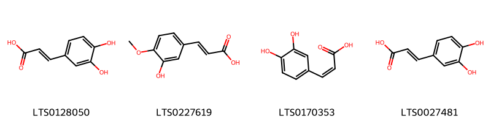
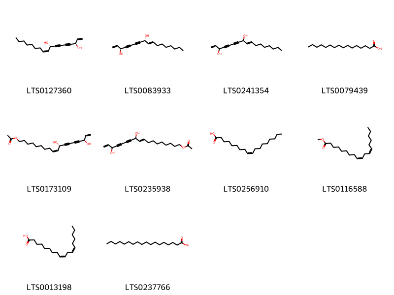
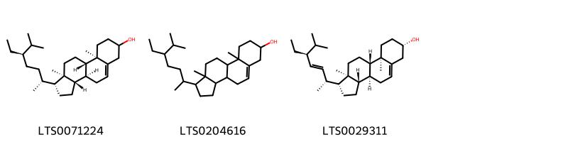

!!! abstract "Tóm tắt"

    Độc hoạt có tên khoa học là Angelica pubescens Maxim thuộc họ hoa tán (Apiaceae). Cây có nguồn gốc từ Trung Quốc, phân bố nhiều tại Trung Quốc, Đài Loan, Nhật Bản. Độc hoạt hiện chưa có nhiều ở Việt Nam, có nơi đã dùng rễ cây tiền hồ với tên độc hoạt (Cao Bằng).  Cây được nhập nội về Việt Nam và được trồng tại Sa Pa (Lào Cai), Sìn Hồ (Lai Châu), Mộc Châu (Sơn La). Theo kinh nghiệm dân gian, rễ độc hoạt được dùng trong những trường hợp  đau nhức xương khớp, đau đầu. Theo các nghiên cứu hiện đại, rễ độc hoạt có tác dụng giảm đau, chống viêm hiệu quả, đồng thời có tác dụng lên hệ thần kinh trung ương, hệ tim mạch. Từ năm 1957, nhiều thành phần hóa học đã được báo cáo trong cây thuốc này, chủ yếu là coumarin và tinh dầu bay hơi. Đến nay, 87 hợp chất đã được phân lập từ rễ độc hoạt, bao gồm coumarin, polyen-alkyl, acid phenolic, steroid, và các nhân tố nucleoside.

## Thông tin về thực vật

Dược liệu **Độc Hoạt (Rễ)** từ bộ phận **Rễ** từ loài *Angelica pubescens*.

**Mô tả thực vật:** Cây hương độc hoạt hay mao đương quy đương quy có lông (Angelica pubescens Maxim) là một cây sống lâu năm, cao 0,5-1m thân mọc thẳng đứng, hơi màu tím, có rãnh dọc, nhẫn không có lòng. Lá kép 2-3 lần lông chim, lá chét nguyên hoặc lại chia thùy, mép có răng cưa tù không nhọn, cuống lá nhỏ, phía dưới nở rộng thành bẹ có địa mỏng. Trên gần lá có lông ngắn và thưa. Cụm hoa tán kép, gồm 10-20 cuống tán. Hoa nhỏ màu trắng; quả bế đối, hình thoi dẹt, trên lưng có sống, hai bên phát triển thành dìa.

*Tài liệu tham khảo:* "Những cây thuốc và vị thuốc Việt Nam" - Đỗ Tất Lợi 
Trong dược điển Việt nam, một loài được sử dụng làm dược liệu là *Angelica pubescens*.

!!! info "Phân loại thực vật của *Angelica pubescens*"
    - **Kingdom:** Plantae
    - **Phylum:** Tracheophyta
    - **Order:** Apiales
    - **Family:** Apiaceae
    - **Genus:** Angelica
    - **Species:** *Angelica pubescens*

**Phân bố trên thế giới:** Chinese Taipei, nan, Japan, Korea, Republic of

**Phân bố tại Việt nam:** Không có ghi nhận ở Việt Nam

## Thông tin về dược liệu 

### Định danh

!!! info "Thông tin về tên gọi"

    - Dược liệu tiếng Việt: độc hoạt
    - Dược liệu tiếng Trung: 独活 (Du Huo)
    - Dược liệu tiếng Anh: Angelica Pubescens F. Biserrata [Syn. Angelica Pubescens]
    - Dược liệu latin thông dụng: Radix Angelicae pubescentis
    - Dược liệu latin kiểu DĐVN: *radix angelicae pubescentis*
    - Dược liệu latin kiểu DĐVN: *Radix Angelicae Pubescentis*
    - Dược liệu latin kiểu thông tư: *Radix Angelicae pubescentis*
    - Bộ phận dùng: Rễ (Radix)

### Mô tả dược liệu 

- **Theo dược điển Việt nam V:** 
Rễ cái hình trụ, trên to, dưới nhỏ, đầu dưới phân 2 đến 3 nhánh hoặc hơn, dài 10 cm đến 30 cm. Đầu rễ phình ra, hình nón ngược với nhiều vân ngang. Đường kính 1,5 cm đến 3 cm, đỉnh trên còn sót lại ít gốc thân, mặt ngoài màu nâu xám hay nâu thẫm, có vân nhăn dọc, với các lỗ vỏ, hơi lồi ngang và những vết sẹo rễ con hơi nổi lên. Chất tương đối rắn chắc, khi ẩm thì mềm. Mặt bẻ gãy có vỏ màu xám trắng, với nhiều khoang dầu màu nâu rải rác, gỗ từ màu vàng xám đến vàng nâu, tầng phát sinh màu nâu. Mùi thơm ngát đặc biệt, vị đắng và hăng, nếm hơi tê lưỡi.

- **Mô tả dược liệu theo thông tư chế biến dược liệu theo phương pháp cổ truyền:** 

### Chế biến 

- **Chế biến theo dược điển việt nam V**: 
Thu hoạch vào mùa thu, khi thân, lá cây khô, lụi hoặc vào mùa xuân trước khi cây nảy chồi, đào lấy rễ, bò thân, lá. rễ con, rửa sạch, sấy đến gần khó, xếp đống 2 đến 3 ngày, sau khi mềm, phơi hoặc sấy khô. Bào chế Dược liệu khô, loại bỏ tạp chất, rửa sạch, ủ mềm, thái phiến mỏng, phơi khô hay sấy khô ở nhiệt độ thấp.

- **Chế biến theo thông tư:** 

--- 

## Thành phần hóa học

- Theo tài liệu của GS. Đỗ Tất Lợi:  87 hợp chất đã được phân lập từ Rễ Độc Hoạt, bao gồm coumarin, polyen-alkyl, acid phenolic, steroid, và các nhân tố nucleoside.
    

**Thành phần hóa học từ loài **Angelica pubescens**

Theo cơ sở dữ liệu lotus, loài *Angelica pubescens* đã phân lập và xác định được **76** hoạt chất thuộc về các nhóm Steroids and steroid derivatives, Organooxygen compounds, Fatty Acyls, Cinnamic acids and derivatives, Benzofurans, Coumarins and derivatives, Prenol lipids trong bảng dưới đây. Danh sách các hoạt chất như sau scopoletin [(LTS0193112)](https://lotus.naturalproducts.net/compound/lotus_id/LTS0193112), isopimpinellin [(LTS0015558)](https://lotus.naturalproducts.net/compound/lotus_id/LTS0015558), 8-(3-hydroxy-3-methylbutanoyl)-5,7-dimethoxychromen-2-one [(LTS0127043)](https://lotus.naturalproducts.net/compound/lotus_id/LTS0127043), imperatorin [(LTS0113114)](https://lotus.naturalproducts.net/compound/lotus_id/LTS0113114), stigmast-5-en-3-ol, (3β)- [(LTS0204616)](https://lotus.naturalproducts.net/compound/lotus_id/LTS0204616), phytosterol [(LTS0029311)](https://lotus.naturalproducts.net/compound/lotus_id/LTS0029311), 1,3-dihydroxy-1-(7-methoxy-2-oxochromen-6-yl)-3-methylbutan-2-yl 2-methylbut-2-enoate [(LTS0192972)](https://lotus.naturalproducts.net/compound/lotus_id/LTS0192972), 2,3-dihydroxy-1-(7-methoxy-2-oxochromen-6-yl)-3-methylbutyl 3-methylbutanoate [(LTS0159628)](https://lotus.naturalproducts.net/compound/lotus_id/LTS0159628), (3s,8r)-heptadeca-1,9-dien-4,6-diyne-3,8-diol [(LTS0083933)](https://lotus.naturalproducts.net/compound/lotus_id/LTS0083933), glaucalactone [(LTS0144469)](https://lotus.naturalproducts.net/compound/lotus_id/LTS0144469), (-)-columbianetin [(LTS0097915)](https://lotus.naturalproducts.net/compound/lotus_id/LTS0097915), 2-[(8s)-2-oxo-8h,9h-furo[2,3-h]chromen-8-yl]propan-2-yl acetate [(LTS0021879)](https://lotus.naturalproducts.net/compound/lotus_id/LTS0021879), 5,7-dimethoxy-8-(3-methylbut-2-en-1-yl)chromen-2-one [(LTS0122057)](https://lotus.naturalproducts.net/compound/lotus_id/LTS0122057), 7-{[(2s,3r,4s,5s,6r)-6-({[(2r,3r,4r)-3,4-dihydroxy-4-(hydroxymethyl)oxolan-2-yl]oxy}methyl)-3,4,5-trihydroxyoxan-2-yl]oxy}chromen-2-one [(LTS0103175)](https://lotus.naturalproducts.net/compound/lotus_id/LTS0103175), (2z,3r,3ar,7as)-3-hydroxy-3,6-dimethyl-2-(3-methylbut-2-en-1-ylidene)-7,7a-dihydro-3ah-1-benzofuran-4-one [(LTS0113851)](https://lotus.naturalproducts.net/compound/lotus_id/LTS0113851), umbelliferone [(LTS0162728)](https://lotus.naturalproducts.net/compound/lotus_id/LTS0162728), methoxsalen [(LTS0260944)](https://lotus.naturalproducts.net/compound/lotus_id/LTS0260944), falcarindiol [(LTS0127360)](https://lotus.naturalproducts.net/compound/lotus_id/LTS0127360), 9-(2,3-dihydroxy-3-methylbutoxy)-4-methoxyfuro[3,2-g]chromen-7-one [(LTS0163534)](https://lotus.naturalproducts.net/compound/lotus_id/LTS0163534), 9-[(3,3-dimethyloxiran-2-yl)methoxy]-4-methoxyfuro[3,2-g]chromen-7-one [(LTS0032296)](https://lotus.naturalproducts.net/compound/lotus_id/LTS0032296), palmitic acid [(LTS0079439)](https://lotus.naturalproducts.net/compound/lotus_id/LTS0079439), 6-[(2r)-2,3-dihydroxy-3-methylbutyl]-7-methoxychromen-2-one [(LTS0068882)](https://lotus.naturalproducts.net/compound/lotus_id/LTS0068882), 9-{[(2s)-3,3-dimethyloxiran-2-yl]methoxy}-4-methoxyfuro[3,2-g]chromen-7-one [(LTS0217925)](https://lotus.naturalproducts.net/compound/lotus_id/LTS0217925), 2,3-dihydroxy-1-(7-methoxy-2-oxochromen-6-yl)-3-methylbutyl 2-methylbut-2-enoate [(LTS0266551)](https://lotus.naturalproducts.net/compound/lotus_id/LTS0266551), stearic acid [(LTS0237766)](https://lotus.naturalproducts.net/compound/lotus_id/LTS0237766), isoferulic acid [(LTS0227619)](https://lotus.naturalproducts.net/compound/lotus_id/LTS0227619), 1,3-dihydroxy-1-(7-methoxy-2-oxochromen-6-yl)-3-methylbutan-2-yl 2-methylbutanoate [(LTS0097232)](https://lotus.naturalproducts.net/compound/lotus_id/LTS0097232), (9z,11s,16r)-11,16-dihydroxyoctadeca-9,17-dien-12,14-diyn-1-yl acetate [(LTS0173109)](https://lotus.naturalproducts.net/compound/lotus_id/LTS0173109), 2-{2-oxo-8h,9h-furo[2,3-h]chromen-8-yl}propan-2-yl acetate [(LTS0125318)](https://lotus.naturalproducts.net/compound/lotus_id/LTS0125318), linoleic [(LTS0013198)](https://lotus.naturalproducts.net/compound/lotus_id/LTS0013198), 1,3-dihydroxy-1-(7-methoxy-2-oxochromen-6-yl)-3-methylbutan-2-yl 3-methylbutanoate [(LTS0074227)](https://lotus.naturalproducts.net/compound/lotus_id/LTS0074227), 6-(1-ethoxy-2,3-dihydroxy-3-methylbutyl)-7-methoxychromen-2-one [(LTS0057016)](https://lotus.naturalproducts.net/compound/lotus_id/LTS0057016), osthole [(LTS0149433)](https://lotus.naturalproducts.net/compound/lotus_id/LTS0149433), bergapten [(LTS0019861)](https://lotus.naturalproducts.net/compound/lotus_id/LTS0019861), 2-[(8s)-2-oxo-8h,9h-furo[2,3-h]chromen-8-yl]propan-2-yl propanoate [(LTS0104412)](https://lotus.naturalproducts.net/compound/lotus_id/LTS0104412), caffeicacid [(LTS0170353)](https://lotus.naturalproducts.net/compound/lotus_id/LTS0170353), 2-[(8s)-2-oxo-8h,9h-furo[2,3-h]chromen-8-yl]propan-2-yl (2z)-2-methylbut-2-enoate [(LTS0072589)](https://lotus.naturalproducts.net/compound/lotus_id/LTS0072589), (1r,2r)-2,3-dihydroxy-1-(7-methoxy-2-oxochromen-6-yl)-3-methylbutyl (2e)-2-methylbut-2-enoate [(LTS0115892)](https://lotus.naturalproducts.net/compound/lotus_id/LTS0115892), (-)-marmesin [(LTS0034561)](https://lotus.naturalproducts.net/compound/lotus_id/LTS0034561), angelitriol [(LTS0242228)](https://lotus.naturalproducts.net/compound/lotus_id/LTS0242228), (1r,2s)-1,3-dihydroxy-1-(7-methoxy-2-oxochromen-6-yl)-3-methylbutan-2-yl (2e)-2-methylbut-2-enoate [(LTS0063386)](https://lotus.naturalproducts.net/compound/lotus_id/LTS0063386), stigmast-5-en-3-ol [(LTS0071224)](https://lotus.naturalproducts.net/compound/lotus_id/LTS0071224), (1r,2s)-2,3-dihydroxy-1-(7-methoxy-2-oxochromen-6-yl)-3-methylbutyl 3-methylbutanoate [(LTS0190072)](https://lotus.naturalproducts.net/compound/lotus_id/LTS0190072), 2-{2-oxo-8h,9h-furo[2,3-h]chromen-8-yl}propan-2-yl propanoate [(LTS0055899)](https://lotus.naturalproducts.net/compound/lotus_id/LTS0055899), (1r,2s)-1,3-dihydroxy-1-(7-methoxy-2-oxochromen-6-yl)-3-methylbutan-2-yl (2z)-2-methylbut-2-enoate [(LTS0175873)](https://lotus.naturalproducts.net/compound/lotus_id/LTS0175873), (1s,2r,3r,4s,5s,6s,8s,9s,10r,13s,16s,17r)-11-ethyl-13-(hydroxymethyl)-6-methoxy-11-azahexacyclo[7.7.2.1²,⁵.0¹,¹⁰.0³,⁸.0¹³,¹⁷]nonadecane-4,8,16-triol [(LTS0169226)](https://lotus.naturalproducts.net/compound/lotus_id/LTS0169226), (1s,2s)-2,3-dihydroxy-1-(7-methoxy-2-oxochromen-6-yl)-3-methylbutyl (2z)-2-methylbut-2-enoate [(LTS0150027)](https://lotus.naturalproducts.net/compound/lotus_id/LTS0150027), (1r,2s)-2,3-dihydroxy-1-(7-methoxy-2-oxochromen-6-yl)-3-methylbutyl (2z)-2-methylbut-2-enoate [(LTS0002112)](https://lotus.naturalproducts.net/compound/lotus_id/LTS0002112), nodakenin [(LTS0251242)](https://lotus.naturalproducts.net/compound/lotus_id/LTS0251242), 3-hydroxy-3,6-dimethyl-2-(3-methylbut-2-en-1-ylidene)-7,7a-dihydro-3ah-1-benzofuran-4-one [(LTS0118392)](https://lotus.naturalproducts.net/compound/lotus_id/LTS0118392), 2-(2-{[3,4,5-trihydroxy-6-(hydroxymethyl)oxan-2-yl]oxy}propan-2-yl)-2h,3h-furo[3,2-g]chromen-7-one [(LTS0239274)](https://lotus.naturalproducts.net/compound/lotus_id/LTS0239274), caffeic acid [(LTS0027481)](https://lotus.naturalproducts.net/compound/lotus_id/LTS0027481), (1r,2s)-1,3-dihydroxy-1-(7-methoxy-2-oxochromen-6-yl)-3-methylbutan-2-yl 2-methylbutanoate [(LTS0095979)](https://lotus.naturalproducts.net/compound/lotus_id/LTS0095979), 7-methoxy-6-(1,2,3-trihydroxy-3-methylbutyl)chromen-2-one [(LTS0117141)](https://lotus.naturalproducts.net/compound/lotus_id/LTS0117141), angelol-j [(LTS0211560)](https://lotus.naturalproducts.net/compound/lotus_id/LTS0211560), 3,4-dihydroxycinnamic acid [(LTS0128050)](https://lotus.naturalproducts.net/compound/lotus_id/LTS0128050), (1r,2r)-1,3-dihydroxy-1-(7-methoxy-2-oxochromen-6-yl)-3-methylbutan-2-yl (2r)-2-methylbutanoate [(LTS0224257)](https://lotus.naturalproducts.net/compound/lotus_id/LTS0224257), oleic acid [(LTS0256910)](https://lotus.naturalproducts.net/compound/lotus_id/LTS0256910), 1-(2-hydroxy-4-methylphenyl)ethanone [(LTS0059565)](https://lotus.naturalproducts.net/compound/lotus_id/LTS0059565), isoimperatorin [(LTS0257448)](https://lotus.naturalproducts.net/compound/lotus_id/LTS0257448), (1r,2s)-2,3-dihydroxy-1-(7-methoxy-2-oxochromen-6-yl)-3-methylbutyl (2e)-2-methylbut-2-enoate [(LTS0188427)](https://lotus.naturalproducts.net/compound/lotus_id/LTS0188427), marmesin [(LTS0122295)](https://lotus.naturalproducts.net/compound/lotus_id/LTS0122295), (1r,2s)-1,3-dihydroxy-1-(7-methoxy-2-oxochromen-6-yl)-3-methylbutan-2-yl 3-methylbutanoate [(LTS0008812)](https://lotus.naturalproducts.net/compound/lotus_id/LTS0008812), (1s,2s)-2,3-dihydroxy-1-(7-methoxy-2-oxochromen-6-yl)-3-methylbutyl (2e)-2-methylbut-2-enoate [(LTS0113301)](https://lotus.naturalproducts.net/compound/lotus_id/LTS0113301), 9-[(2s)-2,3-dihydroxy-3-methylbutoxy]-4-methoxyfuro[3,2-g]chromen-7-one [(LTS0141368)](https://lotus.naturalproducts.net/compound/lotus_id/LTS0141368), 7-methoxy-8-(3-methylbut-2-enoyl)chromen-2-one [(LTS0046107)](https://lotus.naturalproducts.net/compound/lotus_id/LTS0046107), heptadeca-1,9-dien-4,6-diyne-3,8-diol [(LTS0241354)](https://lotus.naturalproducts.net/compound/lotus_id/LTS0241354), (2z,3s,3as,7ar)-3-hydroxy-3,6-dimethyl-2-(3-methylbut-2-en-1-ylidene)-7,7a-dihydro-3ah-1-benzofuran-4-one [(LTS0004821)](https://lotus.naturalproducts.net/compound/lotus_id/LTS0004821), (1s,2s)-2,3-dihydroxy-1-(7-methoxy-2-oxochromen-6-yl)-3-methylbutyl 3-methylbutanoate [(LTS0161921)](https://lotus.naturalproducts.net/compound/lotus_id/LTS0161921), 7-methoxy-5-[(3-methylbut-2-en-1-yl)oxy]-8-(3-methylbut-2-enoyl)chromen-2-one [(LTS0272648)](https://lotus.naturalproducts.net/compound/lotus_id/LTS0272648), osthenol [(LTS0259150)](https://lotus.naturalproducts.net/compound/lotus_id/LTS0259150), methyl linoleate [(LTS0116588)](https://lotus.naturalproducts.net/compound/lotus_id/LTS0116588), (1r,2r)-2,3-dihydroxy-1-(7-methoxy-2-oxochromen-6-yl)-3-methylbutyl (2z)-2-methylbut-2-enoate [(LTS0231459)](https://lotus.naturalproducts.net/compound/lotus_id/LTS0231459), marmesin [(LTS0029816)](https://lotus.naturalproducts.net/compound/lotus_id/LTS0029816), 11,16-dihydroxyoctadeca-9,17-dien-12,14-diyn-1-yl acetate [(LTS0235938)](https://lotus.naturalproducts.net/compound/lotus_id/LTS0235938), psoralen [(LTS0121746)](https://lotus.naturalproducts.net/compound/lotus_id/LTS0121746). 
        
| chemicalTaxonomyClassyfireClass   |   smiles_count |
|:----------------------------------|---------------:|
| Benzofurans                       |            131 |
| Cinnamic acids and derivatives    |             97 |
| Coumarins and derivatives         |           2375 |
| Fatty Acyls                       |            312 |
| Organooxygen compounds            |             18 |
| Prenol lipids                     |            103 |
| Steroids and steroid derivatives  |            221 |

            
### Nhóm Benzofurans
<figure markdown="span">
    { width=100% }
<figcaption>Hình ảnh cấu trúc hóa học của hoạt chất thuộc nhóm *Benzofurans*. Tên thường gọi của các hoạt chất tương ứng là (2z,3s,3as,7ar)-3-hydroxy-3,6-dimethyl-2-(3-methylbut-2-en-1-ylidene)-7,7a-dihydro-3ah-1-benzofuran-4-one [(LTS0004821)](https://lotus.naturalproducts.net/compound/lotus_id/LTS0004821), 3-hydroxy-3,6-dimethyl-2-(3-methylbut-2-en-1-ylidene)-7,7a-dihydro-3ah-1-benzofuran-4-one [(LTS0118392)](https://lotus.naturalproducts.net/compound/lotus_id/LTS0118392), (2z,3r,3ar,7as)-3-hydroxy-3,6-dimethyl-2-(3-methylbut-2-en-1-ylidene)-7,7a-dihydro-3ah-1-benzofuran-4-one [(LTS0113851)](https://lotus.naturalproducts.net/compound/lotus_id/LTS0113851).</figcaption>
</figure>

            
            
### Nhóm Benzofurans
<figure markdown="span">
    { width=100% }
<figcaption>Hình ảnh cấu trúc hóa học của hoạt chất thuộc nhóm *Benzofurans*. Tên thường gọi của các hoạt chất tương ứng là (2z,3s,3as,7ar)-3-hydroxy-3,6-dimethyl-2-(3-methylbut-2-en-1-ylidene)-7,7a-dihydro-3ah-1-benzofuran-4-one [(LTS0004821)](https://lotus.naturalproducts.net/compound/lotus_id/LTS0004821), 3-hydroxy-3,6-dimethyl-2-(3-methylbut-2-en-1-ylidene)-7,7a-dihydro-3ah-1-benzofuran-4-one [(LTS0118392)](https://lotus.naturalproducts.net/compound/lotus_id/LTS0118392), (2z,3r,3ar,7as)-3-hydroxy-3,6-dimethyl-2-(3-methylbut-2-en-1-ylidene)-7,7a-dihydro-3ah-1-benzofuran-4-one [(LTS0113851)](https://lotus.naturalproducts.net/compound/lotus_id/LTS0113851).</figcaption>
</figure>

### Nhóm Cinnamic acids and derivatives
<figure markdown="span">
    { width=100% }
<figcaption>Hình ảnh cấu trúc hóa học của hoạt chất thuộc nhóm *Cinnamic acids and derivatives*. Tên thường gọi của các hoạt chất tương ứng là 3,4-dihydroxycinnamic acid [(LTS0128050)](https://lotus.naturalproducts.net/compound/lotus_id/LTS0128050), isoferulic acid [(LTS0227619)](https://lotus.naturalproducts.net/compound/lotus_id/LTS0227619), caffeicacid [(LTS0170353)](https://lotus.naturalproducts.net/compound/lotus_id/LTS0170353), caffeic acid [(LTS0027481)](https://lotus.naturalproducts.net/compound/lotus_id/LTS0027481).</figcaption>
</figure>

            
            
### Nhóm Benzofurans
<figure markdown="span">
    { width=100% }
<figcaption>Hình ảnh cấu trúc hóa học của hoạt chất thuộc nhóm *Benzofurans*. Tên thường gọi của các hoạt chất tương ứng là (2z,3s,3as,7ar)-3-hydroxy-3,6-dimethyl-2-(3-methylbut-2-en-1-ylidene)-7,7a-dihydro-3ah-1-benzofuran-4-one [(LTS0004821)](https://lotus.naturalproducts.net/compound/lotus_id/LTS0004821), 3-hydroxy-3,6-dimethyl-2-(3-methylbut-2-en-1-ylidene)-7,7a-dihydro-3ah-1-benzofuran-4-one [(LTS0118392)](https://lotus.naturalproducts.net/compound/lotus_id/LTS0118392), (2z,3r,3ar,7as)-3-hydroxy-3,6-dimethyl-2-(3-methylbut-2-en-1-ylidene)-7,7a-dihydro-3ah-1-benzofuran-4-one [(LTS0113851)](https://lotus.naturalproducts.net/compound/lotus_id/LTS0113851).</figcaption>
</figure>

### Nhóm Cinnamic acids and derivatives
<figure markdown="span">
    { width=100% }
<figcaption>Hình ảnh cấu trúc hóa học của hoạt chất thuộc nhóm *Cinnamic acids and derivatives*. Tên thường gọi của các hoạt chất tương ứng là 3,4-dihydroxycinnamic acid [(LTS0128050)](https://lotus.naturalproducts.net/compound/lotus_id/LTS0128050), isoferulic acid [(LTS0227619)](https://lotus.naturalproducts.net/compound/lotus_id/LTS0227619), caffeicacid [(LTS0170353)](https://lotus.naturalproducts.net/compound/lotus_id/LTS0170353), caffeic acid [(LTS0027481)](https://lotus.naturalproducts.net/compound/lotus_id/LTS0027481).</figcaption>
</figure>

### Nhóm Coumarins and derivatives
<figure markdown="span">
    { width=100% }
<figcaption>Hình ảnh cấu trúc hóa học của hoạt chất thuộc nhóm *Coumarins and derivatives*. Tên thường gọi của các hoạt chất tương ứng là isoimperatorin [(LTS0257448)](https://lotus.naturalproducts.net/compound/lotus_id/LTS0257448), imperatorin [(LTS0113114)](https://lotus.naturalproducts.net/compound/lotus_id/LTS0113114), bergapten [(LTS0019861)](https://lotus.naturalproducts.net/compound/lotus_id/LTS0019861), umbelliferone [(LTS0162728)](https://lotus.naturalproducts.net/compound/lotus_id/LTS0162728), methoxsalen [(LTS0260944)](https://lotus.naturalproducts.net/compound/lotus_id/LTS0260944), 2-(2-{[3,4,5-trihydroxy-6-(hydroxymethyl)oxan-2-yl]oxy}propan-2-yl)-2h,3h-furo[3,2-g]chromen-7-one [(LTS0239274)](https://lotus.naturalproducts.net/compound/lotus_id/LTS0239274), psoralen [(LTS0121746)](https://lotus.naturalproducts.net/compound/lotus_id/LTS0121746), marmesin [(LTS0122295)](https://lotus.naturalproducts.net/compound/lotus_id/LTS0122295), osthole [(LTS0149433)](https://lotus.naturalproducts.net/compound/lotus_id/LTS0149433), nodakenin [(LTS0251242)](https://lotus.naturalproducts.net/compound/lotus_id/LTS0251242), marmesin [(LTS0029816)](https://lotus.naturalproducts.net/compound/lotus_id/LTS0029816), 9-(2,3-dihydroxy-3-methylbutoxy)-4-methoxyfuro[3,2-g]chromen-7-one [(LTS0163534)](https://lotus.naturalproducts.net/compound/lotus_id/LTS0163534), isopimpinellin [(LTS0015558)](https://lotus.naturalproducts.net/compound/lotus_id/LTS0015558), scopoletin [(LTS0193112)](https://lotus.naturalproducts.net/compound/lotus_id/LTS0193112), (-)-marmesin [(LTS0034561)](https://lotus.naturalproducts.net/compound/lotus_id/LTS0034561), 9-[(3,3-dimethyloxiran-2-yl)methoxy]-4-methoxyfuro[3,2-g]chromen-7-one [(LTS0032296)](https://lotus.naturalproducts.net/compound/lotus_id/LTS0032296), osthenol [(LTS0259150)](https://lotus.naturalproducts.net/compound/lotus_id/LTS0259150), 9-[(2s)-2,3-dihydroxy-3-methylbutoxy]-4-methoxyfuro[3,2-g]chromen-7-one [(LTS0141368)](https://lotus.naturalproducts.net/compound/lotus_id/LTS0141368), 1,3-dihydroxy-1-(7-methoxy-2-oxochromen-6-yl)-3-methylbutan-2-yl 3-methylbutanoate [(LTS0074227)](https://lotus.naturalproducts.net/compound/lotus_id/LTS0074227), glaucalactone [(LTS0144469)](https://lotus.naturalproducts.net/compound/lotus_id/LTS0144469), (1r,2s)-1,3-dihydroxy-1-(7-methoxy-2-oxochromen-6-yl)-3-methylbutan-2-yl (2z)-2-methylbut-2-enoate [(LTS0175873)](https://lotus.naturalproducts.net/compound/lotus_id/LTS0175873), (1r,2s)-1,3-dihydroxy-1-(7-methoxy-2-oxochromen-6-yl)-3-methylbutan-2-yl 3-methylbutanoate [(LTS0008812)](https://lotus.naturalproducts.net/compound/lotus_id/LTS0008812), (-)-columbianetin [(LTS0097915)](https://lotus.naturalproducts.net/compound/lotus_id/LTS0097915), (1r,2r)-2,3-dihydroxy-1-(7-methoxy-2-oxochromen-6-yl)-3-methylbutyl (2e)-2-methylbut-2-enoate [(LTS0115892)](https://lotus.naturalproducts.net/compound/lotus_id/LTS0115892), 7-{[(2s,3r,4s,5s,6r)-6-({[(2r,3r,4r)-3,4-dihydroxy-4-(hydroxymethyl)oxolan-2-yl]oxy}methyl)-3,4,5-trihydroxyoxan-2-yl]oxy}chromen-2-one [(LTS0103175)](https://lotus.naturalproducts.net/compound/lotus_id/LTS0103175), 2-[(8s)-2-oxo-8h,9h-furo[2,3-h]chromen-8-yl]propan-2-yl propanoate [(LTS0104412)](https://lotus.naturalproducts.net/compound/lotus_id/LTS0104412), 2-[(8s)-2-oxo-8h,9h-furo[2,3-h]chromen-8-yl]propan-2-yl (2z)-2-methylbut-2-enoate [(LTS0072589)](https://lotus.naturalproducts.net/compound/lotus_id/LTS0072589), 6-[(2r)-2,3-dihydroxy-3-methylbutyl]-7-methoxychromen-2-one [(LTS0068882)](https://lotus.naturalproducts.net/compound/lotus_id/LTS0068882), 5,7-dimethoxy-8-(3-methylbut-2-en-1-yl)chromen-2-one [(LTS0122057)](https://lotus.naturalproducts.net/compound/lotus_id/LTS0122057), 8-(3-hydroxy-3-methylbutanoyl)-5,7-dimethoxychromen-2-one [(LTS0127043)](https://lotus.naturalproducts.net/compound/lotus_id/LTS0127043), (1r,2r)-1,3-dihydroxy-1-(7-methoxy-2-oxochromen-6-yl)-3-methylbutan-2-yl (2r)-2-methylbutanoate [(LTS0224257)](https://lotus.naturalproducts.net/compound/lotus_id/LTS0224257), 1,3-dihydroxy-1-(7-methoxy-2-oxochromen-6-yl)-3-methylbutan-2-yl 2-methylbut-2-enoate [(LTS0192972)](https://lotus.naturalproducts.net/compound/lotus_id/LTS0192972), (1r,2s)-1,3-dihydroxy-1-(7-methoxy-2-oxochromen-6-yl)-3-methylbutan-2-yl 2-methylbutanoate [(LTS0095979)](https://lotus.naturalproducts.net/compound/lotus_id/LTS0095979), 1,3-dihydroxy-1-(7-methoxy-2-oxochromen-6-yl)-3-methylbutan-2-yl 2-methylbutanoate [(LTS0097232)](https://lotus.naturalproducts.net/compound/lotus_id/LTS0097232), 2,3-dihydroxy-1-(7-methoxy-2-oxochromen-6-yl)-3-methylbutyl 3-methylbutanoate [(LTS0159628)](https://lotus.naturalproducts.net/compound/lotus_id/LTS0159628), (1r,2s)-2,3-dihydroxy-1-(7-methoxy-2-oxochromen-6-yl)-3-methylbutyl 3-methylbutanoate [(LTS0190072)](https://lotus.naturalproducts.net/compound/lotus_id/LTS0190072), (1s,2s)-2,3-dihydroxy-1-(7-methoxy-2-oxochromen-6-yl)-3-methylbutyl 3-methylbutanoate [(LTS0161921)](https://lotus.naturalproducts.net/compound/lotus_id/LTS0161921), 7-methoxy-6-(1,2,3-trihydroxy-3-methylbutyl)chromen-2-one [(LTS0117141)](https://lotus.naturalproducts.net/compound/lotus_id/LTS0117141), (1r,2s)-2,3-dihydroxy-1-(7-methoxy-2-oxochromen-6-yl)-3-methylbutyl (2e)-2-methylbut-2-enoate [(LTS0188427)](https://lotus.naturalproducts.net/compound/lotus_id/LTS0188427), (1s,2s)-2,3-dihydroxy-1-(7-methoxy-2-oxochromen-6-yl)-3-methylbutyl (2z)-2-methylbut-2-enoate [(LTS0150027)](https://lotus.naturalproducts.net/compound/lotus_id/LTS0150027), 7-methoxy-5-[(3-methylbut-2-en-1-yl)oxy]-8-(3-methylbut-2-enoyl)chromen-2-one [(LTS0272648)](https://lotus.naturalproducts.net/compound/lotus_id/LTS0272648), 2-{2-oxo-8h,9h-furo[2,3-h]chromen-8-yl}propan-2-yl acetate [(LTS0125318)](https://lotus.naturalproducts.net/compound/lotus_id/LTS0125318), (1r,2s)-1,3-dihydroxy-1-(7-methoxy-2-oxochromen-6-yl)-3-methylbutan-2-yl (2e)-2-methylbut-2-enoate [(LTS0063386)](https://lotus.naturalproducts.net/compound/lotus_id/LTS0063386), 6-(1-ethoxy-2,3-dihydroxy-3-methylbutyl)-7-methoxychromen-2-one [(LTS0057016)](https://lotus.naturalproducts.net/compound/lotus_id/LTS0057016), 2-{2-oxo-8h,9h-furo[2,3-h]chromen-8-yl}propan-2-yl propanoate [(LTS0055899)](https://lotus.naturalproducts.net/compound/lotus_id/LTS0055899), angelol-j [(LTS0211560)](https://lotus.naturalproducts.net/compound/lotus_id/LTS0211560), 9-{[(2s)-3,3-dimethyloxiran-2-yl]methoxy}-4-methoxyfuro[3,2-g]chromen-7-one [(LTS0217925)](https://lotus.naturalproducts.net/compound/lotus_id/LTS0217925), 2-[(8s)-2-oxo-8h,9h-furo[2,3-h]chromen-8-yl]propan-2-yl acetate [(LTS0021879)](https://lotus.naturalproducts.net/compound/lotus_id/LTS0021879), 7-methoxy-8-(3-methylbut-2-enoyl)chromen-2-one [(LTS0046107)](https://lotus.naturalproducts.net/compound/lotus_id/LTS0046107), 2,3-dihydroxy-1-(7-methoxy-2-oxochromen-6-yl)-3-methylbutyl 2-methylbut-2-enoate [(LTS0266551)](https://lotus.naturalproducts.net/compound/lotus_id/LTS0266551), (1s,2s)-2,3-dihydroxy-1-(7-methoxy-2-oxochromen-6-yl)-3-methylbutyl (2e)-2-methylbut-2-enoate [(LTS0113301)](https://lotus.naturalproducts.net/compound/lotus_id/LTS0113301), angelitriol [(LTS0242228)](https://lotus.naturalproducts.net/compound/lotus_id/LTS0242228), (1r,2s)-2,3-dihydroxy-1-(7-methoxy-2-oxochromen-6-yl)-3-methylbutyl (2z)-2-methylbut-2-enoate [(LTS0002112)](https://lotus.naturalproducts.net/compound/lotus_id/LTS0002112), (1r,2r)-2,3-dihydroxy-1-(7-methoxy-2-oxochromen-6-yl)-3-methylbutyl (2z)-2-methylbut-2-enoate [(LTS0231459)](https://lotus.naturalproducts.net/compound/lotus_id/LTS0231459).</figcaption>
</figure>

            
            
### Nhóm Benzofurans
<figure markdown="span">
    { width=100% }
<figcaption>Hình ảnh cấu trúc hóa học của hoạt chất thuộc nhóm *Benzofurans*. Tên thường gọi của các hoạt chất tương ứng là (2z,3s,3as,7ar)-3-hydroxy-3,6-dimethyl-2-(3-methylbut-2-en-1-ylidene)-7,7a-dihydro-3ah-1-benzofuran-4-one [(LTS0004821)](https://lotus.naturalproducts.net/compound/lotus_id/LTS0004821), 3-hydroxy-3,6-dimethyl-2-(3-methylbut-2-en-1-ylidene)-7,7a-dihydro-3ah-1-benzofuran-4-one [(LTS0118392)](https://lotus.naturalproducts.net/compound/lotus_id/LTS0118392), (2z,3r,3ar,7as)-3-hydroxy-3,6-dimethyl-2-(3-methylbut-2-en-1-ylidene)-7,7a-dihydro-3ah-1-benzofuran-4-one [(LTS0113851)](https://lotus.naturalproducts.net/compound/lotus_id/LTS0113851).</figcaption>
</figure>

### Nhóm Cinnamic acids and derivatives
<figure markdown="span">
    { width=100% }
<figcaption>Hình ảnh cấu trúc hóa học của hoạt chất thuộc nhóm *Cinnamic acids and derivatives*. Tên thường gọi của các hoạt chất tương ứng là 3,4-dihydroxycinnamic acid [(LTS0128050)](https://lotus.naturalproducts.net/compound/lotus_id/LTS0128050), isoferulic acid [(LTS0227619)](https://lotus.naturalproducts.net/compound/lotus_id/LTS0227619), caffeicacid [(LTS0170353)](https://lotus.naturalproducts.net/compound/lotus_id/LTS0170353), caffeic acid [(LTS0027481)](https://lotus.naturalproducts.net/compound/lotus_id/LTS0027481).</figcaption>
</figure>

### Nhóm Coumarins and derivatives
<figure markdown="span">
    { width=100% }
<figcaption>Hình ảnh cấu trúc hóa học của hoạt chất thuộc nhóm *Coumarins and derivatives*. Tên thường gọi của các hoạt chất tương ứng là isoimperatorin [(LTS0257448)](https://lotus.naturalproducts.net/compound/lotus_id/LTS0257448), imperatorin [(LTS0113114)](https://lotus.naturalproducts.net/compound/lotus_id/LTS0113114), bergapten [(LTS0019861)](https://lotus.naturalproducts.net/compound/lotus_id/LTS0019861), umbelliferone [(LTS0162728)](https://lotus.naturalproducts.net/compound/lotus_id/LTS0162728), methoxsalen [(LTS0260944)](https://lotus.naturalproducts.net/compound/lotus_id/LTS0260944), 2-(2-{[3,4,5-trihydroxy-6-(hydroxymethyl)oxan-2-yl]oxy}propan-2-yl)-2h,3h-furo[3,2-g]chromen-7-one [(LTS0239274)](https://lotus.naturalproducts.net/compound/lotus_id/LTS0239274), psoralen [(LTS0121746)](https://lotus.naturalproducts.net/compound/lotus_id/LTS0121746), marmesin [(LTS0122295)](https://lotus.naturalproducts.net/compound/lotus_id/LTS0122295), osthole [(LTS0149433)](https://lotus.naturalproducts.net/compound/lotus_id/LTS0149433), nodakenin [(LTS0251242)](https://lotus.naturalproducts.net/compound/lotus_id/LTS0251242), marmesin [(LTS0029816)](https://lotus.naturalproducts.net/compound/lotus_id/LTS0029816), 9-(2,3-dihydroxy-3-methylbutoxy)-4-methoxyfuro[3,2-g]chromen-7-one [(LTS0163534)](https://lotus.naturalproducts.net/compound/lotus_id/LTS0163534), isopimpinellin [(LTS0015558)](https://lotus.naturalproducts.net/compound/lotus_id/LTS0015558), scopoletin [(LTS0193112)](https://lotus.naturalproducts.net/compound/lotus_id/LTS0193112), (-)-marmesin [(LTS0034561)](https://lotus.naturalproducts.net/compound/lotus_id/LTS0034561), 9-[(3,3-dimethyloxiran-2-yl)methoxy]-4-methoxyfuro[3,2-g]chromen-7-one [(LTS0032296)](https://lotus.naturalproducts.net/compound/lotus_id/LTS0032296), osthenol [(LTS0259150)](https://lotus.naturalproducts.net/compound/lotus_id/LTS0259150), 9-[(2s)-2,3-dihydroxy-3-methylbutoxy]-4-methoxyfuro[3,2-g]chromen-7-one [(LTS0141368)](https://lotus.naturalproducts.net/compound/lotus_id/LTS0141368), 1,3-dihydroxy-1-(7-methoxy-2-oxochromen-6-yl)-3-methylbutan-2-yl 3-methylbutanoate [(LTS0074227)](https://lotus.naturalproducts.net/compound/lotus_id/LTS0074227), glaucalactone [(LTS0144469)](https://lotus.naturalproducts.net/compound/lotus_id/LTS0144469), (1r,2s)-1,3-dihydroxy-1-(7-methoxy-2-oxochromen-6-yl)-3-methylbutan-2-yl (2z)-2-methylbut-2-enoate [(LTS0175873)](https://lotus.naturalproducts.net/compound/lotus_id/LTS0175873), (1r,2s)-1,3-dihydroxy-1-(7-methoxy-2-oxochromen-6-yl)-3-methylbutan-2-yl 3-methylbutanoate [(LTS0008812)](https://lotus.naturalproducts.net/compound/lotus_id/LTS0008812), (-)-columbianetin [(LTS0097915)](https://lotus.naturalproducts.net/compound/lotus_id/LTS0097915), (1r,2r)-2,3-dihydroxy-1-(7-methoxy-2-oxochromen-6-yl)-3-methylbutyl (2e)-2-methylbut-2-enoate [(LTS0115892)](https://lotus.naturalproducts.net/compound/lotus_id/LTS0115892), 7-{[(2s,3r,4s,5s,6r)-6-({[(2r,3r,4r)-3,4-dihydroxy-4-(hydroxymethyl)oxolan-2-yl]oxy}methyl)-3,4,5-trihydroxyoxan-2-yl]oxy}chromen-2-one [(LTS0103175)](https://lotus.naturalproducts.net/compound/lotus_id/LTS0103175), 2-[(8s)-2-oxo-8h,9h-furo[2,3-h]chromen-8-yl]propan-2-yl propanoate [(LTS0104412)](https://lotus.naturalproducts.net/compound/lotus_id/LTS0104412), 2-[(8s)-2-oxo-8h,9h-furo[2,3-h]chromen-8-yl]propan-2-yl (2z)-2-methylbut-2-enoate [(LTS0072589)](https://lotus.naturalproducts.net/compound/lotus_id/LTS0072589), 6-[(2r)-2,3-dihydroxy-3-methylbutyl]-7-methoxychromen-2-one [(LTS0068882)](https://lotus.naturalproducts.net/compound/lotus_id/LTS0068882), 5,7-dimethoxy-8-(3-methylbut-2-en-1-yl)chromen-2-one [(LTS0122057)](https://lotus.naturalproducts.net/compound/lotus_id/LTS0122057), 8-(3-hydroxy-3-methylbutanoyl)-5,7-dimethoxychromen-2-one [(LTS0127043)](https://lotus.naturalproducts.net/compound/lotus_id/LTS0127043), (1r,2r)-1,3-dihydroxy-1-(7-methoxy-2-oxochromen-6-yl)-3-methylbutan-2-yl (2r)-2-methylbutanoate [(LTS0224257)](https://lotus.naturalproducts.net/compound/lotus_id/LTS0224257), 1,3-dihydroxy-1-(7-methoxy-2-oxochromen-6-yl)-3-methylbutan-2-yl 2-methylbut-2-enoate [(LTS0192972)](https://lotus.naturalproducts.net/compound/lotus_id/LTS0192972), (1r,2s)-1,3-dihydroxy-1-(7-methoxy-2-oxochromen-6-yl)-3-methylbutan-2-yl 2-methylbutanoate [(LTS0095979)](https://lotus.naturalproducts.net/compound/lotus_id/LTS0095979), 1,3-dihydroxy-1-(7-methoxy-2-oxochromen-6-yl)-3-methylbutan-2-yl 2-methylbutanoate [(LTS0097232)](https://lotus.naturalproducts.net/compound/lotus_id/LTS0097232), 2,3-dihydroxy-1-(7-methoxy-2-oxochromen-6-yl)-3-methylbutyl 3-methylbutanoate [(LTS0159628)](https://lotus.naturalproducts.net/compound/lotus_id/LTS0159628), (1r,2s)-2,3-dihydroxy-1-(7-methoxy-2-oxochromen-6-yl)-3-methylbutyl 3-methylbutanoate [(LTS0190072)](https://lotus.naturalproducts.net/compound/lotus_id/LTS0190072), (1s,2s)-2,3-dihydroxy-1-(7-methoxy-2-oxochromen-6-yl)-3-methylbutyl 3-methylbutanoate [(LTS0161921)](https://lotus.naturalproducts.net/compound/lotus_id/LTS0161921), 7-methoxy-6-(1,2,3-trihydroxy-3-methylbutyl)chromen-2-one [(LTS0117141)](https://lotus.naturalproducts.net/compound/lotus_id/LTS0117141), (1r,2s)-2,3-dihydroxy-1-(7-methoxy-2-oxochromen-6-yl)-3-methylbutyl (2e)-2-methylbut-2-enoate [(LTS0188427)](https://lotus.naturalproducts.net/compound/lotus_id/LTS0188427), (1s,2s)-2,3-dihydroxy-1-(7-methoxy-2-oxochromen-6-yl)-3-methylbutyl (2z)-2-methylbut-2-enoate [(LTS0150027)](https://lotus.naturalproducts.net/compound/lotus_id/LTS0150027), 7-methoxy-5-[(3-methylbut-2-en-1-yl)oxy]-8-(3-methylbut-2-enoyl)chromen-2-one [(LTS0272648)](https://lotus.naturalproducts.net/compound/lotus_id/LTS0272648), 2-{2-oxo-8h,9h-furo[2,3-h]chromen-8-yl}propan-2-yl acetate [(LTS0125318)](https://lotus.naturalproducts.net/compound/lotus_id/LTS0125318), (1r,2s)-1,3-dihydroxy-1-(7-methoxy-2-oxochromen-6-yl)-3-methylbutan-2-yl (2e)-2-methylbut-2-enoate [(LTS0063386)](https://lotus.naturalproducts.net/compound/lotus_id/LTS0063386), 6-(1-ethoxy-2,3-dihydroxy-3-methylbutyl)-7-methoxychromen-2-one [(LTS0057016)](https://lotus.naturalproducts.net/compound/lotus_id/LTS0057016), 2-{2-oxo-8h,9h-furo[2,3-h]chromen-8-yl}propan-2-yl propanoate [(LTS0055899)](https://lotus.naturalproducts.net/compound/lotus_id/LTS0055899), angelol-j [(LTS0211560)](https://lotus.naturalproducts.net/compound/lotus_id/LTS0211560), 9-{[(2s)-3,3-dimethyloxiran-2-yl]methoxy}-4-methoxyfuro[3,2-g]chromen-7-one [(LTS0217925)](https://lotus.naturalproducts.net/compound/lotus_id/LTS0217925), 2-[(8s)-2-oxo-8h,9h-furo[2,3-h]chromen-8-yl]propan-2-yl acetate [(LTS0021879)](https://lotus.naturalproducts.net/compound/lotus_id/LTS0021879), 7-methoxy-8-(3-methylbut-2-enoyl)chromen-2-one [(LTS0046107)](https://lotus.naturalproducts.net/compound/lotus_id/LTS0046107), 2,3-dihydroxy-1-(7-methoxy-2-oxochromen-6-yl)-3-methylbutyl 2-methylbut-2-enoate [(LTS0266551)](https://lotus.naturalproducts.net/compound/lotus_id/LTS0266551), (1s,2s)-2,3-dihydroxy-1-(7-methoxy-2-oxochromen-6-yl)-3-methylbutyl (2e)-2-methylbut-2-enoate [(LTS0113301)](https://lotus.naturalproducts.net/compound/lotus_id/LTS0113301), angelitriol [(LTS0242228)](https://lotus.naturalproducts.net/compound/lotus_id/LTS0242228), (1r,2s)-2,3-dihydroxy-1-(7-methoxy-2-oxochromen-6-yl)-3-methylbutyl (2z)-2-methylbut-2-enoate [(LTS0002112)](https://lotus.naturalproducts.net/compound/lotus_id/LTS0002112), (1r,2r)-2,3-dihydroxy-1-(7-methoxy-2-oxochromen-6-yl)-3-methylbutyl (2z)-2-methylbut-2-enoate [(LTS0231459)](https://lotus.naturalproducts.net/compound/lotus_id/LTS0231459).</figcaption>
</figure>

### Nhóm Fatty Acyls
<figure markdown="span">
    { width=100% }
<figcaption>Hình ảnh cấu trúc hóa học của hoạt chất thuộc nhóm *Fatty Acyls*. Tên thường gọi của các hoạt chất tương ứng là falcarindiol [(LTS0127360)](https://lotus.naturalproducts.net/compound/lotus_id/LTS0127360), (3s,8r)-heptadeca-1,9-dien-4,6-diyne-3,8-diol [(LTS0083933)](https://lotus.naturalproducts.net/compound/lotus_id/LTS0083933), heptadeca-1,9-dien-4,6-diyne-3,8-diol [(LTS0241354)](https://lotus.naturalproducts.net/compound/lotus_id/LTS0241354), palmitic acid [(LTS0079439)](https://lotus.naturalproducts.net/compound/lotus_id/LTS0079439), (9z,11s,16r)-11,16-dihydroxyoctadeca-9,17-dien-12,14-diyn-1-yl acetate [(LTS0173109)](https://lotus.naturalproducts.net/compound/lotus_id/LTS0173109), 11,16-dihydroxyoctadeca-9,17-dien-12,14-diyn-1-yl acetate [(LTS0235938)](https://lotus.naturalproducts.net/compound/lotus_id/LTS0235938), oleic acid [(LTS0256910)](https://lotus.naturalproducts.net/compound/lotus_id/LTS0256910), methyl linoleate [(LTS0116588)](https://lotus.naturalproducts.net/compound/lotus_id/LTS0116588), linoleic [(LTS0013198)](https://lotus.naturalproducts.net/compound/lotus_id/LTS0013198), stearic acid [(LTS0237766)](https://lotus.naturalproducts.net/compound/lotus_id/LTS0237766).</figcaption>
</figure>

            
            
### Nhóm Benzofurans
<figure markdown="span">
    { width=100% }
<figcaption>Hình ảnh cấu trúc hóa học của hoạt chất thuộc nhóm *Benzofurans*. Tên thường gọi của các hoạt chất tương ứng là (2z,3s,3as,7ar)-3-hydroxy-3,6-dimethyl-2-(3-methylbut-2-en-1-ylidene)-7,7a-dihydro-3ah-1-benzofuran-4-one [(LTS0004821)](https://lotus.naturalproducts.net/compound/lotus_id/LTS0004821), 3-hydroxy-3,6-dimethyl-2-(3-methylbut-2-en-1-ylidene)-7,7a-dihydro-3ah-1-benzofuran-4-one [(LTS0118392)](https://lotus.naturalproducts.net/compound/lotus_id/LTS0118392), (2z,3r,3ar,7as)-3-hydroxy-3,6-dimethyl-2-(3-methylbut-2-en-1-ylidene)-7,7a-dihydro-3ah-1-benzofuran-4-one [(LTS0113851)](https://lotus.naturalproducts.net/compound/lotus_id/LTS0113851).</figcaption>
</figure>

### Nhóm Cinnamic acids and derivatives
<figure markdown="span">
    { width=100% }
<figcaption>Hình ảnh cấu trúc hóa học của hoạt chất thuộc nhóm *Cinnamic acids and derivatives*. Tên thường gọi của các hoạt chất tương ứng là 3,4-dihydroxycinnamic acid [(LTS0128050)](https://lotus.naturalproducts.net/compound/lotus_id/LTS0128050), isoferulic acid [(LTS0227619)](https://lotus.naturalproducts.net/compound/lotus_id/LTS0227619), caffeicacid [(LTS0170353)](https://lotus.naturalproducts.net/compound/lotus_id/LTS0170353), caffeic acid [(LTS0027481)](https://lotus.naturalproducts.net/compound/lotus_id/LTS0027481).</figcaption>
</figure>

### Nhóm Coumarins and derivatives
<figure markdown="span">
    { width=100% }
<figcaption>Hình ảnh cấu trúc hóa học của hoạt chất thuộc nhóm *Coumarins and derivatives*. Tên thường gọi của các hoạt chất tương ứng là isoimperatorin [(LTS0257448)](https://lotus.naturalproducts.net/compound/lotus_id/LTS0257448), imperatorin [(LTS0113114)](https://lotus.naturalproducts.net/compound/lotus_id/LTS0113114), bergapten [(LTS0019861)](https://lotus.naturalproducts.net/compound/lotus_id/LTS0019861), umbelliferone [(LTS0162728)](https://lotus.naturalproducts.net/compound/lotus_id/LTS0162728), methoxsalen [(LTS0260944)](https://lotus.naturalproducts.net/compound/lotus_id/LTS0260944), 2-(2-{[3,4,5-trihydroxy-6-(hydroxymethyl)oxan-2-yl]oxy}propan-2-yl)-2h,3h-furo[3,2-g]chromen-7-one [(LTS0239274)](https://lotus.naturalproducts.net/compound/lotus_id/LTS0239274), psoralen [(LTS0121746)](https://lotus.naturalproducts.net/compound/lotus_id/LTS0121746), marmesin [(LTS0122295)](https://lotus.naturalproducts.net/compound/lotus_id/LTS0122295), osthole [(LTS0149433)](https://lotus.naturalproducts.net/compound/lotus_id/LTS0149433), nodakenin [(LTS0251242)](https://lotus.naturalproducts.net/compound/lotus_id/LTS0251242), marmesin [(LTS0029816)](https://lotus.naturalproducts.net/compound/lotus_id/LTS0029816), 9-(2,3-dihydroxy-3-methylbutoxy)-4-methoxyfuro[3,2-g]chromen-7-one [(LTS0163534)](https://lotus.naturalproducts.net/compound/lotus_id/LTS0163534), isopimpinellin [(LTS0015558)](https://lotus.naturalproducts.net/compound/lotus_id/LTS0015558), scopoletin [(LTS0193112)](https://lotus.naturalproducts.net/compound/lotus_id/LTS0193112), (-)-marmesin [(LTS0034561)](https://lotus.naturalproducts.net/compound/lotus_id/LTS0034561), 9-[(3,3-dimethyloxiran-2-yl)methoxy]-4-methoxyfuro[3,2-g]chromen-7-one [(LTS0032296)](https://lotus.naturalproducts.net/compound/lotus_id/LTS0032296), osthenol [(LTS0259150)](https://lotus.naturalproducts.net/compound/lotus_id/LTS0259150), 9-[(2s)-2,3-dihydroxy-3-methylbutoxy]-4-methoxyfuro[3,2-g]chromen-7-one [(LTS0141368)](https://lotus.naturalproducts.net/compound/lotus_id/LTS0141368), 1,3-dihydroxy-1-(7-methoxy-2-oxochromen-6-yl)-3-methylbutan-2-yl 3-methylbutanoate [(LTS0074227)](https://lotus.naturalproducts.net/compound/lotus_id/LTS0074227), glaucalactone [(LTS0144469)](https://lotus.naturalproducts.net/compound/lotus_id/LTS0144469), (1r,2s)-1,3-dihydroxy-1-(7-methoxy-2-oxochromen-6-yl)-3-methylbutan-2-yl (2z)-2-methylbut-2-enoate [(LTS0175873)](https://lotus.naturalproducts.net/compound/lotus_id/LTS0175873), (1r,2s)-1,3-dihydroxy-1-(7-methoxy-2-oxochromen-6-yl)-3-methylbutan-2-yl 3-methylbutanoate [(LTS0008812)](https://lotus.naturalproducts.net/compound/lotus_id/LTS0008812), (-)-columbianetin [(LTS0097915)](https://lotus.naturalproducts.net/compound/lotus_id/LTS0097915), (1r,2r)-2,3-dihydroxy-1-(7-methoxy-2-oxochromen-6-yl)-3-methylbutyl (2e)-2-methylbut-2-enoate [(LTS0115892)](https://lotus.naturalproducts.net/compound/lotus_id/LTS0115892), 7-{[(2s,3r,4s,5s,6r)-6-({[(2r,3r,4r)-3,4-dihydroxy-4-(hydroxymethyl)oxolan-2-yl]oxy}methyl)-3,4,5-trihydroxyoxan-2-yl]oxy}chromen-2-one [(LTS0103175)](https://lotus.naturalproducts.net/compound/lotus_id/LTS0103175), 2-[(8s)-2-oxo-8h,9h-furo[2,3-h]chromen-8-yl]propan-2-yl propanoate [(LTS0104412)](https://lotus.naturalproducts.net/compound/lotus_id/LTS0104412), 2-[(8s)-2-oxo-8h,9h-furo[2,3-h]chromen-8-yl]propan-2-yl (2z)-2-methylbut-2-enoate [(LTS0072589)](https://lotus.naturalproducts.net/compound/lotus_id/LTS0072589), 6-[(2r)-2,3-dihydroxy-3-methylbutyl]-7-methoxychromen-2-one [(LTS0068882)](https://lotus.naturalproducts.net/compound/lotus_id/LTS0068882), 5,7-dimethoxy-8-(3-methylbut-2-en-1-yl)chromen-2-one [(LTS0122057)](https://lotus.naturalproducts.net/compound/lotus_id/LTS0122057), 8-(3-hydroxy-3-methylbutanoyl)-5,7-dimethoxychromen-2-one [(LTS0127043)](https://lotus.naturalproducts.net/compound/lotus_id/LTS0127043), (1r,2r)-1,3-dihydroxy-1-(7-methoxy-2-oxochromen-6-yl)-3-methylbutan-2-yl (2r)-2-methylbutanoate [(LTS0224257)](https://lotus.naturalproducts.net/compound/lotus_id/LTS0224257), 1,3-dihydroxy-1-(7-methoxy-2-oxochromen-6-yl)-3-methylbutan-2-yl 2-methylbut-2-enoate [(LTS0192972)](https://lotus.naturalproducts.net/compound/lotus_id/LTS0192972), (1r,2s)-1,3-dihydroxy-1-(7-methoxy-2-oxochromen-6-yl)-3-methylbutan-2-yl 2-methylbutanoate [(LTS0095979)](https://lotus.naturalproducts.net/compound/lotus_id/LTS0095979), 1,3-dihydroxy-1-(7-methoxy-2-oxochromen-6-yl)-3-methylbutan-2-yl 2-methylbutanoate [(LTS0097232)](https://lotus.naturalproducts.net/compound/lotus_id/LTS0097232), 2,3-dihydroxy-1-(7-methoxy-2-oxochromen-6-yl)-3-methylbutyl 3-methylbutanoate [(LTS0159628)](https://lotus.naturalproducts.net/compound/lotus_id/LTS0159628), (1r,2s)-2,3-dihydroxy-1-(7-methoxy-2-oxochromen-6-yl)-3-methylbutyl 3-methylbutanoate [(LTS0190072)](https://lotus.naturalproducts.net/compound/lotus_id/LTS0190072), (1s,2s)-2,3-dihydroxy-1-(7-methoxy-2-oxochromen-6-yl)-3-methylbutyl 3-methylbutanoate [(LTS0161921)](https://lotus.naturalproducts.net/compound/lotus_id/LTS0161921), 7-methoxy-6-(1,2,3-trihydroxy-3-methylbutyl)chromen-2-one [(LTS0117141)](https://lotus.naturalproducts.net/compound/lotus_id/LTS0117141), (1r,2s)-2,3-dihydroxy-1-(7-methoxy-2-oxochromen-6-yl)-3-methylbutyl (2e)-2-methylbut-2-enoate [(LTS0188427)](https://lotus.naturalproducts.net/compound/lotus_id/LTS0188427), (1s,2s)-2,3-dihydroxy-1-(7-methoxy-2-oxochromen-6-yl)-3-methylbutyl (2z)-2-methylbut-2-enoate [(LTS0150027)](https://lotus.naturalproducts.net/compound/lotus_id/LTS0150027), 7-methoxy-5-[(3-methylbut-2-en-1-yl)oxy]-8-(3-methylbut-2-enoyl)chromen-2-one [(LTS0272648)](https://lotus.naturalproducts.net/compound/lotus_id/LTS0272648), 2-{2-oxo-8h,9h-furo[2,3-h]chromen-8-yl}propan-2-yl acetate [(LTS0125318)](https://lotus.naturalproducts.net/compound/lotus_id/LTS0125318), (1r,2s)-1,3-dihydroxy-1-(7-methoxy-2-oxochromen-6-yl)-3-methylbutan-2-yl (2e)-2-methylbut-2-enoate [(LTS0063386)](https://lotus.naturalproducts.net/compound/lotus_id/LTS0063386), 6-(1-ethoxy-2,3-dihydroxy-3-methylbutyl)-7-methoxychromen-2-one [(LTS0057016)](https://lotus.naturalproducts.net/compound/lotus_id/LTS0057016), 2-{2-oxo-8h,9h-furo[2,3-h]chromen-8-yl}propan-2-yl propanoate [(LTS0055899)](https://lotus.naturalproducts.net/compound/lotus_id/LTS0055899), angelol-j [(LTS0211560)](https://lotus.naturalproducts.net/compound/lotus_id/LTS0211560), 9-{[(2s)-3,3-dimethyloxiran-2-yl]methoxy}-4-methoxyfuro[3,2-g]chromen-7-one [(LTS0217925)](https://lotus.naturalproducts.net/compound/lotus_id/LTS0217925), 2-[(8s)-2-oxo-8h,9h-furo[2,3-h]chromen-8-yl]propan-2-yl acetate [(LTS0021879)](https://lotus.naturalproducts.net/compound/lotus_id/LTS0021879), 7-methoxy-8-(3-methylbut-2-enoyl)chromen-2-one [(LTS0046107)](https://lotus.naturalproducts.net/compound/lotus_id/LTS0046107), 2,3-dihydroxy-1-(7-methoxy-2-oxochromen-6-yl)-3-methylbutyl 2-methylbut-2-enoate [(LTS0266551)](https://lotus.naturalproducts.net/compound/lotus_id/LTS0266551), (1s,2s)-2,3-dihydroxy-1-(7-methoxy-2-oxochromen-6-yl)-3-methylbutyl (2e)-2-methylbut-2-enoate [(LTS0113301)](https://lotus.naturalproducts.net/compound/lotus_id/LTS0113301), angelitriol [(LTS0242228)](https://lotus.naturalproducts.net/compound/lotus_id/LTS0242228), (1r,2s)-2,3-dihydroxy-1-(7-methoxy-2-oxochromen-6-yl)-3-methylbutyl (2z)-2-methylbut-2-enoate [(LTS0002112)](https://lotus.naturalproducts.net/compound/lotus_id/LTS0002112), (1r,2r)-2,3-dihydroxy-1-(7-methoxy-2-oxochromen-6-yl)-3-methylbutyl (2z)-2-methylbut-2-enoate [(LTS0231459)](https://lotus.naturalproducts.net/compound/lotus_id/LTS0231459).</figcaption>
</figure>

### Nhóm Fatty Acyls
<figure markdown="span">
    { width=100% }
<figcaption>Hình ảnh cấu trúc hóa học của hoạt chất thuộc nhóm *Fatty Acyls*. Tên thường gọi của các hoạt chất tương ứng là falcarindiol [(LTS0127360)](https://lotus.naturalproducts.net/compound/lotus_id/LTS0127360), (3s,8r)-heptadeca-1,9-dien-4,6-diyne-3,8-diol [(LTS0083933)](https://lotus.naturalproducts.net/compound/lotus_id/LTS0083933), heptadeca-1,9-dien-4,6-diyne-3,8-diol [(LTS0241354)](https://lotus.naturalproducts.net/compound/lotus_id/LTS0241354), palmitic acid [(LTS0079439)](https://lotus.naturalproducts.net/compound/lotus_id/LTS0079439), (9z,11s,16r)-11,16-dihydroxyoctadeca-9,17-dien-12,14-diyn-1-yl acetate [(LTS0173109)](https://lotus.naturalproducts.net/compound/lotus_id/LTS0173109), 11,16-dihydroxyoctadeca-9,17-dien-12,14-diyn-1-yl acetate [(LTS0235938)](https://lotus.naturalproducts.net/compound/lotus_id/LTS0235938), oleic acid [(LTS0256910)](https://lotus.naturalproducts.net/compound/lotus_id/LTS0256910), methyl linoleate [(LTS0116588)](https://lotus.naturalproducts.net/compound/lotus_id/LTS0116588), linoleic [(LTS0013198)](https://lotus.naturalproducts.net/compound/lotus_id/LTS0013198), stearic acid [(LTS0237766)](https://lotus.naturalproducts.net/compound/lotus_id/LTS0237766).</figcaption>
</figure>

### Nhóm Organooxygen compounds
<figure markdown="span">
    { width=100% }
<figcaption>Hình ảnh cấu trúc hóa học của hoạt chất thuộc nhóm *Organooxygen compounds*. Tên thường gọi của các hoạt chất tương ứng là 1-(2-hydroxy-4-methylphenyl)ethanone [(LTS0059565)](https://lotus.naturalproducts.net/compound/lotus_id/LTS0059565).</figcaption>
</figure>

            
            
### Nhóm Benzofurans
<figure markdown="span">
    { width=100% }
<figcaption>Hình ảnh cấu trúc hóa học của hoạt chất thuộc nhóm *Benzofurans*. Tên thường gọi của các hoạt chất tương ứng là (2z,3s,3as,7ar)-3-hydroxy-3,6-dimethyl-2-(3-methylbut-2-en-1-ylidene)-7,7a-dihydro-3ah-1-benzofuran-4-one [(LTS0004821)](https://lotus.naturalproducts.net/compound/lotus_id/LTS0004821), 3-hydroxy-3,6-dimethyl-2-(3-methylbut-2-en-1-ylidene)-7,7a-dihydro-3ah-1-benzofuran-4-one [(LTS0118392)](https://lotus.naturalproducts.net/compound/lotus_id/LTS0118392), (2z,3r,3ar,7as)-3-hydroxy-3,6-dimethyl-2-(3-methylbut-2-en-1-ylidene)-7,7a-dihydro-3ah-1-benzofuran-4-one [(LTS0113851)](https://lotus.naturalproducts.net/compound/lotus_id/LTS0113851).</figcaption>
</figure>

### Nhóm Cinnamic acids and derivatives
<figure markdown="span">
    { width=100% }
<figcaption>Hình ảnh cấu trúc hóa học của hoạt chất thuộc nhóm *Cinnamic acids and derivatives*. Tên thường gọi của các hoạt chất tương ứng là 3,4-dihydroxycinnamic acid [(LTS0128050)](https://lotus.naturalproducts.net/compound/lotus_id/LTS0128050), isoferulic acid [(LTS0227619)](https://lotus.naturalproducts.net/compound/lotus_id/LTS0227619), caffeicacid [(LTS0170353)](https://lotus.naturalproducts.net/compound/lotus_id/LTS0170353), caffeic acid [(LTS0027481)](https://lotus.naturalproducts.net/compound/lotus_id/LTS0027481).</figcaption>
</figure>

### Nhóm Coumarins and derivatives
<figure markdown="span">
    { width=100% }
<figcaption>Hình ảnh cấu trúc hóa học của hoạt chất thuộc nhóm *Coumarins and derivatives*. Tên thường gọi của các hoạt chất tương ứng là isoimperatorin [(LTS0257448)](https://lotus.naturalproducts.net/compound/lotus_id/LTS0257448), imperatorin [(LTS0113114)](https://lotus.naturalproducts.net/compound/lotus_id/LTS0113114), bergapten [(LTS0019861)](https://lotus.naturalproducts.net/compound/lotus_id/LTS0019861), umbelliferone [(LTS0162728)](https://lotus.naturalproducts.net/compound/lotus_id/LTS0162728), methoxsalen [(LTS0260944)](https://lotus.naturalproducts.net/compound/lotus_id/LTS0260944), 2-(2-{[3,4,5-trihydroxy-6-(hydroxymethyl)oxan-2-yl]oxy}propan-2-yl)-2h,3h-furo[3,2-g]chromen-7-one [(LTS0239274)](https://lotus.naturalproducts.net/compound/lotus_id/LTS0239274), psoralen [(LTS0121746)](https://lotus.naturalproducts.net/compound/lotus_id/LTS0121746), marmesin [(LTS0122295)](https://lotus.naturalproducts.net/compound/lotus_id/LTS0122295), osthole [(LTS0149433)](https://lotus.naturalproducts.net/compound/lotus_id/LTS0149433), nodakenin [(LTS0251242)](https://lotus.naturalproducts.net/compound/lotus_id/LTS0251242), marmesin [(LTS0029816)](https://lotus.naturalproducts.net/compound/lotus_id/LTS0029816), 9-(2,3-dihydroxy-3-methylbutoxy)-4-methoxyfuro[3,2-g]chromen-7-one [(LTS0163534)](https://lotus.naturalproducts.net/compound/lotus_id/LTS0163534), isopimpinellin [(LTS0015558)](https://lotus.naturalproducts.net/compound/lotus_id/LTS0015558), scopoletin [(LTS0193112)](https://lotus.naturalproducts.net/compound/lotus_id/LTS0193112), (-)-marmesin [(LTS0034561)](https://lotus.naturalproducts.net/compound/lotus_id/LTS0034561), 9-[(3,3-dimethyloxiran-2-yl)methoxy]-4-methoxyfuro[3,2-g]chromen-7-one [(LTS0032296)](https://lotus.naturalproducts.net/compound/lotus_id/LTS0032296), osthenol [(LTS0259150)](https://lotus.naturalproducts.net/compound/lotus_id/LTS0259150), 9-[(2s)-2,3-dihydroxy-3-methylbutoxy]-4-methoxyfuro[3,2-g]chromen-7-one [(LTS0141368)](https://lotus.naturalproducts.net/compound/lotus_id/LTS0141368), 1,3-dihydroxy-1-(7-methoxy-2-oxochromen-6-yl)-3-methylbutan-2-yl 3-methylbutanoate [(LTS0074227)](https://lotus.naturalproducts.net/compound/lotus_id/LTS0074227), glaucalactone [(LTS0144469)](https://lotus.naturalproducts.net/compound/lotus_id/LTS0144469), (1r,2s)-1,3-dihydroxy-1-(7-methoxy-2-oxochromen-6-yl)-3-methylbutan-2-yl (2z)-2-methylbut-2-enoate [(LTS0175873)](https://lotus.naturalproducts.net/compound/lotus_id/LTS0175873), (1r,2s)-1,3-dihydroxy-1-(7-methoxy-2-oxochromen-6-yl)-3-methylbutan-2-yl 3-methylbutanoate [(LTS0008812)](https://lotus.naturalproducts.net/compound/lotus_id/LTS0008812), (-)-columbianetin [(LTS0097915)](https://lotus.naturalproducts.net/compound/lotus_id/LTS0097915), (1r,2r)-2,3-dihydroxy-1-(7-methoxy-2-oxochromen-6-yl)-3-methylbutyl (2e)-2-methylbut-2-enoate [(LTS0115892)](https://lotus.naturalproducts.net/compound/lotus_id/LTS0115892), 7-{[(2s,3r,4s,5s,6r)-6-({[(2r,3r,4r)-3,4-dihydroxy-4-(hydroxymethyl)oxolan-2-yl]oxy}methyl)-3,4,5-trihydroxyoxan-2-yl]oxy}chromen-2-one [(LTS0103175)](https://lotus.naturalproducts.net/compound/lotus_id/LTS0103175), 2-[(8s)-2-oxo-8h,9h-furo[2,3-h]chromen-8-yl]propan-2-yl propanoate [(LTS0104412)](https://lotus.naturalproducts.net/compound/lotus_id/LTS0104412), 2-[(8s)-2-oxo-8h,9h-furo[2,3-h]chromen-8-yl]propan-2-yl (2z)-2-methylbut-2-enoate [(LTS0072589)](https://lotus.naturalproducts.net/compound/lotus_id/LTS0072589), 6-[(2r)-2,3-dihydroxy-3-methylbutyl]-7-methoxychromen-2-one [(LTS0068882)](https://lotus.naturalproducts.net/compound/lotus_id/LTS0068882), 5,7-dimethoxy-8-(3-methylbut-2-en-1-yl)chromen-2-one [(LTS0122057)](https://lotus.naturalproducts.net/compound/lotus_id/LTS0122057), 8-(3-hydroxy-3-methylbutanoyl)-5,7-dimethoxychromen-2-one [(LTS0127043)](https://lotus.naturalproducts.net/compound/lotus_id/LTS0127043), (1r,2r)-1,3-dihydroxy-1-(7-methoxy-2-oxochromen-6-yl)-3-methylbutan-2-yl (2r)-2-methylbutanoate [(LTS0224257)](https://lotus.naturalproducts.net/compound/lotus_id/LTS0224257), 1,3-dihydroxy-1-(7-methoxy-2-oxochromen-6-yl)-3-methylbutan-2-yl 2-methylbut-2-enoate [(LTS0192972)](https://lotus.naturalproducts.net/compound/lotus_id/LTS0192972), (1r,2s)-1,3-dihydroxy-1-(7-methoxy-2-oxochromen-6-yl)-3-methylbutan-2-yl 2-methylbutanoate [(LTS0095979)](https://lotus.naturalproducts.net/compound/lotus_id/LTS0095979), 1,3-dihydroxy-1-(7-methoxy-2-oxochromen-6-yl)-3-methylbutan-2-yl 2-methylbutanoate [(LTS0097232)](https://lotus.naturalproducts.net/compound/lotus_id/LTS0097232), 2,3-dihydroxy-1-(7-methoxy-2-oxochromen-6-yl)-3-methylbutyl 3-methylbutanoate [(LTS0159628)](https://lotus.naturalproducts.net/compound/lotus_id/LTS0159628), (1r,2s)-2,3-dihydroxy-1-(7-methoxy-2-oxochromen-6-yl)-3-methylbutyl 3-methylbutanoate [(LTS0190072)](https://lotus.naturalproducts.net/compound/lotus_id/LTS0190072), (1s,2s)-2,3-dihydroxy-1-(7-methoxy-2-oxochromen-6-yl)-3-methylbutyl 3-methylbutanoate [(LTS0161921)](https://lotus.naturalproducts.net/compound/lotus_id/LTS0161921), 7-methoxy-6-(1,2,3-trihydroxy-3-methylbutyl)chromen-2-one [(LTS0117141)](https://lotus.naturalproducts.net/compound/lotus_id/LTS0117141), (1r,2s)-2,3-dihydroxy-1-(7-methoxy-2-oxochromen-6-yl)-3-methylbutyl (2e)-2-methylbut-2-enoate [(LTS0188427)](https://lotus.naturalproducts.net/compound/lotus_id/LTS0188427), (1s,2s)-2,3-dihydroxy-1-(7-methoxy-2-oxochromen-6-yl)-3-methylbutyl (2z)-2-methylbut-2-enoate [(LTS0150027)](https://lotus.naturalproducts.net/compound/lotus_id/LTS0150027), 7-methoxy-5-[(3-methylbut-2-en-1-yl)oxy]-8-(3-methylbut-2-enoyl)chromen-2-one [(LTS0272648)](https://lotus.naturalproducts.net/compound/lotus_id/LTS0272648), 2-{2-oxo-8h,9h-furo[2,3-h]chromen-8-yl}propan-2-yl acetate [(LTS0125318)](https://lotus.naturalproducts.net/compound/lotus_id/LTS0125318), (1r,2s)-1,3-dihydroxy-1-(7-methoxy-2-oxochromen-6-yl)-3-methylbutan-2-yl (2e)-2-methylbut-2-enoate [(LTS0063386)](https://lotus.naturalproducts.net/compound/lotus_id/LTS0063386), 6-(1-ethoxy-2,3-dihydroxy-3-methylbutyl)-7-methoxychromen-2-one [(LTS0057016)](https://lotus.naturalproducts.net/compound/lotus_id/LTS0057016), 2-{2-oxo-8h,9h-furo[2,3-h]chromen-8-yl}propan-2-yl propanoate [(LTS0055899)](https://lotus.naturalproducts.net/compound/lotus_id/LTS0055899), angelol-j [(LTS0211560)](https://lotus.naturalproducts.net/compound/lotus_id/LTS0211560), 9-{[(2s)-3,3-dimethyloxiran-2-yl]methoxy}-4-methoxyfuro[3,2-g]chromen-7-one [(LTS0217925)](https://lotus.naturalproducts.net/compound/lotus_id/LTS0217925), 2-[(8s)-2-oxo-8h,9h-furo[2,3-h]chromen-8-yl]propan-2-yl acetate [(LTS0021879)](https://lotus.naturalproducts.net/compound/lotus_id/LTS0021879), 7-methoxy-8-(3-methylbut-2-enoyl)chromen-2-one [(LTS0046107)](https://lotus.naturalproducts.net/compound/lotus_id/LTS0046107), 2,3-dihydroxy-1-(7-methoxy-2-oxochromen-6-yl)-3-methylbutyl 2-methylbut-2-enoate [(LTS0266551)](https://lotus.naturalproducts.net/compound/lotus_id/LTS0266551), (1s,2s)-2,3-dihydroxy-1-(7-methoxy-2-oxochromen-6-yl)-3-methylbutyl (2e)-2-methylbut-2-enoate [(LTS0113301)](https://lotus.naturalproducts.net/compound/lotus_id/LTS0113301), angelitriol [(LTS0242228)](https://lotus.naturalproducts.net/compound/lotus_id/LTS0242228), (1r,2s)-2,3-dihydroxy-1-(7-methoxy-2-oxochromen-6-yl)-3-methylbutyl (2z)-2-methylbut-2-enoate [(LTS0002112)](https://lotus.naturalproducts.net/compound/lotus_id/LTS0002112), (1r,2r)-2,3-dihydroxy-1-(7-methoxy-2-oxochromen-6-yl)-3-methylbutyl (2z)-2-methylbut-2-enoate [(LTS0231459)](https://lotus.naturalproducts.net/compound/lotus_id/LTS0231459).</figcaption>
</figure>

### Nhóm Fatty Acyls
<figure markdown="span">
    { width=100% }
<figcaption>Hình ảnh cấu trúc hóa học của hoạt chất thuộc nhóm *Fatty Acyls*. Tên thường gọi của các hoạt chất tương ứng là falcarindiol [(LTS0127360)](https://lotus.naturalproducts.net/compound/lotus_id/LTS0127360), (3s,8r)-heptadeca-1,9-dien-4,6-diyne-3,8-diol [(LTS0083933)](https://lotus.naturalproducts.net/compound/lotus_id/LTS0083933), heptadeca-1,9-dien-4,6-diyne-3,8-diol [(LTS0241354)](https://lotus.naturalproducts.net/compound/lotus_id/LTS0241354), palmitic acid [(LTS0079439)](https://lotus.naturalproducts.net/compound/lotus_id/LTS0079439), (9z,11s,16r)-11,16-dihydroxyoctadeca-9,17-dien-12,14-diyn-1-yl acetate [(LTS0173109)](https://lotus.naturalproducts.net/compound/lotus_id/LTS0173109), 11,16-dihydroxyoctadeca-9,17-dien-12,14-diyn-1-yl acetate [(LTS0235938)](https://lotus.naturalproducts.net/compound/lotus_id/LTS0235938), oleic acid [(LTS0256910)](https://lotus.naturalproducts.net/compound/lotus_id/LTS0256910), methyl linoleate [(LTS0116588)](https://lotus.naturalproducts.net/compound/lotus_id/LTS0116588), linoleic [(LTS0013198)](https://lotus.naturalproducts.net/compound/lotus_id/LTS0013198), stearic acid [(LTS0237766)](https://lotus.naturalproducts.net/compound/lotus_id/LTS0237766).</figcaption>
</figure>

### Nhóm Organooxygen compounds
<figure markdown="span">
    { width=100% }
<figcaption>Hình ảnh cấu trúc hóa học của hoạt chất thuộc nhóm *Organooxygen compounds*. Tên thường gọi của các hoạt chất tương ứng là 1-(2-hydroxy-4-methylphenyl)ethanone [(LTS0059565)](https://lotus.naturalproducts.net/compound/lotus_id/LTS0059565).</figcaption>
</figure>

### Nhóm Prenol lipids
<figure markdown="span">
    { width=100% }
<figcaption>Hình ảnh cấu trúc hóa học của hoạt chất thuộc nhóm *Prenol lipids*. Tên thường gọi của các hoạt chất tương ứng là (1s,2r,3r,4s,5s,6s,8s,9s,10r,13s,16s,17r)-11-ethyl-13-(hydroxymethyl)-6-methoxy-11-azahexacyclo[7.7.2.1²,⁵.0¹,¹⁰.0³,⁸.0¹³,¹⁷]nonadecane-4,8,16-triol [(LTS0169226)](https://lotus.naturalproducts.net/compound/lotus_id/LTS0169226).</figcaption>
</figure>

            
            
### Nhóm Benzofurans
<figure markdown="span">
    { width=100% }
<figcaption>Hình ảnh cấu trúc hóa học của hoạt chất thuộc nhóm *Benzofurans*. Tên thường gọi của các hoạt chất tương ứng là (2z,3s,3as,7ar)-3-hydroxy-3,6-dimethyl-2-(3-methylbut-2-en-1-ylidene)-7,7a-dihydro-3ah-1-benzofuran-4-one [(LTS0004821)](https://lotus.naturalproducts.net/compound/lotus_id/LTS0004821), 3-hydroxy-3,6-dimethyl-2-(3-methylbut-2-en-1-ylidene)-7,7a-dihydro-3ah-1-benzofuran-4-one [(LTS0118392)](https://lotus.naturalproducts.net/compound/lotus_id/LTS0118392), (2z,3r,3ar,7as)-3-hydroxy-3,6-dimethyl-2-(3-methylbut-2-en-1-ylidene)-7,7a-dihydro-3ah-1-benzofuran-4-one [(LTS0113851)](https://lotus.naturalproducts.net/compound/lotus_id/LTS0113851).</figcaption>
</figure>

### Nhóm Cinnamic acids and derivatives
<figure markdown="span">
    { width=100% }
<figcaption>Hình ảnh cấu trúc hóa học của hoạt chất thuộc nhóm *Cinnamic acids and derivatives*. Tên thường gọi của các hoạt chất tương ứng là 3,4-dihydroxycinnamic acid [(LTS0128050)](https://lotus.naturalproducts.net/compound/lotus_id/LTS0128050), isoferulic acid [(LTS0227619)](https://lotus.naturalproducts.net/compound/lotus_id/LTS0227619), caffeicacid [(LTS0170353)](https://lotus.naturalproducts.net/compound/lotus_id/LTS0170353), caffeic acid [(LTS0027481)](https://lotus.naturalproducts.net/compound/lotus_id/LTS0027481).</figcaption>
</figure>

### Nhóm Coumarins and derivatives
<figure markdown="span">
    { width=100% }
<figcaption>Hình ảnh cấu trúc hóa học của hoạt chất thuộc nhóm *Coumarins and derivatives*. Tên thường gọi của các hoạt chất tương ứng là isoimperatorin [(LTS0257448)](https://lotus.naturalproducts.net/compound/lotus_id/LTS0257448), imperatorin [(LTS0113114)](https://lotus.naturalproducts.net/compound/lotus_id/LTS0113114), bergapten [(LTS0019861)](https://lotus.naturalproducts.net/compound/lotus_id/LTS0019861), umbelliferone [(LTS0162728)](https://lotus.naturalproducts.net/compound/lotus_id/LTS0162728), methoxsalen [(LTS0260944)](https://lotus.naturalproducts.net/compound/lotus_id/LTS0260944), 2-(2-{[3,4,5-trihydroxy-6-(hydroxymethyl)oxan-2-yl]oxy}propan-2-yl)-2h,3h-furo[3,2-g]chromen-7-one [(LTS0239274)](https://lotus.naturalproducts.net/compound/lotus_id/LTS0239274), psoralen [(LTS0121746)](https://lotus.naturalproducts.net/compound/lotus_id/LTS0121746), marmesin [(LTS0122295)](https://lotus.naturalproducts.net/compound/lotus_id/LTS0122295), osthole [(LTS0149433)](https://lotus.naturalproducts.net/compound/lotus_id/LTS0149433), nodakenin [(LTS0251242)](https://lotus.naturalproducts.net/compound/lotus_id/LTS0251242), marmesin [(LTS0029816)](https://lotus.naturalproducts.net/compound/lotus_id/LTS0029816), 9-(2,3-dihydroxy-3-methylbutoxy)-4-methoxyfuro[3,2-g]chromen-7-one [(LTS0163534)](https://lotus.naturalproducts.net/compound/lotus_id/LTS0163534), isopimpinellin [(LTS0015558)](https://lotus.naturalproducts.net/compound/lotus_id/LTS0015558), scopoletin [(LTS0193112)](https://lotus.naturalproducts.net/compound/lotus_id/LTS0193112), (-)-marmesin [(LTS0034561)](https://lotus.naturalproducts.net/compound/lotus_id/LTS0034561), 9-[(3,3-dimethyloxiran-2-yl)methoxy]-4-methoxyfuro[3,2-g]chromen-7-one [(LTS0032296)](https://lotus.naturalproducts.net/compound/lotus_id/LTS0032296), osthenol [(LTS0259150)](https://lotus.naturalproducts.net/compound/lotus_id/LTS0259150), 9-[(2s)-2,3-dihydroxy-3-methylbutoxy]-4-methoxyfuro[3,2-g]chromen-7-one [(LTS0141368)](https://lotus.naturalproducts.net/compound/lotus_id/LTS0141368), 1,3-dihydroxy-1-(7-methoxy-2-oxochromen-6-yl)-3-methylbutan-2-yl 3-methylbutanoate [(LTS0074227)](https://lotus.naturalproducts.net/compound/lotus_id/LTS0074227), glaucalactone [(LTS0144469)](https://lotus.naturalproducts.net/compound/lotus_id/LTS0144469), (1r,2s)-1,3-dihydroxy-1-(7-methoxy-2-oxochromen-6-yl)-3-methylbutan-2-yl (2z)-2-methylbut-2-enoate [(LTS0175873)](https://lotus.naturalproducts.net/compound/lotus_id/LTS0175873), (1r,2s)-1,3-dihydroxy-1-(7-methoxy-2-oxochromen-6-yl)-3-methylbutan-2-yl 3-methylbutanoate [(LTS0008812)](https://lotus.naturalproducts.net/compound/lotus_id/LTS0008812), (-)-columbianetin [(LTS0097915)](https://lotus.naturalproducts.net/compound/lotus_id/LTS0097915), (1r,2r)-2,3-dihydroxy-1-(7-methoxy-2-oxochromen-6-yl)-3-methylbutyl (2e)-2-methylbut-2-enoate [(LTS0115892)](https://lotus.naturalproducts.net/compound/lotus_id/LTS0115892), 7-{[(2s,3r,4s,5s,6r)-6-({[(2r,3r,4r)-3,4-dihydroxy-4-(hydroxymethyl)oxolan-2-yl]oxy}methyl)-3,4,5-trihydroxyoxan-2-yl]oxy}chromen-2-one [(LTS0103175)](https://lotus.naturalproducts.net/compound/lotus_id/LTS0103175), 2-[(8s)-2-oxo-8h,9h-furo[2,3-h]chromen-8-yl]propan-2-yl propanoate [(LTS0104412)](https://lotus.naturalproducts.net/compound/lotus_id/LTS0104412), 2-[(8s)-2-oxo-8h,9h-furo[2,3-h]chromen-8-yl]propan-2-yl (2z)-2-methylbut-2-enoate [(LTS0072589)](https://lotus.naturalproducts.net/compound/lotus_id/LTS0072589), 6-[(2r)-2,3-dihydroxy-3-methylbutyl]-7-methoxychromen-2-one [(LTS0068882)](https://lotus.naturalproducts.net/compound/lotus_id/LTS0068882), 5,7-dimethoxy-8-(3-methylbut-2-en-1-yl)chromen-2-one [(LTS0122057)](https://lotus.naturalproducts.net/compound/lotus_id/LTS0122057), 8-(3-hydroxy-3-methylbutanoyl)-5,7-dimethoxychromen-2-one [(LTS0127043)](https://lotus.naturalproducts.net/compound/lotus_id/LTS0127043), (1r,2r)-1,3-dihydroxy-1-(7-methoxy-2-oxochromen-6-yl)-3-methylbutan-2-yl (2r)-2-methylbutanoate [(LTS0224257)](https://lotus.naturalproducts.net/compound/lotus_id/LTS0224257), 1,3-dihydroxy-1-(7-methoxy-2-oxochromen-6-yl)-3-methylbutan-2-yl 2-methylbut-2-enoate [(LTS0192972)](https://lotus.naturalproducts.net/compound/lotus_id/LTS0192972), (1r,2s)-1,3-dihydroxy-1-(7-methoxy-2-oxochromen-6-yl)-3-methylbutan-2-yl 2-methylbutanoate [(LTS0095979)](https://lotus.naturalproducts.net/compound/lotus_id/LTS0095979), 1,3-dihydroxy-1-(7-methoxy-2-oxochromen-6-yl)-3-methylbutan-2-yl 2-methylbutanoate [(LTS0097232)](https://lotus.naturalproducts.net/compound/lotus_id/LTS0097232), 2,3-dihydroxy-1-(7-methoxy-2-oxochromen-6-yl)-3-methylbutyl 3-methylbutanoate [(LTS0159628)](https://lotus.naturalproducts.net/compound/lotus_id/LTS0159628), (1r,2s)-2,3-dihydroxy-1-(7-methoxy-2-oxochromen-6-yl)-3-methylbutyl 3-methylbutanoate [(LTS0190072)](https://lotus.naturalproducts.net/compound/lotus_id/LTS0190072), (1s,2s)-2,3-dihydroxy-1-(7-methoxy-2-oxochromen-6-yl)-3-methylbutyl 3-methylbutanoate [(LTS0161921)](https://lotus.naturalproducts.net/compound/lotus_id/LTS0161921), 7-methoxy-6-(1,2,3-trihydroxy-3-methylbutyl)chromen-2-one [(LTS0117141)](https://lotus.naturalproducts.net/compound/lotus_id/LTS0117141), (1r,2s)-2,3-dihydroxy-1-(7-methoxy-2-oxochromen-6-yl)-3-methylbutyl (2e)-2-methylbut-2-enoate [(LTS0188427)](https://lotus.naturalproducts.net/compound/lotus_id/LTS0188427), (1s,2s)-2,3-dihydroxy-1-(7-methoxy-2-oxochromen-6-yl)-3-methylbutyl (2z)-2-methylbut-2-enoate [(LTS0150027)](https://lotus.naturalproducts.net/compound/lotus_id/LTS0150027), 7-methoxy-5-[(3-methylbut-2-en-1-yl)oxy]-8-(3-methylbut-2-enoyl)chromen-2-one [(LTS0272648)](https://lotus.naturalproducts.net/compound/lotus_id/LTS0272648), 2-{2-oxo-8h,9h-furo[2,3-h]chromen-8-yl}propan-2-yl acetate [(LTS0125318)](https://lotus.naturalproducts.net/compound/lotus_id/LTS0125318), (1r,2s)-1,3-dihydroxy-1-(7-methoxy-2-oxochromen-6-yl)-3-methylbutan-2-yl (2e)-2-methylbut-2-enoate [(LTS0063386)](https://lotus.naturalproducts.net/compound/lotus_id/LTS0063386), 6-(1-ethoxy-2,3-dihydroxy-3-methylbutyl)-7-methoxychromen-2-one [(LTS0057016)](https://lotus.naturalproducts.net/compound/lotus_id/LTS0057016), 2-{2-oxo-8h,9h-furo[2,3-h]chromen-8-yl}propan-2-yl propanoate [(LTS0055899)](https://lotus.naturalproducts.net/compound/lotus_id/LTS0055899), angelol-j [(LTS0211560)](https://lotus.naturalproducts.net/compound/lotus_id/LTS0211560), 9-{[(2s)-3,3-dimethyloxiran-2-yl]methoxy}-4-methoxyfuro[3,2-g]chromen-7-one [(LTS0217925)](https://lotus.naturalproducts.net/compound/lotus_id/LTS0217925), 2-[(8s)-2-oxo-8h,9h-furo[2,3-h]chromen-8-yl]propan-2-yl acetate [(LTS0021879)](https://lotus.naturalproducts.net/compound/lotus_id/LTS0021879), 7-methoxy-8-(3-methylbut-2-enoyl)chromen-2-one [(LTS0046107)](https://lotus.naturalproducts.net/compound/lotus_id/LTS0046107), 2,3-dihydroxy-1-(7-methoxy-2-oxochromen-6-yl)-3-methylbutyl 2-methylbut-2-enoate [(LTS0266551)](https://lotus.naturalproducts.net/compound/lotus_id/LTS0266551), (1s,2s)-2,3-dihydroxy-1-(7-methoxy-2-oxochromen-6-yl)-3-methylbutyl (2e)-2-methylbut-2-enoate [(LTS0113301)](https://lotus.naturalproducts.net/compound/lotus_id/LTS0113301), angelitriol [(LTS0242228)](https://lotus.naturalproducts.net/compound/lotus_id/LTS0242228), (1r,2s)-2,3-dihydroxy-1-(7-methoxy-2-oxochromen-6-yl)-3-methylbutyl (2z)-2-methylbut-2-enoate [(LTS0002112)](https://lotus.naturalproducts.net/compound/lotus_id/LTS0002112), (1r,2r)-2,3-dihydroxy-1-(7-methoxy-2-oxochromen-6-yl)-3-methylbutyl (2z)-2-methylbut-2-enoate [(LTS0231459)](https://lotus.naturalproducts.net/compound/lotus_id/LTS0231459).</figcaption>
</figure>

### Nhóm Fatty Acyls
<figure markdown="span">
    { width=100% }
<figcaption>Hình ảnh cấu trúc hóa học của hoạt chất thuộc nhóm *Fatty Acyls*. Tên thường gọi của các hoạt chất tương ứng là falcarindiol [(LTS0127360)](https://lotus.naturalproducts.net/compound/lotus_id/LTS0127360), (3s,8r)-heptadeca-1,9-dien-4,6-diyne-3,8-diol [(LTS0083933)](https://lotus.naturalproducts.net/compound/lotus_id/LTS0083933), heptadeca-1,9-dien-4,6-diyne-3,8-diol [(LTS0241354)](https://lotus.naturalproducts.net/compound/lotus_id/LTS0241354), palmitic acid [(LTS0079439)](https://lotus.naturalproducts.net/compound/lotus_id/LTS0079439), (9z,11s,16r)-11,16-dihydroxyoctadeca-9,17-dien-12,14-diyn-1-yl acetate [(LTS0173109)](https://lotus.naturalproducts.net/compound/lotus_id/LTS0173109), 11,16-dihydroxyoctadeca-9,17-dien-12,14-diyn-1-yl acetate [(LTS0235938)](https://lotus.naturalproducts.net/compound/lotus_id/LTS0235938), oleic acid [(LTS0256910)](https://lotus.naturalproducts.net/compound/lotus_id/LTS0256910), methyl linoleate [(LTS0116588)](https://lotus.naturalproducts.net/compound/lotus_id/LTS0116588), linoleic [(LTS0013198)](https://lotus.naturalproducts.net/compound/lotus_id/LTS0013198), stearic acid [(LTS0237766)](https://lotus.naturalproducts.net/compound/lotus_id/LTS0237766).</figcaption>
</figure>

### Nhóm Organooxygen compounds
<figure markdown="span">
    { width=100% }
<figcaption>Hình ảnh cấu trúc hóa học của hoạt chất thuộc nhóm *Organooxygen compounds*. Tên thường gọi của các hoạt chất tương ứng là 1-(2-hydroxy-4-methylphenyl)ethanone [(LTS0059565)](https://lotus.naturalproducts.net/compound/lotus_id/LTS0059565).</figcaption>
</figure>

### Nhóm Prenol lipids
<figure markdown="span">
    { width=100% }
<figcaption>Hình ảnh cấu trúc hóa học của hoạt chất thuộc nhóm *Prenol lipids*. Tên thường gọi của các hoạt chất tương ứng là (1s,2r,3r,4s,5s,6s,8s,9s,10r,13s,16s,17r)-11-ethyl-13-(hydroxymethyl)-6-methoxy-11-azahexacyclo[7.7.2.1²,⁵.0¹,¹⁰.0³,⁸.0¹³,¹⁷]nonadecane-4,8,16-triol [(LTS0169226)](https://lotus.naturalproducts.net/compound/lotus_id/LTS0169226).</figcaption>
</figure>

### Nhóm Steroids and steroid derivatives
<figure markdown="span">
    { width=100% }
<figcaption>Hình ảnh cấu trúc hóa học của hoạt chất thuộc nhóm *Steroids and steroid derivatives*. Tên thường gọi của các hoạt chất tương ứng là stigmast-5-en-3-ol [(LTS0071224)](https://lotus.naturalproducts.net/compound/lotus_id/LTS0071224), stigmast-5-en-3-ol, (3β)- [(LTS0204616)](https://lotus.naturalproducts.net/compound/lotus_id/LTS0204616), phytosterol [(LTS0029311)](https://lotus.naturalproducts.net/compound/lotus_id/LTS0029311).</figcaption>
</figure>

            

---

## Tác dụng dược lý

Theo tài liệu "Những cây thuốc và vị thuốc Việt Nam" - Đỗ Tất Lợi:Tác dụng giảm đau, chống viêm hiệu quả, đồng thời có tác dụng lên hệ thần kinh trung ương, hệ tim mạch.

Theo tài liệu quốc tế: To relieve rheumatic conditions, and to remove obstruction from the channels and relieve pain.

---

## Dược điển Việt Nam V

### Soi bột:

<!-- Hình ảnh soi bột sẽ được tự động chèn vào đây sau -->

### Vi phẫu:

Lớp bần có nhiều hàng tế bào. vỏ hẹp với ít khoang tinh dầu. Libe rộng chiếm nửa bán kính của rễ. Khoang tinh dầu tương đối nhiều, xếp thành vài vòng tiếp tuyến, lớn tới 153 pm, xung quanh bao bọc bởi 6 tế bào đến 10 tế bào tiết. Tầng phát sinh tạo thành vòng tròn liên tục. Tia gỗ rộng có 1 đến 2 hàng tế bào. Mạch rải rác, đường kính tới 84 pm, thường xếp theo hình xuyên tâm, riêng lẻ. Tế bào mô mềm chứa hạt tinh bột.

<!-- Hình ảnh vi phẫu sẽ được tự động chèn vào đây sau -->

### Định tính

Lấy 3 g bột dược liệu, thêm 3 ml ether (TT), đun trên cách thủy hồi lưu 1 h, lọc và bốc hơi dịch lọc đến khô. Thêm vào cắn 30 ml ether dầu hỏa (30 °c đến 60 °C) (TT), lắc và lọc. Hòa tan cắn trong 3 ml ethanol (TT) rồi đem quan sát dưới ánh sáng từ ngoại (366 nm) sẽ có huỳnh quang xanh tía. Lấy 1 ml dung dịch ở phản ứng (A), thêm 3 giọt dung dịch hydroxylamin hydroclorid 70 % trong methanol (TT) mới pha và 3 giọt dung dịch kali hydroxyd 10 % trong methanol (TT), đun nóng nhẹ trên cách thủy, để nguội rồi thêm 2 giọt dung dịch sắt (III) clorid 1 % trong acid hydrocloric (TT), lắc mạnh sẽ xuất hiện màu vàng cam. Phương pháp sắc ký lớp mỏng (Phụ lục 5.4). Bản mỏng: Silicagel 60 F254. Dung môi khai triển: Cyclohexan – ethyl acetat – aceton (8:2: 0,5) Dung dịch thử: Lấy 2 g bột dược liệu, thêm 10 ml ether (TT), ngâm qua đêm, lọc. Bốc hơi dịch lọc trên cách thủy tới khô, hòa tan cắn trong 2 ml cloroform (TT). Dung dịch đối chiếu: Lấy 2 g bột Độc hoạt (mẫu chuẩn), tiến hành chiết như mô tả ờ phần Dung dịch thử, được dung dịch đối chiếu. Cách tiến hành: Chấm riêng biệt lên bản mỏng 2 pl mỗi dung dịch trên. Sau khi triển khai sắc ký, lấy bản mỏng để khô ở trong không khí. Quan sát dưới ánh sáng từ ngoại ở bước sóng 366 nm. Trên sắc ký đồ của dung dịch thử phải có các vết phát huỳnh quang cùng màu và cùng giá trị Rf với các vết trên sắc ký đồ của dung dịch đối chiếu.

### Định lượng

Cân chính xác khoảng 2 g bột dược liệu (qua rây số 250) đã để trong bình hút ẩm chứa phosphor pentoxyd (TT) trong 48 h, cho vào bình Soxhlet, thêm 70 ml ether (TT) và một số hạt thủy tinh. Đun hồi lưu trên cách thủy trong 4 h, để nguội, lọc, rửa bình và cắn bằng ether (TT), gộp dịch lọc và dịch rửa vào bình định mức 100 ml, thêm ether (TT) đến vạch, lắc đều. Lấy chính xác 50 ml dịch chiết, cho vào 1 cốc có mỏ đã được sấy đến khối lượng không đổi và đã cân bì, bốc hơi dịch chiết ether ở nhiệt độ thường rồi đặt trong bình hút ẩm có chứa phosphor pentoxyd (TT) trong 24 h. Cân và tính lượng chất chiết được. Chất chiết được trong ether không được dưới 3,0 % tính theo dược liệu khô kiệt.

### Thông tin khác 

- ** Độ ẩm: ** 
Không quá 13,0 % (Phụ lục 12.13).

- ** Bảo quản:** 
Để nơi khô, tránh mốc, mọt.nn

## Dược điển Hồng kong

<!-- PDF sẽ được tự động chèn vào đây sau -->

---

## Y dược học cổ truyền

- **Tên vị thuốc:** Độc hoạt
- **Tính vị quy kinh:** Tân, khô, vi ôn. Vào các kinh thận, can, bàng quang
- **Công năng chủ trị:** Khu phong, trừ thấp, thông tý, chỉ thống. 
Chủ trị: Phong hàn thấp tý, thắt lưng và đầu gối đau, thiếu âm phục phong đầu thong, phong hàn hiệp thấp đau đầu.
- **Chú ý:** 
- **Kiêng kỵ:** 

## Bình luận

